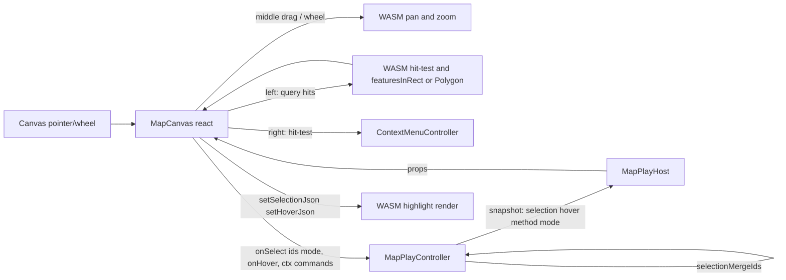

# Map: Hover, Selection, Context-Menu Panning

## Decisions (confirmed)

- Pan = middle/wheel-button drag; scroll wheel keeps zooming; left button = select/marquee; right button = context menu.
- Context menu: feature actions (Select, Deselect, Focus/zoom to, Open source for positions) + empty-canvas actions (Select all, Clear selection, Fit world).
- Marquee: rectangle + lasso, with toolbar to switch method and pick default/additive/subtractive/invertive mode; partial-vs-full from drag direction; applies to Positions and Routes.

## Architecture / division of labor

WASM owns camera math + projection, so it stays the source of truth for pan and for projecting features to screen. Merge-mode logic stays in JS (shared `@semio-tech/ui-react` helpers). The React canvas draws the marquee/context-menu; the play controller owns the authoritative selection set.

## 1. Rust WASM — `[gis/map/rs/lib.rs](gis/map/rs/lib.rs)`

- Gate pan to middle button: in `pointer_down_screen` (line ~1729) start `MapInteraction::Pan` only when `button == 1`; leave `pointer_move_screen`/`pointer_up_screen` for pan, dropping the left-click-selects branch (selection now done via explicit query methods).
- Add projection-based query methods on `MapHost` + wasm wrappers (near the `MapSession` impl, line ~2628):
  - `hit_test_feature(sx,sy) -> {kind,id}|null` — extend existing `hit_test_position` (line ~1767) and add `hit_test_route` (point-to-segment distance on projected polyline; threshold from `ui_styling::strokes`).
  - `features_in_rect_json(x0,y0,x1,y1,crossing)` and `features_in_polygon_json(points,crossing)` — positions via point-in-rect/point-in-polygon; routes via "all vertices contained" (full) vs "any segment intersects" (partial/crossing). Returns `{positions:[],routes:[]}`.
  - `feature_screen_json(kind,id)` — generalize `position_screen_json` (line ~1784) for popup/anchor.
- Add highlight state + setters: `selected_positions`/`selected_routes: BTreeSet<String>`, `hovered: Option<(kind,id)>`, with `set_selection_json` / `set_hover_json`. Add to struct (line ~1381) + `Default` (line ~1411).
- Render highlight: in `append_positions` (line ~2371) and `append_routes` (line ~2348), draw selected with active color + thicker stroke/halo and hovered with a hover tint. Extend `MapThemePalette` + `serializeMapVelloThemeJson` (`[gis/map/react/index.tsx](gis/map/react/index.tsx)` line ~480) with `selectionStroke`/`hoverStroke` from existing semantic CSS vars (`--color-active-base`, hover panel vars).
- Extend the Rust `#[cfg(test)]` block (the `drain_events`/selectPosition test ~line 3134) with route hit-test, rect crossing-vs-full, and hover cases.

## 2. React canvas — `[gis/map/react/index.tsx](gis/map/react/index.tsx)`

- New `MapCanvasProps`: `selectedPositionIds`, `selectedRouteIds`, `hoveredFeature`, `selectionMethod`, and callbacks `onSelect(payload:{positions,routes,mode,crossing})`, `onHoverChange(feature|null)`, `onContextMenu(payload)`.
- Rewrite pointer handlers (currently single left-drag pan, line ~1165):
  - Left down/move/up: build screen-space marquee path; coverage via `marqueeCoverageFromGesture`; on move query `features_in_rect_json`/`features_in_polygon_json` for live preselect + render `SelectionMarquee`; on up, if movement < threshold treat as click → `hit_test_feature`, else marquee hits; compute `mode = marqueeModeFromModifiers(event)`; call `onSelect`.
  - Middle button down/move/up → WASM `pointerDownScreen(...,1)` pan path.
  - Right button (`onContextMenu`/pointerdown button 2) → `hit_test_feature` then open `ContextMenuController` at cursor with items from props.
- Keep wheel zoom as-is (line ~1121). Push `selected*`/`hovered` to WASM via `setSelectionJson`/`setHoverJson` each change for highlight. Reuse the existing floating popup (line ~1222) as a hover tooltip for positions.
- Import `SelectionMarquee`, `marqueeCoverageFromGesture`, `marqueeModeFromModifiers`, `ContextMenuController`, `ContextMenuItem` from `@semio-tech/ui-react`. Extend the `import.meta.vitest` tests with hit/serialization coverage.

## 3. Play controller — `[gis/map/play/index.ts](gis/map/play/index.ts)`

- Replace single `selectedFeatureId`/`selectedFeatureKind` (lines ~621, ~783) with `selectedPositionIds: string[]`, `selectedRouteIds: string[]`, `hoveredFeatureId`/`hoveredFeatureKind`, `selectionMode: SelectionMergeMode`, `selectionMethod: "rectangle"|"lasso"`.
- Commands: `setSelection` (multi + mode via `selectionMergeIds` per kind), `setSelectionMode`, `setSelectionMethod`, `clearSelection`, `setHover`, plus context-menu commands `focusFeature` (center/zoom camera to feature), `deselect`, `selectAll`, `fitWorld`, `openSource`.
- Add toolbar tools mirroring `buildProcedural2dPlayToolbarTools` (`[procedural/2d/play/index.ts](procedural/2d/play/index.ts)` line ~307): rectangle/lasso + 4 modes + clear; attach to `mainMode.tools`; rebuild on change.
- Update `buildMapPlayDocumentTree` (line ~268): multi `selectedIds` from both kinds, hover via `onPointerEnter`/`onPointerLeave` → `setHover`. Update `buildMapPlayInspectorTree` (line ~347) to handle 0/1/many selected (single keeps current editor; many shows count). Add selection/hover/method/mode to the snapshot + `interactionRevision` bump. Extend the play `vitest` block (multi-kind merge + toolbar build).

## 4. Framework host — `[framework/product/playground/renderer/react/index.tsx](framework/product/playground/renderer/react/index.tsx)` (MapPlayHost ~line 6062)

- Read selection/hover/method from controller/snapshot and pass to `MapCanvas`; wire `onSelect`/`onHoverChange` → `ctrl.run("setSelection"/"setHover")`.
- Build `ContextMenuItem[]` from controller state/commands (feature vs empty-canvas) and pass via `onContextMenu`.

## 5. Build & verify

- Rebuild the map WASM pkg (Rust changed) via the gis map build target, then run the map play app and confirm at runtime (console logs prefixed `[DEBUG] `): hover highlight, left click/marquee select with each mode, middle-drag pan, wheel zoom, right-click menu actions on Positions and Routes. Run the Rust + vitest suites.

## Ticket

Open repo MCP, read `repo://goals`, then reopen/open the matching ticket and keep all temp artifacts under its folder; close with a summary on completion.
