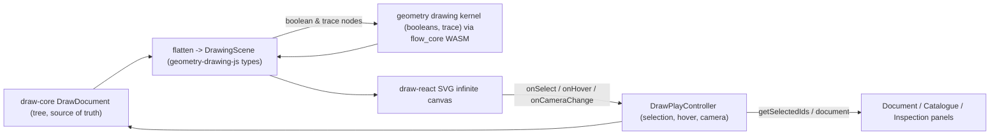

## Draw: Non-Destructive Vector Graphics Technology

### Decisions (confirmed)

- Engine: reuse, extend, and generalize the existing geometry drawing kernel (`geometry/drawing/engine` + `geometry/drawing/rs`, exposed through `flow/module/draw` -> `flow/core` WASM -> `@semio-tech/geometry-drawing-js`). No new compositor.
- Renderer: pure-TS `draw-core` document tree (source of truth) + SVG infinite-canvas renderer in `draw-react`. Booleans and trace are non-destructive nodes recomputed live via the kernel.
- Trace: autotrace (bitmap -> editable vector paths) as a non-destructive layer that re-derives from its source image.

### Architecture / data flow

The non-destructive rule: a `boolean` layer stores its op + children and computes the merged path live through the kernel; a `trace` layer stores its source image key + trace params and re-derives paths live. Editing params/children re-runs the kernel; nothing is baked.

### 0. Ticket (repo MCP)

- Read `repo://goals`, associate, and `ticket_open` (or `ticket_reopen` if one covers this). The repo MCP server was not ready during planning; retry at execution start. Keep any temp/debug artifacts inside the ticket folder.

### 1. Extend + generalize the geometry drawing kernel

- `[geometry/drawing/engine/lib.rs](geometry/drawing/engine/lib.rs)`: add a `Trace` region to the `DrawingKernel` trait: `trace_bitmap(width, height, mask_or_luma: &[u8], threshold, simplify_epsilon, ...) -> Result<DrawingHandle, DrawingError>` producing a `Path`. Generalize `Booleans` with an `xor` op and an n-ary `bool_op_many`.
- `[geometry/drawing/rs/lib.rs](geometry/drawing/rs/lib.rs)`: implement the new trait methods in `DrawingStore` (new `#region Trace`): marching-squares contour extraction + Douglas-Peucker simplification (behind a `trace` cargo feature, mirroring the existing `booleans` feature in `[geometry/drawing/rs/booleans.rs](geometry/drawing/rs/booleans.rs)`). Add `xor` to `boolean_paths`.
- `[geometry/drawing/js/index.ts](geometry/drawing/js/index.ts)`: extend `DrawingWasmBridge`/`DrawingExportBridge` with `traceBitmap(...)` and `booleanPaths(a, b, op)` ports + the WASM glue in the `WasmBridge` region; extend inline vitest.
- `flow/module/draw` + `[flow/core/lib.rs](flow/core/lib.rs)`: expose `trace_drawing(...)` / boolean-on-segments WASM exports next to the existing `render_drawing_scene` / `export_drawing_svg` re-exports; rebuild flow_core WASM.

### 2. `draw/core/index.ts` (new package `@semio-tech/draw-core`)

Mirror `[raster/core/index.ts](raster/core/index.ts)` structure (regions: Header, Types, Helpers, TreeIds, EditOps, Tests).

- Schema `draw.document/v1`. `DrawCamera {x,y,zoom}` (infinite canvas), `DrawTransform`, `DrawAttributes` (fill/stroke/opacity/blendMode) reusing `FillStyle`/`StrokeStyle` from geometry-drawing-js behind a thin interface.
- Layer union `DrawLayerNode` extending `DrawLayerBase {id,name,visible,locked,opacity,blendMode,transform,attributes}`:
  - `shape` (rect/ellipse/circle/line/polygon), `path` (explicit segments / pen), `text`, `image`, `group {children}`, `boolean {op, children}` (non-destructive), `trace {sourceKey, params}` (non-destructive autotrace).
- `DrawEditOp` union + `applyDrawEditOp`: visibility/opacity/blend/name/lock, add\*/duplicate/reorder/delete, setBooleanOp, setFill/setStroke, setTraceParams, transform, setCamera, setActiveTool, plus pen point edits.
- Factories, `parseDrawDocument`, `draw...ToJson`/`fromJson`, traversal (`findDrawLayer`, `flattenDrawLayers`), hit-testing (`resolveDrawLayerAtPoint`, marquee), tree row IDs (`DRAW_PLAY_TREE_PREFIX`, `drawPlayLayersTreeRowId`, reverse mapping, hover payloads) — mirroring raster's TreeIds region for document sync.
- `flattenDrawDocumentToScene(doc)` -> `DrawingScene`, where boolean/trace nodes are emitted with the kernel-resolved geometry injected by the renderer (kernel calls live in react).

### 3. `draw/react/index.tsx` (new package `@semio-tech/draw-react`)

Mirror `[raster/react/index.tsx](raster/react/index.tsx)` contract (`DrawCanvas` props: `document`, `camera`, `selectedIds`, `hoveredId`, `activeTool`, `onCameraChange`, `onHover`, `onSelect`, `onDocumentChange`).

- SVG infinite canvas: root `<g transform=...>` from camera; wheel zoom + drag/middle pan (reuse camera conventions from `[infinite/cavas/react-renderer/index.tsx](infinite/cavas/react-renderer/index.tsx)`).
- Render flattened scene as SVG paths/shapes; visibility/opacity/blend/attributes applied per node.
- Non-destructive resolution: `ensureDrawingWasmLoaded` + bridge to compute boolean/trace geometry, memoized by a node fingerprint; trace decodes the image asset to a luma/alpha buffer and calls `traceBitmap`.
- Selection: reuse `@semio-tech/ui-react` `SelectionMarquee`, `selectionMergeIds`, `marqueeCoverageFromGesture` + core hit-testing; emit `onSelect`/`onHover`.
- Tools: select, pen (path), shapes (rect/ellipse/line/polygon), boolean (combine selection), trace. Inline vitest.

### 4. `draw/play/index.ts` (new package `@semio-tech/draw-play`)

Mirror `[raster/play/index.ts](raster/play/index.ts)`.

- `DrawPlayController extends Controller`: holds document, `selectedIds`, `hoveredId`, camera, interaction revision; commands `setSelection`, `setHover`, `setActiveTool`, `addLayer`, `dropLayerKind`, `moveLayer`, `deleteLayer`, `duplicateLayer`, `toggleLayerVisible`, `combineBoolean`, `setFill`, `setStroke`, `setTraceParams`, `setCamera`, `setActiveFixture`, `saveDownload`, `loadRequest`.
- Tree builders using canonical tab IDs (`framework.panel.document/catalogue/inspection`): `buildDrawPlayLayersTree` (layer tree w/ visibility toggle, DnD reorder, boolean/group nesting), `buildDrawPlayCatalogueTree` (draggable shapes/tools/boolean ops), `buildDrawPlayInspectorTree` (fill/stroke/opacity/transform/trace params via `uiDeclarativeSectionsToTree`). DnD via `createDrawPlayDocumentTreeDragController` (MIME `application/x-semio-draw-layer-id` / `-kind`).
- Fixtures via `import.meta.glob("../fixture/*.draw.json")`; `draw/play/fixture-slugs.ts` (default `semio`). Window kinds (Canvas + Navigator), `PlaygroundDraw extends Playground`, boot entry guarded by `PUZZLE_PLAY_ENTRY === "draw"`. Add `globals.css`, `index.html`, `vite.config.ts` (`createPlaygroundPlayViteConfig({ playEntryKind: "draw", ... aliases })` mirroring `[raster/play/vite.config.ts](raster/play/vite.config.ts)`).

### 5. Framework wiring

- `[framework/product/platform/core/index.ts](framework/product/platform/core/index.ts)`: add `"draw"` to `ComponentKind` + `CANVAS_COMPONENT_KINDS`; define `UiDrawHostSurfaceNode` and `buildDrawWindowBody(...)` mirroring the raster surface node/builder.
- `[framework/product/playground/renderer/react/index.tsx](framework/product/playground/renderer/react/index.tsx)`: new `//#region 🔖DrawPlayHost` with `registerUiDrawSurfaceHost`, `DrawPlayPaneSurfaceHost` (-> `DrawCanvas`), `DrawPlay{Layers,Catalogue,Inspection}PanelDefinition`, `DrawPlayFileBridge` (import/export `.draw.json`), `bootDrawPlay(playground)` mounting `PlaygroundView` with `augmentPanelTabs={ workbench:[layers,catalogue], details:[inspection] }`; add `"draw"` to `PLAYGROUND_CANVAS_HOST_TYPES`.
- `framework/product/playground/renderer/react/package.json`: add `"./draw"` export + `@semio-tech/draw-*` workspace deps (mirror the raster lines at 22, 56-58).

### 6. Repo plumbing (zero-touch, cross-platform)

- Root `[package.json](package.json)`: add `draw/core`, `draw/react`, `draw/play` to `workspaces`; add `dev:draw`, `build:draw`, `test:draw` scripts mirroring lines 47-49, 120-124.
- Root `script.ts`: ensure `dev draw` maps to the draw-play dev (mirror `dev raster`).
- `[.vscode/launch.json](.vscode/launch.json)`: add `🛠️dev✏️draw` entry mirroring the raster block at line 833, following existing order/grouping.
- Each new package gets `package.json` (`@semio-tech/draw-{core,react,play}`), `project.json` (delegating to `bun ./script.ts ...`), `script.ts`, and `vitest.config.ts` mirroring raster. `draw-react` test builds flow_core WASM first (trace/boolean exports).

### 7. Semio logo fixture

- `draw/fixture/semio.draw.json` (`draw.document/v1`): import the three emblem shapes from `[asset/logo/emblem.svg](asset/logo/emblem.svg)` (orange `#fa9500`, red `#ff344f`, teal `#34d1bf`, stroke `#001117`) as `path` layers grouped under a "Semio Emblem" group with full attributes; include one non-destructive `boolean` layer and one `trace` layer (autotraced from an embedded emblem raster asset) to showcase the mechanisms. Register slug `semio` as default.

### 8. Verify (runtime, not assumed)

- `bun nx run @semio-tech/draw-core:test`, `@semio-tech/draw-react:test`, `@semio-tech/draw-play:test`, plus geometry kernel + flow_core tests.
- `bun run dev:draw`, load the semio fixture, confirm via console logs (`[DEBUG] ` prefixed) that document selection <-> canvas selection <-> inspection details sync, visibility toggles, booleans recompute live, and the trace layer derives paths. Close the ticket with a summary + file list.
