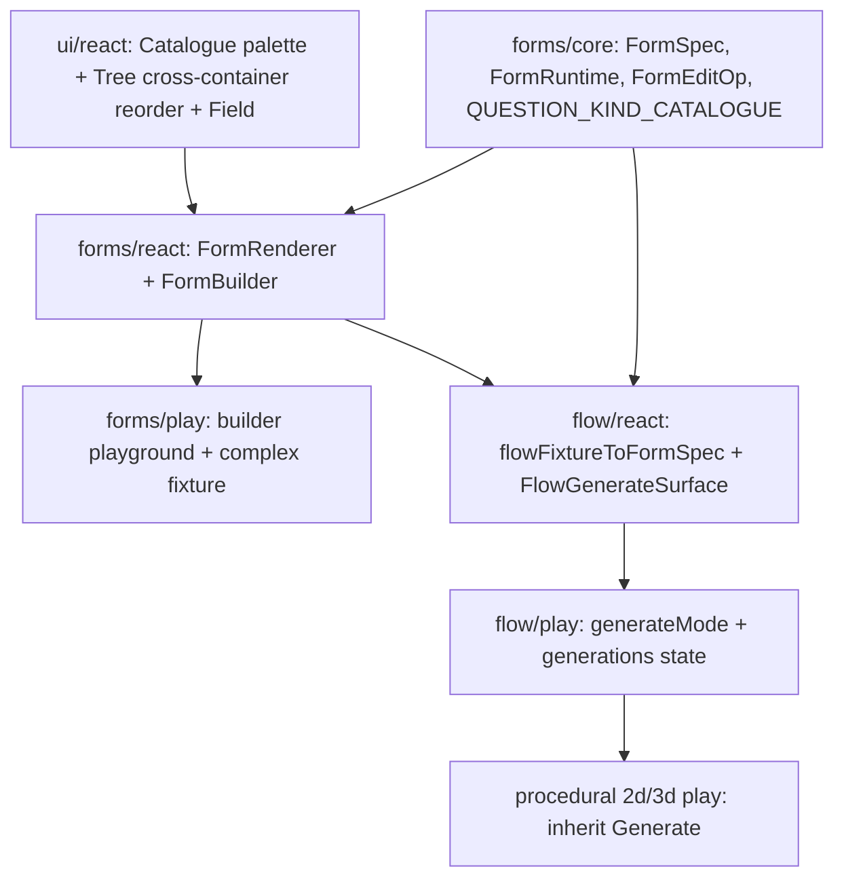

## Forms Technology And Generate Mode

A form is pure declarative data, mirroring CAD's "interactions are just data" pattern (`cad/js/core` `InteractionSpec` parsed/run by `InteractionRuntime`). We build:

1. `forms` technology: `forms/core` (types + parser + runtime + edit ops + catalogue), `forms/react` (renderer + builder), `forms/play` (playground), fixtures.
2. Generalized `ui` mechanisms reused by forms and others: a draggable `Catalogue` palette and cross-container tree reorder with drop indicators.
3. A second flow app mode `Generate` (alongside the single `mainMode = ModeRuntime("main","Edit")` in [flow/play/index.ts](flow/play/index.ts) line 466) that compiles flow input widgets into a `FormSpec` and manages named "generations" (saved form submissions), each evaluated through the existing worker pipeline and previewed. Procedural 2d/3d inherit via shared `@semio-tech/flow-play` / `@semio-tech/flow-react` building blocks.

### Architecture

## Part 1 — `forms` technology

### 1a. `forms/core/index.ts` (`@semio-tech/forms-core`, pure TS like `cad/js/core`)

- `FormSpec` (`schema: "forms.form/v1"`, `id`, `version`, `title?`, `steps: FormStep[]`); `FormStep { id, title, description?, questions: FormQuestion[] }`.
- `FormQuestion` discriminated union on `kind` with shared fields `{ id, label, description?, required?, default?, placeholder?, condition? }`. Predefined kinds: `text`, `longText`, `number`, `slider` (min/max/step/unit), `boolean`, `single` (select/dropdown; options), `multi` (multi-select; options), `date`, `color`, `vector` (stepper fields), `note` (display only), `image`, `file`.
- `QUESTION_KIND_CATALOGUE`: array describing each kind (id, label, iconId, defaults) — drives the builder palette.
- Strict `parseFormSpec(raw)` rejecting executable fields (mirror `parseInteractionSpec`).
- `FormRuntime`: holds per-question values, computes visibility (`condition`) + validation, step navigation, and `submit()` -> values map. Tagged-expression `condition` evaluator (small, like CAD `evalExpr`).
- `FormEditOp` union (`addStep`/`removeStep`/`moveStep`/`addQuestion`/`removeQuestion`/`moveQuestion` with target step + index) and `applyFormEditOp(spec, op)` (mirrors flow's `FlowGraphEditOp`). This powers add/remove/reorder/cross-step moves.
- In-file vitest region covering parse, runtime validation/visibility, and every edit op.

### 1b. `forms/react/index.tsx` (`@semio-tech/forms-react`, depends only on `@semio-tech/ui-react` + `@semio-tech/forms-core`)

- `FormRenderer`: renders a `FormSpec` as an interactive multi-step form (one step at a time + progress), mapping each `kind` -> existing ui control (`Input`, `Textarea`, `Slider`, `Stepper`, `Select`, `ToggleGroup`, `Toggle`, color, date). Uses the new ui `Field` wrapper for label/description/required/validation.
- `FormBuilder`: builder workspace combining (a) document `Tree` of steps (group items) with questions as children, (b) the new ui `Catalogue` palette listing `QUESTION_KIND_CATALOGUE` as draggable rows, (c) drag-from-catalogue-to-add and cross-step reorder via the new ui reorder controller emitting `FormEditOp`, (d) inline question property editing (selected item -> property tree), and (e) a live `FormRenderer` preview.

### 1c. `forms/play/` (`@semio-tech/forms-play`)

- `index.html`, `index.ts` (FormsPlayController + `PlaygroundForms`), `fixture-slugs.ts`, `script.ts`, `vite.config.ts` (`playEntryKind: "forms"`), `project.json`, `package.json`, `globals.css` — mirror [procedural/2d/play](procedural/2d/play/index.ts).
- Windows: a Builder window (FormBuilder) + a Preview window (FormRenderer). Toolbar via `ToolNode` tree (per [ribbon plan](.cursor/plans/ribbon_tool_tree_d547d671.plan.md)).

### 1d. Fixtures `forms/fixture/`

- `default.forms.json` (simple) and a sophisticated `onboarding.forms.json` exercising every question kind, multiple steps, conditional visibility, validation, defaults (the "complex fixture that uses all features").

## Part 2 — Generalized `ui` mechanisms ([ui/react/index.tsx](ui/react/index.tsx))

Add to existing `#region`s (no new files; ui stays business-logic-free):

- `Catalogue` palette component: generalizes the per-tech palette pattern (`windowTemplatePaletteTreeDragController` ~line 18793, puzzle `*FixturePaletteTreeDragController`) into a reusable draggable kind-list + `catalogueTreeDragController(mime)` factory.
- Cross-container tree reorder: extend `TreeDragAndDropController` (~line 9554) with drop position (`before`/`after`/`inside`) and add a `useTreeReorder`/drop-indicator render so a `Tree` item can be reordered within a parent and moved across parents (steps). Build on existing native-DnD `handleDrop` + `SortableTreeItems` (line 10444).
- `Field` primitive: label + description + required marker + validation message + control slot (property-row layout), reused by `FormRenderer` and other inspectors.
- Extend in-file vitest region for reorder op derivation and catalogue drag data.

## Part 3 — flow `Generate` mode (inherited by procedural)

### 3a. flow/react ([flow/react/index.tsx](flow/react/index.tsx))

- `flowFixtureToFormSpec(fixtureJson)`: maps input widgets (`FlowWidgetV1` line ~534: `inputSlider`->`slider`, `inputStepper`->`vector`, `inputNote`->`note`, `inputImage`->`image`, `variable`->`text`/`single` by schema) plus enum/select -> `single` question. Depends on `@semio-tech/forms-core`.
- `FlowGenerateSurface`: a React surface rendering generations list (add/remove/select), the selected generation's `FormRenderer`, and its preview output; emits value changes + "generate" requests to the controller.

### 3b. flow/play ([flow/play/index.ts](flow/play/index.ts))

- Add `readonly generateMode = new ModeRuntime("generate", "Generate", undefined)`; register both modes (extend `createPlayAppRuntime` at [framework/product/playground/core/index.ts](framework/product/playground/core/index.ts) line 498 to accept extra modes, or `app.addMode(generateMode)` after creation, following the `browseMode` pattern at lines 736/841).
- Controller state: `generations: { id, name, values }[]` with add/remove/update commands. A generation is evaluated by overriding input-widget values in the fixture then reusing the existing worker eval + `tessellatePreviews` pipeline ([flow/worker.ts](flow/worker.ts)); preview rendered per generation.
- Generate-mode window/body registration switches the main surface to `FlowGenerateSurface`; serialize `generations` as an optional field on the flow document.

### 3c. procedural inheritance

- Wire the same generate-mode building blocks into `Procedural2dPlayController` / `Procedural3dPlayController` ([procedural/2d/play/index.ts](procedural/2d/play/index.ts), [procedural/3d/play/index.ts](procedural/3d/play/index.ts)) so 2d/3d get Generate using their own preview panes.

## Part 4 — Registration / wiring

- Root [package.json](package.json): add `forms/core`, `forms/react`, `forms/play` to `workspaces` + `dev:forms`/`build:forms`/`test:forms` scripts.
- Root [script.ts](script.ts): route `forms` segment to `@semio-tech/forms-play:dev`.
- [repo/lib/js/index.ts](repo/lib/js/index.ts): add `"forms"` to `PlaygroundHostKind` and `PLAYGROUND_PORTS` (dev `6058`, test `6059` — next free after 6056/6057).
- [.vscode/launch.json](.vscode/launch.json): add a `3_dev` group entry `dev:forms` with port env + `serverReadyAction` (follow existing order/grouping/naming).
- [framework/product/playground/renderer/react/package.json](framework/product/playground/renderer/react/package.json): add `"./forms"` export; implement `bootFormsPlay` region in the renderer mirroring `bootProcedural2dPlay`.

## Repo process & constraints

- Per repo rules: read `repo://goals`, open/reopen a ticket, keep temp artifacts in the ticket folder, structure all code with `#region`s, extend existing test files (no new test files), no migrations/adapters, all external libs behind interfaces, docstrings start with an emoji.
- Greenfield clean break: no compat layer; the single `Edit`-only flow mode becomes `Edit` + `Generate`.
- Verify at runtime via launch.json (forms play; flow + procedural 2d/3d Generate mode) with console logs before closing, per rules.
