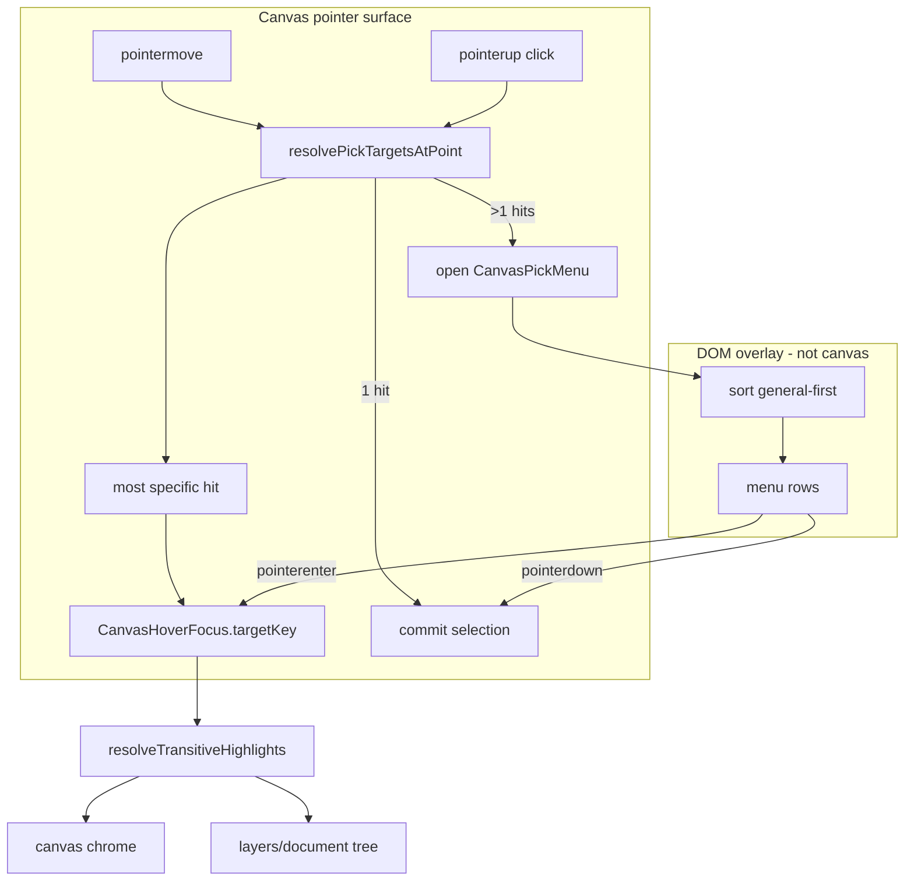

# Unified Canvas Pick Disambiguation

## Goal

When a pointer click hits multiple targets, show a **fixed DOM list** (not painted on the infinite canvas). Hovering a list item is the **only** active hover target, with **transitive** highlights on canvas + side panels (groups, same-kind rows, etc.). List items are ordered **most general first** (group → layer/path → control point). **Canvas pointer-move hover** (menu closed) uses the **most specific** hit only.

## Reference already in repo

[CAD spatial renderer](cad/js/renderer/index.tsx) already implements the desired UX inline:

- Multi-hit resolution: `spatialPickTargetsFromClientPoint` → `SpatialSelectionRequest`
- Single-hit → commit; multi-hit → `selectionMenu` DOM popover (~5910–5941)
- List item `onPointerEnter` → `setHoveredPickKey`; canvas shows one hovered target
- [AppPointerFocusStore](framework/core/index.ts) (~748–848) arbitrates hover between canvas and document (used in [cad/js/renderer/play/index.tsx](cad/js/renderer/play/index.tsx))

This ticket **extracts** that pattern into shared infrastructure and **migrates every canvas app**, including CAD, in one pass.

## Layer 1 — Shared protocol (`framework/core`)

Add a new `#region CanvasPick` beside existing `#region AppPointerFocus`:

| Type                                | Purpose                                                                                                 |
| ----------------------------------- | ------------------------------------------------------------------------------------------------------- |
| `CanvasPickTarget`                  | `{ domain, id, generality, label?, meta? }` — stable `canvasPickTargetKey(target) => "${domain}:${id}"` |
| `CanvasPickRequest`                 | `{ targets, client, modifiers, world? }`                                                                |
| `CanvasHoverFocus`                  | `{ targetKey: string \| null, kindHover: { domain, kindId } \| null, sourceId: string \| null }`        |
| `sortCanvasPickTargetsGeneralFirst` | Sort by ascending `generality`, tie-break domain/id                                                     |
| `pickMostSpecificCanvasTarget`      | Sort by descending `generality` (or explicit `specificity` rank) for canvas move hover                  |

Extend `AppPointerFocusStore<TKey>` (or add thin `CanvasHoverFocusStore`) with:

- Known source ids: `"canvas"`, `"pick-menu"`, `"document"`, `"catalog"`
- `setHoverFocus(sourceId, focus: CanvasHoverFocus)` — **replaces** raw key when apps adopt unified model
- Existing per-app `DrawKindHover`, `RasterKindHover`, `Puzzle2dKindHover`, etc. remain; each app maps them to/from `CanvasHoverFocus.kindHover`

**Domain generality tables** (each technology exports constants used by hit resolvers):

| App                     | General → specific domains                                                 |
| ----------------------- | -------------------------------------------------------------------------- |
| Draw                    | `group` → `boolean`/`trace`/`shape`/`path`/`text`/`image` → `controlPoint` |
| Raster                  | `group` → `adjustment`/`mask` → `pixel`                                    |
| Flow / Puzzle2D (graph) | `node` → `edge`/`wire` → `handle`                                          |
| Puzzle3D                | `object` → `attraction` → `vortex`                                         |
| Writer                  | `document` → `block`/`line` → `token`/`caret`                              |
| CAD (existing)          | `object` → `face` → `edge` → `vertex`                                      |

## Layer 2 — Shared DOM UI (`ui/react`)

Add `#region CanvasPickMenu` (extract from CAD ~5910–5941):

- **`CanvasPickMenu`**: fixed-position portal to `document.body`, `pointer-events` isolated, Escape/outside-click dismiss
- Props: `request: CanvasPickRequest | null`, `hoveredKey`, `renderRow(target)`, `onHoverKey`, `onPick(target)`, `onDismiss`
- Reuse existing floating menu classes (`floatingMenuSurfaceClass`, `floatingMenuItemClass`) and `SelectionMarquee` patterns already in [ui/react/index.tsx](ui/react/index.tsx)

Add **`useCanvasPickInteraction`** hook:

- Owns `pickMenu`, `hoveredKey`, integrates `AppPointerFocusStore`
- `onCanvasPointerMove` → most-specific target → `onHoverFocus`
- `onCanvasPointerUp` (short click) → if `targets.length > 1` open menu (general-first sorted); else `onSelect`
- Menu open: canvas move hover paused; menu row hover owns focus
- Dismiss on Escape, outside pointerdown, selection commit

## Layer 3 — Per-technology hit resolvers

Each core module gains **`resolve*PickTargetsAt*`** returning **all** hits at a point (not just topmost):

### TypeScript document apps

- [draw/core/index.ts](draw/core/index.ts): `resolveDrawPickTargetsAtScreenPoint`
  - Include ancestor **groups** containing the hit leaf
  - Include **control points** when direct-select / pen tool active (path segments)
  - Respect `visible` + `locked`
  - Replace `resolveDrawLayerAtScreenPoint` usage in [draw/react/index.tsx](draw/react/index.tsx) with shared hook

- [raster/core/index.ts](raster/core/index.ts): `resolveRasterPickTargetsAtScreenPoint` (groups + pixel layers under point)

### Rust graph engine (Flow + Puzzle2D)

- [mathematical/graph/lib.rs](mathematical/graph/lib.rs): add `hit_test_all(point) -> Vec<HitObject>` collecting **all** matching handles, nodes, edges (not first-match return at ~1964)
- Expose via [flow/core/lib.rs](flow/core/lib.rs) and [puzzle/2d/rs/lib.rs](puzzle/2d/rs/lib.rs) WASM JSON APIs: `pickTargetsAtScreenJson(sx, sy)`
- [flow/react/index.tsx](flow/react/index.tsx) + [puzzle/2d/react/index.tsx](puzzle/2d/react/index.tsx): wire `useCanvasPickInteraction`; map graph hits to `CanvasPickTarget` with generality ranks

### Writer

- [writer/rs/lib.rs](writer/rs/lib.rs): `hit_test_all_offset` (line, token span, caret) exposed to React
- [writer/react/index.tsx](writer/react/index.tsx): pick menu for overlapping text targets

### Puzzle3D

- [puzzle/3d/react/index.tsx](puzzle/3d/react/index.tsx): generalize existing brush/indirect pick menu pattern (~10428) to **selection** picking via shared `CanvasPickMenu`; raycast returns all candidates sorted

### CAD refactor

- Replace inline `selectionMenu` JSX in [cad/js/renderer/index.tsx](cad/js/renderer/index.tsx) with shared `CanvasPickMenu`
- Map `SpatialPickTarget` ↔ `CanvasPickTarget`; **re-sort menu** to general-first (today CAD menu uses ray distance order, not generality)

## Layer 4 — Transitive hover wiring (playground + controllers)

Each play controller already has `setHover` + `kindHover` + tree highlight mappers. Unify the contract:

1. **Single hoverable**: `hoveredId` / `targetKey` is always one instance (or `null`)
2. **Transitive expansion**: existing helpers stay, driven by the one focus:
   - Draw/Raster: `drawPlayLayersTreeHighlightedIds`, group descendant leaf expansion
   - Puzzle2D/3D: `puzzle2dPlayDocumentTreeHighlightedIdsForKind`, etc.
   - Flow: widget preselect/hover chrome synced from pick focus

Update [framework/product/playground/renderer/react/index.tsx](framework/product/playground/renderer/react/index.tsx) pane hosts (`DrawPlayPaneSurfaceHost`, raster/flow/writer/puzzle hosts) to:

- Pass `CanvasHoverFocus` through props
- Route pick-menu hover through same `setHover` commands as canvas/tree
- Use `AppPointerFocusStore` source arbitration everywhere (today only CAD uses it)

## Layer 5 — Tests

Extend existing test files (no new test files per repo rules):

- [framework/core/index.ts](framework/core/index.ts): sort general-first / pick-most-specific; hover source arbitration with pick-menu source
- [ui/react/index.tsx](ui/react/index.tsx): `CanvasPickMenu` hover + dismiss behavior
- [draw/core/index.ts](draw/core/index.ts): multi-hit stack includes group + leaf; generality ordering
- [mathematical/graph/lib.rs](mathematical/graph/lib.rs): `hit_test_all` when node + handle overlap
- CAD: existing spatial pick tests still pass after refactor

## Ticket workflow

Open repo ticket (MCP was unavailable during planning) e.g. `26/07/01/CANVAS-PICK-DISAMBIGUATION`, associate with the infinite/canvas product goal when MCP is back.

## Out of scope

- Geometry-accurate path fill/stroke hit testing (AABB/path kernel accuracy is a separate improvement)
- Marquee multi-select semantics (unchanged; only **click disambiguation** and **hover focus** unify here)
- Puzzle5D unless it already shares puzzle play hover stores (can follow same adapter pattern if wired in playground)

## Key files to touch

| Area                    | Files                                                                                                                                                        |
| ----------------------- | ------------------------------------------------------------------------------------------------------------------------------------------------------------ |
| Shared protocol         | [framework/core/index.ts](framework/core/index.ts)                                                                                                           |
| Shared UI + hook        | [ui/react/index.tsx](ui/react/index.tsx)                                                                                                                     |
| Draw                    | [draw/core/index.ts](draw/core/index.ts), [draw/react/index.tsx](draw/react/index.tsx), [draw/play/index.ts](draw/play/index.ts)                             |
| Raster                  | [raster/core/index.ts](raster/core/index.ts), [raster/react/index.tsx](raster/react/index.tsx)                                                               |
| Graph / Flow / Puzzle2D | [mathematical/graph/lib.rs](mathematical/graph/lib.rs), [flow/react/index.tsx](flow/react/index.tsx), [puzzle/2d/react/index.tsx](puzzle/2d/react/index.tsx) |
| Writer                  | [writer/rs/lib.rs](writer/rs/lib.rs), [writer/react/index.tsx](writer/react/index.tsx)                                                                       |
| Puzzle3D                | [puzzle/3d/react/index.tsx](puzzle/3d/react/index.tsx)                                                                                                       |
| CAD                     | [cad/js/renderer/index.tsx](cad/js/renderer/index.tsx)                                                                                                       |
| Playground wiring       | [framework/product/playground/renderer/react/index.tsx](framework/product/playground/renderer/react/index.tsx)                                               |
