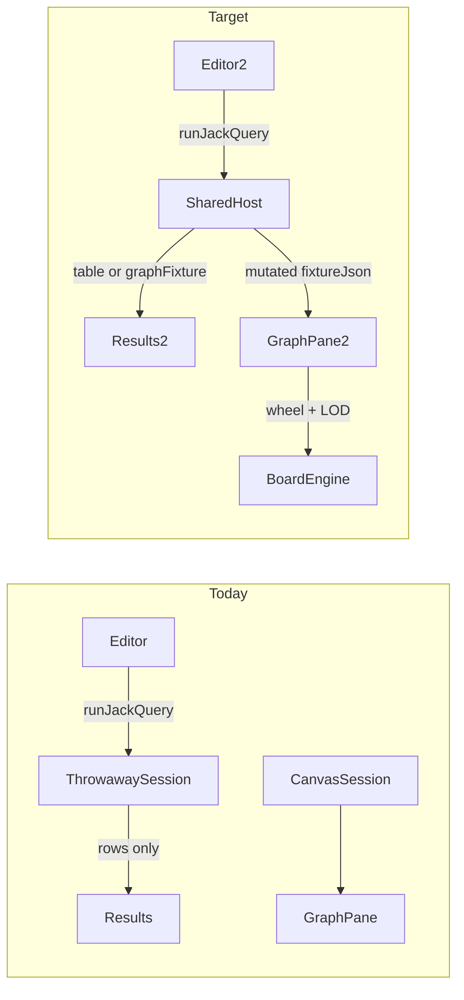

# Finish Jack Play

## Current gaps

Jack language core and 3-pane layout exist ([trinity/jack/play/index.ts](trinity/jack/play/index.ts), prior [jack_editor plan](.cursor/plans/jack_editor_d8478103.plan.md)), but integration is still adhoc:


| Area                   | Problem                                                                                                                                                                                                                                                                   |
| ---------------------- | ------------------------------------------------------------------------------------------------------------------------------------------------------------------------------------------------------------------------------------------------------------------------- |
| **Results pane**       | `TrinityJackPlayController.bump()` calls `emit()` → `runtime.notify()` (bumps `generation`), but `useTrinityJackController` only subscribes to `chromeGeneration`. Unlike DAG play (`useDagPlayInteractionRevision`), Jack surfaces never re-render after `runJackQuery`. |
| **Jack RETURN**        | `build_return` in [trinity/jack/core/lib.rs](trinity/jack/core/lib.rs) always produces scalar rows; `RETURN a, r, b` coerces nodes to name strings — no graph result.                                                                                                     |
| **Query → graph sync** | `runJackOnFixture` spins a throwaway WASM session; CREATE/SET/DELETE mutations never reach the canvas `docStore`.                                                                                                                                                         |
| **Canvas / LOD**       | [trinity/rewrite/engine/lib.rs](trinity/rewrite/engine/lib.rs) stubs LOD (`draw_lod_label` → `"normal"`, single-band `lodScaleJson`), custom `paint_scene` ignores zoom tiers, no wheel handler in [trinity/react/index.tsx](trinity/react/index.tsx).                    |
| **Fixtures**           | Only [nakagin-capsule-tower.trinity.json](trinity/fixture/nakagin-capsule-tower.trinity.json); no play fixture catalog or table/graph demos.                                                                                                                              |





## Architecture / boundaries

Follow the established 3-layer pattern (same as DAG / puzzle 2d):

```
trinity/jack/core     — Jack parse/execute (SSOT for query semantics)
trinity/ram           — Trinity graph model + fixture JSON
trinity/rewrite/engine — TrinityHost: syncs Graph ↔ BoardEngine, LOD paint, WASM session
trinity/react         — TrinityCanvas + Jack bridge types/helpers
trinity/jack/play     — PlayController, fixture catalog, window layout
framework/playground  — Surface hosts only (thin wiring)
mathematical/graph/port/directed — BoardEngine interaction geometry (already used)
infinite/cavas/lod    — Lod / LodScale primitives (shared 6-band scale)
```

**Do not** embed puzzle 2d `BoardHost` directly (fixture schema differs). **Do** reuse `Lod`/`LodScale`, `wheel_screen`, and `BoardEngine` pointer/camera APIs from mathematical/infinite.

---

## Phase 1 — Fix results + Jack graph RETURN

### 1a. Controller reactivity ([trinity/jack/play/index.ts](trinity/jack/play/index.ts))

Mirror [dag/play/index.ts](mathematical/graph/port/directed/dag/play/index.ts):

- Add `snapshotListeners`, `subscribeSnapshot()`, `notifySnapshot()`.
- Change `bump()` to call both `notifySnapshot()` and `emit()`.

### 1b. Renderer hook ([framework/product/playground/renderer/react/index.tsx](framework/product/playground/renderer/react/index.tsx) ~7000)

Add `useTrinityJackInteractionRevision(runtime)` (copy DAG pattern: subscribe to `runtime.subscribe` + `ctrl.subscribeSnapshot`, read `getInteractionRevision()`).

Use it in `TrinityJackPlaySurfaceHost`, `TrinityJackEditorSurfaceHost`, and `TrinityJackResultsSurfaceHost`.

Run initial query in `TrinityJackPlayController` constructor so Results is populated on boot.

### 1c. Extend `QueryResult` ([trinity/jack/core/lib.rs](trinity/jack/core/lib.rs))

```rust
pub enum QueryResultKind { Table, Graph }

pub struct QueryResult {
    pub kind: QueryResultKind,
    pub columns: Vec<String>,
    pub rows: Vec<Vec<PropertyValue>>,
    #[serde(skip_serializing_if = "Option::is_none")]
    pub graph_fixture: Option<GraphFixtureV1>, // trinity.graph/v1 subgraph
}
```

**Detection in `build_return`:**

- If any `ReturnItem::Var` binds to a **node or edge** in the row binding → `kind: Graph`.
- Collect unique node/edge ids across all binding rows; build subgraph via new helper `Graph::subgraph_fixture(node_ids, edge_ids)` in [trinity/ram/lib.rs](trinity/ram/lib.rs).
- Otherwise → `kind: Table` (existing scalar/property behavior).

Add tests:

- `RETURN a.name, b.name` → table rows.
- `MATCH (a:Piece)-[r:Connection]->(b:Piece) RETURN a, r, b` → graph fixture with 2 nodes + 1 edge.

### 1d. Query → main graph sync ([trinity/react/index.tsx](trinity/react/index.tsx), controller)

Add WASM export `runJackJsonWithFixture` returning `{ kind, columns, rows, graphFixture?, fixtureJson }` where `fixtureJson` is the **post-mutation** full graph (rebuild engine after execute).

Update `runJackOnFixture` → return typed `TrinityJackRunV1`.

In `runJackQuery`:

1. Run on current fixture JSON.
2. Set `jackResultJson` from result.
3. If query mutated graph (`fixtureJson` changed) → `commitFixture(parseTrinityFixtureJson(fixtureJson))`.
4. If `kind === Graph` and `graphFixture` present → store for results pane (may differ from main graph for MATCH-only queries).

### 1e. Results surface routing ([framework/product/playground/renderer/react/index.tsx](framework/product/playground/renderer/react/index.tsx))

`TrinityJackResultsSurfaceHost`:

- Parse result; if `kind === "graph"` and `graphFixture` → render `<TrinityCanvas fixtureJson={...} className="h-full" />` (read-only, no mutation).
- Else → existing HTML table.

Remove `[DEBUG]` console logs in Jack surface hosts once verified.

---

## Phase 2 — Mathematical zoom + LOD on Trinity canvas

### 2a. TrinityHost LOD ([trinity/rewrite/engine/lib.rs](trinity/rewrite/engine/lib.rs))

- Define `TRINITY_LODS` (same 6 `max_zoom` thresholds as [PUZZLE_2D_LODS](mathematical/graph/port/directed/normal/lib.rs)).
- Add `TrinityDrawLod` enum + `draw_lod_for_frame()` using `automatic_lod` / `forced_draw_lod_label` fields (replace no-ops).
- Replace stub `trinity_lod_scale_json()` with full 6-band scale.
- Refactor `paint_scene` to branch on LOD:
  - **minimap/overview**: node fills + edges only
  - **compact**: abbreviated names
  - **normal/micro**: full node names, port handles visible at detail+
  - Use `last_logged_lod` for one `[DEBUG]` line during dev validation, remove before close

### 2b. Wheel + camera sync

- Add `TrinityHost::wheel_screen(sx, sy, delta_y)` using `infinite_cavas::camera::wheel_screen` on `engine.camera`, sync back to `graph.camera`.
- WASM: `wheelScreen` binding on `TrinitySession`.
- [trinity/react/index.tsx](trinity/react/index.tsx): `wheel` listener on canvas (passive: false, `preventDefault`), call session, `onFixtureChange(session.fixtureJson())`, `renderFrame()`.

### 2c. React LOD boundary ([trinity/react/index.tsx](trinity/react/index.tsx))

Mirror `@semio-tech/dag-react` exports:

- `getTrinityLodScale()`, `trinityLodCanvasProps(mode)`, `TrinityDrawLodKind`
- Extend `TrinityCanvasProps` with `automaticLod`, `lod`, `onLodChange`
- `syncLodMode()` + `reportDrawLod()` in render loop (copy [dag/react/index.tsx](mathematical/graph/port/directed/dag/react/index.tsx) pattern)

### 2d. Play LOD controller ([trinity/jack/play/index.ts](trinity/jack/play/index.ts))

Add `lodMode` / `lodModeByInstance`, commands `setLodMode` / `setEffectiveLod`, window measure for LOD select (copy DAG play commands).

Wire in `TrinityJackPlaySurfaceHost` via `trinityLodCanvasProps(ctrl.lodModeForScope(...))`.

---

## Phase 3 — Fixture catalog (table + graph demos)

### Files


| File                                                                                   | Purpose                                                           |
| -------------------------------------------------------------------------------------- | ----------------------------------------------------------------- |
| [trinity/fixture/branch-chain.trinity.json](trinity/fixture/branch-chain.trinity.json) | New small 3-node chain graph for graph-result demo                |
| [trinity/jack/play/fixture-slugs.ts](trinity/jack/play/fixture-slugs.ts)               | Default id + slug aliases                                         |
| Extend [trinity/jack/play/index.ts](trinity/jack/play/index.ts)                        | `import.meta.glob("../fixture/*.trinity.json")` + preset metadata |


### Two presets

1. **Nakagin — Table** (`nakagin`)
  - Graph: existing nakagin fixture
  - Default query: `MATCH (a:Piece)-[r:Connection]->(b:Piece) RETURN a.name, b.name`
  - Results: table
2. **Branch — Graph** (`branch-chain`)
  - Graph: new branch-chain fixture
  - Default query: `MATCH (a:Piece)-[r:Connection]->(b:Piece) RETURN a, r, b`
  - Results: mini TrinityCanvas with returned subgraph

Implement `PlaygroundFixtureHost` on `TrinityJackPlayController` (fixture catalog command + `setActiveFixture` switching graph, query, auto `runJackQuery`).

Update catalogue panel to list presets from controller (replace hardcoded `Piece/Connection/Connector` list in playground renderer with manifest-driven or preset-driven tree from play controller).

---

## Phase 4 — Selection + polish

- Expose `selectedNodeIdsJson()` from WASM after pointer events; map engine node ids → trinity ids via existing `node_id_map`.
- `TrinityCanvas` → `onSelectionChange` → controller `setSelection` (wire document/inspection panels).
- Extend existing vitest in [trinity/jack/play/index.ts](trinity/jack/play/index.ts) and [trinity/react/index.tsx](trinity/react/index.tsx); add cargo tests for subgraph + graph RETURN.
- Rebuild WASM via [trinity/rewrite/engine/script.ts](trinity/rewrite/engine/script.ts).
- Runtime verify: launch `🛠️dev🔺trinity🃏jack` (port 6054) — zoom changes LOD label in window chrome, wheel zoom works, table fixture fills Results, graph fixture shows graph in Results, CREATE query updates main graph.

---

## Ticket

Reopen or create ticket `JACK-PLAY-FINISH` under today's date via repo MCP (goals resource was unavailable at plan time; associate with platform/trinity goal when available).