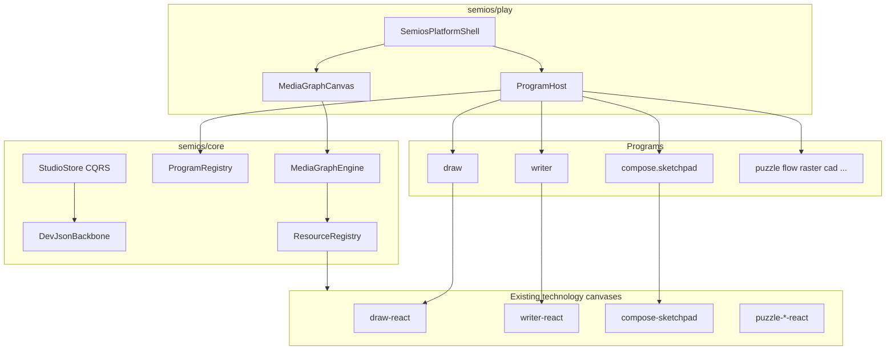

# Introduce Semios Technology

## Goal

Semios is the umbrella technology that unifies every existing playground technology under one **collaborative OS for designers**. Data lives in **studios** (local-first, optional backbone later). Work is never CRUD-edited; all mutations go through **CQRS command dispatch** with **event-sourced versioning** modeled after [`compose/client/lib/rs/lib.rs`](compose/client/lib/rs/lib.rs) `vcs` (`Change` → `Edit` → `Checkpoint` → `Alternative` → `Graph` → `Session`).

**MVP backbone:** embedded studio persisted as a **single dev JSON file** (same spirit as compose `dev://` backbone in [`compose/client/lib/rs/lib.rs`](compose/client/lib/rs/lib.rs) `kit_backbone`).

**MVP UI (per your choice):** `semios/play` hosts **all technologies** through a unified shell — not a stub.

---

## Architecture



### Domain document

| Concept | Role | Initial location |
|---------|------|------------------|
| **Studio** | Persistence + collaboration unit; owns VCS graph + media graph | `semios/core` |
| **Program** | Named collection of apps (sketchpad = one program) | `semios/core` registry |
| **App** | Runnable unit with modes/windows; yields one **resource**; owns a **source format** | wraps existing `AppRuntime` / `PlatformDefinition` |
| **Resource** | Typed interface; same kind = interchangeable in media graph | `semios/core` + `@semio-tech/graph-manifest` extension |
| **MediaGraph** | Studio-scoped DAG: app-instance nodes, resource-typed ports, edges | `semios/core` + `semios/react` canvas |

### Layering (mirror compose discipline)

```
semios/play → semios/react → semios/core → (optional future semios/rs)
```

- **`semios/core`**: sole authority for studio state, VCS replay, media graph validation, program/resource catalogs. No React.
- **`semios/react`**: `StudioStoreClient`, hooks (`useStudioProjection`, `useMediaGraph`), shell chrome, media graph renderer.
- **`semios/play`**: `PlaygroundSemios` — unified OS entry; registers all program apps and technology surface hosts.

Do **not** import compose sketchpad internals into `semios/core`. Sketchpad is loaded as a **program contribution** through existing `@semio-tech/compose-sketchpad` / framework platform APIs.

---

## Studio document (`semios.studio/v1`)

Single JSON file (dev backbone) is the first persistence target:

```json
{
  "schema": "semios.studio/v1",
  "id": "demo-studio",
  "name": "Demo Studio",
  "vcs": {
    "initialProjection": { "programs": [], "appInstances": [], "mediaGraph": { "schema": "semios.media-graph/v1", "nodes": [], "edges": [] } },
    "operations": [],
    "checkpoints": [],
    "alternatives": []
  },
  "backbone": { "kind": "dev", "uri": "dev://studio.json" }
}
```

Key design points:
- **`initialProjection`**: materialized studio snapshot (like compose `initialKit`).
- **`operations[]`**: forward/backward op pairs (like compose `Change.forwards/backwards`); replay via pure reducers — no in-place mutation.
- **`appInstances[]`**: `{ id, programId, appId, sourceDocument: { format, payloadRef | inline } }`.
- **`mediaGraph`**: DAG over app instances; ports typed by **resource kind**; edges only connect matching kinds.

Fixture: [`semios/fixture/demo.semios.json`](semios/fixture/demo.semios.json) with at least draw + writer + sketchpad program instances wired in the graph.

---

## CQRS store (semios/core)

Model directly after compose `vcs` ([`lib.rs:7231+`](compose/client/lib/rs/lib.rs)):

| Compose entity | Semios equivalent |
|----------------|-------------------|
| `Session` | `StudioSession` |
| `Graph` | `StudioGraph` |
| `TheKit` / workspace | `StudioWorkspace` (live WIP projection) |
| `Change` | `StudioChange` (forward/backward `StudioOperation[]`) |
| `Edit` | `StudioEdit` (undo/redo stack) |
| `Checkpoint` | `StudioCheckpoint` |
| `Alternative` | `StudioAlternative` |
| `Conflict` | `StudioConflict` (WIP vs backbone; stub until remote backbone) |

Public API surface in [`semios/core/index.ts`](semios/core/index.ts):

- **Commands (mutations):** `dispatchStudioCommand(cmd)` — e.g. `openProgram`, `spawnAppInstance`, `connectMediaPorts`, `commitCheckpoint`, `undo`, `redo`.
- **Queries (projections):** `studioProjection()`, `mediaGraphSnapshot()`, `appInstanceResource(instanceId)`.
- **Events:** subscribe callback stream for projection invalidation (no polling).
- **Backbone:** `DevJsonBackbone.attach(uri)`, `sync()`, `detach()` — atomic read/write of full studio bundle.

Start in **TypeScript** for MVP (fast iteration, single JSON). Structure types/regions so a future `semios/rs` can own authority without API churn.

---

## Resource registry (unify all technologies)

Add semios resource kinds to [`mathematical/graph/manifest`](mathematical/graph/manifest) (compile-time catalog, same pattern as `flow_dag` / `drawLayers`):

| Resource kind | Source format | Technology / canvas |
|---------------|---------------|---------------------|
| `2d.drawing` | `draw.document/v1` | `@semio-tech/draw-react` |
| `2d.raster` | `raster.document/v1` | `@semio-tech/raster-react` |
| `2d.map` | gis map schema | `@semio-tech/gis-map-react` |
| `2d.procedural` | procedural-2d schema | procedural play hosts |
| `2d.shooting` | shooting schema | shooting play hosts |
| `2d.puzzle` | `puzzle.2d/v1` | `@semio-tech/puzzle-2d-react` |
| `3d.puzzle` | `puzzle.3d/v1` | `@semio-tech/puzzle-3d-react` |
| `5d.puzzle` | `puzzle.5d/v1` | `@semio-tech/puzzle-5d-react` |
| `3d.procedural` | procedural-3d schema | procedural-3d hosts |
| `3d.cad` | cad schema | cad renderer |
| `computation.flow` | flow `{ flow, tree }` | `@semio-tech/flow-react` |
| `graph.trinity` | `trinity.graph/v1` | `@semio-tech/trinity-react` |
| `graph.dag` | flow DAG scene | dag hosts |
| `text.document` | `writer.document/v1` | `@semio-tech/writer-react` |
| `form.dictionary` | forms schema | forms hosts |
| `kit.compose` | compose kit projection | compose-sketchpad program |

**Interchangeability rule:** media graph edge validation checks **resource kind equality** (not app identity). Two `2d.drawing` outputs can feed any `2d.drawing` input.

Each app registration declares `{ programId, appId, modes, yields: ResourceKind, sourceFormat, componentKind }`.

---

## Programs

### Built-in program catalog (`semios/core`)

1. **`semios.system`** — studio chrome: media graph editor, program launcher, checkpoint/history panel, backbone status.
2. **`compose.sketchpad`** — re-declares sketchpad apps from [`buildSketchpadExtensionManifest()`](compose/client/lib/sketchpad/js/index.ts) as a `ProgramDefinition` (home, kit, design, type, docs, feedback). Sketchpad **stops being a standalone product entry**; it becomes a program opened inside a studio.
3. **One program per playground technology** — thin wrappers around existing `Playground*` classes (`PlaygroundDraw`, `PlaygroundWriter`, puzzle/flow/raster/… play index exports).

Programs are data (`ProgramDefinition` extends [`PlatformDefinition`](framework/product/platform/core/index.ts)); `ProgramHost` materializes `AppRuntime[]` on demand when an app instance is opened in the shell.

### Sketchpad migration

- Keep compose/sketchpad code in place; add `buildSketchpadProgramDefinition()` exported from sketchpad (or semios catalog that imports manifest builder).
- `semios/play` opens sketchpad program when studio contains a `compose.sketchpad` app instance.
- Compose sketchpad play remains registered in `launch.json` temporarily for parity, but semios play becomes the primary unified dev entry.

---

## Media graph

- Schema: `semios.media-graph/v1` — nodes = app instances, ports = resource inputs/outputs derived from app registration.
- Engine in `semios/core`: validate acyclicity, kind compatibility, propagate resource handles (refs into studio VCS, not copied blobs).
- UI in `semios/react`: reuse infinite canvas + DAG node chrome from [`mathematical/graph/port/directed/dag`](mathematical/graph/port/directed/dag/lib.rs) patterns (computation/IO node layout, channel rows). Wire picks to `dispatchStudioCommand`.

When an edge connects two instances, the **downstream app** reads upstream **resource projection** via query — never mutates upstream source document directly.

---

## Technology skeleton (new files)

Follow existing bundle pattern ([`draw/core`](draw/core), [`draw/react`](draw/react), [`draw/play`](draw/play)):

```
semios/
├── AGENTS.md
├── core/          @semio-tech/semios-core
├── react/         @semio-tech/semios-react
├── play/          @semio-tech/semios-play  (application)
└── fixture/
    └── demo.semios.json
```

Each bundle: `index.ts(x)`, `package.json`, `project.json`, `script.ts` (`dev|build|test`).

---

## Platform / playground wiring

Touchpoints (same checklist as draw/writer):

| File | Change |
|------|--------|
| [`package.json`](package.json) workspaces | register `semios/*` bundles |
| [`framework/product/platform/core/index.ts`](framework/product/platform/core/index.ts) | add `ComponentKind: "semios"`, `UiSemiosHostSurfaceNode`, `buildSemiosWindowBody` |
| [`framework/product/playground/renderer/react/index.tsx`](framework/product/playground/renderer/react/index.tsx) | `semiosSurfaceHosts`, `registerSemiosPlaySurfaceHosts`, `bootSemiosPlay` — delegates to all existing `boot*Play` surface host registrations |
| [`framework/product/playground/renderer/react/package.json`](framework/product/playground/renderer/react/package.json) | subpath `"./semios"`, deps on all `*-play`/`*-react` packages |
| [`ui/styling/vite-elements-assets.ts`](ui/styling/vite-elements-assets.ts) | extend `PlaygroundRendererPuzzleKind` with `"semios"` |
| [`.vscode/launch.json`](.vscode/launch.json) | `🛠️dev🖥️semios🎛️play` dev entry |

`semios/play/vite.config.ts`: `playEntryKind: "semios"`, aliases to all technology packages needed for unified hosting.

---

## App event sourcing alignment

Existing technologies already use op-based reducers (e.g. [`DrawEditOp`](draw/core/index.ts), writer/raster equivalents). Semios **does not replace** those op systems — it **wraps** them:

- App instance stores its source document inside studio VCS as operation log + materialized projection.
- App controllers dispatch local ops through studio commands (`applyAppOperation(instanceId, op)`), which append to `StudioChange` and re-materialize.
- UI reads via studio query projections only.

Compose kit apps inside sketchpad program continue using compose CQRS (`@semio-tech/compose-react`); semios studio VCS holds **program/app instance metadata + media graph**, while compose kit VCS remains kit authority (nested scope: studio → program instance → kit session).

---

## Implementation sequence

### 1. Foundation
- Create `semios/` bundles + AGENTS.md + workspace registration.
- Define `semios.studio/v1`, `semios.media-graph/v1`, VCS types, `StudioStore`, `DevJsonBackbone`.
- Unit tests in `semios/core` (parse fixture, command replay, checkpoint round-trip, JSON backbone save/load).

### 2. Catalogs
- Resource kinds in graph-manifest.
- `ProgramRegistry` with all technology programs + sketchpad program definition.
- `demo.semios.json` fixture wiring draw, writer, sketchpad instances.

### 3. React shell
- `SemiosStudioProvider`, projection hooks, media graph canvas, program/app launcher panels.
- Window bodies for system program (graph, history, backbone status).

### 4. Unified play
- `PlaygroundSemios` + `bootSemiosPlay` registering all technology surface hosts.
- Launch via `launch.json`; verify runtime: open studio from fixture, spawn apps, connect media edges, undo/redo checkpoint, save dev JSON.

### 5. Sketchpad as program
- Export sketchpad manifest as `compose.sketchpad` program; open from semios shell with kit route preserved.
- Document in semios AGENTS.md that sketchpad is no longer the top-level product — semios is.

### 6. Deferred (explicitly out of MVP code, designed in)
- `semios/rs` native store + GraphQL (when TS store bottlenecks).
- Local/remote backbone kinds (compose `local://`, `remote://` parity).
- Live collaboration transport.

---

## Risks and mitigations

| Risk | Mitigation |
|------|------------|
| Unified play bundle size / Vite cold start | Lazy-import program boot regions per `programId`; reuse existing playground renderer strip logic |
| Dual VCS (studio + compose kit) | Clear scope: studio VCS = OS metadata + media graph; kit VCS = compose domain only |
| Technology mixing violations | Resources are the only cross-technology wire; no fixture leakage outside studio JSON + test fixtures |
| CRQS typo in spec | Implement standard **CQRS** (compose model); event sourcing via forward/backward op logs |

---

## Ticket

Open repo ticket **`SEMIO-TECHNOLOGY-INTRODUCTION`** (goal: platform/product unification) before implementation; temporary scripts/logs live under `.repo/🎫/26/07/01/SEMIO-TECHNOLOGY-INTRODUCTION/`.
