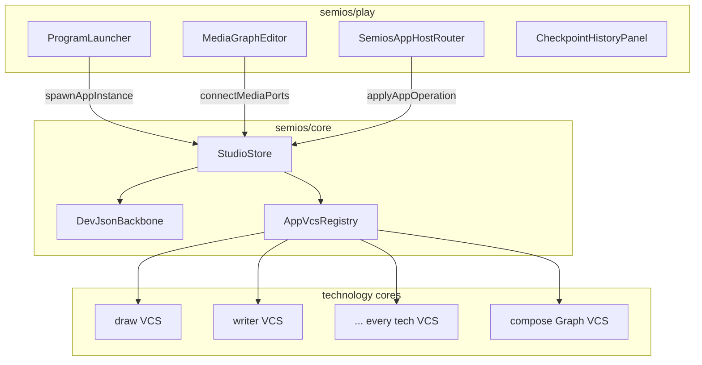

# Semios Full Technology + CQRS Unification

## Current state (MVP gaps)

The introduction MVP landed the skeleton ([`semios/core/index.ts`](semios/core/index.ts), [`semios/react/index.tsx`](semios/react/index.tsx), [`semios/play/index.ts`](semios/play/index.ts)) but **catalog and runtime are far apart**:

| Area | Done | Missing |
|------|------|---------|
| ProgramRegistry | 14 programs | `dag`, `procedural.2d`, `procedural.3d`; presentation/wires not modeled |
| Surface host registration | Most `register*PlaySurfaceHosts` called from `bootSemiosPlay` | **CAD** not registered; **Presentation** excluded |
| App host rendering | draw + writer partial | 12+ kinds show placeholder text in [`SemiosAppHostSurfaceHost`](framework/product/playground/renderer/react/index.tsx) |
| Studio CQRS | spawn/connect/undo/checkpoint | `applyAppOperation`, alternatives, `openProgram`, graph edit UI, backbone I/O |
| App-level state | — | **All technologies except compose/semios use CRUD/fixture mutation** on PlayControllers |

Only **compose/rs** ([`materialized_kit_for_workspace`](compose/client/lib/rs/lib.rs)) and **semios** use full event-sourced materialization today.

---

## Target architecture



### Two-layer VCS (matches original plan + compose nesting)

1. **Studio VCS** — OS metadata: programs, app instances, media graph, studio checkpoints/alternatives. Already in [`semios.studio/v1`](semios/core/index.ts).
2. **App VCS** — per-instance document authority: `{ initialProjection, operations[], checkpoints[], alternatives[] }` with forward/backward op pairs, replayed via `materializeAppProjection()` — same semantics as compose `Graph::materialized_kit_for_workspace`.

**Scope rule:** studio VCS never stores mutable blobs; it stores instance metadata + **app VCS envelope** inside `sourceDocument.vcs`. Downstream apps read upstream **materialized resource projections** via media graph queries — never mutate upstream documents.

**Compose sketchpad:** nested third layer — compose kit Graph remains kit authority inside a `compose.sketchpad` instance; semios only holds instance + graph wiring ([`semios/AGENTS.md`](semios/AGENTS.md)).

---

## Phase 1 — Shared VCS primitives (framework)

Introduce a technology-neutral envelope in [`framework/core/index.ts`](framework/core/index.ts) (or a small `framework/vcs` region if preferred):

```typescript
interface DocumentChange<TOp> {
  id: string;
  forwards: readonly TOp[];
  backwards: readonly TOp[];
  description?: string;
}
interface DocumentVcs<TProjection, TOp> {
  initialProjection: TProjection;
  operations: readonly DocumentChange<TOp>[];
  checkpoints: readonly DocumentCheckpoint[];
  alternatives: readonly DocumentAlternative[];
}
interface DocumentVcsEnvelope<TProjection, TOp> {
  schema: string;
  id: string;
  vcs: DocumentVcs<TProjection, TOp>;
  backbone?: BackboneRef;
}
```

Add generic helpers mirroring semios studio:
- `materializeDocumentProjection(envelope, appliedChangeIds?)`
- `DocumentVcsStore` — dispatch, undo/redo, checkpoint, subscribe, generation counter

This becomes the **single pattern** every technology adopts; semios `applyAppOperation` delegates to format-specific reducers registered in `AppVcsRegistry`.

---

## Phase 2 — Complete Semios catalog + spawn/mix UI

### 2a. ProgramRegistry gaps ([`semios/core/index.ts`](semios/core/index.ts))

Add missing programs:
- `dag` → `graph.dag` (standalone DAG playground, distinct from `semios.system/studio`)
- `procedural.2d` → `2d.procedural`
- `procedural.3d` → `3d.procedural`
- `reasoning.wires` → `2d.puzzle` (wires variant app under puzzle program or separate program)
- `presentation` → new resource kind `presentation.deck` in [`semios/manifest/resources.manifest.json`](semios/manifest/resources.manifest.json) + program entry

Import sketchpad apps from [`buildSketchpadProgramDefinition()`](compose/client/lib/sketchpad/js/index.ts) instead of hand-rolled `COMPOSE_SKETCHPAD_PROGRAM`.

### 2b. React shell ([`semios/react/index.tsx`](semios/react/index.tsx))

Add interactive studio chrome:
- **ProgramLauncherPanel** — lists `listSemiosPrograms()`, spawn via `dispatch({ kind: "spawnAppInstance", ... })`
- **MediaGraphEditor** — port pick + connect/disconnect, node drag (`moveMediaNode`), remove instance; wire `useDispatchStudioCommand`
- **StudioHistoryPanel** — undo/redo, commit checkpoint, backbone status
- Extend layout in [`semios/play/index.ts`](semios/play/index.ts) with `semios.system` windows (graph, launcher, history)

### 2c. Unified surface boot ([`framework/product/playground/renderer/react/index.tsx`](framework/product/playground/renderer/react/index.tsx))

- Register **CAD** play surface hosts in `registerSemiosPlaySurfaceHosts` (extract/register from [`cad/js/renderer/play`](cad/js/renderer/play/index.tsx) if needed)
- Register **Presentation** hosts
- Replace monolithic `SemiosAppHostSurfaceHost` with **`SemiosAppHostRouter`** — switch on `componentKind` and delegate to the same host components already used by `bootDrawPlay`, `bootRasterPlay`, etc. (reuse existing `*SurfaceHost` functions, do not duplicate canvas logic)

Each host receives:
- `instanceId`, materialized projection from studio query
- `onAppOperation(op)` → `dispatch({ kind: "applyAppOperation", instanceId, op })`
- upstream resource handle from `resolveUpstreamResourceHandle` when media edge exists

---

## Phase 3 — Studio CQRS completion ([`semios/core/index.ts`](semios/core/index.ts))

| Command | Work |
|---------|------|
| `applyAppOperation` | Route by `sourceDocument.format` → registered reducer; append `StudioChange` with `patchAppSource` or dedicated `applyAppOp` studio operation |
| `openProgram` | Activate program context / default app instance |
| `setStudioName` | Wire no-op reducer to real command |
| Alternatives | `createAlternative`, `switchAlternative` (schema already exists) |
| Undo/redo | Keep change-id stack; ensure app ops and studio ops share one applied stack per workspace |
| `payloadRef` | Resolver: `fixture:*` → bundled fixture JSON at spawn; `upstream:*` → materialized upstream projection ref |

### Backbone ([`DevJsonBackbone`](semios/core/index.ts))

Mirror compose [`kit_backbone`](compose/client/lib/rs/lib.rs):
- **`dev://`**: read/write full `semios.studio/v1` JSON atomically on checkpoint + debounced autosave
- **`local://`**: stub interface matching compose local backbone shape (no remote yet)
- **`remote://`**: reserved stub + conflict placeholder (`StudioConflict`)
- Play controller: attach backbone URI from fixture; sync after every dispatch batch

---

## Phase 4 — Technology CQRS migration (eliminate all CRUD)

Each technology follows the same checklist in `*/core/index.ts` + `*/play/index.ts`:

1. Define `*EditOp` union (or reuse existing: draw/raster/forms already have ops)
2. Wrap document in `DocumentVcsEnvelope`
3. Implement `materialize*Projection()` + `apply*EditOp()` pure reducers
4. Replace PlayController `this.document = ...` / `patchFixture(...)` with `DocumentVcsStore.dispatch`
5. Export `register*AppVcs()` for semios `AppVcsRegistry`
6. Standalone play still uses same VCS store locally (local-first graph even outside semios)

### Migration order (lowest risk first)

| Priority | Technology | Rationale |
|----------|------------|-----------|
| 1 | draw, raster, forms | Already have `apply*EditOp` |
| 2 | writer | Simple text doc; add `WriterEditOp` |
| 3 | flow, procedural 2d/3d, shooting, trinity | JSON fixture → ops |
| 4 | gis/map, presentation | Fixture + view state split: view stays controller UI state, document in VCS |
| 5 | puzzle 2d/3d/5d | Replace fixture CRUD + fill-session with op log; unify 2d renderer bridge |
| 6 | cad | Promote `ModelDocument` + `DocumentHistory` diff stacks into VCS envelope |
| 7 | dag | Flow-like fixture VCS |
| 8 | compose/sketchpad | Wire `SemiosAppHostRouter` to `ComposeJsKitStore` / existing Graph materialization — **no duplicate kit VCS in semios** |

**CRUD elimination audit:** grep for direct assignment patterns (`this.document =`, `this.fixtureJson =`, `applyFixture({`, `patchFixture(`) in each `*/play/index.ts` and replace with dispatch-only paths. Controllers may hold **UI/ephemeral state** (selection, hover, camera) but not authoritative document state.

---

## Phase 5 — Media graph resource propagation

In [`semios/core/index.ts`](semios/core/index.ts) `MediaGraphEngine`:
- On edge connect, validate kind + acyclicity (exists)
- `appInstanceResourceProjection(instanceId)` — materialize app doc + expose `yields` resource handle
- Downstream host reads upstream projection as initial input (read-only); edits stay in downstream app VCS

In react hosts: pass `upstreamResource` prop into canvases that support import (draw, writer, flow, puzzle, etc.).

Update [`semios/fixture/demo.semios.json`](semios/fixture/demo.semios.json): add at least one cross-technology edge (e.g. draw → writer or draw → raster) to prove mix-and-match.

---

## Phase 6 — Tests + runtime verification

Extend existing vitest in [`semios/core/index.ts`](semios/core/index.ts) and [`semios/play/index.ts`](semios/play/index.ts):
- spawn every programId → instance appears in projection
- applyAppOperation round-trip per format (at least draw + writer + one puzzle)
- media edge connect + upstream handle resolution
- checkpoint + DevJsonBackbone save/load round-trip
- undo spans studio op + nested app op

Per-technology: extend existing test files in each `*/core/index.ts` with materialize + undo replay cases (no new test files per repo rules).

Runtime: `🛠️dev🖥️semios` — launcher spawns any technology, graph connects instances, app host renders real canvas (not placeholder), checkpoint persists to dev JSON.

---

## Files touched (primary)

- [`framework/core/index.ts`](framework/core/index.ts) — shared DocumentVcs primitives
- [`semios/core/index.ts`](semios/core/index.ts) — AppVcsRegistry, applyAppOperation, backbone I/O, missing programs
- [`semios/react/index.tsx`](semios/react/index.tsx) — launcher, graph editor, history panel
- [`semios/play/index.ts`](semios/play/index.ts) — layout, backbone attach, spawn commands
- [`framework/product/playground/renderer/react/index.tsx`](framework/product/playground/renderer/react/index.tsx) — SemiosAppHostRouter, CAD/presentation registration
- [`semios/manifest/resources.manifest.json`](semios/manifest/resources.manifest.json) — presentation kind if added
- Every `*/core/index.ts` + `*/play/index.ts` for the 16+ technologies — VCS envelope + controller refactor

---

## Explicitly deferred (designed, not in this pass)

- `semios/rs` native store + GraphQL
- Live collaboration transport
- Full `remote://` backbone sync (stub + conflict type only)

---

## Risk mitigations

| Risk | Mitigation |
|------|------------|
| Large unified bundle / cold start | Lazy-import `SemiosAppHostRouter` branches per `componentKind`; keep existing playground renderer strip plugin |
| Dual/triple VCS (studio + app + compose kit) | Strict scope: studio = OS graph; app VCS = technology doc; compose Graph = kit only |
| Big-bang refactor | Migrate technologies in priority order; each must pass standalone play + semios host before next |
| Breaking fixtures | Hand-update all fixtures to VCS envelope in same PR per technology (no migration scripts)
