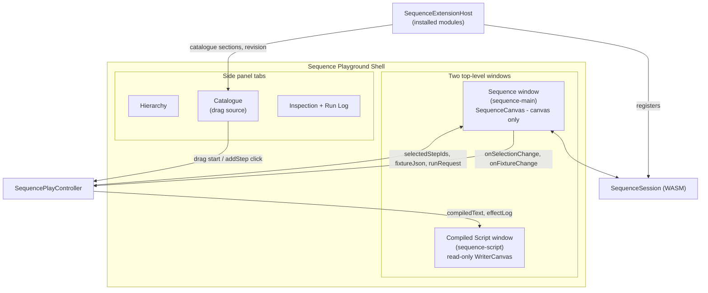

# Sequence Technology Elevation

## Root causes (confirmed by reading code)

1. **Window-in-window**: [sequence/react/index.tsx](sequence/react/index.tsx) `SequenceCanvas` renders a grid with the WASM canvas *and* an inline `<aside>` (Compiled Text + Effect Log) baked into the same component:

```414:437:sequence/react/index.tsx
	return (
		<div className={`grid h-full min-h-0 grid-cols-[1fr_minmax(14rem,18rem)] gap-2 p-2 ${className ?? ""}`}>
			<div ref={containerRef} ...><canvas ... /></div>
			<aside ...>
				<section>Compiled Text</section>
				<section>Effect Log</section>
			</aside>
		</div>
	);
```

Every other technology's window body must be **canvas-only** — enforced by `assertCanvasOnlyWindowBody` in [framework/product/platform/core/index.ts](framework/product/platform/core/index.ts):

```985:989:framework/product/platform/core/index.ts
function assertCanvasOnlyWindowBody(bodyKey: string, node: UiNode): void {
	if (isCanvasOnlyWindowBody(node)) return;
	throw new Error(`Declarative window body "${bodyKey}" must be a single ... surface ... Use ModeRuntime.tools, side tabs, or window measures for chrome.`);
}
```

`DagCanvas` and `TrinityCanvas` are proof: canvas + optional overlay div, nothing else. Extra views belong in **additional `WindowKindRuntime` entries** (Trinity Jack: Graph + Query + Results = 3 windows) or **side-panel tabs**, never nested inside one window's React tree.

1. **Selection**: the wiring looks structurally correct (`SequenceCanvas` → `onSelectionChange` → `ctrl.run("setSelection")` → `selectedStepIds` prop → `session.setSelection(...)`), but this has never been runtime-verified after the recent pan/zoom rewrite, and DAG's own port-based node model (`step_to_dag_node` in [sequence/core/lib.rs:314](sequence/core/lib.rs)) gives every step both an input and output port — clicks near those ports may be captured by DAG's edge-draw/handle interaction instead of node selection. Needs live verification + fix, not just code review.
2. **Catalogue drag-and-drop**: does not exist anywhere in `sequence/`. Catalogue items are click-only (`buildSequencePlayCatalogueTree` in [sequence/play/index.ts:168](sequence/play/index.ts) sets `command: addStep`, no `draggable`/`dragData`). Flow is the one technology with a real palette-drag pipeline: draggable tree items encode a MIME payload, the host panel attaches a `dragAndDropController`, the canvas accepts `onDrop`, and the drop converts screen→world and calls a WASM "add at position" method. Sequence's WASM already has the add method (`SequenceSession.addStep(kind, x, y)`, [sequence/core/lib.rs:384](sequence/core/lib.rs)) but React never calls it — the controller's click path fabricates a fixed `x = 40 + n*280` instead.
3. **Extension support**: `imperative/module/core` is the only step-kind provider; there is no runtime module registry, no `getExtensionEntries()`/`getExtensionRevision()`, unlike Flow's `FlowExtensionHost` ([flow/react/index.tsx:296](flow/react/index.tsx)).

## Target architecture




## 1. Two-window layout (fixes window-in-window)

- `**sequence/react/index.tsx**`: strip `SequenceCanvas` back to canvas-only (`<div><canvas/></div>`, matching `DagCanvas`/`TrinityCanvas`). Remove the local `compiledText`/`effectLog` state and the `<aside>` JSX entirely. Keep `onRunResult` prop (already exists) as the hand-off point for effect-log data.
- **New window kind** in [sequence/play/index.ts](sequence/play/index.ts): add `SEQUENCE_PLAY_SCRIPT_WINDOW_KIND_ID` (`"sequence-script"`), a `SEQUENCE_PLAY_BODY_KEY_SCRIPT`, and register it in `rebuildShellMode()` alongside the existing main window — same pattern as Trinity Jack's `TRINITY_JACK_PLAY_EDITOR_WINDOW_KIND_ID`.
- **Layout**: replace `createStackLayout([SEQUENCE_PLAY_WINDOW_KIND_ID], ["Sequence"])` with a row layout (~65/35 split), mirroring `procedural/3d`'s `createDefaultLayout([main, preview], "row", [65, 35])`.
- **Window body**: use `buildWriterWindowBody(SEQUENCE_PLAY_SCRIPT_SURFACE_ID, ...)` from [framework/product/platform/core/index.ts:708](framework/product/platform/core/index.ts). Surface host renders `WriterCanvas` (from `@semio-tech/writer-react`) bound to a document built from `ctrl.getCompiledText()`, no `onChange` wired back (display-only, refreshed on fixture/run change) — same non-editable pattern as Trinity Rewrite's generated-Jack-query window (`TrinityRewriteJackSurfaceHost`).
- **Controller additions** (`SequencePlayController`): `getCompiledText()`, `getEffectLog()`, recompute both whenever fixture changes or `run` completes (move the `compileText()`/`run()` WASM calls that currently live in `SequenceCanvas` up into the controller/surface-host layer, or keep them in canvas but push results out via `onRunResult`/a new `onCompiledTextChange` callback into controller state).
- **Effect Log placement**: since the ask is strictly a 2-window layout, move the run effect log into the existing Inspection side panel as a "Run Log" section (`buildSequencePlayInspectorTree` in [sequence/play/index.ts](sequence/play/index.ts)), refreshed on `interactionRevision`. Keeps the two center windows purely "graph" and "script".
- **Renderer wiring** in [framework/product/playground/renderer/react/index.tsx](framework/product/playground/renderer/react/index.tsx) `🔖SequencePlayHost` region: register a `SequencePlayScriptSurfaceHost` via `registerUiWriterSurfaceHost`, add it to `registerSequencePlaySurfaceHosts()`.

## 2. Selection parity

- Runtime-verify current wiring first (click a step in canvas → check hierarchy highlight; click hierarchy item → check canvas highlight) using console logs (`[DEBUG]` prefixed per repo rules) before assuming a fix.
- Likely fix areas based on code review: DAG's port-based hit testing (`try_node_rectangle_pointer_down`, [mathematical/graph/port/directed/dag/lib.rs:2759](mathematical/graph/port/directed/dag/lib.rs)) may treat step widgets' P/N ports as separate interactive handles that intercept plain clicks. Since sequence steps don't need per-port wiring UX (edges are managed by the sequence path model, not manual port-dragging), evaluate rendering steps with a simpler non-ported DAG node style, or adjust hit-testing precedence so body clicks always resolve to node selection first.
- Ensure `SequencePlayHierarchyPanelDefinition`/`SequencePlayInspectionPanelDefinition` re-render on `interactionRevision` bumps (already wired via `augmentPanelTabs` dependency array — confirm it still holds after the rewrite).
- Verify with actual pointer interaction in the running dev server (port 6077), not just code inspection, before closing this out.

## 3. Catalogue drag-and-drop

- `**sequence/core/lib.rs**`: add a `worldFromScreen(sx, sy) -> String` WASM export on `SequenceSession` (JSON `{x, y}`), mirroring the coordinate math already used in `wheelScreen` ([sequence/core/lib.rs:487-506](sequence/core/lib.rs)) via `infinite_cavas::camera::screen_to_world`.
- `**sequence/react/index.tsx**`: add `fixtureDragDrop` prop + `onDragEnter/onDragOver/onDrop` handlers on the canvas container (mirroring Flow's `commitWidgetDropAtClient`, [flow/react/index.tsx:4319](flow/react/index.tsx)): decode the drag payload, convert screen→world via the new WASM method, call `session.addStep(kind, world.x, world.y)` directly, then `emitFixtureChange()` + `syncCompiledText()` + `renderFrame()`.
- **New drag data encoding**: `SEQUENCE_STEP_DRAG_V1_MIME` + `sequenceStepCatalogueItemDragData(item)` in `sequence/react/index.tsx` (or `sequence/core/index.ts`), analogous to `flowPlayCatalogueItemDragData`.
- `**sequence/play/index.ts**`: `buildSequencePlayCatalogueTree()` items get `draggable: true, dragData: sequenceStepCatalogueItemDragData(item)` in addition to the existing click `command: addStep` (keep click-to-add as an accessible fallback, matching how Flow keeps both).
- **Renderer**: `SequencePlayCataloguePanelDefinition` in [framework/product/playground/renderer/react/index.tsx](framework/product/playground/renderer/react/index.tsx) attaches `dragAndDropController: sequenceStepPaletteTreeDragController(collectUiTreeItemDragData(treeNode.sections))` — new exported helper in `sequence/react/index.tsx`, structurally modeled on `flowWidgetPaletteTreeDragController` ([flow/react/index.tsx:1372](flow/react/index.tsx)) but scoped to sequence (own module-level drag-session refs/events, no shared global with Flow).
- `**SequencePlayPaneSurfaceHost**`: pass `fixtureDragDrop` through to `SequenceCanvas`.

## 4. Extension support (multi-module step kinds)

Imperative's execution model (`Executor::run(path, scope)` threads a `Dictionary` scope sequentially through steps in one synchronous Rust call) is architecturally different from Flow's per-node JS-orchestrated dataflow evaluation, so we adapt rather than copy Flow's exact lazy-WASM-import mechanism — the same *practical* extensibility, sized correctly for tiny action-kind modules instead of Flow's large lazy-loaded geometry modules.

- **Split the module boundary in Rust**: keep [imperative/module/core/lib.rs](imperative/module/core/lib.rs) as-is (log/state/wait), add a **second crate** `imperative/module/text/lib.rs` with 2-3 real operators (e.g. `text.concat`, `text.uppercase`) following the exact `register(&mut Registry)` / `catalogue_json(&Registry)` / inline-tests pattern already established, with its own `project.json`/`script.ts` (`bun ./script.ts wasm|test`).
- **Compose the registry** in `SequenceHost`/`ImperativeSession` ([sequence/core/lib.rs](sequence/core/lib.rs), [imperative/core/lib.rs](imperative/core/lib.rs)): call both modules' `register()` into one `Registry`, so `run()` transparently executes steps from either module.
- **TS extension host**: add `SequenceExtensionHost` (or a shared `ImperativeExtensionHost` in `imperative/core/index.ts` reused by both `sequence/react` and `imperative/react`) tracking `INSTALLED_MODULE_IDS = ["core", "text"]`, exposing `listEntries()`, `getRevision()`, and merging each module's `catalogue_json()` sections into the catalogue tree — this is the seam that makes adding a third module later a pure addition (new crate + one id in the list), no core rewrite.
- **Catalogue tree**: `buildSequencePlayCatalogueTree()` groups items by contributing module (section per module id), proving the catalogue is genuinely composed from independent providers rather than one hardcoded list.
- Document the module-registration seam in `sequence/AGENTS.md` / `imperative/AGENTS.md`.

## Files touched (primary)

- `sequence/react/index.tsx` — strip aside, add DnD, add worldFromScreen usage, new drag controller export
- `sequence/core/lib.rs` — `worldFromScreen` WASM export, registry composition from 2 modules
- `sequence/play/index.ts` — script window kind + layout, catalogue drag data, controller compiled-text/effect-log getters, inspector "Run Log" section
- `imperative/module/text/lib.rs` (new crate) — second step-kind module
- `imperative/core/index.ts` / new extension-host module — `ImperativeExtensionHost`
- `framework/product/playground/renderer/react/index.tsx` (`🔖SequencePlayHost` region) — script window surface host registration, catalogue drag controller wiring
- Root wiring: Cargo workspace members, package.json workspaces, launch.json entry for the new module crate's build step (if it needs its own wasm build target)

## Verification

- `cargo test` for `sequence_core`, `imperative_module_core`, new `imperative_module_text`
- `bun test` for `sequence/react`, `imperative/core`
- Runtime check on the sequence dev server (port 6077): drag a catalogue item onto the canvas and confirm a step appears at the drop point; click a step and confirm hierarchy + inspector highlight it; click a hierarchy item and confirm the canvas highlights it; confirm exactly two top-level windows (Sequence, Compiled Script) with no nested chrome; confirm the Inspection panel shows a Run Log after clicking Run.
- Close/reopen the `IMPERATIVE-AND-SEQUENCE-TECHNOLOGIES` ticket per repo workflow once verified.

