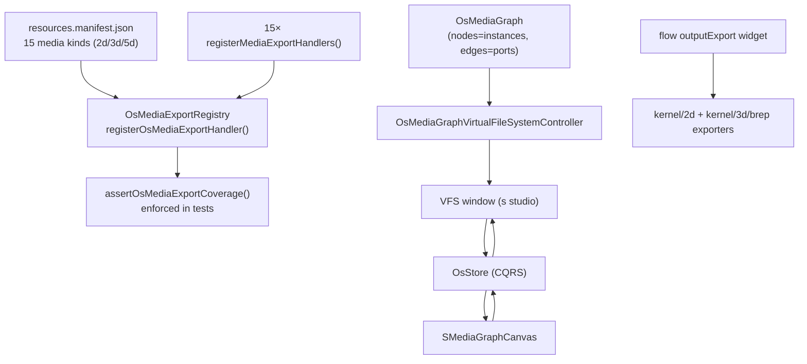

# OS Media Graph: Export Coverage + Export Flow Nodes + Bidirectional VFS Window

This spans four tightly related additions, all rooted in `framework/product/os/core/index.ts` (the OS media graph engine) and wired through the `s` studio package (`s/core`, `s/react`), `flow`, `framework/product/platform/core`, and 15 technology packages.

## Scope decisions (confirmed)

- The **VFS window syncs with the OS/Studio media graph** (`SMediaGraphCanvas` in [s/react/index.tsx](s/react/index.tsx)) — not the `flow` technology's own node graph.
- The flow export node is a **genuinely new `outputExport` widget kind**, requiring Rust/WASM changes in [flow/core/lib.rs](flow/core/lib.rs) and [mathematical/graph/port/directed/dag/lib.rs](mathematical/graph/port/directed/dag/lib.rs), not a reuse of `outputAction`.
- "All media" = every resource kind in [s/manifest/resources.manifest.json](s/manifest/resources.manifest.json) with `dimension` in `{2d, 3d, 5d}` (15 kinds). `graph`/`text`/`data`/`kit` dimensioned resources (flow, trinity, dag, writer, forms, catalogue, sequence, imperative, vcs, compose kit) are **not** in scope — they aren't visual media. Real, working exporters are built for all 15 kinds now (no follow-up ticket).

## 1. OS Media Export infrastructure — [framework/product/os/core/index.ts](framework/product/os/core/index.ts)

New `#region 🔖MediaExport`:

- `OsMediaExportFormat = "svg" | "png" | "obj" | "glb"`
- `OsMediaExportResult { data: string | Uint8Array; mimeType: string; fileName: string }`
- `OsMediaExportHandler = (sourceDocument: unknown) => Promise<OsMediaExportResult>`
- `registerOsMediaExportHandler(resourceKind: OsResourceKindId, format: OsMediaExportFormat, handler)`
- `requiredOsMediaExportFormats(dimension)` → `2d`→`["svg","png"]`, `3d"|"5d"`→`["glb","obj"]`, else `[]`
- `assertOsMediaExportCoverage()` — iterates all resource descriptors, throws a descriptive error listing every `(resourceKind, format)` pair missing a handler. This is the literal enforcement of "always exportable" and gets a dedicated test.
- `exportOsAppInstanceMedia(instance, sourceDocument, format)` — resolves the instance's resource kind and dispatches to the registered handler.
- Shared `downloadOsMediaExportResult(result)` in [framework/core/index.ts](framework/core/index.ts) (Blob/anchor download, replacing the ~5 duplicated inline copies across layout/cad/playground-renderer for new call sites; existing ones are left as-is unless directly touched).

## 2. Extend `VirtualFileSystemController` for real mutations — [framework/product/platform/core/index.ts](framework/product/platform/core/index.ts)

Today `VirtualFileSystemController` only supports expand/select/hover and an in-memory-cache-only drag-move ([framework/product/platform/core/index.ts:1495-1694](framework/product/platform/core/index.ts)). Add:

- Overridable hooks: `createNode(parentId, name, fileNodeKindId)`, `renameNode(id, name)`, `deleteNode(id)`, and change `moveNode`'s default so overrides can persist authoritative moves (not just mutate the local cache).
- New commands: `createVirtualFileSystemNode`, `renameVirtualFileSystemNode`, `deleteVirtualFileSystemNode`; extend `virtualFileSystemDragEnd` to call `moveNode` post-cache-update.
- Renderer: wire new callbacks in `BuiltinVirtualFileSystemKindRenderer` ([framework/product/platform/renderer/react/index.tsx](framework/product/platform/renderer/react/index.tsx)).
- UI: add minimal create/rename/delete affordances (context menu or inline actions) to the presentational `VirtualFileSystem` component in [ui/react/index.tsx](ui/react/index.tsx), following its existing callback-prop pattern.

## 3. Media graph ⇆ VFS projection — `OsMediaGraphVirtualFileSystemController`

New class in `os/core/index.ts`, `extends VirtualFileSystemController`:

- Tree shape: root → one folder per `OsAppInstance` (named `"<label> (<programId>.<appId>)"`) containing:
  - `source.json` — raw instance source document; double-click navigates/opens the instance (mirrors `onOpenInstance`).
  - `outputs/<portId>.<ext>` — one virtual file per output port per required export format (always present — this _is_ the "always exportable" guarantee made visible in the VFS); double-click calls `exportOsAppInstanceMedia(...)` + `downloadOsMediaExportResult(...)`.
  - `inputs/<portId>` — present when connected, `descriptorValues` shows `"← <sourceInstanceId>:<sourcePortId>"`; drag onto another instance's `outputs/<portId>` file to `connectMediaPorts`, delete to `disconnectMediaEdge`.
- Mutations dispatch existing `OsCommand`s: `createNode` (top-level folder) → `spawnAppInstance`; `deleteNode` (instance folder) → `removeAppInstance`; `renameNode` (instance folder) → new `renameAppInstance` command (added to `OsStore`); `moveNode` on an `inputs/` file → `connectMediaPorts`/`disconnectMediaEdge`.
- Because this reads/writes the same `OsStore` that `SMediaGraphCanvas` already uses (same CQRS pattern as `moveMediaNode`/`connectMediaPorts` in [framework/product/playground/renderer/react/index.tsx:12722-12737](framework/product/playground/renderer/react/index.tsx)), the two views are automatically bidirectionally consistent — no bespoke sync layer needed (unlike the one-way sketchpad Kit→VFS projection).

## 4. VFS window in the S studio playground

- `s/core/internal.ts` / `s/core/index.ts`: instantiate the controller bound to the `SStore`/`OsStore`, add a new window kind (e.g. `S_PLAY_WINDOW_KIND_MEDIA_VFS`) alongside the existing media graph canvas window kind, register its body via `registerAppVirtualFileSystem(...)`.
- Add the window to the S play layout as a second pane/tab next to the graph canvas (Golden Layout), so both are visible/switchable and always reflect the same `OsStore` state.
- Replace the current JSON-debug stub for `componentKind: "virtualFileSystem"` at [framework/product/playground/renderer/react/index.tsx:13165-13174](framework/product/playground/renderer/react/index.tsx) with a real `BuiltinVirtualFileSystemKindRenderer` mount for this controller (sketchpad's `SSketchpadHost` special-case stays as-is).

## 5. Flow `outputExport` widget (new Rust-backed widget kind)

**Rust — [flow/core/lib.rs](flow/core/lib.rs):** add `Widget::OutputExport { id, format: String }`, threading through every place `OutputAction`/`OutputPreview` already appear: `widget_chrome`, `widget_label`, `widget_display_meta`, `widget_io_ports` (single sink input), `widget_node_size`, `widget_id_for`, `widget_to_dag_node` (new `DagNodeKind::Export`), `WidgetDescriptor`/`descriptor_explicit_id`/`widget_from_descriptor`, `static_catalogue_sections` (4 Outputs entries: Export GLB/OBJ/PNG/SVG, all the same widget kind with different initial `format`), new `apply_export_outputs()` eval step that captures the sink's resolved input for JS readback, `sync_dag_display_from_widgets`, `next_widget_id` prefix, unit tests.

**Rust — [mathematical/graph/port/directed/dag/lib.rs](mathematical/graph/port/directed/dag/lib.rs):** add `DagNodeKind::Export { label, format, input }`, `dag_node_kind_tag`, input port accessor, layout helpers, a `paint_scene` arm (export icon + format label + clickable control rect, mirroring `Action`'s control-rect pattern), manifest validator registration.

**TS — [flow/react/index.tsx](flow/react/index.tsx):** add `outputExport` to the `FlowWidget` union; update `flowWidgetTreeSignature`, `flowEvalAnimationPath`, `flowDirtyComputePathReady`, `flowCatalogueItemDescriptor` (4 catalogue entries); add pointer hit-test wiring for the export control rect (mirrors however connect/drag hit-testing already talks to the WASM session) so a click fires a new `onOutputExport?: (widgetId, format, resolvedValueJson) => void` prop after `orchestrator.evaluate()`.

**Handler:** on trigger, convert the resolved value via `kernel/2d` (svg/png) or `kernel/3d/brep` (obj/glb, using the new TS wrappers from step 6) and call `downloadOsMediaExportResult`.

**[flow/core/index.ts](flow/core/index.ts):** `flowPlayWidgetTreeLabel` case, inspector group entry (format selector, like `inputStepper`'s schema field).

**Playground hosts** ([framework/product/playground/renderer/react/index.tsx](framework/product/playground/renderer/react/index.tsx) flow + procedural2d/3d hosts): wire `onOutputExport` to the download handler.

## 6. New kernel/TS export bindings needed (currently missing)

- [kernel/3d/brep/js/index.ts](kernel/3d/brep/js/index.ts): add `exportObj(shapes, deflection)` / `exportGltf(shapes, deflection)` TS wrappers around the existing Rust `export_obj_sync`/`export_gltf_sync` (mirrors the existing STEP wrapper pattern).
- [cad/js/kernel/brepjs/index.ts](cad/js/kernel/brepjs/index.ts): add `exportModelSpaceToObj`/`exportModelSpaceToGlb` (mirrors existing `exportModelSpaceToStep`).
- [lowpoly/core/lib.rs](lowpoly/core/lib.rs): add `exportGlbActive()` next to the existing `exportObjActive()`, using the same brep gltf/glb writer.
- New shared `rasterizeSvgToPngDataUrl(svg, width, height)` port (DOM `Image` → canvas → `toDataURL`), used by gis/note/puzzle2d/presentation/raster handlers that build SVG first and need PNG as a rasterized fallback.

## 7. Per-technology export handlers — `register<Tech>MediaExportHandlers()`

Called centrally from `s/core/internal.ts` alongside the existing `registerAppVcsHandler` calls. One function per technology, each registering into `os/core`'s registry:

- **draw** (svg+png): new `drawDocumentToDrawingScene()` converter → kernel/2d `exportSvg`/`canvasDrawingPngExportPort.exportPng`.
- **raster** (svg+png): new offscreen-canvas layer compositor → PNG; SVG wraps the PNG in an `<image>` container.
- **gis** (svg+png): new data-driven SVG serializer from `GisMapFixtureV1` (positions/routes) → PNG via `rasterizeSvgToPngDataUrl`.
- **procedural 2d** (svg+png): headless-evaluate the `FlowFixture` via `FlowOrchestratorClient` → resulting `DrawingScene` → kernel/2d exporters (shared helper reused by flow's own export node when evaluating a procedural-2d-hosted graph).
- **shooting** (svg+png): thin wrapper over the existing `iconRenderPort.render()`.
- **layout** (svg+png): thin wrapper over existing WASM `exportPng`/`exportSvg`.
- **note** (svg+png): new SVG serializer from `NoteDocument` blocks → PNG via `rasterizeSvgToPngDataUrl`.
- **presentation** (svg+png): composite tile crops onto canvas → PNG; SVG wraps the composited raster with vector crop-rect overlays.
- **cad** (glb+obj): new brepjs wrappers (step 6) over the active `ModelSpace`.
- **3d.mesh** (glb+obj): pass-through GLB fetch of the referenced mesh URL + OBJ via `kernel/3d/mesh`.
- **lowpoly** (glb+obj): wire the existing (currently unwired) `exportObjActive()` + new `exportGlbActive()`.
- **procedural 3d** (glb+obj): headless-evaluate the `FlowFixture` for brep geometry handles → new `kernel/3d/brep/js` wrappers.
- **puzzle 2d** (svg+png): new SVG serializer from `Puzzle2dFixture` nodes/edges → PNG via `rasterizeSvgToPngDataUrl`.
- **puzzle 3d** (glb+obj): fetch+merge placed `FixtureObject` GLBs (existing `loadGlbGroup`) with transforms applied, export merged scene via a `Puzzle3dExportPort` (three.js-backed, kept behind an interface per repo convention).
- **puzzle 5d** (glb+obj): `project3d(model)` → reuse the puzzle 3d exporter on the projection.

## 8. Enforcement test

Add/extend a test that boots all `register*MediaExportHandlers()` and then calls `assertOsMediaExportCoverage()`, asserting it does not throw — the CI-checked version of "all media is always exportable."

## Execution order

1. OS media export infra + shared download helper (§1)
2. `VirtualFileSystemController` CRUD hooks + renderer + UI affordances (§2)
3. `OsMediaGraphVirtualFileSystemController` + `renameAppInstance` command (§3)
4. VFS window wired into S studio playground, verify live bidirectional sync against `SMediaGraphCanvas` (§4)
5. Flow `outputExport` widget: Rust, TS, playground wiring (§5)
6. Missing kernel/TS export bindings (§6)
7. All 15 per-technology handlers (§7)
8. Coverage test (§8)
9. Open the repo ticket (per `AGENTS.md`/`CLAUDE.md` workflow) at the start of implementation, associate with the most fitting goal, close with full summary of files touched.

This is a large, multi-package change (Rust/WASM in `flow/core`, `mathematical/graph/port/directed/dag`, `kernel/3d/brep`, `lowpoly`, plus TS across 15 technology packages, `framework/product/os`, `framework/product/platform`, and `ui/react`). It will be executed as one continuous ticket, following the order above so each stage is independently verifiable (infra → VFS mutation plumbing → media-graph projection → flow widget → kernel bindings → per-tech handlers → enforcement test).

[{"id": "os-media-export-infra", "content": "Add OsMediaExportFormat/registry/assertOsMediaExportCoverage/exportOsAppInstanceMedia to framework/product/os/core/index.ts plus shared download helper in framework/core"}, {"id": "vfs-controller-crud", "content": "Extend VirtualFileSystemController in framework/product/platform/core with create/rename/delete/persisted-move hooks, wire renderer callbacks and ui/react affordances"}, {"id": "media-graph-vfs-projection", "content": "Build OsMediaGraphVirtualFileSystemController projecting OsMediaGraph nodes/ports to a VFS tree with mutation commands, add renameAppInstance OsCommand"}, {"id": "vfs-window-s-studio", "content": "Wire a new VFS window kind into the S studio playground alongside SMediaGraphCanvas and verify bidirectional live sync via OsStore"}, {"id": "flow-output-export-widget", "content": "Add new outputExport widget kind end-to-end: flow/core/lib.rs, mathematical/graph/port/directed/dag/lib.rs, flow/react/index.tsx, flow/core/index.ts, playground host wiring, click-to-export trigger"}, {"id": "kernel-export-bindings", "content": "Add missing TS export wrappers: kernel/3d/brep/js obj/gltf, cad/js brepjs obj/glb, lowpoly exportGlbActive, shared rasterizeSvgToPngDataUrl port"}, {"id": "per-tech-export-handlers", "content": "Implement registerMediaExportHandlers for all 15 media resource kinds (draw, raster, gis, procedural2d, shooting, layout, note, presentation, cad, mesh, lowpoly, procedural3d, puzzle2d, puzzle3d, puzzle5d) and call centrally from s/core/internal.ts"}, {"id": "coverage-test", "content": "Add test asserting assertOsMediaExportCoverage() passes after all handlers are registered"}, {"id": "ticket-workflow", "content": "Open repo ticket associated with the right goal before implementation, close it with full summary and file list when done"}]
