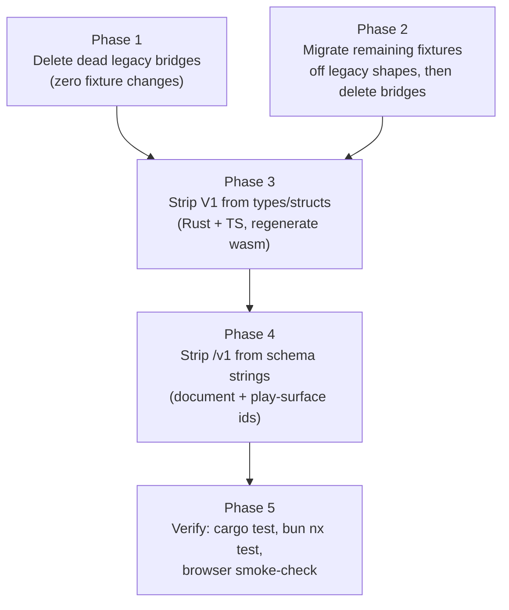

# Repo-wide Version Suffix & Legacy Code Cleanup

Full-repo audit (3 parallel explore passes) found the versioned/legacy surface breaks into three independent buckets. They are sequenced below by risk so later phases don't get blocked by fixture-dependent deletions.

## Phase 1 — Delete dead legacy bridges (no fixture migration needed)

These have zero live call sites / zero persisted data depending on them, per the audit — safe to delete outright.

- **Golden Layout ↔ WindowLayout bridge**, [framework/product/platform/renderer/react/index.tsx](framework/product/platform/renderer/react/index.tsx): delete `convertLegacyGoldenNodeToWindowLayoutNode` + legacy branch in `parseWindowLayout` (436-493), `convertWindowLayoutNodeToGoldenConfig`/`convertWindowLayoutToGoldenConfig`/`layoutNodeToGoldenLayoutConfig` (543-571), `stringifyWindowLayout`/`deduplicateWindowLayout` (501-541) since nothing calls them at runtime. Remove/update the sole test at 2625-2652.
- **Icon `image:` prefix stripping**: delete `stripLegacyImageDataPrefixForIcon` (`ui/react/index.tsx:956-973`) and `strip_legacy_image_data_prefix` (`infinite/cavas/rs/lib.rs:1130-1140,1283,1325`); no fixture uses the prefix. Update the one test asserting the old prefix (`puzzle/2d/react/index.tsx:10245`).
- **`TrinityJackResultV1`** (`trinity/react/index.tsx:111-112`): delete the `@deprecated` alias — zero references anywhere.
- **Deprecated brush budget aliases** (`puzzle/3d/react/index.tsx:4344-4351`): delete `DEFAULT_BRUSH_PLACEMENT_COLLISION_TOLERANCE*` — unused, canonical `*_OVERLAP_BUDGET*` already used everywhere.
- **`Puzzle2dIconSelectorMode` deprecated alias + `classifyPuzzle2dIconSelectorMode` prop** (`ui/react/index.tsx:9202-9203,9296-9297,9308-9310`): delete; switch the one re-export in `puzzle/2d/react/index.tsx:938` to the canonical `IconSelectorMode` name directly.
- **`kindsCompatible`** test-only helper (`puzzle/3d/react/index.tsx:3807-3810`): delete along with its two test call sites (`puzzle/3d/react/index.tsx:13068-13070`, `puzzle/3d/play/index.ts:4370-4374`) since real drag logic uses `compatPairMatches`/`vorticesAttractionCompatibleForDrag`. Keep `kindCompatibilityFromFixtureMeta`/`resolvePuzzle3dKindCompatibility` — those are active fixture-driven config, not legacy.

## Phase 2 — Migrate remaining fixtures, then delete their bridges

These bridges are still load-bearing; fixtures must move to the canonical shape first (direct handcrafted edits, no migration scripts kept).

1. **Kit array-vs-`{hash,items}` dual parsing** — canonical format is the block `{hash, items}` (already emitted by `initial_kit_projection` in `compose/client/lib/rs/lib.rs`).
   - Regenerate/hand-edit to block format: `compose/fixture/metabolism.shallow.kit.compose.json`, `nakagin-capsule-tower.filtered.kit.compose.json`, `synthetic-find-replaceable.kit.compose.json`, `validate-kit-diff.cases.compose.json` (and its consumers `compose/client/lib/py/main.py:~21357`, `compose/client/lib/go/main_test.go:~1276`, `compose/client/lib/net/Compose.Tests/Tests.cs:~782`).
   - Update `compose/client/schema/json/kit.json` collection defs to block-only.
   - Delete the array branches: `compose/fixture/script.ts:10` (`fixtureItemsOf`), `asset/index.ts:115` (`__itemsOf`), `compose/dev/algorithm/index.ts:106-117` (duplicate helper), `compose/client/lib/rs/lib.rs:11470-11471,11479-11480` (`json_array_or_block_items_ref/_mut`, simplify ~30 call sites), and delete/invert the compat test at `compose/client/lib/rs/lib.rs:20928-20935`.

2. **`legacyActivate` fallback** (`framework/product/platform/renderer/react/index.tsx:1262-1289`, duplicated in `framework/product/playground/renderer/react/index.tsx:714-748`) — migrate the three remaining producers of `onClick` on `UiTreeItemNode` to `command:` descriptors (matching presentation/sequence/lowpoly/raster/draw, which already migrated): `puzzle/2d/play/index.ts:~1055-1182`, `puzzle/5d/play/index.ts:~270-289`, `reasoning/mindmap/wires/play/index.ts:~202,210`. Then delete `legacyActivate` in both renderer files, using `item.command` only.

3. **Puzzle2d `meta.kindCatalogs` legacy fallback + rectangle-node normalization** (`puzzle/2d/react/index.tsx`: `fixtureMetaKindCatalogBundle` 510-533, `puzzle2dNormalizeFixtureNode` + rectangle parse branch 1191-1200/2331-2356) — migrate `puzzle/2d/fixture/concrete-forest.2d.json` to `manifestId` (create a manifest for it, mirroring `nakagin`) and convert its rectangle seed node to a circle node with converted handle angles (using `puzzle2dRectangleHandleAngleToCircleAngle` one last time by hand). Then delete the legacy `kindCatalogs` fallback branch and the rectangle normalization/parse path, keeping only `manifestId` + circle-node parsing.

## Phase 3 — Strip "V1" suffix from all types/structs (mechanical rename)

No V2 ever existed — the suffix is pure noise in a greenfield repo. Rename every `*V1` identifier to drop the suffix, in both the Rust and TS definition when dual-defined. Highest-impact files (touch Rust + TS + regenerate wasm `pkg/` bindings after):

- `mathematical/graph/port/directed/dag/lib.rs` + `.../dag/react/index.tsx`: `DagFixture`→`DagFixture`, `DagCamera`→`DagCamera`, `DagFixtureEdge`→`DagFixtureEdge`, `DagPort`, `DagMedia`, `DagNodeBase`, `DagComputationNode`, `DagSliderNode`, `DagSelectNode`, `DagScreenNode`, `DagNode` → drop suffix.
- `flow/react/index.tsx` + `flow/core/lib.rs` + `flow/module/wasm/lib.rs`: ~20 `Flow*V1` types (`FlowFixture`, `FlowDocument`, `FlowGui`/`FlowUi`, `FlowModuleManifest`, etc.) and drag helpers `encodeFlowWidgetDescriptorForDrag`/`decodeFlowWidgetDescriptorFromDrag`, `FLOW_WIDGET_DRAG_MIME`.
- `sequence/core/lib.rs` + `sequence/core/index.ts`: `SequenceStep`→`StepWidget`, `SequenceEdge`, `SequenceFixture`, `SequenceStep`, `SequenceSlotRef` (resolve the Rust/TS name asymmetry `SequenceStep`/`SequenceStep` to one consistent name); `SEQUENCE_STEP_DRAG_MIME` in `sequence/react/index.tsx:102`.
- `puzzle/2d/react/index.tsx`: `Puzzle2dFixture` and all subtypes (`*HandleV1`, `*CircleNodeV1`, `*RectangleNodeV1`(if still needed post-Phase-2), `*NodeV1`, `*EdgeV1`), drag functions/MIME, plus the `MindmapFixture` alias family in `reasoning/mindmap/react/index.tsx`.
- `puzzle/3d/react/index.tsx` + `puzzle/3d/rs/lib.rs`: `Fixture`→`Fixture`, `FixtureObject`, drag functions/MIME.
- `trinity/ram/lib.rs` + `trinity/react/index.tsx`: `GraphFixture`/`Camera` (Rust) reconciled with `TrinityFixture` (TS) naming; `TrinityPort`, `TrinityNode`, `TrinityJackRun`, `TrinityJackToken`, `TrinityJackCompletion`, `RuleParameter*V1`.
- Remaining single-module sets (drop `V1` in both definition + all references): `writer/core/index.ts` (`WriterDocument`), `imperative/core/index.ts`+`lib.rs` (`Imperative*V1`), `lowpoly/core/index.ts`+`lib.rs` (`Lowpoly*V1`), `semios/core/index.ts`+`rs/lib.rs` (`Semios*V1`), `shooting/react/index.tsx` (`Shooting*V1`), `gis/2d/play/index.ts` (`GisMapFixture*V1`), `framework/product/presentation/core/index.ts` (`PresentationDeck`), `reasoning/mindmap/wires/react/index.ts` (`Wires*V1`), `compose/client/lib/sketchpad/js/index.ts` (`Sketchpad*V1`), `forms/core/index.ts` (`FormsExtensionManifest`).
- `mathematical/graph/manifest/script.ts`: rename the `GraphManifestDocument` generator template (regenerates into `manifest/generated/types.ts`).
- After Rust-side renames, regenerate each crate's `pkg/` wasm bindings so `.d.ts` stays in sync (no hand-editing generated files).

## Phase 4 — Strip "/v1" from schema & surface strings

Drop the version segment from every schema/document identifier and play-surface id (~50 strings). Update the constant, all comparison/validation sites, and every checked-in fixture JSON file whose `schema`/`kind` field embeds the string (e.g. `"flow.fixture"` → `"flow.fixture"`).

- Document schemas: `dag.fixture/v1`, `flow.fixture/v1`, `flow.document/v1`, `flow.module/v1`, `flow.dag/v1`, `sequence.fixture/v1`, `puzzle.2d.fixture/v1`, `puzzle.2d/v1`, `puzzle.3d.fixture/v1`, `puzzle.3d/v1`, `puzzle.5d/v1`, `trinity.graph/v1`, `writer.document/v1`, `imperative.document/v1`, `imperative.catalogue/v1`, `raster.document/v1`, `draw.document/v1`, `forms.form/v1`, `forms.dictionary/v1`, `presentation.deck/v1`, `semios.studio/v1`, `semios.media-graph/v1`, `manifest/v1`, `lowpoly.fixture/v1`, `shooting.fixture/v1`, `shooting.scene/v1`, `gis.map/v1`, `gis.map.fixture/v1`, `cad.scene/v1`, `spatial.model/v1`, `spatial.modelspace/v1`, `reasoning.mindmap.fixture/v1`, `reasoning.mindmap/v1`, `reasoning.wires.fixture/v1`, `procedural.2d/v1`, `procedural.3d/v1`, `procedural.fixture/v1`, `procedural2d.fixture/v1`, `compose.kit/v1`, `compose.design/v1`, `compose.type/v1`, `vcs.demo/v1`, `test/v1`.
- Play-surface ids (~20 modules, ~45 strings, e.g. `sequence.play/v1`→`sequence.play`, `flow.play/v1`, `dag.play/v1`, etc.) — lower risk since these are UI routing ids, not persisted data.
- Update fixture JSON files under every `*/fixture/*.json` that embed a versioned schema string, plus Storybook fixtures (`.storybook/**`).

## Phase 5 — Verification

- `cargo test` for every touched Rust crate (mathematical/graph, flow/core, flow/module/wasm, sequence/core, trinity/ram, imperative, lowpoly, semios, writer, raster, draw, forms, presentation, puzzle/2d/rs, puzzle/3d/rs, puzzle/5d/rs, gis, cad, compose/client/lib/rs).
- `bun nx test` for every touched TS package.
- Rebuild affected wasm `pkg/` outputs.
- Browser-verify a representative sample of playgrounds (flow, sequence, puzzle2d, puzzle3d, compose) load/save fixtures correctly with the new schema strings and no console errors.
- Per repo workflow: this work must happen inside a ticket (or a small number of per-phase tickets, given the size), closed with a summary listing all touched files; do not leave any of this as a runnable "compat" path.

## Scope note

This touches on the order of 90+ identifiers and 50+ schema strings across ~85 files spanning nearly every top-level module. Given the size, execution will proceed phase-by-phase (each phase independently compiles/tests green) rather than as one mega-change, to keep the repo buildable throughout.
