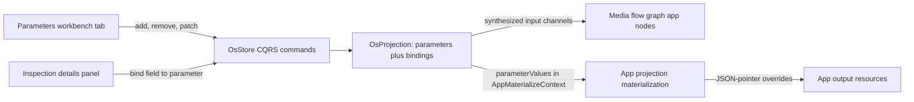

# OS Studio Parameters

## Context

Parameters are a new OS-level concept: named, typed values defined per studio that apps consume instead of hardcoding values. Per your choices: bound parameters appear **port-only** as extra labeled input channels on app nodes (no separate parameter source node), and binding is **field-level** — individual value fields of an app can be driven by a parameter.

One architectural note: technology apps' own detail panels (e.g. the draw or shooting inspector) only render in their standalone playgrounds, which run without a studio store — they cannot see studio parameters today. The field-level binding therefore surfaces in the S details (Inspection) panel: each technology app declares its bindable fields (JSON-pointer paths into its projection) in its app registration, and the Inspection panel renders a value-or-parameter control per declared field. This touches every technology registration, not every technology inspector.

## Data flow

## 1. Parameter model in OS core

In [framework/product/os/core/js/index.ts](framework/product/os/core/js/index.ts):

- `OsParameter` discriminated union by `type`:
  - `numeric`: `value: number`, constraints `min?`, `max?`, `step?`
  - `categorical`: `value: string`, `options: readonly string[]`
  - `toggle`: `value: boolean`
  - `text`: `value: string`
- `OsParameterFieldBinding`: `{ parameterId, instanceId, fieldPath }` (fieldPath = JSON pointer into the app projection).
- Extend `OsProjection` with `parameters` and `parameterBindings`; update `defaultOsProjection`, `cloneProjection`, `parseOsDocument`.
- New `OsCommand` / `OsOperation` variants with forwards/backwards for undo: `addParameter`, `removeParameter` (cascades: unbind everywhere, remove channels), `patchParameter` (name, type switch, value, constraints — clamp numeric value to min/max/step, validate categorical value against options), `bindParameterField`, `unbindParameterField`.
- Port-only channels: applying `bindParameterField` adds an input port `{instanceId}:param.{parameterId}:in` with resource kind `parameter.value` to the instance's media graph node (and recomputes node height); unbind removes it. Extend `osMediaGraphToDagFixture` to label parameter ports with the parameter name.
- Value flow: extend `AppMaterializeContext` with `parameterValues: Readonly<Record<string, unknown>>`; in `appInstanceResourceProjection`, resolve the instance's bindings to values and apply them generically after `materializeProjection` via a new `applyParameterValuesToProjection` (JSON-pointer deep-set), with an optional `applyParameterValues` hook on `AppVcsHandler` for technologies needing custom behavior.

## 2. Resource kind

- Add `parameter.value` descriptor kind to [s/manifest/resources.manifest.json](s/manifest/resources.manifest.json) and regenerate [mathematical/graph/manifest/generated/s-resources.ts](mathematical/graph/manifest/generated/s-resources.ts) (and `.rs`) with the existing manifest generate task in `mathematical/graph/manifest/script.ts`.

## 3. Bindable field declarations per technology

- Add `parameterFields?: readonly { fieldPath, label, type }[]` to `OsAppRegistration`.
- Handcraft declarations in `TECHNOLOGY_APP_RESOURCE_BY_PROGRAM` in [s/core/js/internal.ts](s/core/js/internal.ts) for every app whose projection has scalar/enum fields (e.g. shooting camera zoom, procedural seeds, raster brush size, lowpoly counts, layout dimensions, …), verifying each fieldPath against the actual projection shape.

## 4. Parameters workbench tab (third tab)

- New constants `FRAMEWORK_PANEL_TAB_PARAMETERS_ID/LABEL/ICON_ID` in [framework/core/js/index.ts](framework/core/js/index.ts); register a `sliders-horizontal` icon.
- `buildSPlayParametersTree(ctrl)` in [s/core/js/index.ts](s/core/js/index.ts): "Add Parameter" button; per parameter a section with editable fields — Name (text input), Type (select), Value (number stepper/slider for numeric respecting bounds and step, select for categorical, toggle, text), constraints (Min/Max/Step inputs for numeric; option rows with remove buttons plus add-option input for categorical), and a Remove button. All controls dispatch `sPlayCmd` commands.
- New `SPlayParametersPanelDefinition` next to `SPlayCataloguePanelDefinition` in [framework/product/playground/renderer/react/index.tsx](framework/product/playground/renderer/react/index.tsx) (`SPlayInner`, `augmentPanelTabs.workbench`, order after Catalogue).
- New `SPlayController.run` cases in [s/core/js/index.ts](s/core/js/index.ts): `addParameter`, `removeParameter`, `patchParameter`, `bindParameterField`, `unbindParameterField` dispatching to the studio store.

## 5. Field-level binding in the details panel

- Extend `buildSPlayInspectorTree` in [s/core/js/index.ts](s/core/js/index.ts): for a selected app instance, a "Parameters" section renders one row per declared `parameterFields` entry — a select offering "Direct value" plus all type-compatible parameters; binding/unbinding dispatches the new commands. Bound rows show the parameter's current value.
- Bound fields immediately appear as labeled input channels on the app node in the media graph (port-only, from step 1) and in the Media VFS input rows (binding column shows the parameter name).

## 6. Fixtures, tests, docs

- Update all `s/example/*.s.json` fixtures to the new `OsProjection` shape (`parameters`, `parameterBindings`); seed `demo.s.json` with a sample numeric and a categorical parameter and one binding.
- Extend the existing in-source vitest blocks (`if (import.meta.vitest)`) in [framework/product/os/core/js/index.ts](framework/product/os/core/js/index.ts) and s-core: add/patch/remove parameter, clamping, bind creates channel, undo/redo, JSON-pointer override reaches materialized projection.
- Run `nx` tests for os-core and s-core via existing script commands; verify runtime behaviour in the S playground with `[DEBUG]` logs before finishing.

## Ticket

Work happens inside a repo MCP ticket (goal association from `repo://goals`) opened at implementation start.
