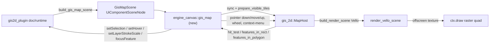

# Map Wgpu Renderer Parity

## Context

The `premigration` git tag (commit `f8376e8`, 12 commits before `HEAD`) marks the state right before the wgpu/winit rewrite. At that point the GIS map app was a React + WASM component (`gis/2d/react/index.tsx`, now deleted) offering real cartographic rendering and rich interaction. The new wgpu-native plugin, [gis/2d/plugin/rs/lib.rs](gis/2d/plugin/rs/lib.rs), only wires render-mode/vector-style/LOD dropdowns, a single flat layer-visibility toggle, single-point hit-test selection, and fit-world/undo/redo. Its composite view renders through the **generic** `canvas-2d` component (`render_canvas_2d` in [framework/renderer/wgpu/rs/lib.rs:4716](framework/renderer/wgpu/rs/lib.rs)), which draws hue-colored placeholder rectangles — no real tiles, no styled land/water/roads, no hover, no marquee/lasso, no context menu, no weight sliders.

The shared engine crate [gis/2d/rs/lib.rs](gis/2d/rs/lib.rs) is untouched since `premigration` (byte-identical except one test rename) and already contains everything needed natively: `hit_test_feature_json`, `features_in_rect_json`/`features_in_polygon_json`, `feature_screen_json`, selection/hover state + setters, theme-aware highlight rendering in `append_positions`/`append_routes` (lines 2672-2765), `layer_weight_slider_ids_json`/`clamp_map_layer_weight`, and `build_render_scene()` which implements `infinite_cavas::CanvasContent` (a Vello `Scene`). The wgpu renderer already has a native Vello-offscreen-texture pipeline for exactly this purpose — the `engine_canvas` module ([framework/renderer/wgpu/rs/lib.rs:1833](framework/renderer/wgpu/rs/lib.rs), used today by Flow/Graph/Editor via `render_vello_scene`) — `gis2d_plugin` just isn't plugged into it yet. This is a porting/wiring job, not a rewrite from scratch.

Primary dev target is the WASM build served via Trunk in a real browser tab ([framework/renderer/wgpu/script.ts](framework/renderer/wgpu/script.ts) `TrunkServeScript`), so browser `fetch()` (already implemented for other assets, e.g. `fetch_url_bytes` wasm32 branch in [infinite/world/rs/lib.rs:2647](infinite/world/rs/lib.rs)) is available for tile loading. The `native-bin` desktop target is secondary/for E2E verification.

## Phase 1 — Native Vello scene plumbing (visual foundation)

- [framework/core/rs/lib.rs:2198](framework/core/rs/lib.rs): add a `GisMapScene` struct (descriptor/fixture json, camera json, render mode, vector style, lod mode, tile URL templates, layer-visibility json, layer-stroke-scale json, selection json, hover json, selection method/mode, context-menu json) alongside `NodeGraphScene`/`Canvas2dScene`; add `pub gis_map: Option<GisMapScene>` to `UiComponentSceneNode`; add `build_gis_map_scene(...)` constructor mirroring `build_canvas_2d_scene` (line 2369).
- [gis/2d/plugin/rs/lib.rs](gis/2d/plugin/rs/lib.rs): replace `render_canvas()` (currently calls `build_canvas_2d_scene` + `map_canvas_layers`) with `build_gis_map_scene(...)` fed directly from `Gis2dPlayEnvelope.runtime`. Delete the now-dead generic-rect helpers (`map_canvas_layers`, `GisMapCanvasLayer`, `canvas_layers`, `default_map_layers`).
- [framework/renderer/wgpu/rs/lib.rs](framework/renderer/wgpu/rs/lib.rs) `engine_canvas` mod: add a `GisMap` region mirroring `NodeGraph`/`Registry` (lines 1856-2175): a per-surface `MapHost` registry (extend `EngineSurface`/`NodeGraphEngine` with a `Map(MapHost)` variant, reusing `ensure_surface`/`render_vello_scene`), a `sync_map_host(host, scene, cache)` applying every `GisMapScene` field (mirrors `sync_flow_host`, lines 1982-2047), and `paint_gis2d_map(gpu, surface_id, scene, bounds, ctx)`: sync → `host.prepare_visible_tiles()` → `host.build_render_scene()` → `render_vello_scene` → draw the resulting texture as a raster quad into `ctx.draw`.
- Add `component_kind == "gis2d-map"` dispatch arms next to every existing `"node-graph"` arm (wheel ~4020-4039, pointer-down/move/up ~4093-4270, hit-test ~4292-4320, render dispatch ~4349) so the map gets dedicated real estate instead of falling into `render_canvas_2d`.

## Phase 2 — Tile fetching

- Add a pending-tile-fetch queue on the map surface state (mirrors `collect_pending_glb_fetches`/`apply_glb_bytes` in [infinite/world/rs/lib.rs](infinite/world/rs/lib.rs)): after `prepare_visible_tiles()`, diff visible tile keys against already-uploaded ones, queue misses.
- Extend `AppRuntime::frame()`'s existing asset-poll block ([framework/renderer/wgpu/rs/lib.rs:10883-10911](framework/renderer/wgpu/rs/lib.rs)) to also drain pending map tile fetches, fetching bytes via the same `fetch_url_bytes`-style wasm32 `fetch()` path, then calling `host.upload_tile`/`upload_vector_tile`.
- For the secondary `native-bin` target, reuse the existing blocking `pollster::block_on` pattern already accepted for GLB fetches (add a minimal native HTTP GET, e.g. `ureq`, under `[target.'cfg(not(target_arch = "wasm32"))'.dependencies]` in [framework/renderer/wgpu/rs/Cargo.toml](framework/renderer/wgpu/rs/Cargo.toml)) — same tradeoffs as today's GLB fetch, not a new architecture.

## Phase 3 — Interaction parity

- [gis/2d/plugin/rs/lib.rs](gis/2d/plugin/rs/lib.rs): extend `Gis2dPlayRuntime` with `selected_position_ids`, `selected_route_ids`, `hovered_kind`/`hovered_id`, `selection_method` (rectangle/lasso), `selection_mode` (default/additive/subtractive/invertive). Add commands `setFeatureSelection` (extend with `mode`), `setHover`, `setSelectionMethod`, `clearSelection`, `selectAll`, `deselect`, `focusFeature`, `openSource`, `setLayerStrokeScale`.
- New `engine_canvas::gis_map` pointer handling for `component_kind == "gis2d-map"`:
  - Left button: real marquee tracking (today `SceneDragMode::Marquee => {}` is a no-op stub at [framework/renderer/wgpu/rs/lib.rs:4088](framework/renderer/wgpu/rs/lib.rs)) — track drag path in `SceneSurfaceState`, query `host.features_in_rect_json`/`features_in_polygon_json` live on move (method from runtime state), compute merge mode from modifier keys (small Rust port of the old `marqueeModeFromModifiers`/`marqueeCoverageFromGesture` helpers), dispatch `setFeatureSelection` on pointer-up.
  - Middle button (button 1): forward to `host.pointer_down_screen(x,y,1)`/move/up for pan (already gated correctly in `MapHost`).
  - Hover: on pointer-move with no button down, `host.hit_test_feature_json(x,y)`, dispatch `setHover` only on change.
  - Right-click: hit-test, then `push_context_menu_item` items (Select/Deselect/Focus/Open source for a feature; Select all/Clear selection/Fit world for empty canvas) mirroring `push_graph_context_menu` ([framework/renderer/wgpu/rs/lib.rs:4838](framework/renderer/wgpu/rs/lib.rs)).
  - Draw the marquee overlay (rect or lasso outline) each frame while dragging using existing selection theme colors.
- Feed `selected_position_ids`/`selected_route_ids`/hover into `MapHost::set_selection_json`/`set_hover_json` each sync — the halo/hover stroke rendering already exists in `append_positions`/`append_routes`, so highlights "just work" once wired.
- `focusFeature`: add a small `MapHost::focus_feature(kind, id)` in [gis/2d/rs/lib.rs](gis/2d/rs/lib.rs) if not already present (center + zoom camera to a feature), reusing `feature_screen_json`/projection math already there.
- `openSource`: new tiny `open_url` helper (wasm32: `web_sys::window().open_with_url`; native-bin: best-effort/log-only) since no such affordance currently exists in `shell.rs`.

## Phase 4 — Layer weight sliders

- [gis/2d/plugin/rs/lib.rs](gis/2d/plugin/rs/lib.rs) `map_view_field_group`/`build_inspector_tree`: add `UiSliderNode`s for the layer ids returned by `host.layer_weight_slider_ids_json(lod, render_mode)` (already public, native-safe), bounds from `clamp_map_layer_weight`'s existing 0.25–3 range (step 0.05, matching the old `GIS_MAP_LAYER_WEIGHT_MIN/MAX/STEP`). Wire `setLayerStrokeScale` in `handle_command`.

## Phase 5 — Verification & ticket

- Open a repo-MCP ticket under the `🎯gis🎯map` goal (same goal as the closed `MAP-HOVER-SELECTION-CONTEXT-MENU-PANNING` ticket), keep all temp scripts/logs in its folder.
- Rebuild the `gis2d` native plugin + wgpu Trunk dev server (`SEMIO_PLUGIN=gis2d SEMIO_RENDERER=wgpu`), verify at runtime against premigration behavior: styled tile/vector map (not placeholder rects), hover highlight, rectangle+lasso multi-select in all 4 modes, middle-drag pan + wheel zoom, right-click context menu actions, layer visibility + weight sliders, undo/redo still functional.
- Extend the existing Rust test modules in [gis/2d/plugin/rs/lib.rs](gis/2d/plugin/rs/lib.rs) (no new test files) for the new commands; run the full Rust + relevant vitest suites.
- Close the ticket with a summary listing every file touched.
