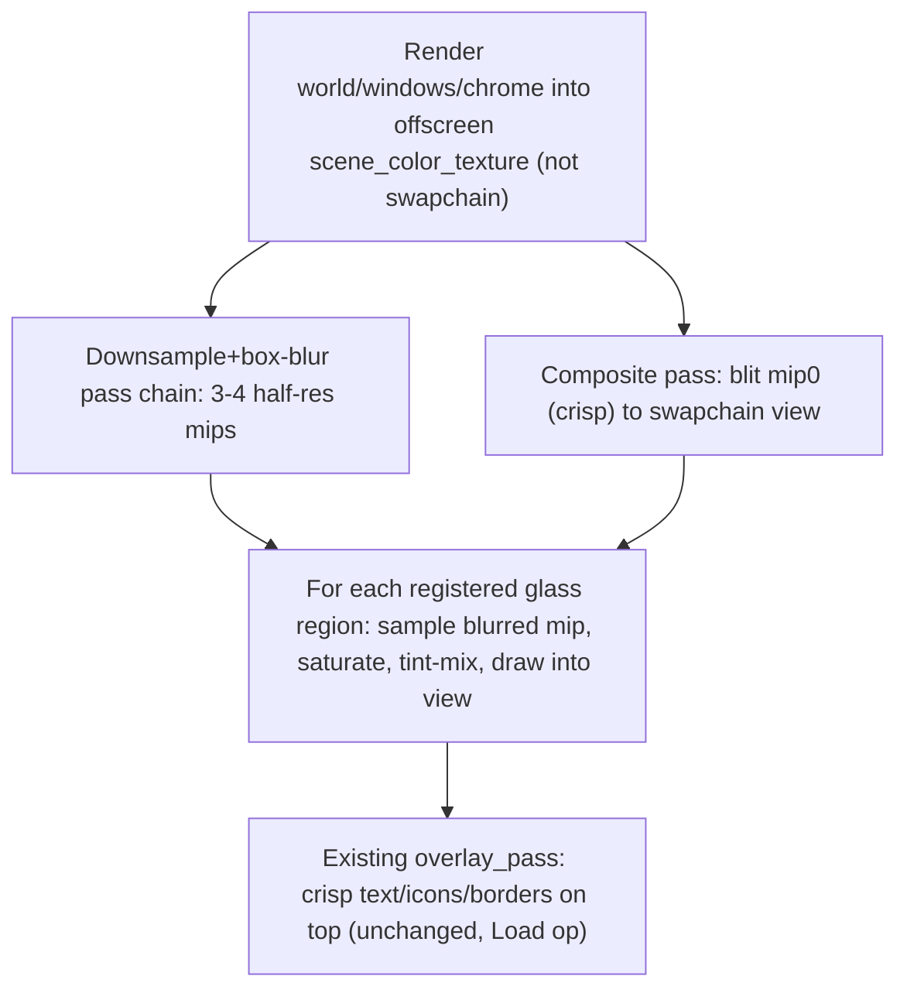

# Wgpu Panel Glass Blur

## Root cause (verified)

None of wgpu's "glass" surfaces are actually translucent/blurred today — they're opaque flat fills:

- **Side panel** — `[framework/renderer/wgpu/rs/shell.rs](framework/renderer/wgpu/rs/shell.rs)` `render_floating_panel` (~3225-3229) fills with `theme.glass_panel_fill()`. `[ui/wgpu/rs/theme.rs](ui/wgpu/rs/theme.rs)` `glass_panel_fill()` (152-165) precomputes `mix(panel, canvas_clear, 0.58)` in software and bakes it as **fully opaque** (`a: 255`) — it assumes a flat canvas background and paints over real content instead of blending with it.
- **Context menus/dropdowns** (`render_context_menu`, `render_theme_dropdown`, `render_example_dropdown`, `render_command_list`/palette in shell.rs; the select popup in `[ui/wgpu/rs/widgets.rs](ui/wgpu/rs/widgets.rs)` ~684) all fill with `theme.overlay_bg`, a **98%-opaque** flat color (`tokens.json` `overlayBg` alpha 0.98) — explicitly called out as "temporary, ~opaque since wgpu has no backdrop-blur" in a prior styling-parity plan.
- **Window measures rail / engagement rail** — `render_window_measures_rail` (dock.rs-adjacent, shell.rs ~~4034) and `render_window_engagement_rail` (~~4324) fill with plain opaque `theme.panel`.

Premigration React (`ui/styling/js/ui.css`) instead uses real `backdrop-filter: blur(...) saturate(1.45)` + a translucent `color-mix` background for each tier:

| Tier                                               | CSS utility               | Alpha                 | Blur            |
| -------------------------------------------------- | ------------------------- | --------------------- | --------------- |
| panel (side panel)                                 | `ui-glass-panel`          | 0.58 of `--panel`     | 2.5rem (40px)   |
| menu (context menu/dropdown/select/command/dialog) | `ui-glass-menu`           | 0.36 of `--temporary` | 1.5rem (24px)   |
| windowOptions (measures rail, engagement rail)     | `ui-glass-window-options` | 0.22 of `--panel`     | 0.875rem (14px) |

(`toolbar` tier exists in the CSS/React glass-tier enum but has no active `GlassTierProvider` usage today — out of scope.)

## Chosen approach: real backdrop blur (per user decision)

WebGPU can't sample a texture it is currently rendering into, so the main + raster passes must target a new offscreen `scene_color_texture` instead of the swapchain `view` directly; a cheap blit + per-region glass composite pass then produces the final `view`, and the existing overlay pass (crisp UI) still draws on top unchanged.

## Steps

### 1. Tokens (`ui/styling/tokens.json` + regenerate)

- `opacities`: add `glassMenuAlpha: 0.36`, `glassWindowOptionsAlpha: 0.22` (keep existing `glassPanelAlpha: 0.58`).
- `metrics.chrome`: add `glassBlurPx: 24.0`, `glassPanelBlurPx: 40.0`, `glassWindowOptionsBlurPx: 14.0`, `glassSaturate: 1.45` (all pre-resolved from the `rem`/unitless CSS values, matching the existing `uiSpacingCompactPx` convention).
- Run `bun ./ui/styling/script.ts generate` to regenerate `ui/styling/rs/generated.rs`, `.py`, `.ts`, CSS (no script.ts changes needed — opacities/metrics.chrome already loop generically).

### 2. `ui/wgpu/rs/theme.rs` — glass tint constants

- Replace `glass_panel_alpha`/`glass_panel_fill()` with three tier structs/consts (`glass_panel`, `glass_menu`, `glass_window_options`), each `{ tint: Rgba (panel or temporary color), alpha, blur_px, saturate }` sourced from the new generated constants. Remove the opaque-bake logic entirely — the tint is now composited by the GPU against a real blurred backdrop, not pre-mixed against an assumed flat canvas.
- Update/replace the `glass_panel_fill_matches_react_color_mix_over_canvas` test with tier-constant assertions (tint hex + alpha + blur px per tier, light/dark).
- Retire `overlay_bg`/`opacities::GLASS_PANEL_ALPHA`-only usage once call sites migrate (step 5); remove the field if nothing else references it.

### 3. `ui/wgpu/rs/shaders.rs` — new WGSL passes

- `BLUR_DOWNSAMPLE_SHADER`: fullscreen-quad fragment shader sampling the previous mip with a small box/tent kernel, writing to the next (half-res) mip.
- `GLASS_SHADER`: instanced rounded-rect shader (mirrors `UI_SHADER`'s `KIND_ROUNDED` SDF for corner clipping) that samples `scene_color_texture` at a given mip via `textureSampleLevel`, applies saturate (`luma = dot(rgb, vec3(0.2126,0.7152,0.0722)); rgb = mix(vec3(luma), rgb, saturate)`), then mixes with the instance's tint color at the instance's alpha (`rgb*alpha + blurred*(1-alpha)`), output opaque.

### 4. `ui/wgpu/rs/draw.rs` + `ui/wgpu/rs/gpu.rs` — pipeline rework

- `GpuContext`: add an offscreen `scene_color_texture` (RENDER_ATTACHMENT | TEXTURE_BINDING, `mip_level_count` ~4, same size as swapchain, recreated on `resize`) plus its mip `TextureView`s and a linear-mipmap `Sampler`.
- `UiPipelines::render`: retarget the existing main interleaved pass + raster pass from `view` to `scene_color_texture`'s mip-0 view (`load: Clear` as before). Add: (a) a blur-downsample sub-pass per mip level (N-1 draws), (b) a "blit" draw of mip 0 into `view` (reuse `KIND_TEXTURED`/a trivial fullscreen textured quad), (c) a glass-composite draw per registered `GlassRegion` into `view` using the new `GLASS_SHADER` pipeline and the appropriate mip (panel→~~40px equivalent mip, menu→~~24px, windowOptions→~14px). The existing `overlay_pass` (crisp UI, Load op into `view`) runs unchanged after this.
- `DrawList`: add `pub glass_regions: Vec<GlassRegion>` (`rect: [f32;4]`, `radius: f32`, `tint: Rgba`, `alpha: f32`, `tier: GlassTier`) and `pub fn push_glass(&mut self, rect: [f32;4], radius: f32, tier: GlassTier)` reading tint/alpha/blur from `Theme`. Glass regions are collected during the same UI pass as other chrome and consumed by the new composite step before the overlay pass.

### 5. Call-site migration (visual behavior only, not structural UI changes)

- `[framework/renderer/wgpu/rs/shell.rs](framework/renderer/wgpu/rs/shell.rs)`: `render_floating_panel` → `draw.push_glass(panel_rect, theme.border_radius, GlassTier::Panel)` instead of `push_rounded(..., theme.glass_panel_fill(), ...)`. `render_context_menu`, `render_theme_dropdown`, `render_example_dropdown`, `render_command_list`/palette → `overlay.push_glass(rect, theme.border_radius, GlassTier::Menu)` instead of `theme.overlay_bg`. `render_window_measures_rail` (~~4034) and `render_window_engagement_rail` (~~4324) → `draw.push_glass(rail_rect, theme.border_radius, GlassTier::WindowOptions)` instead of `theme.panel`.
- `[ui/wgpu/rs/widgets.rs](ui/wgpu/rs/widgets.rs)` (~684): select/dropdown popup → `GlassTier::Menu` glass region instead of `theme.overlay_bg`.
- Borders, tab headers, text, icons, buttons drawn on top of these rects are untouched (they already render via separate `push_solid`/`push_rounded`/text calls after the fill).

### 6. Verification

- `cargo test -p ui_wgpu -p ui_styling` (updated theme tests).
- Rebuild wasm (`bun ./framework/renderer/wgpu/script.ts wasm`).
- Re-run the wgpu E2E suite; visually confirm in the browser that moving a docked 3D/2D window under the side panel, a context menu, or a window-options rail shows a genuinely blurred/saturated/tinted glimpse of that content (not a flat opaque box), in both light and dark themes, matching the React reference glass look.
- Repo workflow: open/reopen a ticket under the appropriate goal (read `repo://goals` first), keep temp artifacts in the ticket folder, close with a summary listing all touched files.

