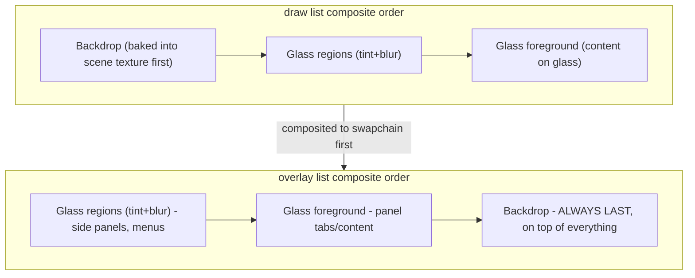

# Fix WGPU Window Options/Command Chip Rendering Above Side Panels

## Root cause

The wgpu renderer paints two GPU draw lists per frame: `draw` (base/windows/window-panel tier) and `overlay` (side panels + temporary tier), composited in `composite_to_swapchain` in [ui/wgpu/rs/lib.rs](ui/wgpu/rs/lib.rs):




For `draw`, backdrop content is baked into the scene texture *before* any glass compositing, so anything glassy in `draw` correctly sits visually above plain `draw` content. But for `overlay`, `composite_to_swapchain` (`ui/wgpu/rs/lib.rs:3235-3293`) always runs `composite_glass_regions(overlay)` and `render_glass_foreground(overlay)` **before** the final `render_overlay(overlay)` backdrop pass — regardless of push order. This means *any* plain ("backdrop") content pushed to `overlay` unconditionally renders on top of *all* glass in `overlay` (side panels included).

This quirk is actually relied upon elsewhere for correctness: `render_floating_panel` ([framework/renderer/wgpu/rs/lib.rs:10317-10429](framework/renderer/wgpu/rs/lib.rs:10317-10429)) pushes its own glass then draws its border hairlines as plain backdrop afterward, expecting them to render crisply on top of its own tint. `render_command_list` (search/find/palette, `framework/renderer/wgpu/rs/lib.rs:10963-11081`) does the same for its title/rows. So a global reorder of the overlay pipeline would break these. The bug is specifically that the **window-options/command fold chips don't belong in `overlay` at all** — they are window-panel tier and must stay below the side panel, like their unfolded rail counterpart already does.

## The bug

In `render_window_measures_rail` (folded "Window Options" chip) and `render_window_engagement_rail` (folded "Command" chip), both in [framework/renderer/wgpu/rs/lib.rs](framework/renderer/wgpu/rs/lib.rs):

```1148:1152:framework/renderer/wgpu/rs/lib.rs
            if let Some(chip_draw) = overlay.as_deref_mut() {
                render_chrome_group(chip_draw, atlas, icons, input, theme, chip, &[item], false);
            } else {
                render_chrome_group(draw, atlas, icons, input, theme, chip, &[item], false);
            }
```

(same pattern at `framework/renderer/wgpu/rs/lib.rs:11496-11500` for the "Command" chip)

Since `render_chrome` ([framework/renderer/wgpu/rs/lib.rs:9759](framework/renderer/wgpu/rs/lib.rs:9759)) always passes a `Some(overlay)`, the `overlay` branch is the one that always executes today, so both fold chips always land in `overlay`'s backdrop tier — which (per the diagram above) always paints on top of the side panels' glass. This exactly matches the reported symptom, and matches the default state (`measures_folded` defaults to `true`, `engagement_activated` defaults to `false`), so it's visible out of the box.

The unfolded rail (the expanded glass card) already does the right thing — it uses `draw.push_glass(..., GlassTier::WindowOptions, ...)` directly on `draw` (`framework/renderer/wgpu/rs/lib.rs:11187` and `:11511`), which correctly composites *before* `overlay`'s side panels. Only the folded chip is inconsistent with this.

## Fix

Render both folded chips unconditionally to `draw` instead of preferring `overlay`, matching the unfolded rail's list placement:

- [framework/renderer/wgpu/rs/lib.rs:11133-11157](framework/renderer/wgpu/rs/lib.rs:11133-11157) (`render_window_measures_rail`, "Window Options" chip): remove the `if let Some(chip_draw) = overlay.as_deref_mut() { ... } else { ... }` branch, call `render_chrome_group(draw, atlas, icons, input, theme, chip, &[item], false)` directly.
- [framework/renderer/wgpu/rs/lib.rs:11481-11501](framework/renderer/wgpu/rs/lib.rs:11481-11501) (`render_window_engagement_rail`, "Command" chip): same simplification.

The `overlay` parameter stays on both functions (still needed for nested measure/engagement widgets that legitimately need overlay access, e.g. dropdowns), only the chip's own draw-list choice changes. Hit-testing is unaffected (hit target registration/order is unrelated to which draw list the visual goes into, and side-panel hits already register after window hits in `render_chrome`, so panels already correctly win pointer hits over the chip).

## Verification

- `cargo check -p semio-framework-renderer-wgpu` (and workspace check) to confirm it compiles.
- Run the wgpu dev app, open a window whose kind has measures/engagement, open a side panel that overlaps the folded chip position (top-right/top-left of window content), and confirm the chip is now visually occluded by the panel's glass instead of floating above it. Also verify the unfolded rail still renders correctly beneath the panel (regression check), and that dragging/clicking through the panel over the chip area hits the panel, not the chip.

## Ticket

Per repo workflow, open a new ticket (e.g. under the `Running Sketchpad` goal) documenting this z-order fix before editing, since no existing open ticket covers wgpu chrome layer ordering.