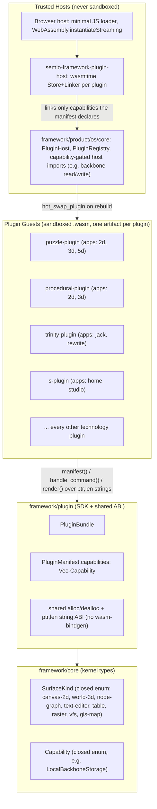

# Plugin OS Architecture Refactor

## Current state (confirmed by reading the code)

The Rust plugin stack is real and mostly sound, but has four concrete gaps against the model you described:

1. **"Plugin = collection of apps" is violated.** `puzzle/2d/plugin/rs`, `puzzle/3d/plugin/rs`, `puzzle/5d/plugin/rs` are three separate crates, each producing its own `PluginManifest` with `plugin_id` `"puzzle2d"`/`"puzzle3d"`/`"puzzle5d"` (see [puzzle/2d/plugin/rs/lib.rs:1956-1963](puzzle/2d/plugin/rs/lib.rs)). Same split for `procedural/2d` + `procedural/3d`, and for `trinity/jack/plugin/rs` (confusingly already named crate `trinity-plugin` / package `semio:trinity`) + `trinity/rewrite/plugin/rs`. `gis/2d/plugin/rs` and `reasoning/mindmap/wires/plugin/rs` are single-app plugins named after the sub-technology instead of the technology root, so they'd need another rename the moment a second app appears. `s/plugin/rs` is the one crate that already does this right (`bundle()` registers both `home` and `studio` apps in [s/plugin/rs/lib.rs:2694-2702](s/plugin/rs/lib.rs)).
2. **Surfaces are stringly typed, not predefined/closed.** `UiComponentSceneNode.component_kind` is a plain `String` ([framework/core/rs/lib.rs:2404-2428](framework/core/rs/lib.rs)). The 8 `build_*_scene` helpers each hardcode the right literal (`"canvas-2d"`, `"world-3d"`, ...), and a near-duplicate closed enum already exists for a different purpose (`scaffold::SceneKind` in [framework/plugin/rs/lib.rs:1588-1596](framework/plugin/rs/lib.rs)) — but nothing stops a plugin from hand-constructing `UiComponentSceneNode { component_kind: "anything", .. }` since the struct fields are `pub`.
3. **No capability/sandboxing model, and the native dev path is genuinely unsandboxed.** Browser plugins are safe today by omission (no plugin declares `web-sys`/`js-sys`/wasm-bindgen host imports, confirmed by repo-wide search), but `framework/plugin/rs/lib.rs` also ships a `native_host::NativePluginLibrary` ([lines 1405-1571](framework/plugin/rs/lib.rs)) that `dlopen`s a **native** dylib (`SEMIO_NATIVE_PLUGINS=1`, wired in [framework/product/os/dev/script.ts:29-58](framework/product/os/dev/script.ts)) — full process access, no sandbox at all. `s/plugin/rs/lib.rs` already uses `std::fs` and `rusqlite` behind `#[cfg(not(target_arch = "wasm32"))]` ([lines 193-341](s/plugin/rs/lib.rs)) for its local folder-studio backbone — exactly the kind of ambient authority that must become an explicit, host-mediated capability instead of code baked into the guest.
4. **Duplicated, hand-maintained plugin registries.** The plugin list (id → crate path → wasm artifact) is hand-copied in `framework/product/os/dev/js/index.ts` (`PLUGIN_BUILD_TARGETS`) and again in `framework/renderer/wgpu/js/boot.ts` (`PLUGIN_TARGETS`) — 25 entries each, already inconsistent (`boot.js`'s stale compiled fallback defaults to `"lowpoly"`, the dev index defaults to `"s"`). Nothing generates this from the workspace/crate metadata the way the graph-manifest system already does ([mathematical/graph/manifest/script.ts](mathematical/graph/manifest/script.ts) is the pattern to copy).

`PluginHost::hot_swap_plugin` already exists and bumps instance generations ([framework/product/os/core/rs/lib.rs:109-115](framework/product/os/core/rs/lib.rs)), but the live dev loop only rebuilds the wasm artifact and relies on the browser/dev-server reloading the page ([framework/product/os/dev/script.ts:124-146](framework/product/os/dev/script.ts)) — the renderer never actually calls `hot_swap_plugin`, so "hot-swappable" is not really wired end-to-end yet.

## Target architecture

## Phase A — Plugin = collection of apps (structural consolidation)

Consolidate every technology onto **one plugin crate per technology, at the technology root**, each registering all of that technology's apps via `PluginBundle::register_app` (already the correct pattern in `s/plugin/rs`):

- New `puzzle/plugin/rs` (crate `puzzle-plugin`, package `semio:puzzle`) merges the app logic currently in `puzzle/2d/plugin/rs`, `puzzle/3d/plugin/rs`, `puzzle/5d/plugin/rs` into apps `"2d"`, `"3d"`, `"5d"` of one bundle. Delete the three old plugin crates.
- New `procedural/plugin/rs` (`procedural-plugin`, `semio:procedural`) merges `procedural/2d/plugin/rs` + `procedural/3d/plugin/rs` into apps `"2d"`, `"3d"`. Delete the two old crates.
- New `trinity/plugin/rs` (`trinity-plugin`, `semio:trinity` — id unchanged) relocates the content of `trinity/jack/plugin/rs` and merges in `trinity/rewrite/plugin/rs` as apps `"jack"`, `"rewrite"`. Delete both old crate directories.
- Relocate `gis/2d/plugin/rs` → `gis/plugin/rs` (`gis-plugin`, `semio:gis`) with app `"2d"` (ready for a future `"3d"` without another migration).
- Relocate `reasoning/mindmap/wires/plugin/rs` → `reasoning/mindmap/plugin/rs` (`reasoning-mindmap-plugin`, `semio:reasoning-mindmap`) with app `"wires"` (ready for a future plain-mindmap app alongside the WIRES specialization).
- Update [Cargo.toml](Cargo.toml) workspace `members` (remove 7 old entries, add 5 new ones).
- Update every dependent path (`*/rs` domain crates keep their paths; only `*/plugin/rs` paths move) and any `.vscode/launch.json` entries referencing the old crate names.

## Phase B — Predefined surfaces (closed `SurfaceKind`)

- Add `pub enum SurfaceKind { Canvas2d, World3d, NodeGraph, TextEditor, Table, Raster, VirtualFileSystem, GisMap }` to `framework/core/rs`, with `#[serde(rename = "...")]` per variant matching the exact current wire strings (`"canvas-2d"`, `"world-3d"`, `"node-graph"`, `"text-editor"`, `"table"`, `"raster"`, `"virtualFileSystem"`, `"gis2d-map"`) so the JSON contract with the React/wgpu renderers is unchanged.
- Change `UiComponentSceneNode.component_kind: String` → `SurfaceKind`; update `component_scene()` and all 8 `build_*_scene` functions ([framework/core/rs/lib.rs:2561-2769](framework/core/rs/lib.rs)) to pass the enum variant instead of a literal.
- Delete `scaffold::SceneKind` + `scene_kind_component_tag()` in `framework/plugin/rs` ([lines 1588-1737](framework/plugin/rs/lib.rs)); repoint `StandardApp`/`StandardPluginApp` at the canonical `SurfaceKind` re-exported from `framework/core`.
- Result: a plugin can only ever target one of the 8 host-implemented surfaces — enforced by the type system, not convention. This is the literal "contribute to predefined surfaces" mechanism.

## Phase C — Capability manifest (compile-time schema) + lint

- Add `pub enum Capability { LocalBackboneStorage }` (closed, extend only when a real need appears) and `capabilities: Vec<Capability>` on `PluginManifest` in `framework/core/rs`.
- Add `PluginBundle::capability(mut self, cap: Capability) -> Self` in `framework/plugin/rs`; only `s/plugin/rs` calls it (`.capability(Capability::LocalBackboneStorage)`).
- Add a `cargo metadata`-driven lint (new subcommand on `framework/product/os/dev/script.ts`, run in `verify`) that walks every `*/plugin/rs` crate's dependency graph and fails the build if it finds an ambient-authority dependency (`rusqlite`, `reqwest`, `tokio` with net features, `libloading`, `web-sys`, `js-sys`, or raw `wasm_bindgen(js_namespace = ...)` externs in source) that isn't accounted for by a declared `Capability`. This is defense-in-depth on top of Phase D's runtime sandbox, and it ships independently/earlier.

## Phase D — Sandboxed runtime host (wasmtime, capability-gated host imports)

This replaces `native_host::NativePluginLibrary` (dlopen) with a real sandbox, and unifies the plugin ABI so the browser and native hosts run the **same** `.wasm` artifact:

1. **Unify the plugin ABI.** Collapse `wasm_plugin_exports!` (wasm-bindgen) and `native_plugin_exports!` (`extern "C"` dylib) in `framework/plugin/rs` into one ABI: exported `extern "C"` functions over `(ptr: u32, len: u32)` pairs in linear memory, plus `semio_plugin_alloc`/`semio_plugin_dealloc`. Every plugin now compiles once, to `wasm32-unknown-unknown`, for both hosts — no more wasm-bindgen dependency in plugin crates, no more separate native dylib build.
2. **Browser host**: replace the wasm-bindgen-driven loader in `framework/renderer/wgpu/js/boot.ts` and `framework/product/os/dev/js/index.ts` with a small hand-written loader (`WebAssembly.instantiateStreaming`, manual UTF-8 read/write via `alloc`/`dealloc` + `memory`). No behavior change to `manifest()`/`createApp()`/`render()`/`handleCommand()` call shapes.
3. **New `framework/plugin/host/rs` crate** (`semio-framework-plugin-host`, depends on `wasmtime`, `semio-framework-core`): a `WasmPluginHost` that instantiates a plugin's `.wasm` in its own `wasmtime::Store`, with a `Linker` that only ever provides `alloc`/`dealloc`/panic-hook imports — plus, **only when `LoadedPlugin.manifest.capabilities` declares it**, the specific host-import functions for that capability (e.g. `host_backbone_read`/`host_backbone_write` for `Capability::LocalBackboneStorage`). A plugin that doesn't declare a capability simply has no way to reach that host function, by construction (undeclared imports fail to link, or link to a function that always returns an error).
4. **Relocate `s`'s local-fs/sqlite backbone out of the guest.** `NativeFileBackbonePort`/`SqliteFolderBackbonePort` (currently native code compiled *inside* `s/plugin/rs`, [lines 193-341](s/plugin/rs/lib.rs)) move to the trusted host side — either `framework/product/os/core/rs` or a small new `framework/product/os/host/rs` crate — implementing the existing `OsBackbonePort` trait ([vcs/rs/lib.rs:601](vcs/rs/lib.rs)) natively (this code is *not* sandboxed, by design: it's the kernel). The `s` guest instead calls the capability-gated `host_backbone_read`/`host_backbone_write` imports, which the host only links because `s`'s manifest declares `Capability::LocalBackboneStorage`.
5. **Retire `native_host` and `SEMIO_NATIVE_PLUGINS`** entirely once the wasmtime host covers the native dev/desktop path — delete `framework/plugin/rs`'s `native_host` module and the native dylib build step in `framework/product/os/dev/script.ts`.

## Phase E — Wire hot-swap through `PluginHost`

- On a dev rebuild (file-watch in `framework/product/os/dev/script.ts`), instead of only writing a new `.wasm` and letting the page reload:
  - Native/wasmtime path: re-instantiate the plugin in a fresh `wasmtime::Store` and call `PluginHost::hot_swap_plugin` with the new `LoadedPlugin`, so `added_apps`/`removed_apps` are computed and existing `OsInstanceState.generation` bumps ([framework/product/os/core/rs/lib.rs:109-115](framework/product/os/core/rs/lib.rs)) — document state (VCS-backed) survives because it never lived in the guest.
  - Browser dev path: a lightweight signal (existing Vite/trunk HMR channel, or a small WS message from the dev script) triggers the same "swap module, keep document state" flow client-side instead of `location.reload()`.
- Add/extend Rust tests in `framework/product/os/core/rs` covering: load → hot-swap with an added app → hot-swap with a removed app → instance generation bump, using the existing in-source test regions (no new test files, per repo convention).

## Phase F — Single-source, generated plugin registry

- Derive the plugin registry from the workspace itself instead of hand-maintaining two JS arrays: a small script (new subcommand, e.g. on `framework/product/os/dev/script.ts` or a dedicated `framework/plugin/registry/script.ts` mirroring [mathematical/graph/manifest/script.ts](mathematical/graph/manifest/script.ts)'s codegen pattern) scans `Cargo.toml` workspace members for `*/plugin/rs` crates, reads each crate's `package.metadata.component.package` (`semio:<id>`) for the canonical `pluginId`, and writes one generated registry (JSON consumed by both `framework/product/os/dev/js/index.ts`'s `PLUGIN_BUILD_TARGETS` and `framework/renderer/wgpu/js/boot.ts`'s `PLUGIN_TARGETS`).
- This automatically reflects Phase A's consolidation (puzzle/procedural/trinity/gis/reasoning-mindmap collapse to 5 entries instead of 9) and removes the stale `"lowpoly"` fallback default inconsistency between `boot.ts` and `dev/js/index.ts` (both should default to `"s"`).

## Verification

- `cargo test` across all touched crates (`framework/core/rs`, `framework/plugin/rs`, `framework/plugin/host/rs`, `framework/product/os/core/rs`, the 5 consolidated plugin crates, `s/plugin/rs`).
- `bun ./framework/product/os/dev/script.ts plugin build` (all plugins) then `dev` for `s` (studio mode, all plugins) and at least one consolidated plugin (`puzzle`) to confirm all 3 apps boot, render, and handle commands.
- New capability lint run clean (`verify` command) — confirm it correctly flags a deliberately-introduced undeclared `rusqlite` dependency in a throwaway test plugin, then confirm it passes once the capability is declared.
- Hot-swap test: edit a plugin's `render()` while the dev host is running, confirm the OS reflects the change without losing open document state.
- Close out via the repo ticket flow (`ticket_open`/`ticket_close` per `AGENTS.md`), associating with the appropriate goal from `repo://goals`.
