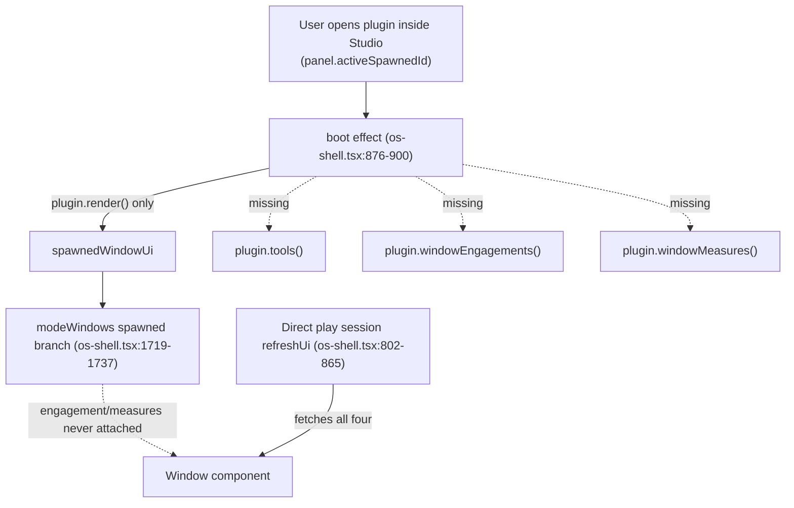

# S Chrome Spawned Window Parity Restore

## Root cause 1 — spawned plugin windows never get engagement/measures/tools ("plugins don't show commands in the window command line", "toolbars incomplete")

`framework/renderer/react/os-shell.tsx` has two very different code paths for rendering a plugin's UI:

- **Direct/play session** (`refreshUi`, `framework/renderer/react/os-shell.tsx:802-865`): calls `plugin.render()` for every window/panel **and also** `plugin.tools()`, `plugin.windowEngagements()`, `plugin.windowMeasures()` (`:822-824`), then stores the results in `activeToolNodes`, `windowEngagementsByKind`, `windowMeasuresByKind` (`:836-852`). These feed the window's `engagement`/`measures` props in `modeWindows` (`:1745-1746`) and the footer toolbar (`:1714-1717`).
- **Studio-spawned app** (the boot effect at `framework/renderer/react/os-shell.tsx:876-900`, which runs whenever the user opens/switches to a spawned plugin instance inside the "s" shell): calls **only** `plugin.render(...)` and stores the result in `spawnedWindowUi`. It never calls `plugin.tools()`, `plugin.windowEngagements()`, or `plugin.windowMeasures()`.
- Worse, the `modeWindows` branch that renders the spawned window (`framework/renderer/react/os-shell.tsx:1719-1737`, the `if (studioMode && spawnedWindowUi && panel?.activeSpawnedId)` block) builds its window descriptor **without** `engagement:` or `measures:` fields at all — compare to the sibling `baseWindows`/`extraWindows` descriptors a few lines below (`:1740-1771`) which both set `engagement: windowEngagementToSpec(...)` and `measures: windowMeasuresOverlay(...)`.

Net effect: any plugin opened as a Studio program (the normal way users run CAD/puzzle/lowpoly/etc. inside the "s" chrome) loses its command line and window-measures rail unconditionally, and never contributes its tools to the toolbar until unrelated code happens to repopulate `activeToolNodes`. This fully explains both reported symptoms — the Rust side (`cad/plugin/rs/lib.rs:2710-2730`, `lowpoly/plugin/rs/lib.rs:1583-1605`, `puzzle/plugin/rs/d2/mod.rs:1865-1879`) already implements `window_engagements()`/`window_measures()` completely and correctly; the data just never gets fetched or wired for spawned windows.

### Fix

1. `**framework/renderer/react/os-shell.tsx:876-900**` (spawn boot effect): alongside `plugin.render(...)`, also call `plugin.tools(activeSpawned.instanceId, viewState)`, `plugin.windowEngagements(activeSpawned.instanceId, viewState)`, `plugin.windowMeasures(activeSpawned.instanceId, viewState)` for the spawned app, and store results in new state (`spawnedWindowEngagements`, `spawnedWindowMeasures`, and feed `activeToolNodes` the same way `refreshUi` does at `:850-852`, falling back to the spawned app's static mode tools).
2. Re-run this fetch whenever `onCommand` dispatches to a spawned app and `processPluginOps` completes (currently `refreshUi(nextSession)` at `:1090` already recomputes these correctly _if_ `nextSession` is the spawned app's pseudo-session built at `:1160-1172` — verify this path also updates the new spawned-specific state instead of (or in addition to) the shared `windowEngagementsByKind`/`windowMeasuresByKind`, since window-kind IDs could collide between the top-level "s" app and spawned apps).
3. `**framework/renderer/react/os-shell.tsx:1719-1737**` (spawned `modeWindows` branch): add `engagement: windowEngagementToSpec(resolveWindowEngagement(spawnedWindowKind, spawnedWindowEngagements), onCommand)` and `measures: windowMeasuresOverlay(spawnedWindowMeasures[...], onCommand)`, mirroring `:1745-1746`.
4. `**framework/renderer/react/os-shell.tsx:1714-1717**` (`footerToolbar`): when a spawned app is active, prefer its tools (already merged into `activeToolNodes` per step 1) — confirm no other code path overwrites `activeToolNodes` back to the "s" shell's own tools after the spawned fetch.
5. Add/extend `framework/renderer/react/index.test.ts` with a test that spawns a plugin instance in studio mode, dispatches a command, and asserts the resulting window descriptor carries non-empty `engagement`/`measures` and that `activeToolNodes` reflects the spawned app's tools.

## Root cause 2 — toolbar lost the premigration ribbon behavior ("toolbars are not complete")

Premigration `UIToolbar` (`framework/product/platform/renderer/react/index.tsx:2166-2467` at the `premigration` tag) rendered a drill-down ribbon:

- `sortViewToolNodes` (sort by `order`)
- `buildToolbarRibbonSegments` — when a level has 2+ sibling collections that aren't all leaf-only, renders them as a single-select `ToggleGroup` "picker" and recurses into the active one; when collections are leaf-only, flattens each into its own tool zone
- `UIToolbarItems` — batches consecutive buttons into one `ButtonGroup` and consecutive toggles into one `ToggleGroup` (multi-select), inserting `ToolbarDivider`s at `separator` nodes

The current `ToolTree` (`framework/renderer/react/os-shell.tsx:3102-3213`) only renders a flat list where each `collection` is an independent expand/collapse `Toggle` with its children inlined — no picker (so multiple sibling collections all expand simultaneously instead of drill-down single-select), no sorting by `order`, and every button/toggle renders individually instead of batching into `ButtonGroup`/`ToggleGroup`.

The current `ToolNode`/`ToolLeaf` types (`framework/renderer/react/os-shell.tsx:2513-2564`) already carry `order`/`disabled`/`kind` fields matching the premigration shape, so this is a mechanical port, not a data-model change.

### Fix

1. Port `sortViewToolNodes`, `isLeafOnlyViewCollection`, `buildToolbarRibbonSegments`, `reconcileViewToolPath` into `framework/renderer/react/os-shell.tsx` (or a new `//#region 🔖tool-tree` subregion), adapted to operate on `ToolNode`/`ToolLeaf` (already-native types) instead of `UIToolNode`/`resolveLeafCommand` (existing helper) instead of premigration's `onClick`/`onPressedChange` closures.
2. Replace `ToolCollection`'s expand/collapse `Toggle` with the ribbon picker: track `activePath` state (`useState<readonly string[]>([])`, reconciled via `reconcileViewToolPath` on tool-tree change), render sibling-collection pickers as a single-select `ToggleGroup`, and batch leaf runs via a ported `UIToolbarItems`-equivalent using the existing `ButtonGroup`/`ButtonGroupItem`/`ToggleGroup` imports from `@semio-tech/ui-react` (already imported at `os-shell.tsx:8-9`; `ToggleGroup` needs to be added to the import list, confirmed exported at `ui/js/react/index.tsx:8168`).
3. Keep `ToolTree`'s public signature (`{ tools, onCommand }`) unchanged so both the footer toolbar (`:1714-1717`) and any other caller keep working.
4. Extend `framework/renderer/react/index.test.ts` with ribbon-specific tests: multiple sibling non-leaf collections render as a picker and drill down on selection; consecutive toggles render inside one `ToggleGroup`; nodes render in `order`.

## Scope note

This plan targets the two concrete regressions the user reported (spawned-window command line, toolbar completeness). The premigration renderer was ~22k lines across `platform`/`playground`/`presentation` products before consolidating into today's ~9k-line `framework/renderer/react`, so a handful of other surfaces (e.g. the global Ctrl+P command palette merging plugin-contributed `commands`, presentation-renderer-specific chrome) still have known parity gaps documented in prior research but are **not** covered here — recommend follow-up tickets once this lands.

## Validation

- `bun nx run @semio-tech/framework-renderer-react:test` (or the project's configured test target) for the new/updated tests in `framework/renderer/react/index.test.ts`.
- Manual smoke test: boot the dev studio, open a plugin app (e.g. CAD) as a spawned Studio program, confirm the command-line input + possible-engagements list appear and accept a command, confirm the window-measures rail appears, and confirm the footer toolbar shows the plugin's tools with ribbon drill-down for nested collections — using temporary `[DEBUG]`-prefixed console logs while verifying, removed before finishing.
- Work inside a repo-mcp ticket per workspace rules (check `repo://goals` first; this continues the `GIS-2D-MAP-PARITY-RESTORE` line of parity-restoration work but is a distinct regression, so open a new ticket unless an existing open ticket already covers spawned-window chrome specifically).
