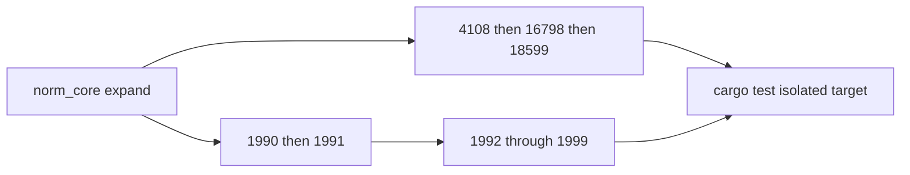

# Norm Technology — Absolutely Feature Complete

## Reality check

Current `norm/` is a **scaffold** (~2.6k lines): many `part_`* modules are macro-identical wrappers or hardcoded constants. The prior ticket checklist marked “done” for module existence, not for the plan completeness gate. This ticket **replaces stubs with real formulas** inside the existing crate paths.

## Decisions (locked)

- **Depth:** Clause-complete computational coverage for every part already named in the family crates, plus any missing in-force parts of those same families (e.g. DIN 4108 remaining parts, EN 16798 missing parts, EN 1990 combination set, EN 1991 correct part mapping).
- **Structure:** Keep one crate per path; expand each `[lib.rs](norm/core/rs/lib.rs)` with hierarchical `// #region` / `pub mod` sections (no new sibling crates, no new test files). Tables live as `const` / static data regions clause-cited.
- **DE NA:** Family-specific annex modules (not just re-export of EN 1990 `NaDe`). `AnnexChoice::De` must change results where the DIN EN NA differs.
- **Integration:** `[norm_din_v_18599](norm/din/v/18599/rs/lib.rs)` consumes `[norm_din_4108](norm/din/4108/rs/lib.rs)` thermal properties and `[norm_din_en_16798](norm/din/en/16798/rs/lib.rs)` indoor/ventilation inputs. Structural Eurocodes use `[fem_core](fem/core/rs)` forces when member checks need N/V/M (and actually use the solve result, not discard it).
- **Cargo:** Always run tests with `CARGO_TARGET_DIR=/tmp/semio-norm-target` (or a ticket-local ASCII path). **Never wait** on workspace `target/` locks — if blocked, spawn a new target dir and continue.
- **Ticket:** Reopen `26/07/18/NORM-TECHNOLOGY-FULL-FAMILY-CRATES` (or open a follow-up under goal `🎯norm`) with this plan_id; keep scratch/logs only in the ticket folder.
- **Copyright:** Hand-implement formulas and numeric tables; do not paste proprietary standard PDF text.

## Completeness gate (every part module)

A part is done only when **all** of these hold:

1. Computational clauses needed for compliance are real functions (no `todo!`, no zero-returning stubs, no identical macro clones that ignore the part’s physics).
2. Tabulated values used by those clauses exist as named data (clause-cited).
3. DE NA differences apply when `AnnexChoice::De`.
4. At least one worked-example unit test asserts numeric outcomes (not only `!checks.is_empty()`).
5. Public API never leaks foreign crate types except explicit `norm_core` reexports.

## Work order




### 1. Expand `norm_core`

File: `[norm/core/rs/lib.rs](norm/core/rs/lib.rs)`

- Full annex parameter surface: `gamma_m`, `gamma_r`, `xi`, combination selectors, consequence class.
- Typed table lookup helpers (linear/bilinear interpolation over const arrays).
- Shared load-case / design-situation enums used by EN 1990–1999.
- Climate / occupancy helpers shared by energy crates.

### 2. Energy families (replace stubs)


| Crate                                              | Must implement                                                                                                                                                                                                       |
| -------------------------------------------------- | -------------------------------------------------------------------------------------------------------------------------------------------------------------------------------------------------------------------- |
| `[norm_din_4108](norm/din/4108/rs/lib.rs)`         | All in-force parts: minimum thermal protection with real climate-dependent limits; Glaser/EN ISO 13788-style moisture; full λ design tables; U-value methods; airtightness; summer heat / remaining parts as modules |
| `[norm_din_en_16798](norm/din/en/16798/rs/lib.rs)` | All published parts used for indoor env / ventilation / HVAC (fill missing 2,4,6,8,10–12,14,16…); real outdoor-air tables by room type; PMV/PPD or equivalent operative checks; DE NA parameters                     |
| `[norm_din_v_18599](norm/din/v/18599/rs/lib.rs)`   | Parts 1–12 with real monthly balancing (no zero stubs); cooling/DHW/automation/tabular method; depend on 4108 + 16798                                                                                                |


### 3. EN 1990 + EN 1991


| Crate                                    | Must implement                                                                                                                                                                    |
| ---------------------------------------- | --------------------------------------------------------------------------------------------------------------------------------------------------------------------------------- |
| `[norm_en_1990](norm/en/1990/rs/lib.rs)` | Eqs 6.10 / 6.10a / 6.10b / 6.11+; STR/GEO/EQU; SLS char/freq/qp; accidental; full DE ψ/γ/ξ tables by category                                                                     |
| `[norm_en_1991](norm/en/1991/rs/lib.rs)` | Fix part mapping (1-1 densities+imposed, 1-3 snow, 1-4 wind, 1-5 thermal, 1-6 construction, 1-7 accidental, 2–4); full category tables; DE snow/wind zones; terrain/c_pe for wind |


### 4. Material Eurocodes 1992–1999

Replace macro stubs with part-specific physics:

- **1992:** flexure, shear, punching, torsion, slenderness, crack width, deflection, fire cover, prestress basics; FEM forces used; DE α_cc etc.
- **1993:** section class, tension/compression/bending/shear/interaction, buckling curves a0–d, joints 1-8, fire, fatigue stubs with real factors — each of 1-1…1-12 and 2–6 distinct
- **1994:** plastic/elastic composite bending, shear connectors, partial interaction, effective width, fire, bridges
- **1995:** k_mod × service class matrix, LTB, connections, fire charring model
- **1996:** wall panels, shear/sliding, lintels, fire
- **1997:** DA1/DA2/DA3, bearing (N_c,N_q,N_γ), sliding, settlement, piles part 2
- **1998:** spectra used for base shear; q factors; drift; parts 2–6 distinct (bridges, silos, towers…)
- **1999:** alloys, HAZ, welded/bolted, buckling — parts 1-1…1-5 distinct

### 5. Verify without lock waits

```bash
CARGO_TARGET_DIR=/tmp/semio-norm-target \
  cargo test -p norm_core -p norm_din_4108 -p norm_din_en_16798 \
  -p norm_din_v_18599 -p norm_en_1990 -p norm_en_1991 \
  -p norm_en_1992 -p norm_en_1993 -p norm_en_1994 -p norm_en_1995 \
  -p norm_en_1996 -p norm_en_1997 -p norm_en_1998 -p norm_en_1999
```

If that target is locked, immediately switch to `/tmp/semio-norm-target-N` and continue — never block.

### 6. Close ticket

Update part checklist in the ticket folder; `ticket_close` with summary + all touched paths.

## Execution note

Proceed crate-by-crate without pausing for user confirmation. Prefer editing existing `lib.rs` files heavily over new files. Write dense, formula-correct code; cite clauses in region names and `ClauseId`s.