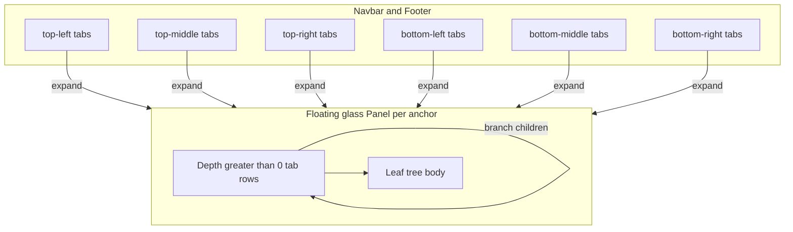

# Unify Panel Chrome Hosting Across All Anchors

## Diagnosis

Two parallel hosting modes currently coexist in the React shell:


| Mode                                      | Anchors today                                             | Folded look                                             | Expanded look                            |
| ----------------------------------------- | --------------------------------------------------------- | ------------------------------------------------------- | ---------------------------------------- |
| **Chrome-hosted** (`tabBarHost="chrome"`) | `top-left` (navbar), `bottom-right` (footer) only         | Root tabs in navbar/footer; floating panel unmounted    | Glass `Panel` with depth ≥ 1 rows + body |
| **Panel-hosted** (`tabBarHost="panel"`)   | `top-middle`, `top-right`, `bottom-left`, `bottom-middle` | Root tabs sit on a floating glass strip over the canvas | Same strip expands with body             |


Source of truth for the split:

```907:908:framework/renderer/react/os-shell.tsx
const PANEL_TAB_BAR_HOSTS: Partial<Record<PanelAnchor, "navbar" | "footer">> = { "top-left": "navbar", "bottom-right": "footer" };
```

That is the inconsistency: same dock model, two UX/visual paths. Nested tabs (`PanelTabBranch`) already work; chrome hosting is just incomplete.

WGPU still uses separate left/right side rails — **out of scope** for this ticket (no navbar/footer chrome there). React is the surface that has navbar/footer.

## Target model (single way)




Rules:

1. **All six anchors are chrome-hosted** — top → navbar, bottom → footer; corners and middle alike.
2. **Folded** = only `PanelChromeTabBar` in chrome (no floating panel).
3. **Expanded** = frosted `Panel` (`LevelProvider level="panel"`, glass fill, panel element tokens) with nested tab rows (`startDepth={1}`) + body; grows from the matching corner/middle edge.
4. **Same tab can nest inside another panel** — keep composable dock (`PanelTabBranch` / DnD `moveTabInDock`); a tab dragged under another branch becomes a nested row on that anchor’s expanded panel, not a second chrome host.

## Implementation

### 1. Shell: host every anchor in chrome

In `[framework/renderer/react/os-shell.tsx](framework/renderer/react/os-shell.tsx)`:

- Change `PANEL_TAB_BAR_HOSTS` to a full map:

```ts
const PANEL_TAB_BAR_HOSTS: Record<PanelAnchor, "navbar" | "footer"> = {
  "top-left": "navbar",
  "top-middle": "navbar",
  "top-right": "navbar",
  "bottom-left": "footer",
  "bottom-middle": "footer",
  "bottom-right": "footer",
};
```

- Wire three `PanelChromeTabBar`s into **navbar** (leading / centered / trailing) and three into **footer** (leading / centered / trailing), using existing `NavbarItem.centered` for middle anchors (same overlay pattern as mode switcher).
- Navbar composition sketch: logo/modes center stays; `top-left` leading; `top-middle` centered (or beside modes without collision — prefer dedicated centered chrome strip if modes already own center); `top-right` trailing after fill.
- Footer: `bottom-left` leading; `bottom-middle` centered (command palette root); `bottom-right` trailing (keep Zukunft Bau credit grouped with trailing chrome via fill spacer).
- `buildPanelProps` always sets `tabBarHost: "chrome"` (or derive solely from the full map).

### 2. Panel: reliable expand + visual level

In `[ui/js/react/index.tsx](ui/js/react/index.tsx)` (`Panel`, `PanelChromeTabBar`):

- Keep chrome + floating panel as one controlled selection pair (`usePanelTabSelection`) — already correct; verify expand from every chrome bar opens the matching floating panel with size, glass layers, and resize handles.
- Wrap `PanelChromeTabBar` in `LevelProvider level="panel"` and ensure chrome strip uses panel framing (`panelChromeTabBarClass` / glass accent) so root tabs read as **panel chrome on window chrome**, not base/window buttons.
- Confirm expanded floating panels always paint `panelChromeFillLayerClass` + `data-level="panel"` (already present) and sit above navbar/footer stacking (existing footer/navbar z-base override in `[ui/styling/js/ui.css](ui/styling/js/ui.css)`).
- If glass still blends into window (`--panel` vs `--window` are close), bump panel glass contrast slightly via existing glass tokens only — no second panel style system.

### 3. Nested tabs remain first-class

No API fork: one `PanelTabNode` tree. Chrome always shows **root row only** (`maxRows={1}`); nested rows only appear on the expanded floating panel (`startDepth={1}`). DnD into a branch parent already yields nested tabs — extend tests/stories so chrome-hosted middle anchors participate as drop targets the same way corners do.

### 4. Stories and tests

- Extend `[.storybook/stories/ui/Panel.stories.tsx](.storybook/stories/ui/Panel.stories.tsx)`: chrome + expand for corner and middle; nested branch under chrome-hosted root.
- Extend `[framework/renderer/react/index.test.ts](framework/renderer/react/index.test.ts)` and Panel unit tests in `ui/js/react/index.tsx` for all six chrome hosts and fold/unfold from chrome.
- Run targeted vitest for `ui-react` and `framework-renderer-react` (do not claim pass without running).

### 5. Ticket hygiene

- Goal: `🎯r2602🎯runningsketchpad`
- Open a new ticket (prior CORNER-PANELS work closed; this is the 6-anchor chrome unification follow-on).
- Put any notes/logs under `.repo/🎫/...` only.

## Non-goals

- WGPU left/right panel parity
- Redesigning Mode dock / window chrome
- Changing `PanelGroup` Rust enum semantics beyond what React already maps

