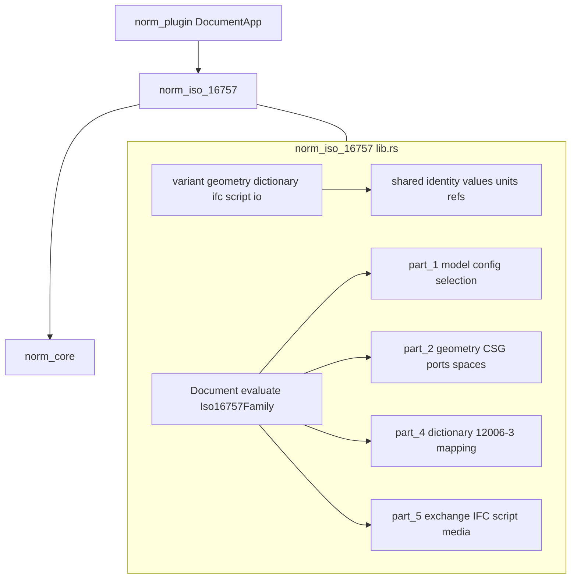

# Add ISO 16757 to Norm

## Locked decisions

- **Technology home:** extend existing `[norm/](norm/)` technology under goal **Norm** (`🎯NORM`). Do **not** create a top-level `iso16757` multi-crate workspace.
- **Layout (repo-consistent):** one family crate at `[norm/iso/16757/](norm/iso/16757/)` named `norm_iso_16757`, matching `norm/din/v/18599` → `norm_din_v_18599` and `norm/en/1990` → `norm_en_1990`.
- **Parts as modules, not crates:** map the proposed `iso16757-`* crates to regions/modules inside that single `lib.rs` (same pattern as DIN 4108 / EN 199x).
- **Surface:** headless Rust API + `NormFamily` session + plugin DocumentApp (same contract as other families).
- **Editions:** implement published parts only — **ISO 16757-1:2015**, **2:2016**, **4:2025**, **5:2025**. No Part 3. No `part1-ed2-experimental` (unpublished; do not claim conformance).
- **Cargo features:** none for parts (all published parts always built, like every existing norm family). Optional heavy runtime stays behind interfaces, not a feature forest.
- **Copyright:** hand-implement public clause/scope/capability surface only; no proprietary PDF text; no invented licensed-only UML field dumps. Licensed-only inventories (exact CSG primitive catalogs, IFC attribute bindings, full terminology) are modeled as **extensible registries** with public-known entries plus explicit “unsupported / unknown construct” diagnostics.
- **National annex:** ISO family reports `AnnexChoice::En` on all checks (international profile; no DE-NA split).

## Architecture




### Module map (proposed crates → repo modules)


| Proposed crate                    | Location in `norm_iso_16757`                                                                                                                                                                                                    |
| --------------------------------- | ------------------------------------------------------------------------------------------------------------------------------------------------------------------------------------------------------------------------------- |
| `iso16757-core`                   | `//#region Shared` types: identity, multilingual text, value system, units, cardinality, references, lifecycle, extensions                                                                                                      |
| `iso16757-part1`                  | `pub mod part_1` — catalogue meta-model, configuration/selection, accessories/composition, representation objects, BIM embedding workflow types                                                                                 |
| `iso16757-geometry`               | `pub mod part_2` — shapes, symbolic, spaces, surfaces, ports, CSG graph, parameter binding, STEP/IFC geometry projection                                                                                                        |
| `iso16757-dictionary`             | `pub mod part_4` — subjects, relationships (`isSubtypeOf`, `hasPart`, `hasBlock`, `isDependentOn`, `isSubkindOf`), property kinds, controlled values, ISO 12006-3 mapping adapters                                              |
| `iso16757-ifc` + exchange         | `pub mod part_5` — catalogue-as-IFC structures, processes §4, ports/inlets/outlets, media, part-number rules                                                                                                                    |
| `iso16757-script`                 | `part_5::script` — `ScriptRuntime` trait + sandboxed ECMAScript impl (native-safe limits: time/memory/recursion/no I/O)                                                                                                         |
| `iso16757-validate`               | `validate` region + each part’s `check_*` → `CheckReport`                                                                                                                                                                       |
| `iso16757-io`                     | `io` region — IFC-STEP text, dictionary snapshot JSON (serde), media refs, diagnostic report serialization                                                                                                                      |
| `iso16757` façade / CLI / testkit | crate root re-exports + `evaluate` / authoring APIs; tests live in `#[cfg(test)]` in the same `lib.rs` (no extra test/example files); **no separate CLI crate** (repo uses `launch.json` + `script.ts test`, not per-norm CLIs) |


### Session contract (matches every family)

```rust
// Document = catalogue session inputs
pub struct Document { /* catalogue, dictionary snapshot, selection, edition profile */ }
pub type Op = SetDocumentOp<Document>;
pub fn evaluate(document: &Document) -> CheckReport;
pub struct Iso16757Family;
impl NormFamily for Iso16757Family { ... family_id: Iso16757 ... }
```

`evaluate()` must exercise **all four** part modules (completeness gate used for other norm families): structural integrity, Part 1 semantics, Part 2 geometry, Part 4 dictionary, Part 5 exchange (IFC graph, part-number determinism, script safety diagnostics).

Cross-part public engines (not separate crates):

- **Authoring / consumption** APIs on catalogue types
- **Variant engine** — parameter domains, constraints, candidate reduction, failure explanation
- **Geometry engine** — immutable CSG graph, parameter substitution, bbox/clearance, materialize for selected variant
- **Dictionary engine** — subject/property/relationship resolution, subtype closure, context-filtered controlled values
- **IFC engine** — minimal STEP text import/export for catalogue + selected-product graphs; preserve unknown entities; schema edition declaration
- **Script engine** — compile/validate/execute calculation functions for dynamic properties, part numbers, geometry parameters

## Integration touchpoints

1. **Workspace:** add `"norm/iso/16757/rs"` to root `[Cargo.toml](Cargo.toml)` members (next to other `norm/`* entries).
2. **Scaffold:** `norm/iso/16757/{project.json,script.ts,rs/Cargo.toml,rs/lib.rs}` mirroring `[norm/din/v/18599/](norm/din/v/18599/)`.
3. `**norm_core`:** add `NormFamilyId::Iso16757` + label `"ISO 16757"` in `[norm/core/rs/lib.rs](norm/core/rs/lib.rs)`. Keep catalogue types inside the family crate (core stays shared compliance kernel only).
4. **Plugin:** register `iso16757` DocumentApp in `[norm/plugin/rs/lib.rs](norm/plugin/rs/lib.rs)` + dependency in `[norm/plugin/rs/Cargo.toml](norm/plugin/rs/Cargo.toml)`; update registration count test (`13` → `14`).
5. **Launch:** extend `🧪test📏norm` in `[.vscode/launch.json](.vscode/launch.json)` (and `[.claude/launch.json](.claude/launch.json)` if it mirrors) with `-p norm_iso_16757`.
6. **Docs:** update `[norm/AGENTS.md](norm/AGENTS.md)` to include the ISO family path.
7. **Ticket:** open under goal `NORM` (title **Add ISO 16757**, emoji `📏`); temps/checklists only under `.repo/🎫/.../`.

## Implementation order

### 1. Scaffold + session shell

Crate, workspace member, `Document`/`evaluate`/`Iso16757Family`, `NormFamilyId`, nx `script.ts test`, plugin + launch wiring, default document fixture that is intentionally minimal but valid enough for an empty-report-or-basic-checks path.

### 2. Shared domain (`Shared` region)

Identity types, multilingual names, value system (bool/int/decimal/text/date/id/enum/controlled/quantity/range/interval/list/set/table/curve/reference/calculated/media/null-states), units with dimensional compatibility, cardinality, references, lifecycle, extension bag for lossless unknown fields.

### 3. Part 1 — model and selection

Catalogue / manufacturer / product group / class / series / product / variant / index; static vs dynamic vs selection properties; accessories and compositions with cycle detection; representation and descriptive objects; configuration reduction and product selection APIs; BIM embedding workflow types (`resolve → freeze → calculate → generate geometry → attach → insert` as typed steps, not a foreign BIM host).

### 4. Part 2 — geometry

Geometry categories (shape, symbolic, spaces, surfaces, ports); CSG node graph (primitives registry extensible, transforms, booleans, references); parameter binding from product properties; bbox/clearance queries; STEP/IFC projection stubs that emit structured parametric targets where known and materialize otherwise; explicit non-claims (no internal product-function modelling, no manufacturing info, no line-styles as geometry requirements).

### 5. Part 4 — dictionary

Subject kinds (product, catalogue, block, port/inlet/outlet); relationship kinds with domain/range and cycle prevention; static/dynamic/external property kinds; controlled-value context filtering; ISO 12006-3 **adapter types** (identity-preserving mapping layer, not a full second dictionary product).

### 6. Part 5 — exchange

Process types (§4 create/provide/determine/integrate/exchange); IFC catalogue object graph (§6); part-number rules (literal, table, script); meta-geometry bindings; media references; dictionary service/snapshot resolution; `ScriptRuntime` with deterministic sandboxed execution and security tests (timeout, recursion, no network/fs).

### 7. Validation + IO + tests

- Clause-cited `CheckResult`s for every public capability exercised by `evaluate()`
- Positive + negative tests per part module
- Round-trip: document JSON serde; IFC-STEP text for a minimal catalogue; variant selection golden outputs
- Annex-style fixtures modeled from **public** Part 5 annex *topics* (selection, meta-geometry, media, constraints) without copying proprietary annex payloads
- Ticket checklist mapping public ISO clauses → module / API / validator / tests

## Completeness gate (same as other norm families)

A part is done only when:

1. Real clause-level behaviour (no empty `part_*` shells)
2. Clause-cited identifiers via `ClauseId::new("ISO 16757", "1", "3.3")` etc.
3. At least one numeric/golden worked example per part (not only `!checks.is_empty()`)
4. `evaluate(&Document)` exercises that part
5. No foreign technology leaks (`compose`, `puzzle`, `mit-bestand`, `draw`, …)

## Out of scope

- Pasting licensed standard text or claiming field-level UML completeness without licenses
- Unpublished Part 1 edition 2
- Product-group Content Parts ≥10 (none published)
- Standalone CLI binary or separate `iso16757-*` crates
- Full ISO 16739 IFC authoring suite beyond catalogue-exchange needs
- Updating the Norm goal description (no goal open/close without explicit instruction)

## Verification

```bash
CARGO_TARGET_DIR=/tmp/semio-norm-iso16757 \
  cargo test -p norm_core -p norm_iso_16757 -p norm-plugin
```

Then full family pack via `🧪test📏norm` launch entry.