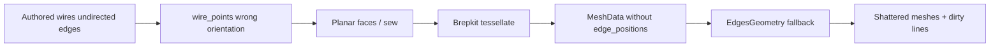

# Fix CAD Mesh and Edge Display

## Root cause

The CAD play panes (`Form` / `Energie` / `Gebäude` / `Struktur Klassisch`) rebuild B-reps from authored fixture topology in `[cad/plugin/rs/lib.rs](cad/plugin/rs/lib.rs)` via `import_geometry_handles` → `wire_points` → `polyline_wire` / `planar_face_from_wire` → `sew_faces` → `tessellate`.

`wire_points` always appends each edge as `vertex_ids[0] → vertex_ids[1]`, but authored wires list **undirected** edges. Edges that are traversed in reverse must be flipped so the tip continues. On the shipped forest fixture, **54 of 57 wires** produce a wrong point ring (missing vertices, zero-length segments). Those bad rings become self-intersecting / incomplete faces; tessellation then yields shredded triangles and holes that do not match the B-rep.

Example wire (`…-wire-103`):

- Edges: `[84→96]`, `[94→96]` (must reverse), `[94→83]`, `[83→84]`
- Correct walk: `84 → 96 → 94 → 83 → 84`
- Current code: `84 → 96 → 96 → 83 → 84` (vertex `94` dropped)

Unclean lines are a second, related failure: tessellation **does** sample real B-rep edges into `MeshTransfer.edges`, but:

1. `[mesh_data_from_mesh_transfer](kernel/3d/brep/rs/lib.rs)` drops `edges` when building `MeshData`
2. CAD’s `tessellate_geometry_handle` uses `mesh_from_indexed(position, normal, index)` only
3. World3d `showEdges` then falls back to Three.js `EdgesGeometry` on the **broken triangle mesh**, so outlines follow the garbage triangulation

## Fix

### 1. Chain wire vertices by shared endpoints

In `[cad/plugin/rs/lib.rs](cad/plugin/rs/lib.rs)` `geometry_import::wire_points`:

- Walk `wire.edge_ids` by **vertex id**, not fixed start/end order
- Orient the first edge so its end touches the second edge
- For each following edge, append the opposite endpoint of the tip (`tip == a` → push `b`, else if `tip == b` → push `a`)
- Map ids to positions only at the end

This restores correct closed rings for the forest fixture and any other undirected-wire models.

### 2. Carry B-rep edge samples into `MeshData`

In `[kernel/3d/brep/rs/lib.rs](kernel/3d/brep/rs/lib.rs)` `mesh_data_from_mesh_transfer`:

- Set `edge_positions = transfer.edges`
- Assign sequential `edge_ids` per segment (`edges.len() / 6`) so edge picking keeps working

In CAD tessellation (`tessellate_geometry_handle`, `curve_mesh_from_wire`, `typology_brep_mesh` / solid path):

- Return `mesh_data_from_mesh_transfer(&transfer)` instead of `mesh_from_indexed(...)` so faces, face ids, and edges travel together

### 3. Prefer authored B-rep edges over `EdgesGeometry`

In `[framework/renderer/react/index.tsx](framework/renderer/react/index.tsx)` World3d instance drawing:

- When `edgeGeometry` from `edgePositions` is present, **do not** also draw `borderGeometry` (`EdgesGeometry`)
- Result: clean B-rep polylines only, not triangle-derived hairlines on top

## Tests (extend existing files only)

- **CAD** (`[cad/plugin/rs/lib.rs](cad/plugin/rs/lib.rs)` tests): assert a known reversed-edge forest wire chains to the correct vertex id sequence; after import+tessellate, forest solid has no degenerate zero-area triangles and `edge_positions.len() >= 6`
- **Kernel** (`[kernel/3d/brep/rs/lib.rs](kernel/3d/brep/rs/lib.rs)`): extend `tessellate_to_mesh_data_carries_face_ids` (or sibling) to assert box tessellation populates non-empty `edge_positions` with `len() % 6 == 0`

## Ticket / goal

- Goal: `r2602/runningsketchpad`
- Open ticket on execute: **Fix CAD Mesh and Brep Edge Display**
- Work artifacts only under the ticket folder

## Out of scope

- Faces with inner wires (holes): forest has 0; leave for a follow-up
- Raising tessellation tolerances (`0.1` / `0.2`): planar line geometry is not the failure mode once wires chain correctly
- Reviving dead `[cad/renderer/js/index.tsx](cad/renderer/js/index.tsx)` (not on the live World3d path)

