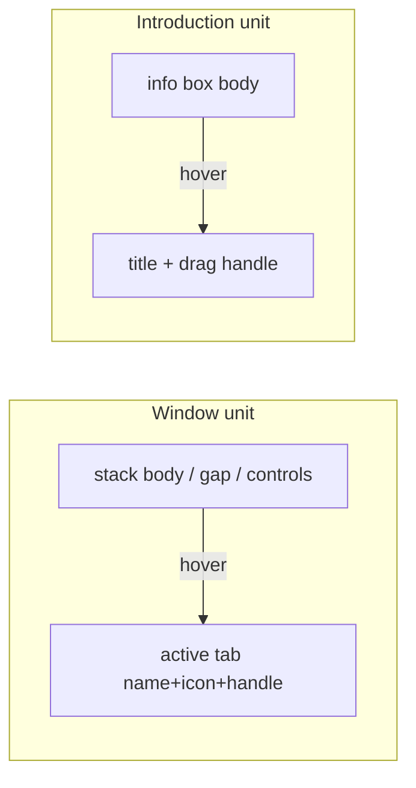

# Parent Hover Emphasizes Window and Step Chrome

## Problem

Hover emphasis today is scoped to the leaf control (`data-hover-scope` on the tab/chip). Hovering the **window body** or **introduction body** already emphasizes the silhouette border (and intro paragraphs), but does **not** emphasize identity chrome:

- Window: name, icon, drag handle
- Introduction step: step title, drag handle

Trees already get this because the whole row is one `data-hover-scope`. Windows and intro steps need the same parent-unit behavior.

## Approach

Extend `[ui/styling/js/ui.css](ui/styling/js/ui.css)` `ShellParentHover` with CSS-only parent rules (same layer as silhouette stroke and drag-handle mirroring). No new components; keep `data-hover-scope` on chips for direct chip hover + handle-exclusion.




### 1. Mode-dock windows

When the pointer is inside the active window unit (body, U-gap, controls, or the active tab itself), emphasize the stack-active tab text/icon and its drag handle:

```css
[data-window-silhouette]:is(
  :has([data-slot="mode-dock-stack-body"]:hover),
  :has([data-slot="mode-dock-tab-gap"]:hover),
  :has([data-slot="mode-dock-controls-cap"]:hover),
  :has([data-slot="mode-dock-tab"][data-stack-active="true"]:hover)
) [data-slot="mode-dock-tab"][data-stack-active="true"]:not([data-handle-hovered="true"]) {
  color: var(--border-emphasized-color);
}

/* same :is(...):has(...) prefix */
… [data-slot="mode-dock-tab"][data-stack-active="true"] [data-slot="drag-handle"] {
  color: var(--border-emphasized-color);
}
```

Using `:has(...)` (already used in `ui.css`) avoids lighting the active tab while hovering an **inactive** sibling tab. Color emphasis only (not hover fill) — matches “emphasized” tokens; fill stays for direct chip hover via existing Tailwind classes.

### 2. Panel / WindowChrome windows

Same principle for floating panels hosted in `[WindowChrome](ui/js/react/index.tsx)`:

```css
[data-slot="window-chrome-stack"]:is(
  :has([data-slot="window-chrome-body"]:hover),
  :has([data-slot="window-chrome-gap"]:hover),
  :has([data-slot="window-chrome-controls"]:hover),
  :has([data-slot$="-tab-button"][data-active="true"]:hover)
) [data-slot$="-tab-button"][data-active="true"]:not([data-handle-hovered="true"]) { … }
```

Plus the matching drag-handle rule under that active tab button.

### 3. Introduction step

When the pointer is anywhere on `[data-slot="introduction-info-box"]`, emphasize the title chip and its drag handle:

```css
[data-slot="introduction-info-box"]:hover
  [data-slot="introduction-info-box-chip"]:not([data-handle-hovered="true"]) {
  color: var(--border-emphasized-color);
}

[data-slot="introduction-info-box"]:hover
  [data-slot="introduction-info-box-chip"] [data-slot="drag-handle"] {
  color: var(--border-emphasized-color);
}
```

Keep paragraph-only body text emphasis (`[data-slot="introduction-body-paragraph"]:hover`). Do **not** emphasize the step-count chip from parent hover (user asked for name + drag handle only).

Update the conflicting vitest in `[ui/js/react/index.tsx](ui/js/react/index.tsx)` (~29056): it currently forbids body→chip coupling. Narrow it so body **content** stays paragraph-scoped, while identity chrome **is** allowed to emphasize on info-box hover.

### 4. Markup polish (intro title)

On the intro title span, ensure it inherits parent color (no hard-coded color that blocks parent emphasis). Chip already has `data-hover-scope` + `windowChromeTitleChipClass`.

### 5. Tests

Extend existing vitest CSS/markup guards in `[ui/js/react/index.tsx](ui/js/react/index.tsx)`:

- Shell CSS contract: mode-dock `:has(body:hover)` → stack-active tab color + drag-handle
- WindowChrome CSS contract: same for active panel tab button
- Intro: info-box `:hover` → title chip + drag-handle; keep paragraph-only content rule; drop/replace the old “never chips from body” assertions that conflict
- Keep celebrate + `data-handle-hovered` behavior unchanged

### Ticket

- Goal: `🎯r2602/🎯runningsketchpad` (same as prior shell/hover UI tickets)
- New ticket (no existing open ticket covers parent chrome emphasis on window/intro hover)
- Work only in existing files + ticket scratch; no new source files

## Out of scope

- wgpu tree live hover (separate gap; React is the live chrome path)
- Emphasizing step-count chip from parent hover
- Changing tree nesting (parent rows still do not light when hovering child rows)

