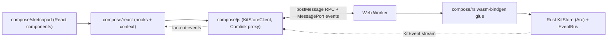

# Rust worker hook pipeline

## 1. Architecture (target)



Single source of truth = Rust `KitStore`. All writes go `setValue -> client.setField -> worker RPC -> wasm setter -> RwLock write -> EventBus emit -> MessagePort -> client fan-out -> React re-render`.

## 2. Hook contract (chosen: option A)

```ts
export type SetErrorKind = "IllegalName" | "NameTooLong" | "InvalidUrl" | "InvalidValue" | "DuplicateGuid" | "NotFound" | "CyclicReference" | "PortFamilyMismatch" | "Readonly" | "Disposed" | "Timeout" | "LockPoisoned" | "Internal";
export type SetError = {
 kind: SetErrorKind;
 message: string;
 field?: string;
 entity?: { kind: string; guid: string };
};
export type SetResult = { ok: true } | { ok: false; error: SetError };

export type WriteStatus = { kind: "idle"; pending: 0; lastError?: undefined } | { kind: "pending"; pending: number; lastError?: SetError } | { kind: "error"; pending: 0; lastError: SetError } | { kind: "readonly"; pending: 0 };

export type HookTriad<T> = readonly [T, (next: T | ((prev: T) => T)) => Promise<SetResult>, WriteStatus];
```

`canSet` is derived: `status.kind !== "readonly"`. `pending` counts concurrent in-flight writes on that field so overlapping calls don't flicker.

## 3. `compose/rs` changes

### 3.1 Structured errors ([compose/rs/src/error.rs](compose/rs/src/error.rs))

Replace `ComposeError::Validation(String)` and `InvalidOperation(String)` with typed variants matching `SetErrorKind` above. Add:

```rust
#[derive(Error, Debug, Clone, Serialize)]
#[serde(tag = "kind", content = "message")]
pub enum SetError {
    IllegalName(String), NameTooLong(String), InvalidUrl(String), InvalidValue(String),
    DuplicateGuid(String), NotFound(String), CyclicReference(String), PortFamilyMismatch(String),
    Readonly(String), Disposed(String), Timeout(String), LockPoisoned(String), Internal(String),
}
pub type SetResult = std::result::Result<(), SetError>;
```

Keep existing `ComposeError` for I/O but convert at the WASM boundary.

### 3.2 Setter signature sweep

Every `set_<field>(&mut self, v) -> ()` in [piece.rs](compose/rs/src/piece.rs), [design.rs](compose/rs/src/design.rs), [kit.rs](compose/rs/src/kit.rs), [typ.rs](compose/rs/src/typ.rs), [port.rs](compose/rs/src/port.rs), [connector.rs](compose/rs/src/connector.rs), [connection.rs](compose/rs/src/connection.rs), [representation.rs](compose/rs/src/representation.rs), [file.rs](compose/rs/src/file.rs), [folder.rs](compose/rs/src/folder.rs), [layer.rs](compose/rs/src/layer.rs), [group.rs](compose/rs/src/group.rs), [quality.rs](compose/rs/src/quality.rs), [benchmark.rs](compose/rs/src/benchmark.rs), [author.rs](compose/rs/src/author.rs), [concept.rs](compose/rs/src/concept.rs), [tag.rs](compose/rs/src/tag.rs), [prop.rs](compose/rs/src/prop.rs), [stat.rs](compose/rs/src/stat.rs), [attribute.rs](compose/rs/src/attribute.rs), [side.rs](compose/rs/src/side.rs) becomes:

```rust
pub fn set_name(&mut self, name: String) -> SetResult {
    validate_name(&name, "name")?;        // IllegalName / NameTooLong
    if self.name == name { return Ok(()); }
    self.name = name;
    self.emit_ev(KitEvent::FieldChanged { entity: self.entity_ref(), field: "name" });
    self.invalidate_hash();
    Ok(())
}
```

Add `crate::validate::{validate_name, validate_url, validate_email, ...}` helpers producing `SetError`. On `Err`, emit `KitEvent::SetRejected { entity, field, error }` (new variant added to [events.rs](compose/rs/src/events.rs)).

### 3.3 Uniform field dispatcher ([new] `src/rpc.rs`)

One entry point so WASM surface is O(1) instead of hundreds of exports:

```rust
impl KitStore {
    pub fn set_field(self_ref: &KitStoreRef, entity_kind: EntityKind, guid: &Guid, field: &str, value: serde_json::Value) -> SetResult;
    pub fn add_child(self_ref: &KitStoreRef, parent_kind: EntityKind, parent_guid: &Guid, child_kind: EntityKind, full_dto: serde_json::Value) -> SetResult;
    pub fn remove_child(self_ref: &KitStoreRef, parent_kind: EntityKind, parent_guid: &Guid, child_kind: EntityKind, child_guid: &Guid) -> SetResult;
    pub fn get_field(&self, entity_kind: EntityKind, guid: &Guid, field: &str) -> Result<serde_json::Value>;
}
```

Internally a match on `(entity_kind, field)` dispatches to the typed `set_*`. Unknown field → `SetError::InvalidValue`.

### 3.4 Event additions ([events.rs](compose/rs/src/events.rs))

```rust
SetRejected { entity: EntityRef, field: &'static str, error: SetError },
WriteAccepted { request_id: u64, entity: EntityRef, field: &'static str }, // for client-side pending tracking
```

### 3.5 WASM surface ([wasm.rs](compose/rs/src/wasm.rs))

Replace current tiny surface with a stateful handle:

```rust
#[wasm_bindgen]
pub struct KitStoreHandle { inner: KitStoreRef }

#[wasm_bindgen]
impl KitStoreHandle {
    #[wasm_bindgen(js_name = create)] pub fn create(dto: JsValue) -> Result<KitStoreHandle, JsValue>;
    #[wasm_bindgen(js_name = snapshot)] pub fn snapshot(&self) -> Result<JsValue, JsValue>;
    #[wasm_bindgen(js_name = getField)] pub fn get_field(&self, kind: &str, guid: &str, field: &str) -> Result<JsValue, JsValue>;
    #[wasm_bindgen(js_name = setField)] pub fn set_field(&self, kind: &str, guid: &str, field: &str, value: JsValue) -> js_sys::Promise;
    #[wasm_bindgen(js_name = addChild)] pub fn add_child(&self, parent_kind: &str, parent_guid: &str, child_kind: &str, dto: JsValue) -> js_sys::Promise;
    #[wasm_bindgen(js_name = removeChild)] pub fn remove_child(&self, parent_kind: &str, parent_guid: &str, child_kind: &str, child_guid: &str) -> js_sys::Promise;
    #[wasm_bindgen(js_name = subscribe)] pub fn subscribe(&self, callback: js_sys::Function) -> SubscriptionHandle;
    #[wasm_bindgen(js_name = applyDesignDiff)] pub fn apply_design_diff(&self, design_guid: &str, diff: JsValue) -> js_sys::Promise;
}
```

Promise resolves with `{ ok: true }` or `{ ok: false, error: SetError }` — never rejects (so JS doesn't need to try/catch; callers branch on `.ok`).

## 4. `compose/js` changes ([compose/js/index.ts](compose/js/index.ts))

Delete `InMemoryKitStore`, `UndoableKitStore`, `KitImpl` mutation methods (~10k lines of lines 10000–20000 region). Replace with:

- `#region 🌐️ KitStoreClient`: Comlink wrapper around the Web Worker.
  - `createKitStoreClient({ initialKit, workerUrl?, timeoutMs? }): Promise<KitStoreClient>`
  - Methods: `setField(kind,guid,field,value): Promise<SetResult>`, `addChild`, `removeChild`, `subscribe(listener): Unsubscribe`, `getSnapshot()`, `applyDesignDiff`, `dispose()`.
  - Tracks pending by request id; honors `timeoutMs` → resolves `{ok:false, error:{kind:"Timeout"}}`.
- `#region 🧵️ Worker`: [new file loaded as blob URL in browser; Node worker thread in tests] entry that imports the wasm-bindgen module, instantiates `KitStoreHandle`, exposes methods via Comlink, and forwards `subscribe` callbacks over a dedicated `MessagePort`.
- `#region 🔢️ Types`: Export `SetError`, `SetResult`, `WriteStatus`, `EntityKind`, and regenerated DTO types (mirror Rust DTO shape).

Add `comlink` to dependencies. Add `workerUrl` (`new URL("./worker.ts", import.meta.url)`) resolution path. Provide an `InlineKitStoreClient` fallback that loads wasm on the main thread for Node tests (guarded by feature-detect `typeof Worker`).

## 5. `compose/react` changes ([compose/react/index.tsx](compose/react/index.tsx))

Rewrite the runtime context to be driven by the Rust event stream:

- `KitProvider`: owns the `KitStoreClient`; stores a `Map<string, FieldState>` keyed by `${kind}:${guid}:${field}` for value caches and pending counters.
- Subscribe once to `client.subscribe` and fan events out to per-field listeners (per-key `useSyncExternalStore` signature).
- Core hook:

```ts
function useField<T>(kind: EntityKind, field: string, guid?: string): HookTriad<T> {
 const runtime = useKitRuntime();
 const key = `${kind}:${guid}:${field}`;
 const value = useSyncExternalStore(
  (sub) => runtime.subscribeField(key, sub),
  () => runtime.readField<T>(key),
 );
 const status = useSyncExternalStore(
  (sub) => runtime.subscribeStatus(key, sub),
  () => runtime.readStatus(key),
 );
 const setValue = useCallback(async (next) => runtime.dispatchSet(kind, guid, field, typeof next === "function" ? (next as any)(value) : next), [runtime, kind, guid, field, value]);
 return [value, setValue, status] as const;
}
```

- Keep every `usePieceName` / `useKitName` / `usePieceColor` / ... export; change body to `return useField<string | undefined>("Piece", "name", guid);` etc. Remove the old JSON-schema walk path (`scanSchemaState`, `diffSchemaPropertyEvents`, `readSchemaFieldValue`). Object hooks (`usePiece()`) use `useSyncExternalStore` on a derived selector that reconstructs the object from snapshot events.
- Add `useSetErrors(filter?)`, `useWriteQueue()`, `useKitSync()` utility hooks.
- `SchemaScopeContext` stays so `<PieceProvider guid>` scopes child hooks.

## 6. `compose/sketchpad` changes ([compose/sketchpad/index.tsx](compose/sketchpad/index.tsx))

- Replace the ~300 local `useX` implementations and the `HookResult` / `conditionalHookResult` / `writableHookResult` helpers with re-exports / thin wrappers from `@semio-tech/compose-react`:
  ```ts
  export { usePieceName, usePieceColor, useKitName /* ... */ } from "@semio-tech/compose-react";
  export type HookResult<T> = import("@semio-tech/compose-react").HookTriad<T>;
  ```
- Replace the `useDesignAppCommands().updatePiece(...)` write path with direct `setValue(...)` from the hook triad. Delete `DesignAppCommands` mutation paths; keep selection/hover/etc. UX commands.
- Update every `const [v, setV, canSet] = useX()` call site to `const [v, setV, status] = useX();` and `canSet` checks → `status.kind !== "readonly" && status.kind !== "pending"` (or just rely on `setV` always existing). Toast `status.lastError?.kind === "IllegalName"` next to the input.
- Mount `<KitProvider backbone={...}>` at the app root instead of the old `SketchpadStore` context.

## 7. Tests (complete pipeline)

Extend existing test files (rule: no new test files). Add regions:

- [compose/rs/src/tests/events/\*.rs](compose/rs/src/tests/events/piece.rs): `#region 🚫️SetRejected` — every entity has at least one invalid-input test asserting `Err(SetError::IllegalName|InvalidUrl|InvalidValue)` plus `KitEvent::SetRejected` emitted and value unchanged.
- [compose/rs/src/tests/events/diff_apply.rs](compose/rs/src/tests/events/diff_apply.rs): add `set_field_dispatch` tests via the new uniform `set_field`.
- Add `#[cfg(target_arch = "wasm32")] mod wasm;` in [src/tests/mod.rs](compose/rs/src/tests/mod.rs) using `wasm-bindgen-test`: subscribe round-trip, setField success + rejection.
- [compose/js/index.ts](compose/js/index.ts) — extend the `describe("InMemoryKitStore", ...)` region, rename to `describe("KitStoreClient", ...)` with subregions:
  - `success path`: create client, subscribe, `setField("Piece", g, "name", "A")` → resolves `{ok:true}`, event received, snapshot shows `A`.
  - `rejection path`: `setField("Piece", g, "name", "")` → resolves `{ok:false, error:{kind:"IllegalName"}}`, no field event, snapshot unchanged.
  - `timeout path`: use a mock worker that never responds; assert `{kind:"Timeout"}` after configured timeout.
  - `concurrent writes`: fire 3 overlapping setters, verify pending counter and final value.
- [compose/react/index.tsx](compose/react/index.tsx) — add `describe("pipeline hooks", ...)` using `@testing-library/react` + `vitest`:
  - Mount `<KitProvider>` around a test component that uses `usePieceName(guid)`; assert initial value.
  - Call setter with bad name; assert returned `{ok:false, error:{kind:"IllegalName"}}` and `status.kind === "error"`, `status.lastError` populated.
  - Call setter with good name; assert transitions `idle→pending→idle` and value updates after event.
  - Verify `canSet` derivation in readonly mode.
- [compose/sketchpad/index.tsx](compose/sketchpad/index.tsx) — Playwright test already wired; add a spec that: opens design, edits piece name to empty, asserts error toast renders with `IllegalName`; edits to valid value, asserts value commits.

## 8. Dependencies

- Add `comlink` to [compose/js/package.json](compose/js/package.json).
- Add `@testing-library/react` + `@testing-library/dom` to [compose/react/package.json](compose/react/package.json) devDependencies.
- Add `wasm-bindgen-test` to [compose/rs/Cargo.toml](compose/rs/Cargo.toml) target-wasm dev-deps.
- [compose/js/vite.config.ts](compose/js/vite.config.ts) and [compose/sketchpad/vite.config.ts](compose/sketchpad/vite.config.ts) already use `vite-plugin-wasm` — confirm `worker.format = "es"` and worker import uses `new Worker(new URL("./worker.ts", import.meta.url), { type: "module" })`.

## 9. Workflow per repo AGENTS

All edits happen under one ticket (`ticket_open` title "Rust Worker Hook Pipeline"); use `#region`/`#endregion` subregions in every file (no new files except the three unavoidable ones: `compose/rs/src/rpc.rs`, `compose/rs/src/validate.rs`, `compose/js/worker.ts`); no new test files; delegate independent slices (Rust errors+setters, WASM+worker, React hooks, Sketchpad migration, tests) to sub-agents in parallel, driven from one parent ticket.

## 10. Out of scope

- GraphQL, OpenAPI, Python, Ruby bundles — not touched.
- Undo/redo — reimplement later on top of `DesignDiff` round-trips; not part of this refactor.
- CRDT/multiplayer — separate ticket; client exposes a stable seam for future `RemoteKitStoreClient`.
