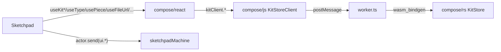

# Sketchpad: kit data hooks-only

## Architectural invariants

1. `compose/sketchpad` MUST contain zero kit data: no `KitStore` import, no `CollaborativeKitStore`/`DesignEntityStore`/`QualityEntityStore`, no `kit(id)`/`kitStore(id)`/`createKit`/`openKit`, no `Sync*`-backed kit registry, no `useType`/`useDesign`/`usePiece`/`useConnection`/`useAuthor`/`useQuality`/`usePieces`/`useConnections`/`usePiecesMetadataMap`/`usePiece*`/`useConnection*`/`useDiffed*`/`useKit`/`useKit*`/`useFileUrls`/`useKitTransaction`/`useKitCommands`/`useKitScope`/`KitScopeProvider`/`KitWasmRuntimeBridge` definitions, no kit factory re-exports (`createFolderKitStore`/`createJsonFileKitStore`/`createSessionKitStore`/`InMemoryKitStore`), no `executeKitCommand`/`applyKitDiff`/`inverseKitDiff`/`getDesignDiff`/`findDesignInKit`/`findPieceInDesign`/`findTypeInKit`/`findRepresentation`/`selectBestRepresentation`/`getKitPorts`/`colorPortsForTypes`/`getClusterableGroups`/`getIncludedDesigns`/`sumQualityInDesign`/`getStoredKitFileUrls`/`getOrCreateKitFileState`/`getReadableKitFileUrl`/`createKitFileObjectUrl`/`getKitFileProvider`/`getExistingKitFileProvider`/`getKitFileStoragePath`/`fetchReadableKitFileBlob`/`isBrowserReadableFileUrl` calls, no `KitDiff`/`PieceDiff`/`ConnectionDiff`/`DesignDiff`/`TypeDiff`/`QualityDiff`/`KitFileState`/`KitBinaryStore`/`KitJsonFileAdapter`/`KitFolderAdapter`/`KitCommandContext`/`KitCommandResult` references.
2. Every kit read/write goes through `@semio-tech/compose-react` `HookTriad` hooks; every domain operation is called through `useKitStoreClient()` (which forwards to wasm `KitStoreHandle` in `compose/rs`).
3. App store classes (`KitAppStoreImpl`, `DesignStore`, `QualityAppStore`, `DocsAppStore`) are split: kept-but-pure UI selection/tools/hover/panel state only (no kit reads, no `KitDiffAppStore` base), kit reads moved to consumers via `@semio-tech/compose-react` hooks.
4. SketchpadStore retains only UI state (navigation, theme, language, expertise, mode, panels, fullscreen, settings, hotkeys); kit lifecycle moves into `KitRegistryProvider` from `@semio-tech/compose-react`. The existing `sketchpadMachine` owns the active/open kit ids list.
5. Add the missing kit-file hooks to `@semio-tech/compose-react` so sketchpad has zero need for `CollaborativeKitStore`.

## Phase R — extend `@semio-tech/compose-react` (no domain logic, only thin client wrappers)

All edits in [compose/react/index.tsx](compose/react/index.tsx).

1. File / binary hooks (wrap `useKitStoreClient()` calls; the underlying RPC handlers in `compose/rs` already exist via `KitStoreCommand`):
   - `useKitFileUrl(fileId): SchemaHookTriad<string | null>` — current readable url for a file id (resolved via `kitClient.fileUrl(fileId)`); subscribes to kit changes.
   - `useKitFileBlobUrl(fileId): { url: string | null; loading: boolean; error?: SetError; refresh: () => Promise<void> }` — wraps `kitClient.fileBlobUrl(fileId)`.
   - `useEmbedKitFile(): { run: (fileId: string, blob: Blob) => Promise<SetResult>; status: WriteStatus }`.
   - `useKitBinary(): { read(path): Promise<Blob | null>; write(path, blob): Promise<void>; delete(path): Promise<void>; mkdir(path): Promise<void>; move(from, to): Promise<void> }` — bag wrapping the existing `KitStoreClient` binary RPC.
   - `useKitFileState(): SchemaHookTriad<KitFileState>` — replaces sketchpad's local `getOrCreateKitFileState`.
2. Persistence hooks (replace sketchpad's `inferKitPersistenceKind`/`getKitPersistenceSource` indirection):
   - `useKitPersistenceKind(): SchemaHookTriad<"temporary" | "file" | "folder" | "remote">` — derived from registry entry's backbone kind.
   - `useKitPersistenceSource(): SchemaHookTriad<{ kind, path?: string, url?: string } | undefined>`.
3. Selection helpers built on existing hooks (still no domain logic — pure JS over arrays returned by `useTypes()`/`useDesigns()`):
   - `useTypeById(typeId)` / `useDesignById(designId)` / `usePieceById(designId, pieceId)` / `useConnectionById(designId, connectionId)` / `useAuthorById` / `useQualityById` — re-exports of existing per-id hooks under explicit "ById" naming used by sketchpad.
4. Backwards-compat default exports for hooks sketchpad already imports (`useKitStoredFileUrls` keeps name; alias `useFileUrls = useKitStoredFileUrls`).
5. Extend `useKitRegistry` to expose persistence-aware open helpers used by the sketchpad machine: `openTemporary(initialKit)`, `openFile(adapter)`, `openFolder(adapter)`, `openRemote(serverConfig)`. Each returns a `kitId` and bumps `refs`. (No new domain logic — these wrap the already-exposed factories from `@semio-tech/compose-js`.)
6. Add `useActiveKitGuid()` (registry-aware) and `useOpenKitGuids()` for sketchpad navigation.

## Phase S1 — delete sketchpad kit-data classes

In [compose/sketchpad/index.tsx](compose/sketchpad/index.tsx):

- Delete region `🔑️Entity Store Wrappers` (~7002–7240): `DesignEntityStore`, `QualityEntityStore`, `CollaborativeKitStore`. Every consumer that previously did `new CollaborativeKitStore(rawStore)` (lines 36185, 39294, 55985) is rewritten to use `@semio-tech/compose-react` hooks (`useKitFileBlobUrl`, `useEmbedKitFile`, `useTypeById`, etc.).
- Delete `SketchpadKitStoreFactory` type (~7259) and `SketchpadKitKindAvailability` interface (~7261).
- Delete `inferKitPersistenceKind`, `getKitPersistenceSource`, `resolveKitFileProviderFactory`, `registerKitStore`, `createBackedKitStore`, `supportedKitKinds`, `availableKitKinds`, `createKit`, `openKit`, `loadKitFilesFromPublic`, `kit()`, `hasKit()`, `kitStore()`, `loadPersistedKits()`, `persistKitsToStorage`, `schedulePersistKitsToStorage`, all `kits`/`syncKits`/`syncKitApps`/`collaborativeKitStoreCache`/`kitShallowsCache`/`injectedKitStore`/`temporaryKitStoreFactory`/`folderKitStoreFactory`/`fileKitStoreFactory`/`remoteKitStoreFactory`/`skipBrowserKitSnapshotPersistence` fields and constructor params on `class SketchpadStore` (~18064+).
- Delete `KitAppStoreImpl` (~24959), `DesignStore` (~27477), `QualityAppStore` (~42303), and `class DocsAppStore extends PlainAppStore` references that touch kit data; replace with **plain UI selection stores** (no `KitDiffAppStore` base, no `kit()` accessor). Each `kit()` method (~25182, 27520, 42328) is removed; consumers fetch kit data via `@semio-tech/compose-react` hooks at component level.
- Delete `class HoverPiecesStore` if it embeds kit reads (~29595); keep only the hover-id selection slice.
- Delete `class KitDiffAppStore` and `class PlainKitDiffAppStore` base classes; everything else extends `PlainAppStore` (UI-only).
- Delete factories `temporaryKitStoreFactory`/`createSessionKitStore`/`createJsonFileKitStore`/`createFolderKitStore` re-exports and the local browser/desktop adapters at lines 47820–47935 (rewrite the boot path in `Sketchpad` component to call `useKitRegistry().openTemporary/openFile/openFolder/openRemote` from the machine instead).

## Phase S2 — delete sketchpad kit hooks

In [compose/sketchpad/index.tsx](compose/sketchpad/index.tsx):

- Region `🥈️Entity Hooks` (~7268–7475): delete `useAuthor`, `useType`, `useQuality`, `useDesign`, `usePiece`, `useConnection`. Keep only the **scope contexts** (`AuthorScope`/`TypeScope`/`QualityScope`/`DesignScope`/`PieceScope`/`ConnectionScope`) as pure id-providers; the entity data accessor moves to consumers calling `useTypeById(useTypeScope().id)` etc. (Or delete scopes entirely and pass ids as props if the call-graph is shallow — pick deletion when no nested hooks read the id implicitly.)
- Region `⏰️Entity Data Hooks` (~7460–7580): delete `usePieces`, `useConnections`.
- Region `🎆️Piece Derived Hooks` (~7494–7572): delete `usePiecesMetadataMap`, `usePieceMetadata`, `useFlatPiecePlane`, `useFlatPieceCenter`, `useIsConnectedPiece`, `usePieceDepth`, `useFixedPieceId`, `useParentPieceId`, `useCurrentPiecePlane`, `usePieceParentConnection`.
- Region `🎹️Design Derived Hooks` (~7574–7600): delete `useIncludedDesigns`, `useDesignId`, `usePiecesFromIds`, `useReplacableTypes`, `useReplacableDesigns`, `useExplodeableDesignNodes`.
- Region `⏱️Kit` scope/runtime (~7665–7700+): delete `useKitScope`, `useIsInKitScope`, `KitScope`, `KitScopeContext`, `KitScopeProvider`, `KitWasmRuntimeBridge`, `useKitStoreFromProvider`, `useKit`, `useKitTypes`, `useKitName`, `useKitDescription`, `useKitAuthors`, `useKitFiles`, `useKitQualities`, `useKitDesigns`, `useDesigns`, `useKitFolders`, `useKitPorts`, `useKitTags`, `useKitConcepts`, `useTypeFromKit`, `useDesignFromKit`, `useKitConnectorCompatibility`, `useFileUrls`, `useKitTransaction`, `useKitCommands`.
- Design-inspector triad region (~16726–17086): delete `useDiffedPiece`, `usePieceCenterU/V`, `usePieceScale`, `usePieceIsHidden`, `usePieceIsLocked`, `usePieceColor`, `usePieceDescription`, `usePieceName`, `useConnectionGap/Shift/Rise/Rotation/Turn/Tilt/U/V/Description`, `useClusterableGroups`, `useDiffedKit`, `usePortColoredTypes`, `usePieceWithDiff`, `useConnectionColor`, `useDiffedDesign`. Replace at consumers with `useUpdatePiece`/`useUpdateConnection` + `useDraft`/`useOptimistic` from `@semio-tech/compose-react`.
- Sync helpers region (~17492–17920): delete `useSync`, `useSyncOptional`, `useSyncDeep`, `useSyncField`, `useSyncFields`, `useSyncNestedArrayItemMembership`, `useSyncSelectionItemMembership`, `usePath`, `useDerived`, `useSyncWithState`. (Used only by the now-deleted sync-backed kit/app stores.)
- Region `💧️Commands` `kitCommands` map and `executeKitCommand` re-export.

## Phase S3 — split sketchpad UI app stores (Selected option: **split**)

For each remaining app store (`KitAppStoreImpl`, `DesignStore`, `QualityAppStore`, `DocsAppStore`):

- Drop the `KitDiffAppStore` base; extend `PlainAppStore` (UI-only).
- Remove every `kit*` field/method (e.g. `diff`, `kit()`, `applyKitDiff`, `getDesignDiff`, `getDiffedKit`, `pieceMetadata`, `flatPiecePlane`, etc.).
- Keep UI slices only: selection (pieces, connections, ports, tags, concepts, files, folders, types, designs, authors, qualities), hover, filter/sort/row toggle, panel visibility, formula/diagram fullscreen, active tool, camera/viewport (UI), tutorial state.
- Migrate command IDs that wrote kit data (e.g. `compose.designApp.updatePiece`, `compose.designApp.addConnection`, every `compose.kit.*` re-emission) into thin shims that **delegate to the `@semio-tech/compose-react` write hook** at the component layer (the store no longer accepts those commands; consumers call `useUpdatePiece().run(...)` etc.).
- Adjust the existing `sketchpadMachine` (~9671) to own `openKitGuids: Guid[]` and `activeKitGuid?: Guid`, plus events `ui.openKit.push`/`ui.openKit.close`/`ui.openKit.activate`. The machine invokes a `fromPromise` actor to call `kitRegistry.open*({ ... })`.

## Phase S4 — purge imports & component rewires

1. Top-of-file `import` from `@semio-tech/compose-js` (lines 19–100): remove every kit-data symbol — `applyKitDiff`, `areDesignsInSameFamily`, `arePortsCompatible`, `areSameConnection`, `colorPortsForTypes`, `createFolderKitStore`, `createJsonFileKitStore`, `createKitFileObjectUrl`, `createSessionKitStore`, `executeKitCommand`, `fetchReadableKitFileBlob`, `findDesignInKit`, `findPieceInDesign`, `findRepresentation`, `findTypeInKit`, `getClusterableGroups`, `getDesignDiff`, `getExistingKitFileProvider`, `getIncludedDesigns`, `getKitPorts`, `getKitFileProvider`, `getKitFileStoragePath`, `getOrCreateKitFileState`, `getReadableKitFileUrl`, `getStoredKitFileUrls`, `importKit`, `InMemoryKitStore`, `inverseKitDiff`, `isBrowserReadableFileUrl`, `KitBinaryStore`, `KitCommandContext`, `KitCommandResult`, `KitDiff`, `KitFileState`, `KitFolderAdapter`, `KitJsonFileAdapter`, `KitStore`, `KitStoreSnapshot`, `selectBestRepresentation`, `sumQualityInDesign`, plus diff types `ConnectionDiff`/`DesignDiff`/`PieceDiff`/`QualityDiff`/`TypeDiff`. Keep only pure value types (`Connection`, `Piece`, `Type`, `Design`, `Author`, `Quality`, `Coordinate`, `Plane`, `Point`, `Vector`, `Camera`, `Tag`, `Concept`, `Folder`, `Representation`, `File`, `Attribute`, `Id`, `id`, `KitShallow`, `DesignShallow`, `TypeShallow`, `Kit`, `TOLERANCE`, `ICON_WIDTH`).
2. Add the new hooks to the existing `@semio-tech/compose-react` import block (lines 101–125): `useKitFileUrl`, `useKitFileBlobUrl`, `useEmbedKitFile`, `useKitBinary`, `useKitFileState`, `useKitPersistenceKind`, `useKitPersistenceSource`, `useTypeById`, `useDesignById`, `usePieceById`, `useConnectionById`, `useAuthorById`, `useQualityById`, plus the existing `useType`/`useDesign`/`usePiece`/`useConnection`/`useAuthor`/`useQuality`/`usePieces`/`useConnections`/`useDesigns`/`useTypes`/`useAuthors`/`useKitName`/`useKitDescription`/`useKitFiles` etc.
3. Component rewires (call sites count: ~212 kit-store, ~89 entity-hook, ~239 commands/exec):
   - `useKitStoreFromProvider()` → `useKitStoreClient()`.
   - `new CollaborativeKitStore(raw)` → drop wrapper; use file/blob hooks directly (lines 36185, 39294, 55985).
   - `commands.updatePiece(...)` (×8) → `useUpdatePiece().run(...)` + `useDraft(triad)` at the input level.
   - `commands.updateConnection(...)` (×9) → `useUpdateConnection().run(...)`.
   - `commands.addConnection(...)` → `useAddConnection().run(...)`.
   - `store.execute("compose.designApp.*", ...)` (~37 sites) → either `actor.send({ type: "designApp.*", ... })` for UI, or matching `useX` hook from `@semio-tech/compose-react`.
   - Any remaining domain helper (`findTypeInKit`, `findPieceInDesign`, etc.) — replaced by `useTypeById(id)` / `usePieceById(designId, pieceId)`. If a derived shape is needed (e.g. flat piece plane), use `useFlatPiecePlane` from `@semio-tech/compose-react`.
4. Provider tree rewrite at the root (`Sketchpad` component, ~27177–27258 / ~47820+): wrap with `<KitRegistryProvider>`, then for each open kit tab mount `<KitProvider kitId={guid} backbone={...} fallback={<KitLoading />}>`. The boot factories that today live in sketchpad (browser file/folder, desktop electron, vscode webview) become `KitProviderBackbone` instances passed to `kitRegistry.open(guid, { backbone })`.

## Phase S5 — package.json + dist cleanup

- [compose/sketchpad/package.json](compose/sketchpad/package.json) keeps `@semio-tech/compose-react`, `@compose/ui`, `@semio-tech/compose-js` (still needed for value types). Drop `sql.js` if no consumer remains after the strip. Confirm `@semio-tech/compose-sketchpad` is NOT a dependency of `@semio-tech/compose-react`.
- Delete stale `dist/` build artifacts only if vite produces them on next build; do not commit changes to `dist/`.

## Phase T — tests + verification

- Extend the existing Playwright spec in [compose/sketchpad/index.tsx](compose/sketchpad/index.tsx) test region: kit boot (temporary/file/folder/remote each via `useKitRegistry`); piece-name input draft+commit+rejection; concurrent independent pending counters; file blob hook returns object-url and embeds blobs.
- Extend the existing vitest in [compose/react/index.tsx](compose/react/index.tsx) for the new file/binary hooks (mock `KitStoreClient`); registry persistence-kind hook; `useDraft` rollback on rejection.
- No new test files.
- Run, in order: `cargo test` in [compose/rs](compose/rs), `pnpm -F @semio-tech/compose-js test`, `pnpm -F @semio-tech/compose-react test`, `pnpm -F @semio-tech/compose-sketchpad test`. Smoke: open `metabolism.zip` in desktop, drag piece, edit name, undo/redo, export.

## Out of scope

- Moving `applyKitDiff`/`getDesignDiff`/`findRepresentation`/`selectBestRepresentation`/etc. from `@semio-tech/compose-js` into `compose/rs`. (The repo invariant requires it eventually, but this ticket only ensures sketchpad does not depend on those helpers — they remain available in `@semio-tech/compose-js` for `@semio-tech/compose-react` hook implementations until a separate ticket migrates them to wasm methods on `KitStoreHandle`.)
- Multiplayer remote kit UI changes beyond the registry plumbing.
- GraphQL/OpenAPI/Python/Ruby bundles.
