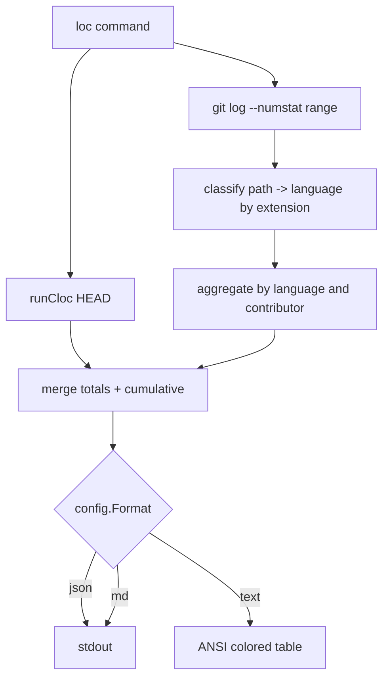

# repo/cli loc command

All work happens in [repo/client/main.go](repo/client/main.go) (per AGENTS.md: extend the existing file, no new files). Tests extend [repo/client/main_test.go](repo/client/main_test.go).

## 1. Command surface

New cobra command registered inside `NewRoot` (alongside the other `root.AddCommand(...)` lines around L639–671):

```
repo loc                              # current totals + cumulative metrics on HEAD's history
repo loc --history                    # per-commit time series along ⛳️wip
repo loc --byContributors             # per-contributor breakdown
repo loc --history --byContributors   # per-contributor time series along ⛳️wip
```

Persistent flags inherited from root: `--format md|text|json`, `--md`, `--text`, `--json`, `--repo`, `--verbose`.

Local flags:

- `--history` (bool) — emit per-commit rows along the dev branch.
- `--byContributors` (bool) — group by canonical contributor.
- `--branch` (string, default `⛳️wip`) — branch to walk for `--history` (escape hatch; not advertised).
- `--languages` (string slice, default `TypeScript,Go,C#,Python,Rust`) — also passed verbatim to `cloc --include-lang`.

## 2. Data flow



### 2.1 Current totals (no `--history`)

Shell out via existing `ExecCommand` helper:

```go
cloc . --vcs=git --exclude-dir=.repo --include-lang=TypeScript,Go,C#,Python,Rust --json
```

Parse the JSON object — keys are language names with `code` field — and seed `totals[lang]`.

### 2.2 Cumulative diffs (no `--history`)

```
git log --no-merges --numstat --first-parent \
  --pretty=format:"COMMIT%x09%H%x09%aN%x09%aE%x09%at" <range>
```

Range:

- default: full history of `HEAD` (no range argument; equivalent to walking all reachable commits).
- with `--history`: commits reachable from `--branch` (default `⛳️wip`).

For each non-merge commit, parse `<added>\t<removed>\t<path>` lines. Map `path` to language using:

```go
extToLang := map[string]string{
  ".ts":".tsx":".mts":".cts": "TypeScript",
  ".go":                     "Go",
  ".cs":                     "C#",
  ".py":                     "Python",
  ".rs":                     "Rust",
}
```

Skip paths under `.repo/` and any path matched by the existing `getGitignore()` helper.

Per language accumulate:

- `added` = Σ added
- `removed` = Σ removed
- `edited` = added + removed (touched-line metric — opinionated default)
- `loc` = filled from cloc (HEAD only) or from per-commit `cloc <sha>` in `--history` mode

With `--byContributors` add a second key dimension: `aliasFromAuthor(name, email)` resolved through the existing `FindAndUpdateContributor` to canonicalize aliases.

### 2.3 History mode without altering the working tree

For each commit `c` on `--branch` (oldest → newest):

- accumulate diffs as in 2.2 (running totals).
- for the LOC snapshot column, run `cloc <sha> --vcs=git --exclude-dir=.repo --include-lang=... --json`. cloc internally `git archive`s the tree to a temp dir, so the working tree is untouched.

To keep this tractable on long histories: only sample LOC snapshots at sparse points (every commit where `--verbose`, otherwise once per calendar day plus the latest). Cumulative added/removed are still computed for every commit.

We never call `git checkout`, `git reset`, `git stash`, etc. — only `git log`, `git rev-list`, `git show`, `git ls-tree`, and `cloc <sha>`. Verified by grepping the new region for forbidden invocations.

### 2.4 Path filtering

Reuse:

- [`getGitignore()`](repo/client/main.go#L15494) to skip `.gitignore`-matched paths.
- Hard-coded `.repo/` prefix skip (matches the cloc invocation).

## 3. Rendering

Bypass the streaming Event pipeline (the data is structured + tabular, not a stream). Branch on `config.Format` directly inside `RunE`:

- **json** (`config.IsJSON()`): single JSON object — see schema below — written to stdout, ending with `\n`.
- **md** (`config.IsMarkdown()`): one or two markdown tables (snapshot + optional history) using GitHub-flavored pipe syntax.
- **text** (default): ANSI-colored aligned tables using existing `ColorRed/Green/Yellow/Blue/Dim/Bold` and `colorize()`. Detect TTY via `cmd.OutOrStdout().(*os.File).Stat()` like `HumanRenderer.Render` does (L7515).

### 3.1 JSON schema

```json
{
  "loc": {
    "snapshot": {
      "TypeScript": {"loc": 12345, "edited": 9876, "added": 5432, "removed": 4444},
      "Go":         {"loc":  ...   ...},
      "C#":         {...},
      "Python":     {...},
      "Rust":       {...}
    },
    "byContributors": {
      "ueli":  { "TypeScript": {...}, "Go": {...} },
      "kinan": { ... }
    },
    "history": [
      {
        "sha":  "abcdef0",
        "date": "2026-04-26T18:32:00+02:00",
        "author": "ueli",
        "languages": {
          "TypeScript": {"loc": 12340, "edited": 80, "added": 60, "removed": 20},
          ...
        }
      }
    ],
    "branch": "⛳️wip"
  }
}
```

`byContributors` is omitted unless `--byContributors`. `history` is omitted unless `--history`. With both, each history entry's `languages` map is replaced by `byContributors: { alias: { lang: {...} } }`.

### 3.2 Markdown (LLM-friendly)

Snapshot table:

```md
## LOC Snapshot

| Language   |   loc | edited | added | removed |
| ---------- | ----: | -----: | ----: | ------: |
| TypeScript | 12345 |   9876 |  5432 |    4444 |
| ...        |       |        |       |         |
```

With `--byContributors` add a second table grouped by contributor. With `--history` add a per-commit table.

### 3.3 Text (TTY)

Same shape as markdown, but rendered as an aligned ASCII table. Color rules:

- header in `ColorBold`,
- `added` cell in `ColorGreen`,
- `removed` in `ColorRed`,
- `edited` in `ColorYellow`,
- `loc` in default,
- contributor names in `ColorBlue`,
- short SHAs in `ColorDim`.

When stdout isn't a TTY, fall back to plain ASCII (no color codes) — matching `colorize` semantics.

## 4. Implementation outline

New region in [repo/client/main.go](repo/client/main.go) (placed near the other top-level commands, e.g. just before `func mermaidCommand`):

```go
// #region 🔢️LOC Command
// Reports current and cumulative lines-of-code metrics across canonical languages.

const (
    locDefaultBranch    = "⛳️wip"
    locDefaultLanguages = "TypeScript,Go,C#,Python,Rust"
)

type LocLangStats struct{ Loc, Edited, Added, Removed int }

type LocReport struct {
    Snapshot       map[string]LocLangStats             `json:"snapshot"`
    ByContributors map[string]map[string]LocLangStats  `json:"byContributors,omitempty"`
    History        []LocHistoryEntry                   `json:"history,omitempty"`
    Branch         string                              `json:"branch,omitempty"`
}

type LocHistoryEntry struct {
    SHA            string                                  `json:"sha"`
    Date           string                                  `json:"date"`
    Author         string                                  `json:"author,omitempty"`
    Languages      map[string]LocLangStats                 `json:"languages,omitempty"`
    ByContributors map[string]map[string]LocLangStats      `json:"byContributors,omitempty"`
}

func locCommand(factory EngineFactory, config *Config) *cobra.Command { /* cobra wiring + flags */ }
func runLoc(cmd *cobra.Command, config *Config, history, byContrib bool, branch string, langs []string) error { /* orchestrate */ }

func runCloc(repoRoot, ref string, langs []string) (map[string]LocLangStats, error) { /* exec cloc + parse JSON */ }
func walkGitNumstat(repoRoot, rangeRef string, langs []string, byContrib bool) ([]LocCommit, error) { /* git log --numstat parse */ }
func classifyLanguage(path string, langs []string) string { /* extension table */ }
func aggregateSnapshot(commits []LocCommit, byContrib bool) (map[string]LocLangStats, map[string]map[string]LocLangStats)
func buildHistory(commits []LocCommit, repoRoot string, langs []string, byContrib, verbose bool) []LocHistoryEntry

func renderLocJSON(out io.Writer, r *LocReport) error
func renderLocMarkdown(out io.Writer, r *LocReport, history, byContrib bool)
func renderLocText(out io.Writer, r *LocReport, history, byContrib, isTTY bool)

// #endregion 🔢️LOC Command
```

Wire it in `NewRoot`:

```617:670:repo/client/main.go
root.AddCommand(mermaidCommand(factory, &config))
root.AddCommand(technologyCommand(factory, &config))
+root.AddCommand(locCommand(factory, &config))
```

## 5. Tests

Extend [repo/client/main_test.go](repo/client/main_test.go) with one new test function `TestLocCommand` containing multiple sub-`t.Run`s (per AGENTS.md: one test per unit, multiple sub-cases inside):

- `classify-language`: extension → language mapping (and gitignore/`.repo` exclusion).
- `numstat-parse`: feeds a synthetic `git log --numstat` blob through `parseGitNumstatStream` and asserts per-language totals + per-contributor split.
- `aggregate`: snapshot aggregation merges `cloc` totals with cumulative diff metrics correctly.
- `render-json`: marshals a fixed `LocReport` and asserts stable JSON shape.
- `render-markdown`: snapshot of the table for a fixed report.
- `render-text-no-tty`: asserts no ANSI escapes when isTTY=false.
- `cli-flags`: builds the cobra command and asserts `--history`, `--byContributors`, and format flags wire through (using a fake exec for `git`/`cloc` via `t.TempDir` PATH override, mirroring existing `writeExecutableFile` helpers in the test file at L80).

Skip the live cloc/git tests with `t.Skip` if `cloc` is not on PATH, so CI without cloc still passes; assert via fake binaries otherwise.

## 6. Notes / opinionated choices

- `edited = added + removed` (touched-line count). A separate "modified-file LOC" metric isn't derivable from `git log --numstat` without re-reading file contents, so we take the standard sum interpretation.
- `--byContributors` resolves authors through `FindAndUpdateContributor` (already in main.go at L14007) so aliases stay consistent with the rest of the CLI.
- Default range is `HEAD`'s reachable history. `--history` switches the range to the dev branch `⛳️wip` and adds per-commit rows.
- No interactive git mutations are used (forbidden by AGENTS.md). Verified by code review.
- Output unaffected by `--repo`/cwd: all `git`/`cloc` calls receive the resolved `repoRoot` as their `cwd`.
