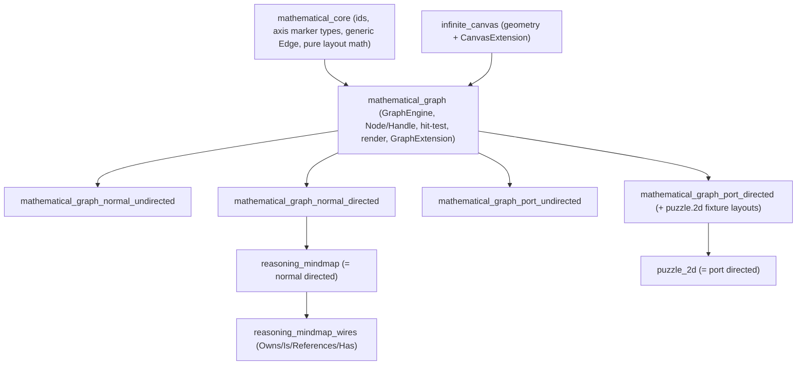

## Generalize Graphs

Today everything lives in one crate `mathematical_graph` at [mathematical/graph/port/directed/lib.rs](mathematical/graph/port/directed/lib.rs) (~1789 lines): `BoardEngine`, `Node`/`Handle`/`Edge`, hit-test/drag/selection, render snapshot, plus fixture-JSON layouts (`force_graph`, `hierarchical_tree`, `redraw_layout`) and the `GraphExtension` trait. The sibling quadrant dirs (`normal/{directed,undirected}`, `port/undirected`, orphan top-level `undirected/`) and `mathematical/core/lib.rs` are empty stubs. [reasoning/mindmap/lib.rs](reasoning/mindmap/lib.rs) and [puzzle/2d/rs/lib.rs](puzzle/2d/rs/lib.rs) both depend on this single crate. WIRES ([reasoning/mindmap/wires/lib.rs](reasoning/mindmap/wires/lib.rs)) is an empty, unwired stub.

### Target crate graph (compile-time, nothing dynamic)

### Design: two independent compile-time axes

In `mathematical_core` define marker types + traits (no runtime branching):

- Directedness: `trait Directedness { const DIRECTED: bool; }` with `struct Directed`, `struct Undirected`. Drives edge endpoint normalization (undirected stores `(min,max)`) and which layouts are available (hierarchical-tree only on `Directed`).
- Port model: `trait PortModel { type Endpoint: Copy + Ord; type HandleStore: Default; ... }` with `struct Normal` (`Endpoint = NodeId`, no handles) and `struct Ported` (`Endpoint = HandleId`, handles owned by nodes). Generic `Edge<E> { id, source: E, target: E }`.
- Pure layout math (force vectors on abstract `(f64,f64)` positions + adjacency, Buchheim tree math) lives here, geometry-free.

In `mathematical_graph` (NEW base at `mathematical/graph/lib.rs`) generalize the current engine into `GraphEngine<P: PortModel, D: Directedness>` holding the existing `camera/nodes/edges/selection/hover/interaction`, plus `P::HandleStore` for handles. `PortModel` carries the methods that differ between normal/port: `endpoint_anchor` (port = `handle_position`, normal = node center), endpoint hit-testing, and dependent cleanup on node removal. Re-export `Camera`, `NodeId`/`HandleId`/`EdgeId`, `Node`, `RenderSnapshot`, `BoardEvent`, `Selection`, `InteractionMode`, `handle_position`, and `pub trait GraphExtension: canvas::CanvasExtension {}`. This is the current [Engine region](mathematical/graph/port/directed/lib.rs) lifted up with `P::Endpoint`/`P::HandleStore` substituted for the hard-coded `HandleId`/`handles` map.

### Quadrant crates (thin, each "holds exactly what it says")

Each quadrant `lib.rs` only: `pub use mathematical_graph::*;` + a concrete alias, plus axis-specific glue not expressible by the generics, plus in-file tests:

- `mathematical_graph_normal_undirected`: `pub type UndirectedGraphEngine = GraphEngine<Normal, Undirected>;`
- `mathematical_graph_normal_directed`: `pub type DirectedGraphEngine = GraphEngine<Normal, Directed>;`
- `mathematical_graph_port_undirected`: `pub type UndirectedPortGraphEngine = GraphEngine<Ported, Undirected>;`
- `mathematical_graph_port_directed`: `pub type DirectedPortGraphEngine = GraphEngine<Ported, Directed>; pub type BoardEngine = DirectedPortGraphEngine;` and KEEP the puzzle-coupled `force_graph`/`hierarchical_tree`/`redraw_layout` fixture-JSON functions here (they assume the `puzzle.2d.fixture/v1` port+directed shape), built on the generic math from `mathematical_core`.

### Re-point consumers

- [reasoning/mindmap/lib.rs](reasoning/mindmap/lib.rs) + [reasoning/mindmap/Cargo.toml](reasoning/mindmap/Cargo.toml): dep `mathematical_graph` (port/directed) -> `mathematical_graph_normal_directed`; change `pub use mathematical_graph as graph` to that crate. `TopicId = graph::NodeId`, `RelationshipId = graph::EdgeId`, `MindmapExtension: graph::GraphExtension` stay valid (relationships are node-to-node edges = normal directed). Existing test still passes.
- WIRES: turn `reasoning/mindmap/wires` into crate `reasoning_mindmap_wires` (new `Cargo.toml`, fill `lib.rs` with regions): `WiresExtension: mindmap::MindmapExtension`, `enum WireRelationship { Owns, Is, References, Has }`, fixed topic-set validation, in-file tests. Depends on `reasoning_mindmap`.
- [puzzle/2d/rs/Cargo.toml](puzzle/2d/rs/Cargo.toml) + [puzzle/2d/rs/lib.rs](puzzle/2d/rs/lib.rs): dep path/name `mathematical_graph` -> `mathematical_graph_port_directed`; update the single `pub use mathematical_graph::{self as graph, ...}` (line ~6) to the new crate name. The `as graph` alias keeps all downstream `graph::*` imports and `Puzzle2dExtension: graph::GraphExtension` unchanged. `BoardEngine`/layout fns remain exported by the port/directed crate.

### Wiring & validation

- [Cargo.toml](Cargo.toml) workspace `members`: replace the lone `"mathematical/graph/port/directed"` with `mathematical/core`, `mathematical/graph`, and the four quadrant paths; add `reasoning/mindmap/wires`; drop the orphan `mathematical/graph/undirected/` stub.
- [.vscode/launch.json](.vscode/launch.json): the cargo test entry currently passing `-p mathematical_graph` becomes `-p mathematical_core -p mathematical_graph -p mathematical_graph_normal_undirected -p mathematical_graph_normal_directed -p mathematical_graph_port_undirected -p mathematical_graph_port_directed -p reasoning_mindmap -p reasoning_mindmap_wires` (keep existing grouping/order).
- Validate with `cargo test` across the new crates plus `reasoning_mindmap`, `reasoning_mindmap_wires`, and `puzzle_2d` (must still compile + pass), confirming behavior with `[DEBUG]` logs where runtime checks are needed.

### Constraints / notes

- AGENTS.md files are NOT edited or created (workspace rule); the empty quadrant `AGENTS.md` stubs and the stale doc links in [reasoning/mindmap/AGENTS.md](reasoning/mindmap/AGENTS.md) are left as-is.
- All work happens inside a repo MCP ticket: at execution start read `repo://goals`, `ticket_open` (associating this plan id), keep any temp logs under the ticket folder, and `ticket_close` with the file summary when done.
- No new files beyond the required `Cargo.toml`/`lib.rs` per crate; new tests extend the existing in-file `#[cfg(test)]` modules; permanent scripts (none expected here) would go in `script.ts`.
