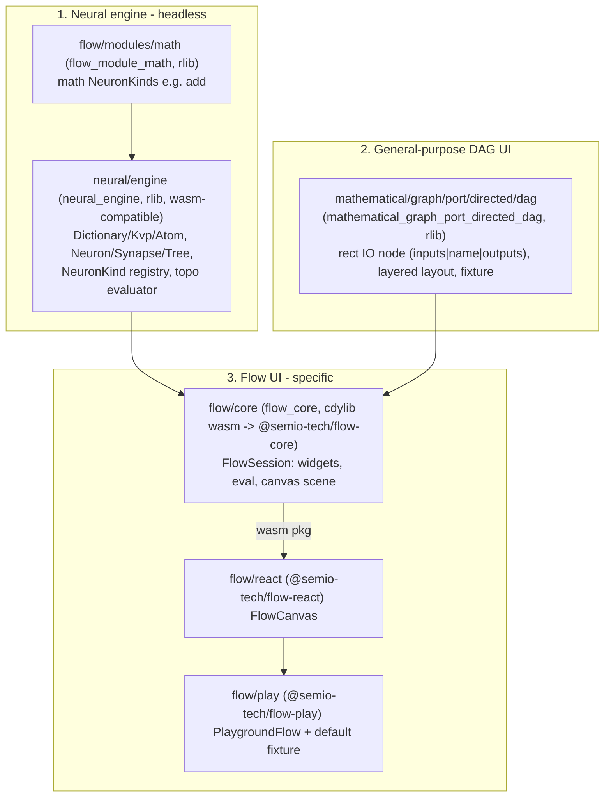

# Flow Language: End-to-End Vertical Slice

Build the three parts of `flow` following the established repo triple pattern (`rs` Rust+wasm crate, `react` renderer, `play` playground app) seen in `puzzle/2d`, reusing `DirectedPortGraphEngine` and the `infinite_canvas` Vello scene/React canvas. Almost all target files are currently empty stubs; only the `AGENTS.md` concept docs are filled in (and must NOT be edited).

## Target architecture

## Constraints to honor (from repo AGENTS.md)

- Do NOT edit any `AGENTS.md`. Extend existing files; add code in `#region`/`pub mod` regions; concise code, no in-body comments, emoji-prefixed docstrings.
- Permanent scripts only in each package's `script.ts`; `project.json`/`package.json` only call `script.ts`/`nx`. No new script files.
- Register every runnable command in `.vscode/launch.json` following existing grouping/order. Use `bun`/`nx`. No git-mutating commands.
- External libs behind interfaces; engine must stay wasm-compatible (no native-only deps).

## Step 0 - Ticket (execution time)

Repo MCP is not connected in this session. At execution start: read `repo://goals`, `ticket_open` a new ticket associated with the best goal (or `ticket_reopen` if one covers this), and keep all temp/log files inside the ticket folder.

## Part 1 - Neural engine (Rust, headless)

- `neural/engine/lib.rs` + new `neural/engine/Cargo.toml` (`name = "neural_engine"`, `crate-type = ["rlib"]`, edition 2021, rust-version 1.88; deps: `serde`, `serde_json`). Implement:
  - Region `Dictionary`: immutable, unordered, collision-free KVP map; `Key` (dot-separated camelCase segments), `Value` = `Atom | Dictionary`, `Atom` = `Integer | Decimal | String`. Serde JSON in/out.
  - Region `Tree`: `Neuron { id, kind, params }`, `Synapse { id, from, to }` (handle/port endpoints), DAG storage.
  - Region `NeuronKind`: trait `Function { fn evaluate(&self, input: &Dictionary) -> Result<Dictionary, EvalError> }` + a `Registry` mapping kind id -> `Box<dyn Function>` (this is the module extension point).
  - Region `Evaluator`: topological evaluation over the tree producing per-neuron output dictionaries.
  - Region `Tests`: dictionary round-trip, registry dispatch, two-neuron eval.

## Part 1b - Math module (Rust)

- `flow/modules/math/lib.rs` + new `flow/modules/math/Cargo.toml` (`name = "flow_module_math"`, rlib; dep `neural_engine = { path = "../../../neural/engine" }`). Provide `add` (and a couple more) `NeuronKind`s implementing `Function`, plus `register(registry: &mut Registry)`. Tests cover `add`.

## Part 2 - General-purpose DAG UI (Rust)

- `mathematical/graph/port/directed/dag/lib.rs` + new `mathematical/graph/port/directed/dag/Cargo.toml` (`name = "mathematical_graph_port_directed_dag"`, rlib; deps mirror sibling `normal`: `mathematical_graph_port_directed = { path = "../normal" }`, `mathematical_graph = { path = "../../.." }`, `mathematical_core = { path = "../../../core" }`, `infinite_canvas = { path = "../../../../infinite/canvas/vello" }`, `serde`, `serde_json`).
  - `pub type DagBoardEngine = DirectedPortGraphEngine;` plus a rectangle IO-node model: left input handles, vertical center name, right output handles (per `dag/AGENTS.md`).
  - Region `Layout`: layered (rank-by-longest-path) DAG layout writing node `x/y` into a `dag.fixture/v1` value (reuse Buchheim/`mathematical_core::tree_layout` where natural).
  - Region `GraphExtension`: `impl`/marker for DAG semantics; acyclicity guard on edge insert.
  - Region `Tests`: rectangle handle placement + layered layout + cycle rejection.
- Add `"mathematical/graph/port/directed/dag"` to root [Cargo.toml](Cargo.toml) `members`.

## Part 3 - Flow core (Rust cdylib -> wasm)

- `flow/core/lib.rs` + new `flow/core/Cargo.toml` (`name = "flow_core"`, `crate-type = ["rlib","cdylib"]`; deps: `neural_engine`, `flow_module_math`, `mathematical_graph_port_directed_dag`, `infinite_canvas`, `serde`, `serde_json`; `[target.'cfg(target_arch="wasm32")'.dependencies]` `wasm-bindgen`, `serde-wasm-bindgen`, `js-sys`, `web-sys` like [puzzle/2d/rs/Cargo.toml](puzzle/2d/rs/Cargo.toml)).
  - Region `Widget`: `Widget = Neuron | Input(Slider|Note) | Output(Preview|Action)` (per [flow/AGENTS.md](flow/AGENTS.md)); maps each widget to a DAG rect node + neural tree node.
  - Region `FlowSession` (`#[wasm_bindgen]`, like `BoardSession`): load/serialize a `flow.fixture/v1`, build the DAG board scene (canvas `SceneDescriptorJson`), `attach_canvas`/`renderFrame`, pointer/camera input, and `evaluate()` running the neural engine (math registered) to fill `Preview` outputs.
  - `flow/core/script.ts` (new): `runWasmPackWebBuild({ wasmBaseName: "flow_core", pkg.name: "@semio-tech/flow-core", skipEnvVar: "FLOW_CORE_SKIP_WASM_BUILD" })` mirroring [puzzle/2d/rs/script.ts](puzzle/2d/rs/script.ts).
  - Add `"flow/core"` to root [Cargo.toml](Cargo.toml) `members`.
  - Region `Tests`: end-to-end native eval of slider->add->preview fixture.

## Part 3b - Flow React renderer

- `flow/react/index.tsx` (new) + `package.json` (`@semio-tech/flow-react`), `project.json` (`test`), `script.ts` (prebuild wasm then vitest). Imports wasm relative `../core/pkg/flow_core.js` (top-level `await initFlowWasm()`), exports `FlowCanvas`, fixture types, `ensureFlowWasmLoaded`. Render DAG/widgets via `@semio-tech/infinite-canvas-react-renderer` driven by `FlowSession` (mirror `@semio-tech/puzzle-2d-react` `GpuWasmBridge`).

## Part 3c - Flow play app

- New under `flow/play/`: `index.ts` (replace empty stub), `index.html`, `globals.css`, `vite.config.ts`, `vitest.config.ts`, `package.json` (`@semio-tech/flow-play`, dep `@semio-tech/framework-playground-core`, devdep `@semio-tech/framework-playground-renderer-react`, `@semio-tech/flow-react`), `project.json` (`dev` env `FLOW_PLAY_PORT: "6016"`, `test` `6029`), `script.ts` (wasm -> vite dev/build/test).
  - `index.ts`: `PlaygroundFlow extends Playground`, `FlowPlayShellController extends Controller`, declarative body via `buildFlowWindowBody(...)` (or reuse `buildPuzzle2dWindowBody` surface), default fixture = slider -> math `add` -> preview, boot gate `import.meta.env.PUZZLE_PLAY_ENTRY === "flow"` calling `bootFlowPlay(new PlaygroundFlow())`.
  - `vite.config.ts`: `createPlaygroundPlayViteConfig({ playEntryKind: "flow", alias @semio-tech/flow-react })`.

## Part 3d - Framework + build wiring

- [framework/product/playground/renderer/react/index.tsx](framework/product/playground/renderer/react/index.tsx): add region `FlowPlayHost` (copy `Puzzle2dPlayHost`): `FlowPlayPaneSurfaceHost`, `registerFlowPlaySurfaceHosts`, `FlowPlayChrome`/`mountFlowPlayChrome`, `bootFlowPlay(playground) { bootPlayground(playground, flowPlayChromeBoot) }`.
- `framework/product/playground/renderer/react/package.json`: add `"./flow": "./index.tsx"` export + deps `@semio-tech/flow-play`, `@semio-tech/flow-react`.
- If a dedicated surface type is needed: add `UiFlowHostSurfaceNode` + `buildFlowWindowBody` in [framework/product/platform/core/index.ts](framework/product/platform/core/index.ts), re-export from `framework/product/playground/core/index.ts`, and register `"flow"` in `PLAYGROUND_CANVAS_HOST_TYPES` + `renderPlaygroundHostSurface`. (Reuse `puzzle2d` surface if the canvas API matches to reduce scope.)
- `ui/styling/vite-elements-assets.ts`: extend playground kind union with `"flow"`, add boot subpath `@semio-tech/framework-playground-renderer-react/flow -> flow`, and `FlowPlayHost` start/end markers.
- Root [package.json](package.json): add `flow/react`, `flow/play` to `workspaces`; add scripts `dev:flow` -> `bun ./📜️script.ts dev flow` (extend root [script.ts](script.ts) `dev` router with a `flow` case mirroring `2d`).
- [.vscode/launch.json](.vscode/launch.json) group `3_dev`: add `🛠️dev🌊️flow` (`bun run dev:flow`, env `FLOW_PLAY_PORT: 6016`, serverReadyAction on `:6016`) ordered near the puzzle entries; optionally a `🛠️dev🌊️flow🦀️rs` (`bun nx run @semio-tech/flow-core:wasm`) entry.

## Validation (must confirm at runtime, no assumptions)

- `cargo test -p neural_engine -p flow_module_math -p mathematical_graph_port_directed_dag -p flow_core` all pass.
- `bun nx run @semio-tech/flow-core:wasm` produces `flow/core/pkg`.
- `bun nx run @semio-tech/flow-react:test` and `@semio-tech/flow-play:test` pass.
- `bun run dev:flow` serves on 6016; confirm via console logs (`[DEBUG]` prefixed, temporary) that the default slider->add->preview flow evaluates and the preview shows the computed number, and the DAG renders rectangle IO nodes.
