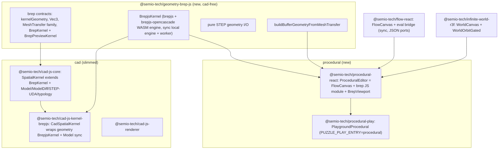

# Procedural Brep Playground

Implement `procedural` in three phases as requested: (1) extract a reusable brep kernel out of cad, (2) build the procedural react bundle, (3) build the procedural playground. Work inside a repo ticket (read `repo://goals`, then `ticket_open`; structure all new code with `#region` markers).

## Architecture

## Phase 1 - Extract reusable brep kernel `@semio-tech/geometry-brep-js`

Goal: a cad-free bundle owning the `brepjs`/`brepjs-opencascade` dependency, the brep record graph, and a synchronous-capable brep kernel. cad then depends on it (no circular dep: all `Model`-aware logic stays in cad).

- Create `geometry/brep/js/index.ts` (`@semio-tech/geometry-brep-js`, `bundleKind: "library"`) plus `package.json`, `project.json`, `script.ts`, `tsconfig.json`, `vitest.config.ts` mirroring [cad/js/kernel/brepjs](cad/js/kernel/brepjs/package.json). Deps: `brepjs`, `brepjs-opencascade` only.
- Move the GENERIC pieces out of [cad/js/kernel/brepjs/index.ts](cad/js/kernel/brepjs/index.ts) into the new bundle: `BrepjsWasmEngine`, `BrepjsWorkerClient`, worker entry, `meshTransferFromBrep` + bridge helpers, `BrepjsScratch`/entity maps, `OpenCascade` init, all preview math (`vec3*`, `arc*`, `circle*`, `nurbs*`, edge sampling, AABB helpers), and the model-free kernel ops (`createBoxFromCorners`, `sphere`/`box`/`cylinder`/`cone`, `extrudeWire`, `loft`, `offsetFaces`, booleans `fuseAll`/`sewShells`, `volume`/`measureArea`/`measureLength`/`measureDistance`, `tessellate(solid, tolerance)`, `adjacentSolids`, `sharedFacesBetween`) plus pure STEP geometry import/export (`exportSTEP`/`importSTEP` wrappers minus typology/UDA).
- Move the GENERIC contracts out of [cad/js/core/index.ts](cad/js/core/index.ts) into `@semio-tech/geometry-brep-js`: `kernelGeometry` namespace (records/refs ~1161-1260), `Vec3`/`EdgeCurve`/`ArcPlaneFrame` (~172-208), `MeshTransfer`/`FaceGroup`/`EdgeGroup`/`FaceInfo`/`EdgeInfo`/`emptyMeshTransfer` (~4124-4167). Define new interfaces `BrepPreviewKernel` (generic preview math) and `BrepKernel` (model-free brep ops); these are the cad-free split of the current `SpatialPreviewKernel`/`SpatialKernel`.
- Add `buildBufferGeometryFromMeshTransfer` + `isRenderableMeshTransfer` (pure, three-free: return plain typed-array geometry data, or keep three behind the existing `sceneHostPort` boundary) so the viewport can convert tessellation without depending on `@semio-tech/cad-js-renderer`.
- Slim [cad/js/core/index.ts](cad/js/core/index.ts): re-export/import the moved contracts from `@semio-tech/geometry-brep-js`; redefine cad `SpatialKernel` to `extends BrepKernel` adding the `Model`/`ModelDiff` methods (`syncSolidsFromModel`, `tessellate(...model)`, `executeCommandDiff`, `*Diff`). Keep all STEP-UDA/typology helpers in core.
- Slim [cad/js/kernel/brepjs/index.ts](cad/js/kernel/brepjs/index.ts): becomes the cad `SpatialKernel` adapter composing `@semio-tech/geometry-brep-js`'s `BrepjsKernel` + `Model` sync + cad STEP import/export (`importStepBimToModelSpace`, typology mapping, UDA). Re-point its embedded tests; keep `@semio-tech/cad-js-runtime`/module test imports.
- Update consumers: [cad/js/renderer/index.tsx](cad/js/renderer/index.tsx) and [cad/js/renderer/play/index.tsx](cad/js/renderer/play/index.tsx) import `PreciseSpatialKernelMath`/`preciseSpatialKernelMath`/`Vec3`/`MeshTransfer` from `@semio-tech/geometry-brep-js`, and `BrepjsKernel` (cad adapter) from `@semio-tech/cad-js-kernel-brepjs`.
- Wire config: add `@semio-tech/geometry-brep-js` to root `package.json` workspaces; add alias in [ui/styling/vite-elements-assets.ts](ui/styling/vite-elements-assets.ts) and in [cad/js/renderer/play/vite.config.ts](cad/js/renderer/play/vite.config.ts) `extraAliases`/`optimizeDeps` (move `brepjs`/`brepjs-opencascade` prebundling target); update tsconfig `paths` and vitest aliases in the affected bundles; add `launch.json` entry for `@semio-tech/geometry-brep-js:fixture`/`:test` near the existing `🛠️dev📐️cad🧪️kernel🪜️fixture`.
- Validate: run `@semio-tech/geometry-brep-js:test`, `@semio-tech/cad-js-kernel-brepjs:test`, `@semio-tech/cad-js-renderer` build/dev, confirming the cad play viewport still renders.

## Phase 2 - Procedural react bundle `@semio-tech/procedural-react`

Goal: `ProceduralEditor` = `FlowCanvas` (node graph) + a JS brep flow module + an R3F brep preview pane. Mirror the [flow/react](flow/react/index.tsx) bundle scaffolding.

- Scaffold `procedural/react`: fill `index.tsx`, add `script.ts`, `package.json` (`@semio-tech/procedural-react`, library), `project.json`, `vitest.config.ts` mirroring [flow/react](flow/react/package.json). Deps: `@semio-tech/flow-react`, `@semio-tech/geometry-brep-js`, `@semio-tech/infinite-world-r3f`, `react`, `react-dom`, `three`, `@react-three/fiber`, `@react-three/drei`, `@semio-tech/ui-styling`.
- Brep flow module (JS-evaluated virtual module, no Rust): register a `FlowExtensionManifestV1` in TS with `NeuronKindInfo`s like `brep.box`, `brep.sphere`, `brep.cylinder`, `brep.extrude`, `brep.union`, `brep.difference`, `brep.intersect`, `brep.translate`. Provide a synchronous `evaluate(kindId, inputJson)` that calls a pre-initialized `@semio-tech/geometry-brep-js` brep engine (local sync engine, WASM initialized eagerly via `ensureBrepWasmLoaded()` before evaluation is enabled). Solids are stored in an in-memory `Map<id, SolidRef>`; node outputs carry `{ "brep": "<solidId>" }` dictionaries (ids cross the JSON port boundary; geometry stays in the engine).
- Register the brep module with the flow extension host: extend `FlowExtensionHost`/`createFlowEvalBridge` usage so `brep.*` kinds dispatch to the JS brep evaluate, alongside `FLOW_DEFAULT_MODULE_IDS`. Add a `procedural` catalogue section for the palette.
- Surface eval geometry to the viewport: extend [flow/react/index.tsx](flow/react/index.tsx) `FlowCanvas` with an `onEvalOutputs?(outputsJson: string)` callback emitting the full `session.evaluate()` map (today only `onPreviewText` is surfaced). `ProceduralEditor` reads the selected/output node's `brep` solid id.
- `BrepViewport` component: `@semio-tech/infinite-world-r3f` `WorldCanvas` + `WorldOrbitGated` + `WorldCameraInvalidator` + lights, tessellate the selected `SolidRef` via the brep engine's `tessellate(solid, tolerance)` -> `MeshTransfer`, convert with `buildBufferGeometryFromMeshTransfer` (from Phase 1) into an R3F `<mesh>` + edge `<lineSegments>`, with auto-fit camera.
- `ProceduralEditor` composes `FlowCanvas` (left) + `BrepViewport` (right) and owns the brep engine + extension host instances. Add inlined `import.meta.vitest` tests (box->mesh non-empty, union volume).

## Phase 3 - Procedural playground `@semio-tech/procedural-play`

Goal: a dev playground mirroring the [flow/play](flow/play/index.ts) split pattern, booting `ProceduralEditor` through the framework renderer.

- Scaffold `procedural/play`: `index.html` (loads `./index.ts`), `index.ts` (`ProceduralPlayController extends Controller`, `PlaygroundProcedural extends Playground`, boot gate `PUZZLE_PLAY_ENTRY === "procedural"` -> dynamic `import("@semio-tech/framework-playground-renderer-react/procedural")` -> `bootProceduralPlay`), `script.ts` (dev/build/test/validate; build flow core + flow module WASM like [flow/react/script.ts](flow/react/script.ts) since the flow runtime is reused), `package.json`, `project.json`, `vite.config.ts`, `vitest.config.ts`, `globals.css` mirroring [flow/play](flow/play/vite.config.ts).
- Framework renderer: add `procedural` to `PlaygroundRendererPuzzleKind`, a `//#region ProceduralPlayHost` with a `ProceduralPlaySurfaceHost` rendering `ProceduralEditor` and a `bootProceduralPlay(playground)` export in [framework/product/playground/renderer/react/index.tsx](framework/product/playground/renderer/react/index.tsx), mirroring `bootFlowPlay`/`FlowPlayPaneSurfaceHost` (~6065).
- Ports: add `procedural: { dev: 6018, test: 6031, env: "PROCEDURAL_PLAY_PORT" }` to [ui/styling/playground-dev-ports.ts](ui/styling/playground-dev-ports.ts) (6018-6019 are free between dag and cad).
- Vite config: `createPlaygroundPlayViteConfig({ playEntryKind: "procedural", extraAliases: [@semio-tech/procedural-react, @semio-tech/geometry-brep-js, @semio-tech/flow-react, three], resolveDedupe: ["react","react-dom","three","scheduler"], optimizeDeps: ["brepjs","brepjs-opencascade", R3F, @semio-tech/infinite-world-r3f] })`.
- Repo registration: add `procedural/react` + `procedural/play` to root `package.json` workspaces; add `dev:procedural` script + a `dev procedural` route in root [script.ts](script.ts); add `@semio-tech/procedural-react`/`@semio-tech/procedural-play` aliases in [ui/styling/vite-elements-assets.ts](ui/styling/vite-elements-assets.ts); add `launch.json` entries (`🛠️dev🔧️procedural`, optional `:validate`) following the flow grouping/order with `PROCEDURAL_PLAY_PORT=6018`.
- Validate: `bun run dev:procedural` serves on 6018; drop brep nodes (box -> extrude -> union), confirm the R3F viewport renders the tessellated solid (check `[DEBUG]` eval/preview logs); run `@semio-tech/procedural-react:test` and `@semio-tech/procedural-play:test`.
- Close the ticket with `ticket_close` listing all created/updated files.

## Key risks / decisions

- Sync eval vs async brep: brepjs ops are synchronous once OpenCascade WASM is initialized; the brep module pre-initializes WASM and uses the local (non-worker) engine so the synchronous flow eval bridge works.
- No live objects over ports: only solid-id strings cross flow ports; the brep engine owns geometry; the viewport tessellates by id.
- Avoid cad coupling in procedural: `buildBufferGeometryFromMeshTransfer` moves to `@semio-tech/geometry-brep-js` so procedural does not import `@semio-tech/cad-js-renderer`.
- Circular-dep avoidance: all `Model`/`ModelDiff`/STEP-UDA/typology logic stays in cad; `@semio-tech/geometry-brep-js` never imports `@cad/*`.
