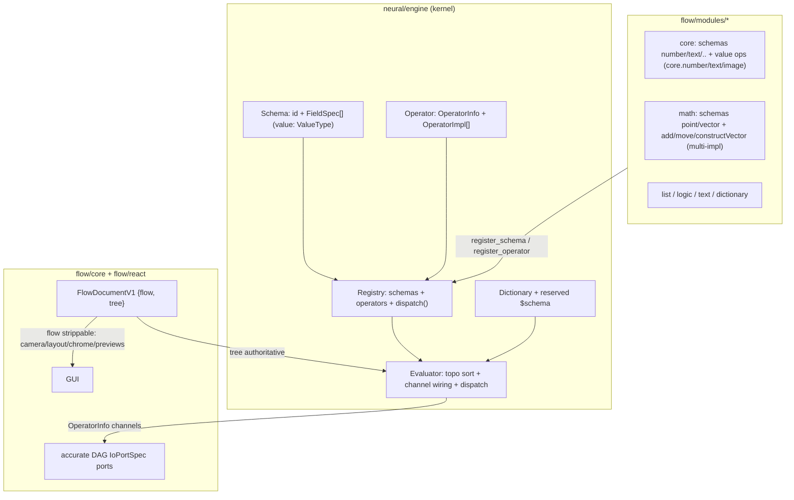

# Neural Schemas And Operators

## Goal

Make `flow` a thin GUI over `neural`, where:

1. Every dictionary carries a reserved `$schema`; schemas declare the fields a dictionary must have (e.g. `point` = x,y,z; `vector` = x,y,z).
2. Neuron kinds become **operators** that dispatch on input `$schema` (`add` works on number/point/vector; `move` works on point/vector).
3. Components expose **accurate named channels** (not generic in/out): `add` has `a`,`b` (+ variadic), `constructVector` has `x`,`y`,`z`.
4. The persisted document is `{"flow":{…},"tree":{neurons,synapses}}` where `tree` is authoritative and `flow` is **shakable** (strip it, the tree still runs).

Reference docs (do NOT edit, they are AGENTS.md): [neural/AGENTS.md](neural/AGENTS.md), [flow/AGENTS.md](flow/AGENTS.md).

## Architecture

## Part A: neural/engine schema + operator core ([neural/engine/lib.rs](neural/engine/lib.rs))

- New `#region Schema`:
  - `const SCHEMA_KEY: &str = "$schema";` Add `Dictionary::schema()`, `Dictionary::with_schema(id)` helpers (still a normal key, `$`-prefixed so it never collides with camelCase keys).
  - `enum ValueType { Boolean, Integer, Decimal, Text, List(Box<ValueType>), Schema(String), Any }` (replaces stringly `value_type`).
  - `struct FieldSpec { key, value: ValueType, default: Option<Value>, label: Option<String> }`.
  - `struct Schema { id, module, name, icon, summary, fields: Vec<FieldSpec> }` + `Schema::validate(&Dictionary)` and `Schema::default_dictionary()` (seeds `$schema` + field defaults).
- Rework `#region NeuronKind` into `#region Operator` (replace, no compatibility shim):
  - `trait Operation: Send + Sync { fn evaluate(&self, input: &Dictionary) -> Result<Dictionary, EvalError>; }` (was `Function`).
  - `struct ChannelSpec { id, schema: ValueType, default: Option<Value>, label: Option<String> }` (replaces `InputSpec` and the `outputs: Vec<String>` strings, giving accurate **input and output** channels). Keep `VariadicSpec`.
  - `struct OperatorInfo { id, module, name, abbreviation, icon, summary, inputs: Vec<ChannelSpec>, outputs: Vec<ChannelSpec>, variadic_input, variadic_output }` (replaces `NeuronKindInfo`).
  - `struct OperatorImpl { schemas: Vec<String>, function: Box<dyn Operation> }` where `schemas` is the accepted input-schema signature (empty = wildcard/fallback).
  - `struct Operator { info: OperatorInfo, implementations: Vec<OperatorImpl> }`.
  - `Registry { schemas: HashMap<String,Schema>, operators: HashMap<String,Operator> }` with `register_schema`, `register_operator`, `schema/operator/operator_info`, `schema_catalogue/operator_catalogue`, and `dispatch(op_id, &Dictionary)` which reads incoming channel `$schema`s and selects the matching `OperatorImpl` (fallback to wildcard), then runs it.
- `#region Evaluator`: rename `kind_infos` -> `operator_infos: HashMap<String,OperatorInfo>`; `collect_neuron_input` and `inject_input_defaults` -> `inject_channel_defaults` work off `ChannelSpec`. Keep the `evaluate_channels_with(..., dispatch: FnMut(&str,&Dictionary))` shape so flow's bridge still drives execution. Outputs always carry `$schema`.
- Extend `#region Tests`: `$schema` round-trip, `Schema::validate`, multi-impl dispatch (number vs point), variadic add.

## Part B: module glue + modules

- [flow/modules/wasm/lib.rs](flow/modules/wasm/lib.rs): `FlowExtensionContributesV1` gains `schemas: Vec<Schema>` and renames `neuron_kinds` -> `operators: Vec<OperatorInfo>`; `build_manifest_json` pulls `registry.operator_catalogue()` + `registry.schema_catalogue()`; `evaluate_json` calls `registry.dispatch(...)` with `inject_channel_defaults`.
- NEW crate `flow/modules/core` (necessary, clean): registers core schemas `number`,`text`,`boolean`,`list`,`dictionary`,`image` and **value operators** `core.number`/`core.text`/`core.image` (read their value from params, emit a `$schema`-tagged dict). These back the input widgets so values live in the tree. Follows the exact `script.ts`/`project.json`/`package.json`/`Cargo.toml`/`wasm_ext` pattern of the other modules. Add to root [Cargo.toml](Cargo.toml) workspace members.
- [flow/modules/math/lib.rs](flow/modules/math/lib.rs): register schemas `point` and `vector` (fields x,y,z decimals). Convert each op to an operator with accurate channels; make `math.add`/`subtract` multi-impl (`["number"]`, `["point"]`, `["vector"]`) + variadic; add `math.constructVector`/`math.constructPoint` (inputs `x`,`y`,`z`, default 0 -> vector/point) and `math.move` (impls `["point"]`,`["vector"]`). Remove the `read_number("a").or_else(read_number("number"))` hacks now that channels are accurate. (Sphere/geometry `move` impls are intentionally out of scope to avoid mixing the `geometry`/`procedural` technology — they would register the same way in that module as a follow-up.)
- [flow/modules/{list,logic,text,dictionary}/lib.rs](flow/modules): register their schema (`list`/`boolean`/`text`/`dictionary`) and convert kinds to operators with accurate channels; keep variadic where present (e.g. `dictionary.merge`, `text.concat`). Update each module's `#region Tests`.

## Part C: flow/core authoritative {flow, tree} ([flow/core/lib.rs](flow/core/lib.rs))

- Replace `FlowFixtureV1` (widgets + synapses) with `FlowDocumentV1 { schema: "flow.document/v1", tree: Tree, flow: FlowGuiV1 }`.
  - `FlowGuiV1 { camera, nodes: BTreeMap<String, FlowNodeGui>, previews: Vec<FlowPreviewGui> }`.
  - `FlowNodeGui { layout: {x,y}, chrome: NodeChrome }` where `NodeChrome = Plain | Slider{min,max,step} | Note | Image`.
  - `FlowPreviewGui { id, source: {neuron, channel}, mode: text|image|video }` — purely GUI, strippable.
- Inputs are now neurons: a slider is a `core.number` neuron (`params.number`) plus `chrome: Slider`; note -> `core.text`; image -> `core.image`. Previews stay GUI-only; actions stay real neurons.
- `build_tree()` becomes `self.document.tree.clone()` (no derivation); delete `build_seeds()` (value operators replace seeds). `evaluate_internal` runs the Evaluator over the stored tree via the bridge.
- `neuron_io_layout` derives ports from `OperatorInfo.inputs/outputs`; DAG `IoPortSpec.value_type` = channel schema id (accurate ports both sides). Update `build_dag_fixture_v1` and `widget_to_dag_node` to read from `tree.neurons` + `flow.nodes`.
- Rename `kind_infos` -> `operator_infos` on `FlowHost`. Update default document, channel-eval JSON, and `#region Tests` including a **shakability test**: strip `flow`, evaluate `tree` alone, assert identical outputs.

## Part D: flow/react ([flow/react/index.tsx](flow/react/index.tsx))

- Mirror new TS types: `FlowDocumentV1 {flow, tree}`, `OperatorInfo`, `ChannelSpec`, `Schema`; catalogue keyed by operators + schemas. Bridge signature unchanged (`(operatorId, inputJson) => json`).
- Render input chrome (slider/note/image) from a neuron's params + `flow.nodes[id].chrome`; render ports from operator channels; render previews from `flow.previews`. Load `@semio-tech/flow-module-core` in `activateDefaults()`. Update `#region Tests`.

## Part E: wiring / infra

- [launch.json](launch.json): register `flow/modules/core` build/test entries following existing module order/grouping/naming.
- Root [Cargo.toml](Cargo.toml): add `flow/modules/core` to workspace members.
- Update any `dag` port consumers if `value_type` semantics change ([mathematical/graph/port/directed/dag/lib.rs](mathematical/graph/port/directed/dag/lib.rs) only if needed — likely no change since it already carries `value_type: Option<String>`).

## Ticket workflow (first execution step)

Read `repo://goals`, then open a new ticket (e.g. "Neural Schemas And Operators") under the most fitting goal (likely `🎯️procedural🎯️floweditor`), or reopen if an existing one matches. All temp logs/scripts go inside the ticket folder; close with a summary + touched files when done.

## Validation

Run via nx/launch.json: `neural/engine` tests, all `flow/modules/*` tests, `flow/core` tests (incl. shakability), and `flow/react` vitest. Manually confirm in the flow play app that `add` shows `a`/`b` ports, `constructVector` shows `x`/`y`/`z`, point+point add produces a `$schema:point` dict, and stripping `flow` from a saved document still evaluates.
