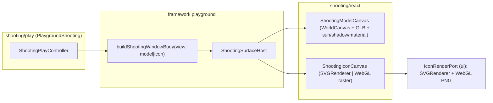

# Shooting Technology Playground

## Concept and data model

A **shooting** is a parametric description that turns a set of 3D assets into a set of icons. A **shot** is one icon at specific pixel dimensions/format. New fixture schema `shooting.fixture/v1`, files `shooting/fixture/*.shooting.json`:

- `assets`: `[{ id, name, url: "/mesh/x.glb", format: "glb" }]` (loader behind an interface so `.3dm`/others can be added later; GLB only now)
- `camera`: `{ position, target, zoom, up?, projection?, fov? }` (extends existing `CameraState` with `fov` so shots are reproducible)
- `savedCameras`: `[{ id, label, camera }]` (save/load named cameras)
- `scene`: `{ background, sun: { azimuth, elevation, intensity, color }, ambient: { intensity, color }, shadow: { enabled, opacity, softness }, material: { override?: { color, metalness, roughness, emissive, ... } } }`
- `shots`: `[{ id, label, width, height, format: "svg" | "png", background?, cameraId? }]`

## Architecture

The **Model** window reuses the proven stack from `puzzle/3d` / `procedural`: `WorldCanvas` + `WorldOrbitCameraViewRig` + `OrbitControls` + `useGLTF` from `@semio-tech/infinite-world-r3f` and `sceneHostPort` (`ui/react`). It adds editable sun (directional light from azimuth/elevation), shadows (`WorldCanvas` already accepts `shadows`), background color, and material override.

The **Icon** window renders the active shot at its pixel size: `svg` shots use three.js `SVGRenderer`; `png` shots use a WebGL render. Both go through a new `IconRenderPort` so three.js stays behind an interface (repo rule).

## Files to create

### `shooting/react` — `@semio-tech/shooting-react`

- `shooting/react/index.tsx`: `ShootingModelCanvas`, `ShootingIconCanvas`, sun/light/material/shadow helpers, GLB asset loader interface, shot-rendering helpers. Mirror structure of [procedural/react/index.tsx](procedural/react/index.tsx).
- `package.json` (deps: `@semio-tech/infinite-world-r3f`, `@semio-tech/ui-react`, `@semio-tech/ui-styling`, `@react-three/fiber`, `@react-three/drei`, `three`), `project.json`, `vitest.config.ts`, `script.ts`, `AGENTS.md`.

### `shooting/play` — `@semio-tech/shooting-play` (mirror [procedural/play](procedural/play))

- `index.ts`: constants, `ShootingPlayController extends Controller` (fixture state, savedCameras, shots, scene settings, toolbar tools, window kinds Model/Icon, `import.meta.glob("../fixture/*.shooting.json")`), `registerShootingPlayDeclarativeBodies()`, `PlaygroundShooting extends Playground`, boot gate `import.meta.env.PUZZLE_PLAY_ENTRY === "shooting"` -> `bootShootingPlay`.
- `index.html`, `globals.css`, `fixture-slugs.ts`, `vite.config.ts` (`playEntryKind: "shooting"`, include GLB `/mesh` middleware via `createPuzzle3dMeshesMiddleware` or a sample asset in `public/mesh`), `vitest.config.ts`, `script.ts`, `project.json` (port `6019`/test `6032`), `package.json`, `AGENTS.md`.

### `shooting/fixture`

- One sample `*.shooting.json` referencing an existing GLB (e.g. a `/mesh/*.glb` from `compose/fixture/kit/folder/...`) with one svg shot and one png shot.

## Files to edit (wiring)

- `framework/product/platform/core/index.ts`: add `"shooting"` to `ComponentKind` + `CANVAS_COMPONENT_KINDS`; add `UiShootingHostSurfaceNode` and `buildShootingWindowBody(surfaceId, controllerId, view, bindingId?)`; extend `UiNode` union + `isCanvasOnlyWindowBody`. (`framework/product/playground/core/index.ts` re-exports it via `export *`.)
- `framework/product/playground/renderer/react/index.tsx`: new `//#region 🔖️ShootingPlayHost` — `registerUiShootingSurfaceHost`, `ShootingSurfaceHost` (delegates to `ShootingModelCanvas`/`ShootingIconCanvas` by `node.view`), `mountShootingPlayChrome`, `bootShootingPlay`; add `shooting` branch in the host-surface renderer switch; import from `@semio-tech/shooting-play` and `@semio-tech/shooting-react`.
- `framework/product/playground/renderer/react/package.json`: add `"./shooting": "./index.tsx"` export + deps `@semio-tech/shooting-play`, `@semio-tech/shooting-react`.
- `ui/react/index.tsx`: extend `sceneHostPort` (or add `iconRenderPort`) wiring three.js `SVGRenderer` (from `three/examples/jsm`) + WebGL PNG readback; declare the `IconRenderPort` interface (interface in `ui/styling`, wiring in `ui/react`) to keep three behind a port.
- `ui/styling/vite-elements-assets.ts`: add `"shooting"` to `PlaygroundRendererPuzzleKind`, `PLAYGROUND_RENDERER_PUZZLE_BOOT_SUBPATHS`, `PLAYGROUND_RENDERER_PUZZLE_HOST_MARKERS`, the strip regex in `playgroundRendererShellEntryPlugin`, and `@semio-tech/shooting-play` / `@semio-tech/shooting-react` resolve aliases.
- `ui/styling/playground-dev-ports.ts`: add `shooting: { dev: 6019, test: 6032, env: "SHOOTING_PLAY_PORT" }` and `"shooting"` to `PlaygroundHostKind`.
- `package.json` (root): add `shooting/react`, `shooting/play` workspaces; `dev:shooting`, `build:shooting` scripts.
- `script.ts` (root): route `segments[0] === "shooting"` to `@semio-tech/shooting-play:dev`.
- `.vscode/launch.json`: add `🛠️dev🔧️shooting` (port 6019) and `📦️build🔧️shooting` entries in each duplicated block, following procedural's group/order.

## Toolbar (per request)

- Import: GLB asset(s), import `.shooting.json`.
- Export: current shot (SVG/PNG), all shots, `.shooting.json`.
- Camera: save camera, load saved camera, reset/named views.
- Scene settings (Model window measures/engagement): background color, sun azimuth/elevation/intensity/color, ambient, shadow toggle/opacity, material override.
- Shots (Icon window): add/select shot, edit width/height/format/background.

## Validation

- `nx run @semio-tech/shooting-play:test` (vitest in `index.ts`/`react`), `nx run @semio-tech/shooting-play:dev` on port 6019, confirm GLB loads, camera save/load, and SVG+PNG export produce files. Confirm runtime via console logs (`[DEBUG]` prefixed) per repo rules.

## Process notes

- Open a repo MCP ticket (`ticket_open`) before implementing; no existing goal cleanly matches a new technology, so associate with the closest release goal and keep all temp/log files inside the ticket folder. New `AGENTS.md` files are created fresh for the new bundles (existing ones are never edited).
