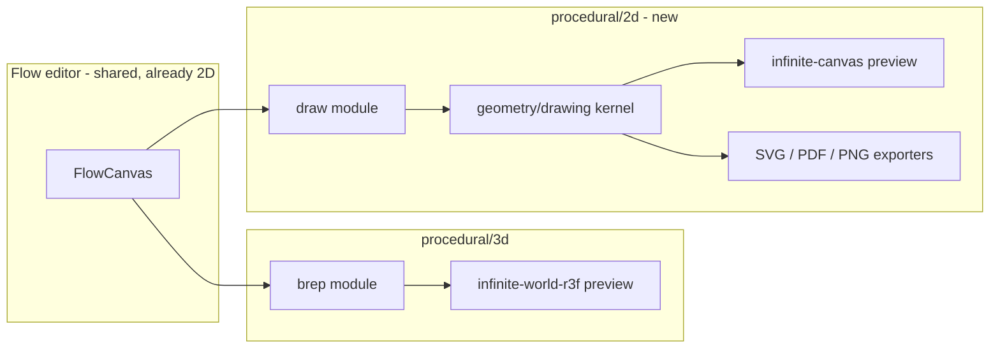

## Goal

Mirror the existing `procedural/3d` editor as a new `procedural/2d` editor whose preview renders on the infinite canvas (`@semio-tech/infinite-canvas-react-renderer`), backed by a new full-featured 2D vector-graphics flow module/kernel (paths/beziers, fills, strokes, gradients, text, layers, clipping, boolean ops), and add SVG/PDF/PNG export.

This is a large epic. It is staged so each stage is independently runnable/testable. Repo rules apply: open one ticket (associate a goal first via `repo://goals`), keep temp files inside the ticket folder, extend existing files with regions, no new script files (only `script.ts`), register all runnable commands in [.vscode/launch.json](.vscode/launch.json), external libs behind interfaces, no migration/back-compat shims.

## Naming defaults (adjust if desired)

- New kernel: `geometry/drawing/` (Rust crate `geometry_drawing`) + JS bridge `@semio-tech/geometry-drawing-js`, emitting `drawing-*` handles (the prefix already reserved in [flow/worker.ts](flow/worker.ts) and `PROCEDURAL_GEOMETRY_REF_PATTERN`).
- New flow module: `flow/module/draw/` (`@semio-tech/flow-module-draw`), module id `draw`, operators `draw.shape.*`, `draw.path.*`, `draw.style.*`, `draw.bool.*`, `draw.xform.*`, `draw.text`, `draw.group`, `draw.gradient.*`, `draw.clip`.
- Packages renamed for a clean parallel split: `@semio-tech/procedural-3d-react` / `-3d-play` (today `@semio-tech/procedural-react` / `-play`), and new `@semio-tech/procedural-2d-react` / `-2d-play`. Optionally a unified `procedural/play` shell later (like `puzzle/5d`).

## Stage 1 — Clean the 2d/3d package split

- Rename existing packages to `@semio-tech/procedural-3d-react` and `@semio-tech/procedural-3d-play` across [procedural/3d/react/package.json](procedural/3d/react/package.json), [procedural/3d/react/project.json](procedural/3d/react/project.json), [procedural/3d/play/package.json](procedural/3d/play/package.json), [procedural/3d/play/project.json](procedural/3d/play/project.json) (also fix the stale `cwd` values `procedural/react`/`procedural/play` → `procedural/3d/react`/`procedural/3d/play`).
- Delete the stale duplicate [procedural/play/index.ts](procedural/play/index.ts) (legacy pre-rename copy of `procedural/3d/play/index.ts`).
- Update all importers of the old names: [procedural/3d/play/index.ts](procedural/3d/play/index.ts), [framework/product/playground/renderer/react/index.tsx](framework/product/playground/renderer/react/index.tsx) (`registerProceduralPlaySurfaceHosts`), and aliases in [ui/styling/vite-elements-assets.ts](ui/styling/vite-elements-assets.ts).
- Add `procedural-2d` (+ rename `procedural` → `procedural-3d`) port kinds in [ui/styling/playground-dev-ports.ts](ui/styling/playground-dev-ports.ts) (e.g. 3d keeps 6018/6031, 2d gets new dev/test ports).

## Stage 2 — 2D vector-graphics kernel (`geometry/drawing`)

Mirror `geometry/brep` (`rs/`, `engine/`, `js/`). Define a `Drawing` scene model and ops:

- Geometry: `Path` (move/line/cubic/quadratic/arc/close), `Rect`, `Ellipse`, `Circle`, `Polygon`, `Text`, `Group`/`Layer`.
- Style: fill (solid + linear/radial gradient), stroke (width/cap/join/dash), opacity, clip paths.
- Transforms: affine matrix (translate/rotate/scale/skew/matrix).
- Boolean path ops (union/difference/intersection/xor) and offset on planar paths.
- Handle scheme: `drawing-*`; a `tessellate`/`render` path for the canvas and a serializable scene for exporters.
- JS bridge `@semio-tech/geometry-drawing-js` exposing a `DrawingWasmBridge` interface (parallels `BrepWasmBridge` in [geometry/brep/js/index.ts](geometry/brep/js/index.ts)) plus a `DrawingScene` transfer type the preview/exporters consume.

## Stage 3 — `draw` flow module (`flow/module/draw`)

- New Rust WASM module mirroring [flow/module/brep/lib.rs](flow/module/brep/lib.rs) using the neural engine + `geometry_drawing`, with grouped operators (Shapes, Paths, Style, Boolean, Transform, Text, Layout, Gradient, Clip).
- Register module id `draw` in `FLOW_MODULE_LOADERS` / `FLOW_DEFAULT_MODULE_IDS` in [flow/react/index.tsx](flow/react/index.tsx) and add wasm aliases in [ui/styling/vite-elements-assets.ts](ui/styling/vite-elements-assets.ts).

## Stage 4 — `procedural/2d/react` (`@semio-tech/procedural-2d-react`)

- New package mirroring [procedural/3d/react/index.tsx](procedural/3d/react/index.tsx): `Procedural2dExtensionHost` activating `draw` (instead of `brep`), and a `Procedural2dPreview` built on `@semio-tech/infinite-canvas-react-renderer` (`GraphWasmCanvas`/`Puzzle2dCanvas` pattern from [puzzle/2d/react/index.tsx](puzzle/2d/react/index.tsx)) rendering the `DrawingScene` with pan/zoom, selection marquee, and channel preview extraction analogous to `extractChannelPreviewItems`.
- Reuse `ProceduralFlowEditor`/`FlowCanvas` for the graph editor (flow is already 2D); only the preview viewport differs.

## Stage 5 — `procedural/2d/play` (`@semio-tech/procedural-2d-play`)

- Mirror [procedural/3d/play/index.ts](procedural/3d/play/index.ts) controller/app, but register the preview body via `buildPuzzle2dWindowBody` (canvas surface) instead of `buildPuzzle3dWindowBody`, and register a `Procedural2dPlayPreviewSurfaceHost` in [framework/product/playground/renderer/react/index.tsx](framework/product/playground/renderer/react/index.tsx) (`registerUiPuzzle2dSurfaceHost`).
- Add `*.procedural2d.json` fixtures under `procedural/2d/fixture/`.

## Stage 6 — Exporters (SVG, PDF, PNG) behind interfaces

- Add export ports (e.g. `DrawingSvgExportPort`, `DrawingPdfExportPort`, `DrawingPngExportPort`) implemented in `@semio-tech/geometry-drawing-js`: SVG = serialize `DrawingScene`; PNG = raster (vello/canvas readback); PDF = SVG→PDF via a thin vendored library kept behind the port (no direct import leaking into app code).
- Add `Export SVG / PDF / PNG` buttons to the 2D play toolbar (extend `buildProceduralPlayToolbarTools` pattern) wired through the host bridge `runHostCommand` for file download.

## Stage 7 — Wiring, launch, tests

- Register all new runnable commands (`@semio-tech/procedural-2d-play:dev/build/test`, kernel/module builds) in [.vscode/launch.json](.vscode/launch.json) following existing grouping/order; ensure cross-platform zero-touch via `script.ts`.
- Extend existing test files (no new test files) in each package; validate kernel ops, module manifest, preview mount on canvas, and exporter output (assert real SVG/PDF/PNG bytes are produced — verify at runtime, do not claim passing without running).
- Close the ticket with summary + touched files.

## Flow

