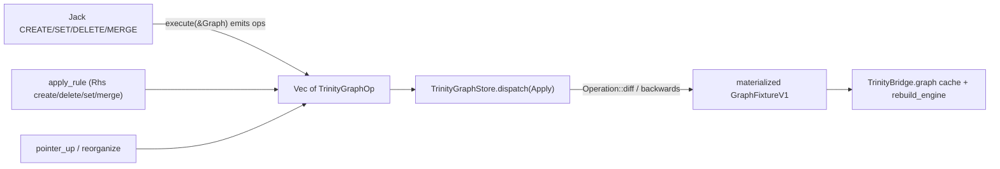

# Route All Trinity Graph Mutations Through One CQRS Gate

## Audit result (repo-wide, as requested)

Every other CQRS-migrated technology already follows the rule correctly:

- [draw/rs/lib.rs](draw/rs/lib.rs) `DrawOp` has 10+ real variants (`InsertLayer`, `RemoveLayer`, ... ) plus one legitimate `SetDocument` escape hatch for full-doc load/undo-baseline — not the only variant.
- [writer/rs/lib.rs](writer/rs/lib.rs) `WriterOp::SetText` is itself the semantic unit for a text document.
- forms/rs, shooting/rs, raster/rs, `framework/product/presentation/rs`, procedural/2d/3d, puzzle/2d/3d/5d, gis/map, `mathematical/graph/port/directed/dag` all implement real `Operation<P>`/`OperationDiff<P>` in Rust; their `*/play/index.ts` controllers wrap the **already-computed** result in one `recordProjectionChange(docStore, [{op:"setDocument", document: next}])` call via the shared TS ledger ([framework/core/vcs-sync.ts](framework/core/vcs-sync.ts)). That's fine — the mutation itself was already named/validated before it reached the ledger.

**Trinity is the sole violator**, and it's exactly the "Jack" case named in the request:

```1225:1250:trinity/jack/core/lib.rs
Clause::Create(pattern) => { apply_create(graph, pattern)?; }
Clause::Delete(vars) => { ... graph.remove_node(&id); ... }
Clause::Set(items) => { ... graph.set_property(EntityRef::Node(node_id.clone()), &item.prop, item.value.clone())?; ... }
```

`execute()` calls `Graph::add_node`/`remove_node`/`set_property`/`add_edge` directly — no `Operation`/`Diff` is ever computed. [trinity/rewrite/engine/lib.rs](trinity/rewrite/engine/lib.rs) `TrinityBridge` does the same for every other mutation path (`sync_positions_from_engine` drag-commit, `apply_force_layout_to_trinity_graph`, `apply_rule`/rewrite rules) — `self.graph.*` is written directly throughout the file; there is not one `store.dispatch(...)` call in it.

Both files _do_ contain VCS scaffolding (`TrinityFixtureOp::SetDocument`, `TrinityGraphOp::SetNodes` — lines 1661-1759 of `trinity/jack/core/lib.rs`, lines 1152-1239 of `trinity/rewrite/engine/lib.rs`), but it's dead code: nothing in `execute()` or `TrinityBridge` ever constructs or dispatches these ops. On top of that, [trinity/jack/play/index.ts](trinity/jack/play/index.ts) and [trinity/rewrite/play/index.ts](trinity/rewrite/play/index.ts) each hand-roll their **own** redundant, disconnected `TrinityFixtureEditOp = { op: "setDocument"; document }` + `applyTrinityFixtureEditOp` + local `DocumentVcsStore`, duplicated verbatim between the two files, instead of using any of the above.

Separately (flagged only, **not** touched by this plan): the shared TS mirror `framework/core/vcs-sync.ts` and the broader "retire the TS mirror once every tech is Rust-backed" migration (`.repo/🎫️/26/06/30/TYPESAFE-RUST-VCS-ENGINE/`) is itself marked `completed` but still used by ~20 `*/play` files — a pre-existing, separately tracked inconsistency, out of scope here.

## Target design for trinity's gate



Manifest-driven validation already exists and is currently only used at load time — reuse it for every op instead of adding a new ad hoc check:

```334:357:trinity/ram/lib.rs
fn validate_trinity_fixture(gm: &GraphManifest, fixture: &GraphFixtureV1) -> Result<(), String> {
    let validator = ManifestValidator::new(gm);
    ...
    validator.validate_node_properties(&node.kind, &node.properties).map_err(manifest_err)?;
```

`PropertyDef.kind` is already `PropertyKind::{Data, Derived}` ([mathematical/graph/manifest/lib.rs:59-112](mathematical/graph/manifest/lib.rs)) — `Derived` properties (like `flatPosition`) must be rejected by any settable op with a clean error; only `Data` properties are settable.

### 1. New semantic `TrinityGraphOp` (replaces the dead `SetNodes`/`SetDocument` stubs)

In [trinity/ram/lib.rs](trinity/ram/lib.rs) (co-located with `Graph`, reused by both `trinity_jack` and `trinity_rewrite_engine`):

- `CreateNode { id, kind, name, x, y, width, height, ports }` — validates `kind` + `ports` against `graph.manifest` (reuse `ManifestValidator::validate_node_kind`/`validate_port_kind`), returns a specific error (e.g. `"unknown node kind 'Piece2'"`) instead of today's silent construction.
- `DeleteNode { id }`, `CreateEdge { id, kind, source, target }`, `DeleteEdge { id }` — same shape as today's `apply_create`/`Clause::Delete`, but as ops.
- `Rename { id, name }` — the universal "set name" action (this is the concrete `Rename` example from the request).
- `Reposition { id, x, y }` — used by drag-commit and `reorganize()`'s force layout instead of writing `entry.x`/`entry.y` directly.
- `SetDataProperty { entity: EntityRef, key, value }` — the **only** property-touching op, but never a blind setter: it looks up the entity's kind in `graph.manifest`, rejects unknown keys and `PropertyKind::Derived` keys with a clean typed error, and checks `value` against the declared `value_type`. This is what Jack's `SET a.prop = value` and rewrite `Rhs.set` compile down to when `prop` isn't `name`/`x`/`y`/`width`/`height`.
- Every variant implements `Operation<GraphFixtureV1>` (`diff`/`backwards`, computed from pre-state, mirroring `DrawOp`'s pattern) and there is one `TrinityGraphDiff: OperationDiff<GraphFixtureV1>` centralized applier. `GraphFixtureV1` (already the exact node/edge/camera/manifest shape) becomes the real projection type `P`, replacing the placeholder `TrinityGraphDocument { nodes: Vec<Value> }` / `TrinityFixtureDocument` stubs, which get deleted.
- `recompute_derived()` is called once by the diff applier after structural changes, not scattered per-clause as today.

### 2. `trinity_jack::execute()` becomes op-emitting, not mutating

[trinity/jack/core/lib.rs](trinity/jack/core/lib.rs): change `execute(graph: &mut Graph, query: &Query)` to `execute(graph: &Graph, query: &Query) -> Result<(QueryResult, Vec<TrinityGraphOp>), String>`. `Match`/`Where`/`Return` stay read-only exactly as today; `Create`/`Delete`/`Set`/`Merge` push the corresponding `TrinityGraphOp` (via the mapping above) instead of calling `graph.add_node`/`remove_node`/`set_property`. `apply_create` becomes `emit_create_ops`. Delete `#region DocumentVcs`'s dead `TrinityFixtureOp`/`TrinityFixtureStore`.

`run`/`run_json` keep their current signatures at the call-site boundary but internally fold the emitted ops into a scratch `Graph` clone for the return value (CLI/LSP callers that don't need VCS, e.g. [trinity/jack/shell/bin.rs](trinity/jack/shell/bin.rs), can keep working against a plain `Graph` this way) while also returning the ops for callers that do need VCS.

### 3. `TrinityBridge` becomes the real gate

[trinity/rewrite/engine/lib.rs](trinity/rewrite/engine/lib.rs): add `store: TrinityGraphStore` field. Add one private `fn dispatch(&mut self, ops: Vec<TrinityGraphOp>)` that does `self.store.dispatch(DocumentVcsCommand::Apply { operations: ops, .. })`, refreshes `self.graph` from `self.store.projection()`, then calls `self.rebuild_engine()`. Replace every direct-mutation call site with this:

- `run_jack`/`run_jack_json`/`run_jack_with_fixture_json` — dispatch the ops `execute()` emits.
- `apply_rewrite_json` — same, for `Rule.rhs` clauses.
- `sync_positions_from_engine` — batch a `Reposition` op per moved node on `pointer_up` (drag-in-progress stays ephemeral/engine-only, matching "controllers may hold UI/ephemeral state"; only the commit on release goes through the gate).
- `reorganize()` — dispatch one `Reposition` per node from the force-layout result instead of writing `entry.x`/`entry.y` in `apply_force_layout_positions_to_trinity_graph`.
- Expose `undo()`/`redo()`/`commit_checkpoint_json()` wasm-bindgen methods backed by `self.store.dispatch(Undo/Redo/CommitCheckpoint)` so the TS side can drop its own fake ledger.

### 4. Delete the duplicated TS shims

[trinity/jack/play/index.ts](trinity/jack/play/index.ts) and [trinity/rewrite/play/index.ts](trinity/rewrite/play/index.ts): remove the local `TrinityFixtureEditOp`/`applyTrinityFixtureEditOp`/local `DocumentVcsStore` (each currently ~5 duplicated lines plus the store field). Route undo/redo/checkpoint UI actions to the new `TrinityBridge.undo()/redo()/commit_checkpoint_json()` WASM methods instead; keep only a thin read-side subscription for re-render.

### 5. Validate

- `cargo test` for `trinity_ram`, `trinity_jack`, `trinity_rewrite_engine`, `trinity_jack_shell` — extend existing tests (`run_create`, `run_set`, `rewrite_rule_labels_core`, `trinity_host_reorganize_moves_nodes`, the two now-obsolete `*_vcs_tests` modules get replaced by real dispatch-based tests) to assert: unknown node/edge kind on `CREATE` errors clearly; `SET` on a `Derived` property (e.g. `flatPosition`) errors clearly; `SET` on an undeclared property errors clearly; undo after a Jack `CREATE`/`DELETE` restores the prior graph via `store.dispatch(Undo)`.
- `nx test` (vitest) for `trinity/jack/play`, `trinity/rewrite/play` after removing the local shim.
- Rebuild trinity WASM; smoke-check `🛠️dev🖥️trinity🃏️jack🎛️play` and `🛠️dev🖥️trinity♻️rewrite🎛️play` dev entries.
- Work happens inside a `.repo/🎫️` ticket (reopen `GENERALIZE-TRINITY-DIRECTED-PORT-GRAPH` or `IMPLEMENT-TRINITY-TECHNOLOGY` if still applicable, else open new) closed with a summary listing every touched file.
