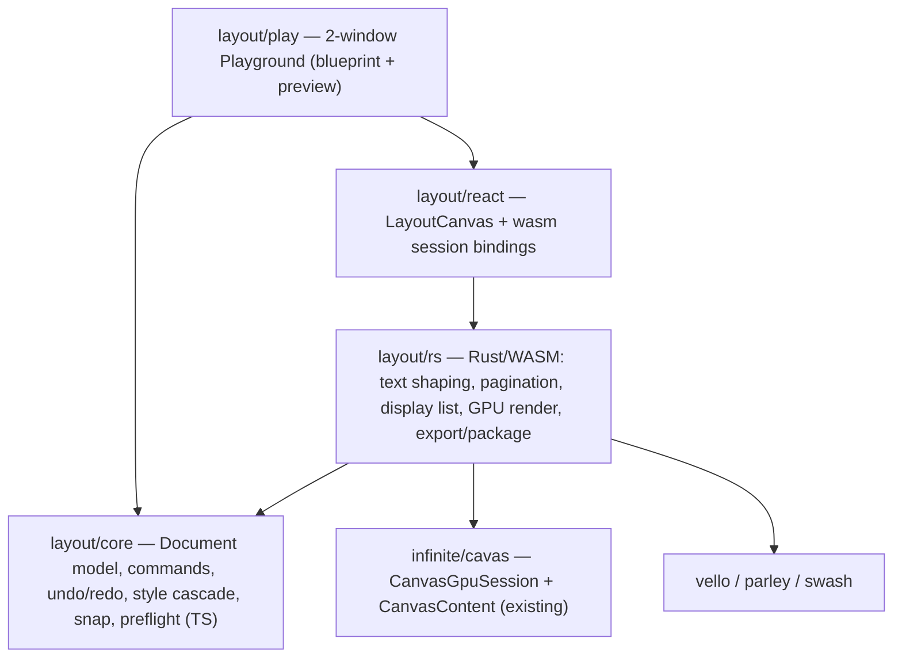
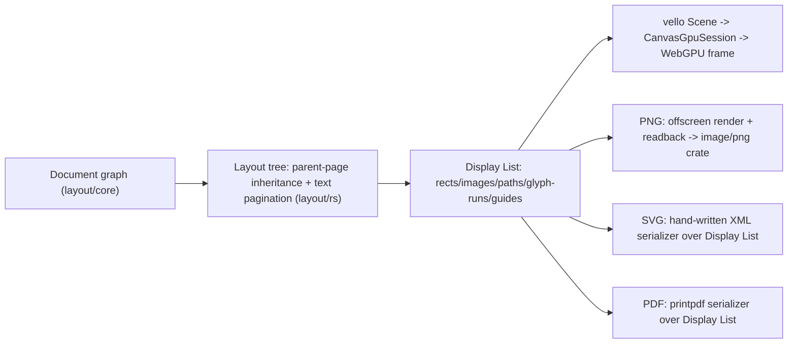

# Layout Technology Playground

## Scope confirmed with dev

- Full MVP (document model, viewport, side panel, parent pages, text threading, styles, linked images, preflight, packaging) in this pass.
- Real text shaping now: integrate Parley (layout) + Swash (shaping/rasterization) with bundled fonts, consistent with the vello stack already used by `puzzle/2d/rs`.

## Architecture

Render pipeline (per spec section 9), implemented as a shared **Display List** IR that feeds both the live GPU canvas and every export target:

## Package/crate layout (new top-level `layout/` technology, mirrors `puzzle/2d` and `sequence` conventions)

- [layout/AGENTS.md](layout/AGENTS.md) — domain doc (Document/Page/Spread/ParentPage/Frame/Story/Style/Link/Preflight vocabulary), same shape as [sequence/AGENTS.md](sequence/AGENTS.md).
- `layout/core/` (`@semio-tech/layout-core`, TS-only, mirrors [draw/core/index.ts](draw/core/index.ts) / sequence-core patterns):
  - Types: `Document`, `Page`, `Spread`, `ParentPage`, `Layer`, `Frame` (bounds/transform), `TextStory`, `TextFrame`, `TextStyleRun`, `ImageLink`, `ParagraphStyle`, `CharacterStyle`, `GridSettings`, `PreflightIssue`.
  - JSON fixture schema `"layout.fixture/v1"` (stable IDs everywhere), serialize/parse helpers like `sequenceFixtureToJson`/`parseSequenceFixtureJson`.
  - Command model: `{ type, objectId, before, after }` shape from the spec, `applyLayoutCommand`/`invertLayoutCommand`, undo/redo stack.
  - Parent-page inheritance resolver: `parent objects -> page objects -> overrides`, inherited objects locked until overridden.
  - Style cascade resolver: `document defaults -> paragraph style -> character style -> local override`.
  - Snap resolver (pure geometry): priority order `selected edges -> margins -> columns -> guides -> baseline grid -> nearby object edges`.
  - Linked-asset state machine: `ok | missing | modified | low_resolution | unsupported`, modeled after the `hash`/`url` field convention in `compose`'s `File` (`compose/client/lib/rs/lib.rs:2738`), extended with dimensions/DPI/color-profile/modified-timestamp — this is new, no existing linked-asset primitive to reuse.
  - Preflight validators (pure functions over resolved Document): overset text, missing/modified asset, low-res image, missing font, empty image frame, out-of-bounds object, text below min size, RGB-in-print. Issue shape follows the `Diagnostic{severity,code,message}` convention from `cad/js/core/index.ts:6001`, extended with `objectId?/pageId?/fixAction?`.
- `layout/rs/` (Rust/WASM crate `layout_rs` -> `@semio-tech/layout-rs`, single crate like `puzzle/2d/rs`, added to root `Cargo.toml` workspace members):
  - Text shaping: `parley::LayoutContext` + `swash`, fonts bundled via `include_bytes!` (no `system` fontique feature — confirmed via research that Parley on wasm32 requires disabling `system` and manual `FontContext`/bundled fonts).
  - Threading: walks `TextFrame` chains (`threadNext`), computes line boxes per frame, overflow -> continues into next frame, else raises overset.
  - Pagination + Display List builder: composites parent+page+overlay layers into a serializable display list (rects/images/paths/glyph runs/guides).
  - GPU render: implements `infinite_cavas::canvas_content::CanvasContent` (`build_scene`/`clear_color`) in two chrome modes — **Blueprint** (adds frame outlines, guides, margins/columns, baseline grid, selection handles, snap indicators) and **Preview** (display-list only, WYSIWYG, no editing chrome) — both driven off the same Display List.
  - Hit testing: point -> object id from the display list, for click/drag/selection routed from the React canvas.
  - Export encoders, all operating on the Display List (in-memory, wasm32-safe, no filesystem):
    - PNG: offscreen render via `CanvasGpuSession` texture readback -> `image`/`png` crate encode (both already in `Cargo.lock`).
    - SVG: hand-written XML serializer walking the display list (kept dependency-free per the "no direct external dependency" rule).
    - PDF: `printpdf` (new dependency, pure-Rust, wasm-safe) walking the display list per page.
  - Packaging: `zip` crate (already declared in `Cargo.lock`/used by `compose`) + `sha2` (already in `Cargo.lock`) build the manifest bundle: `document.json`, `assets/originals/*`, `assets/proxies/*`, `fonts/*`, `preflight-report.json`, `package-manifest.json` (hashes/paths/timestamps/missing files), in-memory via `Cursor<Vec<u8>>`.
  - wasm-bindgen session API mirrors `BoardSession` (`puzzle/2d/rs/lib.rs:154-234`): `attach_canvas`, `set_document_json`, `set_chrome_mode`, `render_frame_gpu`, `hit_test`, `export_png`/`export_svg`/`export_pdf`/`export_package` returning bytes.
- `layout/react/` (`@semio-tech/layout-react`) — `LayoutEngineSession` wasm wrapper + `LayoutCanvas` component (mirrors `GraphWasmCanvas` in `infinite/cavas/react-renderer/index.tsx:37-152`), parameterized by chrome mode (`blueprint`/`preview`), handles resize/DPR/pointer routing.
- `layout/play/` (`@semio-tech/layout-play`) — the playground app, built exactly on the `sequence/play` recipe ([sequence/play/index.ts](sequence/play/index.ts)):
  - `LayoutPlayController extends Controller`: fixtureJson, selection, per-window camera, undo/redo, engagement state.
  - Two `WindowKindRuntime`s — `layout-blueprint` (editable, all commands) and `layout-preview` (readonly WYSIWYG, click-to-jump syncs selection/camera back to blueprint) — laid out via `createDefaultLayout(["layout-blueprint","layout-preview"], "row")`.
  - Side panel tree (`registerSidePanelBody`/tree `UiNode`, per spec section 7): Document / Spreads / Pages / Parent Pages / Layers / Stories / Links / Styles / Preflight, with drag-reorder pages, drag objects between layers, drag styles onto selection, drag parent page onto page/spread.
  - Toolbar/command tools: create page/frame/text-frame/image-frame, transform/align, apply parent page, import linked image, export (PNG/SVG/PDF), package.
  - Options window: context-sensitive fields bound to selection (frame bounds/rotation for objects; font/leading/tracking/alignment/paragraph spacing for text; margins/columns/baseline grid for pages) — same declarative `UiNode` field pattern as `sequence/play`'s inspector.
  - Preflight panel wired to `layout/core` validators; clicking an issue selects the object and re-centers the relevant window's camera.
- `layout/fixture/*.layout.json` + `layout/manifest/*.manifest.json` — a sample multi-page document (parent page + threaded text + linked image + at least one deliberate preflight issue) as default playground content, following `puzzle/2d/fixture` / `puzzle/2d/manifest` conventions.

## Bootstrapping conventions to follow exactly

- Every bundle gets `script.ts` (extending `BundleScript`/`ScriptRouter` from `repo/lib/js`, e.g. wasm-pack build for `layout/rs` per `trinity/ram/script.ts`, vite dev/build/test for `layout/play` per `sequence/play/script.ts`), `project.json` (thin `nx:run-commands` -> `bun ./📜️script.ts <cmd>` only), `package.json` (scoped `@semio-tech/layout-*` names, `bundleKind` metadata).
- Add `layout/rs` to root [Cargo.toml](Cargo.toml) workspace `members`.
- Add one dev entry to [.vscode/launch.json](.vscode/launch.json) for `layout/play`, following the `🛠️dev<emoji-breadcrumb>` naming convention (e.g. `🛠️dev📄️layout`, since `📐️` is already used by `cad`), with a fixed dev port.
- Open a single repo ticket (`.repo/🎫️/YY/MM/DD/...`) for this whole build after reading `repo://goals` to pick the closest goal; keep all scratch/temp files inside that ticket folder; close the ticket with a full summary (files created/updated) when done.
- No test files created separately — all new tests live inline (`if (import.meta.vitest) {...}` blocks in the same TS files, `#[cfg(test)]` in the same Rust files) per workspace rules, mirroring `sequence/play/index.ts:867-894`.

## Sequencing (all in this pass, in dependency order)

1. Bootstrap technology skeleton (`layout/AGENTS.md`, all `script.ts`/`project.json`/`package.json`, Cargo workspace member, `launch.json` entry) — nothing runs yet, just scaffolding.
2. `layout/core` document model: types, fixture JSON schema, commands + undo/redo, parent-page inheritance, style cascade, snap resolver, linked-asset state machine, preflight validators + inline tests.
3. `layout/rs` engine: bundled-font Parley/Swash text shaping + threading/pagination, Display List builder, `CanvasContent` impl for blueprint/preview chrome modes wired to `infinite_cavas`, hit testing.
4. `layout/rs` export/package: PNG (GPU readback), SVG (XML serializer), PDF (`printpdf`), package archive (`zip`+`sha2`).
5. `layout/react` bindings: `LayoutEngineSession`, `LayoutCanvas`.
6. `layout/play` app: controller, 2-window layout, side panel tree, toolbar/options window, preflight panel, export/package commands wired to downloads.
7. Sample fixture/manifest exercising parent pages, threading, styles, linked image, and a deliberate preflight issue.
8. Wire up dev script + launch.json entry, run `nx dev` for `layout/play`, verify blueprint and preview windows both render via WebGPU, verify undo/redo, verify one export path end-to-end (e.g. PNG download) and the preflight panel surfaces the fixture's seeded issue.
