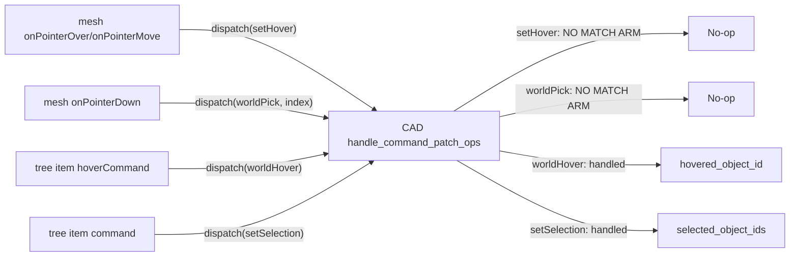

# CAD Interaction Parity Fixes

## Root-cause summary

The shared 3D host component (`framework/renderer/react/components/world-3d-host.tsx`) dispatches a fixed set of commands for hover/pick that other plugins (`puzzle/plugin/rs/d3/mod.rs`) implement but **CAD never does**:



Only the tree-driven commands (`worldHover`, `setSelection`) exist, so hovering/clicking directly on objects in the viewport is a complete no-op, while hovering/selecting via the Document tab works one-way (tree to 3D, not 3D to tree, since `build_document_tree` never reflects live selection/hover back into `selected_ids`/`highlighted_ids`).

## 1. Live command preview - extend to all interactions

[cad/plugin/rs/interaction.rs](cad/plugin/rs/interaction.rs) `preview_display_items` (~line 594) only matches `"primitive.box"` and `"energy.energy.constructExternalWall"`; every other interaction (`is_two_point_height` group: wall/beam/slab/structure-slab/structure-internal-wall, and `is_base_height` group: building/structure column) falls through to `Vec::new()` even though their state machines already track `cornerA`/`cornerB`/`base`/`height` in `session.context`.

Fix: generalize the match using the same `is_two_point_height(id)` / `is_base_height(id)` predicates already used by `apply_event`/`commit_object`, covering their generic state names (`footprint_first` / `footprint_second` / `slab_height` / `ready`, and `column_base` / `column_height` / `ready`) in addition to the energy-specific ones already handled:

```rust
pub fn preview_display_items(session: &CadEngagementScratch) -> Vec<Value> {
    let id = session.interaction_id.as_str();
    match (id, session.state.as_str()) {
        ("primitive.box", "diagonal_rubber" | "first_corner_height" | "ready") => { /* unchanged */ }
        ("energy.energy.constructExternalWall", "two_points_second" | "two_points_height" | "ready") => { /* unchanged */ }
        (id, "footprint_second" | "slab_height" | "ready") if is_two_point_height(id) => {
            // point(cornerA) + segment(cornerA, cornerB) once both exist
        }
        (id, "footprint_first") if is_two_point_height(id) => {
            // point(cornerA) only
        }
        (id, "column_height" | "ready") if is_base_height(id) => {
            // point(base)
        }
        _ => Vec::new(),
    }
}
```

Extend the existing `preview_display_items`/interaction tests in `cad/plugin/rs/interaction.rs` to cover a slab (`is_two_point_height`) and a column (`is_base_height`) session, not just the box.

## 2. World references not showing

Two independent bugs:

**a) Reference image 404s in the dev server.** [ui/styling/vite-elements-assets.ts](ui/styling/vite-elements-assets.ts) defines `cadFixtureVitePlugin` (serves `cad/fixture/`_ at `/cad-fixture/_`), but [framework/product/os/dev/js/vite.config.ts](framework/product/os/dev/js/vite.config.ts) (the config actually used by `bun run dev:cad`) never imports or spreads it into its `plugins`array - only`uiAssetsVitePlugin`/`puzzle3dMeshesVitePlugin`are included.`CAD_CONCRETE_FOREST_REFERENCE_URL` (`/cad-fixture/concrete-forest-reference.png`) therefore 404s, so the reference plane has no texture. Fix: import `cadFixtureVitePlugin`and add`...cadFixtureVitePlugin(repoRoot)` to the plugins array.

**b) References are non-interactive even when they load.** The shared `WorldReferenceLayer` (`infinite/world/r3f/index.tsx`) fully supports `selectedIds`, `hoveredId`, `onSelect`, `onHover`, `opacity` - but [world-3d-host.tsx](framework/renderer/react/components/world-3d-host.tsx) (~line 1740) only passes `references`, dropping `opacity` (not even in the `WorldReferenceRecord` type) and never wiring hover/select. CAD already has working handlers for this (`referenceHover` at `cad/plugin/rs/lib.rs:2541`, `setReferenceSelection` at `lib.rs:2528`) but nothing in the 3D view calls them.

Fix:

- Add `opacity?: number` to `WorldReferenceRecord` and pass it through in the `references.map(...)` at `world-3d-host.tsx:1743`.
- Add `onSelect`/`onHover` callbacks dispatching `setReferenceSelection` (`{ pane: paneSuffixFromSurfaceId(node.surfaceId), referenceId: id }`) and `referenceHover` (`{ referenceId: id }` / no args to clear).
- Change `setReferenceSelection`'s handler (`lib.rs:2528`) to resolve model-definition-id from `pane` (consistent with other commands) instead of expecting a raw `modelDefinitionId` from the client.
- On selection, push a `"reference:{id}"` sentinel into `selected_object_ids` (mirroring the existing `"reference:{id}"` hover convention at `lib.rs:2545`) so the 3D view can derive `selectedIds`/`hoveredId` for `WorldReferenceLayer` by filtering `selection.ids`/a new `selection.hoveredId` field for the `"reference:"` prefix. Add `hoveredId` to the parsed `WorldSelectionRecord` type (currently the JSON key exists in `world3d_selection_json` output but is never parsed).

## 3. Viewport hover is a no-op

[cad/plugin/rs/lib.rs](cad/plugin/rs/lib.rs) has no `"setHover"` match arm in `handle_command_patch_ops`, only `"worldHover"` (tree-driven, keyed by `id`). The shared host's `handleInstancePointerMove` (`world-3d-host.tsx:1383`) dispatches `setHover` with `{ objectId, mode, id }` on every mesh pointer move/out. Add a `"setHover"` handler mirroring `puzzle/plugin/rs/d3/mod.rs:1239-1248`, setting `hovered_object_id` from `objectId` (CAD has no per-component face/edge/vertex model, so `mode`/`id` are ignored - object-level hover is sufficient, and this already drives the correct instance tint since `world_instances_json` (`lib.rs:957`) already computes `"hovered"` from `hovered_object_id`).

## 4. Viewport selection + bidirectional Document tab sync

**a) Clicking an object in the viewport does nothing.** `handleInstancePointerDown` (`world-3d-host.tsx:1368`) dispatches `worldSelect` only for non-mesh selection modes; for the default `"mesh"`/`"object"` mode (CAD's only mode) it dispatches `worldPick` with the **instance array index**, not an id. CAD has no `"worldPick"` handler at all (only `"worldSelect"`, id-based, used by marquee). Add a `"worldPick"` handler (pattern from `puzzle/plugin/rs/d3/mod.rs:1250-1288`): resolve `pane` from `args.surfaceId` (same as `worldPointerDown`), look up the object via `cad_pane_objects(&envelope.document, pane).iter().filter(|o| o.visible).nth(index)` (matching the exact filter/order `world_instances_json` used to build the index), then merge its id into `selected_object_ids` per the `merge` arg (`replace`/`add`/`toggle`, reuse `merge_world_selection_ids`).

**b) Selecting in the viewport never highlights the Document tree row (no 3D-to-tree sync).** `build_document_tree` (`lib.rs:~1354`) always sets `selected_ids: None`, and `highlighted_ids` hardcodes the `"shape"` pane suffix regardless of which pane the hovered object actually belongs to:

```1354:1362:cad/plugin/rs/lib.rs
    UiNode::Tree(UiTreeNode {
        sections,
        selected_ids: None,
        highlighted_ids: envelope.runtime.hovered_object_id.as_ref()
            .map(|id| vec![format!("cad-object:shape:{id}")]),
        selection_change: None,
    })
```

Fix: use `cad_all_objects`/`cad_find_object_pane` to resolve each selected/hovered object's actual pane and build correct `cad-object:{pane_suffix}:{id}` keys for both `selected_ids` (from `selected_object_ids`) and `highlighted_ids` (from `hovered_object_id`), for all 4 panes, not just Shape.

## 5. Primitive-level tree selection is non-functional

`"setPrimitiveSelection"` (`lib.rs:2694`) discards `primitiveId`/`kind` and just reselects the parent object - `CadPlayRuntime` has no field to hold a selected primitive. Add `selected_primitive_id: Option<String>` (and `kind`) to `CadPlayRuntime`, store it in the handler, and surface it in `build_properties_panel` so selecting a primitive child row shows primitive-specific inspector fields instead of silently acting like an object click.

## 6. Load ("loadRawRequest") is unwired for the React renderer

`loadRawRequest` (`lib.rs:2492`) emits a `{ "op": "requestFileOpen", "accept": ..., "importCommand": "importSpatialJson" }` effect for the host renderer to fulfill. The wgpu native renderer handles this (`framework/renderer/wgpu/rs/lib.rs:8330`), but [framework/renderer/react/os-shell.tsx](framework/renderer/react/os-shell.tsx) - the renderer actually serving `bun run dev:cad` - has no handling for this op at all in its op-processing loop (~line 1130-1150, alongside the existing `downloadMediaExport` handling).

Fix: add a browser-native file-open helper (hidden `<input type="file">` + `file.text()`, same tier of complexity as the existing `downloadMediaExport` anchor-download helper) and a case in the op loop that calls it, then re-dispatches `handleCommand` with `op.importCommand` and the file contents as args.

_(Not in scope: the wasm32 `wgpu` native renderer's `request_file_open` stub at `framework/renderer/wgpu/rs/lib.rs:12946` still returns `None` - that's a different renderer target not used by the current CAD dev workflow; flagging for a follow-up ticket rather than bundling a second, differently-shaped async file-picker implementation here.)_

## 7. Model transformations ignore live pane data for the forest example

`apply_transformation_to_envelope` (`lib.rs:627-689`) has a special case: when `active_example_id` is the forest example, it substitutes pre-baked static fixture objects for the target pane instead of deriving from the _current_ source-pane objects via `run_derive_from_geometry`/`from_building`/`classic`. This means running a transfer on the flagship demo silently discards any live edits. Fix: remove the forest-example bypass so `applyTransformation` always calls the real derive functions using the live source pane, for every example. Extend `derive_transformation_populates_energy_pane` (or add a sibling test) to assert this against the forest example specifically (edit a Shape object, run `from_geometry`, assert the Energy pane reflects the edit rather than the static fixture).

_(Not in scope: there is no Shape-to-Building transformation spec at all (`CAD_TRANSFORMATION_SPECS` only has `from_geometry`/`from_building`/`classic`), and adding one requires new geometric-classification design work comparable to `run_derive_from_geometry`. Recommend a dedicated follow-up ticket rather than speculative kernel work bundled here.)_

## 8. Multi-selection inspector polish

`object_inspector_group`/`ui_inspector_mixed_*` (`framework/core/rs/lib.rs`) already merges values across a multi-object selection correctly (this item was in fact complete, contrary to the plan's premise) - only real gaps: no rotation/orientation field in the inspector (`object_patch_from_field`, `lib.rs:1961-1994`, has no `"rotation"` case), and no test asserts mixed-vs-uniform behavior across an actual multi-object selection. Add the rotation field and extend the existing inspector test(s) with a genuine 2-object mixed-selection case.

## Files touched

- [cad/plugin/rs/interaction.rs](cad/plugin/rs/interaction.rs) - generalize `preview_display_items`, extend tests
- [cad/plugin/rs/lib.rs](cad/plugin/rs/lib.rs) - `setHover`, `worldPick`, `setReferenceSelection` pane fix, `setPrimitiveSelection` fix, `build_document_tree` selected/highlighted ids, remove forest-example transformation bypass, rotation inspector field
- [framework/renderer/react/components/world-3d-host.tsx](framework/renderer/react/components/world-3d-host.tsx) - `WorldReferenceRecord.opacity`, `hoveredId` on selection type, reference layer hover/select wiring
- [framework/renderer/react/os-shell.tsx](framework/renderer/react/os-shell.tsx) - `requestFileOpen` op handling
- [framework/product/os/dev/js/vite.config.ts](framework/product/os/dev/js/vite.config.ts) - register `cadFixtureVitePlugin`
- [framework/core/rs/lib.rs](framework/core/rs/lib.rs) - rotation field on inspector patch (if not already generic)

## Verification

- `cargo test -p cad-plugin` (wasm target build) covering new/extended tests for preview generalization, transformation bypass removal, primitive selection.
- Rebuild CAD wasm plugin, restart `bun run dev:cad`.
- Manual: load forest example, confirm reference image renders in all 4 panes; hover an object in viewport (tint changes) and confirm Document tree row highlights; click an object in viewport and confirm Document tree row selects (and vice versa); run each construct tool (Box, Wall, Slab, Column, External Wall) and confirm a live preview outline follows the cursor at every step; run "Load" toolbar action and confirm a native file picker opens and re-imports; run a transfer (e.g. "-> From Geometry") after editing a Shape object on the forest example and confirm the target pane reflects the edit.
- Continue working inside ticket `26/07/06/CAD-WGPU-PREMIGRATION-PARITY` (reopen via `ticket_reopen`).
