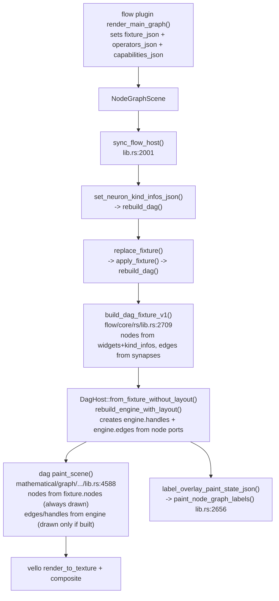

## Context

The wgpu renderer was consolidated today from many files (`engine_canvas.rs`, `scenes.rs`, `interpreter.rs`, etc.) into a single [framework/renderer/wgpu/rs/lib.rs](framework/renderer/wgpu/rs/lib.rs) (12.7k lines, `pub mod engine_canvas { ... }` at line 1833). A prior session already diagnosed and landed fixes for this exact symptom under ticket `.repo/🎫️/26/07/06/FLOW-WGPU-RICH-RENDERING-PARITY` (still **open**, plan `restore_flow_wgpu_rendering_parity_6d0f4468.plan.md`):

- Canvas theme (`set_canvas_theme_dark`) now pushed unconditionally every frame (`sync_canvas_theme_dark` at line 1945 always calls it, no diff-gate).
- Operators (`operators_json`) synced before `fixture_json` in `sync_flow_host` (line 2001).
- `proximityDistance` wired from `lod_json`.
- Selection marquee/bounds overlay added (`paint_node_graph_overlays`).

Despite this, the user's screenshot shows only bare outlined rectangles — **no edges, no port handles/channels, no LOD content, no text labels at all**. Static tracing of the pipeline shows it _should_ work:

Node rectangles are drawn straight from `self.fixture.nodes` (dag fixture), independent of the internal `self.engine`, which is why they always show. Edges/handles come from `self.engine.edges`/`snap.handles`, which are only populated if `rebuild_engine_with_layout` (`mathematical/graph/port/directed/dag/rs/lib.rs:2744`) successfully creates ports — and neuron port creation depends on `kind_infos` lookups (`widget_to_dag_node`, `flow/core/rs/lib.rs:891`+). Labels depend on a separate `label_overlay_paint_state_json()` call feeding `paint_node_graph_labels`.

Since the code reads correctly on paper, per repo rules ("must confirm runtime behaviour with console logs, not assume"), the only way to find the real break is a **live rebuild + instrumented trace** — likely candidates, in priority order:

1. **Stale WASM build**: heavy concurrent same-file editing today (`Cargo lock contention` noted in the prior plan) means the currently-served wasm may predate the theme/operator fixes already in source. Must force a clean rebuild first.
2. **kind_infos never reaching neuron ports**: if `operators_json` round-trip (`flow_neuron_kind_infos_json()` -> `set_neuron_kind_infos_json()`) silently fails or IDs mismatch, neuron nodes get zero inputs/outputs -> zero handles -> zero edges (since edge creation requires both endpoint handles to exist in `handle_map`), matching "no channels, no edges" exactly while node bodies still render.
3. **Label overlay silently producing empty rows or invisible glyphs**: `paint_node_graph_labels` is wired into `render_node_graph` (line 5629) but if `label_overlay_paint_state_json()` returns empty `labels`, or `paint_label_overlay_row` (line 2594) computes zero-alpha/off-canvas text, nothing shows even though "wired".
4. **Wrong example fixture loaded**: confirm the actual fixture rendered matches an example with synapses (e.g. [flow/example/default.flow.json](flow/example/default.flow.json)) rather than a variant with disconnected nodes only.

## Fix plan

1. **Reopen** ticket `.repo/🎫️/26/07/06/FLOW-WGPU-RICH-RENDERING-PARITY` (covers this exact regression; do not open a new one).
2. **Force-clean rebuild**: rebuild the `flow` plugin wasm and the wgpu renderer wasm/trunk bundle from scratch (clear cached dist output first) to rule out a stale build serving pre-fix code.
3. **Instrument with `[DEBUG]` logs** (temporary, removed once root cause is fixed) at each stage to print counts instead of guessing:

- `flow/core/rs/lib.rs`: in `rebuild_dag()`/`apply_fixture`, log `kind_infos.len()`, `fixture.widgets.len()`, `fixture.synapses.len()`, and the resulting `dag.fixture.nodes.len()`/`dag.fixture.edges.len()` from `build_dag_fixture_v1()`.
- `mathematical/graph/port/directed/dag/rs/lib.rs`: in `rebuild_engine_with_layout()`, log `engine.handles.len()` and `engine.edges.len()` after construction.
- `framework/renderer/wgpu/rs/lib.rs`: in `paint_node_graph_labels()`, log `labels.len()` from the parsed state JSON.

4. **Boot live** (`SEMIO_RENDERER=wgpu SEMIO_PLUGIN=flow`) via the browser tool, capture console output and a screenshot at default zoom, and read the `[DEBUG]` counts to pinpoint exactly which stage first drops to zero (or find everything is non-zero, pointing to a pure paint/color/geometry bug instead).
5. **Apply the targeted fix** based on the trace (e.g., correct a kind_infos ID mismatch, fix a dropped/renamed JSON field, fix an invisible-color or off-screen-position bug in the label overlay, or confirm+fix a stale-build packaging issue).
6. **Remove the `[DEBUG]` instrumentation** once the root cause is confirmed fixed.
7. **Extend existing test modules** (no new test files) with regression coverage for the fixed behavior:

- `flow/core/rs/lib.rs` test module: assert a fixture with synapses produces non-empty `dag.fixture.edges` and correct neuron port counts after `set_neuron_kind_infos_json` + `replace_fixture`.
- `mathematical/graph/port/directed/dag/rs/lib.rs` test module: assert `paint_scene` on a populated fixture produces non-zero edge/handle path counts (extend the existing dark-theme paint test if present).

8. **Rebuild and re-verify visually**: screenshot the flow playground (default zoom, zoomed-in LOD, one node selected) and one other DAG-based playground under wgpu (to confirm no shared-engine regression), confirming edges, port handles, labels, and LOD content all match expectations.
9. **Close the ticket** with a summary and the full list of files touched (created/updated/removed), and update `ticket.json`'s plan pointer to reference the new plan produced here instead of the stale `restore_flow_wgpu_rendering_parity_6d0f4468.plan.md`.

## Key files

- [framework/renderer/wgpu/rs/lib.rs](framework/renderer/wgpu/rs/lib.rs) — `pub mod engine_canvas` (`sync_flow_host`, `paint_node_graph`, `paint_node_graph_labels`, `paint_label_overlay_row`, `theme_is_dark`).
- [flow/core/rs/lib.rs](flow/core/rs/lib.rs) — `FlowHost::apply_fixture`/`rebuild_dag`, `set_neuron_kind_infos_json`, `build_dag_fixture_v1`, `widget_to_dag_node`.
- [mathematical/graph/port/directed/dag/rs/lib.rs](mathematical/graph/port/directed/dag/rs/lib.rs) — `rebuild_engine_with_layout`, `paint_scene`, `label_overlay_paint_state_json`.
- [flow/plugin/rs/lib.rs](flow/plugin/rs/lib.rs) — `render_main_graph` (`NodeGraphScene` field population).
- [flow/example/default.flow.json](flow/example/default.flow.json) — reference fixture with synapses for verification.
