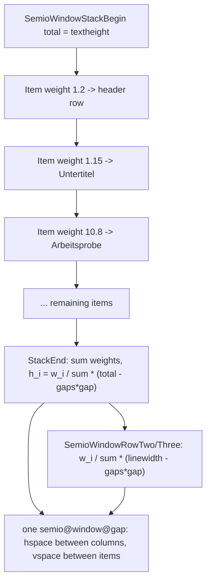

# Weighted Window Layout Spacing

## Root cause (confirmed by reading the source)

`\makecoverpages` in [print/tex/semio-components.sty](print/tex/semio-components.sty) (lines 52-172) currently mixes **three different, uncoordinated spacing mechanisms**:

1. **Horizontal gutter between columns in a row** — `\semio@window@row@gutter`, hardcoded to `\semio@spacing@single` (`0.2em`), used via `\hspace` in `[SemioWindowRowTwo/Three(Fixed)](print/tex/semio-window.sty:1932-2041)`.
2. **Vertical gap between two stacked _standalone_ `Window`s** — `\semio_block_sep_after:` ([print/tex/semio-window.sty:256-265](print/tex/semio-window.sty)) emits `\vskip\semio@block@sep@skip`, which `\makecoverpages` overrides to a flat `4pt` (line 57). But this only fires when `\l_semio_window_row_bool` is false.
3. **Vertical gap between two `SemioWindowRow*Fixed` blocks (or any `Window[..., row]` used standalone)** — because `row` is set, mechanism #2 is _skipped entirely_ (`\bool_if:NF \l_semio_window_row_bool`), so the gap between e.g. the "Zukunft Bau/Titel" row and the "Untertitel" window below it is whatever `\parskip`/`\baselineskip` happens to be at that point — an uncontrolled, font-size-dependent value, not a design token at all.

On top of that, every row height on the cover is a hand-tuned absolute literal (`1.2cm`, `1.15cm`, `10.8cm`, `1.05cm`, `2.75cm`, `5.8cm`, passed to `SemioWindowRow*Fixed`), so nothing is guaranteed to sum to the actual available page height, and columns inside a row are always a forced 50/50 or 33/33/33 split with no way to express intentional asymmetry.

This is exactly what the user sees: horizontal spacing (#1, ~2pt) ≠ vertical spacing (#2, 4pt) ≠ the uncontrolled spacing between rows (#3, ~12pt+), and row/column sizes are absolute rather than proportional.

## Design

Introduce one canonical gap and a weight-normalization convention, used identically on both axes:

- `**\semio@window@gap**` (new `\newlength` in [print/tex/semio-window.sty](print/tex/semio-window.sty)): the single source of truth for spacing between windows/rows/columns, default `\semio@spacing@single`. Replaces `\semio@window@row@gutter` (removed) and the cover's ad hoc `\semio@block@sep@skip` override (cover now does `\setlength{\semio@window@gap}{4pt}` once, scoped to the `titlepage` group, and that one value drives every gap on the page — horizontal and vertical).
- **Weight-normalized columns**: rewrite `\SemioWindowRowTwo`/`\SemioWindowRowThree` to take a weight per column — `\SemioWindowRowTwo{w1}{c1}{w2}{c2}` / `\SemioWindowRowThree{w1}{c1}{w2}{c2}{w3}{c3}` — column width `i` = `w_i / Σw × (\linewidth − (n−1)·\semio@window@gap)`, computed with expl3 `dim`/`fp` arithmetic (natively supports decimal weights, so `1`, `1.2`, `0.82`, etc. all work). Equal-weight rows (today's only look) just pass `1` for every column. The `*Fixed` absolute-height variants are removed — height is always supplied externally via the existing `\semio@window@row@body@h@set` hook (see below), never a literal.
- **Weight-normalized vertical stack**: new `WindowStack` region in the same file — a collector triplet:
  - `\SemioWindowStackBegin{<total height>}` (cover passes `\textheight`, the real available height inside its `\newgeometry`, not a guessed number) — resets an expl3 seq of `(weight, content)` pairs.
  - `\SemioWindowStackItem{<weight>}{<content>}` — appends one item (content is typically a `Window` or a `SemioWindowRow*` call).
  - `\SemioWindowStackEnd` — sums the weights, then for each item: computes `h_i = w_i/Σw × (total − (count−1)·\semio@window@gap)`, calls `\semio@window@row@body@h@set{h_i}` (already exists, currently used ad hoc), typesets the stored content, resets, and emits an explicit `\vspace{\semio@window@gap}` between items (never after the last) — a real, exact skip instead of relying on `\par`/`\baselineskip`. This directly fixes mechanism #3 above.

Net effect: every row's height and every column's width become a _proportion_ of real, known available space, weights close to today's cm numbers reproduce the same visual proportions, and conditional/optional rows (Beschreibung, DOI, institution row, meta row) simply drop out of the weight sum — remaining rows proportionally fill the freed space instead of leaving dead space or overflowing.

## Changes

### [print/tex/semio-window.sty](print/tex/semio-window.sty)

- Add `\newlength{\semio@window@gap}` set to `\semio@spacing@single`; remove `\semio@window@row@gutter`.
- Rewrite `\SemioWindowRowTwo`/`\SemioWindowRowThree` (region `WindowRow`, ~line 1932) to take weight+content pairs, use `\semio@window@gap`, and drop `\SemioWindowRowTwoFixed`/`\SemioWindowRowThreeFixed` (their absolute-height argument goes away — height now always comes from `\semio@window@row@body@h@set`, which callers set before invoking the row, exactly as the Stack does).
- Add new region `WindowStack` implementing `\SemioWindowStackBegin`/`\SemioWindowStackItem`/`\SemioWindowStackEnd` as described above, using expl3 `seq`/`fp`/`dim` for weight collection and normalization.

### [print/tex/semio-components.sty](print/tex/semio-components.sty)

- In `\makecoverpages` (lines 52-172): replace `\setlength{\semio@block@sep@skip}{4pt}` with `\setlength{\semio@window@gap}{4pt}`.
- Wrap the whole conditional row sequence (header row, Untertitel, Arbeitsprobe, meta row, DOI, Beschreibung, institution row, logo row) in `\SemioWindowStackBegin{\textheight} ... \SemioWindowStackEnd`, converting every existing literal cm height into a weight of the same numeric value (`1.2`, `1.15`, `10.8`, `1.05`, `2.75`, `5.8`) passed to `\SemioWindowStackItem`, so relative proportions look the same but are now guaranteed to exactly fill `\textheight` with uniform gaps. Optional rows keep their existing `\bool_if:NT`/`\tl_if_empty:NF` guards — simply skip the corresponding `\SemioWindowStackItem` call when the content is absent.
- Update the header row / meta row / institution row / logo row calls to the new `SemioWindowRowTwo`/`SemioWindowRowThree` weighted signature with equal weights (`1`/`1`/`1`), preserving today's visual column split.

## Verification

- Rebuild `mit-bestand/bericht/zwischenbericht` (light + dark) via `bun ./📜️script.ts test` (nx `print:test`), rasterize page 1 for both.
- Confirm visually and by pixel-measuring (reuse the approach from `measure-spacing.ts` in the `PRINT-UNIFORM-BLOCK-SPACING` ticket) that the horizontal gutter and every vertical gap between rows/windows on the cover are now the same pixel width, and that the stack still exactly fills the page without overflow.
- Confirm the 3-logo row and other unaffected rows still render identically (same equal-weight columns, same `anchor=center`, same stretch-to-tallest behavior added by the `PRINT-WINDOW-ROW-COLUMN-BORDER-ALIGNMENT` ticket).

## Ticket

Per repo conventions: check `repo://goals`/`repo://tickets` for freshness, then open a new ticket (the related `PRINT-WINDOW-ROW-COLUMN-BORDER-ALIGNMENT` and `PRINT-WINDOW-COMPOSABILITY` tickets are already closed) under goal `🎯️r2602🎯️updateddocs`, e.g. slug `PRINT-WINDOW-WEIGHTED-SPACING`. Keep all temp verification files/rasters inside that ticket folder, close it with a summary listing every file touched.
