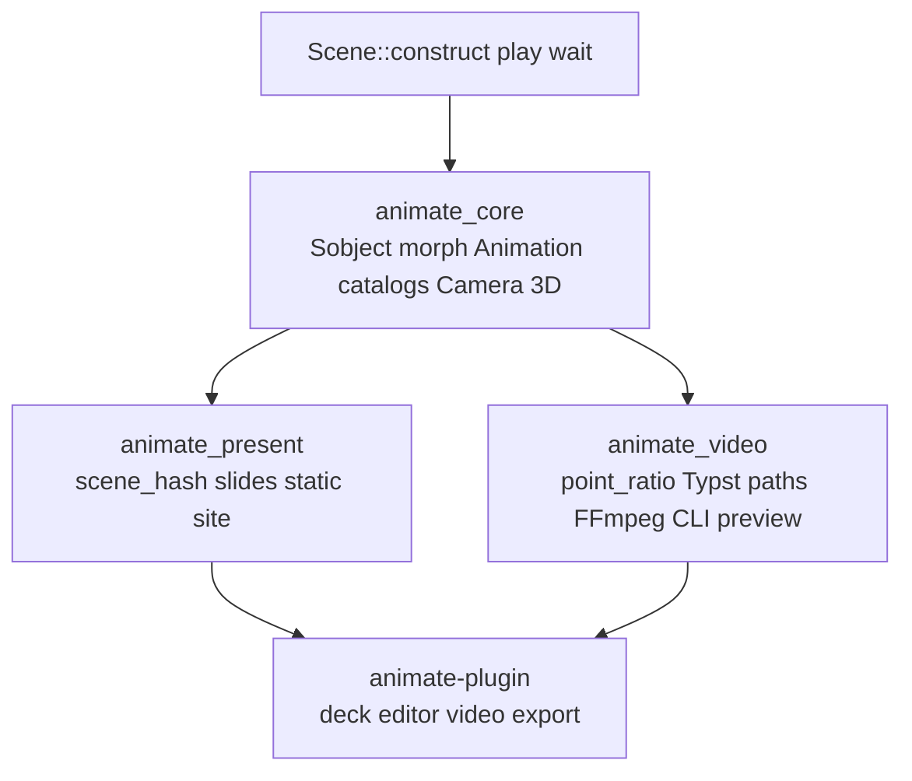

# Animate Absolute Manim Feature Completeness

## Reality check

The closed ticket left a **scaffold**. Checklist overstates catalog parity: **21 animations** in `[animate/core/rs/src/animations_catalog.rs](animate/core/rs/src/animations_catalog.rs)` are `catalog_stub!` no-ops. Text renders a placeholder rect (`[text.rs` `svg_to_vobject](animate/core/rs/src/text.rs)`). `Create`/`Write` set `point_ratio` but the Vello painter ignores it. Present and `animate_core` scenes are disconnected.

Goal `[ANIMATE](.repo/🎯️/ANIMATE/goal.json)` already exists. **Reopen** ticket `26/07/18/ANIMATE-TECHNOLOGY-FULL-MANIM-PARITY` (same task). Rewrite the ticket feature checklist from code truth (mark stubs as open).

## Execution rule (cargo)

Always use isolated target — never block on the shared lock:

```bash
CARGO_TARGET_DIR=.repo/🎫️/26/07/18/ANIMATE-TECHNOLOGY-FULL-MANIM-PARITY/target \
  cargo test -p animate_core -p animate_video -p animate_present -p animate-plugin
```

Proceed with edits while tests run in that dir. Do not wait for other agents' cargo.

## Architecture (target end state)




## Phase 0 — Ticket + honest checklist

- `ticket_reopen` on `26/07/18/ANIMATE-TECHNOLOGY-FULL-MANIM-PARITY`
- Replace checklist with leaf-level Manim CE tree (Semio names); mark stubs/`svg_to_vobject`/point_ratio as open

## Phase 1 — Render truth (blockers)

1. `**point_ratio` in painter** — `[animate/video/rs/renderer.rs](animate/video/rs/renderer.rs)`: trim/stroke paths by ratio when painting (unlocks Create/Write/Uncreate).
2. **Typst → BezPath** — replace placeholder in `[text.rs](animate/core/rs/src/text.rs)` with SVG path parse (reuse patterns from puzzle/cavas if present; else kurbo/usvg).
3. **Frame hash correctness** — include transform/opacity/path content (not just id/counts) so static cache cannot skip motion.

## Phase 2 — Morph foundation + catalog behavior

1. **Pointwise morph** — `[sobject.rs](animate/core/rs/src/sobject.rs)`: align unlike path topologies; interpolate control points; use in `Transform` / `TransformMatchingShapes`.
2. **Delete `catalog_stub!`** — implement every stub with real `apply` (start with ReplacementTransform, FadeTransform, MoveToTarget, Restore, DrawBorderThenFill, Flash, Circumscribe, Grow*/Shrink/Spin, Wiggle/ApplyWave/Broadcast, Homotopy, ShowPassingFlash, SpiralIn, CyclicReplace/Swap, ChangeDecimalToValue).
3. **Missing Manim animations** (extend existing files only): text letter/word reveal, ApplyMethod/ApplyFunction/ApplyMatrix, GrowArrow/GrowFromEdge, FocusOn/Blink, UpdateFromFunc, TracedPath, ChangeSpeed, TransformMatchingTex.
4. **Scene lifecycle** — `[scene.rs](animate/core/rs/src/scene.rs)`: honor `is_introducer`/`is_remover`; wire `begin_section`/`skip_animations`; fix `AnimateBuilder::shift` and `AnimationGroup::with_lag_ratio`.

## Phase 3 — Mobject catalogs

Extend existing modules (regions), no new test files:


| Area         | Files                                            | Deliverables                                                                                                                   |
| ------------ | ------------------------------------------------ | ------------------------------------------------------------------------------------------------------------------------------ |
| Geometry     | `[geometry.rs](animate/core/rs/src/geometry.rs)` | Ellipse, RegularPolygon, CubicBezier, CurvedArrow, DashedVSobject, SurroundingRectangle, boolean Union/Difference/Intersection |
| Numbers/text | `[text.rs](animate/core/rs/src/text.rs)`         | DecimalNumber, Integer, Paragraph, Code; live Typst in scene                                                                   |
| Table/matrix | `[matrix.rs](animate/core/rs/src/matrix.rs)`     | real 2D Table + Matrix grid (closes checklist gap)                                                                             |
| Axes/plots   | `[axes.rs](animate/core/rs/src/axes.rs)`         | tick labels, FunctionGraph, ParametricFunction                                                                                 |
| Graph        | `[graph.rs](animate/core/rs/src/graph.rs)`       | labels, DiGraph arrowheads, layout helpers                                                                                     |
| Media        | geometry/sobject                                 | ImageSobject, SvgSobject                                                                                                       |
| 3D           | `[three_d.rs](animate/core/rs/src/three_d.rs)`   | ThreeDVSobject as Sobject; solids/surfaces; ThreeDCamera projection                                                            |
| Fields       | new region in geometry or graph                  | ArrowVectorField, StreamLines                                                                                                  |


## Phase 4 — Cameras and specialized scenes

Wire types already in `[camera.rs](animate/core/rs/src/camera.rs)` into play + Vello:

- `MovingCameraScene`, `ZoomedScene` (PiP inset), `ThreeDScene`, `VectorScene` / `LinearTransformationScene`
- Foreground mobjects, `bring_to_front`/`bring_to_back`, z-order in renderer

## Phase 5 — Video CLI, preview, media

In `[animate/video/rs](animate/video/rs)` + `[script.ts](animate/video/rs/script.ts)` + `[.vscode/launch.json](.vscode/launch.json)`:

- CLI: quality, scene select, cache flush, preview flag
- Live wgpu preview window (pixels, not metadata-only `preview_scene_loop`)
- Subtitles/subcaptions (SRT sidecar); transparent/last-frame alpha already partially there
- Enforce cache `max_entries` LRU; unify content hash with `[hash.rs](animate/core/rs/src/hash.rs)`

## Phase 6 — Present ↔ core bridge + plugin export

1. Compile `animate_core` scenes to hashed video/PNG assets; populate `PresentSlide.scene_hash` in `[present/slide.rs](animate/present/rs/present/slide.rs)`.
2. React renderer embeds scene video/canvas when `scene_hash` present (`[present/renderer/react](animate/present/renderer/react)`).
3. Replace `player_stub_js` in `[compiler.rs](animate/present/rs/present/compiler.rs)` with real player boot.
4. Plugin: deck editor **video scene export** via `render_scene` (`[animate/plugin/rs](animate/plugin/rs)`).

## Phase 7 — Verify and close

- Isolated cargo tests all animate crates
- Runtime: reference scene MP4 with Create+Write+TransformMatchingShapes+Typst text; present static site with embedded scene clip; `[DEBUG]` logs during smoke
- Tick every checklist leaf; `ticket_close` with full file list

## Non-negotiables

- Edit existing files + regions; extend existing tests only
- No new `script.ts` siblings; extend routers
- No mixing other tech fixtures into animate production code
- Do not wait on shared Cargo.lock / default target dir

