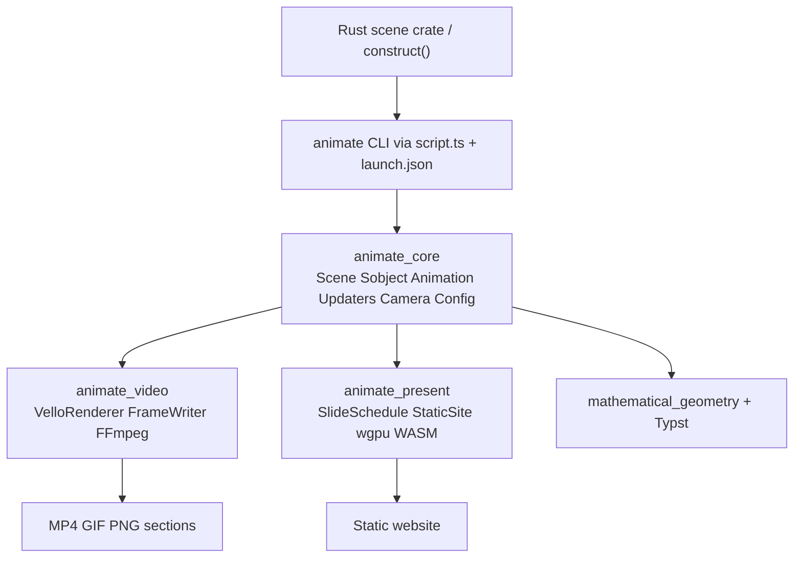

# Animate Technology — Full Manim Parity

## Decisions (locked)

- **Scope:** Full Manim feature tree in this ticket (not a skeleton).
- **Present:** `animate/present` **replaces** `[framework/product/presentation](framework/product/presentation)`; delete that tree after cutover.
- **Shared core:** Add `[animate/core/rs](animate/core/rs)` for Scene / Sobject / Animation / composites / rate funcs / updaters / camera / config. Both engines depend on it (clean long-term split; avoids duplicating the Manim scene graph).
- **Math:** Typst-backed `Text` / `MathText` (repo already uses Typst in `[puzzle/2d/rs](puzzle/2d/rs)` and `[infinite/canvas/rs](infinite/canvas/rs)`) — no LaTeX runtime.
- **Raster path:** Vello (+ wgpu) as the primary frame renderer (Cairo analogue), reusing patterns from `[infinite/canvas/rs](infinite/canvas/rs)` and `[mathematical/geometry/rs](mathematical/geometry/rs)` (kurbo Béziers).
- **Encode:** FFmpeg via a thin Rust interface (partial movies → concat), mirroring Manim’s SceneFileWriter; extend existing encode helpers in `[repo/lib/js/index.ts](repo/lib/js/index.ts)` only where the CLI/JS side must shell out.
- **Goal:** No `animate` goal exists. **Before `ticket_open`:** you must authorize opening goal `animate` (rules forbid opening goals without explicit instruction). Ticket binds to that goal.

## Architecture




Imperative Manim model (not a declarative graph):

1. User implements `Scene::construct` (Rust trait).
2. `play` / `wait` / `add` / `remove` run synchronously and sample the timeline at `frame_rate`.
3. Animations interpolate α ∈ [0,1] with nested composites (`AnimationGroup`, `Succession`, `LaggedStart`, `LaggedStartMap`).
4. Renderer captures frames; video writer encodes; present compiler emits a static site with wgpu playback.

### Naming (Manim → Semio)


| Manim                     | Semio                     |
| ------------------------- | ------------------------- |
| Mobject / VMobject        | Sobject / VSobject        |
| Group / VGroup            | Group / VGroup            |
| ImageMobject / SVGMobject | ImageSobject / SvgSobject |
| Scene                     | Scene                     |
| Animation                 | Animation                 |
| `.animate` builder        | `.animate()` builder      |
| Tex / MathTex             | Text / MathText (Typst)   |


## Crate layout

```
animate/
  AGENTS.md
  core/rs/          # animate_core — scene graph + timeline + animations
  video/rs/         # animate_video — headless video engine
  present/rs/       # animate_present — headless present compiler + static site
  plugin/rs/        # OS playground DocumentApp (replaces presentation-plugin)
  cli/              # optional thin bin wired through script.ts (if needed for discovery)
```

Each `*/rs` gets `Cargo.toml`, `lib.rs` (regions), `script.ts`, `project.json`, `package.json` as needed. Register members in root `[Cargo.toml](Cargo.toml)`. Wire nx + `[.vscode/launch.json](.vscode/launch.json)` following existing order/grouping (replace `presentationplay*` with `animate` / `present` / `video` entries).

### `animate_core` modules (regions in `lib.rs` / `pub mod`)

Mirror the provided Manim feature tree as the completeness checklist (implement all leaves):

- **Config** — resolution, fps, quality presets, paths, seed, cache, renderer kind
- **Scene** — lifecycle (`setup` / `construct` / `tear_down`), timeline, `play` / `wait` / `add` / `remove` / z-order, sections, skip/cache hooks; specialized scenes (`MovingCameraScene`, `ThreeDScene`, `ZoomedScene`, `VectorScene`, `LinearTransformationScene`)
- **Sobject** — hierarchy, points/Béziers, style, transforms, updaters, state save/restore/target; full 2D + 3D geometry catalogs; text/Typst; tables; axes/planes; graphs/plots; graph theory; matrices/linear algebra; images/SVG; traced paths; boolean ops
- **Animation** — leaf set (Create, Fade*, Transform*, Move*, Rotate, Indicate*, number anims, Grow*, …); composites with recursive parent-α → child-α; `.animate` method chaining; rate functions (linear through bounce + custom)
- **Camera** — 2D frame + 3D orientation; fixed-in-frame; zoomed inset
- **Updaters** — sobject/scene updaters, `always` / `f_always` / `always_redraw`, `ValueTracker`
- **Hash/cache** — animation + sobject + camera hashing via `[framework/hash/rs](framework/hash/rs)`

### `animate_video`

- `VelloRenderer` — static/moving split, frame loop, partial-movie cache
- `SceneFileWriter` — partials, concat, codecs, GIF/PNG/last-frame/transparent, audio mux, subtitles
- Headless API: `render_scene::<MyScene>(config) -> OutputPaths`
- CLI surface via `script.ts` (quality, scene select, preview, cache flush) registered in launch.json

### `animate_present`

- Same Scene/Sobject/Animation construct path
- Compiles to **static website**: wgpu WASM player + slide/section timeline, keyboard nav, overview grid
- Absorbs former presentation domain where it still matters: chapters/columns as **sections** of a present scene document; morphs become ordinary animations / `Succession` between arrangements
- Re-homes `presentation.deck` tile-play into present document schema (e.g. `animate.present.deck`) + plugin app
- Emits self-contained `dist/` (HTML + WASM + assets)

## Replace `framework/product/presentation`

After `animate/present` can render decks and host the playground:

1. Migrate `[mit-bestand/präsentation/33.projektetage](mit-bestand/präsentation/33.projektetage)` (27 slides + `[js/index.ts](mit-bestand/präsentation/33.projektetage/js/index.ts)`) onto `animate_present` scenes (no `@semio-tech/framework-presentation-*`).
2. Move Rust tile model from `[presentation_deck](framework/product/presentation/rs/lib.rs)` into `animate_present` (or core if shared).
3. Replace plugin `[presentation-plugin](framework/product/presentation/plugin/rs)` with `animate/plugin/rs`; regenerate playground registry; update `[framework/renderer/wgpu/js/boot.js](framework/renderer/wgpu/js/boot.js)`, OS resource kinds in `[framework/product/os/core/rs/lib.rs](framework/product/os/core/rs/lib.rs)` and `[s/manifest/resources.manifest.json](s/manifest/resources.manifest.json)`.
4. Delete entire `[framework/product/presentation/](framework/product/presentation/)`; remove Cargo members, package workspaces, `dev:presentation`, launch entries, vitest strip plugin refs.
5. Point launch configs at animate video/present/projektetage.

Note: TS presentation core/renderer are **already missing on disk**; Projektetage is broken against them today — cutover is fix + replace, not a soft dual-run.

## Implementation order (single ticket, full parity)

Work top-down so each layer is testable before the next catalog expands:

1. **Ticket + goal** — authorize/open goal `animate`; `ticket_open` with plan_id; feature checklist file in ticket folder (your Manim tree, Semio-renamed).
2. **Scaffold** — crates, workspace, scripts, launch.json stubs, AGENTS.md.
3. **Core pipeline** — Config, Scene lifecycle, Sobject/VSobject points+style, Animation trait, rate funcs, composites (nested α mapping exactly as Manim), updaters, `.animate` builder, Camera 2D.
4. **Video E2E** — Vello frame capture → partials → FFmpeg MP4 for a reference scene (`Create` + `FadeOut` + `AnimationGroup`).
5. **Geometry + style catalogs** — all 2D shapes, layout (`next_to`, `arrange`, …), colors/gradients, transforms, paths.
6. **Animation catalog** — every creation/fade/transform/movement/indication/number/specialized leaf.
7. **Text/Typst**, tables, axes/plots, graph theory, matrices/linear algebra scenes.
8. **3D** — ThreeDVSobject surfaces/solids, ThreeDCamera, ThreeDScene.
9. **Media** — Image/Svg Sobjects, audio, subtitles, sections, caching.
10. **Present compiler** — static site + wgpu player; section/slide navigation; migrate Projektetage; OS plugin.
11. **CLI + config files + quality presets + interactive OpenGL-analogue preview** (wgpu window / rerun).
12. **Extensibility** — custom Sobject/Animation/Scene/Renderer hooks; plugin discovery if needed.
13. **Delete** framework presentation; update consumers; extend existing tests only (no new test file sprawl — tests live in each crate’s `lib.rs` / existing suite files).
14. **Verify** — cargo tests for core/video/present; runtime MP4 + static site with `[DEBUG]` logs; close ticket.

## Key reuse (do not reinvent)

- Geometry: `[mathematical/geometry/rs](mathematical/geometry/rs)`
- Vello scene: `[infinite/canvas/rs](infinite/canvas/rs)`
- Hashing: `[framework/hash/rs](framework/hash/rs)`
- Headless trait style: `[kernel/2d/engine/rs](kernel/2d/engine/rs)`
- Document/VCS if present decks are editable: `[vcs/rs](vcs/rs)`
- Typst pipeline: puzzle/canvas patterns

## Completeness gate

Ticket is done only when the Semio-renamed Manim feature tree is implemented and verified (video encode + present static site + Projektetage on animate/present + framework presentation removed). Keep the checklist in the ticket folder and tick regions as modules land.

## Prerequisite before execution

Reply with authorization to **open goal `animate`** (required for `ticket_open`). Then implementation starts.