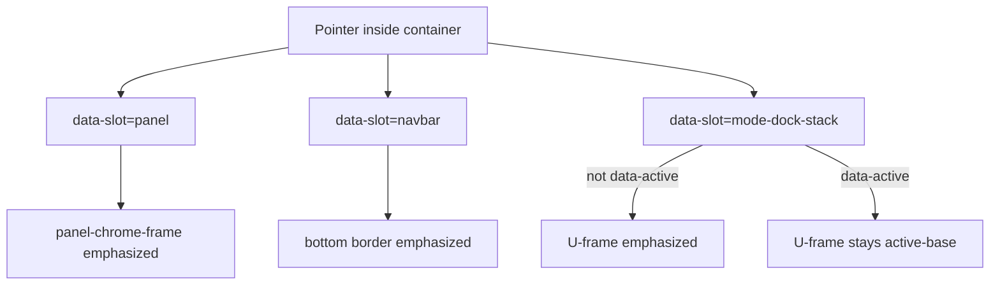

# Shell Chrome Parent Border Hover Emphasis

## Intent

When the pointer is anywhere inside shell chrome, that container’s border emphasizes:


| Surface         | Rest   | Pointer inside                | Active                             |
| --------------- | ------ | ----------------------------- | ---------------------------------- |
| Navbar / Footer | normal | emphasized (already works)    | n/a                                |
| Panel           | normal | emphasized (**broken today**) | n/a                                |
| Window stack    | normal | emphasized (**missing**)      | `active-base` at rest and on hover |


Goal association on implement: `🎯️r2602🎯️runningsketchpad` (same as related panel chrome tickets). Open a new ticket (no existing ticket covers this).

## Current state

- **Navbar/Footer** — already correct via CSS in `[ui/styling/js/ui.css](ui/styling/js/ui.css)` (`[data-slot="navbar"]:hover` / `[data-slot="footer"]:hover` → `--border-emphasized-color`).
- **Panel** — CSS exists but targets `[data-panel]:hover`, while floating `[Panel](ui/js/react/index.tsx)` only sets `data-slot="panel"`. Only `MobilePanel` sets `data-panel`. Hover emphasis never fires for the six floating anchors.
- **Window** — `[ModeDockStack](ui/js/react/index.tsx)` already stamps `data-slot="mode-dock-stack"` and `data-active` when globally active; U-frame parts use `border-normal` / `border-active-base` via Tailwind classes. No `:hover` border rules exist.

```1539:1541:ui/styling/js/ui.css
[data-panel]:hover [data-slot="panel-chrome-frame"] {
  border-color: var(--border-emphasized-color) !important;
}
```

```23010:23010:ui/js/react/index.tsx
    <div data-slot="mode-dock-stack" data-stack-path={stackPath} data-active={stackGloballyActive ? "true" : undefined} className="flex h-full min-h-0 w-full min-w-0 flex-col overflow-hidden bg-transparent">
```

## Approach

Pure CSS, matching navbar/footer: container `:hover` overrides border color with `!important` so it wins over Tailwind utilities. No new JS hover state.




### 1. Fix panel hover selector

In `[ui/styling/js/ui.css](ui/styling/js/ui.css)`:

- Change `[data-panel]:hover [data-slot="panel-chrome-frame"]` → `[data-slot="panel"]:hover [data-slot="panel-chrome-frame"]`.
- Align related rules that assume `[data-panel]` for chrome hosting (e.g. scroll-area inset padding around line 1527) to `[data-slot="panel"]` so floating panels get the same treatment as `MobilePanel`.

Optionally stamp `data-panel={anchor}` on `PanelGhostRoot` for attribute parity with `MobilePanel`; prefer unifying CSS on `data-slot="panel"` as the single source of truth (both components already have it).

Update docstrings on `panelChromeBorderClass` / `borderNormalFrameClass` in `[ui/js/react/index.tsx](ui/js/react/index.tsx)` that still say `[data-panel]:hover`.

### 2. Add window stack hover border CSS

In `[ui/styling/js/ui.css](ui/styling/js/ui.css)`, next to navbar/panel chrome rules:

```css
[data-slot="mode-dock-stack"]:not([data-active="true"]):hover
  :is(
    [data-slot="mode-dock-stack-body"],
    [data-slot="mode-dock-tab-cap"],
    [data-slot="mode-dock-controls-cap"],
    [data-slot="mode-dock-tab-gap"]
  ) {
  border-color: var(--border-emphasized-color) !important;
  transition: border-color 120ms ease;
}
```

Active stacks already apply `border-active-base` via `window*ActiveClass`. Do **not** override active stacks to emphasized on hover — active color wins (matches “unless it is active then show active emphasized color”).

Ensure rest-state CSS for inactive U-frame parts uses `--border-normal-color` with the same `!important`/transition pattern as panel chrome if Tailwind fights hover; mirror panel-chrome-frame approach if needed.

### 3. Tests

Extend existing tests in `[ui/js/react/index.tsx](ui/js/react/index.tsx)` (do not add new test files):

- Keep assertions that **rest** markup does not bake `border-emphasized` into class names (CSS-driven).
- Add coverage that panel root uses `data-slot="panel"` and that CSS selectors for hover live in `ui.css` (or assert computed style under a forced `:hover` if the test env supports it).
- Window tests around lines 24846–24869 already assert inactive stacks lack `border-emphasized` in className and active stacks use `border-active-base` — keep those; they remain valid because emphasis stays CSS-only.

### 4. Out of scope

- Footer (already correct).
- Per-control hover fills (already correct).
- WGPU renderer parity (separate unless React change reveals a shared token contract break).
- Emphasizing every nested group/toolbar border (user examples are shell chrome only).

## Files to touch

- `[ui/styling/js/ui.css](ui/styling/js/ui.css)` — panel selector fix + window stack hover rules
- `[ui/js/react/index.tsx](ui/js/react/index.tsx)` — docstring updates; extend existing tests if useful
- Ticket folder under `.repo/🎫️/…` for any temp notes (on implement)

