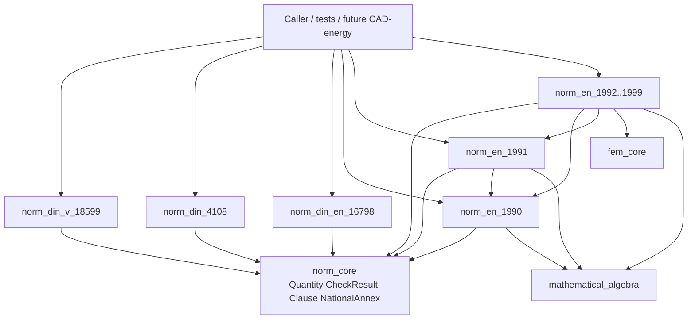

# Norm Technology — Full Family Crates

## Decisions (locked)

- **Depth:** Option A — one crate per listed path; **every part** of that family as modules; German NA (`DIN EN` / NA Germany) selectable where the family is an EN Eurocode or DIN EN.
- **Goal:** Approving this plan authorizes opening goal `norm` (title “Norm”, due `2026-12-31`). Ticket binds to `🎯️norm`.
- **Surface:** Headless Rust libraries only (no playground plugin in this ticket).
- **Layout:** Paths exactly as specified; crate names flatten path segments with underscores.
- **Shared core:** [`norm/core/rs`](norm/core/rs) (`norm_core`) owns cross-cutting types and the compliance result model; family crates depend on it (and on [`fem_core`](fem/core/rs) / [`mathematical_algebra`](mathematical/algebra/rs) for structural Eurocodes).
- **No mixing:** Do not import `mit-bestand` research into runtime crates; AGENTS.md may link research markdown for humans only.
- **Copyright:** Hand-implement formulas/tables as code and numeric constants (clause-cited). Do not paste proprietary standard PDF text into the repo.

## Architecture



**API shape (every family crate):**

- Typed **inputs** (geometry/loads/climate/system description needed by that norm).
- **`compute_*` / `check_*`** entry points that return `norm_core::CheckResult` (pass/fail/value + clause id + NA source).
- **`pub mod part_*`** modules for each part (e.g. `part_1_1`, `part_10`).
- **`pub mod na_de`** (Eurocodes / DIN EN) with German annex overrides applied via `NationalAnnex`.
- Tables as `const` / static data regions, never magic numbers without a clause region.

## Crate layout

```
norm/
  AGENTS.md
  core/
    rs/Cargo.toml + lib.rs     # norm_core
    script.ts + project.json
  din/
    v/18599/rs/…               # norm_din_v_18599
    4108/rs/…                  # norm_din_4108
    en/16798/rs/…              # norm_din_en_16798
  en/
    1990/rs/… … 1999/rs/…      # norm_en_1990 … norm_en_1999
```

Each leaf: `Cargo.toml`, `lib.rs` (regions), `script.ts`, `project.json`. Register all members in root [`Cargo.toml`](Cargo.toml). Add nx targets via each `project.json`. Register launch configs for `test` targets in [`.vscode/launch.json`](.vscode/launch.json) following existing order/grouping (no `dev:norm` playground).

### Family → parts (all implemented)

| Crate | Parts (modules) |
|-------|-----------------|
| `norm_din_v_18599` | 1–12 (general balancing through Gebäudeautomation + Tabellenverfahren) |
| `norm_din_4108` | 2, 3, 4, 6, 7 (and any remaining in-force parts as modules) — Mindestwärmeschutz, Feuchte, Bemessungswerte, U-value methods, Luftdichtheit |
| `norm_din_en_16798` | All published EN 16798 parts used for indoor environment / ventilation / HVAC energy (1, 3, 5, 7, 9, 13, 15, 17, … as modules) |
| `norm_en_1990` | EN 1990 + A1; combinations, γ/ψ, reliability; `na_de` |
| `norm_en_1991` | All action parts: 1-1 … 1-7, 2, 3, 4; `na_de` |
| `norm_en_1992` | Concrete: 1-1, 1-2, 2, 3, 4; `na_de` |
| `norm_en_1993` | Steel: 1-1 … 1-12, 2–6 as published; `na_de` |
| `norm_en_1994` | Composite: 1-1, 1-2, 2; `na_de` |
| `norm_en_1995` | Timber: 1-1, 1-2, 2; `na_de` |
| `norm_en_1996` | Masonry: 1-1, 1-2, 2, 3; `na_de` |
| `norm_en_1997` | Geotechnical: 1, 2; `na_de` |
| `norm_en_1998` | Seismic: 1–6; `na_de` |
| `norm_en_1999` | Aluminium: 1-1 … 1-5; `na_de` |

### `norm_core` regions

- `Quantity` / units helpers (SI, no external unit crate leaking through public API).
- `ClauseId`, `CheckStatus`, `CheckResult`, `CheckReport`.
- `NationalAnnex` trait + `AnnexChoice::{En, De}`.
- Shared enums: `LimitState` (ULS/SLS), `LoadDuration`, climate classes where shared.
- Error type for incomplete inputs / out-of-scope clauses.

## Ticket workflow

1. Open goal `norm` (authorized by plan approval).
2. `ticket_open` with emoji `📏️`, title “Norm Technology Full Family Crates”, goal `🎯️norm`, `plan_id` from this plan; write a part-by-part checklist under the ticket folder.
3. Implement + verify; keep temp notes/logs only in the ticket folder.
4. `ticket_close` with summary + all touched paths.

## Implementation order

Work so dependents compile against real APIs early:

1. **Scaffold** — all crates + workspace + scripts + AGENTS.md + launch test entries.
2. **`norm_core`** — result model + annex trait + quantity helpers + tests.
3. **Energy family (parallelizable)** — `4108` → `16798` → `18599` (18599 consumes 4108 thermal properties and 16798 indoor/ventilation inputs where the balancing method requires them).
4. **`norm_en_1990`** — basis of design + combination rules + DE NA.
5. **`norm_en_1991`** — all action parts + DE NA; depends on 1990.
6. **Material Eurocodes 1992–1999** — each part’s design checks; depend on 1990/1991 + `fem_core` for internal forces where a member check needs N/V/M (caller supplies section forces or a small `fem` model).
7. **End-to-end suites** — per crate: worked-example tests that call the public `check_*`/`compute_*` APIs and assert clause-level outcomes; `[DEBUG]` logs only in ticket scratch scripts if runtime confirmation is needed outside unit tests.
8. **Verify** — `cargo test -p norm_*` for every crate; close ticket.

## Completeness gate (per part module)

A part is done only when:

- All computational clauses needed for compliance checks are implemented as functions (not stubs/`todo!`).
- Tabulated values used by those clauses exist as data.
- DE NA differences are applied when `AnnexChoice::De` is selected (Eurocode / DIN EN crates).
- At least one worked-example unit test exercises the part’s public entry point.
- Public API never exports foreign crate types (reexport explicitly only if a client must see a shared type from `norm_core`).

## Reuse

- [`fem/core/rs`](fem/core/rs) — structural model / forces for Eurocode member checks.
- [`mathematical/algebra/rs`](mathematical/algebra/rs) — matrices/vectors where needed.
- Script/nx patterns from [`lowpoly/core`](lowpoly/core) and [`fem/core`](fem/core).
- Research pointers (non-code): [`mit-bestand/recherche/`](mit-bestand/recherche/) for human orientation only.
