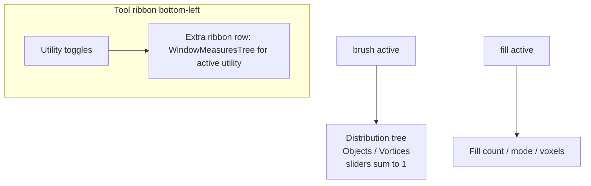

# Nest Tool Options Into The Tool Tree

## Intent

Tool-specific controls that currently live in the right-rail **Window Options** (or an orphaned utility-options stack above the toolbar) move into the **tool ribbon** when that utility is active. Puzzle distribution stays a nested measure tree of kind-weight sliders, but each sibling group is a probability simplex (always sums to 1).

Brush owns distribution (object/vortex or node/handle weights). Fill keeps its existing utility options (count / mode / voxels) — there is no separate fill distribution today.

## Target UX



- General window chrome stays on the right (LOD, view, sun, ambient select config where there is no select utility).
- When `brush` / `fill` / `pencil` / etc. is pressed, their options appear as an **extra ribbon row** under the tools (same placement pattern as today’s hardcoded [`SelectionUtilityOptions`](framework/renderer/react/index.tsx) ~L7158).
- Distribution: collapsible `Group` tree → per-kind `Slider`s; dragging one renormalizes siblings so the group sums to 1; labels show true percentages.

## 1. Framework: utility options inside `UtilityTree`

**React** — [`framework/renderer/react/index.tsx`](framework/renderer/react/index.tsx)

- Extend `UtilityTree` with `utilityOptions?: ReactNode`.
- When `utilityOptions` is set and `direction !== "inline"`, append a ribbon row (reuse the `SelectionUtilityOptions` row pattern). Prefer plugin-driven measures over the hardcoded selection strip when the active utility’s measures already cover method/mode; keep `SelectionUtilityOptions` only where apps still rely on it and have no tagged select measures.
- Thread options from `windowMeasuresChrome` → `utilityBarNode` / window chrome so the toolbar node owns the options, not a sibling stack.
- [`ui/js/react/index.tsx`](ui/js/react/index.tsx) `Window` (~L18208): stop rendering the separate `window-utility-options` stack when options are embedded in the toolbar (pass them only via `toolbar` content, or gate the stack when `toolbar` already includes them).

**WGPU** — [`framework/renderer/wgpu/rs/lib.rs`](framework/renderer/wgpu/rs/lib.rs)

- Align `render_window_utility_options_rail` with the ribbon: render partitioned utility options adjacent to / as part of the utility toolbar, not as a detached “Utility Options” card above it.

**Partitioning stays as-is** — [`partition_window_measures`](ui/wgpu/rs/lib.rs) / `partitionWindowMeasures`: top-level `Group { active_utility_id: Some(id) }` still gates which measures appear. No new `WindowMeasure` variant required for nesting.

Extend existing tests in [`framework/renderer/react/index.test.ts`](framework/renderer/react/index.test.ts) and WGPU partition tests.

## 2. Distribution = probability tree (sum to 1)

Prior ticket [Brush Kind Suggestion Percentages](.repo/🎫️/26/06/02/BRUSH-KIND-SUGGESTION-PERCENTAGES/ticket.json) claimed renorm helpers; handlers today only clamp/insert and do **not** keep sum = 1.

In [`puzzle/plugin/rs/lib.rs`](puzzle/plugin/rs/lib.rs) (shared by 2D/3D/5D regions):

- Add `uniform_kind_weights(ids)` and `normalize_kind_weight_group(weights, changed_id, new_value)`:
  - Clamp changed value to `[0, 1]`
  - Scale other entries so they sum to `1 - new_value`
  - If all others are 0, split remainder equally
- On catalog sync / empty maps: seed uniform `1/n` per kind group (node vs handle, object vs vortex, part vs grip — **independent** groups).
- Wire into `setBrushKindWeights`, `setObjectKindWeight`, `setVortexKindWeight` (and 5D equivalents); mark measures dirty so the tree refreshes with updated `%` labels.
- Keep nested measure shape:

```
Distribution
├️─️ Objects | Nodes | Parts   (sliders, sum = 1)
└️─️ Vortices | Handles | Grips (sliders, sum = 1)
```

Extend existing plugin tests to assert post-change group sums ≈ 1.

## 3. Retag / migrate misplaced tool options

| App | Move into utility-scoped groups (`active_utility_id`) | Leave as general Window Options |
|-----|------------------------------------------------------|----------------------------------|
| **Puzzle 2D** | `puzzle2d_suggestion_measures_group` → `brush` (offset + distribution) | LOD |
| **Puzzle 3D** | Merge `puzzle3d_brush_measures_group` (overlap + distribution) into brush utility options; keep existing fill/voxel/brush-placement groups | LOD, view, sun; **select group** stays general (no select utility — ambient selection) |
| **Puzzle 5D** | Same as 3D for suggestion + brush groups | LOD / window-level |
| **Lowpoly** | Selection kind + method → `select` (or active select\* utility) | Show-edges, sun, snap |
| **Note** | Pencil width → `pencil`; eraser radius → active eraser utility | Zoom, grid, snap |
| **Raster** | Add tagged brush/eraser size (+ opacity) utility-option groups (state already exists; not in measures today) | — |

Compose / mit-bestand: out of scope (different UI stack).

Update existing assertions such as `fill_and_brush_params_are_tagged_utility_options_not_engagement_controls` so distribution is absent from general measures and present only under the active brush utility.

## 4. Ticket / goal

On execution: reopen or open a ticket via repo MCP; associate with `🎯️r2603` (current playground/UI release cycle). Temp artifacts only under the ticket folder. Do not mix compose/mit-bestand.

## Out of scope

- New select utilities for puzzle 3D (select config remains window-level until a select utility exists).
- Inventing fill-specific distribution (brush owns kind-weight probabilities).
- Compatibility shims or migration scripts.
