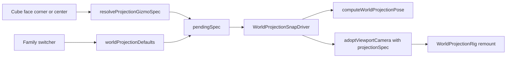

# Complete 3D Projection Gizmo

## Ticket / Goal

- **Goal:** `🎯️r2602` (Running Sketchpad)
- **Ticket:** open a new ticket (e.g. `COMPLETE-3D-PROJECTION-GIZMO`) — distinct from open `[ALL-3D-WINDOWS-SHOW-CORNER-GIZMO](.repo/🎫️/26/07/23/ALL-3D-WINDOWS-SHOW-CORNER-GIZMO/)` which only covered mounting the widget. Reuse that ticket’s wiring; this work extends the control itself.

## Diagnosis (current breakage)

Primary implementation: `[infinite/world/r3f/index.tsx](infinite/world/r3f/index.tsx)` (`WorldOrbitViewGizmo` / `WorldOrbitViewControls` / `WorldOrbitViewSnapDriver`). Host wiring: `[framework/renderer/react/index.tsx](framework/renderer/react/index.tsx)` `World3dHost`.

1. **Incomplete widget** — `hideNegativeAxes` leaves only `+X/+Y/+Z` heads → only `right` / `back` / `top`. No corner targets for isometric/axonometric, no center for perspective.
2. **Broken transitions** — after snap, `WorldOrbitViewSnapDriver` calls coarse `onProjectionChange("orthographic"|"perspective")`, and `handleProjectionChange` **forces** `{ orthographic, view: "top" }` or `{ threePoint }` — wiping the snapped view.
3. **Two parallel models** — gizmo speaks `OrbitCameraViewId` + coarse `OrbitCameraProjection`; the real camera path is `WorldProjectionSpec` via `WorldProjectionRig`. Snaps never set `projectionSpec`.
4. **Binary Ortho/Persp chrome** — `WorldOrbitProjectionSwitch` cannot reach axonometric / oblique / 1–2-point / curvilinear (those only exist in the Display drag palette).

## Chosen approach

Mirror the gumball pattern:

| Gumball                                                                             | Projection gizmo                                                           |
| ----------------------------------------------------------------------------------- | -------------------------------------------------------------------------- |
| Handles on the widget (axes / planes / rings)                                       | Spatial hit targets on a navigation cube (faces / corners / center)        |
| Utility modes filter which handles show (`move` / `rotate` / `scale` / `transform`) | Family switcher selects projection kind; cube snaps set view/quadrant/axis |
| Commit → typed action                                                               | Snap → `WorldProjectionSpec` + animated pose                               |

**Spatial cube (always):**

- **6 faces** → orthographic `plan|top|bottom|front|back|left|right` (map `+Z` face to `top`; keep `plan` via family default / re-click or face label convention already used in templates)
- **4 upper corners** → axonometric isometric quadrants `ne|nw|se|sw` (and when family is axonometric dimetric/trimetric, same corners keep that variant)
- **Center** → active perspective kind default (`threePoint`); when family is `twoPoint` / `onePoint` / `curvilinear`, center applies that kind’s default pose

**Family switcher (replaces Ortho/Persp):** kinds from `WorldProjectionSpec` — `orthographic | axonometric | oblique | onePoint | twoPoint | threePoint | curvilinear` — using `worldProjectionDefaults(kind)` then cube refinement for view/quadrant/axis.

## Implementation steps

### 1. Spec-first resolve API (in `infinite/world/r3f/index.tsx`)

- Add `resolveProjectionGizmoHit(hit, currentSpec) → WorldProjectionSpec` replacing direction→`OrbitCameraViewId`-only flow for the new widget.
- Hit kinds: `{ type: "face", axis, sign } | { type: "corner", quadrant } | { type: "center" }`.
- Keep `resolveOrbitGizmoViewFromDirection` as a thin adapter for tests/legacy, or map through the new resolver.
- Add `orbitViewToWorldProjectionSpec(view)` / reverse where needed so CAD orbit paths stay consistent.

### 2. Rebuild gizmo viewport as a navigation cube

- Replace axis-head-only `WorldOrbitViewGizmoViewport` with faces + corners + center hit meshes (still inside drei `GizmoHelper`, same `[resolveSceneGizmoViewportPlacement](ui/js/react/index.tsx)` bottom-right insets).
- Show **both** positive and negative faces (drop `hideNegativeAxes`).
- Keep XYZ axis shafts/labels for orientation feedback; clicks go to face/corner/center, not only axis heads.
- Hover scale / pointer stopPropagation patterns stay as today.

### 3. Fix snap driver + host callbacks (transitions)

- Evolve `WorldOrbitViewSnapDriver` → `**WorldProjectionSnapDriver**`: animate to `computeWorldProjectionPose(spec, …)`; on complete call a single callback with full `WorldCameraState` including `projectionSpec` (do **not** call coarse `onProjectionChange` that resets to top).
- In `World3dHost` / CAD `InteractionSpatialView`: adopt camera from that full state; remove DEBUG `console.log`s; stop routing gizmo snaps through `handleProjectionChange`.
- Ensure ortho↔perspective camera remount (`WorldProjectionRig` `seedKey`) happens **after** or **with** the snap so matrix drivers (oblique / two-point) and curvilinear pass activate correctly.
- Respect `worldProjectionOrbitConstraints` after landing (snap gate already disables orbit during animation).

### 4. Family switcher chrome

- Replace / extend `WorldOrbitProjectionSwitch` to switch **projection kinds** (not just ortho/persp), applying `worldProjectionDefaults` + `applyWorldProjectionToCameraState` / framed pose when needed.
- Keep it pane-draggable via existing `WorldOrbitProjectionSwitchPane`.
- Variant parameters (dimetric angles, cabinet depth, fisheye vs panini) remain Display-panel / measure territory; switcher picks kind defaults, cube picks spatial orientation.

### 5. CAD + WGPU parity

- CAD `[InteractionSpatialView](cad/renderer/js/index.tsx)`: same controls props / callbacks as `World3dHost`.
- WGPU `[paint_world_orbit_view_gizmo](infinite/world/rs/lib.rs)`: extend paint to show negative faces / corners visually for parity; interaction remains R3F-primary unless a pick path already exists (do not invent a second incomplete click stack).

### 6. Tests (extend existing files only)

In `[infinite/world/r3f/index.tsx](infinite/world/r3f/index.tsx)` vitest regions and `[framework/renderer/react/index.test.ts](framework/renderer/react/index.test.ts)`:

- Face → each orthographic view; corner → each axonometric quadrant; center → perspective kind.
- Snap adoption **preserves** `projectionSpec.view` (regression for the top-clobber bug).
- Family switcher → each `worldProjectionDefaults(kind)`.
- Host still sets `data-orbit-view-gizmo` on non-empty windows.

Logs from test runs go under the new ticket folder.

## Out of scope

- Redesigning Display-panel projection drag templates (already complete).
- New Storybook files (extend existing World3dHost / gumball stories only if needed for manual check).
- WGPU interactive picking for the cube.

