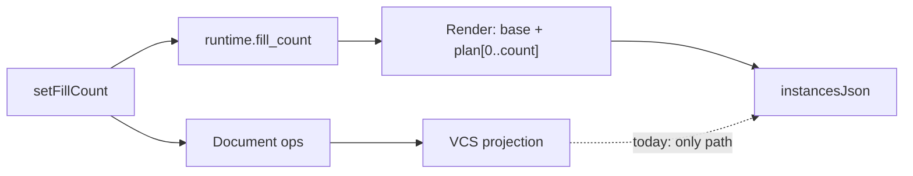

# Fix Fill Amount Slider 3D Live Update

## Problem

Moving the Count slider updates `runtime.fill_count` (and the thumb), but the 3D viewport only changes when document ops mutate `fixture.objects` and `refreshUi` rebuilds `instancesJson` from the projection. When the planned tail is not yet applied to the document (or ops/VCS lag), the scene stays frozen — even though placements already exist in the fill precompute session as `appended_objects`.

User intent: precomputed placements are already known; sliding must be **show/hide of that planned prefix**, near real-time.

## Approach

Drive the world composite render from the fill session plan + `runtime.fill_count`, while still committing document ops for persistence.

### 1. Compose display fixture from fill plan (engine)

In `[puzzle/3d/rs/lib.rs](puzzle/3d/rs/lib.rs)`:

- Add `compose_fill_display(&self, count: usize) -> Option<Fixture>` on `Puzzle3dCollision`:
  - `visible = count.min(sequence.len())`
  - `base + appended_objects[0..visible]` (+ matching attractions)
  - Does not mutate `applied_count` / queue (pure read for rendering)
- Expose via `Puzzle3dPrecomputeSession` (`compose_fill_display_rust` / wasm equivalent)

### 2. Use display fixture in world render (plugin)

In `[puzzle/plugin/rs/lib.rs](puzzle/plugin/rs/lib.rs)` `Puzzle3dPlayApp::render` for `PUZZLE3D_PLAY_BODY_COMPOSITE`:

- After loading projection + window runtime, if fill session can compose a display fixture for `runtime.fill_count`, deserialize it into the envelope fixture used for:
  - `world_instances_json`
  - `world_meshes_json` (so new mesh URLs appear)
  - vortices / attractions derived from those objects
- Otherwise keep projection as today

`setFillCount` keeps applying document ops (`apply_puzzle3d_fill_count` + `coalesce_key: "fill-count"`) and narrow `puzzle3d_fill_build_scope()` so the document stays in sync and the tool slider refreshes — but the viewport no longer depends on ops landing first.

### 3. Tests

Extend existing tests in `puzzle/plugin/rs/lib.rs` / `puzzle/3d/rs/lib.rs`:

- After `fillBuildTick` planning with `fill_count == 0`, call `setFillCount` to a ready count and assert composite `instancesJson` object count increases in the **same** render (display path), matching `fill_count`
- Sliding down removes instances from render immediately
- Engine: `compose_fill_display` does not change `applied_count`

### 4. Ticket / validation

- Reopen `[26/07/24/FIX-PUZZLE-3D-FILL-OPTIONS-LAG](.repo/🎫️/26/07/24/FIX-PUZZLE-3D-FILL-OPTIONS-LAG/)` (same goal `🎯️r2602`) with this follow-up prompt
- Add `[DEBUG]` logs temporarily around compose vs projection object counts during `setFillCount` refresh
- Confirm with plugin tests + note runtime: slider drag within `ready` must change instance count every tick

## Out of scope

- Changing Monte Carlo / planning cost
- Reintroducing full attraction resolve on every count tick
- Distribution weight soft-replan (already done)

