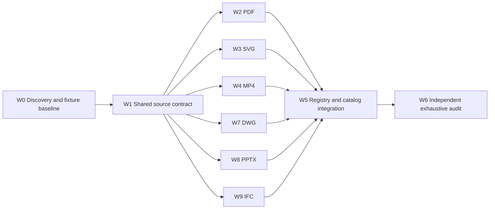

# Lossless Well-Known Artifact Roundtrip Implementation Plan

## Outcome

For each supplied PDF, DWG, SVG, MP4, PPTX, and IFC fixture, every unchanged import/persistence/diff/mutation/export path must reproduce the exact imported byte sequence. Semantic edits may produce a deliberate valid rewrite only when the writer covers the edited domain; otherwise export must return an explicit unsupported-dirty error. Export may never silently discard a mutation.

## Fixed Fixture Baseline

| Format | Fixture | Bytes | SHA-256 |
|---|---|---:|---|
| PDF | `temp/📄️bachelor-thesis.pdf` | 6,346,331 | `83ebe31253bfa881ab9478e9e79d1a774e2abee7ddc27fc8ce9613d47d9c9ad3` |
| DWG | `temp/architectural_example.dwg` | 148,638 | `52d14a7bdb946099d3cf16fd276d19bd8924348fd02b2ddd0003cd4f6b34cce7` |
| SVG | `temp/artifacts.svg` | 423,414 | `62a1922aad9e06ba7d4a55fe13c360f286eb720873bcf6d8e6ffd1d52e782fc9` |
| MP4 | `temp/bauen-mit-bestand.mp4` | 16,086,051 | `54b0672cca68a474d44c6096abb6579160b4d33b0f637f588e2e0752373e05c7` |
| PPTX | `temp/domai-specific-programmaning-language-for-architects.pptx` | 16,341,544 | `477900b1746139840890bc4edb653c488f3d18f9da34d231332b5db41d4caa8a` |
| IFC | `temp/wellness-center-sama.ifc` | 21,282,588 | `f4dbc661d555bbf92fb80a40443f6b6b540fa0a833b85d78487930368147b593` |

## Contract

### Persisted source image

Add a shared schema-first `ArtifactSource` value in the existing Rust crate source. It contains:

- complete imported native bytes;
- a BLAKE3 digest of the deterministic semantic projection at import time.

Each affected snapshot persists `Option<ArtifactSource>` as artifact state. The semantic projection is the snapshot with `source = None`, serialized deterministically. Import parses first, fingerprints that projection, then attaches the exact native bytes. No mutable dirty flag is stored.

### Derived synchronization

Export recomputes the current semantic projection digest:

- matching digest: return `source.bytes` verbatim;
- different digest with a complete writer: emit an intentional rewrite and validate it;
- different digest without a complete writer: return an explicit unsupported-dirty error;
- no source image: use the canonical writer for newly authored snapshots.

This makes cleanliness derived from state, so mutation followed by inverse naturally restores the exact source fast path. It also prevents a stale flag from surviving diff, pack, or event replay.

### State algebra

The source field is first-class persisted state:

- snapshot equality includes it;
- `between` emits it when source provenance differs;
- apply replaces it;
- absorb is last-writer-wins;
- inverse restores it through `between`;
- set-snapshot text/binary codecs encode it;
- Artifact DSL/Pack roundtrips retain it, directly or by re-importing the exact native bytes.

Schema identity remains non-diffable. Inference-only projections are not independently editable. Any currently editable projection that a writer cannot serialize is rejected at dirty export.

## Acceptance Matrix

Every format must pass every applicable row against the exact fixture.

| ID | Pipeline | Required assertion |
|---|---|---|
| A | raw import → raw export | exact length, bytes, SHA-256 |
| B | import → ArtifactPack → unpack → export | exact bytes |
| C | import → ArtifactDsl → parse → export | exact bytes |
| D | import → `between(self,self)` → apply → export | empty diff and exact bytes |
| E | import → no-op mutation → export | exact bytes |
| F | import → representative mutation → inverse → export | snapshot restoration and exact bytes |
| G | import → absorbed equivalent/no-op mutations → export | exact bytes |
| H | import → diff text/binary codec → apply/inverse → export | exact bytes |
| I | set-snapshot op text/binary codec → apply → export | exact bytes |
| J | raw serializer/deserializer registry | correct discovery and exact bytes |
| K | analyzer/composer Semio-pack route | correct envelope routing and exact bytes |
| L | effective supported mutation → export → re-import | valid artifact and intended semantic change |
| M | effective unsupported mutation → export | typed error; no stale bytes |

Failure diagnostics must report format, before/after length and digest, first differing byte, and when practical the containing PDF object, MP4 box, or ZIP member.

## Parallel Workflow DAG

### W0 — completed discovery

- Core law and routing audit: `📓️core-laws-research.md`.
- PDF/DWG/SVG audit: `📓️pdf-dwg-svg-research.md`.
- MP4/PPTX audit: `📓️mp4-pptx-research.md`.
- Baseline `nx` output: `🧪️baseline-stdio.log`.

### W1 — single shared-contract owner

- Add the shared persisted source image and deterministic fingerprint helpers to an existing source file.
- Add shared tests for capture, match, mismatch, serde retention, and binary-safe empty bytes.
- Publish the exact API to format lanes before their edits.
- Gate: focused shared tests pass.

### W2 — PDF owner

- PDF: persist exact source, adapt decode/export, diff and custom snapshot codecs, and extend the existing thesis tests.
- PDF dirty imported snapshots: reject object/trailer/page mutations the minimal writer cannot faithfully cover.
- Correct the PDF 1.5/1.7 fixture taxonomy reference without adding compatibility layers.
- Gate: A–M for PDF, plus all 65 pages render and extract text.

### W3 — SVG owner

- Persist UTF-8 source bytes alongside `XmlDocument`.
- Extend SVG snapshot, diff, mutation codecs, raw I/O, and existing test regions.
- Unchanged export returns exact lexical source; structural edits deliberately use the XML writer.
- Gate: A–M, `xmllint`, prolog comment, CDATA/font payload, exact hash.

### W4 — MP4 owner

- MP4: persist source and baseline projection; unchanged export bypasses normalizing box reconstruction; extend existing I/O/diff/mutation tests.
- Gate: A–M and `ffprobe` stream/timing/frame validation.

### W7 — DWG owner

- Adapt the existing authoritative bytes to derived synchronization; retain correct header patch semantics; reject unsupported section edits.
- Correct AC1024 fixture taxonomy references and verify extension discovery.
- Gate: A–M, AC1024 signature, decoder status, section assertions, exact hash.

### W8 — PPTX owner

- Persist the complete original archive, not merely OPC parts; unchanged export bypasses destructive presentation regeneration and ZIP normalization.
- Dirty imports reject edits until the affected presentation/relationship/XML writer is complete; new synthetic snapshots retain the canonical authoring path.
- Gate: A–M, ZIP integrity, 62 slides, 211 entries, resolvable relationships.

### W9 — IFC owner

- Route the IFC2X3 fixture through the correct standard implementation and preserve its complete CRLF Part-21 source image.
- Persist source provenance through snapshot, sparse diff, mutations, ArtifactDsl/Pack, and raw text/binary serializers.
- Ensure an unchanged export retains comments, whitespace, entity lexemes/order, and CRLF bytes; deliberate typed edits may use the Part-21 writer only when faithful.
- Gate: A–M, IFC2X3 schema declaration, full entity parse, Part-21 terminator, exact hash.

### W5 — single integration owner

- Resolve shared `glue.rs`, catalog, registry, and route changes.
- Distinguish native raw bytes from Semio ArtifactPack bytes in API names and tests.
- Repair extension/format declarations and non-empty serializer/deserializer registrations.
- Extend only existing `📜️script.ts`/Nx targets if tiering is required; register any new executable in `.vscode/launch.json` in existing order.
- Gate: one Nx workflow exercises all fixtures end to end.

### W6 — independent verifier

- Recompute every import/export hash and byte comparison outside the authoring tests.
- Run focused, full, long, and exhaustive Nx gates without claiming success until exit code zero is observed.
- Validate PDF with Poppler, SVG with `xmllint`, MP4 with `ffprobe`, PPTX with ZIP/OPC checks, DWG with AC1024 signature and decoder section assertions.
- Audit source/diff/mutation/pack/DSL/registry behavior and repository rules.
- Write `✅️verification.md`; close the ticket only when all matrices are green.

## Concurrency and File Ownership

- One dedicated agent owns each exact fixture. Because the runtime has three subagent slots, PDF/SVG/MP4 execute first and DWG/PPTX/IFC start as dedicated queued lanes as slots become free.
- Format lanes edit only their existing format-local snapshot/diff/mutation/I/O/test regions.
- The primary integrator exclusively owns shared `📦️glue.rs`, plugin registration/catalog, `📜️script.ts`, project metadata, launch configuration, and ticket close.
- No new test or script files are created. No agent modifies git state.
- Temporary diagnostics use `[DEBUG] ` and remain ticket-local; temporary source logging is removed before verification.
- Agents report changed files, commands, exit codes, and blockers before integration.

## Verification Order

1. Compile the shared contract.
2. Run format-focused exact fixture tests in parallel.
3. Run the stdio quick/full target through Nx.
4. Run `bun nx run @semio-tech/stdio-plugin:test-exhaustive`.
5. Execute independent byte/hash and native validator checks.
6. Audit the complete diff for silent normalization, unregistered routes, new files, and debug output.
7. Close the ticket with the exact changed-file inventory and verified command results.

## Stop Condition

Work stops only after all six exact fixtures satisfy byte identity for A–K, mutation capability behavior is explicit for L–M, the exhaustive Nx target exits zero, native validators succeed, and the ticket verification report contains reproducible evidence.
