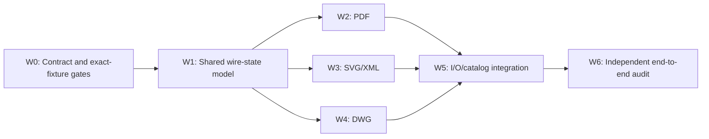

# PDF, DWG, and SVG Lossless Roundtrip Research

## Scope

This is a read-only discovery baseline for the exact user fixtures below. No implementation or test source was edited.

| Format | Exact fixture | Bytes | SHA-256 | Detected format |
|---|---|---:|---|---|
| PDF | `/Users/ueli/Documents/semio/temp/📄️bachelor-thesis.pdf` | 6,346,331 | `83ebe31253bfa881ab9478e9e79d1a774e2abee7ddc27fc8ce9613d47d9c9ad3` | PDF 1.5 |
| DWG | `/Users/ueli/Documents/semio/temp/architectural_example.dwg` | 148,638 | `52d14a7bdb946099d3cf16fd276d19bd8924348fd02b2ddd0003cd4f6b34cce7` | AutoCAD AC1024 (2010/2011/2012) |
| SVG | `/Users/ueli/Documents/semio/temp/artifacts.svg` | 423,414 | `62a1922aad9e06ba7d4a55fe13c360f286eb720873bcf6d8e6ffd1d52e782fc9` | Valid SVG/XML |

The exact PDF and DWG bytes already exist as repository fixtures, but both are stored under standards that do not match their headers:

- The PDF 1.5 file is under `📄️pdf/🏅️standards/🔖️1.4/.../🎓️bachelor-thesis`, while its tests deliberately use the 1.7 decoder.
- The AC1024 DWG is under `🖊️dwg/🏅️standards/🔖️ac1018/.../🏛️architectural`, while its tests use the AC1024 implementation.
- The exact user SVG has no repository fixture copy. The existing demo SVG is different.

## Baseline conclusion

| Format | Direct import → export byte identity now | Why |
|---|---|---|
| PDF | **Fails by design** | Import parses a structural document/object projection; export constructs a fresh minimal PDF 1.7 using only pages and info. Original bytes, object layout, streams, xref form, trailer details, metadata, fonts, images, and declared 1.5 version are not re-emitted. |
| DWG | **Passes on the direct codec path** | The snapshot retains the untouched original file in `bytes`; `encode_dwg` validates and returns `bytes.clone()`. The exact fixture already has a direct byte-equality test. Full analyzer/composer and mutation consistency still have gaps. |
| SVG | **Fails by design** | Import parses an XML tree and export writes normalized XML. XML declaration quoting, prolog comments, whitespace boundaries, entity spelling, attribute quoting, empty-element spelling, and other lexical choices are not retained. |

The fundamental distinction is structural retention versus wire retention. A structurally equivalent PDF or SVG is not a byte-identical artifact. DWG already has the necessary authoritative wire image, but its semantic mutation model can diverge from that wire image.

## PDF findings

### Read-only fixture verification

Following the PDF verification skill, the fixture was inspected without modifying it:

- `pdfinfo` reports PDF 1.5, 65 A4 pages, unencrypted, no forms, no JavaScript, creator `LaTeX with hyperref`, producer `MiKTeX pdfTeX-1.40.21`, custom metadata present, and no metadata stream.
- `pdftotext` succeeded and produced 4,147 lines / 131,973 bytes of extracted text.
- Poppler rendered all 65 pages at 36 DPI to the ticket-local `pdf-render/` directory.
- Representative pages 1, 33, and 65 were visually inspected and rendered cleanly: the title page, a body page with graphics, and the final page were intact.

These checks establish that the source is a healthy, complex real-world PDF rather than a minimal synthetic codec fixture.

### Snapshot and import behavior

`PdfSnapshot` stores:

- schema and declared version;
- a derived page view;
- document info;
- resolved PDF objects;
- a trailer dictionary.

`decode_pdf` resolves a meaningful PDF graph and the existing real-fixture test confirms 65 pages, more than 1,000 objects, and substantial extracted text. That is strong semantic import coverage.

It is not a lossless wire representation. The snapshot does not store the original file bytes or enough lexical provenance to reconstruct:

- exact object byte spans and whitespace;
- original stream bytes and filter spelling when decoded/projected;
- xref table versus xref stream layout;
- incremental update sections and byte offsets;
- object ordering/generation/layout;
- comments, token spellings, and dictionary lexical ordering;
- the complete original header/trailer/startxref arrangement.

Calling the resolved graph “full” therefore describes semantic object reachability, not file-image reversibility.

### Export behavior

`encode_pdf` explicitly generates a fresh, minimal PDF 1.7. It reads pages and info, allocates new objects, creates its own catalog/page/font/content structure, and writes a classic xref table and trailer. It does not re-emit `PdfSnapshot.objects` or the imported trailer.

Consequences for the exact thesis fixture include:

- the header changes from `%PDF-1.5` to `%PDF-1.7`;
- the original object graph and numbering are replaced;
- embedded fonts, images, outlines, metadata, annotations, and arbitrary objects are not reproduced by the minimal page writer;
- original compressed streams and xref layout cannot survive;
- an exported document can be structurally readable while being radically different in bytes and content fidelity.

The raw binary exporter calls this same `encode_pdf`. `ArtifactDsl` and `ArtifactPack` also encode the freshly generated PDF rather than preserving imported bytes. Thus the loss occurs across raw I/O, DSL, and pack paths, not just in one leaf serializer.

The raw importer’s `deserialize` accepts a `BinarySnapshot` and calls `decode_pdf`, but its `deserialize_bytes` first attempts to decode the argument as a Semio `BinarySnapshot` pack. A raw `.pdf` file and a packed binary envelope are distinct inputs despite the method name. Analyzer/composer tests must exercise both paths explicitly rather than assuming a raw physical file is a Semio pack.

### Diff and mutation consistency

PDF diff/mutation coverage is comparatively rich: objects and trailer can participate in structural changes. However, the exporter ignores those same object/trailer fields. A successful mutation can therefore change the snapshot while producing output that omits the change. This is more serious than non-canonical bytes: it is a mismatch between the editable domain model and export authority.

The clean contract must prevent silent divergence:

- unchanged imported snapshots return the original wire bytes exactly;
- a mutation that changes an export-effective field must either update/patch the wire representation or mark it dirty;
- exporting a dirty snapshot is allowed only when a real format writer can faithfully encode that mutation;
- unsupported dirty export must return a typed error, never stale bytes and never a minimal unrelated reconstruction.

### Existing tests and gaps

The real thesis fixture tests semantic decoding and a decode → encode → decode page-level retention law. The test commentary explicitly acknowledges that the raw graph is not re-emitted. There is no assertion that exported bytes equal the fixture, and the current architecture cannot satisfy one.

Required additions to existing test files:

- exact direct raw importer → exporter byte equality;
- imported snapshot pack encode/decode followed by raw export equality;
- `Diff::between(snapshot, snapshot)` emptiness and application preserving original bytes;
- no-op mutation, inverse, and absorbed mutation paths preserving original bytes;
- an export-effective semantic mutation either changes valid PDF bytes faithfully or returns the specified typed unsupported-dirty error;
- analyzer/composer raw-file and Semio-pack routes tested independently;
- output verified with `pdfinfo`, full-page rendering, text extraction, and exact SHA-256/byte comparison.

## DWG findings

### Snapshot and codec behavior

`DwgSnapshot` already implements the central lossless strategy:

- version, maintenance version, and codepage are decoded;
- decoded section names/section projections and decode status are retained;
- most importantly, `bytes` contains the untouched original file.

`decode_dwg` recognizes AC10xx headers and retains every source byte. `encode_dwg` validates the snapshot’s byte header/version consistency and returns `snap.bytes.clone()`. This makes a no-op import/export exact even when the decoder only understands part of the proprietary format.

The existing exact architectural fixture test confirms AC1024, D2 section decompression, named AcDb sections, snapshot bytes equal fixture bytes, and re-encoded bytes equal fixture bytes. The user fixture and repository fixture have the same SHA-256.

### I/O and routing gaps

The raw serializer correctly calls `encode_dwg`; the raw deserializer’s `deserialize` correctly calls `decode_dwg` on `BinarySnapshot.bytes`.

As with PDF, `deserialize_bytes` does not accept a raw DWG file directly. It first decodes the argument as a Semio `BinarySnapshot` pack. Analyzer binary paths similarly expect a Semio artifact envelope. End-to-end tests must distinguish:

1. physical raw DWG bytes wrapped in the input artifact expected by the raw deserializer; and
2. Semio `ArtifactPack` bytes used by store/analyzer transport.

Catalog/routing defects also weaken genuine end-to-end coverage:

- the artifact’s document extension is declared as `bin`, not `dwg`;
- artifact import/export format arrays are empty;
- the AC1024 fixture is located in the AC1018 example taxonomy.

These do not break the direct codec equality test, but they can prevent a real `.dwg` file from reaching that codec through normal discovery/routing.

### Diff and mutation consistency

DWG diff includes the authoritative bytes plus version/codepage/section projections. Version-info mutation patches both the scalar mirror and known raw header offsets, which respects export authority.

Section mutations are different: they modify decoded section projections while `encode_dwg` continues returning the untouched `bytes`. Consequently, a section edit can appear in snapshot state and disappear on export. If sections are intended to remain inference-only, they must not be exposed as independently editable persisted state. If they are editable, mutations need a true DWG writer/byte patch and validation. Until then, a dirty unsupported export must fail rather than silently returning stale bytes.

### Required test extensions

- Preserve the existing direct exact-byte codec law.
- Exercise exact fixture bytes through raw deserializer/serializer registry wiring.
- Exercise ArtifactPack snapshot roundtrip, empty diff, no-op mutation, inverse, and absorb before final raw export.
- Assert version-info mutations update header bytes and re-decode consistently.
- Assert section mutation either has a faithful byte effect or returns a typed unsupported-dirty export error.
- Test extension/format discovery with `.dwg` and repair catalog declarations.
- Validate final AC1024 signature, decoder status/sections, exact size, SHA-256, and byte comparison.

## SVG findings

### Fixture characteristics

`xmllint --noout` accepts the exact fixture. It is a substantial 5,141-line SVG containing a generator prolog comment, a large CDATA style section with embedded WOFF font data, paths, text, and reuse elements. It begins with a single-quoted declaration and a generator comment:

```xml
<?xml version='1.0' encoding='UTF-8'?>
<!-- This file was generated by dvisvgm 3.0.4 -->
```

It contains thousands of single-quoted attributes, making lexical normalization easy to detect.

### Snapshot and XML bridge behavior

`SvgSnapshot` contains only schema plus an `XmlDocument`. `parse_svg_xml` parses the source into that tree; `write_svg_xml` uses the shared XML writer.

The XML tree retains useful structure such as attributes, element children, text, CDATA, comments inside the parsed root, and processing instructions. It is not a concrete syntax tree and does not preserve the source wire image.

Observed lexical losses include:

- `skip_misc` discards the generator comment before the root;
- parser text handling trims boundary whitespace;
- the XML declaration is reconstructed with normalized double quotes and spacing;
- attributes are written with double quotes, replacing the fixture’s single quotes;
- entity spellings are decoded and canonically escaped on output;
- tag/attribute line wrapping and whitespace are normalized;
- empty-element syntax is normalized;
- source-level distinctions that map to the same XML data model cannot be recovered.

The raw XML exporter calls `write_svg_xml`; the raw importer calls `parse_svg_xml`. `ArtifactDsl` and `ArtifactPack` also wrap normalized regenerated XML. Every persistence route therefore loses source lexical identity.

The text analyzer can parse raw SVG via its fallback behavior. Binary analyzer paths expect a Semio pack, so raw XML and packed transport still require separate integration tests.

### Diff, mutations, and tests

SVG diffs and mutations operate on the structural XML/SVG projection. Existing tests primarily use small synthetic, already-normalized strings and compare `write_svg_xml` output. A tiny one-line codec fixture with double quotes cannot reveal the exact fixture’s prolog, quote, whitespace, or CDATA risks. There is no exact `artifacts.svg` fixture test.

As with PDF, the model needs authoritative source bytes/text plus explicit dirty semantics. Structural edits must not silently reuse stale source and no-op/inverse operations must not unnecessarily force regeneration.

Required additions to existing test files:

- include the exact `artifacts.svg` fixture and its fixed SHA-256;
- raw parse → write exact byte equality for an unchanged imported snapshot;
- ArtifactPack and DSL roundtrips preserve the authoritative source image;
- empty diff, no-op mutation, inverse, and absorb preserve exact source bytes;
- meaningful SVG/XML mutation marks the wire image dirty and either writes valid intended SVG or returns a typed unsupported-dirty error;
- validate with `xmllint`, parse the exported tree, compare exact bytes/size/SHA-256, and retain the generator comment/CDATA/font material.

## Clean shared mechanism

The long-term solution should be one format-neutral lossless source contract, not three unrelated fixture exceptions. A suitable persisted concept is:

```text
LosslessArtifactSnapshot
├── authoritative wire bytes
├── parsed semantic projection
└── wire state
    ├── Original / synchronized
    └── Dirty / requires a capable format writer
```

Core invariants:

1. Import always stores the complete original byte sequence before parsing.
2. Semantic decoding is a projection and never replaces the authoritative wire image.
3. Export of an unchanged/synchronized snapshot returns the authoritative bytes verbatim.
4. Snapshot serialization, diff, mutation, inverse, and absorb preserve the wire bytes and state.
5. Derived/inference fields do not create diffs unless their authoritative source changes.
6. A mutation declares whether it byte-patches and resynchronizes the wire image or marks it dirty.
7. Dirty export uses a real format writer that covers the changed domain; otherwise it fails with a typed unsupported-export error.
8. Export never silently ignores a mutation and never claims losslessness after canonical regeneration.
9. Raw physical format bytes and Semio transport envelopes have distinct, accurately named APIs.

This mechanism directly fits DWG’s existing strategy and supplies what PDF/SVG lack. It also separates two valid but different guarantees:

- **lossless pass-through:** exact bytes for import → inspect/snapshot/no-op operations → export;
- **semantic authoring:** a valid, intentional new file after an effective mutation.

The first must be universal for well-known artifacts. The second is format- and mutation-capability-specific.

## Parallel workforce and workflow plan

The work can be safely parallelized only after establishing a shared contract and explicit file ownership. Shared registration/glue files must have a single integrator to avoid simultaneous incompatible edits.

### Dependency graph



### W0 — Contract and baseline gate owner

Single owner, completed first.

- Put exact fixtures in the correct existing example/test taxonomy; do not create extra test files.
- Record fixed sizes and SHA-256 values in existing tests.
- Define raw-file versus Semio-pack route terminology.
- Add failing acceptance cases to existing format tests for direct codec, snapshot pack, diff, mutation, and raw I/O.
- Establish one reusable assertion pattern for byte equality, first differing offset, size, and digest.
- Gate: all three fixtures demonstrably fail/pass exactly as the baseline matrix states before implementation changes.

### W1 — Shared snapshot/wire-state owner

Single owner because this changes cross-format contracts.

- Define the schema-first authoritative byte image and synchronized/dirty state in the appropriate existing shared schema source.
- Specify pack/text serialization without exposing external library types.
- Define diff/apply/inverse/absorb laws for wire bytes and dirty state.
- Define exporter capability/error behavior.
- Migrate only the minimum shared API needed by the three format agents; no compatibility adapter is needed in this greenfield repository.
- Gate: focused shared tests establish unchanged identity and unsupported-dirty failure behavior.

### W2 — PDF agent

Runs in parallel with W3/W4 after W1. Owns only existing PDF schema, diff, mutation, I/O, and PDF example test regions.

- Retain original PDF bytes during decode and return them for synchronized export.
- Ensure ArtifactPack/DSL preserve the source image rather than replacing it with `encode_pdf` output.
- Make object/trailer/page/info mutations update wire state consistently.
- Decide writer capability per mutation. Do not keep the current silent minimal-writer fallback for imported dirty snapshots.
- Extend the existing thesis test regions with every acceptance law.
- Validate all 65 pages, text, metadata, and exact bytes.
- Gate: exact thesis fixture roundtrips through every no-op pipeline; effective unsupported mutations fail explicitly.

### W3 — SVG/XML agent

Runs in parallel with W2/W4. Owns existing SVG snapshot/diff/mutation/I/O tests and only the necessary shared XML regions agreed in W1.

- Retain UTF-8 source bytes as authoritative data alongside the XML projection.
- Preserve exact source on unchanged export, pack, DSL, empty diff, and no-op/inverse mutation.
- Mark the source dirty on structural edit; use the XML writer only for deliberate regenerated output.
- If editable lexical fidelity is required later, evolve the XML parser to a concrete syntax/range model rather than accumulating special cases for quotes/comments.
- Add the exact user fixture to existing test regions and validate prolog comment, CDATA/font content, XML validity, and bytes.
- Gate: exact SVG no-op pipelines match the original SHA; changed pipelines are valid and intentional.

### W4 — DWG agent

Runs in parallel with W2/W3. Owns existing DWG schema/diff/mutation/I/O and example test regions.

- Adapt existing `bytes` retention to the shared wire-state contract without weakening current exactness.
- Resolve section-edit semantics: implement real byte output or make decoded sections explicitly inference-only/non-editable until a writer exists.
- Retain the correct version-info byte patch behavior and validate re-decode.
- Repair AC1024 example taxonomy references and `.dwg` format metadata.
- Add raw registry, pack, diff, mutation, inverse, and absorb fixture paths.
- Gate: all existing direct identity behavior remains exact and no mutation can be silently discarded.

### W5 — I/O, catalog, scripts, and launch integration owner

Single integrator after W2/W3/W4.

- Wire actual import/export format declarations and extension discovery for PDF, DWG, and SVG.
- Separate accurately named raw-byte helpers from Semio-pack helpers.
- Exercise analyzer/composer and serializer/deserializer registries end to end.
- Add permanent commands only through the existing directory’s `📜️script.ts`, invoked by `nx`, and register executable commands in `launch.json` in existing order.
- Resolve shared glue/catalog conflicts from format branches/agents.
- Gate: one `bun nx ...` workflow runs all exact fixtures through physical raw I/O and Semio persistence paths.

### W6 — Independent verifier

Read-only audit after integration, ideally by an agent that did not author W1–W5.

- Recompute fixture and export sizes/digests and run byte comparison.
- Re-run focused and full stdio-plugin tests without cache.
- PDF: `pdfinfo`, text extraction, render all pages, inspect representative pages.
- SVG: `xmllint`, parse, assert critical prolog/CDATA/font material.
- DWG: signature/version/header consistency plus decoder status/section assertions.
- Audit mutation/diff laws and confirm dirty unsupported edits fail rather than disappear.
- Audit that no new scripts/test files/compatibility layers were introduced against repository rules.
- Gate: publish one ticket-local verification report and close only with all three exact-byte acceptance matrices green.

### Coordination rules

- W2, W3, and W4 may run concurrently because their primary files are format-local.
- `📦️glue.rs`, shared store/schema contracts, root artifact catalog, `📜️script.ts`, `project.json`, `package.json`, and `launch.json` are serialized through W1 or W5 only.
- Agents extend existing files and test regions; they do not create new test or script files.
- Every agent logs temporary diagnostics under this ticket with `[DEBUG] ` prefixes and removes temporary source logging after validation; ticket evidence remains.
- Each wave reports exact commands, exit codes, hashes, and changed file ownership to the integrator before the next gate.
- No agent may claim success from structural equality when the gate requires byte equality.

## End-to-end acceptance matrix

Every exact fixture must satisfy all relevant rows:

| Pipeline | Required result |
|---|---|
| Raw import → raw export | Exact size, SHA-256, and byte equality |
| Raw import → snapshot pack → snapshot unpack → raw export | Exact byte equality |
| Raw import → DSL print/parse → raw export | Exact byte equality where DSL is a persistence contract |
| Snapshot → `Diff::between(self, self)` → apply → export | Empty diff and exact byte equality |
| Snapshot → no-op mutation → export | Exact byte equality |
| Snapshot → mutation → inverse → export | Exact byte equality |
| Snapshot → absorb equivalent/no-op mutations → export | Exact byte equality |
| Effective supported mutation → export → re-import | Valid file and semantic change present |
| Effective unsupported mutation → export | Typed error; never stale or silently dropped output |
| Analyzer/composer raw physical route | Correct artifact discovery and exact no-op result |
| Analyzer/composer Semio-pack route | Correct transport decode and exact no-op result |

## Test execution status

The parent workflow started `bun nx run @semio-tech/stdio-plugin:test`, with output retained in this ticket as `🧪️baseline-stdio.log`. At the end of this discovery pass it was still compiling the large Rust stdio test target and had not emitted a test-result summary. Therefore this report does **not** claim that the full suite passed or failed. A duplicate local invocation was stopped while waiting on the shared Cargo build lock and is not evidence of a test result.

## Recommended implementation order

1. Lock the lossless source/wire-state invariants and failing real-fixture acceptance tests.
2. Implement the shared persisted wire image and dirty/export capability contract.
3. Migrate PDF, SVG, and DWG in parallel with strict format-local ownership.
4. Integrate catalog/routing and disambiguate raw bytes from Semio pack bytes.
5. Run the independent exhaustive verifier and stop only when every unchanged pipeline produces bytes identical to its import.

