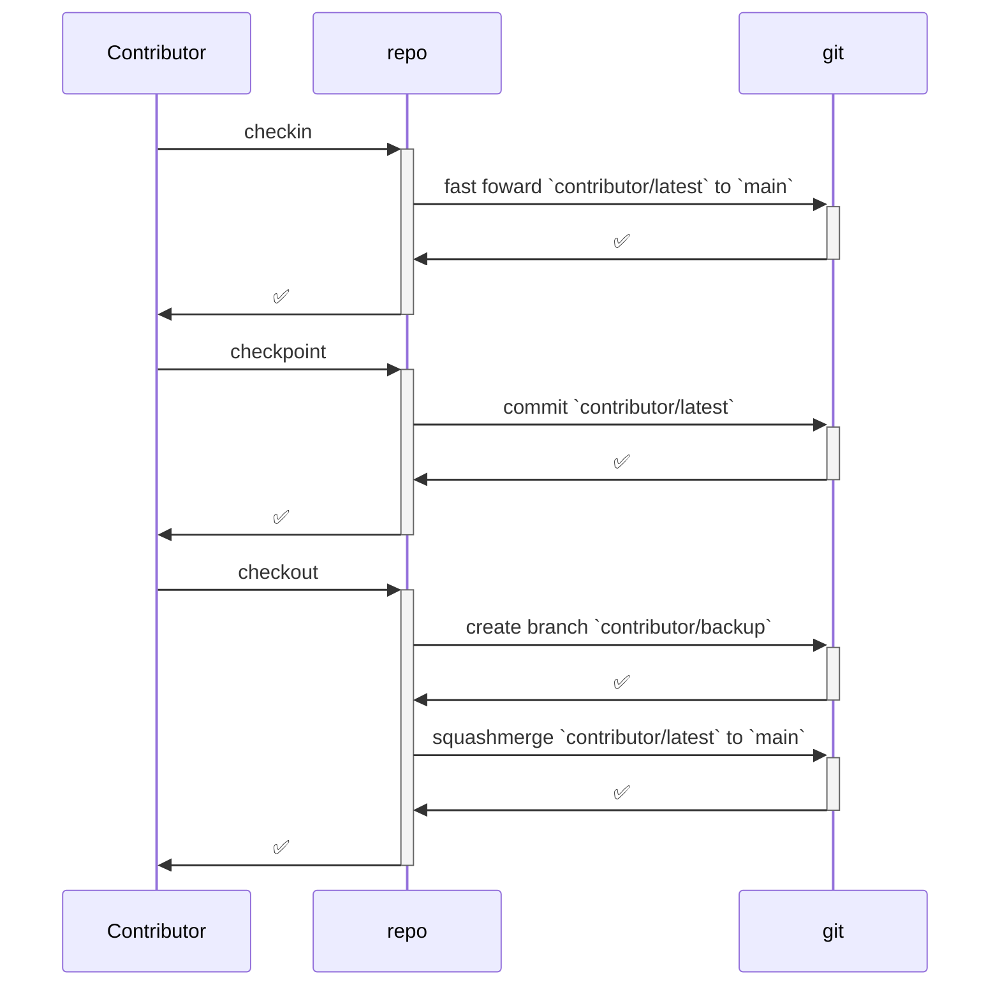
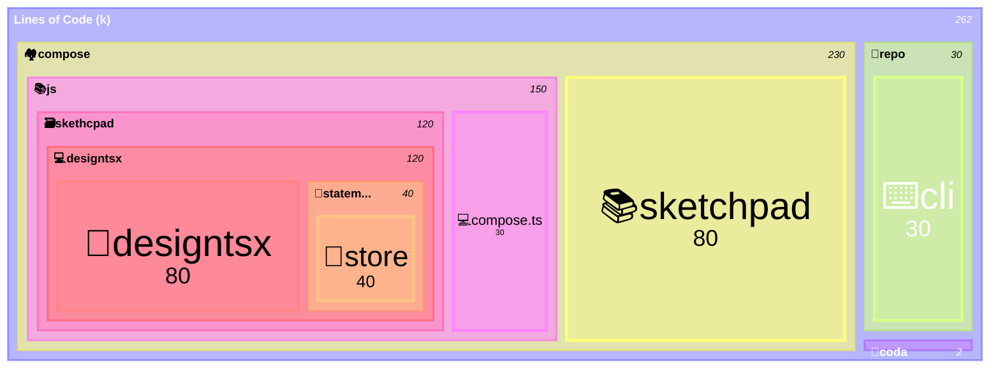
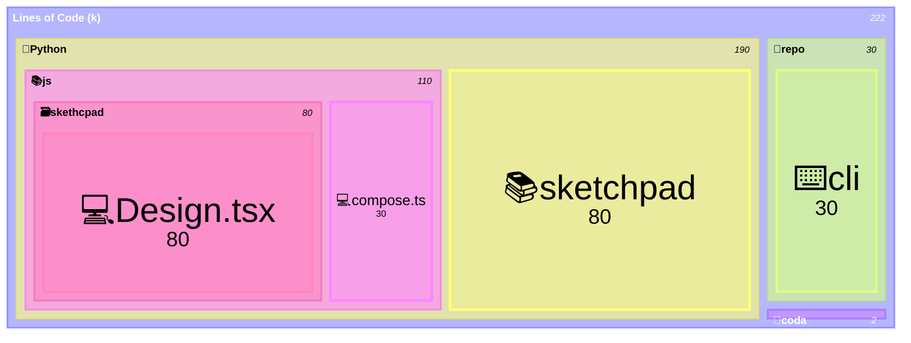

# Prompting

## Templates

---

Extend/Refactor/Change clean mechanisms to properly achieve this.
Exhaustively plan for a workforce of parallel agents.
Everything end to end for all non-legacy technology.
Use the main chat with Fable 5 High for creating the plan, then use the main chat with Opus 5 High for main plan coordination, then use multiple Sonnet 5 High agents for task execution, then use multiple Haiku 4.5 agents for read-only exploration.

---

Extend/Refactor/Change clean mechanisms to properly achieve this.
Exhaustively plan for a workforce of parallel agents.
Everything end to end.
Use a single Opus 5 agent for creating the plan, a single Cursor Grok 4.6 High agent for main plan coordination, multiple Composer 2.5 agents for task execution, multiple Composer 2.5 agents for read-only exploration.

---

Exhaustively plan for a workforce of as many parallel agents as you can.
Use the main chat with GPT 5.6 Sol Ultra for creating the plan, then use the main chat with GPT 5.6 Sol Extra-High for main plan coordination and use multiple GPT 5.6 Terra Extra-High agents for task execution and use multiple GPT 5.6 Luna Extra-High agents for read-only explorations and audits.

---

XXX is extremly adhoc. Make sure it has absolutely clean mechanisms, exhaustively feature complete and is battle-tested.
Everything end to end.

---

# 🔍️ Research

##

---

We are building a collaborative plugin-based virtual operating system with multiple backends (rs, js, C#, …), multiple renderers (react, rs+wasm+wgpu, …), etc
Every plugin has apps.
Every app has modes.
Every app works over CQRS instead of CRUD (materialization over initial pack + patch)
Every app is defining a document.
Every app has a headless engine.
Every app has a ui that uses the headless engine.
Every ui uses exclusively commands to communicate with the headless engine.
Every app is defining a custom binary representation for a document (pack).
Every app is defining a custom text representation for a document (dsl).

---

## db

---

We want to create a thrid crate: db
db is a database for efficiently storing, querying, resolving conflicts, etc for collaborative co.
We dont have CRUDs but instead use CQRS with event sourcing because we have distributed collaborative local first editing on documents. The document isnt shared but just stored once as initial document and then the current state is materialized through projection. Every document has a diff datastructure. Every command yields a diff. Every command implements inverse command calls. We have git like system for version control but addtionally with real time preview of the commands of the others (but there is only one tree of commands saved on the server).
Use an Actor Model with MPSC (Multi-Producer, Single-Consumer) channel, Append-Only Log (Write-Ahead Log) paired with Periodic Snapshots, etc

Integrate it with vcs, pack and protocol
Make an exhaustive bullet list tree we can use to implement a rust crate.

---

 We want to develop a database for efficiently storing, querying, resolving conflicts, etc for collaborative editing of large documents in rust.
We dont have CRUDs but instead use CQRS with event sourcing because we have distributed collaborative local first editing on documents. The document isnt shared but just stored once as initial document and then the current state is materialized through projection. Every document has a diff datastructure. Every command yields a diff. Every command implements inverse command calls.
We have git like system for version control but addtionally with real time preview of the commands of the others (but there is only one tree of commands saved on the server).
We want to develop our own database managment system.
Assumptions:
- Not more than a few hundrend authors edit and read in realtime
- Read doesnt need to be in real time and based on commits but several thousands can read at the same time
What architecture do you recommend? 

---

## protocol

---

We want to create a second crate: protocol
Protocol is a technology for defining custom commands (some change documents, some only affect ui). We dont have CRUDs but instead use CQRS with event sourcing because we have distributed collaborative local first editing on documents. The document isnt shared but just stored once as initial document and then the current state is materialized through projection. Every document has a diff datastructure. Every command yields a diff. Every command implements inverse command calls. Protocols are the mechanism to efficiently serialize, deserialize, store the history of all commands. Make sure they are heavily optimized for streaming, zero-copy of buffers, etc
Make an exhaustive bullet list tree we can use to implement a rust crate.

---

## pack

---

What are advanced features for creating custom protocols? We create a new technology called pack that allows for extreme optimized storage and streaming of documents. It must provide mechanisms for apps to define custom documents. Assume documents can be gigabytes large and app developers should be able to configure lazy loadable content, have uis that are incrementally loaded etc. Make an exhaustive bullet list tree we can use to implement a rust crate.

---

## brep

---

What are advanced features for a brep kernel? Make an exhaustive bullet list tree we can use to implement a rust crate.

---

## wfc

---

What are advanced wave function collapse features for generative design? Three different solvers 2d, 3d and general graph solver.
Make an exhaustive bullet list tree we can use to implement a rust crate.

---

## entropy

---

What are advanced entropy information theory features?
Make an exhaustive bullet list tree we can use to implement a rust crate.

---

## dsl

---

What are advanced features for creating domain specific languages? We want it to be declarative, it needs to be expressive for languages. We use dsl to represent documents and operations for more token efficient and readable persistence and transport than json. It needs to have support for fast compiler checking, parsing, tokenization, sanitization. We provide an editor that is not character based but token based.
Make an exhaustive bullet list tree we can use to implement a rust crate.

---

## norm

### iso

####

---

We want to create a rust crate for everything in ISO 16757
Make an exhaustive bulleted feature tree list with everything inside that norm

---

### vdi

#### 3805

---

We want to create a rust crate for everything in VDI 3805 Make an exhaustive bulleted feature tree list with everything inside that norm

---

### animate

---

How does manim work architecturally?
How does manim handle nested animations?
Make a bullet point tree of all features of manim that I can copy

---

## 🧩️elements

###

---

We are building a framework that allows users to create ui such as vscode. The framework has pure typescript classes and different renderers. We want the uis to be able to define extension possiblities. The uis (including the extensions) have no dom access. e.g. sketchpad should be a ui with a extension marketplace. How would architect our framework, so that ui can have extensions. The extensions should not be general to our framework but specific to the ui. How can we generalize this? The ui extensions should have vscode-like api. --- UI, App, Mode, WindowKind (table, diagram, scene), Window, Panel (Workbenchs, Details, Settings, Chat) Toolbar, ToolCategory, Tool, Command, Extension

It is more complicated.
sketchpad is a ui that has several apps.
Every app has several modes.
e.g. sketchpad has home app (one mode, one window kind: HomeTable), kit app (one mode, several window kinds: KitAppDiagram, KitAppTable), design app (two modes: edit and analyze. Edit has two window kinds: DesignEditDiagram, DesignEditScene. Analyze has one window kind: DesignAnalyzeScene), etc
There are several plugins such as: Energy (contributes to DesignEditDiagram, DesignEditScene, DesignAnalyzeScene, etc), Structure, etc

---

### 🗿️spatial

---

I want to create a pure typescript library for generating shapes called factories.
I have a custom brep kernel (it internally uses brepjs)
Every factory is a state machine (I want to use stately but behind an interface).
Optionally a factory can be passed to a renderer for interactive usage (such as r3f https://www.brepjs.dev/integration/r3f) with undo/redo support, dynamic display on every state, etc
The factories are pure typescript functions they must work headless and interactive.
How would you architect this?

---

## 🏘️compose

###

---

How does r3f turn the imperative three.js api into declarative react api? How is the code architected?

---

### 🦀️ rs

---

We want to achieve an async version-controlled synchronized environment inside a wasm webworker.
Key constraints:

- background synchronized authoritative graph doesnt block any wip interaction
- read on any data for any version at any time for all three graphs (kits are different for checkpoint and change - wip additionally has draft and transactions)
- writes by user only inside transaction.
- first-class non-blocking conflict resolution for drafts (e.g. if draft is moving pieces that were deleted on the authoratitive)

First idea:

- Use three webworkers with three event-sourced lanes + materialized read caches: wip, stage, authoritative
- Use version (combination of checkpoint id and change id)
- wip is the active one used by the ui
- authoritative is exactly the one of the backbone
- stage is the attempt to merge changes of wip into authoritative
- synchronization between three graphs exclusively happens over changes (forwards and backwards operations)
- local backbone (folder with .compose folder with four sqlite files: wip.db, stage.db, authoritative.db, conflicts.db and file blobs are globally stored under blobs/BLOBHASH.EXT)
- dev backbone (everything embedded in one json file)

Non-goals:

- Dont leak backbone logic into target architecture (they are just at runtime attatchable and detachable persistence)
- No general Json as part of graphql or rust - just hardcoded and typesafe buissness logic
- dont change the target grapqhl schema structurally, only extend it

How would you implement/refactor/rewrite compose/rs/lib.rs for this?

#schema.graphql #compose/rs #metabolism.kit.compose.json

---

We have different backbones:

- dev backbone (complete embedded json file)
- local backbone (.compose/kit.db sqlite file for all data excluding files and .compose/blobs/BLOBHASH.EXT for files.)
- remote backbone (stub for bidirectional connection to compose/hub)
  We have three in-memory kit graphs:
- wip (current)
- merged (testbed for applying changes from wip to authorative)
- authorative (from backbone)
  We have a coordinator task that on changes clears the merged graph, pulls the authorative and tries to apply the changes from wip. On success it proposes the changes to the server. On conflicts it saves the conflicts.
  How would you architect the backbones?

---

We want to add support for backbones (persisted out-of-process kit graphs).
Requirements:

- Keep two kit graphs in-memory (wip and backbone)
- Both are non-blocking and can be updated all the time
- Bidirectional communication
- Synchronization mechanism with first-class conflict resolution support
  How would you architect this?

---

Testing every single command of the store in every order is not an option.
We want to have a small dev test ui where we can check every single feature of the store manually.

- Every single command MUST be testable and have clean ui (dropdowns, etc)
- An events notification, so we see if the correct events are fired.
- Inspection that the commands produce correct diffs.
- Materialized kit snapshots
  What are the options?
  We want to minimal tooling so mistake surface is minimal.

Here are the specs of our system:

- `kit store` is a complete in-memory graph and offers the api to do everything.
- `kit backbone` is an async storage layer that persists the kit store to a storage layer. It is not only sink but also source.
- `kit tree` is the tree of all checkpoints.
- `initial kit` is a kit snapshot.
- `kit checkpoint` is a compressed list of kit changes with an optional message, timestamp and authors.
- `kit session` is a stateful session that a client can open (e.g. when sketchpad opens a kit for the first time a kit session is opened).
- `kit draft` is a draft is a stack of kit transactions for a checkpoint within a session. Undo/redo support. A draft is only allowed on the last checkpoint of an alternative or the last checkpoint of `the kit`.
- `kit transaction` is a raw list of kit changes for a draft. Undo/redo support.
- `kit alternative` is a named list of checkpoints (starting from `the kit` and then more linear checkpoints). Multiple alternatives can shared checkpoints. Checkpoints are stored individually.
- `kit diff` is a diff to a kit snapshot.
- `kit command` is a command to a `kit store`
- `kit read command` is a read-only command to a `kit store`
- `kit change command` is a command that changes part of the kit within a `kit transaction`
- `kit snapshot` is a point-in-time representation of a kit.
- `materialized kit` is a computed kit snapshot that is computed from an initial kit
- `the kit` means the the last materlialized from non-alternative
- `kit release` is checkpoint that is marked for released and is additionally stored as materialized kit.

---

### 🟨️js

We have an async backend that has CQRS Dual-Bus Actor Model.
Every request is fire-and-forget and returns an id.
There MUST be no state on the store and every read is a request to the backend.
There is an event stream that returns results which contain the information.
Now we want to implement a clean Typescript Store class.
How would you architect this?

### ⭕️diagram

---

We want to develop a high-performant infinite-canvas diagram canvas component.

We have a diagram that have nodes (circles) with handles around (small circle) and edges (edges bezier curves that are tangent to the node circle between the handles). We have a diagram that have nodes (circles) with handles around (small circle) and edges (edges bezier curves that are tangent to the node circle between the handles). Nodes and edges are selectable and draggable. Nodes and edges are selectable and draggable.

It should be imperative wasm rust tiling-based rust gpu-based ts-bindings declarative-react canvas-based rendering.

1. rs
   Use https://github.com/linebender/vello Implement it in @compose/lib/diagram/rs/lib.rs
2. js
   typscript native bindings to rs. imperative like https://github.com/mrdoob/three.js/ Implement in @compose/lib/diagram/js/index.ts
3. react
   declarative react bindings to js. same architecture as https://github.com/pmndrs/react-three-fiber ontop of three.js. Implement in @compose/lib/diagram/react/index.tsx

How would you architect this?

---

## 🧰️repo

repo:
The cli and the server MUST be refactored to work together. The cli MUST remain go. The server MUST be next.js server (web with dashboard, auth, api, admin pages) with a postgres database and pg-boss as queue. The server is publicly accessible. It MUST only accept requests from trusted developers.
The entire .repo folder currently has the entire data and history. Everything that is not temporary MUST be moved outside of the repo folder. It MUST live in a postgres database on the server (schema under repo/postgres/schema.sql). The server is additionally a discord bot that send messages to different channels on the community discord server. All events trigger a message to the discord server.
On the client, the only things that are kept are cache, temporary folders and the prompt files.
When a ticket is opened, then a temporary folder under `.repo/🎫️/{{ticket-id}}` is created. When the ticket is closed, then the temporary folder including all files is sent to the server and removed from the client. The entire logging that happens currently on client side MUST be moved to the server side. Create
Setup everything with docker compose for the server.
Migrate all existing history to the database. When data is in different format, try to convert it to the new format otherwise drop it.
Make sure to test everything before I deploy it on a Linux VM.

### ⌨️cli

Whenever invoking this command, regardless of the port, the container is being killed aswell stopping all running work. Make sure that the agent hooks deny this and give a meaningful reason.
kill $(lsof -t -i:9876)

We are building a general tool that abstracts source control managment tools like git.
It should provide task-focused and simplified
The workflow in git is:
Every person has a working branch `{{contributor-name}}/latest`.
Whenever a person starts working `{{contributor-name}}/latest` is fast-forwarded to the latest `main`.
Every time a person finished working, then a temporary branch `{{contributor}}/YY/MM/DD` is created at the current `{{contributor-name}}/latest`

We want to develop a general hook system that works accross all ai tools (claude code, vscode agent, cursor agent, windsurf agent, droid). One go binary exposes general hooks that can be reused accross platforms. How would you design the system? It needs to be compatible with the following apis:
https://code.visualstudio.com/docs/copilot/customization/hooks
https://docs.windsurf.com/windsurf/cascade/hooks#hook-events
https://cursor.com/en/docs/agent/hooks
https://code.claude.com/docs/en/hooks-guide
https://docs.factory.ai/cli/configuration/hooks-guide

## Later

repo:
Write scripts to handle all git interactions and make them available as vscode launch (create archive branch `{{contributor}}/<{{YY}}/{{MM}}/{{DD}}`, checkout to `main` squash merge `{{contributor}}/latest>` into `main`), etc

- Merge (prioritize me)
- Merge (prioritize main)
- Pull # fast forwards `{{contributor}}/latest>` to `main`

sketchpad:

Unify tools and commands

elements:

Update tree to not have sections but every section should have a tree. A tab should have multiple sections. A side panel has multiple tabs.

- Id system should be slugged to make sure no illegal characters are used.

# 🛠️ Changes

TODO: Add roomie to discord for verification

TODO: Start new project `elements` that offers domain-agnostic primitives (such as multi-lingual ui and cross-plattform desktop with App for multi-device, multi-window ui where sketchpad/coda can use all primitive functionality. Introduce sidebar (no need for mobile support) for system trays, companions and side panels e.g. rhino plugin)t

##

---

The current goal of where all apps are combined into workflows nodes, remain non-destructive and have a headless engine that replays everything will not work because every single ui interactions must be saved and checked in into vcs which will become too slow.
Instead we adjusted the design:
We introduce interactions.
Interactions are an abstraction for interactively and dynamically creating mutations.
Interactions are a new level in the vcs between edits and mutations (An edit has interactions, an interaction yields mutations, every mutation yields a diff, hence an interaction transitiviely also yields diffs which can be merged into a total interaction diff)
Interactions are state machines (the state is called config which is no longer local but checked in into vcs)
An interaction takes an artifact and a config as an input and returns mutations for that artifact.

Nodes in a workflow are no longer apps but interactions.
Operations have a config with parameters

e.g. puzzle 3d fill is an interaction.
stochastic-extend is a mutation that takes a number, a distribution, a seed and then adds the number of objects to the aggregation depending on the distribution.
The fill interaction has a count slider, a seed stepper, a distribution tree. 
When the slider is increased, then the stochastic-extend mutation is called with the new count, the same distribution and the same seed. When the slider is decreased, then the number for stochastic-extend is decreased. The special part is that when the slider is increased again, then a new stochastic-extend is started with for the remaining new objects. This achieves the experience that when the slider is decreased and ramped up again, then the new objects are always
- 

---

The current goal of where all apps are combined into workflows nodes, remain non-destructive and have a headless engine that replays everything will not work because every single ui interactions must be saved and checked in into vcs.
Instead we adjusted the design:
We introduce operations.
Operations are a new level in between edits and mutations (An edit has operations, an operation yields mutations, every mutation yields a diff, hence an operation transitiviely also yields diffs which can be merged into a total operation diff)
An operation takes an artifact and parameters as an input and returns mutations for that artifact. 
Nodes in a workflow are no longer apps but operations.
Operations have a config with parameters
Operations are state machines (depending on some parameters others )
- 


 and introduce a new abstraction:

```
<artifact>
  schema
    mutations
      <mutation>
        dependencies
          read
            snapshot
              dependencies
                <dependency> e.g. name
                  component.rs
                <inference> e.g. flatPosition
                  component.rs
                  …
          write
            snapshot
              dependencies
                <dependency> e.g. name
                  component.rs
                <inference> e.g. flatPosition
                  component.rs
                  …
    compaction
      component.rs
      examples
        assets
          <assetfile>
        tests
          component.rs
        
```

---

All tools and utilities must display the current diff

---

Currently there is just a general app system.
Make it more specific and make sure that every artifact has a viewer (read-only) and an editor.
It is possible for plugins to register different viewers and editors for other artifacts.
The user can open artifacts in different viewers and editors and configure default viewers and editors per artifact kind.

```
<artifact>
  viewer
    windows
      <window>
        component.rs
        component.ts
        …
    …
  editor
    windows
      <window>
        component.rs
        component.ts
        …
    …
        
```

---

Mutations must be able to call other mutations.
Plugins can depend on other plugins.
Plugins can register mutations and inferences on artifacts defined by other plugins.

---

All mutations must produce a diff along with messages (level: info, warning, error, fatal).
Conflicts are first class citizens only fatal messages prevent
Introduce different policies for merges (laissez-faire, normal, vigilant)
On laissez-faire mode only fatal messages prevent the merge.
On normal mode only errors prevent the merge and warnings are ignored.
On vigilant mode, merge is rejected on any warning.
When working alone then errors and conflicts shouldnt arize because everything should be implemented in a way that all illegal actions are prevented etc.
Due to the collaborative nature of the event sourcing system and the merging of mutations, it can always happen that errors or conflicts arise when trying to merge changes chronologically (new order due to time stamps).
e.g. when a user modifies a part and in the mean time another user deletes that part, then all mutations that modified dont have any effect and when merging the changes.

---

Extract and refactor all modules in the repo.
The repo must follow the <semantic or list>/<specific>
e.g. inferences/<inference>/component.rs
e.g. mutations/<mutation>/component.rs
etc
Every shared code must be in modules. Avoid modules and onyl introduce when two components would otherwise repeat the same code.
models can be on framework level, product level, plugin level, app level, etc.
Always as specific as it can be.

e.g. this is not an inference: /Users/ueli/Documents/semio/✏️s/🔌️plugins/🗄️stdio/🗿️artifacts/🧊️gltf/🏅️standards/🔖️2.0/🪆️subsets/✳️any/🧬️schema/💡️inferences/📐️geometry/🦀️component.rs

---

Achieve the following end to end:

- A running hub with
  - users that can create and share spaces.
  - spaces are persisted in db.
  - space share presence inside an app with the same artifact peer to peer between all active users.
  - 

---

Collaboration in spaces is 

---

All well known artifacts must cleanly roundtrip through import and export.
Use these files to test the snapshot, diff, mutation, io system etc.
Only stop once the export is identical to the import.
temp/📄️bachelor-thesis.pdf
temp/architectural_example.dwg
temp/artifacts.svg
temp/bauen-mit-bestand.mp4
temp/domai-specific-programmaning-language-for-architects.pptx

---

hover and selection must be first class citizens (with folders mechanisms, etc) in apps and not be part of e.g. commands.
Make sure that the mechanism is fullblown, automatically has support for declarative transitive hover, the different selection modes, and it cleanly integrates into app config, is broadcasted over presence, etc

---

The following architecture must be reached:
- Every artifact has a schema, snapshot, diff, mutations, inferences, io system.
- Every artifact is tracked over vcs.
- Every artifact has children artifacts that have their own version history and referenced artifacts that also have their own version history.
- Every app consumes and produces artifacts.
- Every app has a headless engine, modes, config, presence, transient.
- Every mode has windows, config, presence, transient.
- Every window has actions, utilities, options, config, presence, transient.

Get the demonstrator working again end to end with the new architecture.

---

The state management system is extremely adhoc.
Make sure that only these 4 different mechanisms are used and enforced by api and policies:
artifacts are persisted shared state.
config is persisted local-only state.
presence is ephemeral shared state.
transient is ephemaral local-only state.

---

Introduce compaction to the artifact system.
Every mutation defines read dependencies and write dependencies on the schema (either from snaphot or inferences)

First automatic compaction is done by the engine and then the manual compaction for each artifact kind is done.

Automatic compaction e.g. includes:
- When then the diff is empty, then the mutation can be skipped (e.g. renaming something with the name that it already has, flattening a design twice, etc)
- 


Every artifact must define inside schema: `compaction/component.rs` that receives a list of mutations and produces a compacted list of mutations.

e.g. when a mutation only affects a static subset of the schema and rerunning the mutation again just overwrites the same data, then only the last mutation wins, as long as no other mutation needed that data in between.
an


```
<artifact>
  schema
    mutations
      <mutation>
        dependencies
          read
            snapshot
              dependencies
                <dependency> e.g. name
                  component.rs
                <inference> e.g. flatPosition
                  component.rs
                  …
          write
            snapshot
              dependencies
                <dependency> e.g. name
                  component.rs
                <inference> e.g. flatPosition
                  component.rs
                  …
    compaction
      component.rs
      examples
        assets
          <assetfile>
        tests
          component.rs
        
```

---


---

The process models need to be 

---

Every window must have actions, utilities, options folder, etc.
Make sure this is enforced by policies and all breaches are fixed.
e.g. ✏️s/🔌️plugins/🌀️procedural/🎛️apps/🧊️3d/🎭️modes/✏️edit/🪟️windows/👁️preview

```
s
  plugins
    <plugin>
      <app>
        <mode>
          <window>
            actions
              <action>
                component.rs
                component.ts
                …
            utilities
              <utility>
                component.rs
                component.ts
                …
            options
              <option>
                component.rs
                component.ts
                …
            presence
              <presence>
                component.rs
                component.ts
                …
```

---


---

Artifacts must not have an engine but only a schema, snapshot, diff, mutations, inferences, io system.
Evera app has a an engine which is a state machine that is controlled by the app. The communication between the app and the machine is bidirectional.
machine is a core framework-provided full blown state machine implementation.
State machines emit events on transitions (mutations: shared events that are tracked over vsc, presence: ephemeral events that are broadcasted to others inside a space, etc ). Some state is persisted shared (inside artifacts), some is persisted local-only (inside config), some is ephemeral local-only, some is ephemeral shared (such as cursors, cameras, etc). Specific information may overlap e.g. camera is both persisted locally and also empheraly shared on changes.

---

Every subset has its own implementation and examples should only be on subset level.
Every feature needs to be tested.
At least one real-world example per subset needs to roundtrip through the snapshot, diff, mutations, inferences, io system.

---

Dissolve and unify all kernels, modules, etc into artifacts with schema, snapshot, diff, mutations, inferences, etc.
e.g. 2d, mesh, brep, etc
No regular, CRUD-based implementation must remain, only CQRS event-sourced implementations over schema, snapshot, diff, mutations, inferences, etc.

---

The current dev setup is focused on vscode. We are moving away to a self-contained dashboard tui.
dashboard is becoming the new way for devs to start dev, build, test, etc
The windows are different processes, navigation between should be possible, every is multiplexed, etc. Every window has utilities such as copy output to clipboard etc.

---

The current artifact system is adhoc.
Every artifact must be composable (and appear as child) or referenceable (and appear only as link).
Hence every artifact can depend on other artifacts.
Make sure to generalize, abstract, disolve, unify all artifacts from the plugins into the stdio plugin.
e.g.
procdudure3d uses flow and brep (inferred artifact)
fem uses mesh
lowpoly uses mesh
object uses mesh, brep
model uses objects
cad uses models
document uses text, image, video, audio, etc
video uses images, audio, etc
etc
Everything must be fully integrated with version control, history, collaboration, etc over cqrs mutation-based event-sourcing, etc

---

The mutations are extremely adhoc.
Instead of generic mutations there must be semantic handcrafted (rename, update, flatten, etc) mutations for everything.
Every mutation creates a diff and implements calls for all inverse mutations.
See the legacy compose/client/schema/graphql/schema.golden.graphql for reference of a more complete schema.

---

Introduce inferences to every artifact schema.
A snapshot is a data structure that describes all the information that is persisted.
A diff is a data structure that describes all the information that can be changed on a snapshot.
A mutation is a data structure that holds all the creating a valid diff.
An inference is a data structure that holds all the information that can be inferred from a snapshot.
Caching must be optional and configurable with fullblown support for dependecies, etc

e.g. flatPosition (plane and centers) for objects are inferred and cached and only change when the parent position changes or the parent vortex changes or the object vortex changes.

Integrate it into the schema and complete everything.

---

The schemas for the artifacts are extremely adhoc.
Every snapshot must be exhaustively types and not fallback on generic key value pairs such as in ✏️s/🔌️plugins/🗄️stdio/🗿️artifacts/🧿️semio/🏅️standards/🔖️v1/🪆️subsets/✳️mesh/🧬️schema/📸️snapshot/🔗️component.graphql
See legacy compose/client/schema/graphql/schema.golden.graphql for reference of a more complete schema.
Overhaul and complete everything.

---

At the heart of everything are artifacts. The make different apps interoperable and integratable into existing projects because due to import and export to common artifacts.

The most important artifacts are the inbuilt semio artifacts because they are all designed to work with each other and import and export smoothly.

Extract all adhoc artifacts from all s plugins and include them in stdio plugin. Implement the the fullblown import/export architecture for all artifacts.

e.g.
brep <-> step, etc
mesh <-> gltf, stl, etc
model <-> ifc, etc
drawing <-> dwg, svg, pdf, etc
image <-> png, jpg, gif, etc
video <-> mp4, avi, etc
audio <-> mp3, wav, etc
…

```
s
  plugins
    stdio
      artifacts
        semio
          standards
            v1
              subsets
                <subset> # e.g. brep, mesh, model, object, document, cad, drawing, image, video, audio, animation, presentation, workflow, etc.
                  engine
                    component.rs
                    component.ts
                    …
                  schema
                    snapshot
                      …
                    diff
                      …
                    mutations
                      …
                  io
                    importers
                      artifacts
                        <artifact>
                          standards
                            <standard>
                              subsets
                                <subset>
                                deserializers
                                  <deserializer> # e.g. text, binary, json, xml, etc
                                    component.rs
                                    component.ts
                                    …
                                  component.rs
                                  component.ts
                                  …
```

---

Complete all artifact implementations for all artifacts and standards and subsets.
Make sure that all artifacts implement all serializers and deserializers and all importers and exporters to all possible other artifacts.

---

```
s
  plugins
    stdio
      artifacts
        <artifact> # e.g. brep, mesh, object, document, cad, drawing, raster, video, audio, animation, etc.
          engine
            component.rs
            component.ts
            …
          schema
            snapshot
              …
            diff
              …
            mutations
              …
          io
            importers
              formats
                <format> # e.g. gltf (including both .gltf and .glb), pdf, png, etc
                  standards
                    <standard> # e.g. 2.0 for pdf, 4x3 for ifc, AP225 for STEP, etc,
                      subsets
                        <subset> # e.g. x, vt, h for pdf, cv20, sav, cobie for ifc 2x3, cc0, cc1, cc2, cc3, cc4, cc5, cc6 for STEP, etc
                        deserializers
                          <deserializer> # e.g. json, binary, etc
                            component.rs
                            component.ts
                            …
                          component.rs
                          component.ts
                          …
            exporters
              formats
                <format> # e.g. gltf (including both .gltf and .glb), pdf, png, etc
                  standards
                    <standard> # e.g. 2.0 for pdf, 4x3 for ifc, AP225 for STEP, etc,
                      subsets
                        <subset> # e.g. x, vt, h for pdf, cv20, sav, cobie for ifc 2x3, cc0, cc1, cc2, cc3, cc4, cc5, cc6 for STEP, etc
                        serializers
                          <serializer> # e.g. json, binary, etc
                            component.rs
                            component.ts
                            …
                          component.rs
                          component.ts
                          …
      formats
        <format> # e.g. gltf (including both .gltf and .glb), pdf, png, etc
          standards
            <standard> # e.g. 2.0 for pdf, 4x3 for ifc, AP225 for STEP, etc,
              subsets
                <subset> # e.g. x, vt, h for pdf, cv20, sav, cobie for ifc 2x3, cc0, cc1, cc2, cc3, cc4, cc5, cc6 for STEP, etc
```

---

The current architecture has artifacts but now artifacts and formats should be separated.
Artifacts are the shared abstractions of the data. Formats are for io.

```
s
  plugins
    stdio
      artifacts
        <artifact> # e.g. brep, mesh, object, document, cad, drawing, raster, video, audio, animation, etc.
          schema
            snapshot
              …
            diff
              …
            mutations
              …
            …
          …
      formats
        <format> # e.g. gltf (including both .gltf and .glb), pdf, png, etc
          standards
            <standard> # e.g. 2.0 for pdf, 4x3 for ifc, AP225 for STEP, etc,
              subsets
                <subset> # e.g. x, vt, h for pdf, cv20, sav, cobie for ifc 2x3, cc0, cc1, cc2, cc3, cc4, cc5, cc6 for STEP, etc
```

---

The artifact standard subsets are not correctly implemented.

e.g. pdf has a,x,e,ua,vt,h subsets.
PDF/A (Archiving): Designed for long-term document preservation. It ensures a document looks exactly the same in the future by embedding all necessary information, such as fonts and colors.
PDF/X (Exchange): Created for the printing and publishing industry to ensure high-quality, professional printing.
PDF/E (Engineering): Used for technical documents, allowing for the embedding of 3D models and interactive visualizations.
PDF/UA (Universal Accessibility): Designed to ensure files can be navigated and read by assistive technologies, such as screen readers.
PDF/VT (Variable and Transactional): Tailored for high-volume variable data printing, such as customized invoices or bank statements.
PDF/H (Healthcare): A set of best practices (though not an official ISO standard) for securely storing and exchanging medical records

e.g. step has cc0, cc1, cc2, cc3, cc4, cc5, cc6 subsets.
CC1 (Configuration Data Only): Only includes metadata like part versioning, release status, assembly structure, and authorization data. It contains no 3D shape data.
CC2 (Basic Surfaces/Wireframes): Includes CC1 plus basic shape representations using bounded wireframes and simple surface models.
CC3 (Wireframes with Topology): Includes CC1 plus advanced 3D wireframe models that include topological data (how the lines connect).
CC4 (Manifold Surfaces): Includes CC1 plus manifold surface models with topology (essentially "hollow" 3D shells).
CC5 (Faceted B-Rep): Includes CC1 plus faceted boundary representation (models made up of flat polygons/triangles, similar to an STL file).
CC6 (Advanced B-Rep): Includes CC1 plus advanced boundary representation. This is the standard solid 3D model. When you export a standard, solid STEP file from CAD software like SolidWorks, Inventor, or NX, you are usually utilizing CC6.

e.g. ifc 2x3 has cv20, sav, cobie subsets.
Coordination View 2.0 (CV 2.0)	The industry standard for coordinating 3D models between architectural, structural, and MEP (mechanical, electrical, plumbing) disciplines. It focuses heavily on spatial geometry.
Structural Analysis View	Transfers analytical structural models (nodes, loads, and connections) to structural engineering and calculation software.
Basic FM Handover (COBie)

e.g. ifc 4 has rv, dtv subsets.
Reference View (RV)	Designed for read-only coordination (like clash detection). It simplifies complex geometries into basic shapes. Because the model cannot be easily reverse-engineered, it protects the author's intellectual property.
Design Transfer View (DTV)	Designed for a higher-fidelity, one-way handover. It attempts to retain parametric data (like an extruded wall) so the receiving party can import and edit the elements in their own software.

etc.

---

The current codebase doesnt follow clean architecture.
e.g. the open closed principle is extensively violated a lot such as:
- s is an os. os shouldnt depend or know anything from s.
  - 🧰️framework/🔨️modules/🔺️mesh/🦀️component.rs implements plenty of stdio functionality which is part of s studio plugin.
  - wrong registrations such as 🧰️framework/🔨️modules/🚪️io/📇️registry/📇️catalog.json
- s must not depend or know anything from any plugin.
  - plugins can have dependencies on other plugins.
- any plugin must not depend or know anything from any extension.
  - extensions can have dependencies on other extensions and/or dependencies.

---

The current schemas are extremely adhoc.
Every snapshot must be a complete semantic model of the artifact.
Every diff must be handcrafted and be able to change every single field of the artifact - Analyze how the old compose pattern for diffs worked (both strong and weak entities) compose/client/schema/graphql/schema.golden.graphql
Ever mutation must return a handcrafted diff.
Find all generic code and replace it with specific code.

---

The current artifact mechanisms are extremely adhoc. Most implementations are just stubbed, the latest standards of the major common artifacts are not implemented, the builder/analyzer/composer are not composable, properly abstracted, clean mechanisms are missing and are not enforced.
Overhaul and complete everything.
The goal is to have a an artifact system where artifacts can evolve, adhere to existing specifications and are fully integrated into the os system (apps can reuse the builder/analyzer/composer of other plugins).
Everything must be thought together (schema, standards, subsets, version control, multi-user, etc)
You must use existing files for testing (recreate them by using the anaylzer and then the builder).
Here a list of examples (copy them over to the artifact example assets folder):
- ♻️mit-bestand/🎤️präsentation/📅️33.projektetage/🌐️public/📄️bachelor-thesis-ueli-saluz.pdf
- temp/architectural_example.dwg
- 🧰️framework/🔨️modules/🖼️assets/🖼️images/🖼️dancing.gif
- 🧰️framework/🔨️modules/🖼️assets/🌱️metabolism/🎨️representation/🧊️base.glb

Some more violations:
e.g. gltf and glb are not different artifact, just different serialization of the same artifact.
e.g. most test are not real tests for testing artifacts internals but just stubs such as ✏️s/🔌️plugins/💠️lowpoly/🗿️artifacts/💠️lowpoly/📚️examples/🎬️demo/🧪️tests/🦀️test.rs
e.g. the builders must be specific to where they are such as ✏️s/🔌️plugins/🗄️stdio/🗿️artifacts/🎨️svg/🏅️standards/🔖️1.1/🪆️subsets/✳️any/🏗️builder/🦀️component.rs which should be usable to build a full 1.1. svg artifact

---

The current import export architecture is extremely adhoc.
Make sure that every single artifact can be implemented independantly for different standards and subsets.
When making changes across our own artifacts, dont bump standard. We are still at v1 and use no subsets yet.
Use the * subset for everything.
The builder, analyzer, composers need to be composable and in the end every artifact exports one final one each with support for different standards and subsets all at once (e.g. composer can read different standards, different subsets and write a new artifact for a specific new standard and subset)

```
s
  plugins
    stdio
      artifacts
        <artifact> # e.g. gltf (including both .gltf and .glb), pdf, png, etc
          builder # only for creating new artifacts
            component.rs
            component.ts
            …
          analyzer # read-only for existing artifacts - former decomposer
            component.rs
            component.ts
            …
          composer # combining builder and analyzer
            component.rs
            component.ts
            …
          standards
            <standard> # e.g. 1.6 for pdf, 2x3 for ifc, AP225 for STEP, etc,
              builder # only for creating new artifacts
                component.rs
                component.ts
                …
              analyzer # read-only for existing artifacts - former decomposer
                component.rs
                component.ts
                …
              composer # combining builder and analyzer
                component.rs
                component.ts
                …
              subsets
                <subset> # e.g. a or x for pdf, CV 2.0 or Structural Analysis View for ifc, Conformance Class 6 for STEP, etc
                  snapshot
                    …
                  diff
                    …
                  mutations
                    …
                  builder # only for creating new artifacts
                    component.rs
                    component.ts
                    …
                  analyzer # read-only for existing artifacts - former decomposer
                    component.rs
                    component.ts
                    …
                  composer # combining builder and analyzer
                    component.rs
                    component.ts
                    …
                  io
                    import
                      deserializers
                        artifacts
                          <artifact> # e.g. json for gltf, binary for glb, etc
                            <standard> # e.g. 1.0 for pdf, 2x3 for ifc, AP225 for STEP, etc
                              <subset> # e.g. a or x for pdf, CV 2.0 or Structural Analysis View for ifc, Conformance Class 6 for STEP, etc
                                component.rs
                                component.ts
                                …
                              component.rs
                              component.ts
                              …
                            component.rs
                            component.ts
                            …
                          component.rs
                          component.ts
                          …
                        component.rs
                        component.ts
                        …
                      component.rs
                      component.ts
                      …
                    export
                      serializers
                        artifacts
                          <artifact> # e.g. json for gltf, binary for glb, etc
                            <standard> # e.g. 1.0 for pdf, 2x3 for ifc, AP225 for STEP, etc
                              <subset> # e.g. a or x for pdf, CV 2.0 or Structural Analysis View for ifc, Conformance Class 6 for STEP, etc
                                component.rs
                                component.ts
                                …
                              component.rs
                              component.ts
                              …
                            component.rs
                            component.ts
                            …
                          component.rs
                          component.ts
                          …
                        component.rs
                        component.ts
                        …
                      component.rs
                      component.ts
                      …
                  component.rs
                  component.ts
                  …
                component.rs
                component.ts
                …
            component.rs
            component.ts
          …
        component.rs
        component.ts
        …
      component.rs
      component.ts
      …
```

---

The exporter and importers are still extremely adhoc.
Every artifact must be importable and exportable to existing file types.
Existing file types are now also just artifacts. A existing wkt such as gltf uses other artifacts (json for .gltf, binary for .glb) for io.
Bundle all well known files types into a stdio plugin that has no apps and only defines artifacts.
All artifacts must have a builder and a decomposer which is the main utility that is usable by other plugins.


```
s
  plugins
    stdio
      artifacts
        <artifact> # e.g. gltf, pdf, png, etc
          schema # definition of the document model for the format
            snapshot
              text
                component.grammar.semio
                component.ebnf
                component.g4
                component.graphql
                component.json
                component.proto
                component.rs
                component.ts
                …
              binary
                component.protocol.semio
                component.abnf
                component.ksy
                component.spicy
                component.rs
                component.ts
                …
            diff
              text
                component.grammar.semio
                component.ebnf
                component.g4
                component.rs
                component.ts
                …
              binary
                component.protocol.semio
                component.abnf
                component.ksy
                component.spicy
                component.rs
                component.ts
                …
            mutations
              <mutation>
                diff
                  component.rs
                  component.ts
                  …
                inverse
                  component.rs
                  component.ts
                  …
                mutation
                  component.rs
                  component.ts
                  …
                …
              …
            …
          builder # utility helper to build the artifact (acepts mutations, diffs, different representations such as text, binary, etc)
            component.rs
            component.ts
            …
          decomposer # utility helper to decompose an artifact (from multiple sources, with only partial information, wrong or missing data, etc)
            component.rs
            component.ts
            …
          io
            import
              deserializers
                artifacts
                  <artifact> # e.g. json for gltf, binary for glb, etc
                    component.rs
                    component.ts
              …
              component.rs
              component.ts
              …
            export
              serializers
                artifacts
                  <artifact> # e.g. json for gltf, binary for glb, etc
                    component.rs
                    component.ts
              component.rs
              component.ts
              …
          …
```

---

Every artifact has a text and binary representation.
```
<artifact>
  text
    component.grammar.semio
    component.ebnf
    component.g4
    component.graphql
    component.json
    component.proto
    …
  binary
    component.protocol.semio
    component.abnf
    component.ksy
    component
  snapshot
    text
      component.grammar.semio
      component.ebnf
      component.g4
      component.graphql
      component.json
      component.proto
      …
    binary
      component.protocol.semio
      component.abnf
      component.ksy
      component.spicy
      …
  diff
    text
      component.grammar.semio
      component.ebnf
      component.g4
      …
    binary
      component.protocol.semio
      component.abnf
      component.ksy
      component.spicy

  …
```

---

Every artifact has a schema (all available fields of an artifact regardless if stored, derived, project or not, etc), a snapshot has a schema (all persisted data for a complete artifact without any version history), a diff has a schema (all changes that can be applied to an artifact).
All mutations construct from their arguments a diff.

```
<artifact>
  schema
    component.rs
    component.ts
    component.graphql
    component.json #json schema
    component.proto
    …
  snapshot
    schema
      component.rs
      component.ts
      component.graphql
      component.json #json schema
      component.proto
      …
  diff
    schema
      component.rs
      component.ts
      component.graphql
      component.json #json schema
      component.proto
      …
  …
```


---

The repo is aiming towards zero-runtime-dependency outside of system dependencies. For testing purposes it should use existing libraries to test the implementation. The repo must be able to be used as a library.

```
<plugin>
  artifacts
    <artifact>
      snapshot
        grammar
          component.grammar.semio
          component.ebnf
          component.g4
          …
        protocol
          component.protocol.semio
          component.abnf
          component.ksy
          component.spicy
          …
      mutations
        <mutation>
          diff
            component.rs
            component.ts
            …
          inverse
            component.rs
            component.ts
            …
          mutation
            builder.rs
            builder.ts
            …
          …
        …
      …
    …
  …
```

---

The current examples are extremely adhoc. Examples have assets, tests, etc. Examples are used for demonstration purposes, for testing purposes, etc.
e.g. wrong ✏️s/🔌️plugins/✒️writer/🗿️artifacts/✒️writer/📚️examples/♻️reuse/🎒️packs/♻️reuse/🦀️component.rs

```
<plugin>
  artifacts
    <artifact>
      examples
        <example>
          assets
            <name>.pack.semio
            <name>.spr.semio
            <name>.dsl.semio
            <name>.op.semio
          tests
            test.rs
            test.ts
            …
          …
```

---

Currently commands that change the document by returning a diff are called operations. Rename to mutations. Dont keep any legacy. Make sure that op (the custom grammar for mutations)
A mutation is declarative and returns a diff. Every mutation has an implementation for inverse mutations (list of arguments for calling other mutations to revert the mutation).
Every artifact defines mutations.
Every artifact must have an enigne. The engine is a state machine where every transition is a mutation.
The engine is ui-independant and only accepts mutations.

```
<plugin>
  artifacts
    <artifact>
      mutations
        <mutation>
          diff
            component.rs
            component.ts
            …
          inverse
            component.rs
            component.ts
            …
          mutation
            builder.rs
            builder.ts
            …
          …
        …
      …
    …
  …
```

---

```
<framework|s|etc>
  bundles
    <>
```

---

Every plugin defines artifacts, every artifact has examples, every enigne has examples, etc Place and create for everything examples where they belong.
Every custom format must use .semio extension at the end. Add the internal hierarchy on the file name just for readability but the format process must be able to derive it only from the content.
There must be a general .semio file processor for os that automatically distinguishes between different formats an

```
plugins
  <plugin>
    artifacts
      <artifact>
        examples
          <example>
            packs
              <pack>
                component.rs
                component.<artifact>.pack.semio
                …
            dsls
              <dsl>
                component.rs
                component.dsl.semio
                …
            ops
              <op>
                component.rs
                component.op.semio
                …
            sprs
              <spr>
                component.rs
                component.spr.semio
                …
            …
          …
        …
      …
    apps
      <app>
        engine
          examples
            <example>
              component.rs
              component.cmd.semio
                …
              …
            …
          …
      …
    …
  …
```

e.g. wronng where it is not properly put under artifact: ✏️s/🔌️plugins/🌍️gis/📚️examples/🌍️reuse.map.gismap

---

The codebase is currently split up according language independent taxony-tree component structure where the different implementations sit right next to each other. (follwing the repo principle that when logic is duplicated it must be close to each other).

```
ui
  packages
    typescript
      targets
        react
          component.tsx
          package.json
          project.json
          …
    rust
      targets
        wasm
          component.rs
          package.json
          project.json
          …
        …
  elements
    <element>
      component.tsx
      component.rs
      …

```

---

Every app mode has first class support for selection, hover (every hover has a list of transitive hovers e.g. catalogue and document where the instance also shows the hover over the superclass, etc), presence (ephemeral state that is shared to show other users presence such as mouse cursor, camera, etc)

```
apps
			<app>
        modes
          <mode>
            component.rs
            component.ts
            …
            selection
              component.rs
              component.ts
              …
            hover
              component.rs
              component.ts
              …
            presence
              component.rs
              component.ts
              …
            …
```

---

The codebase still has the pattern of

```
<bundle>
  <package>
    <component*>
      implementations
        rust
          Cargo.toml
          package.json
          project.json
          …
        typescript
          package.json
          project.json
          …
          …
```

to

```
<bundle>
  <package>
    rust
      Cargo.toml
      package.json
      project.json
      …
    typescript
      package.json
      project.json
      …
      …
  <component*>
    component.rs
    component.ts
    component.py
    …
```

Use a general domain-driven tree taxonomy for all components and add a new packages folder for each implementation that stays a package. Reduce the amount of packages and crates. Only leave packages that require each other e.g. plugins are used as a whole or not at all, hence plugins are a package. The individual componentns of a plugin wouldnt make sense on their own are just in a tree of component and the individual implementations are flat next to each other (favors language neutrality and multi-language support - follwing the repo principle that when logic is duplicated it must be close to each other). After the reafctor not a single implementations folder must exist.

---

The codebase has currently a lot of godfiles and too many packages (e.g. too many crates). Introduce the crates where they are needed and make sense (e.g. each plugin is installable on its own hence needs its own crate but all the components of a plugin shouldnt be different crates because they a plugin without the componentn wouldnt work.)

```
plugin
  packages #
    rust
      Cargo.toml
      package.json
      project.json
      …
    typescript
      package.json
      project.json
      …
    python
      pyproject.toml
      package.json
      project.json
      …
    …
	<plugin>
    artifacts
      <artifact>
        diff
          component.rs
          component.ts
          …
        dsl
          component.rs
          component.ts
          …
        pack
          component.rs
          component.ts
          …
        op
          component.rs
          component.ts
          …
        spr
          component.rs
          component.ts
          …
        …
		apps
			<app>
        component.rs
        component.ts
        …
        commands # app level commands
          <command>
            component.rs
            component.ts
            …
          …
        tools # app level tools
          <tool>
            component.rs
            component.ts
            …
          …
				modes
					<mode>
            component.rs
            component.ts
            …
            commands # mode level commands
              <command>
                component.rs
                component.ts
                …
              …
            tools # mode level tools
              <tool>
                component.rs
                component.ts
                …
              …
            windows
              <window>
                component.rs
                component.ts
                …
                panes
                  <pane>
                    component.rs
                    component.ts
                    …
                widgets
                  <widget> # e.g. gizmo, minimap, …
                    component.rs
                    component.ts
                    …
                utilities
                  <utility>
                    component.rs
                    component.ts
                    …
                actions
                  <action>
                    component.rs
                    component.ts
                    …
                options
                  <option>
                    component.rs
                    component.ts
                    …
            panels
              <panel>
                component.rs
                component.ts
                …
```

---

Every artifact must define diff, sqlite, 
```
<artifact>
  diff
    implementations
      rust
      typescript
      …
  commands
    general.rs
    general.ts
    <command>
      general.rs
      general.ts

  document
    sqlite
      implementations
        rust
        typescript
        …
    postgres
      implementations
        rust
        typescript
        …
    neo4j
      implementations
        rust
        typescript
        …
    json
      implementations
        rust
        typescript
        …
```

---

```
<plugin>
  general.rs
  general.ts
  Cargo.toml
  package.json
  <app>
    general.rs
    general.ts

doesnt work because of shared package.json

<plugin>
  implementation
    rust
      lib.rs
    typescript
      index.ts
    <app>
      implementation
        rust
          lib.rs
        typescript
          index.ts
```

---

Make sure os/s follows this architecture:

every plugin registers artifacts, apps


---

Design proper error handeling, boundaries, strategies, mechanisms, etc
distingiush between os, module, plugin, app, extension level, renderer, etc
e.g. currently in os http://127.0.0.1:6070/spaces/space-1 doesnt even render a page.

---

pack/spr and dsl/op currently follow one general way of structurally representing data following one general gramar.
Instead of having one grammar for a dsl and one protocol (a protocol is a grammar for binary data) move to handcrafted document specific grammar/protocol for every artifact.
e.g. graphlike data should represent data over arrows, such as <-, -e1-, -c:Connection> etc
Reuse grammar across similar data and design the individual grammars consistently.
Every single artifactmust have multiple grammar/protocol files, language server protocol and be integrated to writer, etc

```
plugins
	<plugin>
    artifacts
      <artifact>
        dsl
          component.rs
          component.ts
          component.grammar.semio
          …
        pack
          component.rs
          component.ts
          component.protocol.semio
          …
        op
          component.rs
          component.ts
          component.grammar.semio
          …
        spr
          component.rs
          component.ts
          component.protocol.semio
          …
        …
```

---

No structured formats such as json must be used at all.
Only use binary protocols for commands, binary pack formats for documents, etc
When debugging or for llm purposes always use the handcrafted syntaxes such as dsl or op.
Everything must be 100% app-specific, domain driven, token efficient, streaming compatible, etc

---

Every single app must be
- non destructive
- have configuration (every ui interaction changes the configuration)
- have a ui that only displays the results from headless engine
Every app is instiatable as a node as part of a workflow. When a node is opened and ui interaction happens then the configuration is changed and saved as part of the workflow.

---

Every single app must have a headless engine with bidirectional streaming of binary commands according protocol.
Every ui interaction is just forwarded as command.
This architecture is crucial because workflows that use apps must be executable in a headless environment without and ui mock api.
Every app has a configuration (all options, etc) and input and output.
This is heart of the workflow, wired apps with configuration.

---

Add Variation Selector-16 (U+FE0F) to all text style emojis in the codebase. For all folders, files, etc.

---

```
🧰️framework
    ⚡️implementations
        <language> # e.g. 🦀️rust, 🟦️typescript, … for general framework
            <package-tree*> e.g. packages in rust, modules in python, …
            📦️.<extension> e.g. 📦️lib.rs or 📦️main.rs, 📦️index.tsx, …
    🔨️modules
        <module> e.g. math, ui, … for general framework modules that are used by all the products
            ⚡️ # implementation
                <language> # e.g. 🦀️ for rust, 🟦️ for typescript, …
                    <package-tree*> e.g. packages in rust, modules in python, …
                    📦️.<extension> e.g. 📦️.rs for lib.rs or main.rs, 📦️.tsx for index.tsx, …
```

---

```
🧰️ # framework
    ⚡️ # implementation
        <language> # e.g. 🦀️ for rust, 🟦️ for typescript, … for general framework
            <package-tree*> e.g. packages in rust, modules in python, …
            📦️.<extension> e.g. 📦️ for lib.rs, main.rs, 📦️.tsx, …
    🔨️ # module
        <module> e.g. math, ui, … for general framework modules that are used by all the products
            ⚡️ # implementation
                <language> # e.g. 🦀️ for rust, 🟦️ for typescript, …
                    <package-tree*> e.g. packages in rust, modules in python, …
                    📦️.<extension> e.g. 📦️.rs for lib.rs or main.rs, 📦️.tsx for index.tsx, …
    🛍️ # product
        💻️ # os
            ⚡️ # implementation
                <language> # e.g. 🦀️ for rust, 🟦️ for typescript, … for general os code
            🔨️ # module
                <module> e.g. dsl, vcs, protocol, neural, flow, workflow, …
                    ⚡️ # implementation
                        <language> # e.g. 🦀️ for rust, 🟦️ for typescript, …
                            <package-tree*> e.g. packages in rust, modules in python, …
                                📦️.<extension> e.g. 📦️.rs for lib.rs or main.rs, 📦️.tsx for index.tsx, …
                …
                📺️ # renderer
                    ⚡️ # implementation
                        <language> e.g. 🦀️ for rust, 🟦️ for typescript, …
                            🧑️‍🎨️ # engine
                                <engine> # e.g. ⚛️ for react,  wpgu, … // single rust crate, npm package, …
                                    <package-tree*> e.g. packages in rust, modules in python, …
                                    📦️.<extension> e.g. 📦️.rs for lib.rs or main.rs, 📦️.tsx for index.tsx, …
        🖥️ # server
            …
        📽️ # presentation
            …
        📓️ # print
            …
        🦑️ # repo
            …
    …
✏️ # s os
    🔨️ # module
        <module> e.g. 2d, 3d, …
            ⚡️ # implementation
                <language> # e.g. 🦀️ for rust, 🟦️ for typescript, …
                    <package-tree*> e.g. packages in rust, modules in python, …
                    📦️.<extension> e.g. 📦️.rs for lib.rs or main.rs, 📦️.tsx for index.tsx, …
    🔌️ # plugin
        <plugin> # e.g. puzzle, draw, shooting, procedural, fem, energy, …
            🛂️ # manifest
                🗿️ # artifact
                    ⚡️ # implementation
                        <language> # e.g. 🦀️ for rust, 🟦️ for typescript, … for general app code
                            <package-tree*> e.g. packages in rust, modules in python, …
                            📦️.<extension> e.g. 📦️.rs for lib.rs or main.rs, 📦️.tsx for index.tsx, …
            🧩️ # extension - some plugins have extensions such as procedural for new nodes, …
                <extension>
                    ⚡️ # implementation
                        <language> # e.g. 🦀️ for rust, 🟦️ for typescript, … for general app code
                            <package-tree*> e.g. packages in rust, modules in python, …
                            📦️.<extension> e.g. 📦️.rs for lib.rs or main.rs, 📦️.tsx for index.tsx, …
            🎛️ # app
                <app> 
                    🔨️ # module
                        <module> e.g. engine, dsl, op, pack, protocol, ui, …
                            ⚡️ # implementation
                                <language> # e.g. 🦀️ for rust, 🟦️ for typescript, …
                                    <package-tree*> e.g. packages in rust, modules in python, …
                                    📦️.<extension> e.g. 📦️.rs for lib.rs or main.rs, 📦️.tsx for index.tsx, …
🌎️ # hub server
    …
♻️ # mit-bestand
    …
```

---

```
🧰️ # framework
    ⚡️ # implementation
        <language> # e.g. 🦀️ for rust, 🟦️ for typescript, … for general framework
            <package-tree*> e.g. packages in rust, modules in python, …
            📦️.<extension> e.g. 📦️.rs for lib.rs or main.rs, 📦️.tsx for index.tsx, …
    🔨️ # module
        <module> e.g. math, ui, … for general framework modules that are used by all the products
            ⚡️ # implementation
                <language> # e.g. 🦀️ for rust, 🟦️ for typescript, …
                    <package-tree*> e.g. packages in rust, modules in python, …
                    📦️.<extension> e.g. 📦️.rs for lib.rs or main.rs, 📦️.tsx for index.tsx, …
    🛍️ # product
        💻️ # os
            ⚡️ # implementation
                <language> # e.g. 🦀️ for rust, 🟦️ for typescript, … for general os code
            🔨️ # module
                <module> e.g. dsl, vcs, protocol, neural, flow, workflow, …
                    ⚡️ # implementation
                        <language> # e.g. 🦀️ for rust, 🟦️ for typescript, …
                            <package-tree*> e.g. packages in rust, modules in python, …
                                📦️.<extension> e.g. 📦️.rs for lib.rs or main.rs, 📦️.tsx for index.tsx, …
                …
                📺️ # renderer
                    ⚡️ # implementation
                        <language> e.g. 🦀️ for rust, 🟦️ for typescript, …
                            🧑️‍🎨️ # engine
                                <engine> # e.g. ⚛️ for react,  wpgu, … // single rust crate, npm package, …
                                    <package-tree*> e.g. packages in rust, modules in python, …
                                    📦️.<extension> e.g. 📦️.rs for lib.rs or main.rs, 📦️.tsx for index.tsx, …
        🖥️ # server
            …
        📽️ # presentation
            …
        📓️ # print
            …
        🦑️ # repo
            …
    …
✏️ # s os
    🔨️ # module
        <module> e.g. 2d, 3d, …
            ⚡️ # implementation
                <language> # e.g. 🦀️ for rust, 🟦️ for typescript, …
                    <package-tree*> e.g. packages in rust, modules in python, …
                    📦️.<extension> e.g. 📦️.rs for lib.rs or main.rs, 📦️.tsx for index.tsx, …
    🔌️ # plugin
        <plugin> # e.g. puzzle, draw, shooting, procedural, fem, energy, …
            🛂️ # manifest
                🗿️ # artifact
                    ⚡️ # implementation
                        <language> # e.g. 🦀️ for rust, 🟦️ for typescript, … for general app code
                            <package-tree*> e.g. packages in rust, modules in python, …
                            📦️.<extension> e.g. 📦️.rs for lib.rs or main.rs, 📦️.tsx for index.tsx, …
            🧩️ # extension - some plugins have extensions such as procedural for new nodes, …
                <extension>
                    ⚡️ # implementation
                        <language> # e.g. 🦀️ for rust, 🟦️ for typescript, … for general app code
                            <package-tree*> e.g. packages in rust, modules in python, …
                            📦️.<extension> e.g. 📦️.rs for lib.rs or main.rs, 📦️.tsx for index.tsx, …
            🎛️ # app
                <app> 
                    🔨️ # module
                        <module> e.g. engine, dsl, op, pack, protocol, ui, …
                            ⚡️ # implementation
                                <language> # e.g. 🦀️ for rust, 🟦️ for typescript, …
                                    <package-tree*> e.g. packages in rust, modules in python, …
                                    📦️.<extension> e.g. 📦️.rs for lib.rs or main.rs, 📦️.tsx for index.tsx, …
🌎️ # hub server
    …
♻️ # mit-bestand
    …
```

---

Every app must show a list of the history of all commands in the ui (and backwards tree item on button).
The history is append only (even undo/redo just adds commands).
Add a filter to include/exclude/exlusively show operations.
This must be be the same as tracked by vcs
Show the name of the command and the op as secondary label

---

The final goal for s is to create, share and store any kind of design knowledge.
This involves generalizing/augmenting/changing/refactoring the current system which yet is fragmented but it must be 100% unified.
The target is:
- space (collections, users)
  - collection (a tree of folders with artifacts - Exportable and importable as zip file)
    - artifact (puzzles, meshes, breps, layouts, flows, files, workflows, etc - Exportable and importable as files)
      - workflow (dynamic, editable non-destructive pipelines of connected apps - Input is a collection and flow parameters and output is a collection)
        - run (a workflow for specific fixed inputs, readonly)
        - automation (an event triggered run)
  - user
    - author (read and write)
    - spectator (readonly)

A draft is a volatile artifact.
An asset is a persisted artifact.
A space for personal use is an atelier (private or public, single writer, multi reader).
A space for a group of users is a studio (private or public, multi writer, multi reader).
A space that is not changing anymore is an archive (private or public, no writer, multi reader).
All apps are accessible over a node in the workflow (appears in catalgue of space).
All apps are nondestructive.
All apps have a core library that computes headlessly and a ui to visualize and edit configuration of the app node.
All apps define commands
Every artifact has a diff.
Every artifact has custom grammars for: a binary pack and a dsl representation, a binary protocol for commands and a text op representation of commands.
Every operation yields a diff.
Every operation has backwards operations to invert the operation.
Make sure to identify all gaps and plan all mechanisms and refactor to achieve this architecture.
End to end for a workforce of agents.

---

The target architecture is:
- app defines
  - document
    - entities
    - diff
    - two-way conversion to document from documents to packs
  - commands
    - protocol (binary protocol for commands that are used for communication and storage)
      - two-way conversion to dsl from ops to protocols
    - dsl (maximum token efficent and consistent textual representation of a document)
    - op (maximum token efficient and consistent textual representation of a command)
    - operations (yield diff)
      - inverse (calls to other operations to invert the operation)
The apps use store for local-first in-memory state managment with optional hot-swappable backbone.
Make sure to identify all gaps and plan all mechanisms and refactor to achieve this architecture.
End to end for a workforce of agents

---

Extract/Extend/Refactor store into its own technology. store is a local first, non-blocking client side in memory store in rust. All the backbones (file, folder, remote) are hot-swappable at runtime to store.
Make sure that it works perfectly with vcs, pack (along with dsl), protocol (along with op) and hub (along with db).

---

Introduce a general tutorial mechanism with voicover, event timeline, video overlay e.g. for camera.
tutorials are an similar to introductions.
Add both a tutorial player and a tutorial recorder. Ui state, document state, commands, operations, etc everything is tracked, so that when a tutorial is active then the ui also reacts and jumps to the state of the recording. The user an also modify the ui state but when play is pressed then the current state is interpolated to the one from the recording.
When a tutorial is active then add on the navbar another line with the timeline and tutorial controls (pause, playback speed, etc).
Make fullblown, clean mechanisms that generalize well to all apps.
Make the first demo tutorial for aggregator.
Implement the tutorial api and support for all apps.
Everything end to end.

---

Introduce a new technology: db
A custom built database for our pack (binary document format), protocol (binary command format), vcs system.
They all must work in conjunction and be fully integrated.
Create a general fullblown feature-complete rust crate and exhaustively refactor all mechanisms and apps.
Plan clean mechanisms and refactor all technologies. Then use a workforce of parallel agents to implement it everywhere /workflows.
Everything end to end.

---

Every app must define its own handcrafted protocol for all commands. Implement programatic command builders that build the correct bytes.
The bytes MUST NOT be a banal structured representation such as json but a highely app-specific protoctol with bidirectional communication, streaming support, optimized layouts, etc
Plan clean mechanisms and refactor all technologies. Then use a workforce of parallel agents to implement it everywhere /workflows.

---

Introduce a new layer into every app along with the mechanisms around it: protocol
Currently every app uses text-based ops (handcrafted representations for a commands with custom syntax, etc) to interact with the document. Instead use a heavily optimized binary format (streaming support, optimized layouts, etc). Every app defines its own handcrafted protocol format. Integrate it with vcs history-based materalization with pack.
Keep the op layer and make sure that every protocol is bidirectionally convertable. The op layer is used for debugging, llms, etc
Create a general fullblown feature-complete rust crate and exhaustively refactor all apps.
Plan clean mechanisms and refactor all technologies. Then use a workforce of parallel agents to implement it everywhere /workflows

---

Introduce a new layer into every app along with the mechanisms around it: pack
Currently every app uses text-based dsl (handcrafted textual representation for a document with custom syntax, etc) to store complete documents. Instead use a heavily optimized binary format (streaming support, optimized layouts, etc). Every app defines its own handcrafted pack format. Currently use it only for storing the initial document and for export and import but keep the vcs history-based materalization with op (it will be replaced in the future with protocol which is an equivalent of op but in binary).
Keep the dsl layer and make sure that every pack is bidirectionally convertable. The dsl layer is used for debugging, llms, etc
Create a general fullblown feature-complete rust crate and exhaustively refactor all apps.
Plan clean mechanisms and refactor all technologies. Then use a workforce of parallel agents to implement it everywhere /workflows

---

Every dsl must be maximum token/parser efficient (implicit dont repeat schema, dont add additional ascii art characters e.g. turtle graphics is a good example, allow for verbose syntax but also prefer implicit, etc) and intuitive to the domain, make existing languages subset (e.g. svg paths). Make sure to optimize layout for lazy loading (streaming support) in order to display and access data before the complete document is loaded. Use all enhaced strategies such as Structure of Arrays (SoA) for data optimized processing. 
Repeat patterns across dsls:
: for typting
camelCase for names
PascalCase for types
-- for unirectected connections
-> or <- for directed connections
_ for placeholders
"" for strings, if strings can be interpreted without quotes allow for both and prefer without
@ for connection points
etc
Plan clean mechanisms and refactor all technologies. Then use a workforce of parallel agents to implement it everywhere /workflows

---

All technologies should be split/generalized/augmented into these parts:
- library
	- stateful (not rebuilding complete document but initial document with operations)
	- vcs integrated (implemented with commands/operations/diffs, every operation has inverse operation, every operation yields diff, diffs are applied centrally, etc)
- dsl (handcrafted textual representation for a document with custom syntax, etc)
- op (handcrafted textual representations for a commands with custom syntax, etc)
- ui
	- uses the library under hood
	- use dsl to initially load the document
	- all ui actions trigger ops
Every op is on a single line.
The vcs stores the initial document in the dsl and then ops.
Add compile time validation, checks etc for both dsl and ops.
Develop clean mechanisms, refactor everything, work end to end.
Plan workforce of parallel agents to achieve this.

---

Introduce tools to app modes:
Tools are not bound to windows but like commands available to the complete mode of an app.
There are some legacy tool naming which correctly is called utility (a utility is a tool for a specific window).
e.g. fill in puzzle 3d is a tool.
Place the tool panel toggel on the left of commands in the middle of the footer.
Plan and execute everything end to end.
Clean mechanisms and exhaustive refactors if necessary.

---

All code in this monorepo is not using any debugger anymore. Devs are not stepping through code anymore and agents only use console logs for debugging. Make sure to optimize and configure everything (such as rust, etc) to get maximum compile time speed.

---

Make sure that os, vcs and hub work perfectly together and are designed in conjunction.
In general the app is local first and works with crqs and event sourcing approach. Instead of working with crud, all apps must emmt operations which modify the document. This solves the issue of having to merge documents but can be merged, combined, etc.
In general there is a in memory graph and then optionally on another thread (due to blocking nature of io) a backbone is used. The ui is hence never blocked by io. the backbone is an actor and not a sink (e.g. when other processes edit the file, other authors edit a document on the server, etc).
Full scope, full workflow, use parallel agents to align everything. No matter the scope of the refactor.

---

ui, os, playgrounds:
Every window receives its own toolbar strip on the bottom (same as footer but floating and glassy like window options).
Tools are now on window level.
In the footer should only remain app mode wide commands.

---

Create two new technology called:
imperative and sequence
imperative is like neural a headless computation engine
sequence is like flow a ui for imperative.
The difference between sequence and imperative is that there are explicit execuction flow channels and connections. In imperative there is only a path and not a dag. Hence a sequence can be compiled into a text (each node is one line of code).
Unlike neural and flow where the goal is a computational logic, the goal of imperative and sequence is to trigger side effects in a consistent sequence.
Implement the two technologies and add a playground for both.

---

The neural, flow, procedural, forms technologies are still adhoc.
neural is headless dictionary in dictionary out technology for computation.
flow is the ui extension for neural (introduces channels for named keys, input widgets such as sliders for interactive construction of the in dictionary for neural).
flow must build a neural dag and keep all ui information separate with different root keys so any flow can be evaluated headlessly.
Add new output nodes to flow in order to define dictionary out.
The preview node is shown during interaction such as in forms.
Forms build up a dictionary from questions (e.g. the 3d data from procedural input).
Everything is non-desctructive by default.
Refactor and extend everything cleanly.

---

We are splitting puzzle 2d into general reusable bundles.
It must be extendable on multiple levels.
every extension is just a rust file.@semio-tech/infinite-canvas-react-renderer/index.tsx @infinite/canvas/vello/lib.rs @infinite/canvas/AGENTS.md @infinite @infinite/canvas @semio-tech/infinite-canvas-react-renderer @infinite/canvas/vello @gis/map/AGENTS.md @gis/map/lib.rs @gis @gis/map @mathematical/graph/AGENTS.md @mathematical/graph/lib.rs @mathematical/graph @reasoning/mindmap/AGENTS.md @reasoning/mindmap/lib.rs @reasoning/mindmap

---

Make sure everything strictly follows the naming pattern.
Only these commands are allowed: `setup`, `start`, `dev`, `generate`, `lint`, `format`, `test`, `build`, `publish`, `purge`
COMMAND.SUB...script.ts
The only exception are the native os scripts that are called from the common script.
e.g. setup.windows.script.ps1 must be called from setup.script.ts when on windows.
Make sure get rid of all old scripts.
FIx the duplicates. There are some ts file which are scripts that dont have the script naming.

---

The current monorepo doesnt use clean scripts.
Remove all of them and replace them with clean new style:

setup.windows.ps1 # all installs and configs needed to get any windows into a zero-touch monorepo
start.windows.ps1 # called everytime the ide initializes (to get long-running services running, etc)
setup.linux.sh
start.linux.sh
setup.mac.sh
start.mac.sh

Dont define any logic inside package files and instead always create files such as:

dev.ts
dev.mcp.ts
...
lint.ts
build.ts

Setup everything with bun and nx

---

The monorepo needs to work both in devcontainer but also native. Currently we are native. Complete the install powershell script that installs and sets up everything that would overthise be available in devcontainer. Both setups need to be 100% zero-touch config and work out-of-the-box. Update every framework to use the latest available stable versions (git, python, node, rust, go, etc). There are some exceptions e.g. net 8 is needed for compose grasshopper, remove net 7
Make sure everything runs, builds, tests, etc on all platforms.

Extend the monorepo to be multi-platform.
All projects are mainly developed inside the devcontainer but still sometimes need native development.
Everything MUST work zero-touch on Linux, Windows, Mac.
You currently have a fresh Windows repo that you can test. All dev and build commands need to run. In particular are native:

- sketchpad/desktop
- coda/desktop
- Compose.Grasshopper
  You MUST adjust all configs and test everything for the complete monorepo (all programming languages etc).
  You MUST fix all bugs.
  You MUST extend the host machine if something is missing.

---

Everyhing MUST be migrated from code-first to schema-first accross all projects and frameworks. All schemas MUST NOT be generated by code but written manually.

Every single entity MUST have a unique emoji among the siblings inside the same parent. No white space after the emoji.

- Technologies: Add the emoji as yml-key to the frontmatter of the `AGENTS.md` file.
- Bundles: Add the emoji as yml-key to the frontmatter of the `AGENTS.md` file.
- Folders: Add the emoji as yml-key to the frontmatter of the `AGENTS.md` file.
- Files: Add the emoji in front of the description line
  e.g.

```
// #region 🎩️Header
// compose/ui/index.tsx
// 2026 Ueli Saluz <ueli@semio-tech.com>
// This program is free software: you can redistribute it and/or modify it under the terms of the GNU Lesser General Public License as published by the Free Software Foundation, either version 3 of the License, or (at your option) any later version. This program is distributed in the hope that it will be useful, but WITHOUT ANY WARRANTY; without even the implied warranty of MERCHANTABILITY or FITNESS FOR A PARTICULAR PURPOSE.  See the GNU Lesser General Public License for more details. You should have received a copy of the GNU Lesser General Public License along with this program.  If not, see <https://www.gnu.org/licenses/>.
// 🖱️Shared compose ui components.
// #endregion 🎩️Header
```

- Sections: Add the emoji in front of the section name for regions e.g. `#region 💾️State`, Exception Rust: modules are `mod diffs` where the emoji is infront of the native module description docstring.
- Definitions: Add the emoji in front of the docstring summary

You MUST adjust the repo implementation, tests and extend all entities and source code in the complete codebase. Current implementation is not clean.

---

All tickets MUST have an `emoji` that summarizes the ticket.
Adjust all implementations, tests and extend all existing tickets manually with a fitting emoji.

Create a git hook that automatically creates a commit messages. If the commit contains new tickets `.repo/🎫️/{{YY}}/{{MM}}/{{DD}}/*/ticket.json` add them to the description. Only change the commit message for branches that match `{{dev-emoji}}{{dev-alias}}/🏗️dev`

scheme:

```tpl
{{.DevEmoji}}{{.DevAlias}}🎆️{{.Year}}🌙️{{.Month}}☀️{{.Day}}🚩️{{.CommitCountSinceLastMerge}}
{{range .Days -}}
🎆️{{.Year}}🌙️{{.Month}}☀️{{.Day}}
{{range .Tickets -}}
- {{.Emoji}} {{.Title}}
{{end -}}
{{end -}}
{{.SignedOffBy}}
```

e.g.

```
🐙️ueli🎆️26🌙️04☀️07🚩️2
🎆️26🌙️04☀️07
- 🔌️Add Max Children to Port and Type Connector
- 📚️Refactor UI Levels from Stories to Storybook Decorator
🎆️26🌙️04☀️06
- 📊️Server Baseline Diffs Studio Adapter E2e Tests
- 🔖️Use Mod Instead of Region for Rust Sections
- 🧪️Consolidate Server Into Bin Rs With Integration Tests
- ⌛️Fix Mcp App Scene and Diagram Without Timeout
🎆️26🌙️04☀️03
- 💍️Fix Type Connector Ring Detail Panel
- 🍩️Fix Workbench Piece Addition to Show Correct Type 3D Model in Scene
Signed-off-by: Ueli Saluz <ueli@semio-tech.com>
```

---

Create an agentskill SKILL.md for merging commits.

It is a monorepo and devs work accross different technologies and bundles. Mostly commits are working more in special areas. All docs can be found under tickets and sessions. If the current git user is not the author from the merged commits then add the user as co-author.

Commit messages:
It MUST follow the scheme:

```
{{dev-emoji}}{{dev-alias}}🎆️{{YY}}🌙️{{MM}}☀️{{DD}}🔀️
🎆️{{YY}}🌙️{{MM}}☀️{{DD}}
- {{ticket-emoji}} {{ticket-title}}
{{co-authored-by}}
{{signed-off-by}}
```

e.g.

```
🐙️ueli🎆️26🌙️04☀️07🔀️
🎆️26🌙️04☀️07
- 🔌️Add Max Children to Port and Type Connector
- 📚️Refactor UI Levels from Stories to Storybook Decorator
🎆️26🌙️04☀️06
- 📊️Server Baseline Diffs Studio Adapter E2e Tests
- 🔖️Use Mod Instead of Region for Rust Sections
- 🧪️Consolidate Server Into Bin Rs With Integration Tests
- ⌛️Fix Mcp App Scene and Diagram Without Timeout
🎆️26🌙️04☀️03
- 💍️Fix Type Connector Ring Detail Panel
- 🍩️Fix Workbench Piece Addition to Show Correct Type 3D Model in Scene
Co-authored-by: Kinan Sarakbi <kinan.sarak@gmail.com>
Signed-off-by: Ueli Saluz <ueli@semio-tech.com>
```

---

Remove all tasks.json and integrate it directly into launch.json

elements ui and compose ui MUST NOT have any dependency to sketchpad. Further make sure that all test dependencies etc are not bundled in the build. Same for tests assets such as compose asset metabolism.

Something in the repo is spuriously stashing.
It creates messages that have partially the commit sha and the commit message e.g. `5a1a2ef1e 16`
This MUST NOT happen.

## ui

###

---

The ui must have a special feature:
The content inside a window must flow through the chips (the chips are glassy with the name over it) but make sure that cutouts remain cutouts. This means that content isnt visible in the shape of a pure rectangle.
e.g. 3d scenes or text, etc must be tinted and continued below it.

---

For the default driver everything show every interaction possibility. Nothing should be hidden and appear only on cursor hover. Everything should be localizable. e.g. drag should be possible on drag handles (expert driver has no drag handles hence the complete item is draggable).
Some elements such as tree items must have multiple drag handles (one for sort, one for drag and drop on windows such as catalogue, etc)
Currently violations:
e.g. drag and drop of cataloge is possible outside the handle
e.g. buttons for hide, etc on tree items currently only appear on hover but only the most important and frequent ones should show as toggles and buttons and the rest is part of the context menu

---

All context menu items must be enumerated and while the context menu is open, the number keyboard and the arrows can be used to hover over options, when pressing spacebar or enter it is equivalent to clicking the option. 
For nested context menus, left and right arrow keys also work.
Make wasd also work.

---

The ui state must be encoded in a single shared byte buffer between the framework and the renderer.

---

All ui elements are on different levels
1. base
2. windows
3. panes
4. panels
5. dialog (such as introdction or tutorial steps)
6. context menu
All ui elements must work on all of these levels.
The background color for every level turns slightely darker in light mode and lighter in dark mode. The glassy effect also increases for every level.
Make sure that the complete ui is enforcing this, has clean mechanisms, everything is properly refactored and no element asigns e.g. filling or glassy manually but instead inherits everything from the level they are in.
First plan proper mechanisms and then refactor every app to use it. Use a workforce of parallel agents /workflows 

---

Merge expertise and compact into a new configuration mechanism: driver
In the default drivers all the ui elements must show all the interaction possibilities such as drag handles and fully communicate what they are such as labels. 
In the compact driver it is assumed that the user fully knows the ui and the mechanisms. Everything is rendered full and ui elements only appear when the user goes with the cursor in the region (e.g. the navbar appears on the top once the cursor is there and disappears again when the cursor leaves. same for footer. same for pane toggles, same for gumball, etc Further all labels are hidden and only the icons are shown. e.g. no drag handles are shown and the complete ui element is draggable
Introduce configurable driver where everything can be changed and add these two drivers. allow the user to create there own driver.

---

Extend introductions with demonstrations for interactions.
During interaction demonstration the cursor is muted and a new cursor appears.
The demonstration only shows when the cursor is not moving. If the user moves the cursor during the demonstration, the demonstration stops. If the user stops moving the cursor and the step is still active, show the demonstration again from the beginning.
e.g. mouse left click, mouse right click, mouse click and drag, etc
Show correct mouse cursors, etc
e.g. for drag and drop allow for id based definition, absolute coordinates and normalized coordinates (such as  0-1 for windows) both screen coordinate system and local coordinate system (such as 2d and 3d)

---

Make sure that every single ui element is implemented cleanly and that there are proper mechanisms enforcing this.
All ui elements share this and must render a visually distinguishable state for all combinations (except when hidden, then the rest of the props are ignored).
A ui element can be in one of three states. The status state has 4 states. hover and selected are always possible and must be composable.

state: introducing | status (default) | hidden
status: idle (default), loading, waiting, finished, 
hover: boolean
selected: Boolean

Exhaustively refactor everything to be proper and enforced at compile time.

---

introduce waiting state for all ui elements. waiting is like loading an active color border that spins pulsating around but the spin speed and pulse speed is lower and it shows dashed active border instead.

---

All ui items that load show a spinning with pulsing motion border in clockwise direction. same border color e.g. when not selected just normal gray and when active the normal active color, etc.
Make sure to implement it for every ui element that is loadable such as tree items, etc

---

The concept changed. Make the footer symmetrical to the navbar. There are four corner panels that grow from the corner. the footer is again same level as navbar and only the toggles for the the panels remain. Rename and generalize everything from side panel into corner panel.
tabs in general should be draggable and dockable between all side panels. also the nesting can change.
When a tab is dragged then all children tabs are moved with it.
A tab can either have children tabs or trees. trees appear in sections. trees are also draggable and movable between tabs.
The new system is has a composable tab and tree system.

---

All content inside all windows must be edgeless.
In order to not have operlap e.g. if writer starts normally then the first line would overlap with e.g. command button.
When scrolling make sure that it scrolls through the first line. This way the default has the line cleared but when scrolling up it is filled and everything is edgeless.

---

All spacing must be equal between ui elements. e.g. the distance between navbar bottom border and buttons must the same as between the button groups and must be the same as windows to the navbar and the bottom and must be the same between the windows and must be the same as command button to window, etc

---

On window interactions such as group selection etc all panels should be hidden. currently e.g. command is not hidden, the border of side panels are not hidden, vertical tree indentation lines are not hidden, etc Make sure they are all hidden (only exception is when a tree item from the tree is interacted with, then the tree item along with all parent tree items and indentation lines are shown)

---

‚
Introduce a tree of buttons, toggles and collections which is displayed in a ribbon.
e.g. toolbar on the bottom of the footer is a tree.
Either an item is a leaf or a collection. Only one collection within siblings can be active. leave a small gap between the hierachies.
e.g. as soon as a new sibliling collections everything downstream of the right of the ribbon is replaced with the new children.
Make sure implement clean mechanisms and replace it everywhere (playgrounds, sketchpad, etc)

---

We are starting a new a new architecture.
@elements/lib/react/core MUST be pure react components, no classes.
@elements/lib/framework/core MUST be pure typescript, no react, just classes.
@elements/lib/framework/renderer/react is the first renderer to @elements/lib/framework/core.
@elements/lib/playground is the first framework, just for building playgrounds (one app, one window kind, one fixture, selection, filter, workbench, details, options).
Every downstream project MUST NOT import from @elements/lib/react and MUST only import from @elements/lib/framework .
First goal: Get @elements/lib/react/core free from the depency of @elements/lib/framework
Work in monolithic files but make sure to refactor/extend/change everything to achieve the architecture.

Finish implementing @elements/lib/playground and setup @elements/lib/react/spatial/play to use the new playground.

---

Add a checkbox element which is an action that can be checked and unchecked.

### ⚛️react

---

Every panel has tabs.
Every tab has a tree.
Every tree has section.
This must be enforced.
Frameworks etc must be built the same way.
Currently everything is very inconsistent.

---

ui:
Spacebar is a special key when inside a window. It acts as control key.
e.g. when no engangement is active, then pressing space repeats the last finalized engangement.
e.g. when something is typed into the engagment input (cant have spaces) then pressing space starts the engangement.

---

Generalize virtual file system.
Add FileNodeKind (which has id, name, icon, description, descriptors, etc)
Add DescriptorKind
Descriptors are what can be turned into columns (e.g. CreatedByDescriptor of avatar descriptor kind, etc)
There are TimeDescriptorKind, AvatarDescriptorKind, etc
Every FileNode has file node kind id, etc.

---

The canvas doesnt feel like a canvas because it is not really visually different.
The canvas is a different level.
All windows should be slightly offsetted inwards, so they feel like windows.
All windows must show between the tab and the fullscreen button the canvas.

---

Make sure it is 100% shell free, react only library. The shells are moved to framework or playground.

---

The Ui, App, Mode, Window, Engagement react components are still adhoc and miss features.
One ui has multiple apps (one active).
One app has multiple modes (one active).
One mode has multiple windows (one active).
One window optionally has optionally engagement.
The Engagement is a floating component with three lines: first buttons for the options, second input line, third status components.

<Ui apps={apps} activeAppId={activeAppId}/>
<App modes={modes} activeModeId={activeModeId}/>
<Mode window={windows} activeWindowId={activeWindowId}/>
<Window engagement={engagement?} />
<Engagement input={input} options={options} status={status} />

Make sure to implement missing behaviour, components, stories, etc

---

Add a commands to ui.
Commands are registerable at UI-level, App-Level, Mode-Level, WindowKind-Level.
Depending on what is active they will shown as suggestion or not.

---

Rename/Extend UI react component to App.
An app has modes.
Every app has an appwide tools, selection, hover, options, window kinds, etc
Every mode extends tools, selection, hover, options, window kinds, etc
e.g. all play bundles use this.
Refactor everything

---

## infinite

### 3d

---

Parallel
 Orthographic
  Plan
  Top
  Front
  Back
  Left
  Right
 Axonometric
  Isometric
  Dimetric
  Trimetric
 Oblique
  Cabinet
  Cavalier
  Military
Perspective
 1-point
 2-point
 3-point
 Curvilinear
Make sure all angle values, etc are adjustable
Implement it general for infinite worlds so that puzzle 3d, cad, etc have it

---

## 🧩️puzzle

---

The tree of the fill tool is not correctly structured and rendered.
The verbindungspunkte tree section has too large font and wrongly sits on the right.
The following items should be clean:
- <Count Slider>
- Distribution
	- <ObjectKind with Slider>
		- <VortexKind with Slider>
Make sure that the distributions are correct. The slider of the vortex kind is the probability of the object kind times the probability of the vortex kind.
Make sure that all object kinds add to 1 and all vortex kind add to one.
e.g. when the object kind is increased then automatically the vortex kind slider raise proportionally.

---

Add default suggestion percentages to all node/object kinds and handles/vortices.
Make sure that:
tambours appear 15 times more often than bases.
tambours appear 10 times more often than capitals.
capsules appear 8 times more often than tambours.

---

puzzle 2d and puzzle 3d:
Add a new feature: Fill
When fill engangement is an active then show a slider from 0 to 1000.
The slider is the amount of nodes/objects that should be added.
Extend it with the same princinple and distribution.
Make sure the nodes/objects have new collision, Repeat the process until all objects have been added.

1. Pick a free handle/vortex
2. Pick a compatible (non colliding) node/object according distribution
3. Repeat until all the amount of target objects have been filles or no more nodes/object can be added. Return also incomplete solutions.

---

Every node kind/object kind and handle kind/vortex kind should have have a suggestion percentage.
Add one slider per kind to window option.
The total should always be 1. Hence when one slider is moved, it automatically adjust the others proportionally.
When the brush is active make the suggestions randomized according the percentage.

---

### 🏁️2d

---

introduce a new tool: Brush

What brush does is it flushs new nodes with parent edges.
For this purpose, there is a flush distance (by default two times the diamter of the shape, add it to window option) paramter.
Then as soon as the cursor is close enough to a slot it peviews a new node and parent edge if the new node is compatible.
The slot hitbox is a circle (default node size) that is offsetted by the flush distance in normal direction of the paramter t of a free handle.
A compatible node is a node with at least one compatible handle with the source handle.
The edge is created between the source handle and the closest compatible target handle from the compatible node.

If the mouse cursor leaves the vortex then the suggested object is added to the puzzle 3d.
The vortices have a direction. Make sure that the suggested object has the vortex exactly on the same point and the suggested object is rotated so that the direction of the of source vortex is the same as the opposite of the target vortex.
While the mouse is still inside the vortex if tab is pressed then another compatible object is selected.
If right click is pressed inside the vortex show the list of all compatible objects.

---

Make styling more consistent. Expand all elements (node, edge, handle, wire) by more styles and use element styling that are inline with the other element bundles/tokens etc: original (no modification), neutral (replace all colors for e.g. svgs by element colors such as foreground, background, etc.), hovered, selected (primary colored etc), highlighted (secondary colored etc), disabled.
Extend an element to have a style prop (original, neutral, hovered, selected, highlighted, disabled).
Then use the prop for all the features.
This will get rid of all style incosistencies for stroke, color, filling color, etc
Add a window option for original style (default false) that doesnt modify any imported elements such as svgs

---

All text inside shapes should be centered and not right aligned. When too long abbreviate it with …

---

Complete the ui.
e.g. expand selection to include all kinds (node kinds, edge kinds, wire kinds can be selected and information must be editable in the details panel)
e.g. create proper workbench panel with three tabs: Graph (Two sections Nodes with child handles sub tree items, Edges), Kinds (Three sections), Constraints (Show names with specificity. Use -- for bidirectional and -> for source to target)
e.g. make all information changable in the details (dropdowns for every selection to switch kinds, etc)
Add context menus for all actions depending on the selection (hide, lock, delete, etc)

---

Make sure to expose callbacks for all events.
onChange
onCreate
onDelete
onConnect
onIndirectConnect
onProximityConnect
onDrag
onZoom
onPan
onViewportChange
onNodeCreat
onNodeChange
onEdgeChange
onEdgeCreate
onEdgeDelete
onWireCreate
onWIreChange
onWireDestroy
etc

---

Split the monolithic Redraw feature into two features:

- Redraw handles
- Redraw nodes

For Redraw nodes make an option to automatically redraw handles as a toggle.
Add mode dropdown (Graph, Tree)
Add an additional button just for Redraw handles.
This features changes t, so that the edge is the smallest path. Take the centers of the shapes and then reset the handles to the intersection point between the shape and the line.

Currently the camera jumps at the end. Never jump.
Wait for 1s without changing camera then in the next 2s zoom to the bounding box of the graph. Start slow then fast and end slow.

---

There should be 6 lods depending on the zoom level:
Minimap:

- no grid
- no outlines on nodes, nodes filling is outline color, finer edges, no handles, no labels
- selection, hover, bounded drag
- no indirect connect possible, no connect, no proxmity connect

Overview:

- Huge grid (500x500)
- outlines on node, no labels, no labels
- selection, hover, bounded drag
- no indirect connect possible, no connect, no proxmity connect

Compact:

- Huge grid (100x100)
- outlines on node, node with abbreviated labels
- selection possible, nodes and edges are individually selectable, drag possible
- indirect connect possible

Normal

- Huge grid with finer large grid (25x25)
- handles, node with labels
- selection possible, nodes and edges are individually selectable, drag possible
- connect possible

Detail:

- Huge grid with large gird with finer medium grid (5x5)
- handles with abbreviated label, node with icon and abbreviated label
- selection possible, nodes and edges and handles are individually selectable, drag possible
- connect possible, proximity connect possible

Micro:

- Huge grid with large gird with medium grid with finer small grid (1x1)
- handles with icon, node with icon and label, selection possible, nodes and edges and handles are individually selectable, drag possible
- connect possible, proximity connect possible

Within one lod nothing changes.
Make the trigger zoom points props (same range for every lod by default)

---

There is is exactly one selection and one preselection (exists only during select tool use).
On left mouse click hold and drag a selection tool is started (either rectangle or lasso).
A selection tool is using a preselection.
The preselection is either finalized when the mouse click is released or discarded when escape is pressed.
When discarded no selection changes.
When there is a preselection it renders elements in two different styles: selected or highlighted.
Selected when the element is preseselcted and not not part of the selection.
Highlight when selected element is selected and not part of the preselection.

---

bounded drag (drag works within selected bounding rectangle normally you need to hit something selected)

---

All nodes and handles receive a new property: locked
Make sure to extend the existing features e.g.
No drag is possible
no proximity connect possible to a hidden node or a hidden handle
no indirect connect possible to a hidden node or a hidden handle
no connect possible to a hidden node or a hidden handle
redraw must leave the locked nodes untouched (hidden nodes are not updated, hidden edges dont produce forces)

---

All individual nodes, edges and handles receive a new property: hidden
Make sure to extend the existing features e.g.
no proximity connect possible to a hidden node or a hidden handle
no indirect connect possible to a hidden node or a hidden handle
no connect possible to a hidden node or a hidden handle
redraw only takes visisble input (hidden nodes are not updated, hidden edges dont produce forces)

---

Introduce a new feature: indirect connect (with indirect handles)

In normal lod, no handles are shown. But if a single node is selected then a ring of handles around it should appear (same handle kind just scaled up to 80% of node size with same styling as selected but with secondary color). If on of them is clicked then a wire is started. If the wire is dropped on a target node then the same ring appears with the handles from the target node. If one of the target handles is selected then the edge is created. Otherwise the wire is stopped. Make sure the ring appears ontop of the other nodes. As soon as it is over a node which is compatible (at least one free compatible handle) then the compatible node should also be shown with hover style.
Special case: When only one handle is free then show no ring and directly create wire. Same for drop. Directly create edge.

---

Introduce a new feature: proximity connect

When a node is not yet connected, then when it gets within the bounds of another node, the nearest compatible handles start to show a wire.
When released then the wire is turned into an edge.

This feature is not active in minimap and overview lod.

---

All nodes, handles, edges, wire must have a kind (referenced by id).
Every kind provides default for a new instance.
Every default can be overwritten by the instance.
Kinds are passed centrally to the board.
Kinds can be compatible with each other.
Compatbility is passed centrally to the board.

node kinds:
id, label, icon (svg or emoji), shape [circle | rectangle, defaultShapeProps], stroke, color, defaultHandleKind, etc

edge kinds:
id, label, shape (line | bezier, defaultShapeProps), stroke, color, pattern, etc

handle kinds:
id, label, shape (circle | rectangle, defaultShapeProps), stroke, color, defaultWireKind, etc

wire kinds:
id, label, shape (line | bezier, defaultShapeProps), color, pattern, defaultEdgeKind, etc

A compatiblity is a pair with source, target, bidirectional flag, important flag.

General to Specific

1. General (0,0,0,0)
2. Node (0,0,0,1,0)
3. Edge (0,0,1,0,0)
4. Handle (0,1,0,0,0)
5. Wire (1,0,0,0,0)

The most specific compatibility wins. Important bypasses the specificity.

Compatbility is used in several places. Currently it is used when a wire is drawn and it will not connect or snap to an incompatible handle.

---

Introduce a new entity besides graph, nodes, edges, handles: wire
A wire is the temporary edge used e.g. when the user start clicking and dragging from a handle.

---

Add a grid snap option which snaps to the current visible grids. Add a toggle to the toolbar

---

Add icons to nodes and handles.
icons can be either emoji, math (typist string), svg or image (png, jpg, etc)
For svg use: https://github.com/linebender/vello_svg
For typist string use typist and typist-svg: https://crates.io/crates/typst https://crates.io/crates/typst-svg

---

Two handles should be connectable. A preview should be shown, It should snap to other handles.

---

board:
Rename from/to to source/target
There is no in and out.

---

selecting edges should have the same mechanism as selecting nodes.
Add a toolbar to ui (same as sketchpad).
Select, Create as categories
select: rectangle/lasso, additive/subtractive/invertive
create: Circle, Recangle
Change selection for composition. In the ui add three toggles: Nodes, Edges, Handles

---

Extend selection.
When holding down left button then selection should be opened.
There are two methods: Rectangle (default) and Lasso
Additionally there are four modes: default (just select new selection), additive (only add, activates while shift is held), subtractive (only subtract, activates while ctrl is held), invertive (add and subtract depending on the previous selection, activates while shift and ctrl is held)
Make sure that the selection has a special behaviour:
When the first selection cursor goes to the left then then partial selection is enough.
When the first selection cursor goes to the right then full enclosing is necessary otherwise the edge or node is not selected.
Make sure target can be set to nodes, edges, nodes&edges (default)
holding down left button should trigger
The order is default selection, then subtractive (hold ctrl to activate), then additive (hold shift to activate), then invertive ( ctrl + shift to activate it),

---

Generalize nodes.
There are circle nodes and rectangle nodes.
accept text for each node

---

Add drag and drop functionality.
Implement play elements/client/lib/board/play/index.html for board where you use the UI component from elements same as compose/dev/algorithms . Have three windows (2 columns half half and second column split in to horizontal rows). Load the .storybook/fixtures/nakagin-capsule-tower.board.json for all three windows with different zoom level, cameras and selection.
Add dev command.

---

Create a test asset (no compose depency) which is just a board json and add a story to board and an end-to-end test in playwright. .storybook/fixtures/nakagin-capsule-tower.board.json . Map the center pieces and connections from the flat nakagin capsule tower compose/assets/fixtures/metabolism.kit.compose.json . The board coordinate system is in screen coordinates and the compose is cad coordinate system (x to the right, y to front, z up)

---

We want to develop a high-performant infinite-canvas diagram canvas component.
We have a diagram that have nodes (circles) with handles around (small circle) and edges (edges bezier curves that are tangent to the node circle between the handles). Nodes and edges are selectable and draggable.
It should be imperative wasm rust tiling-based rust gpu-based ts-bindings declarative-react canvas-based rendering.

---

### 🏙️3d

---

The new mesh of the suggested object must not collide with other meshes. Make sure to start by picking a rondom compatible object and then check if it is collision free. If not try another one and check if it is collision free, etc. If none can be found, brush doesnt place anything.

---

introduce a new tool: Brush

What brush does is it flushs new objects.
As soon as the cursor is close enough to a vortex which is not part of an attraction, it suggest a new compatible, non-colliding object and previews it.
If the mouse cursor leaves the vortex then the suggested object is added to the puzzle 3d.
The vortices have a direction. Make sure that the suggested object has the vortex exactly on the same point and the suggested object is rotated so that the direction of the of source vortex is the same as the opposite of the target vortex.
While the mouse is still inside the vortex if tab is pressed then another compatible object is selected.
If right click is pressed inside the vortex show the list of all compatible objects.

---

Introduce selection.
When holding down left button then selection should be opened.
There are two methods: Rectangle (default) and Lasso
Additionally there are four modes: default (just select new selection), additive (only add, activates while shift is held), subtractive (only subtract, activates while ctrl is held), invertive (add and subtract depending on the previous selection, activates while shift and ctrl is held)
Make sure that the selection has a special behaviour:
When the first selection cursor goes to the left then then partial selection is enough.
When the first selection cursor goes to the right then full enclosing is necessary otherwise it is not selected.
Make sure to add three toggle window options for selection: objects, vortices, attractuibs
holding down left button should trigger selection.
The order is default selection, then subtractive (hold ctrl to activate), then additive (hold shift to activate), then invertive ( ctrl + shift to activate it),

---

All the objects and vortex dont have the proper labels from the original asset (nakagin capsule tower). Make sure that in the ui only the labels show. Just one time migration, no permanent links. Clean assets with clean non-id poluted play

---

Complete it. Add all props, onX callbacks, options, etc.
Make sure that play displays and allows to modify all information.
e.g. all objects can be deleted (and that it deletes all child vortices with it and stale attractions)
e.g. object, vortex, etc are selectable and play shows all the details of the selection (with changable input, dropdown as for kinds, etc)

---

The extension must be written in cad-coordinate system but all e.g. glb imports are in glb coordinate system. e.g. currently the objects are flipped the cad z axis is currently on the cad y axis.

---

Generalize the concept of lod from a set of domain-driven 6 fixed lods to a open list and domain-neutral list of float. e.g. 50000 stands for 1to50000, 200 for 1to200, 0.5 for 2to1, etc
Add automatic zoom driven lod, add depth-variable lod (the closer to the camera the more detailed) and a slider for forcing a specific lod.
If an object doesnt have a representation for a specific lod, take the closest one. On equal distance pick the lower number lod.
e.g. common ones are:
1to50000
1to25000
1to10000
1to5000
1to2500
1to1000
1to1000
1to500
1to333
1to200
1to100
1to50
1to50
1to33
1to25
1to10
1to5
1to1
1to0.5
1to0.25

---

Scene is a graph from objects and attraction.
Attractions link objects.
e.g. if an attracting objects moves, then all attraced objects move aswell.
Due to the graph nature there can be cycles.
Every connected component starts by a wormhole (root of the graph).
When an object is attracted by two different objects it will always attract to the object which is closer to the wormhole.

The obects in react are used as a tree.
every object has a prop: attracting
attracting holds all objects that are attracted to it.

To avoid performance issue when ownerships change, keep a central object state.
Then in the react components only pass ids.

Make sure that when a parent is destroyed, the child instance survives if they just have a new parent.

---

Expand the mesh pool by more styles and use element styling that are inline with the other element bundles/tokens etc: original (no modification), neutral (replace all colors for meshes and edges by element colors such as foreground, background, etc.), hovered, selected (all meshes have primary colored material), highlighted (all meshes have primary colored material), disabled.
Extend A mesh to have a style prop (original, neutral, hovered, selected, highlighted, disabled).
Then use the prop for all the features.

---

---

### 🪄️5d

---

5d is a single react component that can be switched between 2d and 3d (dont add toggles etc because the components that use this will set all props, control the state, etc).
Make sure to conceptually align the two data models into a single one (e.g. kinds etc)
Make sure to use neutral terminology that neither uses 2d nor 3d terminology but neutral.
The 5d allows editing either in 2d or 3d and 2d updates 3d and vice versa.
The component must be usable several times (e.g. one 2d and one 3d window and then features should be usable in both e.g. indirect connect when started in 2d also previews in 3d and can be terminated there)

---

Create elements topology
elements\client\lib\topology\react\index.tsx
elements\client\lib\topology\play\index.html
elements\client\lib\topology\fixtures\nakagin-capsule-tower.topology.json

It is the combination of board and scene.
Share as many props, events, etc as you can.
Render both in play inside two different window kinds.

---

## 🏘️compose

###

####

TODO: Rename tilt to slope, Add rotation to piece node
TODO: Rename scene to model
TODO: Rename model to shape
TODO: Update docs
Node: Piece in a diagram
Geometry: Piece in view
TODO: Rename version to release
TODO: Introduce activity to kit
TODO: Introduce version to artifacts (design,type,shape)
TODO: Introduce Design/Interpolate algorithm.

compose:

---

Extend everything with is, has, references is projection.
By default it just includes the direct ones.
Add a transitive one with Transitive suffix.
Be thorough and clean. There were already small attempts.
is* e.g. piece isTransitive type or design,
references* e.g. side referencesPiece and referencesConnector, side referencesTypesTransitive over pieces, connection referencesPiecesTransitive and referencesConnectorsTransitive, etc
has\* e.g. design hasPieces, kit hasPiecesTransitive

---

Make sure dev sketchpad works end-to-end.

compose/graphql:

- You MUST NOT introduce any new type, interface, union, input.

compose/js:

- You MUST NOT introduce any new class, method, interface.

compose/react:

- You MUST NOT introduce any new hook, context.

compose/sketchpad:

- You MUST NOT introduce any new hook, context.

---

Somehow the term "row", Row, Rows slipped into the code.
If two classes exist for the same this is a code smell.
For every entity there is exactly one class, one hook, etc
There must be no other terms like used in [schema.golden.graphql](compose/schema/graphql/schema.golden.graphql) .
Check [lib.rs](compose/client/lib/rs/lib.rs) , [index.ts](compose/client/lib/js/index.ts) , [index.tsx](compose/client/lib/react/index.tsx)

---

compose/graphql, compose/rs, compose/js, compose/react, compose/sketchpad:
We are in the middle of state managment refactor.
Achieve the following first example of the new architecture:

- Running sketchpad
- When editing the name of the kit in kit app inside the details panel input then hook [kitName, renameKit, status] = useKitName() from compose/react is called. renameKit calls the KitStore class method rename(). The rename method sends a graphql request to compose/rs which returns a request id. Then as soon as the renamedKit subscription emits a response with the reuquest id the store updates the status of that request. The rename can be successful, pending, failed due to multiple reasons. One example is when it is too long. The sketchpad input for name should have a spinner on loading and show the error message on error. The whole time it is non-blocking. All the data is always kept on compose/rs and compose/js just rexports its using internally rxjs. compose/react uses useSyncExternalStore.

---

compose/rs, compose/js, compose/react:
All kit data that is being modified over commands MUST always be scoped within a transaction which is scoped within a draft which is scoped whithin `the kit` or an alternative (always the latest checkpoint of `the kit` or an alternative)
e.g. in react there MUST be Scopes for everything. Depending in which scope all CRUDs are executed different.
Make sure that compose/rs wip - graphql- compose/js stores and compose/react are refactored accordingly.

---

compose/rs, compose/js, compose/react:
All kit data that is being read MUST either for `the kit`, a checkpoint, an alternative, a draft or a transaction.
e.g. in react there MUST be Scopes for everything. Depending in which scope all CRUDs are executed different.
Make sure that compose/rs wip - graphql- compose/js stores and compose/react are refactored accordingly.

---

The following strict layers MUST be achieved:
compose/rs <-graphql- compose/js <-store- compose/react <-hooks/components- compose/sketchpad

Every layer MUST only know about the layer above implementation details.

compose/rs:

- All domain logic MUST be exclusively here
- All caching MUST be exlclusively here
- One process (wasm web worker or os native)
- Async, non blocking
- All external kit modification MUST be exclusively over semantic commantics.
- All commands are async and just return an id. The success/result/error message is sent over events. It is the task of the clients to keep track of requests and responses.
- All internal kit modification (in-memory adjustment + cache invalidation) MUST happen centrally over kit diffs. Ever command MUST NOT edit the state but return a kit diff.
- Every kit change command MUST define a function that returns for concrete input parameters a kit diff.
- Every kit change command MUST define a function that returns for a list of kit change commands with specific input paramters that performs the inverse of the command.

compose/rs <-graphql- compose/js

- Birdirectional actor model

compose/js:

- Thin client to compose/rs
- Exposes Store classes with 100% typesafe methods, subscription callbacks, etc

compose/react

- Thin client to compose/js
- Exports typed kit reads hooks with `useSyncExternalStore` that uses the subscriptions from the store
- Exports types kit mutations with `useCallback`

compose/sketchpad:

- Only uses compose/react for kit reads and mutations
- Local selection

---

compose/rs, compose/js, compose/react:
Make sure that compose/js exposes clean Stores with events etc.
compose/react MUST be typesafe and just export all mutations with `useCallback`, all state with `useSyncExternalStore`
There MUST be complete parity between commands, events, stores, classes, hooks, etc

Currently everything uses mostly functional style programming.
We are rewriting everythingy to be stateful in order to avoid expensive copy of memory.
Rewrite everything object with classes and methods.
Get rid of all cloning and only pass pointers around.
Start with typescript.

Currently everything uses mostly functional style programming.
Rewrite everything to be stateful in order to avoid expensive copy of memory.

There are five different kind of kits:

- DevKit (a synchronized json file)
- LocalKit (a synchronized folder with a .compose/kit.db with files and folders)
- TransportKit (a static json string)
- ArchiveKit (a static zipped local kit)
- RemoteKit (a synchronized websocket connection to a compose/hub which uses postgres for kit data and buckets for files)

There MUST be an in-memory `Kit` class which has everything. It is non-blocking, non-parallel.
A `Kit` can optionally have an optional synchronized `Backbone` (LocalKitBackbone, DevKitBackbone, RemoteKitBackbone).
A `Backbone` is a unified API where `changed(change:KitChange)` is a callback than can happen anytime.
All CRUDs happen centrally `change(diff:KitDiff)`. Every change computes the inverse `KitDiff` and bundles it to a `KitChange` from the current state and the diff. Then the diff is applied instantly, and when a backbone is present, it is queued to be applied in the backbone (non-blocking).
When the backbone is changing (e.g. by other process, user, ai, etc) then it is applied to in-memory kit.
Before a `KitDiff` is applied to the kit, it is validated. The validation has access to the kit and the diff and produces errors, warnings and infos. If an error is present, then the in-memory kit is immutable until the conflict is resolved. If strict mode is enabled, then warnings also need conflict resolution.
Clients of the class `Kit` (such as front-end or backend code) have no access to directly call `change(diff:KitDiff)` but they MUST use the tested functions that compose provides (e.g. piece.delete() which automatically deletes itself but also fixes then child pieces and deletes all stale connections - currently algorithm deletePiecesAndConnectionInDesign)
You MUST migrate all compose functions into methods of the according classes.
Add transaction support. A kit can not just have one active transaction but multiple at the same time. A transaction can be started, aborted or finalized. Use a transaction stack of `KitChange`. A transaction has undo/redo support. When a transaction is finalized all changes are squashed into a single change and added ontop of the history stack. When aborted then all backward diffs from all changes are squashed and the backward diff is applied to effectively revert the forward diffs.
Add history stack with undo/redo of finalized transactions.
Inbuilt maximum optimization (e.g. hashing for computing fixed planes and centers)

All synchronized kits MUST have the same API. They MUST support the import and export of static kits.

All cruds on synchronized kits MUST use exclusively diffs.

You MUST implement it for every programming language.

Optimize implementations according benchmarks. Find bottlenecks and fix them. It doesnt matter if you need to reimplement something. Make sure all tets pass and benchmark again.

Optimize the computation of flat piece planes and center.
Implement an efficient merkle-tree based hashed optimization for flattenDesign to be able to only recompute parts of the tree that need to updated. Plane and center computation need to be computed individually.
Make sure the hashes only change when inputs change that actually affect the computation.
You MUST implement it for all programming languages and add identical tests accross all implementation that use the same assets for input and output.

There MUST be 100% paroty between benchmarkds and tests across all programming languages. For every test there MUST be exactly one benchmark. All of them MUST test pure function execution time with same inputs and outputs from assets - same as tests.

Create complete parity between tests across all programming lanugages. Create assets for all inputs and outputs.
The implementations, tests and benchmarks MUST be functionally 100% equivalent. Behaviour of the test MUST NOT be part of the. All input and expected ouput MUST be part of the assets. ids or guids MUST NOT be part of the code and MUST be part of the assets. Extend the necessary assets.

The copy and paste function is not correct (adjust typescript for now and once we are done, I'll tell you to implement it for the remaining languages).

- e.g. When selecting only one connected piece (t_f0_b_c0) in the source design, the diff doesnt show it anywhere. See algorithm board.

Move in 3d is signicficantly more complicated than drag because the planes (hence frame of references are different). You need to convert a global vector into the connection local connection paramters which depends on the parent plane and the ports, etc. A simple x ->gap, y->shift, z->rise mapping is not working.

move algorithm:

- It is not vec but vector
- The scene camera is not visible.
- The movePiecesInDesign function MUST be the same as dragPiecesInDesign but instead of vec use vector and instead of updating center update plane and instead of updating u, v update gap, shift, rise (due to rotation, turn, tilt it is not so easy as in the diagram)
- Use the same test case as drag but add a move vector.
- You MUST implement it for every programming languages (code, tests, benchmark, etc)

The implementations are structurally not consistent.

- All sections MUST be identical (same nesting, same order)
- All functions MUST have same naming and same order in the source code.
  Refactor everything.

All compose functions are Operations which return a Result [(change and warnings and infos) or errors]. E.g. flatten design when no piece is a fixed piece, it selects the first piece but this is not recommended and a there should be warning that every clump (connected pieces) should have a fixed piece, etc. Same for other functions. Info is just information about decisions that were taken during the algorithms.

---

compose:
Introduce a function to `validateKitDiff(kit:Kit, diff:KitDiff, heal: bool)` that checks if a diff is valid and optionally attempts to fix it. Return a result with errors and warnings.
An error is something that is not valid and applying the diff wont work.
A warning is something that is not ideal but still valid and can be accepted with a justification.
e.g. an error: adding a piece to a design that doesnt exist.
e.g. a warning: something that doesnt exist cant be removed. If something is added and removed or removed and then added yielding the exact same entity, then this is probably not intended.

Do this for all every single diff feature.
You MUST implement a test asset, a test and for all programming languages (ts, py, rs, c#, go).

---

compose:

```graphql
type Docks {

  mandatory: Side[]

  side: Side!
  designPiece: PieceId
  connector: ConnectorId
}
```

`findExtendableSides(design:Design): Side[]` finds all sides of pieces where new pieces can be added.

---

Extend port to optionally have a maxChildren (integer) which defaults to 1. Add the same to the connector of types. When both are set, the more specific wins (type connector is more specific than port). When maxChildren is set, no more connections can be connected. Extend all tests, assets, implementations, etc for all programming languages, schema, specs, docs, etc

In the codebase the schema is not yet always aligned. E.g. ports are sometimes confused with connectors. e.g. compose ui and engine mcp show metabolism has 120 ports but that is not true. Whenever a kit is serialized it must always have the Kit schema.

There is an error with drag. The descendants of other dragged pieces are not ignored properly. E.g. in compose/algorithms/Drag `b0` is dragged but all the descendants of `b0` are also dragged (with piece diffs).

---

compose: Design Pieces

---

Definitions:

A design piece is a piece that references a design (instead of a type)

Define a clusterPiecesInDesign(kit:Kit, design:Guid, pieces:Guid[]):KitDiff function that

- Creates a new design
- Removes given pieces from the current design and adds them to the new design
- Removes all internal connection which are only within the given pieces from the current design and

A clusterPiecesInDesign is a shape invariant operation (all piece planes after flatten are identical before and after cluster)

---

- The target design is not correct it MUST be different from the source design. `nakagin-capsule-tower.paste.design.compose.json` which is just the second storey (flat tambour at different location with all capsules)
- Not 2 stories but one story with two design with diff outputs: WithoutCoord and WithCoord. The target design is missing as input window (currently nothing can be selected but will be extended in the future.)

---

- The test case is missing `nakagin-capsule-tower.paste.design.compose.json` which is just the second storey (flat tambour at different location with all capsules)
- The story is wrong. Make sure to add coord input. The output is only the diff display of the target. Dont add diff and output just diff. Call it `WithoutCoord`. The selections is wrong. Take the one that we described.
- Add another output with diff can call it `WithCood`. Create a new `nakagin-capsule-tower.paste.with-coord.design.diff.compose.json` along with it and extend all tests
- You missed some programming languages
- The connections where both pieces are not external MUST NOT change, not even u and v. Only when pieces are matched then u,v changes when coord is given.

---

compose: Extend designs with copy and paste functionality.

---

Definitions:

A selection is a set of pieces and connections.

A piece is:

- selected when it is part of the selection.
- internal when it is selected, the parent piece is selected and the parent connection is selected.
- parent-piece-inclusive when the parent piece is selected.
- parent-piece-exclusive when the parent piece is not selected.
- parent-connection-inclusive when the parent connection is selected.
- parent-connection-exclusive when the parent connection is not selected.
- parent-inclusive when parent-piece-inclusive and parent-connection-inclusive.
- parent-exclusive when parent-piece-exclusive and parent-connection-exclusive.
- child-piece-inclusive when all child pieces are selected
- child-piece-mixed when some child pieces are selected and some are not selected.
- child-piece-exclusive when all child pieces are not selected
- child-connection-inclusive when all child connections are selected
- child-connection-mixed when some child connections are selected and some are not selected.
- child-connection-exclusive when all child connections are not selected
- child-inclusive when child-piece-inclusive and child-connection-inclusive.
- child-mixed when child-piece-mixed and child-connection-mixed.
- child-exclusive when child-piece-exclusive and child-connection-exclusive.

A connection is:

- selected when it is part of the selection.
- internal when the connection is selected and both pieces are selected.
- orphaned when the connection is selected and both pieces are not selected.
- parent-inclusive when the parent is selected.
- parent-exclusive when the parent is not selected.
- child-inclusive when the child piece is selected.
- child-exclusive when the child piece is not selected.

A design is:

- clumping when all pieces are interconnected.
- hanging when the design is clumping and has exactly one selected parent-exclusive connection along with the external parent piece.

Two connectors are similar when:

- Same name, compatible ports, same point, same direction
- Same name
- Compatible ports
- Similar point and similar direction

A bounding rectangle is the smallest rectangle (u,v domains) that can contain the selection. It uses the min/max of the set of center coords of pieces and the pieces of connections. For external connections, add the center of the external pieces to the set of center coords.

---

`filterDesignWithSelection(design:Design, selection: {pieces:Guid[], connections:Guid[]}): Design`:

- add every selected fixed pieces
- add every internal connected pieces
- add every internal connection
- add every selected parent-piece-exclusive parent-connection-inclusive piece with additional attributes: `compose.center` with the flat center of the piece and `compose.plane` with the flat plane of the piece.
- add every orphaned connection, add every selected parent-exlusive child-inclusive connection, add every selected parent-inclusive child-exclusive connection. Add all involved external pieces with additional attributes on the external pieces: `compose.piece.origin` set to `"external"`.

---

`pasteDesign(source:Design, target:Design, anchor: "original" | "middle" | "centroid" | "bottomLeft" | "bottomRight" | "topLeft" | "topRight" = "bottomLeft", coord?:Coord, pieces: Guids[], mode: "NoPieces" | "TargetPiece" | "TargetPiecesMultiple" |"TargetPiecesMultiple"): DesignDiff`:

- add every internal piece
- add fixed pieces with their connections

- add every internal fixed piece with anchor-remapped center and non-remapped existing plane and the additional attributes: `compose.original.center` with the non-remapped flat center.
- add every selected parent-connection-inclusive parent-piece-exclusive piece with additional attributes: anchor-remapped flat center `compose.center`, non-remapped flat center `compose.original.center` and non-remapped flat plane `compose.plane` as json (not directly as center and plane because it is connected). Add the external parent piece with additional attributes: `compose.piece.origin` set to `"external"`.
- add every internal connection
- add every orphaned connection. Add both external pieces with additional attributes on the external pieces: `compose.piece.origin` set to `"external"`.
- add every selected parent-inclusive child-exclusive connection. Add the external child piece with additional attributes on the external piece: `compose.piece.origin` set to `"external"`.
- make sure that external pieces are only added once.

---

Change the return type from all algorithms (currently Diff or Change) to Operation. An operation always returns a diff, errors, warnings
e.g.
flattenDesign(kit:Kit, design:Guid): Result<DesignDiff, >

---

Define a designWithDiff(design:Design,designDiff:DesignDiff): Design
The design is a mixture between the old and the new but more resembling the old than the new. On the other hand, applyDesignDiff(design:Design,designDiff:DesignDiff): Design is the new design.
designWithDiff MUST:

- maintain all old pieces and connections (same paramters) but apply status attributes to them. E.g. a connection that has new u, v, x,y,z,rotation, etc keeps the old u, v, x,y,z,rotation, etc but has the new status attribute updated.
- Delted pieces and connections are not removed from the design. They are only marked as deleted.
- For new pieces and connections, add them to the design.

Add a test Design/WithDiff and a new asset `nakagin-capsule-tower.with-diff.design.compose.json` which applies the `nakagin-capsule-tower.diff.design.compose.json` diff.

You MUST implement it for every programming language. All tests MUST pass.

In order to disply the diff properly, build an

Define hash\* function for every entity. Use hashes of the collections for the children. Build a merkle hash tree. Hence hashKit calls hashDesign that calls hashPiece, etc.
Extend a test Kit/Hash.
You MUST implement it for every programming language. They all MUST return the same hash.
You MUST implement the same for hash*Diff. Add the hash as a property of the diff. Other than normal entities, diffs MUST be read-only structures. Once constructed they MUST NOT change. Hashes act as the id for diffs.
You MUST implement the same for hash*Change. Add the hash as a property of the diff. Other than normal entities, diffs MUST be read-only structures. Once constructed they MUST NOT change. Hashes act as the id for diffs.

Make sure drag is correctly implemented.
dragPiecesInDesign(pieces:Guid[], offset:Vec):DesignDiff MUST

- Offset center for all fixed pieces (pieces with center and plane) by drag offset (piece diff).
- If a selected piece is a descendent of another selected piece then it is ignored. Othwerwise add the drag offset to the the parent connection (connection diff)
  This MUST be identical on all programming languages, tests, algorithms, docs, etc

Fixed pieces MUST have a plane and a center simultaneously. Currently some programming languages/code/docs/algorithms/tests only assumes planes.
You MUST refactor/extend it everywhere.

Refactor all existing code to use this.
Create a test-case where you delete the third tambour of the large tower and the first connection from the tambour of the small tower with two assets:
`nakagin-capsule-tower.deleted.design.diff.compose.json`
`nakagin-capsule-tower.deleted.selection.compose.json`
You MUST implement this for all programming languages.
Add a Design/Delete

Extend pieces metadata with the path that was during flatten (all pieces from root until the piece). You MUST implement it for all programming languages

Create a new asset called `nakgin-capsule-tower.diff.design.compose.json`
The diff should should

- Remove the last storey (tambour + capsules) from the larger tower.
- Reconnect the capital to the tambour below
- Add a new base with a new one tambour on top which has one new capsule
- Change all capsules from the third storey of the smaller tower.
- Replace one capsule with a bridge in the fifth storey (same is in the other floors)
  Integrate it into the metabolism kit diffs and stories.

There should be a new compose ui component for vector which lets you select or display a 3d vector. Make sure to implement partial/full controlled/uncontrolled mode and partial/full select (only designs, only types, only ports, etc) same contraint as for all compose ui components.

There should be a new compose ui component for kit which lets you select kit artifacts (designs, types, ports). Make sure to implement partial/full controlled/uncontrolled mode and partial/full select (only designs, only types, only ports, etc) same contraint as for all compose ui components. The component works with shallow kit.
In compose engine mcp: When calling start working in kit then call that app with that component.

Make sure the compose engine mcp app works correctly with compose ui.
Currently when invoking show_design after calling start_working_in_local_kit(workspaces/compose/compose/assets/compose/metabolism) and start_working_in_design(9a890dd4-0a9c-48ac-920a-9e62666465ef) the ui hangs and is not rendering the diagram
You MUST follow all official guidelines.
https://modelcontextprotocol.io/extensions/apps/overview
You MUST use the official react package:
https://apps.extensions.modelcontextprotocol.io/api/modules/_modelcontextprotocol_ext-apps_react.html

There are exactly five kind of kits:

- FileKit (JSON)
- FolderKit (local folder with files and .compose/kit.db sqlite file)
- ArchiveKit (zip file of FolderKit)
- RemoteKit (url)
- TemporaryKit (InMemory)

The current implementations are messy and inconsistent.
You MUST refactor everything to support exactly those kits and nothing else.
You MUST implement it for all programming languages.
You MUST test every kind of kit Kit/File, KitFolder, Kit/Archive, Kit/Remote, Kit/Temporary.
Make sure that all programming languages have a *Meta and *Shallow same as they have a _Diff equivalent. A shallow is the same as the normal but for all child collections it only has the Meta information. E.g. A shallow kit has only meta and types meta, designs meta, etc. All meta only has all non-heavy properties (e.g. no file blobs) and no child collections.
You MUST implement it everywhere. Extend the compose assets with metabolism.shallow.kit.compose.json, nakagin-capsule-tower.shallow.design.compose.json, tambour.shallow.type.compose.json.
You MUST extend all tests with Kit/Shallow, Design/Shallow, TypeShallow
Same for meta. All languages, all assets with .meta and all tests with _/Meta

Replace the keys with semantic keys:
e.g. "Grundfläche.Brutto-Grundfläche.Netto-Raumfläche.Nutzungsfläche.Wohnen und Aufenthalt.Wohnzimmerfläche.Wohnfläche"
@config.json

Introduce a new concept: Operation
An Operation always takes an artifact (kit|design|type) and returns an Edit.
A result has a diff, meta
e.g.
FlattenDesign is an operation.

compose:
compose:
Extend the nakagin capsule tower design with a tower layer that has an attribute "ifc.type":"IfcBuilding". The tower layer has a sublayer for each storey with the number. Add attribute "ifc.type": "IfcBuildingStorey" to each storey layer.
Extend the ifc export to export IfcProject -> IfcSite -> IfcBuilding -> IfcBuildingStorey. For each type create IfcBuildingElementProxyType and for each piece create IfcBuildingElementProxy with local placement. Add the model representation of the type to the proxy type.
Make sure everything works and is tested and doesnt break existing tests.
P
Introduce change

Currently all functions in compose return diffs. Extend all of them to return a change. This way everything gets undo/redo compatible.
You MUST implement it for every programming language.

File blobs should not be pure base encoded strings, but common data encoded with uri etc. You MUST update all programming languages.

Introduce new entity called \*Change. A change has forward (diff), backward (inverse diff of forward diff), author, time. Optionally add before (full entity) and after (full entity).
There are KitChange, DesignChange, etc
You MUST introduce it to every programming language for every entity.
Rewrite the existing Diff test as a single change test with all the assertions (include diff to foward, inverse to backward).

Extend the compose diff test asset. It MUST include every single feature exactly once in a kit diff (currently, only a tiny subset is used). All diff tests for all programming languages MUST pass. You MUST fix everything and all implementations MUST be functionally equivalent.

Extend file with `blob` data property that contains the basencoded datastring.
This change is necessary to guarantee that `.json` kits can be equivalent to `.zip`.
Simplify the `Roundtrip` test to a single test to assert for
`JSON->Memory->JSON`
`JSON->ZIP`
`ZIP->JSON`
Use in compose assets `metabolism.json` and `metabolism.zip`. They MUST be identical.
The compose.db MUST not contain information about files and folders because it is derived from the root folder.
You MUST implement and test for all programming languages.
All test MUST pass.
There MUST be only one schema, no migrations or legacy api support.

#### schema

---

Currently types and designs have families.
Introduce a new entity: Typology
This changes the ownership.
A typology now owns types and designs and kit only has typologies.
Every design or type hence has typology as owner and not longer kit.
e.g. metabolism has typologies: base, capsule, tambour, capital, bridge, tower
Refactor everything. Dont leave any legacy.

---

The main class of compose/js is Session. not Store, Not graph, not kit, etc

There is no active store.
There is one session.
Every session can have multiple stores.
You can attach/detach a backbone to a store.
There are different backbone providers.

All logic, caching, reads and writes over commands happens exclusively over graphql to lib.rs

Local backbone uses the computer.
File backbone is a single embedded json file.
Folder backbone is single folder with .compose folder along with sqlite files (wip.db, stage.db, authoratitive.db, conflicts.db)
There is a two way communication actor model between store and backbone.
E.g. if the json file or the sqlite files are updated by other processes or the remote kit changes and an event is sent to the websocket backbone, then the changes must be reflected.

---

compose:
The schema in the repo is not yet consistent.
compose has been extended by version-control.
Everything that previously was `kit` is now `kit snapshot`.
The metabolism asset also shows the new snapshot format.

Here a few things I noticed (incomplete):

- Artifacts (Design and Types) have no parent, no variant, no view but only family
- A family has ports.
- Kit Change is not forward kit diff and backward kit diff but forward list of kit change commands and backward list of kit change commands.
- Kit snapshots have an optional alternative id (if not the snapshot comes from `the kit`),
- Kits dont have release or version.

Here some specs:

- `kit store` is a complete in-memory graph and offers the api to do everything.
- `kit backbone` is an async storage layer that persists the kit store to a storage layer. It is not only sink but also source.
- `kit tree` is the tree of all checkpoints.
- `initial kit` is a kit snapshot.
- `kit checkpoint` is a compressed list of kit changes with an optional message, timestamp and authors. Checkpoint ids are a hash that is computed by the changes and the parent hash.
- `kit session` is a stateful session that a client can open (e.g. when sketchpad opens a kit for the first time a kit session is opened).
- `kit draft` is a draft is a stack of kit transactions for a checkpoint within a session. Undo/redo support. A draft is only allowed on the last checkpoint of an alternative or the last checkpoint of `the kit`.
- `kit transaction` is a raw list of kit changes for a draft. Undo/redo support.
- `kit alternative` is a named list of checkpoints (starting from `the kit` and then more linear checkpoints). Multiple alternatives can shared checkpoints. Checkpoints are stored individually.
- `kit diff` is a diff to a kit snapshot.
- `kit command` is a command to a `kit store`
- `kit read command` is a read-only command to a `kit store`
- `kit change command` is a command that changes part of the kit within a `kit transaction`
- `kit snapshot` is a point-in-time representation of a kit. They have optional checkpointId (if not then it is the root snapshot), optional sessionId, optional draftId, optional transactionId.
- `materialized kit` is a computed kit snapshot that is computed from an initial kit
- `the kit` means the the last materlialized from non-alternative
- `kit release` is checkpoint that is marked for released and is additionally stored as materialized kit.

Requirments:

- All code, assets, test, docs, etc MUST have the same schema and api. No legacy api or backwards compatibility.

---

Introduce a new entity: family
It replaced the old artifact (type or design) parent mechanism.
The shift is from artifact inheritance to family composition.
A type or a design can have multiple families.
e.g. capsule->balcony->Z type becomes has three families.
Families dont have document.
Dont make family string. It is a proper entity as first-class citizen with name, description, icon etc.
Ports have family as parent. They are no longer a kit entity but part of the family.
You MUST refactor/extend/update everything (implementation, assets, tests, docs) for all programming languages.

### 📚️ui

compose ui:

When a designWithDiff is shown then the pieces should keep their old center and planes and only be colored as updated. Either the mistake is ui or compose. Make sure to fix it in the correct location.

The Kit component should use all other components to display. E.g. a design should use compose/ui/Design, type compose/ui/Type, etc
There should be buttons for navigation in front ov the navbar.
When double clicking on a piece (scene or diagram) navigate to the respective design or type, etc.

compose ui diagram:

The diff is not displayed correctly.

Add a copy to clipboard (ctrl + c) feature to all components:
Design:

- When no diff + no selection is present: Copy design
- When no diff + selection is present: Copy selection (pieces and connections)
- When diff is present + no selection is present: Copy diff
- When diff and selection is present: Copy only selected parts of the diff

The scene diff shows a lot deleted pieces which are not deleted.
Only modified pieces are different to diagram. The difference is that child pieces of modified connections are are also displayed as modified because connections are otherwise invisible in the scene.

compose ui storybook:
Use nakagin-capsule-tower from the compose assets metabolism as example for all designs. Make sure the depedency doesnt leak into the final build and is only dev only.

Refactor everything cleanly.

- compose ui MUST use general ui elements/configs from elements/ui
- All stories MUST have same naming patterns etc (First story is always Default which has the maximum of features with minimal setup)
- All components MUST use the minimal data possible (e.g. Diagram only needs design, Scene only needs filtered kit with only one model and file per type etc,)
- All stories MUST work. e.g. Kit is not working
- Design, Diagram, Scene MUST have equal api and Story layout and naming

Create a new Vec component that takes a vec and displays the vector xy input with visible origin and axes. Optionally take minU, maxU, minV, maxV, showAxes, showOrigin, `onVecChange(vec)`

Create a new PiecesSelection component where you can select pieces with `onPieceSelect(piece)` which is triggered when the circle on the piece diagram is selected. It should be Digram

Extend the diagram component:

- Optionally take a design diff. The diff colors pieces and connections in the diagram. 3 extra colors: removed, added, modified
- Optionally take a selection (piece guids and connection guids)
- Add callbacks `onPieceClick(piece)`, `onConnectionClick(connection)`

Create a Diagram component that shows a minimal diagram of the design that can be displayed e.g. in a mini map.
Use small filled circles for pieces and clean lines for connections (circles on top of lines, lines go center to center). Use flattenDesign for absolute placements. Fit the Diagram to the size to the div container. Add story for for Nakagin Capsule Tower to storybook.

Create a new bundle compose/ui that holds reusable ui components. Make sure that all general ui dependencies such as react, tailwind, etc are defined there. Create a storybook for it. Refactor sketchpad and algorithms to use the ui package.

### 🧮️algorithms

compose algorithms:

Remove all native adapters. The new architecture uses compose/rs as single-source of truth and just rexports it with compose/js, compose/react, compose/ui

When starting session then draft then transaction and then sending multiple kit changes, then transaction undo should revert the last kit change. When refreshing the live snapshot it still shows the new value and doesnt revert.

---

Kit/Store:
Introduce a window kind for the complete history (root, checkpoints, alternatives, drafts)

The best ideas:

- Chronological vertical sorting for checkpoints (latest top), leaves good space for message
- Left column for alternatives

Notable difference to git:

- Alternatives is not pointer to a commit but a list of checkpoints (highlight the complete line on hover)
- Everything exists at the same time (unlike git where you need to checkout)

Here the specs:

- `kit store` is a complete in-memory graph and offers the api to do everything.
- `kit backbone` is an async storage layer that persists the kit store to a storage layer. It is not only sink but also source.
- `kit tree` is the tree of all checkpoints.
- `initial kit` is a kit snapshot.
- `kit checkpoint` is a compressed list of kit changes with an optional message, timestamp and authors.
- `kit session` is a stateful session that a client can open (e.g. when sketchpad opens a kit for the first time a kit session is opened).
- `kit draft` is a draft is a stack of kit transactions for a checkpoint within a session. Undo/redo support. A draft is only allowed on the last checkpoint of an alternative or the last checkpoint of `the kit`.
- `kit transaction` is a raw list of kit changes for a draft. Undo/redo support.
- `kit alternative` is a named list of checkpoints (starting from `the kit` and then more linear checkpoints). Multiple alternatives can shared checkpoints. Checkpoints are stored individually.
- `kit diff` is a diff to a kit snapshot.
- `kit command` is a command to a `kit store`
- `kit read command` is a read-only command to a `kit store`
- `kit change command` is a command that changes part of the kit within a `kit transaction`
- `kit snapshot` is a point-in-time representation of a kit.
- `materialized kit` is a computed kit snapshot that is computed from an initial kit
- `the kit` means the the last materlialized from non-alternative
- `kit release` is checkpoint that is marked for released and is additionally stored as materialized kit.

---

It is just a clean visualization boad but some things are not right. The output MUST always have the diff applied (not withDiff but just applied). e.g. the output from flattenDesign still has connections in the diagram

All boards are pure proxies to the native implemenations. There MUST be no additional domain logic. E.g. drag is showing the correct piece centers but somehow the connections are missing and the diff is showing the wrong information. You MUST refactor all boards to be 100% clean and just ui for calling the native functions.

The drag algorithm is not working correctly.
It MUST be:
Fixed selected pieces get center offset If a selected piece is a descendent of another selected piece then it is ignored. Othwerwise add the drag offset to the the parent connection. Due to the flatten algorithm all children will update automatically.
Currently it shows:
On a fixed pieces only the fixed piece is dragged without the children. This shouldnt be possible. When the fixed piece all children should be dragged along.
On a descendent piece only the descendent piece, the center is moved to the origin plus the drag offset. Instead the parrent connection MUST be modified only.

A lot is not working:

- The delete typescript story is perfect. But all other programming languages are not showing the same thing. C# is still missing completly.
- Flatten input is just showing one piece. The flatten diff is not showing the removed connections. The output is not the flat design.
- Move story is a 3d move, not in the diagram. The output MUST be scene only
- Cluster is not compyling at all

- make sure the native code is called with the storybook decorator
- drag is not working correctly
  If a selected piece is a descendent of another selected piece then it is ignored. Othwerwise add the drag offset to the the parent connection.
  fixed selected pieces get center offset.
- flatten is missing input design (ready only). The output design is not the flat design from flatten design.
- delete story is not loading

Write a small adapter that calls into the native functions of the respective implementations in the native programming language. Expose it over a rest interface. Make sure the storybook uses this correctly when using the programming lanugage decorator. Just one file. Integrate it, so it works end-to-end.

The purpose of algorithms is to to have a ui to test all algorithms for all implementations (ts, python, rust, go).

Algorithms:

- Design
  - Flatten
  - Cluster
  - Drag
  - Move
  - Delete

Each Algorithm called `IPO` is a stories file and a UI from elements/ui. In the navbar show the algorithm e.g. Design > Drag

Use the following GoldenLayout for IPO:
IPO (UI)
2 Rows 1. General (1/4)
2 Columns 1. Description (1/3) 2. Requirements (2/3) 2. Logic (3/4)
3 Columns 1. Inputs (1/3)
{{input}} 2. Diffs (1/3)
{{diff}} 3. Outputs (1/3)
{{output}}

e.g. Drag has as input: Vec and PieceSelection, diff: Diagram with diff, output: Diagram with design where the diff is applied.

Add a language decorator to the algorithms storybook. Make sure that all native implementations are used to calculate.

Add PieceSelection which is a Diagram component that only works for selecting pieces.

### ⌨️engine

compose engine:
The engine is used to interact with local kits (path) and remote kits (server with accounts and auth). It only runs on clients. All functionality
MUST work for both kind of kits. Extend the engine with a way to authenticate with servers and refactor everything to work with this two modes. Test everything.

#### 🤖️mcp

compose engine mcp:

The styling from the apps is largely different to the one in compose/ui. It MUST be identical and not have any debug code etc. There are a lot of mismatches. It MUST be 100% identical to compose/ui with no modifications. e.g. the colors of the gizmo, not all models show lines. A lot of things are displayed with light foreground on light background (e.g. text of kit app or pieces in diagram)

The current mcp app is centered around designs. But it should be general for compose. Refactor everything, so that kit, design, design-diagram, design-scene all a
re equal.

All apps MUST use compose/ui. Use clean architecture, no stubs etc

This should not happen:
{
"error": "Kit not found at path: /workspaces/semio/compose/assets/metabolism"
}

compose engine mcp:
Make sure that all return values from mcp commands never return full entities but always shallow entities.

Remove all mcp tools but the start*, finish*, sum_qu\* one.
Introduce a transaction mechanism that is stateful session-scoped. There can be only one active transaction. A transaction is global (e.g. it is no problem to do kit changes, then design, then type, then kit, etc). start_transaction, finalize_transaction, abort_transaction that keeps a stack of kit changes (they have forward and backward diff) and on abort_transaction undo all operations by unwinding all backwards diffs.

### 🟨️js

compose/js:

---

Currently kit class is the root that owns gqlTransport etc in index.ts
Create a new class called Store that is the root.
Kit is just a class beneath Version interface.
Follow @target.schema.graphql

---

There MUST NOT be any kit state or caching in compose/js.
The only state tracked in compose/js are request ids to match the events (some of them are responses to the requests).
Every read MUST be directly forwarded to compose/rs.
The complete communication between compose/js and compose/rs MUST be with completly typed graphql.

---

Get rid all \*Wire duplicates and rename all data types to Dto same as compose/rs.
e.g. KitIdWire and KitId are both the same KitIdDto
Make all Dtos read-only.
Same for all others.

---

Refactor everything to have 100% acurate types.
Record<> MUST NOT remain.
unknown MUST NOT remain.
Extend compose/rs which produces compose/graphql if necessary (both are unfinished and not clean)

---

Refactor the store, graphql, event, change code to be more consistent and more integrated.
Align it perfectly with compose/rs
Get rid of smelly old code.

---

Every single Event MUST be 100% semantic and typed.
Every event has the kit change (forward kit change commands and inverse kit change commands)
e.g. RenamedDesignEvent, DraggedFlatCenterPieceEvent
Adjust compose/rs if necessary (it is not clean yet). You can use the generated compose/graphql to gain insights.

---

Everything MUST be 100% typesafe. No Record, no strings, no json.
Extend compose/rs with compose/graphql if necessary.

---

Refactor everything to be 100% typesafe.
All methods MUST NOT use any generic, unknown, Record, Json or anything.
Just \*Dtos (input, id, full, metadata, etc).

---

Every store MUST be 100% typesafe.
The store MUST NOT leak commands and only export clean stores with methods and subscriptions for events.
There MUST be a subscription method for every single event that exists with proper types.
Extens compose/rs which produces compose/graphql if necessary.

---

```ts
export interface KitStoreClient {
 getDto(): any;
 getSnapshot(): Promise<any>;
 setField(kind: string, id: string, field: string, value: unknown): Promise<SetResult>;
 addChild(parentKind: string, parentId: string, childKind: string, dto: unknown): Promise<SetResult>;
 removeChild(parentKind: string, parentId: string, childKind: string, childId: string): Promise<SetResult>;
 applyDesignDiff(designId: string, diff: unknown): Promise<SetResult>;
 applyKitDiff(diff: unknown): Promise<SetResult>;
 clusterPieces(designId: string, pieceIds: string[], clusterName: string): Promise<SetResult>;
 dragPieces(designId: string, pieceIds: string[], du: number, dv: number): Promise<SetResult>;
 movePieces(designId: string, pieceIds: string[], gap: number, shift: number, rise: number): Promise<SetResult>;
 fixPieces(designId: string, pieceIds: string[]): Promise<SetResult>;
 flattenDesign(designId: string): Promise<SetResult>;
 expandDesign(parentDesignId: string, nestedDesignId: string): Promise<SetResult>;
 deleteConnection(designId: string, connectionId: string): Promise<SetResult>;
 changePieceType(designId: string, pieceId: string, newTypeId: string): Promise<SetResult>;
 pasteDesignSelection(designId: string, selection: unknown, plane: unknown): Promise<SetResult>;
 createHangingPieces(designId: string, typeIds: string[], plane: unknown): Promise<SetResult>;
 createConnectedPiece(designId: string, parentPiece: string, parentPort: string, childType: string, childPort: string): Promise<SetResult>;
 createFixedPiece(designId: string, typeId: string, plane: unknown): Promise<SetResult>;
 getPiecesMetadata(designId: string): Promise<any>;
 getPieces(designId: string): Promise<any>;
 getConnections(designId: string): Promise<any>;
 getDesigns(): Promise<any>;
 getTypes(): Promise<any>;
 getAuthors(): Promise<any>;
 getKitMetadata(): Promise<any>;
 undo(): Promise<SetResult>;
 redo(): Promise<SetResult>;
 canUndo(): Promise<boolean>;
 canRedo(): Promise<boolean>;
 subscribe(cb: (ev: any) => void): () => void;
 dispose(): void;

 execute(cmd: unknown): Promise<KitStoreExecuteResult>;
 executeRead(cmds: unknown[]): Promise<any[]>;
 vcsState(): Promise<any>;
 theKitDto(): Promise<any>;
 materializeAt(id: string): Promise<any>;
 attachBackbone(cfg: KitStoreWireBackboneConfig): Promise<SetResult>;
 detachBackbone(): Promise<SetResult>;
 backboneStatus(): Promise<KitStoreWireBackboneStatus>;
 listConflicts(): Promise<KitStoreWireKitConflict[]>;
 resolveConflict(id: string, strategy: KitStoreWireConflictResolution): Promise<SetResult>;
 syncNow(): Promise<SetResult>;
}
```

### 🦀️rs

compose/rs:

---

The target graphql has significantly changed. Make sure to refactor to exactly yield this schema and refactor downstream compose/js, compose/react, compose/sketchpad.

---

Pieces MUST not have plane and center directly but have optional pose {center, plane} and always computed and cached flatPose.

---

Remove all FullDto, MetdataDto, ShallowDto from the implementation.
Leave in compose/js the Dtos as grapqhl queries.
Just remove it from compose/rs and hence from compose/graphql.

---

The code (including the exposed graphql api) is not clean.
Start consolidating, aligning and refactoring everything.
e.g. there are distinct *Store, *Node, *StoreNode implementations which must be merged into *Store.

---

Remove `coloredConnectors: [KitColoredConnectorDto!]!` completly from KitStore and instead add `color:Color`, to ConnectorStore.
Previously it was a pure function that needed the complete kit.
Now it MUST be object-oriented and cached (and only update when the depencies change).
The color is derived from the port and the compatible ports from the connector.
Also remove it downstrean and adjust all callers of this function, such as compose/js, compose/react, compose/sketchpad, compose/algorithms, compose/ui

---

Remove `piecePlacement: [PiecePlacementMetadataDto!]!` completly from DesignStore and instead add `parentPiece:Piece`, `depth:Int` and `path:[Piece!]!` to PieceStore.
Also remove it downstrean and adjust all callers of this function, such as compose/js, compose/react, compose/sketchpad, compose/algorithms, compose/ui

---

The code (including the exposed graphql api) is not clean.
Start consolidating, aligning and refactoring everything.

E.g. in graphql:

- Rename all type entities to \*Store (e.g. type Piece is PieceStore)
- Remove all \*Row types. There are just FullDto, ShallowDto, MetadataDto, IdDto
- Introduce proper enums for everything (e.g. backbone kind,)
- Remove all scalars such as \*List (e.g. PieceFullList)
- Remove all _Gql_ naming (e.g. GqlPlaneObject is just PlaneStore)
- Remove all docstrings from graphql schema
- Everything that is referenced in types MUST be other types when possible (e.g. ReplaceableCatalog has `designIds: [String!]!` but it should be `types: [Design!]!`
- Add all parent container types to the entities and name them `container` (they have weak references in rust). e.g. type Representation is part of Type hence it MUST have: `container:Type!`. Design has `container:Kit!`, etc
- Remove all \* Object suffixes (e.g. type TypeMetadataObject is just type TypeMetadataDto
- Add all filters (such as ShallowDto, MetdataDto) to the main type (e.g. `type Design { metadata:DesignMetdataDto!, shallow:DesignShallowDto, ...}`

You MUST NOT introduce new structs for in-memory and graphql objects.
The only additional structs are \*Dtos which have serde functionality.

---

Currently there is just a general KitChange.
Introduce a proper Tree where every Change is a KitChange
DesignChange, TypeChange, PieceChange.
Not that there is not always a 1to1 mapping betwenn Store and Change.
e.g. ClusterDesignChange yiels a KitChange, not a DesignChange

---

Refactor the graphql, event, change code to be more consistent and more integrated.
Get rid of smelly old code.

---

Currently there is just a general KitChange.
Introduce a proper Tree where every Change is a KitChange
DesignChange, TypeChange, PieceChange.
Not that there is not always a 1to1 mapping betwenn Store and Change.
e.g. ClusterDesignChange yiels a KitChange, not a DesignChange

---

Check compose/grapql and you will see that it is not clean.
Refactor it.
There MUST be no disitinction between Live, normal Stores, Gql, etc
Every read MUST happen within a scope.
Undo/Redo is only defined on draft level and transaction level.

---

compose/rs and compose/js:

Refactor the kit store to have exclusively graphql as control plane. You MUST NOT add it ontop but change everything. You MUST NOT use ids but only use pointers. Directly resolve in-memory. Don't add a new struct and directly add #[Object] to the existing stores. The old enum-based control plane MUST NOT be there afterwards. Only graphql query for reads, graphql mutation for updates and graphql subscribtions for events.

---

The current commands are semantically abreviated, not clean (e.g. remove others), not complete (plenty of properties are missing, both stored and computed properties). Absolutely everything MUST be readable by a ready command. It works similar to graphql (just as a reference, dont leak graphql into the code).

e.g. Here some snippets.

```rs
    #[derive(Clone, Debug, Serialize, Deserialize)]
    #[serde(rename_all = "camelCase")]
    pub enum ReadTypeCommand {
        ReadTypeFullCommand,
        ReadTypeMetadataCommand,
        ReadTypeShallowCommand,
        ReadTypeIdCommand,
        ReadTypeNameCommand,
        ReadTypeDescriptionCommand,
        ReadTypeIconCommand,
        ...
        ReadTypeConnectorsCommand,
        ReadTypeRepresentationsCommand,
        ReadTypeFamiliesCommand,
        ReadTypeFamilyCommands{
            id: FamilyIdDto,
            commands: Vec<ReadFamilyCommand>,
        },
        ReadConnectorCommands {
            id: ConnectorIdDto,
            commands: Vec<ReadConnectorCommand>,
        },
        ReadRepresentationCommands {
            id: RepresentationIdDto,
            commands: Vec<ReadRepresentationCommand>,
        },
        ReadPortCommands {
            id: PortIdDto,
            commands: Vec<ReadPortCommand>,
        }
    }
  ...
    #[derive(Clone, Debug, Serialize, Deserialize)]
    #[serde(rename_all = "camelCase")]
    pub enum ReadPieceCommand {
        ReadPieceFullCommand,
        ReadPieceShallowCommand,
        ReadPieceMetadataCommand,
        ReadPieceIdCommand,
        ReadPieceNameCommand,
        ReadPieceDescriptionCommand,
        ReadPieceTypeCommand { commands: Vec<ReadTypeCommand> },
        ReadPiecePoseCommand { commands: Vec<ReadPoseCommand> },
        ReadPieceCenterCommand { commands: Vec<ReadCenterCommand> },
        ReadPieceFlatCenterCommand { commands: Vec<ReadCenterCommand> },
        ReadPiecePlaneCommand { commands: Vec<ReadPlaneCommand> },
        ReadPieceFlatPlaneCommand { commands: Vec<ReadPlaneCommand> },
        ReadPieceParentPieceCommand { commands: Vec<ReadPieceCommand> },
        ReadPieceParentConnectionCommand { commands: Vec<ReadConnectionCommand> },
        ReadPieceParentDesignCommand { commands: Vec<ReadDesignCommand> },
        ReadPiecePropsCommand { },
        ReadPieceAttributesCommand { },
        ...
    }
```

You MUST fully implement all commands and have everything statically types. Use the same api for downstream clients (such as compose/js, compose/react, compose/algorithms)

compose is greenfield.Dont keep any smelly legacy api or backwards compatiblity. All code, assets, tests, docs MUST be 100% aligned.

---

Generalize the kit store.

Goal:
We want to add support for backbones.
Requirements:

- Keep two kit graphs in-memory (wip and backbone)
- Everything is non-blocking (wip can make changes, backbone can make changes, synchronizer syncs, coordinates merges, and writes conflicts into a registry, etc)

Here the new specs:

- `kit store` is the master process and is full control plane to do everything. It has three concurrent tasks: wip kit, backbone kit stub and kit coordinator. It has a kit conflict registry to manage conflicts between the wip kit and the backbone kit.
- `wip kit` is an async task that is a replica of the kit graph.
- `backbone kit stub` an async task kit graph stub to an authorative persisted out-of-process kit graph.
- `kit backbone` is an authorative single-writer out-of-process kit persitance (dev backbone [fully embedded], local backbone, remote backbone).
- `kit graph` is a complete in-memory kit graph (including history, sessions, drafts, transactions, etc)
- `kit coordinator` is an asnyc task to coordinate the wip kit process and the backbone kit graph process.
- `kit history` is the complete history of a kit (initial kit, checkpoints, alternatives)
- `kit checkpoint tree` is the tree of all checkpoints.
- `initial kit` is a kit snapshot.
- `kit checkpoint` is a compressed list of kit changes with an optional message, timestamp and authors.
- `kit change` is a forward list of kit change commands and a backward list of kit change commands.
- `kit session` is a stateful session that a client can open (e.g. when sketchpad opens a kit for the first time a kit session is opened).
- `kit draft` is a draft is a stack of kit transactions for a checkpoint within a session. Undo/redo support. A draft is only allowed on the last checkpoint of an alternative or the last checkpoint of `the kit`.
- `kit transaction` is a raw list of kit changes for a draft. Undo/redo support.
- `kit alternative` is a named list of checkpoints (starting from `the kit` and then more linear checkpoints). Multiple alternatives can shared checkpoints. Checkpoints are stored individually.
- `kit diff` is a diff to a kit snapshot.
- `kit command` is a command to a `kit store`
- `kit read command` is a read-only command to a `kit store`
- `kit change command` is a command that changes part of the kit within a `kit transaction`
- `kit snapshot` is a point-in-time representation of a kit.
- `materialized kit` is a computed kit snapshot that is computed from an initial kit
- `the kit` means the the last materlialized from non-alternative
- `kit release` is checkpoint that is marked for released and is additionally stored as materialized kit.

struct KitStore {
wip: WipKit, // local fully materialized replica
backbone: BackboneKitStub, // local cache + RPC proxy to remote authority
coordinator: KitCoordinator, // sync, merge, conflict tracking
conflicts: ConflictRegistry,
}

---

The schema of a kit is not yet right. Check metabolism asset and adjust the code in rust.
e.g.

- Coordinate has u and v
- Offset has u and v
- Camera has position, forward and up
- Location has longitude, latitude and altitude, etc
- Folder doesnt have string path but name, parent, etc
- ...
  There are plenty more mismatches.
  Another one is that types and designs have families. And families have ports.
  Make sure to get everything right and adjust events, structs, enums, commands, etc

The way commands work is not clean.
Every command MUST return a kit diff and then every entity MUST implement one central method where a kit diff is applied to the entity in-memory. The order is always, deleted first, then updated, then added. This way pointer modification, events, cache invalidation are handeled centrally.

First, Every `kit change command` MUST return a diff.

Then, introduce a new `compact` method for a list of changes that tries to compact the changes into the least amount of changes.

Previously kit changes were stored as forward (kit diff) + backward diff (kit diff).
From now on, a `kit change` is forward (list of kit change commands) + inverse (list of kit change commands).
This means that changes are no longer actual data that changed but just the parameters for the command.
The actual materialized kit is then computed on the fly by applying all forward command.

e.g.

```rs
 pub fn set_gap(&mut self, v: Option<f64>) -> crate::error::SetResult {
            if self.gap == v {
                return Ok(());
            }
            self.gap = v;
            self.emit_ev(KitEvent::FieldChanged {
                entity: self.entity_ref(),
                field: "gap",
            });
            self.bubble();
            Ok(())
        }
```

should be:

```rs
 pub fn set_gap(&mut self, v: Option<f64>) -> crate::error::SetResult {
            if self.gap == v {
                return Ok(());
            }
            self.gap = v;
            self.emit_ev(KitEvent::FieldChanged {
                entity: self.entity_ref(),
                field: "gap",
            });
            self.bubble();
            Ok(())
        }
```

There MUST be granular commands for every single property of every single entity. Currently it is very incomplete. See the schema (just as a reference, dont leak graphql into the code).

Alternative is a named list of checkpoints (starting from `the kit` and then more linear checkpoints). A draft is only allowed on the last checkpoint of an alternative or the last checkpoint of `the kit`. An alternative is different to git (which is just a named pointer). Multiple alternatives can shared checkpoints. Checkpoints are stored individually.

Kits MUST be extended with a version-control-like system:

- `kit store` is the master and offers the api to do everything.
- `wip kit` is the in-memory replica of the kit graph.
- `backbone kit stub` a the in-memory kit graph stub to an authorative persisted out-of-process kit graph.
- `kit graph` is the complete kit graph (including history, sessions, drafts, transactions, etc)
- `kit history` is the complete history of a kit (initial kit, checkpoints, alternatives)
- `kit checkpoint tree` is the tree of all checkpoints.
- `initial kit` is a kit snapshot.
- `kit checkpoint` is a compressed list of kit changes with an optional message, timestamp and authors.
- `kit change` is a forward list of kit change commands and a backward list of kit change commands.
- `kit session` is a stateful session that a client can open (e.g. when sketchpad opens a kit for the first time a kit session is opened).
- `kit draft` is a draft is a stack of kit transactions for a checkpoint within a session. Undo/redo support. A draft is only allowed on the last checkpoint of an alternative or the last checkpoint of `the kit`.
- `kit transaction` is a raw list of kit changes for a draft. Undo/redo support.
- `kit alternative` is a named list of checkpoints (starting from `the kit` and then more linear checkpoints). Multiple alternatives can shared checkpoints. Checkpoints are stored individually.
- `kit diff` is a diff to a kit snapshot.
- `kit command` is a command to a `kit store`
- `kit read command` is a read-only command to a `kit store`
- `kit change command` is a command that changes part of the kit within a `kit transaction`
- `kit snapshot` is a point-in-time representation of a kit.
- `materialized kit` is a computed kit snapshot that is computed from an initial kit
- `the kit` means the the last materlialized from non-alternative
- `kit release` is checkpoint that is marked for released and is additionally stored as materialized kit.

```rs
pub enum ReadTypeCommand {
  Everything {},
  Name {},
  Description {},
  Connectors {},
  Representations {},
  ...
  ReadConnectorCommands {id: ConnectorIdDto, commands: Vec <ReadConnectorCommand>}
  ReadRepresentationCommands {id: RepresentationIdDto, commands: Vec <ReadRepresentationCommand>}
  ...
}

pub enum ReadKitCommand {
  Everything {},
  Name {},
  Description {},
  Types {},
  ...
  ReadTypeCommands {id: TypeIdDto, commands: Vec <ReadTypeCommand>}
  ReadDesignCommands {id: DesignIdDto, commands: Vec <ReadDesignCommand>}
}

pub enum ChangePieceCommand {
  Name {name: String},
  FixPiece { },
  DragPiece {offset: Vec2},
  ...
}

pub enum ChangeDesignCommand {
  ChangePieceCommands {piece_id: PieceIdDto, commands: Vec <ChangePieceCommand>}
  ...
}

pub enum ChangeKitCommand {
  Name {name: String},
  ...
  ChangeTypeCommands {type_id: TypeIdDto, commands: Vec <ChangeTypeCommand>},
  ChangeDesignCommands {design_id: DesignIdDto, commands: Vec <ChangeDesignCommand>}
  ...
}

pub enum KitCheckpointCommand {
  ReadKitCommands {commands: Vec <ReadKitCommand>}
}

pub enum TransactionCommand {
  ReadKitCommands {commands: Vec <ReadKitCommand>},
  ChangeKitCommands {commands: Vec <ChangeKitCommand>}
  Finalize {},
  Abort {},
  Undo {},
  UndoAll {},
  CanUndo {},
  Redo {},
  RedoAll {},
  CanRedo {},
}

pub enum KitDraftCommand {
  ReadKitCommands {commands: Vec <ReadKitCommand>}
  StartTransaction {},
  FinalizeToKitCheckpoint {message: String},
  Abort {},
  Undo {count: i32 }, // -1 for all
  CanUndo {count: i32}, // -1 for all
  Redo {count: i32}, // -1 for all
  CanRedo {count: i32}, // -1 for all
  ExecuteTransactionCommands {id: TransactionIdDto, commands: Vec <TransactionCommand>}
}

pub enum SessionCommand {
  ReadKitCommands {commands: Vec <ReadKitCommand>},
  NewDraft {checkpoint_id: KitCheckpointIdDto},
  ExecuteKitDraftCommands {id: KitDraftIdDto, commands: Vec <KitDraftCommand>}
}

pub enum KitCheckpointCommand {
  ReadKitCommands {commands: Vec <ReadKitCommand>},

}

pub enum KitAlternativeCommand {
  ReadKitCommands {commands: Vec <ReadKitCommand>},
  UnifyKitCheckpointsToSingleKitCheckpoint {message: String}
}

pub enum KitStoreCommand {
  NewSession {},
  EndSession {id: SessionIdDto},
  ExecuteSessionCommands {id: SessionIdDto, commands: Vec <SessionCommand>}
  ExecuteKitCheckpointCommands {id: KitCheckpointIdDto, commands: Vec <KitCheckpointCommand>}
  ExecuteKitAlternativeCommands {id: KitAlternativeIdDto, commands: Vec <KitAlternativeCommand>}
  ReadKitCommands {commands: Vec <KitReadCommand>}
}
```

```json
[
 {
  "readKitCommands": {
   "commands": [
    {
     "everything": {}
    }
   ]
  }
 },
 {
  "newSession": {}
 },
 {
  "id": "session1",
  "commands": [
   {
    "id": "draft1",
    "commands": [
     {
      "id": "transaction1",
      "commands": [
       {
        "id": "change1"
       }
      ]
     }
    ]
   }
  ]
 }
]
```

Introduce pose to pieces. Pose is a container for plane and center (same as side is a container for piece, connector and designPiece). Make sure that center and plane are still independantly updatable and when e.g. center is updating no event for plane update is fired and vice versa. The parent of course updates (pose updated, piece updated, kit updated still fires.)
Make sure alternatives() is a piece method and returns all types and designs that the piece can be replaced with. The alternatives MUST NOT create an invalid design (because of connectors that are not replaceable with compatible ones, etc). There are already descriptions about this algorithm.
Make sure compose/algorithms runs, the tests are complete, etc.

Make sure drag (invalidates center cache of child pieces), move (invalidates plane cache of child pieces), fix (takes flat pose, removes the parent connection, sets pose to children and removes the child connections) are piece methods.

Add a path method which returns an array of piece references which is the path from the fixed piece until the piece (starting with the fixed piece). The path is computed by calling the the path of the parent piece and adding itself.

pub fn flat_plane(&self) -> Plane
MUST not call the flatten map but instead calculate the flat plane (either when plane is set then return flat plane or otherwise calculate it based on the parent piece type connector and parent piece flat plane. Make sure to cache it according the dependency).
E.g. when the parent flat plane changes then the cache gets invalided.
Another example is when a piece is deleted then the design store sets the correct parent piece and parent connection reference on the updated pieces.

The code is very smelly and incomplete.
You MUST refactor everything to be purely object-oriented, lazy-loading and no free pure functions.
Use no ids to track and instead use pointers. Parents always have mutable pointers and children have immutable pointers to the parents. Mutations always happen on the lowest level possible. When it doesnt affect others, then it happens locally. As soon as the mutation affects others, then parent that has a complete picture is responsible for mutating.

The code is very smelly and incomplete.
You MUST refactor everything to be purely object-oriented, lazy-loading and no free pure functions.
Use no ids to track and instead use pointers. Parents always have mutable pointers and children have immutable pointers to the parents (e.g. design is responsible for managing pieces and connections)

One example:
`pub fn delete_pieces_and_connections_in_design` is a design method and MUST update the parent pointer of the pieces. The pieces only provide mutation that doesnt affect anything else (such as name, etc). Some properties have dependencies (e.g. the flat plane of a piece depens on the flat plane of the parent piece and the parent connection parameters, the connector being use, etc). Make sure this is properly cached and only is recomputed when needed.

Refactor all such functions in the same way.

e.g. mod such as flatten MUST NOT exist and instead be methods such on design (keeps track of setting parent/child pointer for pieces and connections), pieces (use parent flat plane to derive flat plane)
Achieve a pointer reference such as this schema:

```graphql
type Piece {
 id: ID!
 name: String
 type: Type
 alternativeTypes: [Type!]
 design: Design
 alternativeDesigns: [Design!]
 plane: Plane
 center: Coordinate
 scale: Float
 mirrorPlane: Plane
 isHidden: Boolean
 isLocked: Boolean
 color: String
 description: String
 props: [Prop!]
 attributes: [Attribute!]
 flatPlane: Plane!
 flatCenter: Coordinate!
 parentPiece: Piece
 parentConnection: Connection
 childPieces: [Piece!]!
}
type Connection {
 id: ID!
 connected: Side!
 connecting: Side!
 gap: Float
 shift: Float
 rise: Float
 rotation: Float
 turn: Float
 tilt: Float
 u: Float
 v: Float
 description: String
 attributes: [Attribute!]
 parentPiece: Piece
 parentConnector: Connector
 childPiece: Piece
 childConnector: Connector
}
```

Do the same for other mod. All functions MUST be refactored and split apart into oo methods.

Refactor compose/rs to be object-oriented and performant instead of pure functions.
Requirements:

- Never pass ids, just instance pointers
- All methods are implemented inside the class (not just facade to pure function)
  Here is the target:

### 🏪️store

compose/store:

The code is outdated and compose/rs now uses graphql. Expose a graphql api instead of json rpc.
Add a dev command that start graphiql to launch.json

Create a new rust binary (new bundle) that imports from compose/rs crate and exposes the store as a server (for non-rust and non-wasm libraries). It should work with stdio and json rpc. Same as mcp servers work. One running process as sidecar.
Then make sure that compose/py and compose/cs use the rust store.@semio-tech/compose-store/bin.rs

### ⭕️graphql

compose/graphql:

---

Exten the target schema (target.schema.graphql)
Extend every entity region with operations.
Create unions.
The more specific the better.
Here a starting point:

```md
### Tags

- CREATE_TAG / CREATE_TAGS
- RENAME_TAG
- UPDATE_TAG_DESCRIPTION
- UPDATE_TAG_ICON
- ADD_ATTRIBUTE_TO_TAG / ADD_ATTRIBUTES_TO_TAG
- REMOVE_ATTRIBUTE_FROM_TAG / REMOVE_ATTRIBUTES_FROM_TAG
- DELETE_TAG / DELETE_TAGS

### Concepts

- CREATE_CONCEPT / CREATE_CONCEPTS
- RENAME_CONCEPT
- UPDATE_CONCEPT_DESCRIPTION
- UPDATE_CONCEPT_ICON
- ADD_ATTRIBUTE_TO_CONCEPT / ADD_ATTRIBUTES_TO_CONCEPT
- REMOVE_ATTRIBUTE_FROM_CONCEPT / REMOVE_ATTRIBUTES_FROM_CONCEPT
- DELETE_CONCEPT / DELETE_CONCEPTS

### Ports

- CREATE_PORT / CREATE_PORTS
- RENAME_PORT
- UPDATE_PORT_DESCRIPTION
- UPDATE_PORT_ICON
- ADD_ATTRIBUTE_TO_PORT / ADD_ATTRIBUTES_TO_PORT
- REMOVE_ATTRIBUTE_FROM_PORT / REMOVE_ATTRIBUTES_FROM_PORT
- DELETE_PORT / DELETE_PORTS

### Qualities

- CREATE_QUALITY / CREATE_QUALITIES
- RENAME_QUALITY
- UPDATE_QUALITY_DESCRIPTION
- UPDATE_QUALITY_ICON
- ADD_ATTRIBUTE_TO_QUALITY / ADD_ATTRIBUTES_TO_QUALITY
- REMOVE_ATTRIBUTE_FROM_QUALITY / REMOVE_ATTRIBUTES_FROM_QUALITY
- DELETE_QUALITY / DELETE_QUALITIES

### Types & Connectors

- CREATE_TYPE / CREATE_TYPES
- RENAME_TYPE
- UPDATE_TYPE_DESCRIPTION
- UPDATE_TYPE_ICON
- ADD_ATTRIBUTE_TO_TYPE / ADD_ATTRIBUTES_TO_TYPE
- REMOVE_ATTRIBUTE_FROM_TYPE / REMOVE_ATTRIBUTES_FROM_TYPE
- DELETE_TYPE / DELETE_TYPES
- ADD_CONNECTOR_TO_TYPE / ADD_CONNECTORS_TO_TYPE
- RENAME_CONNECTOR_IN_TYPE
- UPDATE_CONNECTOR_DESCRIPTION_IN_TYPE
- UPDATE_CONNECTOR_ICON_IN_TYPE
- REMOVE_CONNECTOR_FROM_TYPE / REMOVE_CONNECTORS_FROM_TYPE

### Designs & Pieces

- CREATE_DESIGN / CREATE_DESIGNS
- DELETE_DESIGN / DELETE_DESIGNS
- FLATTEN_DESIGN
- ADD_ATTRIBUTE_TO_DESIGN / ADD_ATTRIBUTES_TO_DESIGN
- REMOVE_ATTRIBUTE_FROM_DESIGN / REMOVE_ATTRIBUTES_FROM_DESIGN
- ADD_FIXED_PIECE_TO_DESIGN
- ADD_CHILD_PIECE_WITH_PARENT_CONNECTION_TO_DESIGN
- ADD_CHILD_PIECES_WITH_PARENT_CONNECTIONS_TO_DESIGN
- ADD_HANGING_CHILD_PIECE_WITH_PARENT_CONNECTION_TO_DESIGN
- ADD_HANGING_CHILD_PIECES_WITH_PARENT_CONNECTIONS_TO_DESIGN
- READ_PIECE_FROM_DESIGN
- GET_ALTERNATIVE_PIECE_KIND_FOR_PIECE_IN_DESIGN
- RENAME_PIECE_IN_DESIGN
- UPDATE_PIECE_DESCRIPTION_IN_DESIGN
- DRAG_PIECE_IN_DESIGN / DRAG_PIECES_IN_DESIGN
- MOVE_PIECE_IN_DESIGN / MOVE_PIECES_IN_DESIGN
- FIX_PIECE_IN_DESIGN / FIX_PIECES_IN_DESIGN
- CHANGE_PIECE_TO_TYPE_IN_DESIGN / CHANGE_PIECES_TO_TYPE_IN_DESIGN
- ADD_ATTRIBUTE_TO_PIECE / ADD_ATTRIBUTES_TO_PIECE
- REMOVE_ATTRIBUTE_FROM_PIECE / REMOVE_ATTRIBUTES_FROM_PIECE
- DELETE_PIECE_IN_DESIGN / DELETE_PIECES_IN_DESIGN
- DELETE_PIECES_AND_CONNECTIONS_IN_DESIGN
```

---

The schema is outdated and doesnt match from compose/rs. Update it to match exactly the property shape, naming, etc.
e.g. interactions dont exists anymore.

Finish the schema. Complete all commands, etc. Take sketchpad as a reference. The complete store will use the api in the future for all ui state managment. Add all links and computed data such as a hash to every type. Etc. Dont alter the design. Dont be generic and name things the most semantic you can.

### 💾️sqlite

compose/sqlite:

The schema is not clean. Dont use any json. Use only normalized tables. The schema MUST match with

### 🐘️postgres

compose/postgres:
Extend the sql schema to match the new version-control-features (parts are already implemeted in compose/rs)
here some specs:

- `kit store` is a complete in-memory graph and offers the api to do everything.
- `kit backbone` is an async storage layer that persists the kit store to a storage layer. It is not only sink but also source.
- `kit tree` is the tree of all checkpoints.
- `initial kit` is a kit snapshot.
- `kit checkpoint` is a compressed list of kit changes with an optional message, timestamp and authors.
- `kit session` is a stateful session that a client can open (e.g. when sketchpad opens a kit for the first time a kit session is opened).
- `kit draft` is a draft is a stack of kit transactions for a checkpoint within a session. Undo/redo support. A draft is only allowed on the last checkpoint of an alternative or the last checkpoint of `the kit`.
- `kit transaction` is a raw list of kit changes for a draft. Undo/redo support.
- `kit alternative` is a named list of checkpoints (starting from `the kit` and then more linear checkpoints). Multiple alternatives can shared checkpoints. Checkpoints are stored individually.
- `kit diff` is a diff to a kit snapshot.
- `kit command` is a command to a `kit store`
- `kit read command` is a read-only command to a `kit store`
- `kit change command` is a command that changes part of the kit within a `kit transaction`
- `kit snapshot` is a point-in-time representation of a kit.
- `materialized kit` is a computed kit snapshot that is computed from an initial kit
- `the kit` means the the last materlialized from non-alternative
- `kit release` is checkpoint that is marked for released and is additionally stored as materialized kit.

---

Update the rest to match metabolism json

### ⚛️react

compose/react:

---

The useENTITY hooks are not implemented clean. Get rid of the resolve functions. Implement the logic to resolve directly.
e.g. useDesign should not call resolveDesign but directly have the logic in there.
usePiece then calls useDesign.

---

The hooks are not clean.
The context hooks are not clean.
No legacy or duplicated hooks. No Has Context.
No id as part of hook name.
No IdContext.
No type from compose/js needed.
No FieldReadState wrapper etc.

The rules are simple:
Every hook either returns an id or a atomic value type.
Every entity hook has no paramter.
Every field hook has exactly one optional id for the entity which takes presedence over the the the Context.
e.g.
useDesignContext: ID | null
useDesign(): ID
useDesignName(id?:ID): string
useRenameDesign(id?:ID): readonly [(newName: string) => void , OperationStatus]

---

Refactor the hooks and scopes to be more consistent and more integrated with store, graphql, event, change code.
Align it perfectly with compose/rs and compose/js.
Get rid of smelly old code.

---

Create a react library that exports all compose hooks.

Work with providers.

Use a long lived

You MUST

e.g.

// <KitProvider>

// <BackboneProvider folder={folder}> for local kits
// <BackboneProvider file={file}> for dev kits
// <BackboneProvider url={url}> for remote kits

// either usePiece*() inside <PieceProvider guid={piece.guid}> or usePiece*(GUID)
usePieceName():String
usePieceDescription():String
usePieceTypeId():TypeId
usePieceDesignId():DesignId
usePieceBlueprintId():TypeId|DesignId
usePiecePlane():Plane
usePieceCenter():Coordinate
usePieceFlatPlane():Plane
usePieceFlatCenter():Coordinate
useParentPieceId():PieceId
useParentConnectionId():ConnectionId
useChildPiecesIds():PieceId[]
useChildConnectionsIds():ConnectionId[]

### ✏️sketchpad

compose/sketchpad:

---

the kit app uses WIRES for displaying the relationships.
Make sure that the data is directly comming from the rust store.
It is synchronized with the vfs.
Every visible file node is shown as identity in wires.
e.g. if a design is collapsed and it has a transitive relationship to a type which is also shown then add it. if design is uncolapsed and the pieces are shown, then show instead of the transitive relations the direct relationsjip.

---

The rules are simple:
Every hook either returns an id or a atomic value type.
Every entity hook has no paramter.
Every field hook has exactly one optional id for the entity which takes presedence over the the the Context.
e.g.
useDesignContext: ID | null
useDesign(): ID
useDesignName(id?:ID): string
useRenameDesign(id?:ID): readonly [(newName: string) => void , OperationStatus]

---

compose/sketchpad is totally outdated.
Refactor @file:index.tsx to exclusively use hook for fields and context providers following the react plan @file:refactor-react-composable-contexts_ec8b0106.plan.md
Everything must follow @file:schema.golden.graphql schema
You MUST NOT introduce any compatibility hooks or generated approach. Just manually replacing the old hooks with the new ones.

---

Alternatives have been introduced to compose. All changes are either made inside `the kit` (draft on the last checkpoint) or inside an alternative (draft on the last checkpoint).
Add to compose/react context for switching between `the kit` and alternatives.
Inside all kit editing apps add on the left of the footer a dropdown for choosing an alternative. If no alternative is selected then work in on `the kit`.
Dont forget that all kit state is only inside compose/rs.

---

Extend the current Versions window kind to a complete VersionsApp.
The KitApp, DesignApp, TypeApp are all bound to an active

---

Remove quality app.

---

Refactor state managment to be clean hooks such as
You MUST use one Store section where you

- One global state machine for sketchpad and all apps.
- The consumers of the hooks MUST NOT know anything about xstate.
- Derive canSet\* from transition property from the state machine

e.g.

- No XState duplicates
- No useSyncDeep, useSyncExternalStore, etc

---

Get everything running again.
Requirements:

- No functionality is removed from sketchpad
- No functionality is removed from the sketchpad tests
- Session, Drafts, Transaction live in compose/rs
- Only kit hook imports from compose/react
- compose/react only rexports plain stores from compose/js
- No domain logic or caching (only compose/rs caches and has business logic)

---

Remove all stores for kit data completly.
Only import compose/react hooks for kit data.
Requirements:

- No domain logic and caching in compose/js, compose/react, compose/ui, compose/sketchpad. Domain logic and caching MUST be in compose/rs.
- compose/js wraps compose/rs into a nice store and uses #[wasm_bindgen(js_name = execute)]
- compose/ract exports the store as clean components. No direct interaction with command-style of compose/rs
- No kit hook definitions, no kit stores and no kit state management regarding in compose/sketchpad.
- No direction execution of commands in compose/react. No command semantics.
- No diff based mutation in compose/js, compose/react, compose/sketchpad. Mutations are only over commands.
- You MUST use `useSyncExternalStore` in compose/react which updates when compose/rs sends the exact event. You MUST NOT do any filtering/computation/caching in compose/react and you MUST NOT use `useMemo`.
- You MUST export single hooks for everything in compose/react.

e.g.
compose/rs uses impl PieceStore uses `self.computed_flat_plane()`
compose/rs exports `ReadPieceCommand::ReadPieceFlatPlaneCommand => ReadPieceCommandOutput::ReadPieceFlatPlaneCommand`
compose/js uses directly the ReadPieceFlatPlaneCommand command from compose/rs
compose/js exports `class PieceStore` with `flatPlane()`
compose/react exports usePieceFlatPlane and PieceContext
compose/sketchpad uses `[plane,planeStatus] = usePieceFlatPlane()` within a <PieceScope>

useTypesIds()
useTypesMetadata()
useShallowType()
useCreateType()
useDeleteType()

This pattern MUST be used for everything.

compose is a greenfield project. Dont keep any legacy api or backwards compatibility. All code, assets, tests, docs MUST be 100% aligned.

---

Recently a big architectural change was started:
We have rust store implementation with wasm `compose/rs`, and a `compose/js` adapter which uses the rust web worker, `compose/react` library which reexports `compose/js` the store functionality for react (hooks, context, etc), a general and hook consumer client `compose/sketchpad`

Requirements:

- No kit hooks in compose/sketchpad.
- Kit hooks come exclusively from compose/react.
- No domain logic in compose/sketchpad, compose/js, compose/react. All domain logic is only in compose/rs.
- No schema differences, all code, assets, tests, etc MUST 100% match, no legacy api or backwards compatibility.
- Dont remove any functionality from sketchpad tests

Make sure everything works.

Here a tiny example that doesnt work:
e.g. when editing the name of the kit in the details panel I get:
Uncaught TypeError: Cannot read properties of null (reading 'change')
at onLazyChange (index.tsx:15876:139)
at handleBlur (index.tsx:13080:7)

Finish it and get all playwright tests passing.

The drag is increadibly unperformant.
Make sure the drag and the rerender with flatten etc is not using any unnecessary file blobs, or recomputed unnecessary.

Every single interation (every hover, every mouse click, every unfold, etc) MUST be dispatched over a single store. In there it MUST be logged. This goes through all the apps (home, kit, design, type, etc)

Refactor state managment completly.
Every UI element MUST only call commands of a store.
Add central logging to the store where all executed commands which the resulting KitChanges are logged.
Remove every direct mutation of the store. The UI element only fetches the input of the command and doesnt know about any business logic.

Reorder the toolbar to consistent across all apps.
Select, Create, Open, Filter

Fix the sketchpad state management so that:

- Every UI interaction is scoped within a transaction and only triggers commands
- Every command creates a new diff and inverse diff is automatically calculated based on current state and both create a change
- After transaction is finalized changes are squashed and placed in history stack
- Every ui interaction starts a transaction on start, then the changes during the transaction are placed onto the transaction stack. The transaction stack is squashed and displayed in the ui (e.g. designWithDiff not applyDiff). If the transaction is aborted then the transaction stack is delteted. If the transaction is finalized then the stack is squashed and the squashed change is added onto the history stack. - - Undo/Redo uses the history stack outside of a transaction.
- Every artifact has its own history and transaction stack (kit app, type app and design app - not on app level but per opened artifact)
  e.g. When dragging then the diff is not displayed. Make sure there is no extra illegal internal state such as inside diagram with reactflow, etc

Home MUST have create, open, filter for exactly these kits:
File kit (\*.kit.compose.json file)
Folder kit (folder with .compose/kit.db sqlite file)
Remote kit (from compose/server)
Temporary kit (in-memory)
Add Export - Archive tool which exports the current kit as an archive kit

The Open functionality to open synchronized kits doesnt work correctly.  
In compose/desktop e.g.
File kit (based on compose\assets\compose\metabolism.kit.compose.json):

- Opens the the kit
- Doesnt show 3d models (e.g. type app just shows connectors without mesh)

- Doesnt synchronize changes to the json file (e.g. adding a type, dragging a piece, etc)
  Folder kit:
- Doesnt open the kit (e.g. compose\assets\compose\metabolism) and instead creates a new one.
- Needs to also synchronize changes.
  Remote kit:
- Needs to work in conjunction with compose/servery
  Make sure that everything is tests end-to-end. Extend compose if necessary.

Add Open functionality to open synchronized kits.
Check the different folder kinds. Some are only available in native environments such as compose/desktop.
E.g.
file kit opens a file picker
folder kit opens a folder picker
remote kit asks for an url that then connects to a compose/server
.
Make sure that everything is tests end-to-end. Extend compose if necessary.

Yjs-based logic and implementation needs to dissapear completly. You need to generalize the api. Right now, you mostly renamed Y to R. You MUST NOT rename but structurally refactor. You MUST NOT use the Array and Map based primitivies from Yjs as abstraction. Those are yjs internal impelemntation details. Central is that a kit can be synchronized. The what is important not the how (using primitive maps and arrays such as yjs for kit and s3 for file, using just a single json for everything including blobled files, or using a sqlite for kit and actual files for files)
The term `yjs` should not appear anywhere in Sketchpad after the refactor.
This is a huge refactor. Plan it well and be through.

You missed almost everything. You MUST create new bundles `compose/studio`, Get rid of the `yjs`import and code in `compose/sketchpad` and `compose/js`. All the kit providers should be in studio.ts.
The compose vscode bundle MUST be a seperate extension and MUST NOT be in repo. Those are huge tasks that you need to delegate to subagents.

Abstract the Kit Store completly. Create a new compose bundle called studio that has the yjs kit provider. Pass it as a root prop to <Sketchpad kitStore>. Remove the yjs dependency completly from sketchpad.
Create two more store: File store that synchronizes a kit to a json file and Folder store that synchronizes a kit to a folder with a .compose folder with sqlite database (same as python engine).
Create a compose vscode bundle that is sketchpad and opens when a json kit file is opened and edits the file.

### ⭕️diagram

### 🖥️desktop

compose desktop:

The sketchpad is not rendering the window controls.
All desktop functionality MUST be implemented in sketchpad and is passed over a desktop prop. If desktop prop is not passed, then sketchpad knows it is not running in desktop mode.

### 🌐️hub

Add auth to server and sketchpad (optional for remote kits).
Add sharable links for kit, design and type. Options should be read-only

### 🦏️3dm

Create compose/3dm bundle with one npm package `ui` and one .NET package `rhp`.
The purpose of the ui is display a tree view from sketchpad in the side panel. It should use compose js and on buttons call the native rhino ui.
It should have an action to import kits and one to import models directly into the action document.
When importing a model use the layers:
compose
KITNAME
Types
TYPENAME
Models
REPRESENTATIONTAGS

Rhino Tree of compose for sidepanel:
Kits # Import
KIT
Types
TYPE
Models
Model # Import
Designs
Design
Use the react_rhino_connector plan as reference and https://github.com/specklesystems/speckle-sharp-connectors/tree/main

### 🦗️gh

compose net and gh:
Add a new component: Design to Blocks
Input: Kit, DesignId, Tags
Output: Block Instance
It creates for each Piece a Block Instance.
The Block Definition is either the model

compose gh:
Add new component: Preview Design
Inputs: Kit, DesignId, Tags
For previewing it imports the files of the models (selected based on the tags), uses flatten design for the planes and

Add a new component Group to Model Object that does the reverse of Model Object to Group

In compose changes were introduced. Add a param and passthrough component for every change entity (kit, design, etc)

Refactor all dynamic code that is not type safe to be explicit and make errors compile time detectable.
e.g. 1. Solution exception:No overload for method 'ApplyDiff' takes 1 arguments

Add a new component `Import Model` that takes a file blob string as input and has output param Rhino ModelObject

There MUST be an apply diff for every entity. All apply componentsMUST NOT be persistent. Only Update Kit takes a kit diff and an optional directory and then it MUST update the static kit along with sqlite.
You MUST NOT call repo cli hooks manually.
You MUST NOT create scripts to automate the task but do it manually.

All params must have the most specific param type possible.
E.g.
All id inputs must be of the proper id param type. e.g. design id is not text but design id.
All ids need to have casts.
e.g. a design to design id just selects the guid.

Replace illegal guis with proper generated guids.

All params of all components MUST have native data type equivalence. E.g. all dates shouldnt be time stamps, or planes should native planes, etc

The passthrough components MUST show all available information. A lot of params are missing.

Disentangle compose grasshopper from the engine. The CRUDs should happen in Compose.cs. Grasshopper is only a thin user interface layer. The modification of local static sqlite kits should be implemented for kit diffs. Use the same commands as in compose.ts

## 📐️cad

---

When I move vertices or edges the resulting solid looks totally wrong. Just some boxy blocky wrong shaped. Additionally multiple shapes overlap as if the original shape is left and a new wrong one is drawn over it.
Make sure it is computed correctly in the kernel.

---

the transformation from shape to energy is not correct.
All solids must be fused, then exploded into the surfaces and then every surface is classified e.g. the upper horizontal surfaces turn roof, the lowest turns to base plate, the other ones to slabs, the vertical surfaces turn to external walls, etc

---

Transfer the old ui into proper playground.
A playground is an app that toolbar with tool categories (and active tool category)
e.g. Save, Transform are both categories,

---

It should have 4 windows
on the left top: shape
on the left bottom: building
on the right top: energy
on the right bottom: structure classic

---

selection is adhoc and buggy.
In general the renderer has one selection per model.
Further every interaction state can have its own selection.

---

Primitives are available in all modelDefinitions
Add a general primitve section with Show and Filter.
Add all toggles for kind of primitives.
Make sure that primitives can be selected.
Make sure that for selected primitives the attributes are shown and can be edited (added/updated/edited). Make sure to only list the attributeKinds of the modelDefinition.

---

All interactions when possible should use the input. Make sure to setup the correct mechanisms.
e.g. box interaction after one point was selected, a number can be typed in and the number should limit the length of the line. the display should keep on showing the cursor with a thin line to it but the line that is drawn just for the length.
e.g. when in box after pressing the first point, the state is selecting the diagonal. The length should contrain the diagonal. When pressing the second diagonal point then pressing a number should cap the height.
After an interaction is finalized, the input number should be cleared.
e.g. in box when inside the height selection, it only grows in one direction. make sure to display the cursor with the fine height line and the extact height line where it is (either number or with no number the cursor closest point on the height line)

---

There are many construct\* actions for every typology but only one create interaction for every typology that yields exactly the args for one of the contruct actions. Make sure this pattern is applied strictly.

---

In order to deal with the problem that brepjs cant attach metdata directly, the kernel needs to be extended with a layer to track attributes and metadata. Further brepjs cant import/export json.
We import and export with AP242 UDA STEP.
Make sure that our framework cleanly roundtrips with step.
See .repo/✍️/spatial-step-export-import.md plan

---

A big refactor is ongoing.
Get rid of all the extra legacy topologic entities such as View, Extension, etc
The new entities are just: ModelSpace, Primitive, Model, Object, Attribute
The extension mechanism uses views to derive new models.
All actions, interactions, attributeDefinition, modelDefinition, propertyDefinition, typologies needed for this are stored inside extensions as data.
For geometry use the entities that brepjs is using for the kernel. Dont add any new terms, wrapper structures etc

---

The brepjs kernel doesnt support user data on geometry. this is a core feature from our geometry kernel.
Hence when implementing our interface make sure that this fact doesnt leak into our layer. keep internal maps for attributes, etc

---

A big refactor is ongoing.
Get rid of all the extra legacy topologic entities such as Vertext, Edge, Wire, Face, Shell, Cell, CellComplex, Cluster, Part, Surface, Volume.
The new editable entities are just: Model, Object, Geometry, Attribute
The extension mechanism uses views to derive new models.
All actions, interactions, attributeDefinition, modelDefinition, propertyDefinition, typologies needed for this are stored inside extensions as data.
For geometry use the entities that brepjs is using for the kernel. Dont add any new terms, wrapper structures etc

---

There should be a general selection state outside the interaction. Every interaction has its own selection state and sometimes the interaction contributes to the selection when they finalize. e.g. SelectAll interaction

---

Add Save/Load functionality.
Export a _.spatial.json with both "raw": ... and "analytic": ...
_.raw.spatial.json with just both "raw"
\*.analytic.spatial.json with just "analytic": ...

On play add buttons with file pickers:
Save (Selected) which only saves the selected from the current view (raw or analytic)
Save (View) which saves everything from the current view (raw or analytic)
Save (All) which saves everything from both views (raw or analytic)

---

Introduce selection.
When holding down left button then selection should be opened.
There are two methods: Rectangle (default) and Lasso
Additionally there are four modes: default (just select new selection), additive (only add, activates while shift is held), subtractive (only subtract, activates while ctrl is held), invertive (add and subtract depending on the previous selection, activates while shift and ctrl is held)
Make sure that the selection has a special behaviour:
When the first selection cursor goes to the left then then partial selection is enough.
When the first selection cursor goes to the right then full enclosing is necessary otherwise the elemtents are not selected.
Partial or full is defined by the vertices. Partial means at least one vertex is covered. Full means all the vertices are covered.

---

The boolean logic is still not right.
This is a very complex operation.
On analytic view all boolean intersections of all cells are found and then from every cell the intersections are removed by boolean difference.
Currently the difference parts are still original. You can tests this easily by taking two intersecting box cells, then calculating the volume and adding it up. Then analyze the cells and total volume of all the parts must be less.
Make sure it is general for cells (any brep) and not just for boxes.

---

Introduce new editable geometry entity: Anchor

Anchor: An Anchor is a parameteric point. It can be attached to a Vertex (no parameter needed), an Edge or Wire (parameter t needed), a Face (parameter u,v needed), a Cell (parameter u,v,w needed).

Add new interaction createAnchor (first select or when only one matching entity is selected assume the user wants this one. then evaluate the geometry by taking the closest point of the cursor on the geometry).

Add all different actions that exists and that are needed for the interaction.

---

Introduce a new cypher inspired query language called "construct". It must be cypher inspired.
Implement the efficient engine in c:\git\compose\spatial\js\query\index.ts . Use chevrotain for ast.
Extend the core, the kernel, etc to be able to resolve them.
Follow the architecture from.repo/✍️/construct.md

---

Generalize the current command mechanism.
Introduce actions.
Rename command to interaction.
Actions are pure non-interactive functions (createBoxFrom3Points(p1:Point, p2:Point, p3:Point))
Interactions are interactive state machines.
Interactions must work headless and inside a renderer.
Interactions can use actions.
Every interaction keeps track of the history of all state transitions and supports undo/redo for all states.
Both actions and interactions are extendable at runtime.

---

The render should have snapping options: End, Mid, Cent, Int, Perp, Tan
Depending on mode, the snapping points are calculated on the kernel or directly in the renderer.

---

Extend renderer into a full REPL.
Keep history (two stacks) of all modifications.
A modification is the command result and additionally the backwards diff (computed from current geometry and result diff).
Readonly commands are not added to the command stack.
During active command undo/redo works on the command states.
Outside active command it undo/redo applies the backwards diff or the result diff.

Generalize factories to commands.
Until now factories were used to generate geometry.
From now on they follow the pattern:
geomtery in and geometry out
They might be readonly (e.g. Distance, Area, etc)
Make sure that selections are possible in the state machine.
Make sure that state machines can switch between raw (Vertex, Edge, Wire, Face, Shell, Cell, CellComplex, Cluster) and analytic (Surface, Part), and filter kinds.

---

Extend renderer with selection and hover (add toggles for each kind).
Make sure that when something is clicked where multiple elements can be selected to show a small list with all selectable elements. When hovering over the list item, hover the corresponding 3d elements.

---

The current json schema is not statically typed. Make sure that keys never are dynamic.

---

Make sure no math is inside the core.
Everything must be possible exclusively with the kernel (add it to a general interface).
Make sure the brepjs kernel implements this interface.
Additionally the renderer interface also implements a subset of operations (optimized for speed in trade for precision).
Add an option: Fast|Precise to the play.
When fast is selected everything that is possible is computed by the renderer. Only committed geometry always goes to the kernel.
When precise is enabled, everything is computed by the kernel and the renderer is only displaying.

---

Make sure that the original plan is achieved @.repo/✍️/spatial.md
Especially make sure that the brep kernel and the state machine are properly abstracted.
The two specific implemtations must be used:
@spatial/js/kernel-brepjs/index.ts @spatial/js/machine-stately/index.ts

---

## 🥅️framework

###

---

all frameworks must have a general toggle Display next to workbench. It is a left panel.
It has two tabs: Windows, Layout
Windows are the window kinds. every window kind can a set of templates (e.g. top, perspective, etc for 3d, or other kind of templates).
Layout are reusable layouts (e.g. top view left top, north view left bottom, perspective right)
This exists in all products such as platforms, playgrounds, etc
The mechanism must be general

---

### 🚉️platform

---

All platforms provide navigation mechanisms.
The breadcrumb should dynamically suggest all the alternatives.
The breadcrumb navigation is different to the url and the virtual file system.
e.g. in sketchpad show
Home > Kits > {Kit} > Typologies > {Typology} > Designs > {Design} >
The > after Home show all alternatives: Documentation
etc

---

### 🎛️playground

### 📽️presentation

---

---

We are building a new framework to create presentations such as temp/eg-ice-25.
It as again pure decarlative typescript, render-independant.
Make sure to implement the first render in react that uses reveal.js.
As an example reimplemnt the intro (the first 5 slides of eg-ice-25) of the new mit-bestand/präsentation/33.projektetage presentation. make sure to migrate it to have no react or reveal dependency and use the new framework.

---

## procedural

---

make sure that flow uses neural properly.
in neural everything is dictionary in, dictionary out.
every dictionary caries a reservered $schema field.
introduce schemas properly.schemas define the data that needs to be available for dictionaries.
e.g. point is schema with x,y,z numbers. vector is another schema with the same fields.
Introduce operators. Operators are functions can operate on a set of schema. e.g. move works for point, vector, sphere, etc add works for point, numbers, etc

in flow a component is using the most accurate channels (inputs outputs) if possible (not just in and out)
e.g. add takes 2 input channels and optionally more can be added and returns one output.
e.g. constructVector takes three inputs x,y,z by default.

Flows are just extensions of neural trees. in the json they keep separate keys,
the flow part must be shakable without destroying the logic.

---

Every node must have a name, an abbreviation and an icon
Names and abbreviations are always in PascalCase.
mnimap: nothing
overview: icon only
compact: abbreviation
normal: name
detail: icon and abreviation
micro: icon and name

---

## 📸️shooting

---

create a new technology along with playground for: shooting
A shooting is a parametric description of how to turn a set of 3d assets (.glb, .3dm, etc) into a set of icons (svg, png, etc).
A shot is one icon for specific dimensions
The playground has two windows side by side:
Model and Icon
In the model you can edit camera settings, save the camera, load the camera, etc
The icon window displays the icon. You can
Make sure to have extended settings for colors, sun, shadow, material etc being customizable.
Use libraries such as threejs svg renderer etc.
Add import, export functionality to toolbar, etc

---

## 🧰️repo

###

repo:

---

./repo:
Create custom mcp servers for every ide that expose native integrations.
The descriptions for every tool call and resource MUST be with native ide terminology and MUST NOT leak any other ides. The instruction MUST feel like .repo is native in all the systems.
The descriptions for every tool call MUST NOT describe what the tool does but MUST describe exclusively when the tool MUST be used.
Every integration includes:

- native ticket integration
- native agent hook integration

compose/cursor/main.go
Add an optional plan id to ticket open and ticket reopen.
On ticket close move the file to the ticket folder.
e.g. the plan `.cursor/plans/kit_store_backbone_generalization_fe75d494.plan.md` has the id `fe75d494`

compose/kiro/main.go
Add an optional spec id to ticket open and ticket reopen.
On ticket close move all files and folders from the spec folder to the ticket folder
e.g. the spec `.kiro\specs\compose-js-thin-client-refactor\**` has the id `compose-js-thin-client-refactor`

For the others research where the memory files are tracked and then use the same mechanism as the others. This differs per operating system because the files are not part of the repository.

compose/copilot/main.go
Add an optional plan id to ticket open and ticket reopen.
On ticket close move the plan file from the local Copilot memory folder to the ticket folder.
e.g. the plan `~/.copilot/projects/<project-name>/memory/<id>.md` (macOS/Linux) or `%USERPROFILE%\.copilot\projects\<project-name>\memory\<id>.md` (Windows) has the id `<id>`

compose/claude/main.go
Add an optional plan id to ticket open and ticket reopen.
On ticket close move the plan file from the local Claude plans folder to the ticket folder.
e.g. the plan `~/.claude/plans/<id>.md` (macOS/Linux) or `%USERPROFILE%\.claude\plans\<id>.md` (Windows) has the id `<id>`

compose/codex/main.go
Add an optional plan id to ticket open and ticket reopen.
On ticket close move the plan file from the local Codex memory folder to the ticket folder.
e.g. the plan `~/.codex/memory/<project-name>/<id>.md` (macOS/Linux) or `%USERPROFILE%\.codex\memory\<project-name>\<id>.md` (Windows) has the id `<id>`

---

Refactor the repo/cli/main.go into three files:
repo/client/main.go // all shared code client code
repo/cli/main.go // all cli code (cobra etc)
repo/mcp/main.go // all mcp code

---

Every single definition MUST have a unique emoji and a non-generic description. Currently there are missing, wrong, random emojis, same for description.
Check the complete monorepo manually and dont solve the problem with creating new scripts that again randomly automate generic emojis or descriptions. Dont stop until all programming languages are completed.

Currently all tool calls that involve modifying git commands are blocked. Make sure to also check any program such as python, bash, etc to contain loc that contain those git commands in all kinds of syntaxes. We want to there is absolutely no way that this happens. Block all of them and return the reason why they a
re blocked.
Rename concepts to entities.

Every technology has `Operations`. An operation has a name, involves entities, input, side-effects

Rename project to technology

```diff
- 🧰️repo⌨️cli💻️main
+ 🧰️repo⌨️cli💻️main
! 🧰️repo⌨️cli💻️main
```

When repo go is tested there is a cli binary placed at root. Just use the repo/cli/cli,

Interactions were not properly introduced.
The id is:

interaction `list` should list all interactions

```md
- []
```

repo:
Introduce `interaction` as proper resource.
Interactions are aggregated from other resources that have interactions (e.g. tickets and goals).
Add it to graphql.
Add `interaction list` to the cli (not to mcp) that list all interactions. With `--sorted` the list is not streamed but sorted according date.
Add `interaction tree` to the cli (not mcp). Show the interation within the parent tree such as the current goal -> ticket tree but extend both of them with interaction items.

repo cli:
Remove all list and tree mcp tools except the main `tree` tool.

Remove
Remove status, prompt, started, finished from from ticket.json. Just leave title, goal, interactions. Derive status from interactions. I

```json
{
 "title": "Migration from 2025-11-18_BREADCRUMB-RENDER-ERROR.md",
 "status": "closed",
 "prompt": "Migration from 2025-11-18_BREADCRUMB-RENDER-ERROR.md",
 "goal": "R26-02/RUNNING-SKETCHPAD",
 "started": "2025-12-16T17:06:07.672Z",
 "interactions": [
  {
   "dates": {
    "created": "2025-12-16T17:06:07.672Z"
   },
   "author": "uelisaluz",
   "system": "",
   "client": "",
   "commit": "0000000000000000000000000000000000000000",
   "prompt": "Migration from 2025-11-18_BREADCRUMB-RENDER-ERROR.md",
   "llm": "sonnet-4"
  }
 ]
}
```

Rename

repo:
Interactions are now pure events that happen at a moment instead of a duration. e.g. Ticket open and close should be two separate interactions. Interactions shouldnt have "dates":{created, finished} but just "date" of the moment of interaction. Some interaction calculate based on the files and the unstaged git diff a semantic codebase diff of the repo (deleted, renamed, modified, created for projects, bundles, folders, files sections, definitions)

After adjusting the implementation and the tests, you MUST migrate all existing tickets and goals to the new format. Dont keep any legacy api or backwards compatiblity.

repo:
Extend interaction to have kind (e.g. "ticket.open", "ticket.close", "ticket.reopen", "ticket.change", "goal.open", "goal.close", "goal.reopen", "goal.change", "contributor.add", "contributor.remove", "commit", "todo.create", "todo.change", "todo.delete", etc. for all events. An event happens when a changing interaction is made.)

repo:
uri always have uppercase slug for everything dynamic inside the uri (e.g. file name, folder name, ticket title, etc). In the uri cant be a whitespace (but names can usually have them). Make sure to refactor and tests this.

`repo/svg` should be an svg library for

repo cli:
When an interaction (such as ticket close) with a codebase diff is happening, then only consider the complete git diffs but only consider unstaged diffs.

repo:
The cli should communicate with the server. Choose a general event-based architecture.

- the cli should emit an event whenever a changing interaction is made (e.g. ticket open, ticket close, ticket reopen, ticket change, goal open, goal close, goal reopen, goal change, contributor add, contributor remove, commit, todo create, todo change, todo delete)
- the server is mainly a discord bot that sends messages to different channels.
  - the server should store for every contributor the tickets, goals, todos, projects, bundles, folders, files, sections, definitions that they are working on. As soon as a github commit is made by the contributor, then the server should update the list and remove everything that was pushed to github. When another contributor is working on the same project, bundle, folder, file, section, definition, ticket, goal, todo, the server should send out a warning chat message.
  - Send a message to the channel when a changing interaction is made (e.g. ticket open, ticket close, ticket reopen, ticket change, goal open, goal close, goal reopen, goal change, contributor add, contributor remove, commit, todo create, todo change, todo delete)

Create a shared go library for `repo/go` with a main.go godfile that both the cli and server use.
E.g. shared are interactions

Extend whatever is necessary to implement this.

Extend the ticket open command to take bundles.

repo cli:
When creating a ticket I get wrong id with date of 0s. The existing tests should catch this.
[🎫️0000/00/00/LOCAL-CACHE-AND-QUERY-FOR-COMPOSE-REPO-CLI?OPEN](repo://ticket/0000/00/00/LOCAL-CACHE-AND-QUERY-FOR-COMPOSE-REPO-CLI) - `OPEN`

Make sure to extend the tests to check that the index is working correctly and `tree <query>` is returning different related resources. Make sure the cache is not just for the complete repo but granular per project, folder, file, etc. E.g. when a file is changing then the index for the file, folder the file is in, bundle the file is in, project the fhe file is in should be updated.

repo cli:
The query mechanism should be extended with local caching under `.repo/cache`.
All content of all resources (projects, bundles, folders, files, sections, definitions, tickets, goals, policies, statutes, contributors, commits) should be cached in the cache directory should be indexed. The querying should use keywords and return all matching resources (only a subset of the resources need to match because often tasks involve multiple different resources).

All `#region <SECTIONNAME>` and `#endregion <SECTIONNAME>` for sections should be replaced with `// #region 🔖️<SECTIONNAME>` and `// #endregion 🔖️<SECTIONNAME>` respectively.

repo cli:
The fix mechanism is not working properly. When running `./repo/cli/cli fix` the emojis are replaced with text rendering. It should do the opposite and remove all variation selector (such as VS15 / text presentation) and instead show the colorful emoji. Make sure to extend the existing tests to make sure after fix, just plain emojis are left.

e.g 🏗️,⌨️,🖱️,⚙️,⚖️,🏷️,🛠️,✂️,🛡️ should be 🏗️,⌨️,🖱️,⚙️,⚖️,🏷️,🛠️,✂️,🛡️

repo cli:
The fix mechanism is not working properly.
The comment fix is removing too lines. All linter or formatter specific comments should be ignored. Make sure to support all languages and frameworks. e.g. in python `# noqa: E402, F401` is currently removed.

All script files (script files 📜️ are programming files with a shebang header. programming files that are part of a bundle and are not exectuable are code files 💻️) have a header to run them e.g. `#!/usr/bin/env python`, `//#!/usr/bin/env tsx` or `#!/usr/bin/env sh`. They are not correctly identified for all languages and remove when running `./repo/cli/cli fix`.

repo:
Interactions should instead of this:

```json
"system": {
  "version": "linux",
  "client": "copilot-chat"
},
"created": "2026-02-12T01:22:07.762840469Z",
"finished": "2026-02-12T01:22:07.762840469Z",
```

this:

```json
"system": "linux",
"client": "copilot-chat",
"dates": {
  "created": "2026-02-12T01:22:07.762840469Z",
  "finished": "2026-02-12T01:22:07.762840469Z"
}
```

Migrate all existing `goals.json` and `tickets.json` to the new format. Dont keep any legacy api or backwards compatiblity.

repo cli:
Add a new `Folder` policy:

- Folder
  - Illegal
    - Empty # Autofixable by removing the emptyfolder

Extend the `File` policy with:

- File
  - Illegal
    - Use Godfile # Fix: consolidate into the existing godfiles. There is .repo/files.json that lists all allowed files. Add all files for now into the json.

Add a new `System` policiy

- System
  - Devcontainer
    - VSCode
      - Settings Outside Devcontainer #Autofixable by moving `.vscode/settings.json` to ` "customizations": { "vscode": { "settings": { … } } }` inside `.devcontainer/devcontainer.json`
      - Recommended Extensions Outside Devcontainer #Autofixable by moving `.vscode/extensions.json` to ` "customizations": { "vscode": { "extensions": [ … ] } }` inside `.devcontainer/devcontainer.json`

repo cli:
The error messages are not consistent or accurate. Make sure every commmand is called with wrong arguments and with wrong lifecycle (e.g. goal close when goal is not open).

```bash
./repo/cli/cli tree
./repo/cli/cli analyze
./repo/cli/cli benchmark
./repo/cli/cli preflight
./repo/cli/cli fix
./repo/cli/cli export
./repo/cli/cli extract
./repo/cli/cli integrate
./repo/cli/cli move
./repo/cli/cli sync
./repo/cli/cli sync github
./repo/cli/cli update
./repo/cli/cli graphql
./repo/cli/cli mcp
./repo/cli/cli completion
./repo/cli/cli help
./repo/cli/cli project list
./repo/cli/cli project tree
./repo/cli/cli bundle list
./repo/cli/cli bundle tree
./repo/cli/cli folder list
./repo/cli/cli folder tree
./repo/cli/cli folder create
./repo/cli/cli folder delete
./repo/cli/cli folder move
./repo/cli/cli file list
./repo/cli/cli file tree
./repo/cli/cli file create
./repo/cli/cli file delete
./repo/cli/cli file move
./repo/cli/cli section list
./repo/cli/cli section tree
./repo/cli/cli section create
./repo/cli/cli section delete
./repo/cli/cli section move
./repo/cli/cli section extract
./repo/cli/cli section integrate
./repo/cli/cli definition list
./repo/cli/cli ticket list
./repo/cli/cli ticket tree
./repo/cli/cli ticket open
./repo/cli/cli ticket close
./repo/cli/cli ticket reopen
./repo/cli/cli ticket change
./repo/cli/cli goal list
./repo/cli/cli goal tree
./repo/cli/cli goal open
./repo/cli/cli goal close
./repo/cli/cli goal reopen
./repo/cli/cli goal change
./repo/cli/cli policy list
./repo/cli/cli policy tree
./repo/cli/cli policy check
./repo/cli/cli statute list
./repo/cli/cli statute tree
./repo/cli/cli contributor list
./repo/cli/cli contributor add
./repo/cli/cli contributor remove
./repo/cli/cli commit list
./repo/cli/cli todo list
./repo/cli/cli todo tree
./repo/cli/cli todo create
./repo/cli/cli todo change
./repo/cli/cli todo delete
./repo/cli/cli todo search
```

e.g. When running ticket close on a ticket that is not open, the wrong error message appears that at least one file is required. Extend the exising tests with all
repo/cli/cli ticket close 2026/02/10/RUST-TESTS-NOT-SHOWING-IN-VSCODE-TEST-EXPLORER "Fixed two issues" --files .devcontainer/devcontainer.json

The cli should index everything (projects, bundles, folders, files, sections, definitions, tickets, goals, policies, statutes, contributors, commits) and cache them in `.repo/`. Add a `--query` paramater to every single `list` and `tree` command that uses bleve for prefiltering. The query should either be keywords or a complete text. The match should also support slightly misspelled words. Make sure that `--query` is tests for every single command.

Here some commands:

```bash
./repo/cli/cli tree
./repo/cli/cli project list
./repo/cli/cli project tree
./repo/cli/cli bundle list
./repo/cli/cli bundle tree
./repo/cli/cli folder list
./repo/cli/cli folder tree
./repo/cli/cli file list
./repo/cli/cli file tree
./repo/cli/cli section list
./repo/cli/cli section tree
./repo/cli/cli definition list
./repo/cli/cli definition tree
./repo/cli/cli ticket list
./repo/cli/cli ticket tree
./repo/cli/cli goal list
./repo/cli/cli goal tree
./repo/cli/cli policy list
./repo/cli/cli policy tree
./repo/cli/cli statute list
./repo/cli/cli statute tree
./repo/cli/cli contributor list
./repo/cli/cli commit list
```

All uris should resolve to the correct entity. E.g. clicking on a uri in the vscode extension should navigate to the correct resource. Same as when using `repo: Navigate to` command with an id or uri.
e.g. I get:
2026-02-10 01:43:46.391 [error] [Window] Error: Unable to resolve resource repo://folder/compose/js/sketchpad/pages/getting-started
at ResourceModelCollection.r (vscode-file://vscode-app/c:/Users/Ueli/AppData/Local/Programs/Windsurf/resources/app/out/vs/workbench/workbench.desktop.main.js:1609:23731)
at ResourceModelCollection.r (vscode-file://vscode-app/c:/Users/Ueli/AppData/Local/Programs/Windsurf/resources/app/out/vs/workbench/workbench.desktop.main.js:1609:23717)
at async $Jd.acquire (vscode-file://vscode-app/c:/Users/Ueli/AppData/Local/Programs/Windsurf/resources/app/out/vs/workbench/workbench.desktop.main.js:27:3734)
at async $FAc.createModelReference (vscode-file://vscode-app/c:/Users/Ueli/AppData/Local/Programs/Windsurf/resources/app/out/vs/workbench/workbench.desktop.main.js:1609:25146)
at async $g4b.resolve (vscode-file://vscode-app/c:/Users/Ueli/AppData/Local/Programs/Windsurf/resources/app/out/vs/workbench/workbench.desktop.main.js:708:17482)
at async $Dzc.setInput (vscode-file://vscode-app/c:/Users/Ueli/AppData/Local/Programs/Windsurf/resources/app/out/vs/workbench/workbench.desktop.main.js:988:94238)
at async $Ujc.S (vscode-file://vscode-app/c:/Users/Ueli/AppData/Local/Programs/Windsurf/resources/app/out/vs/workbench/workbench.desktop.main.js:993:65311)
at async $Ujc.L (vscode-file://vscode-app/c:/Users/Ueli/AppData/Local/Programs/Windsurf/resources/app/out/vs/workbench/workbench.desktop.main.js:993:63845)
at async $Ujc.openEditor (vscode-file://vscode-app/c:/Users/Ueli/AppData/Local/Programs/Windsurf/resources/app/out/vs/workbench/workbench.desktop.main.js:993:62861)
at async vscode-file://vscode-app/c:/Users/Ueli/AppData/Local/Programs/Windsurf/resources/app/out/vs/workbench/workbench.desktop.main.js:1105:42321

You didnt get the format right. Extend policies to enforce the following:
Only definitions have docstrings. Section have regular comments.
The comments and docstrings MUST start immediately after the start marker. No blank lines between.
Every definition or section must have exactly one blank line between.
The first comment line of a section is the identification `[<SECTIONID>](<SECTIONURI>)`.
The second comment line is the summary. It must not contain new lines.
The next lines until `TODO:` are the requirements.
Every TODO has exactly two lines with `TODO: <TODONAME>`. The next line is the description.
The remaining lines are the docs.
e.g. in typescript:

```ts
// #region 🔖️Constants

/**
 * [🔖️compose/js/compose.ts#Constants](repo://section/compose/js/compose.ts/CONSTANTS)
 * Standard icon width in pixels.
 *Global constants MUST define shared numeric parameters.
 * [🪨️compose/js/compose.ts#Constants§ICON_WIDTH](repo://definition/compose/js/compose.ts/CONSTANTS/ICON-WIDTH)
 **/
export const ICON_WIDTH = CONSTANTS.icon.width;
```

should be:

```ts
// #region 🔖️Constants
// [🔖️compose/js/compose.ts#Constants](repo://section/compose/js/compose.ts/CONSTANTS)
// Global constants of compose.
// Constants MUST be shared and be synchronized between the different users that work on the same kit.
// TODO: Add Quotas for all list entities.
// All lists MUST have a quota for the maximum number of entities.
//

/** Standard icon width (e.g. piece nodes diameter) in pixels as a base unit for drawings.
 * Diagrams MUST use the icon width as the base unit for diagram coordinates.
 * Avatars MUST use the icon width as the base unit for avatar dimensions.
 * TODO: Generalize Icon Width to be not be pixel hardcoded
 * Make it a global constant that can be used for all diagrams.
 * TODO: Implement IconWidth
 * [🪨️compose/js/compose.ts#Constants§ICON_WIDTH](repo://definition/compose/js/compose.ts/CONSTANTS/ICON-WIDTH)
 **/
export const ICON_WIDTH = CONSTANTS.icon.width;
```

You MUST implement and you MUST test everything for every language. Once you are done setting up the mechanism, you MUST autofix with `./repo/cli/cli fix` then check the breach report with `./repo/cli/cli analyze` and solve every single breach until 0 remain.

You didnt get the format right. Make sure to match the template exactly including every detail (line break, spacing, docstring format such as jsodoc, etc.)
e.g.

```ts
// Yjs-backed kit store managing the complete kit data structure with all entities.
// [🛠️compose/js/sketchpad/Sketchpad.tsx#Store#Kit§KitStore](repo://definition/compose/js/sketchpad/Sketchpad.tsx/STORE/KIT/KITSTORE)
export class KitStore {
  …
}
```

should be this:

```ts
/**
 * The kit store is used for CRUD operations on kits. It uses Y.js as backbone.
 * Kits MUST be shared and be synchronized between the different users that work on the same kit.
 * A kit MUST be editable offline and synchronize with the server when online.
CRUD operations as methods for the entity.
 * TODO: Implement QualityStore
 * The QualityStore should contain the quality data and maintain links to the types and designs. Links are not managed within yjs hence a manual garbage collection is needed to remove links to deleted entities.
 * TODO: Implement FileStore
 * The KitStore is initialized with a Y.Doc that must be initialized and configured by the caller (different yjs hosts have different provider factories).
 * For every compositional entity that is part of a kit there must be a corresponding substore that manages a Y.Map for the entity state and repexposes
 * The FileStore works outside of yjs and uses e.g. S3 storage for file access. It needs a different provider factory and integration and only the metadata layer is managed within yjs.
 *  * [🛠️compose/js/sketchpad/Design.tsx#State Managment#Store§KitStore](repo://definition/COMPOSE/JS/SKETCHPAD/DESIGN.TSX#STATE-MANAGMENT#STORE#KIT-STORE)
**/
export class KitStore {
  …
}
```

Make sure that every single definition is using native docstring format. Add a new policy/statute group/statute to enforce this.

Once the breachs show up, you MUST fix all the files to match the new format.

template:

You MUST make sure that project, bundle, folder, file, section and definition have the right mechanism to have a summary, requirements, todos and docs. Files additionally have id, contributors, license.

Every file should look like this:

The information about a bundle in a `README.md` file at the root of the bundle.
The information about a folder in a `README.md` file at the root of the folder (a bundle root folder has no information because they are bundle-wide. Same for project root folders.)
The information about a file in the header section.
The information about a section is under the section start.
The information about a definition is in the definition docstring. You MUST NOT use regular comments but you MUST use all language native docstring mechanism.

You MUST implement and you MUST test everything for every language. Once you are done setting up the mechanism, you MUST autofix with `./repo/cli/cli fix` then check the breach report with `./repo/cli/cli analyze` and solve every single breach until 0 remain.

You MUST extended/implemented/refactored/changed the following policy/statute group/breach tree.
You MAY leave existing policies, statute groups and statutes if they are not affected by the changes.

- Code
  - File
    - Missing Header Region # Autofixable
    - Wrong Identification # Autofixable
      - Format
        - Header Region
      - Id # Autofixable
      - Uri # Autofixable
      - License # Autofixable from the bundle license file
    - Missing
      - Identification # Autofixable
      - Contributors
      - License # Autofixable from the bundle license file
      - Summary
      - Requirements
      - Docs
  - Section
    - Wrong
      - Format
        - Summary
          - Too Long Summary # Autofixable by removing the line breaks between the blocks
        - Requirements
          - Split Block # Autofixable by removing the line breaks between the blocks
        - Docs
  - Definition
    - Wrong Format
    - Missing
      - Summary
      - Requirements
      - Docs

e.g. in README.md for bundles and folders:

```md
## [<ID>](URI)

<BUNDLEORFOLDERSUMMARY>

### 💯️Requirements

<BUNDLEORFOLDERSPECS>
<BUNDLEORFOLDERSPECS>
 …

### TODOs

#### TODO: <BUNDLEORFOLDERTODONAME>

<BUNDLEORFOLDERTODODESCRIPTION>?

#### TODO: <BUNDLEORFOLDERTODONAME>

<BUNDLEORFOLDERTODODESCRIPTION>?

…

### Docs

<BUNDLEORFOLDERDOCS>
<BUNDLEORFOLDERDOCS>
 …
```

e.g. in typescript:

```ts
// #region 🔖️Header
// [<FILEID>](<FILEURI>)
// <FILECONTRIBUTOR>
// <FILECONTRIBUTOR>
//  …
// <FILELICENSE>
// <FILESUMMARY>
// <FILESPECS>
// <FILESPECS>
//  …
// TODO: <FILETODONAME>
// <FILETODODESCRIPTION>?
// TODO: <FILETODONAME>
// <FILETODODESCRIPTION>?
//  …
// <FILEDOCS>
// <FILEDOCS>
//  …
// #endregion 🔖️Header


// #region 🔖️<SECTIONNAME>
// [<SECTIONID>](<SECTIONURI>)
// <SECTIONSUMMARY>
// <SECTIONSPECS>
// <SECTIONSPECS>
//  …
// TODO: <SECTIONTODONAME>
// <SECTIONTODODESCRIPTION>?
// TODO: <SECTIONTODONAME>
// <SECTIONTODODESCRIPTION>?
//  …
// <SECTIONDOCS>
// <SECTIONDOCS>
//  …

/**
 * <DEFINITIONSUMMARY>
 * <DEFINITIONSPECS>
 * <DEFINITIONSPECS>
 *  …
 * TODO: <DEFINITIONTODONAME>
 * <DEFINITIONTTODODESCRIPTION>?
 * TODO: <DEFINITIONTODONAME>
 * [<DEFINITIONID>](<DEFINITIONURI>)
 * <DEFINITIONTTODODESCRIPTION>?
 * <DEFINITIONDOCS>
 * <DEFINITIONDOCS>
 *  …
 */
<DEFINITION>

// …
```

e.g.

```ts
// #region 🔖️Header
// The design app allows to view and edit designs.
// The design app MUST have two window kinds: diagram and scene.
// The design app MUST have selection for: multiple pieces, multiple connections and one port.
// TODO: Implement Flash Connect
// When a port of a piece is selected then it should be highlighted and as soon as the second poirt is selected then a connection should be created between the two pieces for the given ports.
// TODO: Implement Layer Panel Tab
// [💻️compose/js/sketchpad/Design.tsx](repo://file/COMPOSE/JS/SKETCHPAD/DESIGN.TSX)
// 2025-2026 Ueli Saluz <ueli@semio-tech.com>
// 2026 KinanSarak <kinan@semio-tech.com>
// This program is free software: you can redistribute it and/or modify it under the terms of the GNU Lesser General Public License as published by the Free Software Foundation, either version 3 of the License, or (at your option) any later version. This program is distributed in the hope that it will be useful, but WITHOUT ANY WARRANTY; without even the implied warranty of MERCHANTABILITY or FITNESS FOR A PARTICULAR PURPOSE.  See the GNU Lesser General Public License for more details. You should have received a copy of the GNU Lesser General Public License along with this program.  If not, see <https://www.gnu.org/licenses/>.
// The layer panel tab should show a tree of all pieces. Implement drag and drop to reorder the layers and pieces.
// The design app uses the KitStore for kit access and SketchpadStore for sketchpad state.
// The designAppCommands are used to register the commands for the design app.
// #endregion 🔖️Header

// #region 🔖️State Managment
// [🔖️compose/js/sketchpad/Design.tsx#State Managment#Store](repo://section/COMPOSE/JS/SKETCHPAD/DESIGN.TSX#STATE-MANAGMENT#STORE)
// There MUST be two mechnasism for state which interact together: local and shared.

/**
 * The kit store is used for CRUD operations on kits. It uses Y.js as backbone.
 * Kits MUST be shared and be synchronized between the different users that work on the same kit.
 * A kit MUST be editable offline and synchronize with the server when online.
 * TODO: Implement QualityStore
 * The QualityStore should contain the quality data and maintain links to the types and designs. Links are not managed within yjs hence a manual garbage collection is needed to remove links to deleted entities.
 * TODO: Implement FileStore
 * The FileStore works outside of yjs and uses e.g. S3 storage for file access. It needs a different provider factory and integration and only the metadata layer is managed within yjs.
 * [🛠️compose/js/sketchpad/Design.tsx#State Managment#Store§KitStore](repo://definition/COMPOSE/JS/SKETCHPAD/DESIGN.TSX#STATE-MANAGMENT#STORE#KIT-STORE)
 * The KitStore is initialized with a Y.Doc that must be initialized and configured by the caller (different yjs hosts have different provider factories).
 * For every compositional entity that is part of a kit there must be a corresponding substore that manages a Y.Map for the entity state and repexposes CRUD operations as methods for the entity.
**/
export class KitStore {
  …
```

The ids and uris in repo are not consistent.
E.g. every single id and uri that comes out of `./repo/cli/cli tree` should resolve.
E.g. every file has the id on the header. It should be tested that all ids actually resolve (to the correct entity). Extend the policy and statute with autofixes to automatically replace it with the correct id.
e.g. "💻️ compose/js/index.ts" contains a space after the emoji which it shouldnt.

All items returned from the cli (either tree or list) should always be on a single line and all properties should be separated by `-` and wrapped in backticks. e.g. this shouldnt be possible:

```md
            - [🎫️2026/01/29/MIGRATE-TICKETS-TO-NEW-FORMAT?closed](repo://ticket/2026/01/29/MIGRATE-TICKETS-TO-NEW-FORMAT) - `Migrate Tickets To New Format` - `closed` - `closed 1 week ago` - `Successfully migrated all tickets to the new format. Merged plan.md, log.md, and summary.md into a single ticket.md file. Updated ticket.json structure to match the new schema. Verified migration on 394 tickets.`
            - [🎫️2026/01/29/RENAME-GOAL-AND-TICKET-FOLDERS-ON-TITLE-CHANGE?closed](repo://ticket/2026/01/29/RENAME-GOAL-AND-TICKET-FOLDERS-ON-TITLE-CHANGE) - `Rename Goal And Ticket Folders On Title Change` - `closed` - `closed 1 week ago` - `Added folder renaming when titles change for both tickets and goals. Three areas were fixed:
```

1. MCP ticketReopen handler: now reads the `title` parameter and calls UpdateTicketTitle (which renames the folder) before reopening.
2. MCP ticketClose handler: now reads the `title` parameter and calls UpdateTicketTitle before closing.
3. Goals (GoalReopen and GoalUpdate): added new UpdateGoalTitle() helper that slugifies the new title, renames the goal folder, and updates goal.ID. Both GoalReopen and GoalUpdate now use this helper instead of directly setting goal.Title.

Also fixed a pre-existing test bug in nogithub_test.go where ReopenTicket was called with missing goal/parent arguments.`

The repo vscode extension is not clean. All buisness logic should be in the cli. The vscode extension should only be a ui for the cli. Refactor everything to just use the cli.
E.g. the file emojis of the ids dont match the one kind and it either shows the general 📄️ which it should never show because all files have a specific kind or emojis like 🐍️ which dont exist.
The search should not be on client side but use the tree with search from the cli.
The copied ids are all wrong e.g. `compose/js/sketchpad/Design.tsx§useDesignAppInitialize` should be `🛠️compose/js/sketchpad/Design.tsx#State Managment#Design App Plugin Registration§useDesignAppInitialize` or `📚️compose/rb` should be `📚️compose/rb`

Make sure the statute id/uri work correctly and the ids are interpreted as trees and not flat list of ids.
Currently we have `:` separated paths e.g. "code:header:missing-region"
but the statute the statute with path `header:missing region` should have
path: `header/missing-region`
id: "🚫️Code#Header#Missing Region"
uri: `repo://statute/CODE/HEADER/MISSING-REGION`

repo:
Introduce a new resource: statutes 🗄️
The statutes currently have paths that create a tree. Instead use statutes groups which allow to categorize and act as intermediate tree items. A statute group can either have statutes or other statute groups as children.
Statute groups have a name and a description and scopes.
The scopes act as filters. The filters are applied from general to specific. e.g "**.mdx" -> "sketchpad/**" -> "\*_story._" will first match all mdx files, then all files in the sketchpad folder, then all files in the sketchpad folder that have story in the name.
This affects trees, ids, uris, policies, statutes, breachs, etc

E.g.

```bash
$ ./repo/cli/cli policy tree
- [🛡️/code](repo://policy/CODE) - `Validates source file headers, sections, and comments`
  - comment
    - [🚫️Code#Comment#Block](repo://statute/CODE/COMMENT/BLOCK) - `Block comments are forbidden`
    - [🚫️Code#Comment#Inline](repo://statute/CODE/COMMENT/INLINE) - `Inline comments are forbidden`
    - [🚫️Code#Comment#Jsdoc](repo://statute/CODE/COMMENT/JSDOC) - `JSDoc comments are forbidden`
  - definition
    - [🚫️Code#Definition#Missing Docs](repo://statute/CODE/DEFINITION/MISSING-DOCS) - `Definition must be documented in bundle README.md Docs section`
    - [🚫️Code#Definition#Missing Requirements](repo://statute/CODE/DEFINITION/MISSING-SPECS) - `Definition must have requirements in its docstring`
    - [🚫️Code#Definition#Missing Summary](repo://statute/CODE/DEFINITION/MISSING-SUMMARY) - `Definition must have a summary in its docstring`
    - [🚫️Code#Definition#Wrong Format](repo://statute/CODE/DEFINITION/WRONG-FORMAT) - `Definition does not have a proper docstring`
  - docs
    - [🚫️Code#Docs#Missing Readme](repo://statute/CODE/DOCS/MISSING-README) - `Bundle or folder is missing a README.md with summary and requirements`
  - file
    - [🚫️Code#File#Missing Contributors](repo://statute/CODE/FILE/MISSING-CONTRIBUTORS) - `Contributors must be documented in header`
    - [🚫️Code#File#Missing Docs](repo://statute/CODE/FILE/MISSING-DOCS) - `File must be documented in bundle README.md Docs section`
    - [🚫️Code#File#Missing Header](repo://statute/CODE/FILE/MISSING-HEADER) - `Header region with license, filename, and contributors is required`
    - [🚫️Code#File#Missing Id](repo://statute/CODE/FILE/MISSING-ID) - `File header must contain an artifact ID`
    - [🚫️Code#File#Missing License](repo://statute/CODE/FILE/MISSING-LICENSE) - `License text is required in header License subregion`
    - [🚫️Code#File#Missing Requirements](repo://statute/CODE/FILE/MISSING-SPECS) - `Requirements subregion is required inside Header`
    - [🚫️Code#File#Missing Summary](repo://statute/CODE/FILE/MISSING-SUMMARY) - `Summary must be documented in header`
    - [🚫️Code#File#Wrong Header Format](repo://statute/CODE/FILE/WRONG-HEADER-FORMAT) - `Header region format is incorrect (missing License or Requirements subregion)`
    - [🚫️Code#File#Wrong Id](repo://statute/CODE/FILE/WRONG-ID) - `File header must contain the correct artifact ID`
    - [🚫️Code#File#Wrong License](repo://statute/CODE/FILE/WRONG-LICENSE) - `License must be AGPL-3.0-or-later`
  - section
    - [🚫️Code#Section#Empty](repo://statute/CODE/SECTION/EMPTY) - `Empty sections should be removed`
    - [🚫️Code#Section#Missing Docs](repo://statute/CODE/SECTION/MISSING-DOCS) - `Section must be documented in bundle README.md Docs section`
    - [🚫️Code#Section#Missing End Name](repo://statute/CODE/SECTION/MISSING-END-NAME) - `Section end marker should have matching name`
    - [🚫️Code#Section#Missing Requirements](repo://statute/CODE/SECTION/MISSING-SPECS) - `Section must have requirements comments after the summary`
    - [🚫️Code#Section#Missing Start Name](repo://statute/CODE/SECTION/MISSING-START-NAME) - `Section start marker must have a name`
    - [🚫️Code#Section#Missing Summary](repo://statute/CODE/SECTION/MISSING-SUMMARY) - `Section must have a summary comment after the region start`
    - [🚫️Code#Section#Name Mismatch](repo://statute/CODE/SECTION/NAME-MISMATCH) - `Section start and end names must match`
    - [🚫️Code#Section#Orphan Definition](repo://statute/CODE/SECTION/ORPHAN-DEFINITION) - `All code must be inside named sections`
    - [🚫️Code#Section#Wrong Format](repo://statute/CODE/SECTION/WRONG-FORMAT) - `Section region marker format is incorrect`
  - requirements
    - [🚫️Code#Requirements#Implementation Syntax](repo://statute/CODE/SPECS/IMPLEMENTATION-SYNTAX) - `Requirements must be implementation-agnostic and must not contain code syntax`
  - unicode
    - [🚫️Code#Unicode#Emoji Variation](repo://statute/CODE/UNICODE/EMOJI-VARIATION) - `Emoji variation selectors (VS15/VS16) are forbidden`
- [🛡️/dev-docs](repo://policy/DEV-DOCS) - `Validates README.md and AGENTS.md documentation structure`
  - [🚫️Dev Docs#Missing Component](repo://statute/DEV-DOCS/MISSING-COMPONENT) - `Package.json workspace has no corresponding component in README.md`
  - [🚫️Dev Docs#Missing File](repo://statute/DEV-DOCS/MISSING-FILE) - `File exists but has no section in AGENTS.md Codebase`
  - [🚫️Dev Docs#Missing Folder](repo://statute/DEV-DOCS/MISSING-FOLDER) - `Folder exists but has no section in AGENTS.md Codebase`
  - [🚫️Dev Docs#Wrong Component Name](repo://statute/DEV-DOCS/WRONG-COMPONENT-NAME) - `Component section name does not match workspace name`
  - [🚫️Dev Docs#Wrong Component Order](repo://statute/DEV-DOCS/WRONG-COMPONENT-ORDER) - `Component sections are not in package.json workspaces order`
  - [🚫️Dev Docs#Wrong File Name](repo://statute/DEV-DOCS/WRONG-FILE-NAME) - `File section name format is incorrect (should be ## 📄️PATH)`
  - [🚫️Dev Docs#Wrong File Order](repo://statute/DEV-DOCS/WRONG-FILE-ORDER) - `File sections are not in alphabetical order`
  - [🚫️Dev Docs#Wrong File Path](repo://statute/DEV-DOCS/WRONG-FILE-PATH) - `File section path does not match actual file path`
  - [🚫️Dev Docs#Wrong Folder Name](repo://statute/DEV-DOCS/WRONG-FOLDER-NAME) - `Folder section name format is incorrect (should be ## 📁️PATH/)`
  - [🚫️Dev Docs#Wrong Folder Order](repo://statute/DEV-DOCS/WRONG-FOLDER-ORDER) - `Folder sections are not in alphabetical order`
  - [🚫️Dev Docs#Wrong Folder Path](repo://statute/DEV-DOCS/WRONG-FOLDER-PATH) - `Folder section path does not match actual folder path`
- [🛡️/repo](repo://policy/REPO) - `Validates strict repo command implementation parity and ticket tracking`
  - [🚫️Repo#Missing Command](repo://statute/REPO/MISSING-COMMAND) - `Command is missing from parity implementation (CLI, MCP, VS Code)`
  - [🚫️Repo#Missing Ticket Tracking](repo://statute/REPO/MISSING-TICKET-TRACKING) - `Ticket tracking code is missing or incomplete`
- [🛡️/sketchpad](repo://policy/SKETCHPAD) - `Validates sketchpad imports, state management, and hook patterns`
  - hooks
    - [🚫️Sketchpad#Hooks#Non Triadic](repo://statute/SKETCHPAD/HOOKS/NON-TRIADIC) - `Client elements must use triadic hooks pattern [state, setState, canSetState]=useSELECTOR()`
  - import
    - [🚫️Sketchpad#Import#Third Party Outside Elements](repo://statute/SKETCHPAD/IMPORT/THIRD-PARTY-OUTSIDE-ELEMENTS) - `Third party imports must only be in elements.tsx`
  - state
    - [🚫️Sketchpad#State#Create Actor Usage](repo://statute/SKETCHPAD/STATE/CREATE-ACTOR-USAGE) - `createActor is forbidden in sketchpad`
    - [🚫️Sketchpad#State#Forbidden Store](repo://statute/SKETCHPAD/STATE/FORBIDDEN-STORE) - `Stores outside of State Management sections are forbidden`
    - [🚫️Sketchpad#State#Multiple Machines](repo://statute/SKETCHPAD/STATE/MULTIPLE-MACHINES) - `Only one state machine is allowed (createMachine can only be used once)`
    - [🚫️Sketchpad#State#Yjs App State](repo://statute/SKETCHPAD/STATE/YJS-APP-STATE) - `Yjs should only be used for kit data synchronization, not app state`
```

The statute id follows the pattern `🚫️<policy-id>#<path*>` and
The statute uri follows the pattern `repo://statute/<POLICY-ID>/{<PATH*>}`

Remove the list and tree mcp commands and instead make sure that the plural of the source always returns a tree.
e.g. `repo://goals` should return the same as `./repo/cli/cli goal tree`.

Make sure that author is never stored as object with name and email but always as a string (the githubusername if one of the contributors matches or otherwise the `NAME <EMAIL>` format).
e.g.

```
"author": {
  "name": "Ueli Saluz",
  "email": "ueli@semio-tech.com"
},
```

should be:

```json
"author": "usalu",
```

or

```json
"author": "Someone Unknown <someone.unknown@example.com>",
```

Make sure that all existing json files are migrated. No backwards compatibility needed.

The contributors should have more information `contributor.json`. There should always be the prefered information and the plural has alternatives.
From a string (such as "Ueli Saluz <ueli.saluz@semio-tech.com>") the contributor should be found and if the string contains more information then update the contributor.json with the new information.

1. Try to find the contributor with a matching email/emails. If the name is different from the name/names then add it to names.
2. Try to find the contributor with a matching name/names. Add the email to emails.
   This should happen when e.g. for an interaction the author is searched from gitconfig.

```json
{
 "name": "Ueli",
 "names": ["Ueli Saluz"],
 "email": "ueli@semio-tech.com",
 "emails": ["ueli.saluz@iek.uni-hannover.de"],
 "links": {
  "github": "https://github.com/usalu"
 },
 "fingerprint": "2WqkU0K8sI1dp0ceZefVPQ1wdUuvUAW3Nlc5cVTsFf8",
 "fingerprints": []
}
```

repo cli:
The author string is stored as \u003c and \u003 instead of < and > from gitconfig.

repo vscode extension:
The section in the explorer sideview for the current file isnt showing any sections. Unlike the tree items in monorepo tree view.

All source code headers should be extended/changed/refactored to look like this:

```md
// #region 🔖️Header

// <ID> e.g. 💻️ repo/cli/main.go

// <SUMMARY> e.g.

// <YEARS> CONTRIBUTORNAME <<EMAIL>> // e.g. 2023, 2025-2026 Ueli Saluz <ueli@semio-tech.com>
// <YEARS> CONTRIBUTORNAME <<EMAIL>> // e.g. 2026 Kinan Saraki <kinan.sarak@gmail.com>
// …

// #region 🔖️License

// <LICENSETEXT>
// …

// <LICENSETEXT>
// …

// #endregion 🔖️License

// #region 🔖️Requirements

// <FILEWIDEREQUIRMENT1>
// …

// <FILEWIDEREQUIRMENT>
// …

// …

// #region 🔖️Requirements

// #endregion 🔖️Header
```

Only stop once all languages are supported and 100% of all source code files have the new header with summary and requirements. Some requirements are in `AGENTS.md` and `README.md` and should be moved to the source code headers.

repo:
The statute ids should be changed to a path with tree notation. e.g. "code:header:missing-region" should be "code/header/missing-region".
All trees of policies are currently flat but it should be in the same tree as the id of the statute. Both in repo cli and repo vscode extension.

repo:
The id system is not properly setup. e.g. when copying the id in the vscode extension it is missing the starting emoji which is part of the id.
Find all mismatchtes, fix them and extend the tests, so this cant happen in the future.

repo cli:

- every list and tree command should have a query parameter that uses bleve for prefiltering.
- The statutes are not properly nested as tree but wrongly a flat list.
- policy tree command is missing.

repo vscode extension:

- The filter section should not have refresh button but clear button
- The filter search tree item should be the same input as native vscode uses for repo-wide search (ctrl + shift + h).
- When a filter is pressed, it works but nowhere is it indicated that the filter is active. Make sure to indicate the filter state. Dont add new tree items for it.
- The copied ids are wrong. Make sure they are the full ids (e.g. "🛠️repo/VSCODE/extension.ts#URI Resolution§TreeNodeData ) and not the short ids (e.g. R26-02).
- Finish ticket button should only be visible when a ticket is open. Reopen button should only be visible when a ticket is closed.
- Domain logic should not be in the extension but in the repo binary. E.g. the search feature should use the repo binary to search.

repo cli:
All items should always be identically rendered across all commands regardless the originating command. It doesnt matter if an item is part of the tree or list command. Make sure the item rendering is defined once and reused for all commands. Once for text and once for markdown. For all items in all commands. Extend the tests so that all representations are guaranteed to be identical.
e.g.
the goal format in the tree command is correct:

```bash
$ ./repo/cli/cli goal tree
- [🎯️R26-02](repo://goal/R26-02) - `r26-02` - `open` - `created 1 week ago` - `2 weeks from now` - `The r26-02 release aims to deliver sketchpad running at MVP level, along with updated documentation and examples. This includes core sketchpad functionality, user interface components, and comprehensive documentation to support initial user adoption.`
  - [🎯️R26-02/RUNNING-SKETCHPAD](repo://goal/R26-02/RUNNING-SKETCHPAD) - `Running Sketchpad` - `open` - `1 week from now` - `Running sketchpad infrastructure and apps with MVP functionality.`
    - [🎯️R26-02/RUNNING-SKETCHPAD/RUNNING-SKETCHPAD-APPS](repo://goal/R26-02/RUNNING-SKETCHPAD/RUNNING-SKETCHPAD-APPS) - `Apps` - `open` - `2 weeks from now` - `Apps within sketchpad`
```

and the list command is currently differing and wrong:

```bash
$ ./repo/cli/cli goal list
- [🎯️R26-02](repo://goal/R26-02) - r26-02 - open - 2 weeks from now
- [🎯️R26-02/RUNNING-SKETCHPAD](repo://goal/R26-02/RUNNING-SKETCHPAD) - Running Sketchpad - open - 1 week from now
- [🎯️R26-02/RUNNING-SKETCHPAD/RUNNING-SKETCHPAD-APPS](repo://goal/R26-02/RUNNING-SKETCHPAD/RUNNING-SKETCHPAD-APPS) - Apps - open - 2 weeks from now

```

should be:

```bash
$ ./repo/cli/cli goal list
- [🎯️R26-02](repo://goal/R26-02) - `r26-02` - `open` - `created 1 week ago` - `2 weeks from now` - `The r26-02 release aims to deliver sketchpad running at MVP level, along with updated documentation and examples. This includes core sketchpad functionality, user interface components, and comprehensive documentation to support initial user adoption.`
- [🎯️R26-02/RUNNING-SKETCHPAD](repo://goal/R26-02/RUNNING-SKETCHPAD) - `Running Sketchpad` - `open` - `1 week from now` - `Running sketchpad infrastructure and apps with MVP functionality.`
- [🎯️R26-02/RUNNING-SKETCHPAD/RUNNING-SKETCHPAD-APPS](repo://goal/R26-02/RUNNING-SKETCHPAD/RUNNING-SKETCHPAD-APPS) - `Apps` - `open` - `2 weeks from now` - `Apps within sketchpad`
```

and the tree command is differing again and wrong:

```bash
$ ./repo/cli/cli tree
- [🎯️Goals](repo://goals)
 - [🎯️r26-02](repo://goal/R26-02)
    - [Running Sketchpad](repo://goal/RUNNING-SKETCHPAD)
      - [Apps](repo://goal/APPS)
```

should be:

```bash
$ ./repo/cli/cli tree
- [🎯️Goals](repo://goals)
  - [🎯️R26-02](repo://goal/R26-02) - `r26-02` - `open` - `created 1 week ago` - `2 weeks from now` - `The r26-02 release aims to deliver sketchpad running at MVP level, along with updated documentation and examples. This includes core sketchpad functionality, user interface components, and comprehensive documentation to support initial user adoption.`
    - [🎯️R26-02/RUNNING-SKETCHPAD](repo://goal/R26-02/RUNNING-SKETCHPAD) - `Running Sketchpad` - `open` - `1 week from now` - `Running sketchpad infrastructure and apps with MVP functionality.`
      - [🎯️R26-02/RUNNING-SKETCHPAD/RUNNING-SKETCHPAD-APPS](repo://goal/R26-02/RUNNING-SKETCHPAD/RUNNING-SKETCHPAD-APPS) - `Apps` - `open` - `2 weeks from now` - `Apps within sketchpad`
```

The repo vscode extension should properly resolve all uris and navigate to them. Clicking on a uri should navigate to the resource, clicking on a tree item should navigate to the resource, the `repo: Navigate to` command should navigate to the resource.

repo vscode extension:

- target and temp are appearing as user projects although they are not
- sections in the explorer sideview are not appearing
- definitions tree items are appearing twice - once wrongly with a section emoji in the right place and once on root of the section (not part of the subsection) as definitions.
- filter kind menu buttons are working but should indicate the filter state.

Refactor the repo cli to be clean and extend the cli tests to be complete. Dont create any new file. Dont remove any functionality or tests. Just refactor by getting rid of code smells, duplication, etc by introducing proper abstraction, apis and mechanisms. First analyze throughly and create a plan and then implement it step by step.

Refactor the repo vscode exension to be clean and extend the extension tests to be complete. Dont create any new file. Dont remove any functionality or tests. Just refactor by getting rid of code smells, duplication, etc by introducing proper abstraction, apis and mechanisms. First analyze throughly and create a plan and then implement it step by step.

There should be a general `move <source> <target>` command that moves the kind from the source to the target. e.g. `folder`, `file`, `section`, `definition`, `statute`, etc. Move even works for different kinds e.g. `move <file> <section>` calls `integrate` and `move <section> <file>` calls `extract`.

Further get the `integrate`/`extract`/`<kind> move` commands working properly.
`integrate` should integrate the source code into the target file by wrapping it into the target section optionally with a target parent section otherwise it will be placed at the end of the file after the last section.
`extract` should extract a section from the source file and create a target file with removing the outermost section.
`move <source> <target>` should move the kind from the source to the target. e.g. `folder`, `file`, `section`, `definition`, etc.
All commands should automatically adjust the dev docs (`AGENTS.md` rename/move the sections under `# Codebase`. Ignore `README.md` for now.)

```bash
$ ./repo/cli/cli move "💻️compose/js/sketchpad/Design.tsx" "💻️compose/js/sketchpad/apps/Design.tsx"
$ ./repo/cli/cli move "💻️compose/js/sketchpad/store.tsx" "🔖️compose/js/sketchpad/Sketchpad.tsx#STATE-MANAGMENT#STORE"
$ ./repo/cli/cli move "🔖️compose/js/sketchpad/Sketchpad.tsx#STATE-MANAGMENT#STORE" "💻️compose/js/sketchpad/store.tsx"
$ ./repo/cli/cli integrate "💻️compose/js/sketchpad/store.tsx" "🔖️compose/js/sketchpad/Sketchpad.tsx#STATE-MANAGMENT#STORE"
$ ./repo/cli/cli integrate --file ./compose/js/sketchpad/store.tsx --target-file "./compose/js/sketchpad/Sketchpad.tsx" --target-section "Store"  --parent-section "State Managment"
$ ./repo/cli/cli extract "🔖️compose/js/sketchpad/Sketchpad.tsx#STATE-MANAGMENT#STORE" "💻️compose/js/sketchpad/store.tsx"
$ ./repo/cli/cli extract --file ./compose/js/sketchpad/Sketchpad.tsx --section "Store" --parent-section "State Managment" --target-file "./compose/js/sketchpad/store.tsx"
```

Introduce a new command: `search <query>` that gathers all the information from the repo regarding the given query. It lists all the resources that fuzzy match the query.

```
# [🏗️Projects](repo://projects)

{FILTEREDPROJECTTREEWITHBUNDLESFOLDERSFILESSECTIONSDEFINITIONSTODOS}

# [🎯️Goals](repo://goals)

{FILTEREDGOALTREEWITHTICKETS}

# [✍️Drafts](repo://drafts)

{FILTEREDDRAFTTREE}

# [📝️Todos](repo://todos)

# [📁️Folders](repo://folders)

# [📄️Files](repo://files)

# [🔖️Sections](repo://sections)

# [🏷️Definitions](repo://definitions)

# [🛡️Policies](repo://policies)

# [👤️Contributors](repo://contributors)

# [🔀️Commits](repo://commits)


```

The `tree <query>?` command is not working properly. It should have a positional query parameter which is used for search and not for exact match. All items are matched against the query (including the id, title,description, etc). The query can be anything from just a term, a sentence or a text. The query should only loosely match because it just serves as prefiltering. Use bleve. When a match is found the item and all the parent that lead to the item are returned. When something is filtered out then all intermediate parents are left out (e.g. no folders but with bundles and files makes the files directly on the bundle level visible). It should return the complete monorepo as a tree. It should work with all `--only-<value> <value>?` and `--no-<filter> <value>?` flags. <filter> can be kinds e.g. `projects`, `bundles`, `folders`, `files`, `sections`, `definitions`, `policies`, `contributors`, `commits`. or specific values e.g. `library`, `schema`, `binary`, `client`, `site`, `assets`, `organization`, `required`, `implementation`, `interface`, `constant`, etc. Some <filter> have a value such as `--no-year <year>?` and `--only-year <year>?`, `no-usalu` for no usalu contributor, etc.

Here some examples that must work:

```bash
$ ./repo/cli/cli tree --only-project --only-bundle --2026 --usalu
$ ./repo/cli/cli tree --no-bundle --no-year 2026 --no-contributor usalu
$ ./repo/cli/cli tree --only-organization --only-open
$ ./repo/cli/cli tree --no-folder required --only-file implementation --only-definition constant
$ ./repo/cli/cli tree "repo cli filter mechanism"
```

```bash
$ ./repo/cli/cli tree
- [🏗️Projects](repo://projects)
  - <PROJECTITEM>
    - <BUNDLEITEM>
      - <FOLDERITEM*>
        - <FILEITEM>
          - <SECTIONITEM*>
            - <DEFINITIONITEM>
- [🎯️Goals](repo://goals)
  - <GOALITEM*>
    - <TICKETITEM>
- [✍️Drafts](repo://drafts)
  - <DRAFTITEM>
- [🛡️Policies](repo://policies)
  - <POLICYITEM>
    - <VIOLATIONKINDITEM*>
- [👤️Contributors](repo://contributors)
  - <CONTRIBUTORITEM>
- [🔀️Commits](repo://commits)
  - <COMMITITEM>
```

The repo mcp server is not running. Make sure every single tool and resource is tested. It should return the same output as over the cli.
e.g. goal_list tool: Failure in MCP tool execution: internal error: graphql errors: [Cannot query field "uri" on type "Goal".]

The repo vscode extension should support both id and uri.

E.g. when click with ctrl on `repo://ticket/2026/01/26/ZERO-TOUCH-DEVCONTAINER-EXTENSION-SUPPORT` it should navigate to the ticket folder. Currently it opens the search. Same when clicking on a tree item. Same when running the command `repo: Navigate to` which should take an id or an uri as argument.

The repo cli should be thoroughly tested. The items of trees or list all must have valid ids and uris.

```bash
$ ./repo/cli/cli ticket list
- [🎫️2026/02/06/TOP-LEVEL-ONLY-DEFINITIONS?closed](repo://ticket/2026/02/06/TOP-LEVEL-ONLY-DEFINITIONS) - Top-level Only Definitions - closed - 22 hours ago
```

should be

```
- [🎫️2026/02/06/TOP-LEVEL-ONLY-DEFINITIONS?closed](repo://ticket/2026/02/06/TOP-LEVEL-ONLY-DEFINITIONS) - Top-level Only Definitions - closed - 22 hours ago
```

$ ./repo/cli/cli ticket tree

- [2026](2026)
  - [01](2026/01)
    - [26](2026/01/26)
      - [ZERO-TOUCH-DEVCONTAINER-EXTENSION-SUPPORT](repo://ticket/2026/01/26/ZERO-TOUCH-DEVCONTAINER-EXTENSION-SUPPORT)

```
should be
```

$ ./repo/cli/cli ticket tree

- [🎫️2026](repo://tickets?year=2026)
  - [🎫️2026/01](repo://tickets?year=2026&month=01)
    - [🎫️2026/01/26](repo://tickets?year=2026&month=01&day=26)
      - [🎫️2026/01/26/ZERO-TOUCH-DEVCONTAINER-EXTENSION-SUPPORT?closed](repo://ticket/2026/01/26/ZERO-TOUCH-DEVCONTAINER-EXTENSION-SUPPORT) - Zero Touch Devcontainer Extension Support - closed - 1 week ago

```

```

$ ./repo/cli/cli file list

- [⚙️📄️.codex/config.toml](repo://file/📄️.codex/config.toml)
- [📄️.devcontainer/post-attach.sh](repo://file/📄️.devcontainer/post-attach.sh)
- [💻️📄️compose/py/compose.py](repo://file/📄️compose/py/compose.py)

```
should be
```

$ ./repo/cli/cli file list

- [⚙️.codex/config.toml](repo://file/.codex/config.toml)
- [📜️.devcontainer/post-attach.sh](repo://file/.devcontainer/post-attach.sh)
- [💻️compose/py/compose.py](repo://file/compose/py/compose.py)

```

```

$ ./repo/cli/cli folder list

- [📁️.claude](repo://folder/.claude) - required
- [📁️.codex](repo://folder/.codex) - required
- [📁️.cursor](repo://folder/.cursor) - required
- [📁️.devcontainer](repo://folder/.devcontainer) - required
- [📁️.github](repo://folder/.github) - required
- [🗃️.github/agents](repo://folder/.github/agents) - organization

```
should be
```

$ ./repo/cli/cli folder list

- [📁️.claude](repo://folder/.claude)
- [📁️.codex](repo://folder/.codex)
- [📁️.cursor](repo://folder/.cursor)
- [📁️.devcontainer](repo://folder/.devcontainer)
- [📁️.github](repo://folder/.github)
- [🗃️.github/agents](repo://folder/.github/agents)

````

etc for all commands.

The ids in compose dont have a spaces (e.g. between first emoji and rest). Some code still has it wrong e.g. compose go cli. Fix it everywhere.

repo vscode:
The menu items on the filter are not consistent. Dont use codeicons. Dont use text. Just use the emoji and show as tooltip what the filter does. Dont show the static emoji text.

There is a primary id system which should be used whenever possible (e.g. in graphql, logs, messages, etc) and a secondary uri system which should be used when the id system is not supported (e.g. for mcp resources)
The uri system should work both for the repo mcp server and the vscode extension. When clicking on an uri in vscode, it should navigate to the uri. Sane as when clicking on the tree item.
Also implement a general navigate command that navigates to the given id/uri.

There are still plenty of commands that are returning markdown but still used disguised ndjson. Make sure that all commands return pure markdown of the format: `[<id>](<uri>) - <property1> - <property2> - ...`

All non-list or non-tree commands should return pure markdown of the format:
```md
[<id>](<uri>) - <property1> - <property2> - ...
````

All list commands should return a list of items of the format:

```md
- [<id>](uri) - <property1> - <property2> - ...
```

All tree commands should return a tree of items of the format:

```md
- [<id>](uri) - <property1> - <property2> - ...
  - [<id>](uri) - <property1> - <property2> - ...
```

Make sure every single command is tested for syntactically correct markdown output.

e.g. this should fail:

````bash
$ ./repo/cli/cli ticket reopen 2026/02/06/FIX-VSCODE-FILTER-MENU-CONSISTENCY "The filter tree items should have a name. Just the menu buttons should just have the emoji. Dont use codeicons (e.g. bundles). Dont use text (most such as projects, etc)" codex gpt-5-2-codex

```json
{"ticketReopen":{"id":"ticket:2026/02/06/FIX-VSCODE-FILTER-MENU-CONSISTENCY","slug":"FIX-VSCODE-FILTER-MENU-CONSISTENCY","status":"OPEN"}}
````

```json
{ "ticketReopen": { "id": "ticket:2026/02/06/FIX-VSCODE-FILTER-MENU-CONSISTENCY", "slug": "FIX-VSCODE-FILTER-MENU-CONSISTENCY", "status": "OPEN" } }
```

The goal tree should contain more and better information:

- [🎯️R26-02](repo://goal/R26-02) - `r26-02` - `open` - `created 4 weeks ago` - `due in 3 weeks from now` - `The r26-02 release aims to deliver sketchpad running at MVP level, along with updated documentation and examples. This includes core sketchpad functionality, user interface components, and comprehensive documentation to support initial user adoption.`
  - [🎯️R26-02/RUNNING-SKETCHPAD](repo://goal/R26-02/RUNNING-SKETCHPAD) - `Running Sketchpad` - `created 1 week ago` - `due in 1 week from now` - `Running sketchpad infrastructure with MVP functionality.`
    - [🎯️R26-02/RUNNING-SKETCHPAD/RUNNING-SKETCHPAD-APPS](repo://goal/R26-02/RUNNING-SKETCHPAD/RUNNING-SKETCHPAD-APPS) - `Running Sketchpad Apps` - `open` - `created 3 weeks ago` - `due in 3 weeks from now` - `All apps that are needed to run sketchpad with MVP functionality.`

The breach system is not working properly. `./repo/cli/cli fix` should fix all autofixable breachs.

repo cli:
The policy/statute/breach/fix mechanism is not yet complete. Every language should define primitive functionality that all policies can use. E.g. todos should be ignored by the comment fix. Currently it works for typescript but not for other languages such as python or c#. This shouldn't be possible.

Somehow the fix mechanism removes a region that it shouldnt. This shouldnt happen. There is something wrong.
compose/js/\*\*.tsx
//#region 🔖️Action Hooks
//#endregion 🔖️Action Hooks

Currently every source code file has the path on top of the file in the header. Replace the path with the id (from the repo id system). Adjust the existing policies/breachsKinds/fixes/etc to work with the new id system.`./repo/cli/cli fix` should automatically fix all paths. There are still plenty of wrong headers.

The repo cli has currently plenty of hardcoded information.

The bundle kind should be stored inside `package.json` and not hardcoded in the repo binary.

The folder kind should be derived from the folder name (e.g. all folders starting with `.*` are required) and according the presence of certain files (e.g. folders with `package.json`, `go.mod`, `pyproject.toml`, `Cargo.toml`, `*.csproj` are required).

The file kinds are not derived properly. Use general and repo specific knowledge. E.g. all files with `*.test.*`, `_test.*`, `test_*`, `*.stories.*`, `.spec.*`, etc. should be test files. All `*.config.*`, `*.toml`, `*.yaml`, `*.yml`, `*.json`, `*.xml`, `*.ini`, `*.conf`, `*.env`, `*.gitignore`, `*.dockerignore`, etc. should be config files. All `*.md`, `*.txt`, `*.rst`, `*.adoc`, etc. should be docs files. All `*.png`, `*.jpg`, `*.jpeg`, `*.gif`, `*.svg`, `*.ico`, `*.webp`, `*.ttf`, `*.woff`, `*.woff2`, `*.eot`, etc. should be resource files. On code files, the kind varies depending the content. Derive the file kind from the id in the top of the header for `*.ts`, `*.tsx`, `*.py`, `*.cs`, `*.go`, `*.rb`, etc. All `*.sh` files are scripts.

The definition kind should be derived from the language processor. Definition kinds: implementation (concrete implementation such as function such as function or const ()=>{}, class, struct, …), interface (some api without implementation such as interface in typescript, type in typescript, traits in rust, …), constant (global const or var in javascript, let in javascript, enum …). Make sure that alternative syntaxes such as as const ()=>{} for a function and not a constant, are handled correctly.

Dont show the tickets in the goal tree unless --show-tickets

Make sure that all tree and list commands with --md and --text format never display absolute dates but only relative (yesterday, ago, etc). Use an approriate library. Onyl return date in --json.

The list --text commands are not clean. They should display the id, the properties in a clean colored minimal format. Color code as much as possible. e.g. instead of displaying the status as `open` or `closed` display it blue as for open and green as for closed.

$ ./repo/cli/cli bundle list

```
[<id>](<uri>) - <description>
```

```bash
$ ./repo/cli/cli bundle list
- [📚️ coda/examples](repo://bundle/coda/examples) - coda/examples
- [📚️ coda/engine](repo://bundle/coda/engine) - coda/engine
- [📚️ compose/examples](repo://bundle/compose/examples) - compose/examples
```

should be:

```bash
$ ./repo/cli/cli bundle list
- [📔️coda/examples](repo://bundle/coda/examples) - coda/examples
- [⌨️coda/engine](repo://bundle/coda/engine) - coda/engine
- [📚️compose/examples](repo://bundle/compose/examples) - compose/examples
```

All --json commands should return just pure data, no extra wrapping. If an error occurs, return it to stderr.
All commands must be tested with semantically wrong arguments.

Definitions in repo are just top-level. They start on a newline and declaration/statements inside, dont count as definition.
E.g. in python in compose.py **str** is wrongly being identified as definition

Make sure that the repo vscode extension is always first uninstalled to never have any stale extension.

The repo vscode extension is not showing any section when expanding a file.

All --json list commands should return just pure data in streaming ndjson.

All --tree commands should return one sorted json object with all the information to render the tree.

Refactor the vscode extension to be clean. It should always lazy load the tree items and only load more items when the user expands the tree item.

Change the default output format of the cli to be markdown. The format options should be `--format md` for llms, `--format text` for humans and `--format json` for api or simply `-md`, `-text`, `-json`.

Simplify tickets and remove the optional parent ticket field. Tickets must have a goal and no parent ticket.

The github sync mechanism for goals should be extended. Currently they are linked to milestones. Instead, only the goals without parent should be milestones. All child goals should be issues with the `goal` label.
The first generation of goals (children of root goals) should be linked to milestones. All further genenerations should be subissues of the parent goal issue and dont have any milestone.
Migrate to the new system once but dont keep any backwards compatibility or legacy api.

Make goal a required field when creating a ticket. Update code and docs.

Create a new command: `sync github` that syncs the local repo artifacts with the remote github artifacts. E.g. when a ticket is closes but the github issue is not closed, then close the github issue. Or when a ticket is assigned to a goal then make sure the goal issue is assigned with the milestone of goal. Check that all labels starting with `@` correspond to the list of projects and bundles (e.g. `coda`, `compose`, `repo`, `compose/js`, `repo/cli`, etc.). Remove the non corresponding labels (from deleted projects and bundles).

repo vscode extension:
The current project tree view looks like this:

```
├️─️ 🏗️Projects
│️ ├️─️ 📦️coda
│️ ├️─️ 📦️compose
│️ │️ ├️─️ 🏪️compose/gh
│️ │️ ├️─️ 🏪️compose/js
│️ │️ │️ ├️─️ 📁️sketchpad
│️ │️ │️ │️ ├️─️ 📄️Design.tsx
│️ │️ │️ │️ │️ ├️─️ 🔖️State Managment
│️ │️ │️ │️ │️ │️ ├️─️ 🛠️DesignAppSelection
│️ │️ │️ │️ │️ │️ ├️─️ 🛠️useDesignAppPieceStatus
│️ │️ │️ │️ ├️─️ ⚙️tailwind.config.ts
│️ ├️─️ 📦️repo
```

but it should look like this:

```
├️─️ Projects
│️ ├️─️ 🔬️coda
│️ ├️─️ 🏘️compose
│️ │️ ├️─️ 🖱️gh
│️ │️ ├️─️ 📚️js
│️ │️ │️ ├️─️ 📁️sketchpad
│️ │️ │️ │️ ├️─️ 💻️Design.tsx
│️ │️ │️ │️ │️ ├️─️ 🔖️State Managment
│️ │️ │️ │️ │️ │️ ├️─️ ✂️DesignAppSelection
│️ │️ │️ │️ │️ │️ ├️─️ 🔖️Hooks
│️ │️ │️ │️ │️ │️ │️ ├️─️ 🛠️useDesignAppPieceStatus
│️ │️ │️ │️ ├️─️ ⚙️tailwind.config.ts
│️ ├️─️ 🧰️repo
```

The emoji at the beginning of an item is part of the id. Refactor the id system if necessary.

When a file is edited and saved (e.g. modified sections/definitions) and the tree item is open, then the tree item should be updated to show the new file.

Add Refresh button to every tree item to refresh only the tree item and not the whole tree.

Nested sections are not shown in the tree view.

Only the bundles have menu items for the filters.
Folders, Sections, Definitions, Tickets, Dates have no menu items for the filters.
Goal, Contributor, Commit are missing in the filter menu.

repo vscode extension:
The current project tree view looks like this:

```
├️─️ Projects
│️ ├️─️ coda
│️ ├️─️ compose
│️ │️ ├️─️ gh
│️ │️ ├️─️ js
│️ │️ │️ ├️─️ sketchpad
│️ │️ │️ │️ ├️─️ Design.tsx
│️ │️ │️ │️ │️ ├️─️ 🔖️Settings
│️ │️ │️ │️ │️ │️ ├️─️ DesignSettingsContent
│️ ├️─️ repo
│️ │️ └️─️ repo/cli
```

but it should look something like this, always using the <kind> emoji before the name:

```
├️─️ Projects
│️ ├️─️ 🔬️coda
│️ ├️─️ 🏘️compose
│️ │️ ├️─️ 🖱️gh
│️ │️ ├️─️ 📚️js
│️ │️ │️ ├️─️ 📁️sketchpad
│️ │️ │️ │️ ├️─️ 📄️Design.tsx
│️ │️ │️ │️ │️ ├️─️ 🔖️Settings
│️ │️ │️ │️ │️ │️ ├️─️ 🏷️DesignSettingsContent
│️ ├️─️ 🧰️repo
```

The preflight command should delete all empty folders (also inside subfolders).

The id/uri system is not implemented clean and consistent. Refactor it. The system should be shared across all layers (cli, mcp, vscode). Graphql should use the id as id, mcp should use the uri as uri. Note: The emoji is part of the id.

All list commands currently output dfferent formats. They should have the following format: `<id> <property1> <property2> ...` and all properties have different colors and are truncated to terminal width (or default of 90 characters if not available). For the --md mode, the format should be `- [<id>](<uri>) - <property1> - <property2> ...`.

```bash
./repo/cli/cli bundle list
📚️coda/examples - coda/examples
📚️coda/engine - coda/engine
```

```bash
./repo/cli/cli contributor list
👤️kinansarak - KinanSarak
👤️usalu - Ueli Saluz
```

```bash
./repo/cli/cli file list
⚙️📄️.codex/config.toml
📄️.devcontainer/post-attach.sh
```

```bash
./repo/cli/cli section list
📝️ Sketch Breakdown (lines 72-127)
├️─️ 🔲️ Creating the Brick Molds (lines 89-114)
└️─️ 🔳️ Assembling the Design (lines 115-127)
Cobe Silo (lines 13-14)
Test on temporary kits (lines 11-12)
Header (lines 1-20)
```

```bash
./repo/cli/cli definition list
✂️compose/js/sketchpad/Type.tsx§TypeAppFooter - TypeAppFooter - :3284-3361
🛠️compose/js/sketchpad/Type.tsx§config - config - :3367-3397
🪨️compose/js/sketchpad/elements.tsx§SectionSpecificity - SectionSpecificity - :92-100
✂️compose/js/sketchpad/elements.tsx§InteractionCommands - InteractionCommands - :106-108
```

```bash
./repo/cli/cli goal list
🎯️ - AI-optimized Repo - open
🎯️ - r26-02 - open
```

```bash
./repo/cli/cli project list
🔬️coda
🏘️compose
🧰️repo
```

```bash
./repo/cli/cli section list compose/js/compose.ts
Header (lines 1-20)
Design (lines 2956-3923)
Kit (lines 3925-7742)
├️─️ Design Family Helpers (lines 4339-4390)
└️─️ Validation (lines 7023-7740)
├️─️ Validation core types (lines 7025-7054)
└️─️ Validation serialization (lines 7657-7738)
```

```bash
./repo/cli/cli ticket list
🎫️2026/02/04/RENAME-ITERATION-TO-INTERACTION - Rename Iteration to Interaction - open - 2026-02-04
🎫️2026/02/04/STANDARDIZE-LIST-AND-TREE-COMMANDS - Standardize List and Tree Commands - open - 2026-02-04
```

```bash
./repo/cli/cli tree
DEBUG: Markdown=false
/workspaces/semio
├️─️ .claude
├️─️ .codex
│️ └️─️ config.toml
```

The `ticket.json` should change. Remove the `status`, `started`, `finished` and `prompt` fields. Status should be derived wheather the last interactions was finished (has a finished date) or not.

All repo cli commands have the --<value> flags for specific values e.g. --vscode for --client vscode, --opus-4-5 for --llm opus-4-5, --2026 for --year 2026, etc. In the --help page, the flags should not be listed and only a general `--<value>` should be listed. The flag can be used to filter the output of the command.

All list and tree commands should be refactored/cleaned/changed/extended to be consistent and perfect. They should all use the same streaming and formatting mechanism.

All list commands should always be streaming.
The tree command nicely sorted (e.g. first by status open, then closest due dates, etc).

The default list format (for humans) should be colored segments that always start with id and then different colored segments for each property, truncated to terminal width (or default of 90 characters if not available):

```
<id> <semantic-description-of-property> <another-one>
<id> <semantic-description-of-property> <another-one>
…
```

All list --md commands should show a streaming list with the format

```md
- [<id>](uri) - <semantic-description-of-property> - <another-one>
- [<id>](uri) - <semantic-description-of-property> - <another-one>
  …
```

All list --json commands should show a streaming list with the NDJSON format.

All tree commands should show

text format:

```
<kind> <goal-title> <time-left> <open-subgoals>? <open-tickets>? <description>
├️─️ <kind> <sub-goal-title> <time-left> <open-subgoals>? <open-tickets>? <description>
│️   ├️─️ <kind> <ticket-title>(isOpen ? <opened-ago> : <finished-ago>) (isOpen ? <last-prompt> : <summary>)
│️   │️   ├️─️ <kind> <sub-ticket-title> (isOpen ? <opened-ago> : <finished-ago>) (isOpen ? <last-prompt> : <summary>)
```

```bash
./repo/cli/cli goal tree
🎯️ r26-02 24 days left 2 open subgoals 10 open tickets The r26-02 release aims to del…
├️─️ 🎯️ Running Sketchpad overdue since 1 day 10 open tickets Running sketchpad infra…
│️   ├️─️ 🎫️ Complete Kit Persistance reopened yesterday Migrate sqlite schema to new…
│️   │️   ├️─️ 🎫️ Kit Zip Fix closed 4 days ago Fixed a zip bug that occured when rou…
```

markdown format

```
- [<id>](<uri>) - <semantic-description-of-property> - <another-one>
  - [<id>](<uri>) - <another-kind-with-different-property>
```

```md
- [🎯️R26-02](repo://goal/R26-02) - `created 24 days ago` - `The r26-02 release aims to deliver sketchpad running at MVP level, along with updated documentation and examples. This includes core sketchpad functionality, user interface components, and comprehensive documentation to support initial user adoption.`
  - [🎯️R26-02/RUNNING-SKETCHPAD](repo://goal/R26-02/RUNNING-SKETCHPAD) - `overdue since 1 day` - `Running sketchpad infra…`
    - [🎫️2026/01/30/COMPLETE-KIT-PERSISTANCE](repo://ticket/2026/01/30/COMPLETE-KIT-PERSISTANCE) - `reopened 4 days ago` - `Migrate sqlite schema to new format.`
      - [🎫️2026/01/30/KIT-ZIP-FIX](repo://ticket/2026/01/30/KIT-ZIP-FIX) - `closed 4 days ago` - `Fixed a zip bug that occured when routing the kit zip file.`
```

Make sure to extend the test to test for the correct format according the template for all tree and list commands:

./repo/cli/cli tree
./repo/cli/cli tree --md
./repo/cli/cli tree --json

./repo/cli/cli project list
./repo/cli/cli project list --md
./repo/cli/cli project list --json
./repo/cli/cli project tree
./repo/cli/cli project tree --md
./repo/cli/cli project tree --json

./repo/cli/cli bundle list
./repo/cli/cli bundle list --md
./repo/cli/cli bundle list --json
./repo/cli/cli bundle tree
./repo/cli/cli bundle tree --md
./repo/cli/cli bundle tree --json

./repo/cli/cli folder list
./repo/cli/cli folder list --md
./repo/cli/cli folder list --json
./repo/cli/cli folder tree
./repo/cli/cli folder tree --md
./repo/cli/cli folder tree --json

./repo/cli/cli file list
./repo/cli/cli file list --md
./repo/cli/cli file list --json
./repo/cli/cli file tree
./repo/cli/cli file tree --md
./repo/cli/cli file tree --json

./repo/cli/cli section list
./repo/cli/cli section list --md
./repo/cli/cli section list --json
./repo/cli/cli section tree
./repo/cli/cli section tree --md
./repo/cli/cli section tree --json

./repo/cli/cli definition list
./repo/cli/cli definition list --md
./repo/cli/cli definition list --json
./repo/cli/cli definition tree
./repo/cli/cli definition tree --md
./repo/cli/cli definition tree --json

./repo/cli/cli ticket list
./repo/cli/cli ticket list --md
./repo/cli/cli ticket list --json
./repo/cli/cli ticket tree
./repo/cli/cli ticket tree --md
./repo/cli/cli ticket tree --json

./repo/cli/cli goal list
./repo/cli/cli goal list --md
./repo/cli/cli goal list --json
./repo/cli/cli goal tree
./repo/cli/cli goal tree --md
./repo/cli/cli goal tree --json

./repo/cli/cli contributor
./repo/cli/cli contributor list
./repo/cli/cli contributor list --md
./repo/cli/cli contributor list --json

./repo/cli/cli commit list
./repo/cli/cli commit list --md
./repo/cli/cli commit list --json
./repo/cli/cli commit tree
./repo/cli/cli commit tree --md
./repo/cli/cli commit tree --json

e.g. here some wrong examples:

./repo/cli/cli goal list
→ item AI-OPTIMIZED-REPO/CONSISTENT-REPO-HISTORY
→ item AI-OPTIMIZED-REPO/REPO-CLIENT/REPO-BINARY/REPO-CLI/REPO-CLI-FILTERS

./go ticket list --md

- [Migration from REFACTOR.md](repo://TICKET/2025/11/17/REFACTOR) (REFACTOR) - closed
- [Migration from 2025-11-18_BREADCRUMB-RENDER-ERROR.md](repo://TICKET/2025/11/18/BREADCRUMB-RENDER-ERROR) (BREADCRUMB-RENDER-ERROR) - closed

$ ./repo/cli/cli goal list --md
◯️ [Consistent Repo History](repo://goal/) ()
◯️ [Repo CLI Filters](repo://goal/) ()
◯️ [Repo CLI](repo://goal/) ()

- The list commands should always be streaming. The tree command nicely sorted (e.g. first by status open, then closest due dates, etc)
- Empty properties on kinds on markdown list items should not show double `- -` e.g. - [🎫️FLATTEN-DESIGN](repo://TICKET/FLATTEN-DESIGN) - - closed -
- The --md mode is not returning proper markdown. e.g. it doubles the `- -`
- The uri system is not right. Only the flexible part in uri is uppercased slugged. e.g. repo://goal/ etc
  Extend the existing test to test that all list commands are streaming, return one line per item, are correct format (human with proper id, markdown, json)

All tree and list commands are not consistent. Use go templates (along with sprig if needed) for rendering all text (for human) and markdown (for llms). All trees should use the same tree template both for text and markdown. All lists should use the same templates both for text and markdown. For text, all information is just concatenated but with different colors per segment being maximum efficient. All text information is displayed as digestable as possible (relative dates to now, etc). The line should be capped to terminal width (or default of 90 characters if not available). The markdown lines always start with id and link to uri then a list of descriptions for each property separated by `-`. The amount of properties varies per resource kind.

Here an example for `goal tree`:
text format:

```
<kind> <goal-title> <time-left> <open-subgoals>? <open-tickets>? <description>
├️─️ <kind> <sub-goal-title> <time-left> <open-subgoals>? <open-tickets>? <description>
│️   ├️─️ <kind> <ticket-title>(isOpen ? <opened-ago> : <finished-ago>) (isOpen ? <last-prompt> : <summary>)
│️   │️   ├️─️ <kind> <sub-ticket-title> (isOpen ? <opened-ago> : <finished-ago>) (isOpen ? <last-prompt> : <summary>)
```

```bash
./repo/cli/cli goal tree
🎯️ r26-02 24 days left 2 open subgoals 10 open tickets The r26-02 release aims to del…
├️─️ 🎯️ Running Sketchpad overdue since 1 day 10 open tickets Running sketchpad infra…
│️   ├️─️ 🎫️ Complete Kit Persistance reopened yesterday Migrate sqlite schema to new…
│️   │️   ├️─️ 🎫️ Kit Zip Fix closed 4 days ago Fixed a zip bug that occured when rou…
```

markdown format

```
- [<id>](<uri>) - <semantic-description-of-property> - <another-one>
  - [<id>](<uri>) - <another-kind-with-different-property>
```

```md
- [🎯️R26-02](repo://goal/R26-02) - `created 24 days ago` - `The r26-02 release aims to deliver sketchpad running at MVP level, along with updated documentation and examples. This includes core sketchpad functionality, user interface components, and comprehensive documentation to support initial user adoption.`
  - [🎯️R26-02/RUNNING-SKETCHPAD](repo://goal/R26-02/RUNNING-SKETCHPAD) - `overdue since 1 day` - `Running sketchpad infra…`
    - [🎫️2026/01/30/COMPLETE-KIT-PERSISTANCE](repo://ticket/2026/01/30/COMPLETE-KIT-PERSISTANCE) - `reopened 4 days ago` - `Migrate sqlite schema to new format.`
      - [🎫️2026/01/30/KIT-ZIP-FIX](repo://ticket/2026/01/30/KIT-ZIP-FIX) - `closed 4 days ago` - `Fixed a zip bug that occured when routing the kit zip file.`
```

The `README.md` should start with a `# ❤️‍🔥️First of all, Thanks!` section

All ticket github issues should automatically be linked to the project `https://github.com/users/usalu/projects/2`.
All tickets should be assigned to the account creating the ticket. Test it just now with gh cli and make sure that it works.
For goals and tickets:
The author should not be

```json
{
 "author": {
  "name": "Ueli Saluz",
  "email": "ueli@semio-tech.com"
 }
}
```

but instead:

```json
{
 "author": "usalu" // or "GITAUTHOR <GITAUTHOR>" e.g. "Ueli Saluz <ueli@semio-tech.com>" when no contributor is found
}
```

Extend all `list` and `tree` commands with a filter for status. Again support either `--open` or `--status open` syntax.
e.g. `repo/cli/cli ticket list --closed` `repo/cli/cli ticket list --status closed`.
The flag has different meanings for different commands.
bundles: open only shows bundles where at least one
tickets: by default all tickets, otherwise filter status

Extend goals to have a bundle field.

Make sure that all commands show either perfect human output, perfect markdown output or perfect json output.
e.g. all tree commands with --md are currently just showing wrong lists.
Use proper nested bullet lists for the markdown output on tree commands

```md
- [<id>](#<id>): <title> - <date> - <description>
  - [<id>](#<id>): <title> - <date> - <description>
    - [<id>](#<id>): <title> - <date> - <description>
      - [<id>](#<id>): <title> - <date> - <description>
      - [<id>](#<id>): <title> - <date> - <description>
    - [<id>](#<id>): <title> - <date> - <description>
  - [<id>](#<id>): <title> - <date> - <description>
- [🛠️compose/js/sketchpad/Design.tsx#State Management#Store§DesignStore](repo://section/compose/js/sketchpad/Design.tsx/STATE-MANAGEMENT/DESIGN-STORE): Design Store - The store class that manages the state of the design
```

For default human output use ASCII tree view for all tree commands. It doesnt need to be explicit with symbols but you can use colors for them. e.g. blue for open tickets/goals, green for closed tickets/goals
Display as much information as you can with different colors. (e.g. date, author, summary)

Some tree commands show nothing e.g. ticket tree.

Whenever a command is called, then a system should store the interaction. Interactions are general and not specific to a goal or ticket. They store dates (started and optionally finished if successful) the system ("linux", "windows", "mac"), optional client that was used, optional llm that was used, optional prompt that was used, optional diff that was created during the interaction.
Rename interaction to interaction. Use a different format
e.g. interactions currently use this:

````json
{
  "created": {
    "date": "2026-02-03T09:00:00Z",
    "commit": "496c84d380fd2ced3b1697893e7fbcad2761da94",
    "client": "copilot-chat",
    "llm": "gemini-3-pro",
    "prompt": "Instructions for Updated Docs",
    "diff": …
  },
  "finished": {
    "date": "2026-02-03T09:01:00Z",
    "author": "usalu",
    "commit": "67f324d380fd2ced3b1697893e7fbcad2761da94",
    "client": "claude-code",
    "llm": "opus-4-5",
    "prompt": "Instructions for Updated Docs",
    }
}
goal iteraterions should be instead of this:
```json
 "interactions": [
    {
      "prompt": "Updated Dev Docs",
      "llm": "sonnet-4-5",
      "ui": "windsurf-chat",
      "author": {
        "name": "Ueli Saluz",
        "email": "ueli@semio-tech.com"
      },
      "started": "2026-02-02T20:23:00.362160845Z",
      "commit": ""
    }
  ]
````

this:

```json
 "interactions": [
    {
      "dates": {
        "started": "2026-02-02T20:23:00.362160845Z",
        "finished": "2026-02-02T20:23:00.362160845Z"
      },
      "author": "usalu",
      "system": "linux",
      "commit": "67f324d380fd2ced3b1697893e7fbcad2761da94",
      "ui": "windsurf-chat",
      "prompt": "Updated Dev Docs",
      "llm": "sonnet-4-5",
    }
  ]
```

ticket iteraterions should be instead of this:

```json
 "interactions": [
    {
      "prompt": "Updated Dev Docs",
      "llm": "sonnet-4-5",
      "ui": "windsurf-chat",
      "author": {
        "name": "Ueli Saluz",
        "email": "ueli@semio-tech.com"
      },
      "started": "2026-02-02T20:23:00.362160845Z",
      "commit": ""
    }
  ]
```

this:

```json
 "interactions": [
    {
      "dates": {
        "started": "2026-01-30T00:20:00.522069632Z",
        "finished": "2026-01-30T01:17:46.995883944Z"
      },
      "author": "usalu",
      "system": "linux",
      "commit": "43c1eccea3598ada7fdfb4c987c28123e1e8e7dc",
      "client": "windsurf-chat",
      "llm": "opus-4-5",
      "prompt": "Remove DefinitionKind and rename DefinitionCategory to DefinitionKind.",
      "diff": "…"
    }
  ]
```

Something with the parent goals and parent tickets is not working.

Make sure that `ticket close --all` does not only close all local tickets but also browses GitHub for all issues with the label `ticket` and closes them without a comment.

Introduce the ticket clean command with to close all open tickets. Close all GitHub ticket issues without a comment.

Make sure that rename, extract and integrate section commands are tested for every single language. Extend the exsting tests.

The monorepo folder layout was recently restructured. The dev docs (AGENTS.md and README.md) are outdated.

The repo mechanism should be extanded with: todos
A todo is a task to be done in the future. It just has a name and a description. Most resources (bundle, folder, file, section, definition) can have todos. In files todos are stored in the file as comments right above the section or definition they belong to. They start with `TODO <name>: <description>`. For folders they are stored in a file called `.todos.md` in the folder. The markdown file just has a list of todos. On the root of bundle folders they are attributed to the bundle instead of the folder.

```md
- TODO <name>: <description>
- TODO <name>: <description>
- TODO <name>: <description>
  …
```

The repo cli binary should provide commands to create, change, delete, list, tree, search todos. As id used the capitalized slug of the name.
`./repo/cli/cli todo create <parent-id> <name> <description>`
`./repo/cli/cli todo change <id> --name <new-name>? --description <new-description>?`
`./repo/cli/cli todo delete <id>`
`./repo/cli/cli todo list`
`./repo/cli/cli todo tree`
`./repo/cli/cli todo search <search-string>`
Add the option to create a draft from a todo and delete the todo.
Add the option to create a ticket from a todo and delete the todo.

The repo vscode extension should show the todos in the sideview. Additionally every tree item should have an action button menu to create a new todo. Make sure that all todos are fetched lazily once a tree item is expanded.

Extend the existing tests to cover all new features.

The `repo/vscode` extension sideview should be changed/refactored/consolidated into two exactly two sections: `Monorepo` and `Filter`.
Here the tree view (% for on click, # for menu button actions)
All tree items should have a 🆔️ button to copy the id to the clipboard.
├️─️ Monorepo # 🆔️,🔄️
│️ ├️─️ 🏗️Projects # 🆔️,🔄️
│️ │️ ├️─️ <kind>{PROJECTNAME} % NAVIGATE TO PROJECT # 🆔️,🔄️
│️ │️ │️ ├️─️ <kind>{BUNDLENAME} % NAVIGATE TO BUNDLE # 🆔️,🔄️
│️ │️ │️ │️ ├️─️ <kind>{FOLDERNAME*} % NAVIGATE TO FOLDER # 🆔️,🔄️
│️ │️ │️ │️ │️ ├️─️ <kind>{FILENAME} % NAVIGATE TO FILE # 🆔️,🔄️
│️ │️ │️ │️ │️ │️ ├️─️ 🔖️{SECTIONPATH*} % NAVIGATE TO SECTION # 🆔️,🔄️
│️ │️ │️ │️ │️ │️ │️ ├️─️ <kind>{DEFINITIONNAME} % NAVIGATE TO DEFINITION # 🆔️,🔄️
│️ ├️─️ 🎯️Goals # 🆔️,🔄️
│️ │️ ├️─️ 🎯️{GOALNAME*} % NAVIGATE TO GOAL # 🆔️,🔄️
│️ │️ │️ ├️─️ 🎫️{TICKETNAME*} % NAVIGATE TO TICKET # 🆔️,🔄️
│️ ├️─️ 🎫️Tickets % NAVIGATE TO PROJECT # 🆔️,🔄️
│️ │️ ├️─️ {YEAR} % NAVIGATE TO YEAR # 🆔️,🔄️
│️ │️ │️ ├️─️ {MONTH} % NAVIGATE TO MONTH # 🆔️,🔄️
│️ │️ │️ │️ ├️─️ {DAY} % NAVIGATE TO DAY # 🆔️,🔄️
│️ │️ │️ │️ │️ ├️─️ 🎫️{TICKETNAME*} % NAVIGATE TO TICKET # 🆔️,🔄️
│️ ├️─️ 🛡️Policies % NAVIGATE TO PROJECT # 🆔️,🔄️
│️ │️ ├️─️ POLICYNAME % NAVIGATE TO POLICY # 🆔️,🔄️
│️ │️ │️ ├️─️ VIOLATIONKINDNAME* % NAVIGATE TO VIOLATIONKIND # 🆔️,🔄️
│️ ├️─️ 👤️Contributors % NAVIGATE TO PROJECT # 🆔️,🔄️
│️ │️ ├️─️ 👤️{CONTRIBUTORNAME} % NAVIGATE TO CONTRIBUTOR # 🆔️,🔄️
│️ ├️─️ 🔀️Commits % NAVIGATE TO PROJECT
│️ │️ ├️─️ {COMMITTITLE} % NAVIGATE TO COMMIT
│️ │️ │️ ├️─️ Tickets % NAVIGATE TO TICKETS
│️ │️ │️ │️ ├️─️ {GOALNAME*} % NAVIGATE TO GOAL
│️ │️ │️ │️ │️ ├️─️ {TICKETNAME*} % NAVIGATE TO TICKET
│️ │️ │️ ├️─️ Goals % NAVIGATE TO GOALS
│️ │️ │️ │️ ├️─️ {GOALNAME\*} % NAVIGATE TO GOAL
├️─️ 🔍️Filter
│️ ├️─️ SEARCHINPUTWITHMATCHOPTIONS # match case, match whole word, regex
│️ ├️─️ 🎫️Dates # None, All
│️ │️ └️─️ {YEAR} # None, All
│️ │️ │️ └️─️ {MONTH} # None, All
│️ │️ │️ │️ └️─️ {DAY} # None, All  
│️ ├️─️ 🏗️Projects # 👤️,🧰️,🔬️, None, All
│️ ├️─️ 📦️Bundles # 📚️, ⌨️, 🖱️, 📔️, 🌐️, 🏪️, None, All
│️ ├️─️ 📂️Folders # 🗃️, 📁️, None, All
│️ ├️─️ 🔖️Sections # None, All
│️ ├️─️ 🏷️Definitions # 🛠️, ✂️, 🪨️, None, All
│️ ├️─️ 🎯️Goals # 🔵️,🟢️, None, All
│️ ├️─️ 🎫️Tickets # 🔵️,🟢️, None, All
│️ ├️─️ 🎫️Policies # None, All
│️ ├️─️ 👤️Contributors # None, All
│️ ├️─️ 🔀️Commits # None, All

The filter should filter all tree items in the monorepo section. The filter section currently has tree items for individual toggeling but instead it should have menu button actions for each filter on only one kind tree item. E.g. instead of 7 tree items for bundle -> library | schema | binary | ui | site | assets it should have just one bundle tree item with 6 menu button actions (one for each filter).
The Project tree is missing. All root tree items (projects, goals, tickets, policies, contributors, commits) dont show any child tree item when uncollapsed.
Make sure everything is tested (e.g. at least one tree item per kind should appear in the ui).

The repo cli binary should be extended/refactored/changed:

- tickets are currently stored always by `YYYY/MM/DD/SLUG/ticket.md.` Tickets can have a a parent. Make sure that child tickets are stored inside the parent ticket folder e.g. `YYYY/MM/DD/SLUG/CHILD-SLUG/GRANDCHILD-SLUG/ticket.md`.

The `repo/cli` binary is not yet completly updated to the new repo layout. E.g. the id and uri system is not yet completly updated.
Analyze in detail what is missing and what need to updated. Dont forget to update the dev-docs (AGENTS.md and README.md).
e.g. all project commands such as project list, project tree, project create, project delete, project update, etc are not yet implemented.
Further bundles are no longer a one-to-one mapping to native packages such as `package.json`, `go.mod`, `pyproject.toml`, `Cargo.toml`, `*.csproj`, etc but instead a bundle can have multiple native packages e.g. `compose/net` has `Compose/Compose.csproj`, `Compose.Tests.csproj` and `Compose.Benchmark.csproj`.
The codebase tree view in the `repo/vscode` extension does not yet have the projects tree items on root level

The complete monorepo was restructured. A new repo concept was introduced: projects. A project is a collection of bundles.
By design every framework that is used just has one global version. E.g. just one version of Typescript, Python, Go, Rust, C#, etc.
All frameworks used accross different bundles should be the same version (e.g. react, pydantic, etc.)
Every ecosystem is now defined at the root (nx.json, package.json, go.work, Monorepo.sln, pyproject.toml, Cargo.toml, etc.). If you need a name then call it monorepo.
The new repo layout is:
├️─️ @PROJECTNAME # currently `compose`, `repo` and `coda`
│️ ├️─️ BUNDLENAME # e.g. `js`, `go`, `py`, `grasshopper`, `net`, `graphql`, `sqlite`, etc
├️─️ WORKSPACEFILE # e.g. `nx.json`, `package.json`, `go.work`, `Monorepo.sln`, `pyproject.toml`, `Cargo.toml`, etc

Make sure to adjust all config files, docs, etc for the new layout and make sure that everything runs, all tests pass, all commands work (e.g. repo/cli binary), etc.

Rename ui to client for tickets and goals.

Extend `.repo/files.json` to allow for glob patterns.

---

The codebase diff mechanism should change. Instead of computing diffs on ticket finish, remove the diff calculation and only calculate it on before committing.

Introduce a general `list` command that always streams a list of items. By defaul show everything such as `tree` but streaming. Only when `--sorted` is passed, wait until you gathered all the results and sort everything by id.
Remove the existing `<entity> list` and `<entity> tree` as they are equivalent to `list --only-<entity>` and `tree --only-<entity>`. Keep all the tests and extend them to be extensive. You MUST NOT stop until everything passes.

The codebase diff is not complete. projects, todos, drafts, policies,
All diffs always have removed, renamed, modified, added.
The diffs are purely derived from current git changes.

The policy/area/statute/breach system should be refactored. It should be

The ids of sections and defintions are not correct.

In the source code definition and section ids are also not correct

section: `{{(parent-file-id|parent-section-id)?}}{{flat-section-name}}`, parent: section | file, e.g. `🏘️compose📚️js🗃️sketchpad💻️designtsx🔖️statemanagment🔖️store` for `Store` section with parent section `State Managment`
definition: `<kind>{{flat-definition-name}}`, parent: section, <kind> - 🛠️:implementation, ✂️:interface, 🪨️:constant e.g. `🏘️compose📚️js🗃️sketchpad💻️designtsx🔖️statemanagment🔖️store🛠️createsketchpadstore` for `createSketchpadStore`

e.g. `🧰️repo⌨️cli💻️maingo#GraphQL Types#GraphQL Input Types§TicketCloseInput` or `🛠️repo/cli/main.go#GraphQL Types#GraphQL Input Types§TicketCloseInput` should be only `🧰️repo⌨️cli💻️maingo🔖️graphqltypes🔖️graphqlinputtypes✂️ticketcloseInput`
go types are not currectly identified as ✂️

file: `{{(parent-root-id|parent-project-id|parent-bundle-id|parent-folder-id)?}}<kind>{{flat-file-name-with-extension*}}`, parent: folder | bundle | project | root, <kind> - 💻️:code, 🥼️:test, 📜️:script, 📃️:docs, ⚙️:config, 💾️:asset, ⚖️:license, e.g. `🏘️compose📚️js🗃️sketchpad💻️designtsx` for `compose/js/sketchpad/Design.tsx` `🛅️devcontainer⚙️devcontainerjson` for `.devcontainer/devcontainer.json`

The id of the projects contain an @ they shouldnt. The tests check for the correct ids.

- [🏘️compose](repo://project/@COMPOSE)

tpl

The repo mcp server should expose the following
resources:

Refactor/Extend/Change the repo cli binary.
Introduce a global --md flag that outputs the result in markdown format. Markdown should be used by the mcp server.
Make sure every command has three different output formats: human colored text with ids used by the cli, markdown with uris used by mcp and json mode that has all information.

prompts:
enhance <prompt> # Enhance the implementation by adding more features and enhance the existing tests to cover the new features.
refactor <prompt> # Refactor the implementation and dont stop until all tests pass.
test <prompt> # Extend the current tests by testing more features.
comply <prompt> # Get the implementation to comply the a set of tests. Dont remove any functionality from the tests.

The id system in repo is:

repo: "repo:/"
bundles: "repo://bundles"
bundle: "repo://bundles/{id}"
folders: "repo://folders/{path*}"
folder: "repo://folders/{path*}" # exception: root folders are under "repo/repo" e.g. "repo/repo/js" is the folder for the bundle "compose/js"
file: "repo://{bundle-id}/{path*}" # exception: root files are under "repo/repo" e.g. "repo/repo/.devcontainer/devcontainer.json"
section: "repo://{bundle-id}/{file-path*}#{path*}"
definition: "repo://{bundle-id}#{section-path*}§{path*}"
ticket: "repo://tickets/{year}/{month}/{day}/{slug}"
goal: "repo://goals/{path*}"
policy: "repo://policies/{id}"
statute: "repo://policies/{policy-id}/{path\*}"
contributor: "repo://contributors/{github}"
commit: "repo://commits/{sha}"

The cli should
`./repo/cli/cli repo`
`./repo/cli/cli bundle list`
`./repo/cli/cli bundle create <id> <folder>?` e.g. `./repo/cli/cli bundle create compose/js js/compose`
`./repo/cli/cli bundle update <id> --id <new-id>? --folder <new-folder>?` e.g. `./repo/cli/cli bundle update compose/js --id compose/javascript --folder js/javascript`
`./repo/cli/cli bundle <id>`

Create a new design assistant fast mcp server called `coda` (Constrained Design Assistant) together with github copilot agents.

Currently the repo mcp server is only working with tools. Make sure that reading bundles, folders, files, sections, definitions, contributors, goals, tickets, policies, statutes are turned into resources.

Repo metrics:

- Average, max | tree: repo, per bundle, per folder, per file, per section, per definition | tree: contributor
- Lines of code [total, added, removed]
- Goals [total, open, closed]
- Tickets [total, open, closed] (interaction[count, duration])
- Contributors [total]
- Policies

Extend the bundle, folder, file, section, definition with metrics:

- LoC - Lines of code [total, <language> such as python, typescript, javascript, html, css, json, yaml, toml, markdown, text, …]
  {
  "total": 100,
  "<language>": <count>
  }
- Memory in MB
  Display the metrics in the cli, vscode extension, graphql and mcp tool.
  Extend the tickets and contributors with codebase diff metrics:

Expand bundle, folder, definition to have a kind property. Those kinds cant simply be derived from the names but need general knowledge and repository knowledge.

Introduce bundle kinds for all bundles: library (e.g. `compose/js`, `compose/go`, `compose/py`, `compose/rust`, …), schema (e.g. `compose/sqlite`, `compose/graphql`, `compose/json-schema`, …), binary (`repo/cli`, `repo/server`, …), client (`repo/vscode`, `compose/grasshopper`, `compose/desktop`, …), site (`compose/play`, …), assets (`compose/icons`, …). Make sure that it is described inside the `package.json` and not hardcoded in the repo binary. Use different codeicons in the vscode extension for the different kinds for the tree items.

Introduce folder kinds: organization (not necessary e.g. `js`, `go`, `py`, `rs`, …), required (e.g. bundles must be inside a folder because they have config files with reserved names, …)

Definition kinds: implementation (concrete implementation such as function such as function or const ()=>{}, class, struct, …), interface (some api without implementation such as interface in typescript, type in typescript, traits in rust, …), constant (global const or var in javascript, let in javascript, enum …).

Dont derive file kinds only from file names. e.g. there are `*.ts` files which are not code but script or config files.
Do the same for determining what folders and files are generates such as `js/vscode/generated` folder along with the content in it. This logic is all part of the repo binary and buissness logic is never part of the vscode extension.

Add global --no-<kind> flag, there should be a --only-<kind> flag to show only the kind. Multiple --only-<kind> flags can be provided to show a combination of kinds.

Further add --no-<year>, --only-<year>, --no-<month>, --only-<month>, --no-<day>, --only-<day> flags to filter the time dimension.
Further add --no-<contributor>, --only-<contributor> flags to filter the contributor dimension.
Further add --no-<policy>, --only-<policy> flags to filter the policy dimension.
Further add --no-<breach-kind>, --only-<breach-kind> flags to filter the statute dimension.

vscode extension:
Extend the filter section to have tree items with menu toggle actions on them that act as toggles for the kind (additionally add a toggle to show all, show none, show default (code, test) that automatically toggles the other toggles)

├️─️ filter # default, none, all
│️ ├️─️ SEARCH # match case, match whole word, regex
│️ ├️─️ bundle # library, binary, ui, site, assets, default
│️ ├️─️ folder # organization, required
│️ ├️─️ section # none, all
│️ ├️─️ definition # implementation, interface, constant
│️ ├️─️ time # none, all
│️ │️ └️─️ YEAR # none, all
│️ │️ │️ └️─️ MONTH # none, all
│️ │️ │️ │️ └️─️ DAY # none, all
│️ └️─️ contributors # none, all
│️ │️ └️─️ CONTRIBUTOR # none, all

The codebase tree items (bundle, folder, file, section, definition) should have different codeicons according their kind.

The sections section along with all tree items of the explorer side view in vscode should be the same as the file tree item in codebase section in the repo side view. 100% the same (same behaviour such as drag and drop, same action toggles, same icons, same order, same children, etc).

Finish the ticket and only stop once everything runs and is tested:

repo binary, vscode extension, graphql:
For every --no-<kind> flag, there should be a --only-<kind> flag to show only the kind.

Add to every list and tree command --filter <filter-string>, --regex, --match-case, --match-whole-word. The filter string is a string that is used to filter the list and tree results. When a filter string is provided, regex, match-case and match-whole-word can be additionally toggled. The filter string is used to filter the list and tree results to only include items with ids that match the filter string.

The filter flags for file kinds (--no-<kind>, --only-<kind>) should work for every single list and tree command (even if not file related). e.g. --only-code should only show bundles that have code files, show tickets that have diffs on code files, show policies that affect code files, show commands that affect code files, show contributors that have contributed to code files.

Remove the filter toggles from the codebase section in the side view of the vscode extension to the search section. Rename the search section to filter section. Add a toggle for every file kind to show only the kind. Further add a toggle to show all, show none, show default (code, test) that automatically toggles the other toggles. Use the search field with the search toggles as a filter string with the filter options. After this there is a filter section and below it the codebase section.
Make sure that all search functionality is implemented over the binary and not on the frontend in the vscode extension. All the buissness logic should be in the binary (e.g. what is filtered, the file kind, etc).

vscode extension: When clicking on a section tree item or definition tree item it should jump to the right line where it starts. Both dont currently work.

The folder and file mechanism of the repo binary should be refactored/extended/changed:
Currently some folders and files are just ignored (e.g. gitignored folders and files, LICENSE.md files, json files, etc). From now on only gitignored folders and files are ignored.
Every folder and file now has an ignored flag and a generated flag (e.g. lock files, `ticket.json`, `goal.json`, etc). By default all tree and list commands ignore ignored folders and files.
File kinds: code, script, config, test, docs, resource, license
Make sure to derive the file kinds properly for every file in the repo.
Extend all list and tree commands to receive filter flags such as --no-<kind>. (e.g. --no-config, --no-test, --no-docs, --no-resource, --no-license) and --show-ignored flag to show ignored folders and files, and --show-generated flag to show generated folders and files.
The codebase section in the side view of the vscode extension should have toggles for: code (default true), test (default true), script (default false), config (default false), docs (default false). The codebase section always hides licenses, resources, generated and ignored folders and files.

The repo binary is not properly ignoring folders. e.g. js/storybook-static is gitignored but still shows up as folder.

Whenever a title of a goal or ticket is changed, also change the folder name of the goal or ticket to match the new title.

- go files dont show definitions under the sections.
- definition tree items should have different icon to section
- In typescript: Definition are only toplevel. They always start on a newline. E.g. a const inside a function is not considered as a definition.

The breachs dont show in the vscode extension as diagnostics. Make sure to test this and fix it until you get breachs showing up. e.g. compose.ts has breachs but they dont show up.

The `ticket.json` and `goal.json` should change:

- Change the author from:

```json
 "author": {
        "name": "Ueli Saluz",
        "email": "ueli@semio-tech.com"
      },
```

to:

```json
 "author": "usalu",
```

use the the git config and try to find a contributor from the contributors list. If no match is found, use the git config "NAME <EMAIL>" format.

- Rename goal title to name.
- Remove prompt from goal (not from interactions).

repo binary, vscode extension, graphql:

- Add a new command: extract <source-file> <-source-section-id> <target-file>
  It should extract the section from the source file and create a target file with the section.
  Remove the section from the source file.
  It is the inverse of the integrate command.
  When removing the file, also change the dev docs (AGENTS.md and README.md) to reflect the changes.
- Make sure to implement drag and drop of file tree items and section tree items in the codebase section in the side view of the vscode extension. When a file is dropped onto a section, then integrate the file into the section. When a section is dropped out of a file to a folder, then extract the section from the file and name the new file as the section with the same file extension as the parent file (e.g. `State Managment` gets `state-managment.tsx`) and move it to the folder.

The section tree items are not showing the child definitions. Maje sure the children are both sections and definitions, both in the same order as in the source code.

Extend the repo mechanism to introduce: drafts
Drafts replace plans. A draft is created before a ticket is started. A draft has only a name (the name of the folder in `.repo/drafts/`). There is no `draft.json` file. When a ticket is opened, all files from the draft are moved to the ticket folder. If a file already exists in the ticket folder e.g. `plan.md` then append a number such as `plan_2.md`, `plan_3.md`, etc. Ticket open and reopen dont accept a plan-id but a draft-id. The draft id is the folder name of the draft.
Add draft create, draft delete, draft list commands.

- Add goal change command. It should be able to change the title, description, due date, parent goal, etc.
- The due date from goal does not propagate to github milestones. They must be synchronized.
- Add ticket change command. It should be able to change the title, prompt, llm, client, goal, parent ticket, etc.

- Remove ticket progress command. Only open, close and reopen.
- There is a lot of duplicate information in the ticket.json (remove year, month, day, ticket path, slug, etc) which is implicit in the file/folder structure. Never store information twice.

Make sure there is a complete pairity between repo cli commands, mcp tools and vscode extension commands. Currently not all commands are available in all clients (e.g. drafts are missing).
Add a policy `Repo` that targets all repo code (repo binary, vscode extension, grapqhl and sql ) that produces e.g. statutes for missing-command.

Make sure to extend/change/refactor the repo binary, vscode extension and graphql to support the following commands:

```bash
ticket open <title> <prompt> <client> <llm> --goal <goal>? --parent <parent-ticket>? --no-github?
ticket reopen YYYY/MM/DD/TICKETSLUG <prompt> <client> <llm> --title <new-title>? --goal <new-goal>? --parent <new-parent-ticket>? --no-github?
ticket close <YYYY/MM/DD/TICKETSLUG> <summary> <files...> --no-github?
goal open <title> <description> <prompt> <client> <llm> --due <YYYY-MM-DD?> --parent <parent-goal?> --no-github?
goal reopen <GOALSLUG/SUBGOALSLUG> <prompt> <client> <llm> --title <new-title>? --description <new-description>? --due <new-due-date>? --parent <new-parent-goal>? --no-github?
goal close <GOALSLUG/SUBGOALSLUG> <summary> --no-github?
```

The ticket mechanism should be extended/refactored/changed:

- Introduce a `important.md` file for remaining compulsory actions that have to be taken before finishing the work. When closing a ticket, throw an error if `important.md` is not empty. Once an action is completed, remove the bullet point from the `important.md` file. Create the `important.md` file when the ticket is opened.

Make sure all commands that interact with github have a --no-github flag to disable github interaction. Refactor all commands to use this flag.

The cli should be tested e2e for all commands with all different syntaxes (positional, flags, named values). Never interact with github on tests and cleanup afterwards.

Rename the section section in explorer sideview in vscode to active file.

Migrate all existing tickets with a temporary migration script to the new format. Some tickets have `plan.md`, `log.md`, `summary.md`. Merge them into a single `ticket.md` file. Make sure to match as much as you can from old json formats to the new json format. Check indidvidually what makes sense. Whenever you cant migrate something because of missing information, make it null.

repo binary, vscode extension, graphql:
A ticket interaction should not have one date but instead dates: {started, finished}

Create a new goal for `r26-02` release. The aim of this release is to have sketchpad running at mvp level, along with updated docs and examples.

Add a new goal to the `r26-02` release goal: Running sketchpad
Due date mid of next month.

The goal tree was expanded. Adjust the goals. Every goal already has existing tickets. List the tickets and assign them to the appropriate goals and parents. Some existing tickets are not assigned correctly to a goal or parent ticket.

- r26-02
  - Running sketchpad
    - Running sketchpad Apps
      - Running Home App
      - Running Kit App
      - Running Type App
      - Running Design App
      - Running Docs App
  - Updated Docs
    - Updated User Docs
      - Updated Tutorials
      - Updated Examples
    - Updated Dev Docs
      - Updated AGENTS.md
      - Updated README.md
- r26-03
  - Running .NET
    - Tested .NET
    - Running Grasshopper
      - Pure C# Components
      - Tested Grasshopper Components
- AI-optimized Repo
  - Repo Client
    - Repo Binary
      - Repo Mechanisms
        - Repo Goal Mechanism
        - Repo Ticket Mechanism
        - Repo Draft Mechanism
        - Repo Todo Mechanism
        - Repo Project Mechanism
        - Repo Bundle Mechanism
        - Repo Folder Mechanism
        - Repo File Mechanism
        - Repo Section Mechanism
        - Repo Definition Mechanism
        - Repo Contributor Mechanism
        - Repo Commit Mechanism
        - Repo Policy Mechanism
        - Repo License Mechanism
      - Repo MCP
        - Repo MCP Prompts
        - Repo MCP Resources
        - Repo MCP Tools
      - Repo CLI
        - Repo CLI Filters
    - Repo VSCode Extension
  - Repo Server
    - Repo API
  - Sandboxed Repo
    - Zero-Touch Devcontainer
  - Single File Repo
    - Consistent Sections
  - Consistent Repo History

Browse through all the existing tickets and assign them to a goal and optionally a parent ticket. Use `./repo/cli/cli ticket change <ticket-id> --goal <goal-id> --parent <parent-ticket-id>` to change the goal and parent ticket of a ticket. Use `./repo/cli/cli goal tree` to get the goal tree. Use `./repo/cli/cli ticket list` to get the ticket list.

All commands from the binary should be available in vscode (a lot are missing e.g. the goal commands). The arguments should be fetched smarter than just asking the user for strings. E.g. instead of asking for year, month, day, slug which identifies a ticket, show a list of years, then months, then days, then a list of tickets to choose from. Instead of asking for an id of the goal, show first a the top-level goals, then the sub-goals. Do multiple commands that execute the same command but with multiple different ways to fetch the arguments when it makes sense e.g. a ticket can also be selected by goals, subgoals, ticket, sub-tickets, etc.

All section tree items in codebase tree should be unfoldable and show the definitions and subsections. They should be sorted same as in the appearance in the source code.

Goals must have a title, a description, prompt, due date, client and llm. Throw if the arguments are not provided. Allow same as the other command positional ( `<title> <description> <prompt> <due-date> <client> <llm>`), flagged such as (`--<date> --<client> --<llm>`) or named flaggs such as: `--title <title> --description <description> --prompt <prompt> --due-date <due-date> --client <client> --llm <llm>`. Test everything. Never interact with github on tests and cleanup afterwards.

Change the positional arguments from `<llm> <client>` to `<client> <llm?>` for all commands. llm is optional. Extend client to antigravity, antigravity-chat, cursor, cursor-chat, vscode, copilot-chat, codex, droid.

Ticket reopen needs to have client flag either positional or over `--client <client>` or `--<client>`.

Some commands show compose: and some show repo: prefix in vscode. The output panel of vscode logs also shows compose instead of repo. All should be repo.

Add a new command: timeline that prints a timeline of the commits, goals tickets, bundles, folders, files.

The repo mcp should not use the json api but the same output format as the cli.

Keep on with zero touch devcontainer ticket.
Currently only in vscode the repo extension is installed. It should also work for cursor, windsurf and antigravity.

The policies are fetched but no statutes appear as children in the tree item.

All tests for tickets are not cleaning up the tickets afterwards.

The repo binary should derive contributions (commits, tickets, bundles, folders, files, sections, definitions) from the tickets.

The vscode extension is outdated. The contributor tree should be lazy loaded. Instead it should show this contributor tree item:
├️─️ contributors
│️ └️─️ NAME - GITHUBUSERNAME
│️ │️ ├️─️ emails
│️ │️ │️ └️─️ EMAIL # open the email in the default mail client
│️ │️ ├️─️ links
│️ │️ │️ └️─️ KIND # Navigate to link
│️ │️ └️─️ contributions
│️ │️ │️ ├️─️ commits
│️ │️ │️ │️ └️─️ Message - SHA # Navigate to commit
│️ │️ │️ ├️─️ tickets
│️ │️ │️ │️ └️─️ YEAR
│️ │️ │️ │️ │️ └️─️ MONTH
│️ │️ │️ │️ │️ │️ └️─️ DAY
│️ │️ │️ │️ │️ │️ │️ └️─️ SLUG # Navigate to ticket
│️ │️ │️ ├️─️ bundles
│️ │️ │️ │️ │️ └️─️ BUNDLENAME
│️ │️ │️ │️ │️ │️ └️─️ FOLDERNAME # Navigate to folder
│️ │️ │️ │️ │️ │️ │️ └️─️ FILENAME # Navigate to file
│️ │️ │️ │️ │️ │️ │️ │️ └️─️ SECTIONNAME # Navigate to section
│️ │️ │️ │️ │️ │️ │️ │️ │️ └️─️ DEFINITIONNAME # Navigate to definition

Make sure the ticket cli api supports all kinds of calls
All client and llm values should be both passable as positional arguments such as `gemini-3-pro copilot-chat`, as flags such as `--gemini-3-pro --copilot-chat` or as named values such as `--llm "gemini-3-pro" --client "copilot-chat"`. In general support mixtures of positional, flags and named values.
e.g.

```bash
./repo/cli/cli ticket open "Integrate Global IDs in Graph" "The ticket mechanism should change in repo cli file: When a plan is provided by the user, then move the original plan file (keep the file name) to the ticket folder and add the plan to the ticket.json. Dont create the plan_ITERATION.md files anymore. Everything else should be now part of ticket.md." --gemini-3-pro --copilot-chat
```

```bash
./repo/cli/cli ticket open "Integrate Global IDs in Graph" --prompt "The ticket mechanism should change in repo cli file: When a plan is provided by the user, then move the original plan file (keep the file name) to the ticket folder and add the plan to the ticket.json. Dont create the plan_ITERATION.md files anymore. Everything else should be now part of ticket.md." --llm gemini-3-pro --copilot-chat
```

The ticket mechanism should be refactored/extended/changed:

- Introduce goals (in github they are milestones). A goal has a title, a description, a due date, a status (open, closed) and interactions (same as tickets). Every ticket can optionally be assigned to a goal. The commands are goal open, goal close, goal reopen, goal list, goal tree (also showing ticket tree beneath each goal). Synchronize goals with github milestones (create, edit, close, delete). Goals are stored different to tickets not according creation date but reflect directly the document of the goals. E.g. `repo/clials/GOALTITLE/SUBGOALTITLE` goal id has file `.repo/goals/GOALTITLE/SUBGOALTITLE/goal.json` with the goal data.
- Every ticket can have optional a parent ticket (in github it becomes a subissue).

Here a list of changes to made to repo cli file and vscode extension file along with the tests for each of them:

Create ticket shouldnt throw an error on a title like this: "Refactor Resource ID System to Bundle-Based Document". Only throw if the title is equal to the lower or uppercase slug of it: "refactor-resource-id-system-to-bundle-based-document" or "REFACTOR-RESOURCE-ID-SYSTEM-TO-BUNDLE-BASED-DOCUMENT". Extend test. Make sure that all tests cleanup the created tickets and that no github issue is created.

The author string that is put to ticket.json should first try to find one of the contributors in the `.repo/contributors/` if one of the emails match. If a match is found it, use the GitHub username as author. If no match is found, use the git config NAME <EMAIL> format.

The ticket mechanism should change:
When a plan is provided by the user, then move the original plan file (keep the file name) to the ticket folder and add the plan to the `ticket.json`. Dont create the `plan_ITERATION.md` files anymore. Everything else should be now part of `ticket.md`.
{"interactions":[{"plan": "some-exisiting-filename.md"}]}

Not all gitignored files are ignored by the repo binary. E.g. go/server/server is currently not ignored.
Further ignore all LICENSE.md files.
Only consider files that have a lanugage processor in the repo cli file.
Remove the json language.

The Sections section of the vscode extension explorer sidebar view is not showing any sections. E.g. When opening Design.tsx I get:

When clicking on a bundle tree item in side view in vscode it should not open the folder but the package.json file.

The repo binary and vscode extension should additionally ignore LICENSE.md files and empty folders.

Make sure the repo binary and vscode extension are properly ignoring all files and folders that are either gitignored or in the `.repo` folder. E.g. I get in vscode: [analyzeFile] result for .venv/lib/python3.14/site-packages/jupyterlab/tests/mock_packages/interop/consumer/package.json : data: present
[analyzeFile] no breachs found or result format unexpected
Or I can see repo/cli/cli.exe file

- Remove bundle: prefix in vscode tree view.
- The codebase tree should be sorted (both in repo binary and vscode side view)
- Unfolding on a file tree item doestn work in codebase side view:

Make sure that the repo binary and vscode work like this:
The codebase consists of only of bundles. The bundles consist of folders and files. The files consist of sections. Sections can contain other sections. Sections can contain definitions. Definitions can contain other definitions.
Folders and files which are not part of a bundle are part of the `repo/repo` bundle.
Every folder has the id `BUNDLE/RELATIVEPATHINSIDEBUNDLE` e.g. `repo/repo/.devcontainer`, `compose/js/sketchpad`, etc.
Every file has the id `BUNDLE/RELATIVEPATHINSIDEBUNDLE/FILENAME` e.g. `repo/repo/README.md`, `compose/js/sketchpad/Design.tsx`, etc.
Every ticket has the id `repo/tickets/YYYY/MM/DD/SLUG` e.g. `repo/tickets/2024/01/01/SOME-TASK`.
Every section has the id `BUNDLE/RELATIVEPATHINSIDEBUNDLE/FILENAME#SECTIONNAME#SUBSECTIONNAME` e.g. `compose/js/sketchpad/Design.tsx#State Managment#Store`, etc.
Every definition has the id `BUNDLE/RELATIVEPATHINSIDEBUNDLE/FILENAME#SECTIONNAME#SUBSECTIONNAM§DEFINITIONNAME§SUBDEFINITIONNAME` e.g. `compose/js/sketchpad/Design.tsx#State Managment#Store$KitStore§addDesign`, etc.

The vscode extension is outdated and should be refactored.
It should not fetch all tree information at once. Make sure that e.g. the codebase tree is first fetching bundles, then fetching when expanded incrementally fetching folders, then files, then sections, then definitions. Always when the tree is unfolded fetch all the children of the current node.
Further no codebase, ticket, policy or contributor is loading.
Extend all the extension tests and make sure to only stop once all of them pass.

Add a codebase tree command that returns one unified tree of bundles, folders, files, sections and definitions. Add flags for no defitions, no sections, no files, no folders, no bundles.
Make sure that all tree commands return properly rendered as trees (with `├️─️`and `└️─️`, etc).

Add list and tree command to ticket, file, bundle, folder, section and definition. For list stream items. For tree create a proper sorted and rendered tree.
Extend repo cli, vscode extension, etc.

All cli commands should not be json and instead return human and llm consice visual colored cli output. Make sure that the streaming is streaming into the console. Use the --json flag to return pure ndjson.

The ticket mechanism should be extended:

- reopen can also receive a plan and the markdown file should also be moved to the ticket folder. In order to prevent the markdown file from being overwritten, it should be renamed to `plan_ITERATIONINDEX+1.md`. Ticket create starts the first interaction hence `plan_1.md`
  ├️─️ .repo
  │️ └️─️ tickets
  │️ │️ ├️─️ YYYY
  │️ │️ │️ ├️─️ MM
  │️ │️ │️ │️ ├️─️ DD
  │️ │️ │️ │️ │️ ├️─️ SLUG
  │️ │️ │️ │️ │️ │️ ├️─️ ticket.md
  │️ │️ │️ │️ │️ │️ ├️─️ ticket.json
  │️ │️ │️ │️ │️ │️ ├️─️ plan_ITERATION.md
  │️ │️ │️ │️ │️ │️ └️─️ FILES

The new event- and adapter-based repo binary was recently started. Finish it until only the new architecture remains, all tests pass, and all the source code remains in in `./repo/cli/**.go` is only the single file `./repo/cli/main.go`. Use the integrate command to start to integrate all the other go files into it.

Create a new ticket for completing repo binary and vsccode extension.

- When a plan is provided

The vscode launch configs are oudated. All package commands should be availble there.
Make sure that all configs have test, test:unit, test:e2e, test:coverage
Reorder from specific first to general last. Consider the development lifecycle in the order (e.g. dev->test->build->publish:test->publish)
Use a new style:
repo/cli build
repo/vscode build
compose/js dev
compose/js build:storybook
…
dev
…
publish:test
publish

Currently every ticket tracks one codebase diff. Make sure that every interaction has its own `"diff":{…}` and remove it from the ticket level.

Fix all compose tests for javascript, python, go, rust. Dont alter the tests and work on the implementations.

Continue ticket to fix vscode extension:

- The vscode extension shows `No sections found` for all kind of files. Make sure this works and it is tested for all supported languages.

Continue repo binary changes ticket:

- tickets, contributors, reports folder should be inside `.repo`
- The analyze command should not analyze all the files but only the files considered (gitignored files are excluded, all files from `.repo` are excluded, all files from `assets/repo` are excluded because they are only used for testing the repo binary)
- Make sure to extend the repo test to test every statute fix. Use `assets/repo/` for example files. Try to bundle as many statute into one file as possible. Create for every language an invalid file which tests the language specific features and a fixed file which is the invalid file after everything was autofixed.
- The inline comment breach should not produce for every line but a list of inline comments (even with newlines between) should count as one breach
- Derive the labels from the ticket codebase diff. E.g. if `repo/cli` was edited then add the bundle label `repo/cli` to the github issue. There are general file such as AGENTS.md or README.md where every task must work on. Dont derive `repo` from them.
- Automatically link every ticket github issue with the project `https://github.com/users/usalu/projects/2`

The ticket close currently adds file information. It should turn fully semantic codebase diff and not only document file changes but also track bundles, folders, files, sections and definitions. Turn the file array from ticket.json into a diff dictionary for bundles, folders, files, sections and definitions. Every single one of them has deleted, renamed, modified, added. For this purpose add reports/codebase.json that exports the codebase (all bundles, folders, files, sections and definitions). When you run repo anaylze without any arguments, it should produce the codebase report. Based on the codebase.json and the git diffs you can derive the semantic diffs (e.g. check if the the section name changed, definition name changed, a folder was moved, etc). Aggregate the line metrics for all of them (some have only + and some only - and some both with different meaning). Remvove general information from files array (e.g. section ranges) and only leave the semantic diffs.
Change the list of `# ✍️ Changes` for the github issue based on this templates:
Deleted `.storybook` folder inside `compose/js` bundle with total lines removed: 📁️<del>compose/js/.storybook</del> -13483
Renamed `js` folder to `compose` inside `compose/js` bundle with total lines from old `js` folder and total lines in `compose` new folder: 📁️compose/js/<del>js</del>compose -1455 +1455
Added `sketchpad` folder inside `compose/js` bundle with total lines: 📂️compose/js/sketchpad +1673
Deleted file with the lines from the previous file: 📄️<del>js/compose/sketchpad/Quality.tsx</del> -2312
Renamed file with the lines from the previous file and the lines from the new file 📄️compose/js/sketchpad/<del>Attribute.tsx</del>Property.tsx +2565 -2312
Modified file with lines added and removed: 📝️compose/js/sketchpad/Design.tsx -12 +250
Added file with the lines: 📄️compose/js/sketchpad/Prop.tsx +4125
Added section with the lines: 📑️compose/js/sketchpad/Design.tsx#State Managment#Hooks +478
Modified section with the lines added and removed: 🔖️compose/js/sketchpad/Design.tsx#State Managment#Hooks -192 +478
Renamed section with lines from previous section and lines in the new section: 🔖️compose/js/sketchpad/Design.tsx#State Managment#<del>React Hooks</del>Hooks -64 +494
Deleted section with lines deleted: 🔖️compose/js/sketchpad/Design.tsx<del>#State Managment#React Hooks</del> -793
Added definition with lines: 🏷️compose/js/compose.ts#Diffs§KitDiff +42
Renamed definition with lines: 🏷️compose/js/compose.ts#KitDiff<del>erence</del> -53 +69
Modified definition with lines: 🏷️compose/js/compose.ts#KitDiff -41 +64
Deleted definition with lines: 🏷️compose/js/compose.ts<del>#KitDiff</del> -59
📁️~~compose/js/.storybook~~ -13483
📁️compose/js/~~js~~compose -1455 +1455
📂️compose/js/sketchpad +1673
📄️~~compose/js/sketchpad/Quality.tsx~~ -2312
📝️compose/js/sketchpad/Design.tsx -12 +250
📄️compose/js/sketchpad/Prop.tsx +4125
📑️compose/js/sketchpad/Design.tsx#State Managment#Hooks +478
🔖️compose/js/sketchpad/Design.tsx#State Managment#Hooks -192 +478
🔖️compose/js/sketchpad/Design.tsx#State Managment#All ~~React Hooks~~Hooks -64 +494
🔖️compose/js/sketchpad/Design.tsx~~#State Managment#React Hooks~~ -793

The repo vscode extension is not showing in vscode despite:

Continue the ticket regarding persisting accross dev container rebuilds. Codex and claude code is not persisted accross a rebuild.

Continue the ticket regarding keywords: The keywords (such as continue and noticket) should not be part of the repo binary but only of the dev docs (AGENTS.md and README.md).

Update dev docs and add keywords: CONTINUE, NOTICKET
CONTINUE should continue the last existing ticket regarding the task
NOTICKET should work on the task without creating a ticket

- In GitHub I still get no

```md
# 🤖️ Prompt

<PROMPT>
```

when the ticket is reopened.

- The comment on GitHub I got is missing Summary header and line metrics and still has the files

```md
Excluded ticket workspace files from ticket close file lists and metrics. Added a repo test for ticket workspace file filtering and updated README.md/AGENTS.md documentation.

✍️ Changes
✏️AGENTS.md
➕️README.md
✏️./repo/cli/main.go
✏️./repo/cli/main_test.go
➕️tickets/2026/01/20/FIX-REPO-BINARY-TICKET-PATH-AND-UPDATE-AGENTS-MD-DOCUMENTATION/log.md
➕️tickets/2026/01/20/FIX-REPO-BINARY-TICKET-PATH-AND-UPDATE-AGENTS-MD-DOCUMENTATION/plan.md
➕️tickets/2026/01/20/FIX-REPO-BINARY-TICKET-PATH-AND-UPDATE-AGENTS-MD-DOCUMENTATION/summary.md
```

Simplify the ticket system. Instead of having summary.md and log.md, just create ticket.md where everything is tracked (todos, changes, summary, etc). Update all related code and dev docs.

When closing a ticket, the files of the ticket should be ignored (skip them, dont add them to tickets.json, etc)
➕️tickets/2026/01/20/FIX-REPO-BINARY-TICKET-PATH-AND-UPDATE-AGENTS-MD-DOCUMENTATION/log.md
➕️tickets/2026/01/20/FIX-REPO-BINARY-TICKET-PATH-AND-UPDATE-AGENTS-MD-DOCUMENTATION/plan.md
➕️tickets/2026/01/20/FIX-REPO-BINARY-TICKET-PATH-AND-UPDATE-AGENTS-MD-DOCUMENTATION/summary.md
should never be not be part of the ticket changes.
Extend the test.

When a new title is provided make sure to change the folder of the ticket.

The github integration of tickets should be changed/refactored/extended:

- Prepend `# 🤖️ Prompt` to the ticket description on ticket create
- When it is reopened, create a comment with `# 🤖️ Prompt` same as on create
- Prepend `#🔍️ Summary` to the summary of the ticket on ticket close

The derived labels are not working properly. E.g. `./repo/cli/main.go` was edited but the `repo/cli` was not correctly derived. There are general file such as `AGENTS.md` or `README.md` where every task must work on. Dont derive `repo` from them.

The client values should not be in caps. The llm and the and cliecliecliente client should also be accepted like this --opus-4-5 --claude-code.
The explicit syntax should also work:
repo ticket open --title "My Task" --prompt "Prompt for the task" --llm opus-4-5 --client claude-code

Automatically link every ticket github issue with the project `https://github.com/users/usalu/projects/2`.
Derive the right labels (every bundle has a label.).

- The repo binary creates the tickets in the wrong place. It should be under tickets, not ./repo/cli/tickets.
- The documentation how to use repo binary is outdated (AGENTS.md). Make sure to include every flag with the right syntax, so that no --help needs to be called first.

The vscode extension and test is not working and partially outdated (the repo binary is the single source of truth). Here some issues:

- The diagnostics from the analyze command are not showing up for the breachs.
- The autofixes are not working properly. Test it on a sample file (adding missing header, remove )
- The tree items are not loading in the sideview

The `integrate` repo command should be handeled by every language differently.
The api is: `integrate <source> <target-section-name> <target-file> [<target-parent-section-name>]` that takes code files and integrates the source code into a target file by wrapping it into the target section. Optionally provide a target parent section name to place the new section under. Otherwise it will just be placed at the end of the file after the last section.
e.g. `integrate ./repo/cli/cmd_benchmark.go Benchmark ./repo/cli/cli.go`
e.g. `integrate ./repo/cli/cmd_preflight.go Preflight ./repo/cli/cli.go Benchmark`
The headers of the source file should be integrated (contributors and imports merged). Then the body is wrapped in the section (different syntax for every language).

The client should exclusively use triadic hooks. Add a policy that commands outside hooks are forbidden.

Consolidate ./repo/cli/github.go into ./repo/cli/main.go.

The definitions are not correctly identified in the languages. Definitions are only toplevel definitions. They always start on a new line. A variable, function, class inside another function, class, etc doesnt count as definition. Currently way too many definitions are idenitified.
e.g.

```json
{
 "modified": [
  {
   "path": "js/compose/sketchpad/Sketchpad.tsx",
   "status": "modified",
   "sections": [
    {
     "name": "Apps#Sketchpad Components",
     "range": {
      "start": 15177,
      "end": 15874
     },
     "definitions": [
      "LayoutWrapper",
      "location",
      "navigate",
      "reactNavigate",
      "store",
      "tutorialStore",
      "navigation",
      "isNavbarExpanded",
      "isFooterExpanded",
      "panelVisibility",
      "appType",
      "panelSizes",
      "footerItems",
      "workbenchSections",
      "toolsSections",
      "toolbarSections",
      "hudSections",
      "statsSections",
      "detailsSections",
      "chatSections",
      "settingsSections",
      "consoleSections",
      "leftSidePanelTabs",
      "rightSidePanelTabs",
      "hudPanelTabs",
      "addSidePanelTab",
      "removeSidePanelTab",
      "addHudPanelTab",
      "removeHudPanelTab",
      "panelConfigs",
      "panels",
      "registeredIds",
      "config",
      "tab",
      "panel"
     ],
     "lines": {
      "added": 65,
      "removed": 18
     }
    }
   ]
  }
 ]
}
```

just modiefied LayoutWrapper.

Add .sh Language to repo binary.

The vscode extension tests are outdated. The extension should not touch the file system but only use the repo binary. Check the binary. E.g. something like analysis cache doesnt exist.

The navbar in sketchpad is not showing the three toggles: left panel, middle panel, and right panel.

Make sure that repo mcp tool is working in vscode, windsurf, claude code, codex and cursor.

Change/refactor/extend the vscode extension. It is not packaging because it still has some outdated code. Check ./repo/cli/main.go for single-source-of-truth.

Change/refactor/extend the ticket mechanism, update repo binary and vscode extension:

- The vscode extension is not packacking because it still has some outdated code. Check ./repo/cli/main.go for single-source-of-truth.
- The title of the ticket should be a title (if it is a slug or caps then throw an error). Extend the test. e.g. fix-vscode-types-version-mismatch or ENSURE-COMPOSE-REPO-MCP-WORKS-ALLIDES should throw an error.
- Currently the ticket close creates two comments. Merge them into one comment and separating them with `# ✍️ Changes`

```md
# 🔍️ Summary

<SUMMARY>

# ✍️ Changes

➖️js/js/.storybook/config.ts -482
✏️js/compose/sketchpad/Design.tsx +250 -12
➕️js/compose/sketchpad/Prop.tsx +4125
```

Make sure the line metrics are added to deleted (lines of the file), modified (added and removed lines of the file), added (lines of the file).

Change/refactor/extend the ticket mechanism, update repo binary and vscode extension:

- Extend ticket open with a manadary enum: client (copilot-chat, antigravity, cursor, claude-code, codex, droid)
- Extend AGENTS.md ticket instruction to 1. include all enums (llms, client)
- The derived github labels are not working properly. Every involved bundle (`compose/js`,`compose/py`,`compose/net`,`compose/go`,`compose/play`,`compose/grasshopper`,`compose/yak`,`compose/assets`,`repo/vscode`, …) is added as a label. If a file inside a bundle, the bundle is added. If a file outside a the repo label `repo` is added.
- The final comment should have line metrics such as:

```md
➖️js/js/.storybook/config.ts -482
✏️js/compose/sketchpad/Design.tsx +250 -12
➕️js/compose/sketchpad/Prop.tsx +4125
```

- Make sure the vscode extension complies and is properly attatched on the devcontainer.
  @main.go@main_test.go @Nodes.graphql@NodesAndEdges.graphql@schema.graphql@queries @extension.test.ts@extension.ts @schema.sql

Get the vscode extension compiling and running (it is partially outdated) and make sure it is added to the devcontainer. Use ./repo/cli/main.go as single-source of truth. Refactor/change/extend whatever is necessary.

Every app has a landing page (when no windows are open/all windows are closed). Every app defines a default window layout.

Extend the ticket mechanism. The repo binary should automatically create a github issue on ticket open, close on ticket close and reopen on ticket reopen. Automatically link the github issue with the project `https://github.com/users/usalu/projects/2`. Add a --no-issue flag to ticket open that prevents creating an issue. If the prompt has NOISSUE then issue should not be created. On ticket open add the `ticket` label to the issue.
Add to ticket json:
{
"github":{
"issue": "https://github.com/usalu/semio/issues/26"
}
}

Ticket open with no plan creates a github issue with the prompt as the description.
Ticket open with a plan creates a a github issue with the content of plan.md as the description.
Ticket close should:

1. Creates a comment in the issue with the content summary.md
2. Add labels

- Every involved bundle is added as a label. If a file inside a bundle, the bundle is added. If a file outside a the repo label `repo` is added.

3. Close with comment with metrics which is a flat sorted list of files with + or - for line metrics and started with ➖️ for deleted files and ✏️ for updated files and ➕️ for added files.

```md
➖️js/js/.storybook/config.ts -482
✏️js/compose/sketchpad/Design.tsx +250 -12
➕️js/compose/sketchpad/Prop.tsx +4125
```

Dont ask in between, just finish the task. Edit files in workspaces/compose workspace. No active workspace is needed. Just keep on.

```md
📁️~~js/js/.storybook~~ -13483
📁️js/~~js~~compose
📂️js/compose/sketchpad
📄️~~js/compose/sketchpad/Attribute.tsx~~ -2312
📝️js/compose/sketchpad/Design.tsx +250 -12
📄️js/compose/sketchpad/Prop.tsx +4125
```

Labels in github

**issue kinds (multiple possible)**

bug
dependencies
ducumentation
enhancement

**programming languages**

javascript
go
.NET
rust

Change the ticket.json schema from

- Change files array into deleted, renamed, modified, added dict of arrays. The current array is the modified array.
- Remove status from file.
- e.g.

```json
"files": [
    {
      "path": "rs/compose/Cargo.toml",
      "status": "",
      "sections": [
        {
          "name": "bin",
          "range": {
            "start": 33,
            "end": 36
          },
          "lines": {
            "added": 4,
            "removed": 0
          }
        }
      ]
    }
]
```

to

```json
"files": {
  "deleted": [
    {
      "path": "some/file/that/was.deleted",
      "sections": [
        {
            "path": "Apparently/The/Only/Region",
            "range": {
              "start": 33,
              "end": 36
            },
            "definitions": ["someDefinition","untilLastDefinition"]
        }
      ]
    }
  ],
  "renamed": [
    {
      "from": "some/file/that/was.deleted",
      "to": "some/file/that/was.deleted",
      "sections": [
          {
            "path": "Apparently/The/Only/Region",
            "range": {
              "start": 33,
              "end": 36
            },
            "definitions": ["someDefinition","untilLastDefinition"]
        }
      ]
    }
  ],
  "modified": [
      {
        "path": "rs/compose/Cargo.toml",
        "sections": [
          {
            "path": "bin",
            "range": {
              "start": 33,
              "end": 36
            },
            "lines": {
              "added": 4,
              "removed": 0
            }
          }
        ]
      },
  ],
  "added": [
    {
      "path": "some/file/that/was.deleted",
      "sections": [
        {
            "path": "Apparently/The/Only/Region",
            "range": {
              "start": 33,
              "end": 36
            },
            "definitions": ["someDefinition","untilLastDefinition"]
        }
      ]
    }
  ]
}
```

@main.go@main_test.go @Nodes.graphql@NodesAndEdges.graphql@schema.graphql@queries @extension.test.ts@extension.ts @schema.sql

The vscode extension should be automatically installed by the devcontainer. Currently I have to call `Developer: Install Extension From Location..."

The general monorepo runs in devcontainer. There is one exception which is Compose.Grasshopper which runs native in Windows.

All compose tests should be identical accross all implementations (Typescript, Python, C#, Go, Rust). Remove all other tests and refactor/extend for all test suites to be identical in functionality and naming. Use the compose.ts tests as blueprint.
Those are the tests and no other tests should exist for compose files:
Roundtrip/Json/Metabolism # Kit -> Json -> Kit
Roundtrip/Zip/Metabolism # Zip -> Kit -> Zip -> Kit
Flatten/Nakagin Capsule Tower # Kit -> Flatten -> Diff -> Apply = Flat
Flatten/Nakagin Capsule Tower/Slanted # Kit -> Flatten -> Diff -> Apply = Flat
Flatten/Nakagin Capsule Tower/Twisted # Kit -> Flatten -> Diff -> Apply = Flat
Flatten/Nakagin Capsule Tower/Dancing # Kit -> Flatten -> Diff -> Apply = Flat
Flatten/Capsule Dream # Kit -> Flatten -> Diff -> Apply = Flat
Diff/Metabolism # Kit + Diff = DiffedKit & DiffedKit + InvertedDiff = Kit
Validation/Invalid # Invalid Kit -> Validate = Invalid Report
Validation/Metabolism # Metabolism Kit -> Validate = Empty report
compose_test.gocompose.go compose.pycompose.test.py compose.rs compose.test.tscompose.ts @Compose.cs@Tests.cs

When opening a ticket the llm should be more forgiving. e.g. opus-4-5-20251101 or Claude Opus 4.5 should also automatically work. Slugify and check for prefixes. Some legacy code still uses model as concept. Replace model with llm everywhere.

Dont ask in between, just finish the task. Edit files in workspaces/compose workspace. No active workspace is needed. Just keep on.

The sketchpad navbar should show panel toggles for left, middle and right panels. Make sure all app tests are checking the panels (toggeling and check for tree sections and tree items).

The python and rust tests are not appearing in the test explorer in vscode.

The vscode extension is not working properly.

- It is not showing the breachs of the open files. Whenever a file is saved it should be reanalyzed. (Fixes previously were serialized but now are applied directly, ranges are just line numbers, etc)
- It is not showing codebase tree items
- it is not showing ticket tree items
- It is not showing contributors
  Ignore that no active workspace is loaded. Searching files and editing works. Dont ask in between, just finish the task. Edit files in workspaces/compose

Add wasm to go, rust and c#. Extend the benchmark with three more scenarios, Typescript + Rust, Typescript + Go, Typescript + C#.
Get all tests, benchmarks and implementations running. Extend/Refactor/Change/Complete/Improve whatever is necessary.

Migrate all scripts to ./repo/cli/main.go

Everything that is possible should run parallel. E.g. benchmark or update can be parallelized for different ecosystems. Adjust all code, config files, remove all \*.ts scripts and on scripts directly invoke the repo binary.

The fix mechanism is broken. Remove TextEdits from the serialization. Fixes should be applied directly by the function that fixes the statute. Adjust repo, graphql and vscode extension.

The vscode extension and the graphql schema are outdated. The ./repo/cli/main.go is the single-source-of-truth. All commands should be available in vscode extension but not directly with the function args but with nice forms when possible.

The intregrate command is not part of the cli, mcp server and vscode extension yet.

Add pandas and other data science libraries to dev dependencies of the main .venv to be able to run jupyter notebooks seamlessly.

Make sure all implementations, tests and benchmarks are 100% functionally equivalent. Make sure there are nol empty cells in benchmark.csv. Extend/Change/Refactor whatever is necessary.
All benchmarks only measure function execution time.
@main.gocompose.gocompose_test.go compose.test.tscompose.ts@benchmark.ts @Compose.cs@Program.cs@Tests.cs @benchmark.pycompose.pycompose.test.py @benchmark.rscompose.rs @benchmark.ts@benchmark.csv

The Roundtrip/Metabolism test should check for Zip -> Memory -> Zip roundtrip. Use assets/compose/metabolism.zip. Complete/Refactor/Extend/Change the implementations, tests and benchmarks until all code is 100% functionally equivalent.
@main.gocompose.gocompose_test.go compose.tscompose.test.ts@benchmark.ts @Compose.cs@Program.cs@Tests.cs @benchmark.rscompose.rs compose.test.pycompose.py@benchmark.py

The benchmark files are currently not tidy. This is the goal:
├️─️ py
│️ └️─️ compose
│️ │️ ├️─️ compose.py
│️ │️ ├️─️ compose.test.py
│️ │️ ├️─️ compose.benchmark.py
├️─️ go
│️ └️─️ compose
│️ │️ ├️─️ compose.go
│️ │️ ├️─️ compose_test.go
│️ │️ ├️─️ compose_benchmark.go
├️─️ js
│️ └️─️ compose
│️ │️ ├️─️ compose.ts
│️ │️ ├️─️ compose.test.ts
│️ │️ ├️─️ compose.benchmark.ts
├️─️ rs
│️ └️─️ compose
│️ │️ ├️─️ compose.rs
│️ │️ ├️─️ compose.benchmark.rs
├️─️ net
│️ └️─️ Compose
│️ │️ ├️─️ Compose.cs
│️ │️ └️─️ Compose.csproj
│️ └️─️ Compose.Tests
│️ │️ ├️─️ Tests.cs
│️ │️ └️─️ Compose.Tests.csproj
│️ └️─️ Compose.Benchmark
│️ │️ ├️─️ Program.cs
│️ │️ └️─️ Compose.Benchmark.csproj
├️─️ reports
│️ └️─️ benchmark.csv

Previously the repo cli implementation was written in ./repo/cli/cli.go, go/cli/main.go, go/mcp/main.go. A consolidation into ./repo/cli/main.go with a single executable was started. Finish it, get tests, mcp server, vscode extension running again and update all config files.

Investigate why the rust implementation is so slow in the benchmark for flattening. Refactor/change/extend everything necessary to get it performant (it should be faster than go). The benchmarks should only measure the exection time of the same function call. It should not apply the diff and only measure how long it takes to compute the diff for all implementations.

The fix mechanism is currently serializing edits to fix the issues. This works for individual fixes but not when fixing multiple breachs. Fixes should not be serialized but applied directly only by the function that fixes the statute.
Adjust repo, cli, mcp and vscode extension.
go/cli/main.go
go/mcp/main.go
./repo/cli/cli.go
js/vscode/extension.ts

Currently we have a code-first approach where compose.py generates the graphql schema, the sqlite schema and the jsonschema.
Change to a schema-first approach where the schemas are manually created/updated and the code is implementing the contract.
Remove the orm from compose.py and

should no longer

A new repo discord bot should be created.
The repo cli should send a message to a discord bot when a ticket is closed.

Currently all plane operations are performed by Rhino in Compose.Grasshopper. Make Compose.cs independent of Rhino like compose.ts, compose.go, compose.rs, compose.py. It should comply with the same tests.

Ticket ranges should just be ranges of lines with ints. No character, no column, etc.
Instead of:
"range": {
"start": {
"line": 29,
"character": 0
},
"end": {
"line": 80,
"character": 0
}
},
work with:
"range": {
"start": 29,
"end": 80
},

- The Diff/Metabolism test should be added (and benchmarked). See `assets/compose/`. It should use the metabolism kit and apply the diff to it, check that the result is the diffed metabolism kit and then apply the inverted diff to the diffed metabolism kit and check that the result is the original metabolism kit. All benchmarks simply do the operations without checking the results in between.
- The Flatten Algorithm in C# should be part of Compose.cs and no longer depend on Rhino (move it out from benchmark).
- The benchmark.csv should be this structure with test and languages as columns and benchmarks as rows:

All tests should be identical accross all implementations (Typescript, Python, C#, Go, Rust). Remove all other tests and refactor/extend for all test suites to be identical.
Additionally there should be a new script: benchmark
It should measure the execution time of the pure function execution time.
The benchmark should create a csv file under reports/benchmark.csv
Test, Typescript, Python, C#, Go, Rust
Roundtrip/Metabolism,,,,,,
Flatten Design/Nakagin Capsule Tower,,,,,,
Flatten Design/Nakagin Capsule Tower/Slanted,,,,,,
Flatten Design/Nakagin Capsule Tower/Twisted,,,,,,
Flatten Design/Nakagin Capsule Tower/Dancing,,,,,,
Flatten Design/Capsule Dream,,,,,,
Diff/Metabolism,,,,,,
Validation/Invalid Kit,,,,,,
Validation/Metabolism,,,,,,

The complete monorepo should share one .venv at the root (not in py/ but repo root). There should be additional dev-dependencies such as jupyter notebooks. Uv should be used everywhere. Vscode etc should set the default interpreter. Make sure py/compose (library) and py/engine (executable) are using the global .venv.

Finish compose.py and engine.py. compose.py should have the same functionality as compose.ts, compose.go, compose.rs, Compose.cs.

Create a standalone package for compose and extract all non engine related code from it. compose.py should have the same functionality as compose.ts, compose.go, compose.rs, Compose.cs

Currently the monorepo is being developed on Windows machines. The whole repo, all scripts, the vscode extension, all compilers, linters, formatters, etc should be migrated to one devcontainer.

I still get:
Bump System.Collections.Immutable from 7.0.0 to 10.0.2
Bump Grasshopper from 8.10.24226.13001 to 8.26.25349.19001
Bump System.Drawing.Common from 7.0.0 to 10.0.2
Bump System.Resources.Extensions from 7.0.0 to 10.0.2

Extend dependabot with go and rust

Add new resolvers to the repo graphql schema: sections and definitions. Extend the nodes & nodes and edges query, along with all other apis.

- Remove Position completly. Everything is just line based. No character, no column, etc.
- The contributions tree should show commits, tickets, bundles as child tree items
- The bundles show no files

Add a new command to repo called `integrate <source> <target-section-name> <target-file> [<target-parent-section-name>]` that takes code files and integrates the source code into a target file by wrapping it into the target section. Optionally provide a target parent section name to place the new section under. Otherwise it will just be placed at the end of the file after the last section.
e.g. `integrate go/cli/main.go Cli ./repo/cli/cli.go`
e.g. `integrate go/mcp/main.go Mcp ./repo/cli/cli.go Cli`

- Range should not be Position but int as in the original code.
- Sections of the current file are not being shown.
- The codebase tree should not show compose as root tree item but directly show all the bundles.
- The files are not showing sections as children. The sections should show the definitions as children.
- All tree items should be lazily loaded

The ticket mechanism implementation is not consistent between repo, mcp, cli, graphql, sqlite, vscode extension.
vscode extension:

- The codebase tree is empty.
- The tickets are emtpy

The affected definitions are not correct.
E.g.
{
"name": "Tickets",
"range": {
"start": 4753,
"end": 5360
},
"definitions": [
"GetTicketPlanPath",
"CreateTicket",
"ListTickets",
"ComputeTicketFiles",
"result",
"computeAffectedSections",
"affectedDefs",
"setDifference",
"diff",
"setIntersection",
"intersection",
"GetGitDiffLines",
"currentFile"
],
"lines": {
"added": 71,
"removed": 33
}
}
has 7 hunks that affect only the definitions: ["CreateTicket", "ComputeTicketFiles", "computeAffectedSections", "GetGitDiffLines"]. All the other definitions are not affected (definitions are only top-level)

The file metrics when a ticket is closes somehow always counts removed lines of 0 even when it removed lines. E.g. ./repo/cli/cli.go Utils GetGitAuthorGithub has added 13 and removed 0 although it added 14 lines and removed 8 lines accross 2 hunks.

- All the local compose/BUNDLE dependencies are still affected. e.g. compose/logo is turning "^1.0.0" instead of the original "\*"
- cargo only updates the Cargo.lock file and not the Cargo.toml
- Compose.csproj should not update System.Collections.Immutable and FluentValidation
- uv is only updating the lock file and not the pyproject.toml file

The update script should update all dependencies from the complete monorep. All package.json (npm), pyproject.toml (uv), Cargo.toml (cargo), go.mod (go), .csproj (c#) should be updated and not just the lock files.
There should be a mechanism to make sure to prevent individual dependencies from being updated. E.g. Compose.Grasshopper should not update Grasshopper, System.Drawing.Common, System.Resources.Extensions
All local packages such as compose/js should not remove the "\*" from the dependency of other packages when running npm upgrade -S

Add a codelens for all autofixable breachs that triggers the fix for exactly this breach in this line range.

Add a dev flag to engine to run in dev mode
C:\git\compose.tech\compose\py\engine\engine.py

The ticket mechanism still has some issues.

- The ticket open command should not accept an author string and take the git author from gitconfig, lookup contributors from contributors list and if a contributor matches use the github username and if no contributor is found then not leave the NAME <EMAIL> from gitconfig. Use the email for the identification of the contributor.
- The llm should not be any string but only from the enum list. Kebaberize the provided string. e.g. opus-4.5 should be equivalent to opus-4-5. Throw if the model is not part of the model list and give a message to add the model first to the list if it doesnt exist.
- Ranges should not be position with line and colum but be only ranges of lines.
  Instead of:
  "range": {
  "start": {
  "line": 25,
  "column": 0
  },
  "end": {
  "line": 82,
  "column": 0
  }
  }
  store:
  "range": {
  "start": 25,
  "end": 82
  }

The ticket schema should change (see new-ticket-schema.json), the metric computation still has mistakes, the api is not yet clean, the definitions are not yet properly identified per language.
Ticket schema:

- Make sure open ticket only accepts title and automatically generates an uppercase slug. The ticket.json only stores the title.
- files should not have updated, added, removed. Just array of files.
- ranges start and end should not be positions with columns but just line numbers. All breachs, etc in repo dont have columns just line numbers.
- files should not have line metrics. Just the sections have computed line metrics.
- Introduce interactions array. Each interaction has a prompt, llm, author, date and commit. When a ticket is opened then the first interaction is added. Ticket close doesnt create a new interaction. When the ticket is reopened then a new interaction is added. It needs to be closed first before it can be reopened.
  Metrics:
- The region metrics should exclude the metrics from the child regions.
- Definitions in compose are only top level. A section can contain different definitions. A definition cant contain sections. E.g. `result` in ./repo/cli/cli.go should not be counted as a definition. A definition always starts on a new line with func, def, class, interface, type, enum, etc.
  Api:
  Make sure the commands have this api:
  `./repo/cli/cli ticket open <title> <prompt> <llm>`
  `./repo/cli/cli ticket close YYYY/MM/DD/TICKETSLUG <summary> <files...>`
  `./repo/cli/cli ticket reopen YYYY/MM/DD/TICKETSLUG <prompt> llm>`

The vscode extension commands are not matching the cli command arguments.
E.g. ticket open requires to select at least one file although ticket open does not require any files.
Ticket finish should show a list of open tickets and let the user select one and then ask for the summary and at least one file. The llm should be an enum from a fixed list of llms (opus-4-6, opus-4-5, opus-4, sonnet-5, sonnet-4-5, haiku-4-5, gemini-3-pro, gemini-3-flash, gpt-5-2, gpt-5-mini, swe-1-5).
Scan for all commands and make sure that whenever something is referenced then vscode should show the list of options to choose from (bundles, folders, files, sections, definitions, contributors, tickets, policies, statutes, breachs).

Make sure the commands have this api:
`./repo/cli/cli ticket open <title> <prompt> <llm>`
`./repo/cli/cli ticket close YYYY/MM/DD/TICKETSLUG <summary> <files...>`
`./repo/cli/cli ticket reopen YYYY/MM/DD/TICKETSLUG <prompt> llm>`

Simplify the ticket mechanism to remove checkpoints and interactions. All computation that was performed on a checkpoint (affected sections with line metrics and the list of affected definitions.) should be performed when finishing a ticket. Add a summary field and files as necessary arguments for the ticket close command.

The repo mechanism is not yet finished:

- Remove all metrics from the graphql layer and purely move it into the sqlite database over views.
- Extend the graphql test by nodes and edges query and check that every id collection is non-empty. Extend the query to cover every edge (only degree one)
- Refactor the repo, cli, mcp, vscode extension and all the tests cleanly

Toml, Yaml, Sql, Graphql
Rust, ruby are missing as language.
Use regions and modules for sections.

Port 100% of the compose.ts file and compose.test.ts into compose.rs. Follow the plan for the single file layout.

Adjust the refactor plan to the following file layout. Make sure the tests are identical to the compose.test.ts.
├️─️ rs
│️ └️─️ compose
│️ │️ ├️─️ compose.rs
│️ │️ └️─️ Cargo.toml

The backend should be migrated to

Currently repo offers a graphql api and the metrics are computed on the fly. Instead add an export command to a sqlite file (create a schema) that has all the information (repo, bundles, folders, files, sections, definitions, contributors, tickets, policies, statutes, breachs).

All metrics should be

All temporary scripts used to created in temp/ but now all temporary data should be part of the ticket folder of the active ticket. Update C:\git\compose.tech\compose\AGENTS.md C:\git\compose.tech\compose\README.md

Add a vscode

- Ticket create should just create empty log.md, summary.md and plan.md files.
  The schema for the ticket.json file should be updated. A new schema file is provided.
- The ticket.json files are the single source of truth for a lot of derived information. They should not contain any derived information such as metrics.
- Tickets and checkpoints can be ignored. When a checkpoint is ignored the metrics are not considered. When a ticket is ignored the metrics of all checkpoints are not considered. Add ignore to every ticket.json.
- Tickets should not have summary and prompt. Just prompt.
- The llm input string from ticket open or ticket checkpoint should be the slug (not uppercase) of the string.
- The checkpoint state
- Definitions in compose are only top level. A section can contain different definitions. A definition cant contain sections. Currently definitions are not identified by the languages. A definition can only be affected once in a section (not appear multiple times in the secion metrics).
- Compare the files for more differences and refactor/extend/change everything necessary to get the desired ticket.json schema without changing the graphql schema.

Every node should be tested for non-empty collection. Fix/Refactor/Extend everything that is not working.
@/c:/git/compose.tech/compose/repo/cli/cli_test.go
@/c:/git/compose.tech/compose/graphql/repo/queries/Nodes.graphql

The current packages that

COMMANDS
BUNDLE

dev
preflight
test
build

compose/engine:dev
compose/engine:preflight
compose/engine:test
compose/engine:build
compose/engine:publish

compose/js:dev
compose/js:dev:storybook
compose/js:dev:sketchpad
compose/js:preflight
compose/js:test
compose/js:build
compose/js:publish

preflight:analyze
preflight:fix
preflight:lint
preflight:i18n
preflight:format

All nodes should be available on the root query. Add a repo test to check that every collection is non-empty on return.

The ticket mechanism changed. The ticket open command should take title, prompt, llm, plan (optional). Then it creates `ticket.json`, `plan.md` (if a plan path to a markdown file is provided then file is moved to plan.md), `log.md`, `summary.md`.
The json previously was the frontmatter. The llm is no longer an enum but just a string that is turned into a slug. The id (folder name) is the capitalized title slug.
Whenever a todo is completed a ticket checkpoint is created. The checkpoints needs to have at least one file. Then it checks the git diff on those files. It computes metrics for all sections that are affected by the diff. A section and a definition both have a range (start line, end line). When a diff line is part of the section or definition range then it is considered affected. Definitions are by policy always part of a section. The sections line metrics are computed. The definitions are just added to the section when they are affected and they line metrics are not calculated for the definitions. Extend and refactor everything needed to cleanly implement this new mechanism.

The vscode extension is outdated. It uses duplicate interfaces with GqlXxx and Xxx interfaces. Refactor it to exclusively use urql for data fetching. Extend repo.go and cli/main.go or the graphql schema if necessary.

Remove the slug from the ticket files

Every node must have a globally unique id. Currently they are inconsistent. Refactor them like this:
compose is the repo
compose/repo/FOLDER/ANOTHERFOLDER is a folder outside of a bundle
compose/repo/BUNDLE/FOLDER/FILE is a file outside of a bundle
compose/BUNDLE is a bundle
compose/BUNDLE/OPTIONALFOLDER/FILE is a file
compose/BUNDLE/OPTIONALFOLDER/FILE#SECTION#SUBSECTION is a section
compose/BUNDLE/OPTIONALFOLDER/FILE#SECTION#SUBSECTION§DEFINITION is a definition
compose/contributors/usalu is a contributor
compose/tickets/YYYY/MM/DD/TICKETSLUG is a ticket
compose/policies/POLICYNAME is a policy
compose/policies/POLICYNAME/breachs/VIOLATIONKIND is a statute
compose/breachs/OPTIONALFOLDER/FILE#SECTION/DEFINITION is a breach

The ticket mechanism changed. The docs are outdated. Analyze the implementation and adjust the docs.

The repo.go refactor to use exclusively graphql and consolidated into a single source of truth was recently started. Get mcp, cli, vscode running again and test everything.
Add a serve command to the cli that spinns up a graphql server with introspection and graphiql interface.

Consolidate the graph package with all the files into the repo.go file.
@executor.go@resolver.go@schema.resolvers.go@repo.go@gqlgen.yml@graph

Stop renaming type structs. Start to merge them and refactor them into a clean single source of truth. E.g. type Contributor struct and type ContributorYaml struct should be merged into type Contributor. There should be no mismatch between yaml and graphql. Yaml is just a subset and graphql has derived field and linked nodes over resolvers.

The repo (library only), cli, mcp server and vscode extension should be refactored to use graphql.
The cli uses no server but is only command wise invoked. Depending on the query it resolves more nodes (repo, bundle, folder, file, section, definition, contributor, ticket, policy, statute, breach).
The repo should use gqlgen. The vscode extension should use urql.
Dont keep anything separate. Consolidate and refactor all of them to have a single source of truth. Only use graphql in the repo. Adjust all api, the vscode extension etc. No backwards compatiblity.

The ticket mechanism is changing. Instead of interactions along with progress there should be a new consolidated mechanism called: checkpoints.
A ticket no longer accepts files on create. Instead whenever a todo is completed a ticket checkpoint is created. The checkpoints needs to have at least one file. Then it checks the git diff on those files. It computes metrics for all sections and definitions that are affected by the diff. A section and a definition both have a range (start line, end line). When a diff line is part of the section or definition range then it is considered affected. Definitions are by policy always part of a section. Extend and refactor everything needed to cleanly implement this new mechanism.
@main.go@main.go@repo.go@gqlgen.yml@schema.graphql@extension.ts@extension.test.ts

Refactor everything to be proper graphql and make repo only use graphql. Get rid of the legacy api. Adjust all api, the vscode extension etc. No backwards compatiblity.
The graph must always be fully navigatable. Whenever a node is returned it should not have the id but always return the node. Consolidate all type struct from models.go into repo.go.
@executor.go@models.go@resolver.go@schema.resolvers.go@repo.go@main.go@gqlgen.yml@schema.graphql@extension.ts@extension.test.ts@graph
E.g.
"bundles": [
{
…
"contributors": [
"ueli@semio-tech.com"
],
…
}
]
should return a contributor node:
"bundles": [
{
…
"contributors": [{
"id": "ueli@semio-tech.com",
}
],
…
}
]
E.g. remove the custom wrapping. All json returned is spec-compliant standard graphql.
"output": {
"lines": [
{
"type": "success",
"text": …
}
],
"exitCode": 0
},
"data": …
"

The comment policy wrongly identifies links that have :// as comments

The repo (library only), cli, mcp server and vscode extension should be refactored to use graphql.
The cli uses no server but is only command wise invoked. Depending on the query it resolves more nodes (repo, bundle, folder, file, section, definition, contributor, ticket, policy, statute, breach).
The repo should use gqlgen. The vscode extension should use urql.

The mcp server is using the repo as cli but it should use directly Commands over go. Refactor the two apps into three modules: repo (library only), cli (use repo) and mcp (use repo).
Use graphl

Refactor the ticket mechanism instead of creating a new TICKETSLUG.md, create a new folder.
Inside that folder all temporary files or files that were used in the prompt are added.
├️─️ tickets
│️ └️─️ YEAR
│️ │️ └️─️ MONTH
│️ │️ │️ └️─️ DAY
│️ │️ │️ │️ └️─️ SLUG
│️ │️ │️ │️ │️ │️─️ ticket.md
│️ │️ │️ │️ │️ └️─️ FILES
Write a temporary script to migrate all existing tickets to the new folder structure. This migration should only be done once. Don't keep any legacy api.

Extend the vscode extension to show the codebase tree in the sideview under the search section.
├️─️ Codebase
│️ └️─️ compose # NAVIGATETOREPO
│️ │️ └️─️ FOLDEROUTSIDEBUNDLE # NAVIGATETOFOLDER
│️ │️ │️ └️─️ FILEOUTSIDEBUNDLE # NAVIGATETOFILE
│️ └️─️ BUNDLE # NAVIGATETOBUNDLE
│️ │️ └️─️ FOLDERINSIDEBUNDLE # NAVIGATETOFOLDER
│️ │️ │️ └️─️ ANOTHERFOLDERINSIDEBUNDLE # NAVIGATETOFOLDER
│️ │️ │️ │️ └️─️ FILE # NAVIGATETOFILE
│️ │️ │️ │️ │️ └️─️ SECTION # NAVIGATETOSECTION
│️ │️ │️ │️ │️ │️ └️─️ DEFINITION # NAVIGATETODEFINITION

When calling repo then return everything in a json object. Make sure everything is properly derived. Make sure to implement everything composable. The subcommands should just call parts of it. Refactor the vscode extension to use the new command on startup.
{
"codebase": {
"bundles":[{
"id": "compose/js",
"folder": "js",
"uri": "file://c:/git/compose.tech/compose/js",
"contributors": ["https://github.com/usalu"],
"tickets": ["2026/01/05/CONTRIBUTOR-DERIVED"],
"metrics": {
"folders": 3,
"files": 10,
"sections": 100,
"definitions": 1000
"lines": 10000,
"breachs": 10,
}
}],
"folders": [{
"path": "js/compose",
"uri": "file://c:/git/compose.tech/compose/js/compose",
"metrics": {
"files": 5,
"lines": 5000,
"breachs": 10,
}}]
"files:[{
"id": "compose/js.ts",
"path": "js/compose/compose.ts",
"uri": "file://c:/git/compose.tech/compose/js/compose/compose.ts",
"metrics": {
"sections": 10,
"definitions": 100,
"lines": 1000,
},
"breachs": [{
"kind": "code:header:missing-filepath",
"priority": "low",
"autofixable": true,
"solution": "Add the filepath to the header region.",

      }]
    }],
    "sections": [{
      "id": "compose/js.ts#Kit",
      "path": "js/compose/compose.ts#Kit",
      "uri": "file://c:/git/compose.tech/compose/js/compose/compose.ts#Kit",
      "metrics": {
        "definitions": 10,
        "lines": 500,
        "breachs": 10,
      }
    }],
    "definitions": [{
      "id": "compose/js.ts#KitDiff",
      "path": "js/compose/compose.ts#KitDiff",
      "uri": "file://c:/git/compose.tech/compose/js/compose/compose.ts#KitDiff",
      "metrics": {
        "definitions": 3,
        "lines": 100,
        "breachs": 10,
      }
    }],
    "contributors": [{
      "id": "usalu",
      "uri": "file://c:/git/compose.tech/compose/contributors/usalu",
      "path": "contributors/usalu/contributor.json",
      "name": "Ueli Saluz",
      "icons": {
        "avatar": "file://c:/git/compose.tech/compose/contributors/usalu/avatar.png",
        "avatar-round-90x90": "file://c:/git/compose.tech/compose/contributors/usalu/avatar-round-90x90.png",
        "github": "https://github.com/usalu.png",
      }
      "emails": ["ueli@semio-tech.com"],
      "links": {
        "github": "https://github.com/usalu"
      },
      "contributions": {
        "bundles": [{
          "id": "compose/js",
          "metrics": {
            "folders": {
              "added": 1,
              "changed": 1,
              "removed": 1,
            },
            "files": {
              "added": 10,
              "changed": 1,
              "removed": 1,
            },
            "lines": {
              "added": 100,
              "removed": 10,
            },
          }
        }],
        "folders": [{
          "id": "compose/js",
          "metrics": {
            "files": {
              "added": 10,
              "changed": 1,
              "removed": 1,
            },
            "lines": {
              "added": 100,
              "removed": 10,
            },
          }
        }],
        "files": [{
          "id": "compose/js.ts",
          "metrics": {
            "lines": {
              "added": 100,
              "removed": 10,
            },
          }
        }],
        "sections": [{
          "id": "compose/js.ts#Kit",
          "metrics": {
            "lines": {
              "added": 100,
              "removed": 10,
            },
          }
        }],
        "definitions": [{
          "id": "compose/js.ts#Kit§KitDiff",
          "metrics": {
            "lines": {
              "added": 100,
              "removed": 10,
            },
          }
        }],
      },
      "metrics": {
        "commits": 10,
        "tickets": 10,
        "bundles": 1,
        "folders": 1,
        "files": 10,
        "lines": 1000,
        "sections": 100,
        "definitions": 1000,
      }
    }],
    "tickets": [{
      "id": "2026/01/05/CONTRIBUTOR-DERIVED",
      "path": "tickets/2026/01/05/CONTRIBUTOR-DERIVED.md",
      "uri": "file://c:/git/compose.tech/compose/tickets/2026/01/05/CONTRIBUTOR-DERIVED.md",
      "date: {
        "created": "2026-01-05T14:05:02Z",
        "finished": "2026-01-05T14:10:21Z",
      },
      "commit": "612efdddc47caf10aac48cf7c57eab357e6695cd",
      "year": "2026",
      "month": "01",
      "day": "05",
      "slug": "CONTRIBUTOR-DERIVED",
      "prompt": "Derive contributions from tickets and file headers",
      "model": "gpt-5-2",
      "author": "usalu",
      "bundles": [{
        "id": "compose/js",
        "metrics": {
          "folders": {
            "added": 1,
            "updated": 1,
            "removed": 1,
          },
          "files": {
            "added": 1,
            "updated": 1,
            "removed": 1,
          },
          "sections": {
            "added": 1,
            "updated": 1,
            "removed": 1,
          },
          "definitions": {
            "added": 1,
            "updated": 1,
            "removed": 1,
          },
          "lines": {
            "added": 100,
            "removed": 10,
          },
        }
      }],
      "folders": [{
        "id": "js",
        "metrics": {
           "files": {
            "added": 1,
            "updated": 1,
            "removed": 1,
          },
          "sections": {
            "added": 1,
            "updated": 1,
            "removed": 1,
          },
          "definitions": {
            "added": 1,
            "updated": 1,
            "removed": 1,
          },
          "lines": {
            "added": 100,
            "removed": 10,
          },
        }
      }],
      "files": [{
        "id": "compose/js.ts",
        "metrics": {
         "sections": {
            "added": 1,
            "updated": 1,
            "removed": 1,
          },
          "definitions": {
            "added": 1,
            "updated": 1,
            "removed": 1,
          },
          "lines": {
            "added": 100,
            "removed": 10,
          },
        }
      }],
      "sections": [{
        "id": "compose/js.ts#Kit",
        "metrics": {
          "definitions": {
            "added": 1,
            "updated": 1,
            "removed": 1,
          },
          "lines": {
            "added": 100,
            "removed": 10,
          },
        }
      }],
      "definitions": [{
        "id": "compose/js.ts#KitDiff",
        "metrics": {
          "lines":{
            "added": 100,
            "removed": 10,
          },
        }
      }],
    }],
    "policies": [{
      "id": "code:header:missing-filepath",
      "name": "Missing Filepath",
      "scopes": ["compose/js/sketchpad/**/*.[ts|tsx]"],
      "breachs":[{
        "kind": "code:header:missing-filepath",
        "priority": "low",
        "autofixable": true,
        "solution": "Add the filepath to the header region.",
      }]
    }],
    "breachs": [{
      "id": "code:header:missing-filepath#|js|compose/js.ts#1",
      "folders": [{
        "id": "js",
        "path": "js",
        "uri": "folder://c:/git/compose.tech/compose/js"
      }],
      "files": [{
        "id": "compose/js.ts",
        "path": "js/compose/compose.ts",
        "uri": "file://c:/git/compose.tech/compose/js/compose/compose.ts",
        "range":{
          "start":{
            "line":100,
            "column":10,
          },
          "end":{
            "line":100,
            "column":10,
          }
        }
      }],
      "kind": "code:header:missing-filepath",
      "priority": "low",
      "autofixable": true,
      "solution": "Add the filepath to the header region.",
    }],
    "tree":{
      "compose":{
        "kind": "repo",
        "js":{
          "kind": "folder",
          ".npmrc":{
            "kind": "file",
          }
        }
        "compose/js":{
          "kind": "bundle",
          "compose/js.ts":{
            "kind": "file",
            "compose/js.ts#Entities": {
              "kind": "section",
              "compose/js.ts#Entities#Kit":{
                "kind": "section",
                "compose/js.ts#Entities#Kit§KitDiff": {
                  "kind": "definition",
                }
              }
            }
          }
        }
      }
    }

}
}
vs
~~{
"codebase": {
"compose": {
"kind": "repo",
"js": {
"kind": "bundle",
"js": {
"kind": "folder",
"metrics": {
"files": 12
"lines": 4520
},
"js": {
"kind": "folder",
"compose.ts": {
"kind": "file",
"Kit": {
"kind": "section",
"KitDiff": {
"kind": "definition",
}
}
}
}
}
}
"FOLDEROUTSIDEBUNDLE": {
"kind": "folder",
"FILEOUTSIDEBUNDLE": {
"kind": "file",
"SECTION": {
"kind": "section",
"DEFINITION": {
"kind": "definition",
}
}
}
}
}

}
}~~

section, definition, file, folder, bundle specific but to be general for all scopes and with flags individual
Make sure to support drag for tree items.
E.g. moving a definition to another section of another file of another folder of another bundle should work.
Generalize the move command to accept source scope and target scope. Some operations are not permitted such as moving a bundle to another bundle.

Again the bundles are missing. Make sure that all bundles (nx projects) are correctly identified and the the folders are properly computed (removed the parent folders of the projects):
Currently it shows:
├️─️ codebase
│️ └️─️ compose
│️ │️ ├️─️ FOLDER
│️ │️ │️ │️ └️─️ FILE
│️ │️ │️ │️ │️ └️─️ SECTION
│️ │️ │️ │️ │️ │️ └️─️ DEFINITION
But it should show:
├️─️ codebase
│️ └️─️ compose
│️ │️ └️─️ FOLDEROUTSIDEBUNDLE
│️ │️ │️ └️─️ FILEOUTSIDEBUNDLE
│️ └️─️ BUNDLE
│️ │️ └️─️ FOLDERINSIDEBUNDLE
│️ │️ │️ └️─️ ANOTHERFOLDERINSIDEBUNDLE
│️ │️ │️ │️ └️─️ FILE
│️ │️ │️ │️ │️ └️─️ SECTION
│️ │️ │️ │️ │️ │️ └️─️ DEFINITION

There are some issues:

- All bundles are missing (e.g. compose/js, compose/net, compose/desktop, compose/engine, compose/play, compose/docs, compose/assets, …)
- The folders inside the bundles are missing
  Currently it shows:
  ├️─️ codebase
  │️ └️─️ compose
  │️ │️ ├️─️ FILE
  │️ │️ │️ │️ └️─️ SECTION
  │️ │️ │️ │️ │️ └️─️ DEFINITION
  but instead it should show:
  ├️─️ codebase
  │️ └️─️ compose
  │️ │️ └️─️ FOLDEROUTSIDEBUNDLE
  │️ │️ │️ └️─️ FILEOUTSIDEBUNDLE
  │️ └️─️ BUNDLE
  │️ │️ └️─️ FOLDERINSIDEBUNDLE
  │️ │️ │️ └️─️ ANOTHERFOLDERINSIDEBUNDLE
  │️ │️ │️ │️ └️─️ FILE
  │️ │️ │️ │️ │️ └️─️ SECTION
  │️ │️ │️ │️ │️ │️ └️─️ DEFINITION

There are some issues:

- There should be all the bundles after codebase (compose, compose/js, compose/net, compose/desktop, compose/engine, compose/play, compose/docs, compose/assets, …)
- The folders should only be shown when part of the bundles
- The definitions should be children of the sections.
  Currently it shows:
  ├️─️ codebase
  │️ └️─️ compose
  │️ │️ ├️─️ preflight.ts
  │️ │️ ├️─️ js
  │️ │️ │️ └️─️ js
  │️ │️ │️ │️ └️─️ compose.ts
  │️ │️ │️ │️ │️ ├️─️ Attribute
  │️ │️ │️ │️ │️ └️─️ Attribute
  but instead it should show:
  ├️─️ codebase
  │️ └️─️ compose
  │️ │️ └️─️ FILEATROOT
  │️ └️─️ compose/js
  │️ │️ └️─️ compose.ts
  │️ │️ │️ └️─️ Attribute
  │️ │️ │️ │️ └️─️ AttributeDiff

The file tree items in contribution section should be changed to from files to codebase:
├️─️ codebase
│️ └️─️ BUNDLE # NAVIGATETOBUNDLE
│️ │️ ├️─️ SOMELOCALFOLDER # NAVIGATETOBUNDLE
│️ │️ │️ └️─️ ANOTHERLOCALFOLDER # NAVIGATETOFOLDER
│️ │️ │️ │️ └️─️ FILE # NAVIGATETOFILE
│️ │️ │️ │️ │️ └️─️ SECTION # NAVIGATETOSECTION
│️ │️ │️ │️ │️ │️ └️─️ DEFINITION # NAVIGATETODEFINITION

The comment breach should not target comments inside the header section.

The repo binary is not following the open/closed principle. Adding a new policy is not possible without modifying the code. Make sure that Languages perform all language specific operations and just a an array of languages is passed [currently typescript, go, c#, json]. Bundle, section, definition are general concepts in repo which in every language have a different meaning. First analyze how to refactor and then implement it.

The repo binary is not following the open/closed principle. Adding a new language is not possible without modifying the code. Make sure that Languages perform all language specific operations and just a an array of languages is passed [currently typescript, go, c#, json]. Bundle, section, definition are general concepts in repo which in every language have a different meaning. First analyze how to refactor and then implement it.

Currently the policies switch over languages. Refactor this cleanly, so that languages perform language specific operations and no switch statements are used inside the policies.

Change the interaction mechanism should to progress. Instead of starting and ending an interaction, progress should just be called once for an interaction. Once a Todo is complete call progress (inputs: prompt and sections). The metrics, commit, author, date are competed by the binary.
Further only add the definitions to the section metrics that were affected by the git changes. All other definitions are ignored.

Add a new section statute: orphan
All code must be within sections.

The vscode extionsion problem diagnostic show
MESSAGE - SOURCE([VALUE](TARGET))
currently:
POLICYNAME - compose(PATHTOVIOLATION)
such as
section - compose([code](/c:/git/compose.tech/compose/repo/cli/main.go#L630))
instead should show more detailed information:
VIOLATIONMESSAGE - POLICYNAME(VIOLATIONKINDNAME[PATHTOVIOLATIONDEFINITION])

{
"resource": "/c:/git/compose.tech/compose/repo/cli/main.go",
"owner": "compose1",
"code": {
"value": "code",
"target": {
"$mid": 1,
"path": "/c:/git/compose.tech/compose/repo/cli/main.go",
"scheme": "file",
"fragment": "L580"
}
},
"severity": 4,
"message": "section",
"source": "compose",
"startLineNumber": 580,
"startColumn": 1,
"endLineNumber": 580,
"endColumn": 14,
"origin": "extHost1"
}

should become

{
"resource": "/c:/git/compose.tech/compose/repo/cli/main.go",
"owner": "compose1",
"code": {
"value": "missing-end-name",
"target": {
"$mid": 1,
"path": "/c:/git/compose.tech/compose/repo/cli/main.go",
"scheme": "file",
"fragment": "L580"
}
},
"severity": 4,
"message": "Missing end name for section \"Types\"",
"source": "compose",
"startLineNumber": 580,
"startColumn": 1,
"endLineNumber": 580,
"endColumn": 14,
"origin": "extHost1"
}

[{
"resource": "/c:/git/compose.tech/compose/repo/cli/main.go",
"owner": "_generated_diagnostic_collection_name_#4",
"code": {
"value": "default",
"target": {
"$mid": 1,
"path": "/golang.org/x/tools/gopls/internal/analysis/unusedfunc",
"scheme": "https",
"authority": "pkg.go.dev"
}
},
"severity": 2,
"message": "function \"policyAppliesToScope\" is unused",
"source": "unusedfunc",
"startLineNumber": 709,
"startColumn": 6,
"endLineNumber": 709,
"endColumn": 26,
"tags": [
1
],
"origin": "extHost1"
}]

Dont allow lines to be stored at repo, bundle, folder or file level. Every line need to be at section level. Definitions are the names of the functions, classes, variables, etc. that were affected by the changes inside the section.
Refactor the current hardcoded switch statements to use a new approach where languages define how to identify sections, definitions, etc.

The general scope mechanism should now always be @REPO[compose]/BUNDLE[js|go|net|desktop|engine|assistant|play|docs|assets|…]/FOLDER[js/compose|net/Compose|…]/FILE[Compose.cs|main.go|…]/SECTION[State Management|…]/DEFINITION[createMachine|…] and only right part cans be omitted but not parts on the left.
E.g. "js/compose/sketchpad/Sketchpad.tsx" becomes "compose/js/sketchpad/Sketchpad.tsx"

The contribution of every interaction should be stored with full scope document. Add an ignore flag to ticket and interations (e.g. formatting tickets or itations should be ignored)
ignore: false
interactions:

- prompt: "Fix ticket interaction end to only calculate lines for files that were declared when the interaction started, not all files from git."
  model: "gpt-5"
  date:
  started: "2026-01-05T11:41:39Z"
  ended: "2026-01-05T11:50:30Z"
  author: "Ueli Saluz <ueli.saluz@iek.uni-hannover.de>"
  commit: "393dfeadd9c012eb01d37dad9cd10065832c6c1c"
  ignore: false
  bundles:
  "compose/js":
  files:
  "js/compose/sketchpad/Sketchpad.tsx":
  sections:
  "State Management":
  definitions: ["createMachine"]
  lines:
  added: 122
  removed: 3
  Migrate all tickets to new format. When you dont know the exact section and definitions then guess them. The migration needs to happen only once. Dont leave any migration logic in the code.

When clicking on the section it should navigate to it. There should be rename, create child, remove icons for every item. Make sure to only use the repo binary for everything.

The section should not be part of repo sideview but part of the vscode built-in solution explorer.

Make sure when breachs are reported as problems that the uri pointing to the actual file and not some virtual/diff/outside-workspace file is used. Currently all diagnostics are pointing to read-only editors with the correct content. Make sure compose scopes are properly translated to vscode uris.

All mcp tools should throw when having wrong arguments.
[main.go](go/mcp/main.go)
e.g. the files are not correct file paths.
{
"callId": "call_yDcFTIpklZh43jXGFtO58DYV",
"invocation": {
"server": "repo",
"tool": "ticket_open",
"arguments": {
"files": [
"README.md",
"AGENTS.md",
"go/mcp",
"./repo/cli",
"js",
"ts",
"vscode"
],
"model": "gpt-5",
"prompt": "Add a Sections entry to the VS Code extension solution explorer that lists all sections for the currently active file.",
"slug": "vscode-solution-explorer-sections"
}
},
"durationMs": 13,
"result": {
"type": "success",
"content": [
{
"text": "",
"type": "text"
}
],
"structuredContent": null,
"raw": {
"content": [
{
"text": "",
"type": "text"
}
]
}
}
}

Clicking buttons such as finish ticket, reopen ticket, run command is currently calling a terminal command instead of just silently executing the command and showing a notification once done.

Still opens read-only editor. It also shows issues that dont exist: e.g. compose.go and compose_test.go dont exist but go/compose/main.go does exist.

Add an extra section to solution explorer in the vscode extension: Sections
It should show all sections for the current active file.

Turn required mcp array files parameters on create ticket and interaction start into optional parameters but add the description to be required. They are actually required but there is currently a bug in vscode aborts requests on required array parameters.

On ticket creation or interaction start all files that are part of the ticket need to be associated to the ticket. When an interaction is finished then the lines are automatically calculated for those files from git. Currently it adds all the files from git which is wrong. Only the ones that are part of the interaction should be considered. See example: @/c:/git/compose.tech/compose/tickets/2026/01/05/VSCODE-DIAGNOSTIC-READONLY.md

When clicking on the compose breach diagnostics in vscode then it opens only read-only preview of the file instead of opening the file where it can be edited.

Still, it adds all files and lines to interaction but it shouldnt. It should filter only the files that the ticket is working on. Clean teh tickets from today.

Add a new policy: sketchpad

- All third party imports must be inside elements.tsx. This file reexports reusable client elements. All other files should not import anything from third party libraries and be dependency free.
- state management: sketchpad only uses one state machine. createMachine can only be used once. createActor can never be used. Yjs should never be used for app state. It is only used for kit data synchronization. Stores outside of State Managment sections are forbidden. UI elements only use triadic hooks [state, setState, canSetState]=useSELECTOR().

The fixes in vscode are not showing the description of the fix as label.

Add interaction status (started, ended). Compute lines for the files that were part of the interaction using git.

As soon as the vscode github copilot starts ticket open mcp the chat stops and I get:
Failed to validate tool mcp_compose_ticket_open: Error: tool parameters array type must have items.

When clicking on breachs under problems in vscode it only opens the file preview and not the tab of the file. Pressing ctrl+s then doesnt work. Fix it.

contributions should be derived from the tickets (frontmatter) and files (headers) instead of being hardcoded. Sort contributors by amount of tickets contributed. Extend the contributions list command.
Adjust also the vscode extension:
(LABEL - DESCRIPTION # OnClick [ACTIONS])
├️─️ Contributors
│️ └️─️ NAME - GITHUBUSERNAME
│️ │️ ├️─️ emails
│️ │️ │️ └️─️ EMAIL # MailTo
│️ │️ ├️─️ links
│️ │️ │️ └️─️ KIND # OpenLink
│️ └️─️ contributions - LINESADDEDANDREMOVEDSUMMARY
│️ │️ ├️─️ commits - COMMITCOUNT
│️ │️ │️ └️─️ COMMITTITLE - COMMITSHA # OpenCommit [CopyCommitSha][OpenInGitHub]
│️ │️ ├️─️ bundles - PROJECTCOUNT
│️ │️ │️ └️─️ PROJECTSLUG # NavigateToProject
│️ │️ ├️─️ tickets - TICKETCOUNT
│️ │️ │️ └️─️ YEAR
│️ │️ │️ │️ └️─️ MONTH
│️ │️ │️ │️ │️ └️─️ DAY
│️ │️ │️ │️ │️ │️ └️─️ SLUG # NavigateToTicket [Reopen/Close]
│️ │️ ├️─️ files - FILECOUNT
│️ │️ │️ └️─️ FOLDER(S)
│️ │️ │️ │️ └️─️ FILESLUG # NavigateToFile
Currently commits, tickets, files are missing in the sideview.

When lines are recomputed it uses all of the files that have diffs in git. It should only use the files that are part of the ticket.

The vscode tree items have double root. Once the policy and then again the policy folder tree item. Remove the policy folder tree item.

The commands in vscode extension should be shown as the same tree of commands and subcommands.

Any dev tool should never read or modify a file directly. All interaction must be exclusively over the repo binary.
Add a new policy for: DevTools
This includes repo, mcp and vscode extension.
E.g. WorkspaceEdit shouldnt

Fixing files should be less than 100ms. Currently in vscode:

- Individual breachs are not fixable alone
- When executing a complete file fix it show: Failed to fix breach: Error: Command failed: ./bin/repo fix js/compose/playwright.config.ts

When pressing close or reopen on ticket tree item in vscode it opens a command instead of just reopening or closing the ticket was clicked onto.

The statutes should be extended to have an arbitrary tree structure. E.g. Header, Section and Comment policies should be consolidated into a single policy called Code.
The tree structure should be:
├️─️ code
│️ └️─️ header
│️ │️ └️─️ missing-region
│️ │️ └️─️ missing-filename
│️ │️ └️─️ missing-contributors
│️ │️ └️─️ missing-license
│️ │️ └️─️ wrong-license
│️ └️─️ section
│️ │️ └️─️ empty
│️ │️ └️─️ missing-start-name
│️ │️ └️─️ missing-end-name
│️ │️ └️─️ name-mismatch
│️ └️─️ comment
│️ │️ └️─️ inline
│️ │️ └️─️ block
│️ │️ └️─️ jsdoc

The tree structure should be used to display the breachs in the vscode extension.

When ending an interaction the line stats should be computed with git and added to the interaction. Currently it always shows null.

Autofixing comments (inline or block) should just remove them. Update description and make the fix work. Further not all inline comments are detected.

The analyze breach diagnostics are not shown in vscode under problems

Creating a new ticket should always start the first interaction. At least one file needs to be provided per interaction (and when opening a ticket). The vscode extension should add a file dialog to select files from the repo. The current opened active file should be preselected.

vscode extension:
Remove Open Ticket button from tickets. Instead add reopen and close icons and execute the command once pressed
Remove status emoji from ticket
Add commit tree item
Just show description on ticket tree item hover

./bin/repo analyze net/Compose.Grasshopper/Compose.Grasshopper.cs

./bin/repo analyze net/Compose.Tests/Tests.cs
should not take more than 100ms. Analyze why it takes so long and refactor to make it performant. In general only policies where the scope includes the target scope should run.

Remove all caching mechanism with .repo folder. The analyze command should be called for every open file and rerunwhen saving a file. Make sure that the go binary is ignoring files that are gitignored. Make sure the analyze command is only running policies that have scopes which include the file. Make sure the analysis is performant and less than 100ms per file. When running analyze without a scope it should produce: reports/breachs.json with all breachs.

Add new skip flag for file create, file move and file delete and section create, section move and section delete to the repo binary to skip the actual action .

- It doesnt look the same as the default vscode search (such as ctrl+f or ctrl+shift+h)
- It should also filter commands tree items.
- statute tree are not filtered properly. e.g. when the name of the statute is typed, it is wrongly not shown

The search should be the first section in the sideview. Add the same search input as in vscode with Match Case, Match Whole Word and Use Regular Expressions toggles. The search should filter simultaneusly tree items in all sections (Tickets, Policies, Contributors). Remove the search buttons from the existing sections.

Add a new policy: dev-docs

Keep on. All properties still have attributes. Dont use Metadata registry, just remove it and only add it the information directly on the components.

TODO

- Extend breachs to proper type. Priority, Reason and Autofix are defined per Statute not per Breach.
- Remove all tool functionality
- The .repo cache for analyze should store the caches in a way that only from the file name it is clear what is being cached.
- Make sure that ticket list command has a flag for no content (and vscode is using it because otherwise the result is large)
- The vscode extension should do any file and disk operation and always use the repo binary for interaction

Statutes should be first-class citizens with priority, etc

When loading header statutes under policies it takes very long to load them. Dont dynamically discover them with analyze but use `policy breach list` for it.

The vscode extension should not contain any repo or business logic. It is only a ui for the repo binary. As such dont mirror the arguments for the

Use the compose output for logging everything in the vscode extension.

No, you mixed policies (and breachs) with constraints (and problems). Policies only affect the repo. Constrains only affect kits. They are not the same thing.
Refactor the complete extension to exclusively use the repo binary. The vscode extension is just a ui and not buissness or repo logic is part of it.

When clicking on the commands it should not navigate to the vscode command but the go function that defined the command (e.g. func ticketOpen for ticket open command)

There must be a foundational issue (either repo or vscode extension) because no tickets are show or created with the new ticket command.
Add a general section search that filters simultaneusly tree items in all sections (Tickets, Policies, Contributors)
Policy should not have literally POLICYNAME - POLICYID but the POLICYID is the description.
Add statutes to policies.
├️─️ Policies
│️ └️─️ POLICYNAME - POLICYID
│️ │️ └️─️ VIOLATIONKINDNAME - VIOLATIONKINDID
The policy navigation should be to the go function (e.g. func headerPolicy for header policy)
Clicking on the the command should not call the command but open the command function same as policies
The contributor icon should be the round avatar.

Update AGENTS.md to only use createFile and createFolder over compose mcp.

Create a ticket for SKETCHPAD-REFACTOR from existing plan

The repo system should be extended with: plans
Extend commands to create, list, delete plans.
A new ticket can be be created from a plan. If the plan flag is provided with the plan slug then the plan is moved to plan.md
├️─️ plans
│️ └️─️ PLANSLUG.md

Update description to be explicitly Large-Language-Model (LLM)

Passing a model should be required for every ticket creation and interaction start. @repo @vscode

vscode extension:

- Tickets still dont show
- Contributors should show additional information
- All sections (Tickets, Policies, Contributors) should have a + to create a new item (call vscode command)
- Move contributor section to the bottom of the sideview
- Add more information to the contributors
- Add a general search ontop that filters everything (show only tickets, policies and contributors that are kind of matching the search)
- All tree item should be clickable and navigate to the code (ticket should open the ticket file, contributor should open the contributor.json file, policy should open the repo file with the policy line number where it is defined)
  ├️─️SEARCH
  ├️─️ Tickets
  │️ └️─️ YEAR
  │️ │️ └️─️ MONTH
  │️ │️ │️ └️─️ DAY
  │️ │️ │️ │️ └️─️ SLUG
  │️ │️ │️ │️ │️ └️─️ AUTHOR
  ├️─️ Policies
  │️ └️─️ POLICYNAME - POLICYID
  │️ │️ └️─️ VIOLATIONKINDNAME - VIOLATIONKINDID
  ├️─️ Contributors
  │️ └️─️ NAME - GITHUBUSERNAME
  │️ │️ ├️─️ emails
  │️ │️ │️ └️─️ EMAIL
  │️ │️ ├️─️ links
  │️ │️ │️ └️─️ KIND
  │️ └️─️ Contributions
  │️ │️ ├️─️ bundles
  │️ │️ │️ └️─️ PROJECTSLUG
  │️ │️ ├️─️ files
  │️ │️ │️ └️─️ FILESLUG
  │️ │️ ├️─️ commits
  │️ │️ │️ └️─️ COMMITTITLE - COMMITSHA

Creating a new ticket over vscode extension doesnt work.

Create a detailed refactor plan markdown document for everything related to Compose.cs and Compose.Grasshopper.cs. In particular get rid of the attribute system which uses reflection. Just replace it with plain validation. Remove all metadata (such as icon, symbol, description, etc) and only add it on the ui in Grasshopper. Dont plan to modify the files (such as creating new ones). It is only about the code. Analyze everything excactly from top to bottom.

Create a detailed refactor plan markdown document for everything related to sketchpad. Dont plan to modify the files (such as creating new ones). It is only about the code. Analyze everything excactly from top to bottom.

asset/contributors shouldnt exist anymore afterwards. Make sure the vscode extension and everything is using the new path. All existing contributors should be with the new format.

repo script should not use asset/contributors but contributors folder. Migrate and adjust code.

Rename run policy to check policy everywhere.

vscode extension:

- No tickets are shown (Make sure the tests check for at least one ticket)
- Add a section contributors (Make sure the tests check for at least one contributor)

- No Tickets show. Tickets should be shown inside YEAR > MONTH > DAY > SLUG
- Extend the repo with contributors. The contributors are stored in the contributors folder. The contributor.json file contains the contributor information. The avatar.png and avatar-round-90x90.png (e.g. the README.md uses this) are the avatar images. The avatar.png is the original image and the avatar-round-90x90.png is the rounded image. Add commands for repo contributor add, list, remove. The commands should create the folder, download the avatar.png from github and create the contributor.json file. The contributions should be automatically updated when a new ticket is created (use the git email to identify the contributor)
  ├️─️ contributors
  │️ └️─️ GITHUBUSERNAME
  │️ │️ ├️─️ avatar.png
  │️ │️ ├️─️ avatar-round-90x90.png
  │️ │️ └️─️ contributor.json
  {
  "github": "usalu",
  "name": "Ueli Saluz",
  "emails": [
  "ueli@semio-tech.com"
  ],
  "links": {
  "github": "https://github.com/usalu"
  },
  "contributions": {
  "bundles": [
  "compose/js",
  "compose/net",
  "compose/desktop",
  "compose/engine",
  "compose/assistant",
  "compose/play",
  "compose/docs",
  "compose/assets"
  ],
  "files": [
  "js/compose/sketchpad/Sketchpad.tsx",
  "js/compose/compose/engine/engine.py",
  ]
  }
  }
  -Remove Bundles from sideview

add the go modules to the nx workspace and migrate makefile to build.tsx. add all vscode launch and tasks.

The breachs shouldnt be registered at runtime but a fixed array at compile time.

The vscode commands should not ask for the same input such as year, month, day, slug for identifying a ticket, the user should just select the ticket from the ticket list.

Remove all json modes from all tools. Instead use a new analyze mechanism. Use the .repo folder for caching the results. Make sure that analyzing individual scopes doesnt is possible and not blocked by single file read/write. The vscode extension should update on file save of open files and when opening a file the analyze command should be run.

All tests should be identical (validation, import/export, flatten). Extend the go test. Then finish the go library to comply the tests. Add libraries (like gonum) to implement thissing features. Do whatever is necessary. Use compose.ts as the single source of truth.
compose_test.gocompose.go compose.tscompose.test.ts @Tests.cs

The repo.tsx should be completly independant of the old script. Everything should be rewritten with go. Use compose.ts as blueprint for compose/main.go

The engine should be a running graphql server, rest endpoint and mcp server (use the official python mcp sdk). Get it running and test that it works. compose.ts is the single source of truth for the engine. All CRUD operations from compose.ts should be exposed as tools in the mcp server.

The repo script should be refactored. The architecture should be simplified.
The repo module should only expose commands. Tools etc should all become non-interactive commands. Remove interactive, dry-run or json mode.
All commands are given to the user in vscode along with interactive wizards to collect interactively the input paramters (e.g. instead of asking for a year, month, day, slug for identifying a ticket, the user should just select the ticket from the ticket list).

The ticket system should be extended to instead of a single markdown file for each ticket, a folder should be created for each ticket. The folder should contain the ticket file and all temporary temporary scripts.

@mcp-go
The repo.tsx script should be rewritten with go.
The new architecture should be:
├️─️ go
│️ ├️─️ mcp # mcp server that exposes the repo for llms
│️ └️─️ repo # binary that exposes commands
├️─️ js
│️ └️─️ vscode # extension that exposes the repo as commands and mcp server

The repo binary should expose tools. Those tools are rexposed in mcp and vscode.

The repo script should be extended/refactored by: tools, actions and hooks
Tools are the new way to interact with the repo. Every tool is a go function. Tools receive a context(codebase[collection of callbacks to read/create/update/delete bundles, folders, files [string or ast], sections [string or ast], definitions [string or ast]], tools[other tools], ui[collection of callbacks to update tui], options[interactive, dry-run], args[tool specific arguments]). Tools have no scope and are imperative. They produce side-effects. They can call other tools.
An action has the information to execute a tool with args.
Hooks are go functions that produce actions. They receive a codebase context and return actions. Hooks are side-effect free and pure functions. Hooks can be registered to run automatically when a scope changes.
{
"actions": [
{
"tool": "file.create",
"args": {
"scope":"js/compose/sketchpad/Quality.tsx",
"content":"import { Quality } from './Quality';"
}
},
{
"tool": "text.replace",
"args": {
"scope": "js/compose/sketchpad/Sketchpad.tsx#State Managment",
"regex": "(?<![xXpPeEmMsSoOwW])port(?!ion)(?!al)",
"replace": "connector"
}
},
{
"tool": "section.move",
"args": {
"scope":"README.md#Tickets",
"newScope":"README.md#Tickets and reports",
}
}
]
}
E.g. a breach of a policy can have a hook that auto fixes the breach.
E.g. hooks can be registered to run automatically when a scope changes.
The repo should have a dev command that automatically executes all hooks when the scope changes and

Add a new policy: dev-docs
The dev-docs (README.md and AGENTS.md) should be checked for breachs.
Statutes:

- All sections inside the Codebase section in AGENTS.mdshould be files and folders. Every file section name is `## 📄️ PATH` and every folder section name is `## 📁️ PATH`. The order of the sections should be alphabetical (same as the file system). Statutes: missing-file, missing-folder, wrong-file-path, wrong-folder-path, wrong-file-name, wrong-folder-name, wrong-file-order, wrong-folder-order. All are autofixable.
- All package.json workspaces correspond to a component in README.md. Statutes: missing-component, wrong-component-name, wrong-component-order. All are autofixable.

- The code should be the id of the policy.
- The message the name of the statute.
- The link should not just be to the repo.tsx file but to the region (subsection under Policies)

- The message should always be compact e.g. Missing header section
- Missing header section is autofixable. No fix is presented

vscode extension:
Every linter message should be one line and never have new lines or repeat the file path
The code should should not be the id but the statute
[{
"resource": "/c:/git/compose.tech/compose/assets/repo/some/folder/file_invalid.tsx",
"owner": "repo",
"code": "header:missing-section-1767006050632-xwe287",
"severity": 4,
"message": "Missing header section in assets/repo/some/folder/file_invalid.tsx\n\nReason: Every source file must include a header section\nSolution: Add a #region 🔖️Header with filename, contributors, and AGPL-3.0 license",
"source": "repo",
"startLineNumber": 1,
"startColumn": 1,
"endLineNumber": 1,
"endColumn": 2,
"origin": "extHost1"
}]

npx tsx repo.tsx analyze --scope=assets/repo/some/folder/file_invalid.tsx --json
Produces the right report but it is not visible in the vscode extension.
The vscode extension should not use reports/policies.json but instead use the json output of the repo analyze command with the file as scope. On every open file. When an open file is saved the analyze command should be rerun.

npx tsx repo.tsx analyze --scope=assets/repo/some/folder/file_invalid.tsx --json
takes increadibly long. Find out why.

npx tsx repo.tsx analyze --scope=assets/repo/some/folder/file_invalid.tsx --json
is running analyze on the complete repo and not just on the scope

The vscode extension previouly used reports/policies.json for linting. Instead when opening a file or when saving a file the repo analyze command with the file as scope with json output and display them as linter with suggest fix when autofixable and call the repo fix command for the specific breach with the file as scope when autofixable.

@/c:/git/compose.tech/compose/assets/repo/some/folder/file_invalid.tsx
@/c:/git/compose.tech/compose/assets/compose/kit_invalid.json
arent producing any problems with fixing suggestions in vscode

The current repo script has as terms: repo, bundle, folder, file, region, definition. Region should be renamed to section. In code files sections use regions but e.g. in markdown files section use headers. All section commands should support aswell markdown files (mdx with frontmatter, etc)

The vscode extension should run when opening a file or when saving a file the repo analyze command with json output and display them as linter with suggest fix when autofixable

- Never use console log but use exclusively ink.
- Commands in vscode extension dont work (e.g. creating a new ticket)
- Almost all commands are missing in vscode extension. Every cli command should be in vscode aswell.
- Add a test for every command. Use the example repo asset folder for a test repo.
  Make sure all tests pass.

- Every command has two modes: 1. non-interactive (default) where every information that is needed is passed before execution; 2. interactive (-i) where the user has more options along the process using inks/ui (e.g. when rename files is called the list of renamed files can be all selected/deselected) - Every command has absolute pure minimal tui output. The process is not kept, only showed while execution and the final output is either the output or a summary.

The repo.tsx scipt should be extended/refactored and the api streamlined. Plenty of existing commands should me refactored and a lot of commands are missing. repo.tsx is the main interaction script for agents and devs (bundles, files, folders, regions should only be created by the tool and not manually). The script takes care to also update the dev-docs etc.
Here is a draft for the new api:
Commands:
help Show this help message
analyze [--scope=<scope>] Analyze codebase for breachs (multiple scopes are supported)
fix [--scope=<scope>] Apply autofixes for breachs (multiple scopes are supported)
policy list [--id=<id-pattern>] [--scope=<scope>] List all registered policies (multiple scopes are supported)
policy check [--scope=<scope>] [--id=<id>] Check specific policies
ticket open <slug> <description> <prompt> <model> [--plan=<path>] Create a new ticket
ticket iterate start <year> <month> <day> <slug> Run policies and sync breachs to ticket
ticket interaction end <year> <month> <day> <slug> End a ticket interaction
ticket close <year> <month> <day> <slug> Finish a ticket
ticket list [--year=<year-pattern>] [--month=<month-pattern>] [--day=<day-pattern>] List tickets (multiple years, months, days are supported)
ticket read <year> <month> <day> <slug> Read a ticket
bundle list [--scope=<scope>] List Nx bundles
bundle tree [--scope=<scope>] Show bundle dependency tree
folder create <folder-path> Create a folder
folder move <folder-path> <new-folder-path> Move a folder
folder delete <folder-path-pattern> Delete a folder
folder list [--scope=<scope>] List folders in scope
folder tree [--scope=<scope>] Show folder structure
file create <file-path> Create a file
file move <file-path> <new-file-path> Move a file
file delete <file-path-pattern> Delete a file
file list [--scope=<scope>] List files in scope
file tree [--scope=<scope>] Show file structure
region create <file> <region-path> Create a region in a file
region move <file> <region-path> <new-region-path> Move a region in a file
region delete <file> <region-path> Delete a region in a file
region list [--scope=<scope>] List regions in a file
region tree [--scope=<scope>] Show region structure of a file
definition list [--scope=<scope>] List definitions in a file
definition tree [--scope=<scope>] Show definition structure
tool <name> [args...] Run a tool (e.g., i18n,update-metabolism)
Scope syntax:
((compose)|(compose/PROJECTPATTERN))?(FOLDERPATTERN)?(FILEPATTERN)?(REGIONPATTERN)?(DEFINITIONPATTERN)?
compose Repo scope
compose/js Bundle scope
js/compose/sketchpad/ Folder scope
js/compose/sketchpad/App.tsx File scope
file.tsx#Region Region scope
file.tsx§Function Definition scope

---

Adjust all implementation and get all tests running.

Change the repo analyze api not not accept a scope flag but after the command name all arguments are interpreted as scope array. e.g. `repo analyze js/compose/compose.ts compose/desktop net/*.* py`

Remove severity from all policies and breachs.

Add a test for every single command.
For a mocked repo use the assets/repo for a toy repo to check all commands and the assets/repo/reports/breachs.json. Ignore this folder in normal repo checking.
Mostly do unit tests. In the vscode extension just test the ui.

comment inline and block problem are autofixable by simply removing it. The have low priority.

PLAN and IMPLEMENT new ticket according AGENTS.md:
Policies should be created according scope and produce a set of related breachs. Generalize and extend the existing policies.
E.g. generalize the header-region to the header policy (breachs: missing region, missing contributors, missing license, wrong license, etc)
E.g. generalize the empty-region to region policy (breachs: empty region, missing start region name, missing end region name, unmatching region start and end name, etc)
E.g. generalize inline-comment to comment (breachs: forbidden inline comment, forbidden block comment, etc)

You didnt create a ticket according @AGENTS.md

Read everything from @AGENTS.md and then start the task.
Fix all code breachs and rerun until no breachs remain. @reports/code.json @hooks/code.tsx .

@Ink ink should be used in all executable typescript files such as scripts and hooks. Add it as a dev dependency to root package@package.json.
Refactor the existing scripts (interactive or not) to use ink.
Use consistent, concise output format with the most important information
@hooks/code.ts @hooks/eslint.ts @hooks/i18n.ts @hooks/prettier.ts @hooks/ruff.ts @hooks/typescript.ts @scripts/generate-metabolism-diff.ts @scripts/i18n.ts @scripts/generate-validation.ts @scripts/i18n.mjs @scripts/log.ts @scripts/regen-metabolism.ts @scripts/rename-files.ts @scripts/schema.ts @scripts/temp-migrate-capitals-tambours.ts @scripts/utils.ts

Double clicking on type row or design row doesnt navigate anymore after hover was moved to the state machine. Instead after double click the hover command is retriggered all the time even when the mouse is not moving. The app tests should be checking this and fail. You can use playwright mcp.

Add a policy to README.md that every section must start with a symbol.

**Why?**
Prompting is the new of developing. In the old world devs should always write literate code, in the new world they should write literate prompts. In fact, we believe that docs shouldnt be part of the code anymore (but instead inside `AGENTS.md` and `README.md`). As such prompts (and the process and the output) should be first class citizen in the source code. Similar to how both `package.json`and `package-lock.json` are checked into the repository.

- Agents produce plenty of documentation `*.md` files that are ususally deleted. We shouldn't throw away condensed ticket information. Instead we should augment it to create even better changelogs, stats, etc.
- Agents have a hard time to keep on with an open ticket from anothe (because you have hit the token-limit, you accidentally hit the cancel button, etc)

Write a detailed mardown plan to download.

The idea is to create a general purpose cli node.js program (with ink and tree-sitter) `repo.tsx` for agents and developers to interact with a monorepo. It should use nx as much as possible.
The policy mechanism and the ticket mechanism should be integrated. E.g. Once an interaction is finished then all policies that were affected by the ticket should be re-analyzed and all breachs should be automatically added to the # Breachs section of the ticket. A ticket can only be closed once the breach section is empty (and the plan and changes section are not empty).

Features:

- `repo policy …` all policy commands.
- `repo ticket …` all ticket commands.
- `repo bundle …` all bundle commands (e.g. create, delete, move, tree)
- `repo folder …` all folder commands (e.g. create, delete, move, tree)
- `repo file …` all file commands (e.g. create, delete, move, tree)
- `repo region …` all region commands (e.g. create, delete, move, tree)
- `repo definition …` all definition commands.
- `repo TOOL …` run a tool (e.g. update-metabolism)
- `repo analyze` analyzes the repo and produces reports.
- `repo fix` fixes everything that is autofixable.

├️─️ reports
│️ └️─️ REPORT.json
├️─️ policies
│️ └️─️ RULE.tsx
├️─️ tickets
│️ └️─️ YEAR
│️ │️ └️─️ MONTH
│️ │️ │️ └️─️ DAY
│️ │️ │️ │️ └️─️ TICKET.md
└️─️ repo.tsx

Write a plan for

1. a watchable node.js program `.repo/ that watches a folder and produces a reports to a json file. It should use tree-sitter
2. Extend an existing vscode extension to show the report as linter errors along with autofixes.

The code analysis and fixing system should be extended.
A general policy/breach system should be introduced to the codebase. The system should run on any file/folder change but not on keystrokes. The main purpose is to provide details for agents and developers when repo-specific implementation contracts are broken (forbidden imports, forbidden hooks, etc). Mostly those are contracts between different parts of the codebase and they can rarely be autofixed. The result is a report with breachs. A vscode extension should show the report when e.g. a file has an breach
Every policy has a name, a reason and scopes (repo-wide, bundle-wide, folder-wide, file-wide, region-wide, definition-wide).
A definition can be a class, a function, a variable, an enum, etc.
A policy is checked whenever the scope changes.
Scopes have native glob support.
Examples:

- "compose" is repo scope.
- "js" is a folder scope.
- "compose/js" is a bundle scope.
- "js/compose/sketchpad/Sketchpad.tsx" is a file scope.
- "js/compose/sketchpad/Sketchpad.tsx#Header" is a region scope.
- "js/compose/sketchpad/Sketchpad.tsx#State Managment#Store" is a sub-region scope.
- "js/compose/sketchpad/Sketchpad.tsx§Sketchpad" is a definition scope.
  Policies are typescript functions that produce different kind of breachs. Policies can provide an autofix for every kind of breach. The fix script autofixes all autofixable breachs.
  Breach have a summary, kind, priority (high, medium, low), autofixable flag and a solution text.
  E.g. Policy
- Name: "Header Region"
  Id: "compose.policy.header-region"
  Scopes: ["**/*.(ts|tsx|py|cs)"]
  Reason: "All source code must have a header region with a filepath, contributor and license."
  Breachs: [
  {
  Kind: "compose.breach.header-region.missing-filepath",
  Priority: "low",
  Autofixable: true,
  }
  ]
  Here some example breachs that could be produced by the policy:
  Breachs: Header Region policy can produce the following breachs:
- Summary: "Missing filepath in the header region of `js/compose/sketchpad/Sketchpad.tsx`."
  Kind: "compose.breach.header-region.missing-filepath"
  Scopes: ["js/compose/sketchpad/Sketchpad.tsx"]
  Priority: "low"
  Autofixable: true
  Solution: "Add the filepath to the header region."
- Summary: "Wrong filepath in the header region in `js/compose/sketchpad/Sketchpad.tsx`."
  Kind: "compose.breach.header-region.wrong-filepath"
  Scopes: ["js/compose/sketchpad/Sketchpad.tsx"]
  Priority: "low"
  Autofixable: true
  Solution: "Update the filepath in the header region to the actual filepath of the file."
- Summary: "js/compose/sketchpad/Sketchpad.tsx is missing a contributor in the header region."
  Kind: "compose.breach.header-region.missing-contributor"
  Scopes: ["js/compose/sketchpad/Sketchpad.tsx"]
  Priority: "low"
  Autofixable: true
  Solution: "Add the contributor to the header region."
- Summary: "js/compose/sketchpad/Sketchpad.tsx is missing a license in the header region."
  Kind: "compose.breach.header-region.missing-license"
  Priority: "low"
  Autofixable: true
  Solution: "Add the license to the header region."

Every policy has an id e.g. "compose.policy.header-format.missing-filepath"
E.g. repo-wide policy:

- Undocumented Code
- Header Region Format
- Missing Filepath in Header Region (Header Region Format)
- Missing Contributor in Header Region (Header Region Format)
- Missing License in Header Region (Header Region Format)
  E.g. ecosystem-wide policy:

Policies are always documented in the dev-docs (README.md and AGENTS.md). They always are one section below the containing section. E.g. Javascript ecosystem-wide policies are documented under `# /` in README.md and AGENTS.md.

Extend the code.ts hook to that all AGENTS.md headers under # Codebase meaning ## PATH are actual files and folders, all have the proper prefix (📁️ or 📄️), are sorted alphabetically and none appear twice. Create breachs for all individual breachs.

Make the reasons and solutions specific to the codebase and the files. Read the devs docs to understand the reasons.
E.g. when explaining why comments are removed, explain that code is never documented and instead everything is documented multiple times in the devdocs. 1. Under `# 🛍️ Products` in README.md where it is described from user perspective [architects, designers, engineers, …] (framework-agnostic, no implementation references, etc) 2. Under `# 📦️ Components` in README.md where it is described from junior-developer perspective (mechanism explanation and reasoning behind the decision, how theory links to implementation, etc). 3. Under `# Software Requirements Specification` in AGENTS.md where it is described from human-interface-designer perspective (concise technical terms without explanation, framework-agnostic, no implementation references). There are two sections: `# Business Logic` and `# UI/UX`. 4. Under `# Codebase` in AGENTS.md where it is described from senior-developer perspective (framework-mechanisms, consice technical terms without explanation, implementation details, etc). The section has the same header structure as the files and folders. All files and folders are flat with `## PATH` e.g. `## js/compose/sketchpad/` or `## net/Compose.cs`
The purpose of the dev docs is to understand the codebase. NEVER add reasoning or process related (such as what changed, why, how, … - this is part of the log) to the dev docs.

Extend the code analysis hook. Make sure that every breach has a reason text field and a solution text field. E.g. A solution for duplicate paths is to merge them or remove one if one is clearly outdated.
More examples for a reason for forbidden imports:
elements.tsx is a general-purpose ui library and should not import anything from sketchpad or any app. It is the only file that can import third party libraries and reexpose them as components. All other files in the js/compose folder should be self-contained and dependency free from any other library outside of the js/compose folder.
Sketchpad.tsx offers scaffolding to apps but is independent of app internals. Importing from app files violates the open/closed principle. Adding an app should not require modifying Sketchpad.tsx and just mean to add a file. Removing an app should not require modifying Sketchpad.tsx and just mean to remove a file.
Provide reasons and solutions to all code breachs.

Diagrams

Hovering over entities in kit app doesnt call any state machine hover. All state managment including hover and selection of apps (Home.tsx, Kit.tsx, Design.tsx, Type.tsx, Quality.tsx, Docs.tsx, Feedback.tsx) should be done via the state machine.

Diagrams should be generalized to be used for all diagrams (kit app, design app, quality app). Diagrams only work in controlled mode (state managment is done by the parent component). None of the apps (Kit.tsx, Design.tsx, Quality.tsx) should import react-flow directly or use any react-flow specific api. Elements.tsx should be the only file to import "@xyflow/react"; and reexport the components as Diagram, Node, Edge, Handle, etc. All diagrams use the same coordinate system (one unit is equal to the diameter of the a circular nodes.).
Optionally forced layout configs can be passed which every 50ms bulk updates all centers of the nodes through a d3-force layout.
@Design.tsx@elements.tsx@Kit.tsx@Quality.tsx@shared.ts

The code analysis and fixing hook doesnt identify and delete multi-line comments. Extend them. E.g.
/\*\*

- Calculate the average plane from multiple planes.
- This is useful for multi-selection transforms where we need a single reference plane.
  \*/

Currently the base store depends on yjs. Make sure that Store and AppStore only use the state machine for state management and not yjs. Only the KitDiffAppStore uses the yjs-based Kit store. yMap, yArray etc should not appear anywhere in Store, AppStore, etc.

Extend the analyze and fix code to check and remove empty regions.

Use the code.json report to detect structural breachs. Do all large refactor necessary to make sure the code breachs dissapear. Rerun preflight and edit until all breachs are gone.@code.ts@code.json

The analyze and fix code should isnt detecting multiline comments. e.g.
/\*\*

- Creates an in-memory file provider.
  Further it falsely detects strings with // in them as comments. e.g. return `memory://${key}`;

Extend the analyze and fix code to check if the filepath in the header region is the same as the filepath of the file.

Extend the code.ts hook to build a region tree (region tree is a tree of regions and their children regions). Sibling regions should all have different names. E.g.
Parent
|-- Child
-- |-- Grandchild
|-- Sibling
Parent
|-- Child
|-- Grandchild
|-- Sibling
is not legit because Parent are siblings but have the same name. All other regions in the example are legit.

Make sure that the headers of all files follow a specific scheme. Adjust analyze and fix code such as in code.ts

- Wrapped within Header region
- Filepath
- List of contributors
- License header
  e.g.
  // #region 🔖️Header

// FILEPATH/FILENAME.EXTENSION e.g. js/compose/sketchpad/Sketchpad.tsx

// CONTRIBUTIONYEARS CONTRIBUTOR e.g. 2025 Ueli Saluz <ueli@semio-tech.com>

// This program is free software: you can redistribute it and/or modify
// it under the terms of the GNU Lesser General Public License as
// published by the Free Software Foundation, either version 3 of the
// License, or (at your option) any later version.

// This program is distributed in the hope that it will be useful,
// but WITHOUT ANY WARRANTY; without even the implied warranty of
// MERCHANTABILITY or FITNESS FOR A PARTICULAR PURPOSE. See the
// GNU Lesser General Public License for more details.

// You should have received a copy of the GNU Lesser General Public License
// along with this program. If not, see <https://www.gnu.org/licenses/>.

// #endregion

The log.ts script should be extended with an flag plan that takes a markdown file path and adds it directly to the plan section of the ticket.

Extend the code.ts hook to find more breachs. Add two more statutes: forbidden imports and forbidden terminology. Forbidden imports checks if imports are structurally forbidden. Forbidden terminology checks if specific terminology is used somewhere where it shouldnt be allowed e.g. when domain-specific terminology is used in general-purpose files.
Here some policies for js/compose:

- elements.tsx are pure reusable ui elements library that are indepedent of compose. They should not import anything from sketchpad or any app or contain any compose domain-specific terminology (kit, design, type, connector, connection, docs, feedback). elements.tsx is the only file that can import third party libraries and reexpose them as components. All other files in the js/compose folder should be self-contained and dependency free from any other library outside of the js/compose folder.
- Sketchpad.tsx and the other app files (Home.tsx, Kit.tsx, Design.tsx, Type.tsx, Quality.tsx, Docs.tsx, Feedback.tsx) should follow the open/closed principle. Sketchpad.tsx should only import from elements.tsx, compose.ts, shared.ts. The apps should only import from Sketchpad.tsx, elements.tsx, compose.ts, shared.ts.
  If the file is deleted then sketchpad should work, if a new file is added, the new app should work. The hook should scan for all static and dynamic imports that violate the above policies.

### ⌨️client

####

repo client:

---

Extend/Refactor the loc command
Add markdown language.
Ignore all folders with .\* and only include
Add another row `Code` such as which is just
Add another row `Markup` such html, md, mdx
Add another row `Data` such as json, yaml, etc (e.g. for json count every key as a line even if it is single line).
Add another row `Total` which is everything
Sort rows by loc
Add --by-contributor=<alias> flag e.g. `--by-contributor=ueli` It MUST work with history and show the history
Always show % of everything

---

Add a loc command that shows three metrics: loc, edited loc (cummulative over all commits), added loc (cummulative over all commits), removed loc (cummulative over all commits) for the five languages.
Exclude .repo and gitignored folders.

Use cloc for the total loc. Use git diffs for differences.

e.g. on windows: cloc . --vcs=git --exclude-dir=.repo --include-lang=TypeScript,Go,C#,Python,Rust

Optionally add a --history flag that shows how the loc changed over the dev branch `⛳️wip`
Make sure that it doesnt need alter the current directly to calculate the history.
Enable --byContributors to show the contributions of a contributor (derived from git first author)
When both flag are present combined them to only show the history of the contributor.

Make sure to render it nice with colored terminal for humans, nice markdown for llms, and json for apis.

---

The .repo folder should be only created once at the monoreporoot. Regardless if for caching, testing, etc

Dont create new event.json files for the session events but add them directly to session.json as event array.

Currently there is a folder and projects tree item in the monorepo tree.
Unify them to a single tree item called codebase. The codebase has all root files, root folders and projects.
Previously there were root level project and root level bundle. Remove them.

projects are root level folders with a README with a frontmatter. Currently there are wrong folders being detected.
Not all projects have a frontmatter.

repo/cli/cli project list

- [👤️pycache](repo://p/u/__pycache__)
- [🔬️coda](repo://p/r/coda)
- [🏘️compose](repo://p/u/compose)
- [🧰️repo](repo://p/i/repo)

TODO: introduce proper events for repo specific tool calls.

```json
{
 "native": {
  "event": null
 },
 "event": {
  "allowed": true,
  "checkpoint": "🔀️48642121e9491480e54fa0e381a8595ff6e1b6c8",
  "description": "fix(cli): correct version hook in post-commit",
  "kind": "version.checkpoint.ended",
  "message": "fix(cli): correct version hook in post-commit",
  "second": "🎆️26🌙️02☀️27⏰️13⌚️13⏱️08"
 },
 "response": {
  "allowed": true
 }
}
```

The repo go tests are increadibly slow. Optimize them and make sure to eliminate bottlenecks.
You MUST NOT call repo hooks manually.

Test events are not correctly identified.
All languages and all test frameworks MUST be supported.

```yml
agent
    test:
      starting:
        DATA:
          tests: ["{{test-id}}"] # e.g. ["","🧰️repo⌨️cli🥼️maintestgo🔖️policytests🧪️testpolicylistcommand",]
          timeout: "{{timeout}}" # seconds e.g. 600
      ended:
        DATA:
          succeeded: ["{{successful-test-id}}"] # e.g. ["🧰️repo⌨️cli🥼️maintestgo🔖️policytests🧪️testpolicylistcommand"]
          failed: ["{{failed-test-id}}"] # e.g. ["🧰️repo⌨️cli🥼️maintestgo🔖️policytests🧪️testpolicylistcommand"]
```

The test mechanism should be extended. Every entity should

Introduce a general `test [{{testable-id-or-uri}}]*` command that runs all tests for all given entities.
E.g. for a project and a bundle from another project are all tests inside the projects are run, for a bundle all tests inside the bundle are run, etc

```bash
repo/cli/cli test # run all tests
repo/cli/cli test 🧰️repo # run all tests for the project
repo/cli/cli test 🧰️repo⌨️cli # run all tests for the cli bundle
repo/cli/cli test 🧰️repo⌨️cli💻️main # run all tests for the cli bundle main
repo/cli/cli test 🧰️repo⌨️cli🥼️maintest # run all tests for the cli bundle main go
repo/cli/cli test 🧰️repo⌨️cli🥼️maintest🔖️policytests # run all tests for the cli bundle main go policy tests section
repo/cli/cli test 🧰️repo⌨️cli🥼️maintest🔖️policytests🧪️testpolicylistcommand # run one test
```

Add id and uri to ticket.json, goal.json, event.json, session.json, contributor.json
e.g.

```json
{
 "id": "{{ticket-id}}",
 "uri": "{{ticket-uri}}",
 "title": "Remove File Extension from File Ids",
 "status": "open",
 "description": "All file ids should not have the file extension part of the flat name.",
 "github": {
  "issue": "https://github.com/usalu/semio/issues/732"
 },
 "goal": "🎯️aioptimizedrepo🎯️repoclient🎯️repobinary🎯️repocli",
 "sessions": ["⚪️17722881541519940541784063889126907940"]
}
```

All events must have the contributor id as part of the event.

e.g.

```json
{
 "native": {
  "event": {
   "timestamp": "2026-02-28T14:14:02.511Z",
   "hookEventName": "SessionStart",
   "sessionId": "88373e1c-ff1b-4fcd-b80d-d00043bb6567",
   "transcript_path": "/home/vscode/.vscode-server/data/User/workspaceStorage/26249932fdb4f192e6be60a6ba3b0700-1/GitHub.copilot-chat/transcripts/88373e1c-ff1b-4fcd-b80d-d00043bb6567.jsonl",
   "source": "new",
   "cwd": "/workspaces/semio"
  },
  "response": {
   "hookSpecificOutput": {
    "additionalContext": "agent.started acknowledged",
    "hookEventName": "SessionStart"
   }
  }
 },
 "event": {
  "checkpoint": "🔀️48642121e9491480e54fa0e381a8595ff6e1b6c8",
  "contributor": "🧑️‍💻️usalu",
  "client": "copilot-chat",
  "kind": "agent.started",
  "parent": "new",
  "second": "🎆️26🌙️02☀️28⏰️14⌚️14⏱️03",
  "session": "⚪️88373e1cff1b4fcdb80dd00043bb6567",
  "transcript": "/home/vscode/.vscode-server/data/User/workspaceStorage/26249932fdb4f192e6be60a6ba3b0700-1/GitHub.copilot-chat/transcripts/88373e1c-ff1b-4fcd-b80d-d00043bb6567.jsonl"
 },
 "response": {
  "allowed": true
 }
}
```

All file ids should not have the file extension part of the flat name.

Add a `delta {{entity-id}}` command that shows the codebase delta between the current state and the latest checkpoint.

plan.updating should be started and ended with correct mapping. Currently the same event is fired twice.

The `session.json`should keep track of the plan with the steps based on the events. Make sure to add new steps, mark them as inprogress, completed or abandoned. Merge and update them smartly based on the new complete structure.

`session.json` is:

```json
{
 "uuid": "a881a3c5-b51c-42d0-8050-f25a054e9e8d",
 "client": "copilot-chat",
 "started_at": "2026-03-02T01:06:46Z",
 "transcript": "/home/vscode/.vscode-server/data/User/workspaceStorage/26249932fdb4f192e6be60a6ba3b0700-1/GitHub.copilot-chat/transcripts/a881a3c5-b51c-42d0-8050-f25a054e9e8d.jsonl",
 "first_event": "010646_agent-started.json"
}
```

but should be:

```json
{
 "id": "{{session-id}}",
 "uri": "{{session-uri}}",
 "contributor": "{{contributor-id}}",
 "client": "{{client-id}}",
 "second": "{{second-id}}",
 "transcript": "{{transcript-path}}"
}
```

Create a `session.json` when a new session is started in the session folder that stores general session information such as client, llm, etc. Make sure to not duplicate information that is already stored in the events.

When running (auto)fix it should automatically add the missing ids for definitions ontop. You MUST implement this for all languages.
e.g. this should not exist after the autofixes

```go
func isLicenseText(text string) bool {
```

You MUST execute all searches and then store the definition ids and how many lines read for each definition in the event.

e.g.

```json
{
 "native": {
  "event": {
   "agent_action_name": "pre_run_command",
   "trajectory_id": "42cbc8d3-6831-4809-916f-378c396b55a4",
   "timestamp": "2026-02-27T02:14:53.466104322Z",
   "execution_id": "46d443cd-a2c4-4421-89bc-1b4a96ee1947",
   "tool_info": {
    "command_line": "grep -n -C 5 \"Interactions\" repo/cli/main.go | grep -v \"type Goal\" | grep ticket",
    "cwd": "/workspaces/semio"
   }
  }
 },
 "event": {
  "allowed": true,
  "checkpoint": "🔀️a0ced62dc1a25867a3852c582316851ee77016a0",
  "client": "windsurf-chat",
  "kind": "agent.tool.search.starting",
  "second": "🎆️26🌙️02☀️27⏰️02⌚️14⏱️53",
  "session": "⚪️42cbc8d368314809916f378c396b55a4",
  "definitions": [
   {
    "id": "{{definition-id}}",
    "loc": "{{total-lines-of-code-read}}"
   }
  ]
 },
 "response": {
  "allowed": true
 }
}
```

```bash
grep -n -C 5 "Interactions" repo/cli/main.go | grep -v "type Goal" | grep ticket
2304-                           for _, t := range tickets {
3461-   for _, t := range tickets {
13053-  TicketID   string `json:"ticketId,omitempty"`
13056:// ListInteractions aggregates interactions from all tickets and goals.
13061-  tickets, err := ListTickets(nil, nil, nil)
13063-          for _, t := range tickets {
13068-                                  SourceKind:  "ticket",
13093:// StreamInteractions streams interactions from all tickets and goals.
13098-  tickets, _ := ListTickets(nil, nil, nil)
13099-  for _, t := range tickets {
13182-// TicketData holds the data fields for a ticket data record.
13183-// [🧰️repo⌨️cli💻️maingo🔖️types🔖️languages✂️ticketdata](repo://definition/repo/cli/main.go/Types/Languages/TicketData)
19635-          FolderPath:    ticketDir,
21953-  ticket.Summary = summary
21954-  ticket.Status = TicketStatusClosed
21958:  if len(ticket.Interactions) > 0 {
21959:          closeClient = ticket.Interactions[len(ticket.Interactions)-1].Client
21984:  ticket.Interactions = append(ticket.Interactions, Interaction{
22085:  ticket.Interactions = append(ticket.Interactions, interaction)
22086-  appendTicketSessionID(ticket, currentTicketSessionID())
22087-  ticket.Status = TicketStatusOpen
22089-  if ticket.Management != nil && ticket.Management.Issue != "" && !noManagement {
22090-          issueURL := ticket.Management.Issue
23861-                  if _, err := ticketFileStmt.Exec(ticketID, entry.Path); err != nil {
23866-                  cpID := fmt.Sprintf("%s/%d", ticketID, i)
24781-          ticket.Description = *input.Prompt
24782:          if len(ticket.Interactions) > 0 {
24783:                  ticket.Interactions[len(ticket.Interactions)-1].Prompt = *input.Prompt
24788:  if len(ticket.Interactions) > 0 {
24794:                  ticket.Interactions[len(ticket.Interactions)-1].LLM = llmSlug
24802:                  ticket.Interactions[len(ticket.Interactions)-1].Client = uiSlug
24807-          ticket.Goal = *input.Goal
28656-                                          ticket := p.Source.(*Ticket)
28657:                                          return ticket.Interactions, nil
28663-                                          ticket := p.Source.(*Ticket)
28664:                                          if len(ticket.Interactions) == 0 {
28667:                                          interaction := ticket.Interactions[len(ticket.Interactions)-1]
30664-          return tickets, nil
30669:// Interactions aggregates all interactions from tickets and goals.
```

```json
"lines": [
      "🧰️repo⌨️cli💻️maingo📌️2304",
      "🧰️repo⌨️cli💻️maingo📌️3461",
      "🧰️repo⌨️cli💻️maingo📌️13053",
      "🧰️repo⌨️cli💻️maingo📌️13056",
      "🧰️repo⌨️cli💻️maingo📌️13061",
      "🧰️repo⌨️cli💻️maingo📌️13063",
      "🧰️repo⌨️cli💻️maingo📌️13068",
      "🧰️repo⌨️cli💻️maingo📌️13093",
      "🧰️repo⌨️cli💻️maingo📌️19635",
      "🧰️repo⌨️cli💻️maingo📌️21984",
      "🧰️repo⌨️cli💻️maingo📌️23861",
      "🧰️repo⌨️cli💻️maingo📌️23866",
      "🧰️repo⌨️cli💻️maingo📌️24788",
      "🧰️repo⌨️cli💻️maingo📌️24794",
      "🧰️repo⌨️cli💻️maingo📌️24802",
      "🧰️repo⌨️cli💻️maingo📌️24807",
      "🧰️repo⌨️cli💻️maingo📌️28667",
      "🧰️repo⌨️cli💻️maingo📌️30664",
      "🧰️repo⌨️cli💻️maingo📌️30669"
    ],
    "ranges": [
      "🧰️repo⌨️cli💻️maingo📌️13098📌️13099",
      "🧰️repo⌨️cli💻️maingo📌️13182📌️13183",
      "🧰️repo⌨️cli💻️maingo📌️21953📌️21954",
      "🧰️repo⌨️cli💻️maingo📌️21958📌️21959",
      "🧰️repo⌨️cli💻️maingo📌️22085📌️22087",
      "🧰️repo⌨️cli💻️maingo📌️22089📌️22090",
      "🧰️repo⌨️cli💻️maingo📌️24781📌️24783",
      "🧰️repo⌨️cli💻️maingo📌️28656📌️28657",
      "🧰️repo⌨️cli💻️maingo📌️28663📌️28664"
    ]
```

Only to lines of code that contain only id and some wrapping but no other content. Optionally it can also include the uri. As soon as the id is used in the text then dont show the

repo vscode:
Add 2 code lenses `Summarize` and `Open` for every id in source code files. such as e.g.:
`## 🧰️repo⌨️cli💻️maingo`
`// 🧰️repo⌨️cli💻️maingo`
`// [🧰️repo⌨️cli💻️maingo](repo://project/compose/bundle/js/folder/sketchpad/file/Design.tsx)`
etc.
Show compose icon gutter on the same line of the id.
`Summarize` should call the `summarize` command with the id.
`Open` should navigate to the entity in the editor.
Make sure that navigation to uris is working.

e.g.

````tpl

# {{definition-kind-emoji}} {{uppercase-definition-kind-name}}
```{{file-extension}}
{{definition-code}}
````

The id system is not consistent. Every single entity should have the corresponng plural entity as parent and the plural collection should have the emoji and code information. The code must be unique among all entities. The uri should be refactored to only have {{repo-id}}{{code}}/{{uri-encoded-identifying-path}}.

Rename `summarize` to `analyze`. Make sure that analyze contains all information about the entity such as code, specs, docs, etc.

Introduce a new command`summarize {{id|uri}}` which creates a summary of the given entity. Use go embedded templates for every entity kind.

repo cli:
Refactor all outputs to use templates for rendering (markdown and text). Use go embed for templates.

A special kind of files are labs. Labs contain tests. A test is a kind of definition. Around the codebase there is the term tests used for test files which should be labs.

repo cli:
The logging should change to
`.repo/⚡️/{{event-id}}.json`
e,g. "`.repo/⚡️/🔀️/⚪️e753ed61e8cc49b788f7dda53b8d5a15/{{event-id}}.json"
`.repo/⚡️/🤖️/{{session-id}}/{{event-id}}.json`

```yaml
checkpoint:
 parent: repo
 id:
  scheme: "{{repo-id}}🔀️"
  examples:
   - "🔀️"
 uri:
  scheme: "{{repo-uri}}c"
  examples:
   - "repo://c"
checkpoint: # e.g. for git provider a commit sha
 parent: checkpoints
 id:
  scheme: "{{repo-id}}🔀️{{checkpoint-id}}"
  examples:
   - "🔀️cfb3b6084ff3fe883d5f39b08810a0b90997907a"
 uri:
  scheme: "{{checkpoints-uri}}/{{checkpoint-id*}}"
  examples:
   - "repo://c/cfb3b6084ff3fe883d5f39b08810a0b90997907a"
sessions:
  parent: repo
  emoji: ⚪️
    kinds:
    - name: running
      emoji: 🟡️
    - name: completed
      emoji: 🟢️
    - name: interrupted
      emoji: 🔴️
 id:
    scheme: "{{repo-id}}{{session-emoji}}"
    examples:
      - "⚪️"
  uri:
    scheme: "{{repo-uri}}s"
    examples:
      - "repo://s"
session:
  parent: sessions
  id:
    scheme: "{{sessions-id}}{{flat-session-id}}"
    examples:
      - "⚪️e753ed61e8cc49b788f7dda53b8d5a15"
  uri:
    scheme: "{{sessions-uri}}/{{session-id}}"
    examples:
      - "repo://s/e753ed61-e8cc-49b7-88f7-dda53b8d5a15"

```

All ids MUST use the repo id system e.g. through `events.json` or `ticket.json`

```yaml
sessions:
  parent: repo
  emoji: ⚪️
    kinds:
    - name: running
      emoji: 🟡️
    - name: completed
      emoji: 🟢️
    - name: interrupted
      emoji: 🔴️
 id:
    scheme: "{{repo-id}}{{session-emoji}}"
    examples:
      - "⚪️"
  uri:
    scheme: "{{repo-uri}}s"
    examples:
      - "repo://s"
session:
  parent: sessions
  id:
    scheme: "{{sessions-id}}{{flat-session-id}}"
    examples:
      - "⚪️e753ed61e8cc49b788f7dda53b8d5a15"
  uri:
    scheme: "{{sessions-uri}}/{{session-id}}
    examples:
      - "repo://s/e753ed61-e8cc-49b7-88f7-dda53b8d5a15"
```

All timestamps in repo events MUST use the repo id system. You MUST replace the name semantically adequate.

```yaml
years:
 parent: repo
 id:
  scheme: "{{repo-id}}🎆️"
  examples: ["🎆️"]
 uri:
  scheme: "{{repo-uri}}y"
  examples: ["repo://y"]
year:
 parent: years
 id:
  scheme: "{{repo-id}}🎆️{{YY}}"
  examples: ["🎆️26"]
 uri:
  scheme: "{{years-uri}}/{{YY}}"
  examples: ["repo://y/26"]
months:
 parent: year
 id:
  scheme: "{{year-id}}🌙️"
  examples: ["🎆️26🌙️"]
 uri:
  scheme: "{{year-uri}}/m"
  examples: ["repo://y/26/m"]
month:
 parent: months
 id:
  scheme: "{{year-id}}🌙️{{MM}}"
  examples: ["🎆️26🌙️02"]
 uri:
  scheme: "{{months-uri}}/{{MM}}"
  examples: ["repo://y/26/m/02"]
days:
 parent: month
 id:
  scheme: "{{month-id}}☀️"
  examples: ["🎆️26🌙️02☀️"]
 uri:
  scheme: "{{month-uri}}/d"
  examples: ["repo://y/26/m/02/d"]
day:
 parent: days
 id:
  scheme: "{{month-id}}☀️{{DD}}"
  examples: ["🎆️26🌙️02☀️15"]
 uri:
  scheme: "{{days-uri}}/{{DD}}"
  examples: ["repo://y/26/m/02/d/15"]
hours:
 parent: day
 id:
  scheme: "{{day-id}}⏰️"
  examples: ["🎆️26🌙️02☀️15⏰️"]
 uri:
  scheme: "{{day-uri}}/h"
  examples: ["repo://y/26/m/02/d/15/h"]
hour:
 parent: hours
 id:
  scheme: "{{day-id}}⏰️{{HH}}"
  examples: ["🎆️26🌙️02☀️15⏰️14"]
 uri:
  scheme: "{{hours-uri}}/{{HH}}"
  examples: ["repo://y/26/m/02/d/15/h/14"]
minutes:
 parent: hour
 id:
  scheme: "{{hour-id}}⌚️"
  examples: ["🎆️26🌙️02☀️15⏰️14⌚️"]
 uri:
  scheme: "{{hour-uri}}/min"
  examples: ["repo://y/26/m/02/d/15/h/14/min"]
minute:
 parent: minutes
 id:
  scheme: "{{hour-id}}⌚️{{mm}}"
  examples: ["🎆️26🌙️02☀️15⏰️14⌚️33"]
 uri:
  scheme: "{{minutes-uri}}/{{mm}}"
  examples: ["repo://y/26/m/02/d/15/h/14/min/33"]
seconds:
 parent: minute
 id:
  scheme: "{{minute-id}}⏱️"
  examples: ["🎆️26🌙️02☀️15⏰️14⌚️33⏱️"]
 uri:
  scheme: "{{minute-uri}}/s"
  examples: ["repo://y/26/m/02/d/15/h/14/min/33/s"]
second:
 parent: seconds
 id:
  scheme: "{{minute-id}}⏱️{{SS}}"
  examples: ["🎆️26🌙️02☀️15⏰️14⌚️33⏱️38"]
 uri:
  scheme: "{{seconds-uri}}/{{SS}}"
  examples: ["repo://y/26/m/02/d/15/h/14/min/33/s/38"]
```

e.g.

```json
{
 "native": {
  "event": {
   "timestamp": "2026-02-26T08:41:38.377Z",
   "hookEventName": "PreToolUse",
   "sessionId": "1735e6d2-8f1d-45d8-8dbc-4badbf6ecc80",
   "transcript_path": "/home/vscode/.vscode-server/data/User/workspaceStorage/26249932fdb4f192e6be60a6ba3b0700/GitHub.copilot-chat/transcripts/1735e6d2-8f1d-45d8-8dbc-4badbf6ecc80.jsonl",
   "tool_name": "run_in_terminal",
   "tool_input": {
    "command": "find /workspaces/semio/.repo -name \"*.json\" -not -path \"*/cache/*\" -not -path \"*/⚡️/*\" -type f | sort",
    "explanation": "Find all non-event/non-cache JSON files in .repo",
    "goal": "Identify key JSON files to refactor",
    "isBackground": false,
    "timeout": 10000
   },
   "tool_use_id": "toolu_01FkquB6Si6SMeAPb5ctaaad__vscode-1771950833335",
   "cwd": "/workspaces/semio"
  },
  "response": {
   "hookSpecificOutput": {
    "hookEventName": "PreToolUse",
    "permissionDecision": "allow"
   }
  }
 },
 "event": {
  "allowed": true,
  "checkpoint": "a9a8256e4ebafed8ac2051b4b73970ea3f158969",
  "client": "copilot-chat",
  "kind": "agent.tool.search.starting",
  "session": "1735e6d2-8f1d-45d8-8dbc-4badbf6ecc80",
  "timestamp": "2026-02-26T08:41:38Z",
  "transcript": "/home/vscode/.vscode-server/data/User/workspaceStorage/26249932fdb4f192e6be60a6ba3b0700/GitHub.copilot-chat/transcripts/1735e6d2-8f1d-45d8-8dbc-4badbf6ecc80.jsonl"
 },
 "response": {
  "allowed": true
 }
}
```

should be

```json
{
 "native": {
  "event": {
   "timestamp": "2026-02-26T08:41:38.377Z",
   "hookEventName": "PreToolUse",
   "sessionId": "1735e6d2-8f1d-45d8-8dbc-4badbf6ecc80",
   "transcript_path": "/home/vscode/.vscode-server/data/User/workspaceStorage/26249932fdb4f192e6be60a6ba3b0700/GitHub.copilot-chat/transcripts/1735e6d2-8f1d-45d8-8dbc-4badbf6ecc80.jsonl",
   "tool_name": "run_in_terminal",
   "tool_input": {
    "command": "find /workspaces/semio/.repo -name \"*.json\" -not -path \"*/cache/*\" -not -path \"*/⚡️/*\" -type f | sort",
    "explanation": "Find all non-event/non-cache JSON files in .repo",
    "goal": "Identify key JSON files to refactor",
    "isBackground": false,
    "timeout": 10000
   },
   "tool_use_id": "toolu_01FkquB6Si6SMeAPb5ctaaad__vscode-1771950833335",
   "cwd": "/workspaces/semio"
  },
  "response": {
   "hookSpecificOutput": {
    "hookEventName": "PreToolUse",
    "permissionDecision": "allow"
   }
  }
 },
 "event": {
  "checkpoint": "a9a8256e4ebafed8ac2051b4b73970ea3f158969",
  "client": "copilot-chat",
  "kind": "agent.tool.search.starting",
  "session": "1735e6d2-8f1d-45d8-8dbc-4badbf6ecc80",
  "second": "🎆️26🌙️02☀️26⏰️08⌚️41⏱️38",
  "transcript": "/home/vscode/.vscode-server/data/User/workspaceStorage/26249932fdb4f192e6be60a6ba3b0700/GitHub.copilot-chat/transcripts/1735e6d2-8f1d-45d8-8dbc-4badbf6ecc80.jsonl"
 },
 "response": {
  "allowed": true
 }
}
```

All repo event information should be repo related. Add checkpoint (from git provider it is commit sha) to all events.
E.g. all ids (file, ranges, lines, …) should be repo ids.

```json
{
 "raw": {
  "timestamp": "2026-02-24T14:02:29.550Z",
  "hookEventName": "SubagentStart",
  "sessionId": "293a5d87-0aa9-4250-9920-ddd573c33379",
  "agent_id": "cfd9b41f-4c83-4a3d-a5cf-02b2d32f79d8",
  "agent_type": "default",
  "cwd": "/workspaces/semio"
 },
 "event": {
  "allowed": true,
  "client": "copilot-chat",
  "kind": "agent.started",
  "parent": "subagent",
  "session": "293a5d87-0aa9-4250-9920-ddd573c33379",
  "timestamp": "2026-02-24T14:02:30Z"
 },
 "response": {
  "allowed": true
 }
}
```

should be:

```json
{
 "native": {
  "event": {
   // native hook input
  },
  "response": {
   // native hook output
  }
 },
 "event": {
  // repo event data
 },
 "response": {
  // repo response data
 }
}
```

sub agents have sometimes no session id but instead agent id. Make sure to map it correctly for all platforms.

```json
{
 "native": {
  "input": {
   "timestamp": "2026-02-24T14:02:29.550Z",
   "hookEventName": "SubagentStart",
   "sessionId": "293a5d87-0aa9-4250-9920-ddd573c33379",
   "agent_id": "cfd9b41f-4c83-4a3d-a5cf-02b2d32f79d8",
   "agent_type": "default",
   "cwd": "/workspaces/semio"
  },
  "output": {
   // native hook output
  }
 },
 "event": {
  "allowed": true,
  "client": "copilot-chat",
  "kind": "agent.started",
  "parent": "subagent",
  "session": "293a5d87-0aa9-4250-9920-ddd573c33379",
  "timestamp": "2026-02-24T14:02:30Z"
 },
 "response": {
  "allowed": true
 }
}
```

should be:

```json
{
 "native": {
  "input": {
   "timestamp": "2026-02-24T14:02:29.550Z",
   "hookEventName": "SubagentStart",
   "sessionId": "293a5d87-0aa9-4250-9920-ddd573c33379",
   "agent_id": "cfd9b41f-4c83-4a3d-a5cf-02b2d32f79d8",
   "agent_type": "default",
   "cwd": "/workspaces/semio"
  },
  "output": {
   // native hook output
  }
 },
 "event": {
  "allowed": true,
  "client": "copilot-chat",
  "kind": "agent.started",
  "parent": "293a5d87-0aa9-4250-9920-ddd573c33379",
  "session": "cfd9b41f-4c83-4a3d-a5cf-02b2d32f79d8",
  "timestamp": "2026-02-24T14:02:30Z"
 },
 "response": {
  "allowed": true
 }
}
```

Remove tracking of `interactions` and `agents` from `ticket.json` and instead just leave a session ids. Add this automatically after a ticket was opened or reopened or closed over the cli or mcp.

e.g.

```json
{
  "title": "Refactor Event Structure",
  "description": "Refactor the hook event log structure to use native/event/response layout. Replace raw field with native object containing event (native hook input) and response (native hook output). Resolve all file paths and queries to proper repo IDs in event data.",
  "github": {
    "issue": "https://github.com/usalu/semio/issues/698"
  },
  "goal": "AI-OPTIMIZED-REPO/REPO-CLIENT/REPO-BINARY/REPO-CLI",
  "interactions": [
    {
      //
    }
  ],
  "agents": [
    {
      "session": "24c77e92-3d03-4d02-821d-a1dd45778e43",
      "contributor": "usalu",
      "system": "linux",
      "client": "copilot-chat",
      "transcript": "/home/vscode/.vscode-server/data/User/workspaceStorage/26249932fdb4f192e6be60a6ba3b0700/GitHub.copilot-chat/transcripts/24c77e92-3d03-4d02-821d-a1dd45778e43.jsonl",
      "plan": {
        "steps": [
```

should be:

```json
{
  "title": "Refactor Event Structure",
  "description": "Refactor the hook event log structure to use native/event/response layout. Replace raw field with native object containing event (native hook input) and response (native hook output). Resolve all file paths and queries to proper repo IDs in event data.",
  "github": {
    "issue": "https://github.com/usalu/semio/issues/698"
  },
  "goal": "AI-OPTIMIZED-REPO/REPO-CLIENT/REPO-BINARY/REPO-CLI",
  "sessions": ["⚪️24c77e923d034d02821da1dd45778e43"]
    }
  ]
```

repo cli:
The tickets should no longer store agent events and diffs.
The logging should change to
`.repo/⚡️/🔀️/{{YY}}/{{MM}}/{{DD}}/{{checkpoint-id}}/{{HHMMSS}}_{{version-event-kind}}.json`
`.repo/⚡️/🤖️/{{YY}}/{{MM}}/{{DD}}/{{session-id}}/{{HHMMSS}}_{{agent-event-kind}}.json`
When a checkpoint is created a semantic code diff should be stored under:
`.repo/🔀️/{{YY}}/{{MM}}/{{DD}}/{{checkpoint-id}}.json`
You MUST refactor everything.

Everything inside all `.json` files (e.g. events, goals, tickets, contributors, etc.) in `.repo/*` that relates to resources should use the repo id system. You MUST refactor everything cleanly.

e.g. The goals in `ticket.json` files

```json
{
  "title": "Fix ID System and Emoji Prefixes",
  "description": "The id system is not properly setup. e.g. when copying the id in the vscode extension it is missing the starting emoji which is part of the id. Find all mismatchtes, fix them and extend the tests, so this cant happen in the future.",
  "github": {
    "issue": "https://github.com/usalu/semio/issues/445"
  },
  "goal": "AI-OPTIMIZED-REPO/REPO-CLIENT/REPO-BINARY/REPO-CLI",
```

should be:

```json
{
  "title": "Fix ID System and Emoji Prefixes",
  "description": "The id system is not properly setup. e.g. when copying the id in the vscode extension it is missing the starting emoji which is part of the id. Find all mismatchtes, fix them and extend the tests, so this cant happen in the future.",
  "github": {
    "issue": "https://github.com/usalu/semio/issues/445"
  },
  "goal": "🎯️aioptimizedrepo🎯️repoclient🎯️repobinary🎯️repocli",
```

```json
{
 "raw": {
  "timestamp": "2026-02-23T23:56:38.536Z",
  "hookEventName": "PostToolUse",
  "sessionId": "0667d8ff-9287-40a9-8302-3703ce26153e",
  "transcript_path": "/home/vscode/.vscode-server/data/User/workspaceStorage/26249932fdb4f192e6be60a6ba3b0700/GitHub.copilot-chat/transcripts/0667d8ff-9287-40a9-8302-3703ce26153e.jsonl",
  "tool_name": "grep_search",
  "tool_input": {
   "maxResults": 20,
   "includePattern": "**/repo/cli/main.go",
   "isRegexp": true,
   "query": "ticketType.*:=.*graphql\\.NewObject|\\\"dates\\\".*graphql\\.Field"
  },
  "tool_response": "",
  "tool_use_id": "toolu_vrtx_016RpgqsJL2G725EBNagUaXa__vscode-1771851203893",
  "cwd": "/workspaces/semio"
 },
 "event": {
  "allowed": true,
  "client": "copilot-chat",
  "include": ["**/repo/cli/main.go"],
  "kind": "agent.tool.searching.ended",
  "query": "ticketType.*:=.*graphql\\.NewObject|\\\"dates\\\".*graphql\\.Field",
  "response": "",
  "session": "0667d8ff-9287-40a9-8302-3703ce26153e",
  "timestamp": "2026-02-23T23:56:39Z",
  "transcript": "/home/vscode/.vscode-server/data/User/workspaceStorage/26249932fdb4f192e6be60a6ba3b0700/GitHub.copilot-chat/transcripts/0667d8ff-9287-40a9-8302-3703ce26153e.jsonl"
 },
 "response": {
  "allowed": true
 }
}
```

```json
{
 "raw": {
  "timestamp": "2026-02-23T23:56:38.536Z",
  "hookEventName": "PostToolUse",
  "sessionId": "0667d8ff-9287-40a9-8302-3703ce26153e",
  "transcript_path": "/home/vscode/.vscode-server/data/User/workspaceStorage/26249932fdb4f192e6be60a6ba3b0700/GitHub.copilot-chat/transcripts/0667d8ff-9287-40a9-8302-3703ce26153e.jsonl",
  "tool_name": "grep_search",
  "tool_input": {
   "maxResults": 20,
   "includePattern": "**/repo/cli/main.go",
   "isRegexp": true,
   "query": "ticketType.*:=.*graphql\\.NewObject|\\\"dates\\\".*graphql\\.Field"
  },
  "tool_response": "",
  "tool_use_id": "toolu_vrtx_016RpgqsJL2G725EBNagUaXa__vscode-1771851203893",
  "cwd": "/workspaces/semio"
 },
 "event": {
  "allowed": true,
  "client": "copilot-chat",
  "include": ["🧰️repo⌨️cli💻️maingo"],
  "kind": "agent.tool.searching.ended",
  "query": "ticketType.*:=.*graphql\\.NewObject|\\\"dates\\\".*graphql\\.Field",
  "response": "",
  "session": "0667d8ff-9287-40a9-8302-3703ce26153e",
  "timestamp": "2026-02-23T23:56:39Z",
  "transcript": "/home/vscode/.vscode-server/data/User/workspaceStorage/26249932fdb4f192e6be60a6ba3b0700/GitHub.copilot-chat/transcripts/0667d8ff-9287-40a9-8302-3703ce26153e.jsonl"
 },
 "response": {
  "allowed": true
 }
}
```

```json
{
 "raw": {
  "timestamp": "2026-02-23T16:35:17.038Z",
  "hookEventName": "PreToolUse",
  "sessionId": "6ed5c1ec-2f9f-4c1f-87c2-24464f5d686a",
  "transcript_path": "/home/vscode/.vscode-server/data/User/workspaceStorage/26249932fdb4f192e6be60a6ba3b0700/GitHub.copilot-chat/transcripts/6ed5c1ec-2f9f-4c1f-87c2-24464f5d686a.jsonl",
  "tool_name": "replace_string_in_file",
  "tool_input": {
   "filePath": "/workspaces/semio/repo/cli/main_test.go",
   "newString": "func TestHookLogging(t *testing.T) {\n\ttmpDir := t.TempDir()\n\tlogDir := filepath.Join(tmpDir, \".repo\", \"📜️\", \"🪝️\", \"🤖️\", \"sess-log\")\n\tpayload := json.RawMessage(`{\"session_id\":\"sess-log\",\"timestamp\":\"2026-02-20T10:00:00Z\",\"transcript_path\":\"/tmp/transcript.jsonl\"}`)\n\thctx := HookContext{\n\t\tEvent:     HookAgentStarted,\n\t\tClient:    \"claude-code\",\n\t\tTimestamp: \"2026-02-20T10:00:00Z\",\n\t\tRepoRoot:  tmpDir,\n\t\tInput:     payload,\n\t}",
   "oldString": "func TestHookLogging(t *testing.T) {\n\ttmpDir := t.TempDir()\n\tlogDir := filepath.Join(tmpDir, \".repo\", \"📜️\", \"🪝️\", \"🤖️\", \"sess-log\")\n\tpayload := json.RawMessage(`{\"session_id\":\"sess-log\",\"timestamp\":\"2026-02-20T10:00:00Z\",\"transcript_path\":\"/tmp/transcript.jsonl\"}`)\n\thctx := HookContext{\n\t\tEvent:     HookAgentStarted,\n\t\tClient:    \"claude-code\",\n\t\tTimestamp: time.Now().UTC().Format(time.RFC3339),\n\t\tRepoRoot:  tmpDir,\n\t\tInput:     payload,\n\t}"
  },
  "tool_use_id": "toolu_vrtx_01L6kAK9eijwjpaMZ1BNhTZZ__vscode-1771851203222",
  "cwd": "/workspaces/semio"
 },
 "event": {
  "allowed": true,
  "client": "copilot-chat",
  "kind": "agent.tool.code.editing",
  "new": "func TestHookLogging(t *testing.T) {\n\ttmpDir := t.TempDir()\n\tlogDir := filepath.Join(tmpDir, \".repo\", \"📜️\", \"🪝️\", \"🤖️\", \"sess-log\")\n\tpayload := json.RawMessage(`{\"session_id\":\"sess-log\",\"timestamp\":\"2026-02-20T10:00:00Z\",\"transcript_path\":\"/tmp/transcript.jsonl\"}`)\n\thctx := HookContext{\n\t\tEvent:     HookAgentStarted,\n\t\tClient:    \"claude-code\",\n\t\tTimestamp: \"2026-02-20T10:00:00Z\",\n\t\tRepoRoot:  tmpDir,\n\t\tInput:     payload,\n\t}",
  "old": "func TestHookLogging(t *testing.T) {\n\ttmpDir := t.TempDir()\n\tlogDir := filepath.Join(tmpDir, \".repo\", \"📜️\", \"🪝️\", \"🤖️\", \"sess-log\")\n\tpayload := json.RawMessage(`{\"session_id\":\"sess-log\",\"timestamp\":\"2026-02-20T10:00:00Z\",\"transcript_path\":\"/tmp/transcript.jsonl\"}`)\n\thctx := HookContext{\n\t\tEvent:     HookAgentStarted,\n\t\tClient:    \"claude-code\",\n\t\tTimestamp: time.Now().UTC().Format(time.RFC3339),\n\t\tRepoRoot:  tmpDir,\n\t\tInput:     payload,\n\t}",
  "path": "/workspaces/semio/repo/cli/main_test.go",
  "session": "6ed5c1ec-2f9f-4c1f-87c2-24464f5d686a",
  "timestamp": "2026-02-23T16:35:17Z",
  "transcript": "/home/vscode/.vscode-server/data/User/workspaceStorage/26249932fdb4f192e6be60a6ba3b0700/GitHub.copilot-chat/transcripts/6ed5c1ec-2f9f-4c1f-87c2-24464f5d686a.jsonl"
 },
 "response": {
  "allowed": true
 }
}
```

should be:

```json
{
 "raw": {
  "timestamp": "2026-02-23T16:35:17.038Z",
  "hookEventName": "PreToolUse",
  "sessionId": "6ed5c1ec-2f9f-4c1f-87c2-24464f5d686a",
  "transcript_path": "/home/vscode/.vscode-server/data/User/workspaceStorage/26249932fdb4f192e6be60a6ba3b0700/GitHub.copilot-chat/transcripts/6ed5c1ec-2f9f-4c1f-87c2-24464f5d686a.jsonl",
  "tool_name": "replace_string_in_file",
  "tool_input": {
   "filePath": "/workspaces/semio/repo/cli/main_test.go",
   "newString": "func TestHookLogging(t *testing.T) {\n\ttmpDir := t.TempDir()\n\tlogDir := filepath.Join(tmpDir, \".repo\", \"📜️\", \"🪝️\", \"🤖️\", \"sess-log\")\n\tpayload := json.RawMessage(`{\"session_id\":\"sess-log\",\"timestamp\":\"2026-02-20T10:00:00Z\",\"transcript_path\":\"/tmp/transcript.jsonl\"}`)\n\thctx := HookContext{\n\t\tEvent:     HookAgentStarted,\n\t\tClient:    \"claude-code\",\n\t\tTimestamp: \"2026-02-20T10:00:00Z\",\n\t\tRepoRoot:  tmpDir,\n\t\tInput:     payload,\n\t}",
   "oldString": "func TestHookLogging(t *testing.T) {\n\ttmpDir := t.TempDir()\n\tlogDir := filepath.Join(tmpDir, \".repo\", \"📜️\", \"🪝️\", \"🤖️\", \"sess-log\")\n\tpayload := json.RawMessage(`{\"session_id\":\"sess-log\",\"timestamp\":\"2026-02-20T10:00:00Z\",\"transcript_path\":\"/tmp/transcript.jsonl\"}`)\n\thctx := HookContext{\n\t\tEvent:     HookAgentStarted,\n\t\tClient:    \"claude-code\",\n\t\tTimestamp: time.Now().UTC().Format(time.RFC3339),\n\t\tRepoRoot:  tmpDir,\n\t\tInput:     payload,\n\t}"
  },
  "tool_use_id": "toolu_vrtx_01L6kAK9eijwjpaMZ1BNhTZZ__vscode-1771851203222",
  "cwd": "/workspaces/semio"
 },
 "event": {
  "kind": "agent.tool.code.editing",
  "session": "6ed5c1ec-2f9f-4c1f-87c2-24464f5d686a",
  "file": "🧰️repo⌨️cli🥼️maintestgo",
  "sections": ["🧰️repo⌨️cli🥼️maintestgo🔖️"],
  "new": "func TestHookLogging(t *testing.T) {\n\ttmpDir := t.TempDir()\n\tlogDir := filepath.Join(tmpDir, \".repo\", \"📜️\", \"🪝️\", \"🤖️\", \"sess-log\")\n\tpayload := json.RawMessage(`{\"session_id\":\"sess-log\",\"timestamp\":\"2026-02-20T10:00:00Z\",\"transcript_path\":\"/tmp/transcript.jsonl\"}`)\n\thctx := HookContext{\n\t\tEvent:     HookAgentStarted,\n\t\tClient:    \"claude-code\",\n\t\tTimestamp: \"2026-02-20T10:00:00Z\",\n\t\tRepoRoot:  tmpDir,\n\t\tInput:     payload,\n\t}",
  "old": "func TestHookLogging(t *testing.T) {\n\ttmpDir := t.TempDir()\n\tlogDir := filepath.Join(tmpDir, \".repo\", \"📜️\", \"🪝️\", \"🤖️\", \"sess-log\")\n\tpayload := json.RawMessage(`{\"session_id\":\"sess-log\",\"timestamp\":\"2026-02-20T10:00:00Z\",\"transcript_path\":\"/tmp/transcript.jsonl\"}`)\n\thctx := HookContext{\n\t\tEvent:     HookAgentStarted,\n\t\tClient:    \"claude-code\",\n\t\tTimestamp: time.Now().UTC().Format(time.RFC3339),\n\t\tRepoRoot:  tmpDir,\n\t\tInput:     payload,\n\t}",
  "timestamp": "2026-02-23T16:35:17Z"
 },
 "response": {
  "allowed": true
 }
}
```

The data is not cleanly modeled.

```json
{
  "kind": "agent.tool.terminal.starting",
  "timestamp": "2026-02-23T15:41:15Z",
  "pattern": "sed -n '14860,14880p' repo/cli/main_test.go"
},
```

should be:

```json
{
  "kind": "agent.tool.search.starting",
  "timestamp": "2026-02-23T15:41:15Z",
  "pattern": "repo/cli/main_test.go#L14860-14880"
},
```

````json
{
  "kind": "agent.tool.terminal.starting",
  "timestamp": "2026-02-23T15:41:00Z",
  "pattern": "grep -rn 'HookLogEntry' repo/cli/main_test.go"
}
should be:
{
  "kind": "agent.tool.terminal.starting",
  "timestamp": "2026-02-23T15:41:00Z",
  "pattern": "HookLogEntry",
  "include": "repo/cli/main_test.go"
}

"cd /workspaces/semio \u0026\u0026 grep -n 'HookResultAgentStarted{' repo/cli/main.go | head -5"

should be:

Everything like this:
```json
{
  "raw": {
    "timestamp": "2026-02-23T16:23:51.780Z",
    "hookEventName": "PostToolUse",
    "sessionId": "6ed5c1ec-2f9f-4c1f-87c2-24464f5d686a",
    "transcript_path": "/home/vscode/.vscode-server/data/User/workspaceStorage/26249932fdb4f192e6be60a6ba3b0700/GitHub.copilot-chat/transcripts/6ed5c1ec-2f9f-4c1f-87c2-24464f5d686a.jsonl",
    "tool_name": "run_in_terminal",
    "tool_input": {
      "command": "cd /workspaces/semio \u0026\u0026 grep -n 'HookResultAgentStarted{' repo/cli/main.go | head -5",
      "explanation": "Find where HookResultAgentStarted is created",
      "goal": "Check if Kind is set",
      "isBackground": false,
      "timeout": 5000
    },
    "tool_response": "Note: The tool simplified the command to ` cd /workspaces/semio \u0026\u0026 grep -n 'HookResultAgentStarted{' repo/cli/main.go | head -5`, and this is the output of running that command instead:\n35392:          return HookResultAgentStarted{HookResultAgentBase: ab}\n",
    "tool_use_id": "toolu_vrtx_01ExheXDoKS6VANFeLUBZTEj__vscode-1771851203197",
    "cwd": "/workspaces/semio"
  },
  "event": {
    "allowed": true,
    "session": "6ed5c1ec-2f9f-4c1f-87c2-24464f5d686a",
    "timestamp": "2026-02-23T16:23:52Z",
    "client": "copilot-chat",
    "transcript": "/home/vscode/.vscode-server/data/User/workspaceStorage/26249932fdb4f192e6be60a6ba3b0700/GitHub.copilot-chat/transcripts/6ed5c1ec-2f9f-4c1f-87c2-24464f5d686a.jsonl",
    "command": "cd /workspaces/semio \u0026\u0026 grep -n 'HookResultAgentStarted{' repo/cli/main.go | head -5"
  },
  "response": {
    "allowed": true
  }
}
````

should be this:

```json
{
 "raw": {
  "timestamp": "2026-02-23T16:23:51.780Z",
  "hookEventName": "PostToolUse",
  "sessionId": "6ed5c1ec-2f9f-4c1f-87c2-24464f5d686a",
  "transcript_path": "/home/vscode/.vscode-server/data/User/workspaceStorage/26249932fdb4f192e6be60a6ba3b0700/GitHub.copilot-chat/transcripts/6ed5c1ec-2f9f-4c1f-87c2-24464f5d686a.jsonl",
  "tool_name": "run_in_terminal",
  "tool_input": {
   "command": "cd /workspaces/semio \u0026\u0026 grep -n 'HookResultAgentStarted{' repo/cli/main.go | head -5",
   "explanation": "Find where HookResultAgentStarted is created",
   "goal": "Check if Kind is set",
   "isBackground": false,
   "timeout": 5000
  },
  "tool_response": "Note: The tool simplified the command to ` cd /workspaces/semio \u0026\u0026 grep -n 'HookResultAgentStarted{' repo/cli/main.go | head -5`, and this is the output of running that command instead:\n35392:          return HookResultAgentStarted{HookResultAgentBase: ab}\n",
  "tool_use_id": "toolu_vrtx_01ExheXDoKS6VANFeLUBZTEj__vscode-1771851203197",
  "cwd": "/workspaces/semio"
 },
 "event": {
  "kind": "agent.tool.searching",
  "session": "6ed5c1ec-2f9f-4c1f-87c2-24464f5d686a",
  "timestamp": "2026-02-23T16:23:52Z",
  "client": "copilot-chat",
  "transcript": "/home/vscode/.vscode-server/data/User/workspaceStorage/26249932fdb4f192e6be60a6ba3b0700/GitHub.copilot-chat/transcripts/6ed5c1ec-2f9f-4c1f-87c2-24464f5d686a.jsonl",
  "command": "cd /workspaces/semio \u0026\u0026 grep -n 'HookResultAgentStarted{' repo/cli/main.go | head -5"
 },
 "response": {
  "allowed": true
 }
}
```

```go
// #region 🔖️Header

// [🧰️repo⌨️cli💻️maingo](repo://file/repo/cli/main.go)

// 2025-2026 Ueli Saluz <ueli@semio-tech.com>

// This program is free software: you can redistribute it and/or modify it under the terms of the GNU Affero General Public License as published by the Free Software Foundation, either version 3 of the License, or (at your option) any later version. This program is distributed in the hope that it will be useful, but WITHOUT ANY WARRANTY; without even the implied warranty of MERCHANTABILITY or FITNESS FOR A PARTICULAR PURPOSE.  See the GNU Affero General Public License for more details. You should have received a copy of the GNU Affero General Public License along with this program.  If not, see <https://www.gnu.org/licenses/>.

// Monorepo CLI tool for repository management, analysis and code generation.

// #endregion 🔖️Header
```

should be

````go
// #region 🔖️Header
// [🧰️repo⌨️cli💻️maingo](repo://file/repo/cli/main.go)
// 2025-2026 Ueli Saluz <ueli@semio-tech.com>
// This program is free software: you can redistribute it and/or modify it under the terms of the GNU Affero General Public License as published by the Free Software Foundation, either version 3 of the License, or (at your option) any later version. This program is distributed in the hope that it will be useful, but WITHOUT ANY WARRANTY; without even the implied warranty of MERCHANTABILITY or FITNESS FOR A PARTICULAR PURPOSE. See the GNU Affero General Public License for more details. You should have received a copy of the GNU Affero General Public License along with this program. If not, see <https://www.gnu.org/licenses/>.
// Monorepo CLI tool for repository management, analysis and code generation.
// #endregion 🔖️Header

All searching patterns with line numbers should be displayed like this:
 `compose/js/sketchpad/Design.tsx#L532` for lines
 `compose/js/sketchpad/Design.tsx#L532-L771` for ranges
 here some wrong displays:
 ```json
{
  "input": {
    "timestamp": "2026-02-23T10:53:51.987Z",
    "hookEventName": "PostToolUse",
    "sessionId": "7ff6f48c-24ba-41ee-bd06-531829800935",
    "transcript_path": "/home/vscode/.vscode-server/data/User/workspaceStorage/26249932fdb4f192e6be60a6ba3b0700/GitHub.copilot-chat/transcripts/7ff6f48c-24ba-41ee-bd06-531829800935.jsonl",
    "tool_name": "read_file",
    "tool_input": {
      "endLine": 35540,
      "filePath": "/workspaces/semio/repo/cli/main.go",
      "startLine": 35490
    },
    "tool_response": "",
    "tool_use_id": "toolu_vrtx_011DzYuTksYPRzS528HKBogs__vscode-1771801077693",
    "cwd": "/workspaces/semio"
  },
  "event": {
    "kind": "agent.tool.searching.ended",
    "session": "7ff6f48c-24ba-41ee-bd06-531829800935",
    "timestamp": "2026-02-23T10:53:51.987Z",
    "client": "copilot-chat",
    "transcript": "/home/vscode/.vscode-server/data/User/workspaceStorage/26249932fdb4f192e6be60a6ba3b0700/GitHub.copilot-chat/transcripts/7ff6f48c-24ba-41ee-bd06-531829800935.jsonl"
  },
  "response": {},
  "data": {
    "allowed": true,
    "session": "7ff6f48c-24ba-41ee-bd06-531829800935",
    "timestamp": "2026-02-23T10:53:52Z",
    "client": "copilot-chat",
    "transcript": "/home/vscode/.vscode-server/data/User/workspaceStorage/26249932fdb4f192e6be60a6ba3b0700/GitHub.copilot-chat/transcripts/7ff6f48c-24ba-41ee-bd06-531829800935.jsonl",
    "query": "/workspaces/semio/repo/cli/main.go",
    "response": ""
  }
````

```json
{
  "kind": "agent.tool.searching",
  "timestamp": "2026-02-23T11:13:35Z",
  "pattern": "/workspaces/semio/repo/cli/main_test.go"
},
{
  "kind": "agent.tool.searching.ended",
  "timestamp": "2026-02-23T11:13:41Z",
  "pattern": "/workspaces/semio/repo/cli/main_test.go"
},
```

Agents MUST NOT actively track plan/progress/changes. Everything is tracked over agent hooks. Remove `ticket.md` in the mechanism and update all docs.

The logging path of agent of hooks should change to

- .repo
  - 📜️
    - 🪝️
      - 🤖️
        - {{session-id}}
          - {{timestamp}}\_{{repo-agent-hook-event-kind}}.json
      - 🔀️
        - {{change-id}}
          - {{timestamp}}\_{{repo-vcs-hook-event-kind}}.json

The mapping of the native agent hooks to the general hook system MUST be tested for every single native hook event with real data. Use the `./.repo/📜️/*.json` files for real data.

Logs MUST be clean and just have input, event and response data.
e.g.

```json
{
 "context": {
  "event": "agent.ended",
  "client": "copilot-chat",
  "timestamp": "2026-02-20T09:11:47Z",
  "repoRoot": "/workspaces/semio",
  "input": {
   "timestamp": "2026-02-20T09:11:46.811Z",
   "hookEventName": "Stop",
   "sessionId": "372c099f-a49d-4973-983c-4b6d2bf28298",
   "transcript_path": "/home/vscode/.vscode-server/data/User/workspaceStorage/26249932fdb4f192e6be60a6ba3b0700/GitHub.copilot-chat/transcripts/372c099f-a49d-4973-983c-4b6d2bf28298.jsonl",
   "stop_hook_active": false,
   "cwd": "/workspaces/semio"
  }
 },
 "result": {
  "allowed": true,
  "raw": {
   "timestamp": "2026-02-20T09:11:46.811Z",
   "hookEventName": "Stop",
   "sessionId": "372c099f-a49d-4973-983c-4b6d2bf28298",
   "transcript_path": "/home/vscode/.vscode-server/data/User/workspaceStorage/26249932fdb4f192e6be60a6ba3b0700/GitHub.copilot-chat/transcripts/372c099f-a49d-4973-983c-4b6d2bf28298.jsonl",
   "stop_hook_active": false,
   "cwd": "/workspaces/semio"
  },
  "session": "372c099f-a49d-4973-983c-4b6d2bf28298",
  "timestamp": "2026-02-20T09:11:47Z",
  "client": "copilot-chat",
  "transcript": "/home/vscode/.vscode-server/data/User/workspaceStorage/26249932fdb4f192e6be60a6ba3b0700/GitHub.copilot-chat/transcripts/372c099f-a49d-4973-983c-4b6d2bf28298.jsonl"
 }
}
```

should be:

```json
{
 "input": {
  "timestamp": "2026-02-20T09:11:46.811Z",
  "hookEventName": "Stop",
  "sessionId": "372c099f-a49d-4973-983c-4b6d2bf28298",
  "transcript_path": "/home/vscode/.vscode-server/data/User/workspaceStorage/26249932fdb4f192e6be60a6ba3b0700/GitHub.copilot-chat/transcripts/372c099f-a49d-4973-983c-4b6d2bf28298.jsonl",
  "stop_hook_active": false,
  "cwd": "/workspaces/semio"
 },
 "event": {
  "kind": "agent.ended",
  "session": "372c099f-a49d-4973-983c-4b6d2bf28298",
  "timestamp": "2026-02-20T09:11:46.811Z",
  "client": "copilot-chat",
  "transcript": "/home/vscode/.vscode-server/data/User/workspaceStorage/26249932fdb4f192e6be60a6ba3b0700/GitHub.copilot-chat/transcripts/372c099f-a49d-4973-983c-4b6d2bf28298.jsonl"
 },
 "response": {}
}
```

Extend the cli by a general project requirements, docs and todo generation system.

```bash
./repo/cli/cli project <project-name> generate <kind>

./repo/cli/cli project compose generate requirements
./repo/cli/cli project repo generate docs
./repo/cli/cli project coda generate todos
```

---

`DOCS.md`

```md
# 📚️ Docs

## [{{ENTITYID}}]({{ENTITYURI}})

{{ENTITYDOCS}}
```

`SPECS.MD`

```md
# 💯️ Requirements

## [{{ENTITYID}}]({{ENTITYURI}})

{{ENTITYSPECS}}
```

`TODOS.md`

```md
# 🔳️ TODOs

## [{{ENTITYID}}]({{ENTITYURI}})

### TODO: {{TODOTITLE}}

{{TODODESCRIPTION}}
```

You MUST implement, test and run it for all projects.

The information is sourced from the code:

Create a `generate <kind> ` command that generates.

```bash
./repo/cli/cli mermaid <visualization>
./repo/cli/cli mermaid loc-by-projects-bundles-folders-files
./repo/cli/cli mermaid loc-by-contributors
./repo/cli/cli mermaid loc-by-language
```

---

Currently a lot of dependencies are hardcoded. Generalize them, so that everything is composable.
There are SourceControlProvider (GitHub, GitLab, BitBucket, …), TrackerProvider (Jira, Trello, Linear, GitHub, …), SandboxProvider (Devcontainer, Podman, …), LanguageProviders (Typescript, Go, Python, C#, …), AIProvider (VSCode, Windsurf, Cursor, Antigrvity, Claude Code, Codex, Droid, …), MonorepoProvider (Nx, Turborepo, Bazel, Pant, Buck2, Lage, Rush, …).
You MUST use for every Provider the native cli.
All Providers MUST provide a configure method that adjusts config files accordingly.
All issue/milestone related code usage from GitHub MUST be abstracted to ManagmentProvider.
All native agent hooks MUST be abstracted to EditorProvider. EditorProvider provide things like adapters for native agent hooks where they can map to common repo agent hooks.
Dont stop until you have refactored and tested everything.

---

#### 🔀️versions

Abstract version control system such as git and implement a git provider.

Events:

```yaml
version:
 checkpoint:
  starting: # e.g. in git pre-commit
   timestamp: "{{timestamp}}"
   description: "{{checkpoint-description}}" # e.g. in git commit message
  ended: # e.g. in git post-commit
   timestamp: "{{timestamp}}"
   id: "{{checkpoint-id}}" # e.g. in git commit sha
   description: "{{checkpoint-description}}" # e.g. in git commit message
 checkin:
  starting:
   checkpoint: "{{checkpoint-id}}" # current checkpoint id
   timestamp: "{{timestamp}}"
  ended:
   checkpoint: "{{checkpoint-id}}" # new checkin checkpoint id
   timestamp: "{{timestamp}}"
 checkout:
  starting:
   description: "{{checkout-description}}"
   checkpoints: ["{{checkpoint-id-between-checkin-and-checkout}}"] # e.g. in git commit sha of squash checkpoints between checkin and checkout
   archive: ["{{archive-checkpoint-id}}"] # e.g. in git branch name of the archive branch e.g. "kinan/2026/02/24"
  ended:
   id: "{{checkpoint-id}}" # e.g. in new git commit sha of squash checkpoints between checkin and checkout
   description: "{{checkout-description}}" # e.g. in git commit message
```

Lifecycle:



#### 📊️metrics

The repo cli MUST generate mermaid diagram strings.

```bash
./repo/cli/cli mermaid <visualization>
./repo/cli/cli mermaid loc-by-projects-bundles-folders-files
./repo/cli/cli mermaid loc-by-contributors
./repo/cli/cli mermaid loc-by-language
```

e.g `./repo/cli/cli mermaid loc-by-projects-bundles-folders-files` should be something like this:



e.g `./repo/cli/cli mermaid loc-by-projects-bundles-folders-files` should be something like this:



#### 🪪️identification

repo:
The id system has some problems. Recently special root project and root bundle was introduced. There are only meant for orphan folders and files.
e.g. 🏘️compose🏪️assets🌱️root🗃️repo🗃️some🗃️folder💻️filefixabletsx🔖️missingend should be `🏘️compose🏪️assets🗃️some🗃️folder💻️filefixabletsx🔖️missingend`

---

The id system should be changed. From now on all bundles MUST have a parent project and all folders MUST have a parent bundle and all files MUST have a parent folder.
For this purpose introduce the virtual `🥇️mono` project and virtual `🪆️repo` bundle. Files and folders that are on the root level are children of the `🪆️repo` bundle.
Every bundle has a virtual folder called `🌱️root` that is the parent of all files that are on the root folder level of the bundle.
This makes it much easier because the document PROJECT - BUNDLE - FOLDER - FILE is now strict.
Adjust the cli and the vscode extension accordingly.

---

All ids are designed to be displayed as tree.
The --text option should not show the full ids but only the tree part of the ids.
e.g. this:

```bash
 $ ./repo/cli/cli tree --only-goal --text
[🎯️Goals](repo://goals)
├️─️ 🎯️aioptimizedrepo AI-optimized Repo open created 2 weeks ago AI-optimized Repo goal
│️   ├️─️ 🎯️aioptimizedrepo🎯️consistentrepohistory Consistent Repo History open Goal for Consistent Repo History
│️   ├️─️ 🎯️aioptimizedrepo🎯️repoclient Repo Client open Goal for Repo Client
│️   │️   ├️─️ 🎯️aioptimizedrepo🎯️repoclient🎯️repobinary Repo Binary open Goal for Repo Binary
│️   │️   │️   ├️─️ 🎯️aioptimizedrepo🎯️repoclient🎯️repobinary🎯️repocli Repo CLI open Goal for Repo CLI
│️   │️   │️   │️   └️─️ 🎯️aioptimizedrepo🎯️repoclient🎯️repobinary🎯️repocli🎯️repoclifilters Repo CLI Filters open Goal for Repo CLI Filters
```

should be:

```bash
 $ ./repo/cli/cli tree --only-goal --text
[🎯️Goals](repo://goals)
├️─️ 🎯️aioptimizedrepo AI-optimized Repo open created 2 weeks ago AI-optimized Repo goal
│️   ├️─️ 🎯️consistentrepohistory Consistent Repo History open Goal for Consistent Repo History
│️   ├️─️ 🎯️repoclient Repo Client open Goal for Repo Client
│️   │️   ├️─️ 🎯️repobinary Repo Binary open Goal for Repo Binary
│️   │️   │️   ├️─️ 🎯️repocli Repo CLI open Goal for Repo CLI
│️   │️   │️   │️   └️─️ 🎯️repoclifilters Repo CLI Filters open Goal for Repo CLI Filters
```

---

The repo requirements were majorly updated.

You MUST adapt all implementations and tests. Dont care about backwards compatiblity.

flat strings means slugged (preserve only alphanumeric and emojis) and then lower cased.

Every id is full, globally unique and treelike.

Extract all the ids from below and refactor/extend the existing tests to use them.

entity kinds: root, year, month, day, hour, minute, second, project, bundle, folder, file, line, range, section, definition, goal, ticket, draft, todo, policy, breach, contributor, commit, interaction

resource kinds: repo, project, bundle, folder, file, section, definition
diffable: root, year, month, day, hour, project, bundle, folder, file, section, definition, goal, ticket, contributor, commit, interaction
interactable:

relations:

- year | month | day | hour | second - project: A project has years
  related-to-files: root, year, month, day, hour, minute, second, project, bundle, folder, goal, ticket, draft, todo, policy, breach, contributor, commit, interaction

Only stop once you have tests every single list and tree command to have exactly this ids:

The uri system (mcp, rest, rdf) is:

repo: `repo://` e.g. `repo://`
years: `repo://years` e.g. `repo://years`
year: `repo://year/{{YY}}` e.g. `repo://year/26`
months: `repo://months/{{YY}}` e.g. `repo://months/26`
month: `repo://month/{{YY}}/{{MM}}` e.g. `repo://month/26/02`
days: `repo://days/{{YY}}/{{MM}}` e.g. `repo://days/26/02`
day: `repo://day/{{YY}}/{{MM}}/{{DD}}` e.g. `repo://day/26/02/15`
hours: `repo://hours/{{YY}}/{{MM}}/{{DD}}` e.g. `repo://hours/26/02/15`
hour: `repo://hour/{{YY}}/{{MM}}/{{DD}}/{{HH}}` e.g. `repo://hour/26/02/15/14`
minutes: `repo://minutes/{{YY}}/{{MM}}/{{DD}}/{{HH}}` e.g. `repo://minutes/26/02/15/14`
minute: `repo://minute/{{YY}}/{{MM}}/{{DD}}/{{HH}}/{{mm}}` e.g. `repo://minute/26/02/15/14/33`
seconds: `repo://seconds/{{YY}}/{{MM}}/{{DD}}/{{HH}}/{{mm}}` e.g. `repo://seconds/26/02/15/14/33`
second: `repo://second/{{YY}}/{{MM}}/{{DD}}/{{HH}}/{{mm}}/{{SS}}` e.g. `repo://second/26/02/15/14/33/38`
projects: `repo://projects` e.g. `repo://projects`
project: `repo://project/{{project-id}}` e.g. `repo://project/repo`
bundles: `repo://bundles/{{project-id}}` e.g. `repo://bundles/repo`
bundle: `repo://bundle/{{project-id}}/{{bundle-code}}` e.g. `repo://bundle/repo/cli`
folders: `repo://folders/{{uri-encoded-parent-path?*}}` e.g. `repo://folders/compose/js`
folder: `repo://folder/{{uri-encoded-path*}}` e.g. `repo://folder/compose/js/sketchpad`
files: `repo://files/{{uri-encoded-parent-path?*}}` e.g. `repo://files/compose/js/sketchpad`
file: `repo://file/{{uri-encoded-file-path*}}` e.g. `repo://file/compose/js/sketchpad/design.tsx`
lines: `repo://lines/{{uri-encoded-file-path*}}` e.g. `repo://lines/compose/js/sketchpad/design.tsx`
line: `repo://line/{{uri-encoded-file-path*}}/{{linenumber}}` e.g. `repo://line/compose/js/sketchpad/design.tsx/3872`
ranges: `repo://ranges/{{uri-encoded-file-path*}}` e.g. `repo://ranges/compose/js/sketchpad/design.tsx`
range: `repo://range/{{uri-encoded-file-path*}}/{{start-linenumber}}/{{end-linenumber}}` e.g. `repo://range/compose/js/sketchpad/design.tsx/3872/3875`
sections: `repo://sections/{{uri-encoded-file-path*}}` e.g. `repo://sections/compose/js/sketchpad/design.tsx`
section: `repo://section/{{uri-encoded-section-path*}}` e.g. `repo://section/compose/js/sketchpad/design.tsx/State%20Management/Design%20Store`
definitions: `repo://definitions/{{uri-encoded-parent-section-path*}}` e.g. `repo://definitions/compose/js/sketchpad/design.tsx/State%20Management/Design%20Store`
definition: `repo://definition/{{uri-encoded-definition-path*}}` e.g. `repo://definition/compose/js/sketchpad/design.tsx/State%20Management/Design%20Store/createSketchpadStore`
goals: `repo://goals/{{uri-encoded-parent-goal-path?*}}` e.g. `repo://goals/r26.02-1`
goal: `repo://goal/{{uri-encoded-goal-path*}}` e.g. `repo://goal/r26.02-1/Running%20Sketchpad`
tickets: `repo://tickets/{{uri-encoded-parent-scope?*}}` e.g. `repo://tickets/r26.02-1/Running%20Sketchpad`
ticket: `repo://ticket/{{uri-encoded-ticket-path*}}` e.g. `repo://ticket/r26.02-1/Running%20Sketchpad/Introduce%20Key%20Guid%20Uri%20Mechanism`
drafts: `repo://drafts/{{uri-encoded-parent-resource-uri?*}}` e.g. `repo://drafts/repo%3A%2F%2Fbundle%2Frepo%2Fcli`
draft: `repo://draft/{{uri-encoded-parent-resource-uri*}}/{{uri-encoded-draft-title*}}` e.g. `repo://draft/repo%3A%2F%2Fbundle%2Frepo%2Fcli/New%20Architecture`
todos: `repo://todos/{{uri-encoded-parent-resource-uri?*}}` e.g. `repo://todos/repo%3A%2F%2Fdefinition%2Fcompose%2Fjs%2Fsketchpad%2Fdesign.tsx%2FState%2520Management%2FDesign%2520Store%2FcreateSketchpadStore`
todo: `repo://todo/{{uri-encoded-parent-resource-uri*}}/{{uri-encoded-todo-title*}}` e.g. `repo://todo/repo%3A%2F%2Fdefinition%2Fcompose%2Fjs%2Fsketchpad%2Fdesign.tsx%2FState%2520Management%2FDesign%2520Store%2FcreateSketchpadStore/Introduce%20Proper%20Sync%20Mechanism`
policies: `repo://policies/{{uri-encoded-parent-resource-or-kind?*}}` e.g. `repo://policies/code`
policy: `repo://policy/{{uri-encoded-parent-resource-or-kind?*}}/{{uri-encoded-policy-name*}}` e.g. `repo://policy/code/Godfiles`
statutes: `repo://statutes/{{uri-encoded-policy-path?*}}` e.g. `repo://statutes/code/Godfiles`
statute: `repo://statute/{{uri-encoded-policy-path*}}/{{uri-encoded-statute-name*}}` e.g. `repo://statute/code/Godfiles/Max%20Lines%20Per%20File`
breaches: `repo://breaches/{{uri-encoded-policy-path?*}}` e.g. `repo://breaches/code/Godfiles`
breach: `repo://breach/{{uri-encoded-policy-path*}}/affects/{{uri-encoded-affected-resource-uri*}}/at/{{uri-encoded-location-uri*}}/when/{{uri-encoded-second-path*}}` e.g. `repo://breach/code/Godfiles/affects/repo%3A%2F%2Ffile%2Fcompose%2Fjs%2Fsketchpad%2Fdesign-store.ts/at/repo%3A%2F%2Frange%2Fcompose%2Fjs%2Fsketchpad%2Fdesign-store.ts%2F3872-3875/when/repo%3A%2F%2Fsecond%2F26%2F02%2F14%2F19%2F07%2F12`
contributors: `repo://contributors` e.g. `repo://contributors`
contributor: `repo://contributor/{{uri-encoded-contributor-name*}}` e.g. `repo://contributor/usalu`
commits: `repo://commits` e.g. `repo://commits`
commit: `repo://commit/{{uri-encoded-commit-sha*}}` e.g. `repo://commit/cfb3b6084ff3fe883d5f39b08810a0b90997907a`
interactions: `repo://interactions` e.g. `repo://interactions`
interaction: `repo://interaction/when/{{uri-encoded-second-path*}}/on/{{uri-encoded-entity-uri*}}/{{interaction-kind}}/by/{{uri-encoded-contributor-name*}}` e.g. `repo://interaction/when/repo%3A%2F%2Fsecond%2F26%2F02%2F14%2F19%2F07%2F12/on/repo%3A%2F%2Fticket%2Fr26.02-1%2FRunning%2520Sketchpad%2FIntroduce%2520Key%2520Guid%2520Uri%2520Mechanism/started/by/usalu`

The query params are
General query params:
{?client}
tickets: at least one interaction with the given client
goals: at least one interaction with the given client
{?llm?}
tickets: at least one interaction with the given llm
goal: at least one interaction with the given llm
{?year}
tickets: at least one interaction with the given year
goals: at least one interaction with the given year
{?month}
tickets: at least one interaction with the given month
goals: at least one interaction with the given month
{?day}
tickets: at least one interaction with the given day
goals: at least one interaction with the given day
{?contributor}
tickets: at least one interaction with the given contributor
goals: at least one interaction with the given contributor
{?status}
tickets: only the given status
goals: only the given status

The repo folder layout changed.

You must update the implementation and tests to match the new layout.

Dont keep any legacy api.

- .repo
- ✍️ // drafts
- 🎫️ // tickets
  - {{YY}}
    - {{MM}}
      - {{DD}}
        - {{UPPERCASESLUG}}
- 🎯️ // goals
- 👤️ // contributors
  - {{github}}
- 💡️
- 💬️ // prompts
  - 👤️ // contributors
    - {{contributor-name}}
  - 📋️ // templates
    - {{template-name}}.

---

#### 🪝️hooks

Make sure all common terminal commands (grep, ls, sed, …) are semantically correctly identified as searching, editing, etc.
Add a test for every single command in every single native agent hook format.

Make sure that all `sed` are semantically correctly mapped.
All modifiying command should be code edits, all reading are searching, etc and not agent.tool

---

repo cli:
All agent terminal events should have command and

```json
{
 "input": {
  "timestamp": "2026-02-21T23:09:35.693Z",
  "hookEventName": "PreToolUse",
  "sessionId": "6ab2861d-f00e-40fe-b7b8-0601d4555149",
  "transcript_path": "/home/vscode/.vscode-server/data/User/workspaceStorage/26249932fdb4f192e6be60a6ba3b0700/GitHub.copilot-chat/transcripts/6ab2861d-f00e-40fe-b7b8-0601d4555149.jsonl",
  "tool_name": "run_in_terminal",
  "tool_input": {
   "command": "cd /workspaces/semio \u0026\u0026 ls repo/cli/",
   "explanation": "List the repo/cli directory to understand its structure",
   "goal": "Understand CLI structure",
   "isBackground": false,
   "timeout": 5000
  },
  "tool_use_id": "toolu_vrtx_01S5hFNgtM7xsNKXZ8cV9rGC__vscode-1771707349366",
  "cwd": "/workspaces/semio"
 },
 "event": {
  "kind": "agent.tool.terminal.starting",
  "session": "6ab2861d-f00e-40fe-b7b8-0601d4555149",
  "timestamp": "2026-02-21T23:09:35.693Z",
  "client": "copilot-chat",
  "transcript": "/home/vscode/.vscode-server/data/User/workspaceStorage/26249932fdb4f192e6be60a6ba3b0700/GitHub.copilot-chat/transcripts/6ab2861d-f00e-40fe-b7b8-0601d4555149.jsonl"
 },
 "response": {}
}
```

should be

```json
{
 "input": {
  "timestamp": "2026-02-21T23:09:35.693Z",
  "hookEventName": "PreToolUse",
  "sessionId": "6ab2861d-f00e-40fe-b7b8-0601d4555149",
  "transcript_path": "/home/vscode/.vscode-server/data/User/workspaceStorage/26249932fdb4f192e6be60a6ba3b0700/GitHub.copilot-chat/transcripts/6ab2861d-f00e-40fe-b7b8-0601d4555149.jsonl",
  "tool_name": "run_in_terminal",
  "tool_input": {
   "command": "cd /workspaces/semio \u0026\u0026 ls repo/cli/",
   "explanation": "List the repo/cli directory to understand its structure",
   "goal": "Understand CLI structure",
   "isBackground": false,
   "timeout": 5000
  },
  "tool_use_id": "toolu_vrtx_01S5hFNgtM7xsNKXZ8cV9rGC__vscode-1771707349366",
  "cwd": "/workspaces/semio"
 },
 "event": {
  "kind": "agent.tool.terminal.starting",
  "session": "6ab2861d-f00e-40fe-b7b8-0601d4555149",
  "timestamp": "2026-02-21T23:09:35.693Z",
  "client": "copilot-chat",
  "transcript": "/home/vscode/.vscode-server/data/User/workspaceStorage/26249932fdb4f192e6be60a6ba3b0700/GitHub.copilot-chat/transcripts/6ab2861d-f00e-40fe-b7b8-0601d4555149.jsonl",
  "command": "cd /workspaces/semio && ls repo/cli/",
  "timeout": 5000 // when timeout is set then it is no background task
 },
 "response": {}
}
```

---

ticket

```md
- .repo # folder
  - 🎫️ # folder
    - {{YY}} # folder
      - {{MM}} # folder
        - {{DD}} # folder
          - ticket.json
```

Agent hooks are matched with session id to tickets.

---

repo cli:
The hooks from vscode-chat are not working and not calling the hooks from repo. The hooks MUST be only configured by `./repo/cli/cli configure`.

---

repo hook:
In vscode this command was blocked allthough it shouldnt be blocked. Only some git commands should be blocked.
cd /workspaces/semio && ./repo/cli/cli tree "hooks events inlet adapter cli" 2>&1 | head -200

---

vscode

```json
{
 "input": {
  "timestamp": "2026-02-18T09:25:46.649Z",
  "hookEventName": "PostToolUse",
  "sessionId": "34ec4d3a-862a-4732-82b3-01532df2aca2",
  "transcript_path": "/home/vscode/.vscode-server/data/User/workspaceStorage/26249932fdb4f192e6be60a6ba3b0700/GitHub.copilot-chat/transcripts/34ec4d3a-862a-4732-82b3-01532df2aca2.jsonl",
  "tool_name": "manage_todo_list",
  "tool_input": {
   "todoList": [
    {
     "id": 1,
     "status": "completed",
     "title": "Read test patterns for hooks"
    },
    {
     "id": 2,
     "status": "completed",
     "title": "Add formatVSCodeHookOutput function"
    },
    {
     "id": 3,
     "status": "completed",
     "title": "Extract tool_name from stdin JSON"
    },
    {
     "id": 4,
     "status": "completed",
     "title": "Modify hookCommand for copilot-chat output"
    },
    {
     "id": 5,
     "status": "completed",
     "title": "Update generateCopilotConfig"
    },
    {
     "id": 6,
     "status": "completed",
     "title": "Update tests for VS Code output"
    },
    {
     "id": 7,
     "status": "completed",
     "title": "Run configure and rebuild CLI"
    },
    {
     "id": 8,
     "status": "completed",
     "title": "Run all hook tests"
    },
    {
     "id": 9,
     "status": "completed",
     "title": "Close ticket"
    }
   ]
  },
  "tool_response": "Successfully wrote todo list",
  "tool_use_id": "toolu_vrtx_01YQjTvPuR25jrTCD8mg1baT__vscode-1771370659744",
  "cwd": "/workspaces/semio"
 }
}
```

---

All mcp tools that have

All hooks should always include all possible information and have no matchers in the plattform configs. Only the repo cli then can drop information when mapping to the native repo hook events. Make sure configure cli command is correctly setting everything up.

All hooks should log all information to `./repo/📜️/{{YY}}{{MM}}{{DD}}{{HH}}{{MM}}{{SS}}_{{client}}_{{hook-kind}}.json` e.g. `./repo/📜️/260218230207_vscode-chat_agent-started.json`.

The cli should be extended by hooks.
A hook is a go function that runs on a certain event on the lifecycle of development. That go function receives one argument a context which has event information and also a handle to interact with the codebase (all CRUDs for all repo entities - projects, bundles, folder, files, sections, definitions, goals, tickets, policies, statutes, breaches, commits, contributors, interactions, etc)
There are two kind of hooks: 🦑️ git hooks and 🤖️ agent hooks
For git hooks use pre-commit.
For agent hooks the events MUST be mapped to client (vscode-chat, windsurf-chat, cursor-chat, claude-code, droid) native events.

The hook architecture MUST work with a shared common implementation.
inlet adapter -> neutral hook implementation -> outlet adapter
The mapping is not a 1-to-1 mapping.
E.g. vscode PreToolUse and PostToolUse can be agent.plan.updating, code.searching or terminal in the neutral hook impkementation

Platforms:
VSCode: `.github/hooks/repo.json` with `SessionStart`, `UserPromptSubmit`, `PreToolUse`, `PostToolUse`, `PreCompact`, `SubagentStart`, `SubagentStop`, `Stop`
Windsurf: `.windsurf/hooks.json` with `pre_read_code`, `post_read_code`, `pre_write_code`, `post_write_code`, `pre_run_command`, `pre_mcp_tool_use`, `post_mcp_tool_use`, `pre_user_prompt`, `post_cascade_response`, `post_setup_worktree`
Cursor: `.cursor/hooks.json` with `sessionStart`, `sessionEnd`, `preToolUse`, `postToolUse`, `postToolUseFailure`, `subagentStart`, `subagentStop`, `beforeShellExecution`, `afterShellExecution`, `beforeMCPExecution`, `afterMCPExecution`, `beforeReadFile`, `afterFileEdit`, `beforeSubmitPrompt`, `preCompact`, `stop`, `afterAgentResponse`, `afterAgentThought`, `beforeTabFileRead`, `afterTabFileEdit`
Claude Code: `.claude/settings.json` with `SessionStart`, `UserPromptSubmit`, `PreToolUse`, `PermissionRequest`, `PostToolUse`, `PostToolUseFailure`, `Notification`, `SubagentStart`, `SubagentStop`, `Stop`, `TeammateIdle`, `TaskCompleted`, `PreCompact`, `SessionEnd`
Droid: `.factory/hooks.json` with `PreToolUse`, `PostToolUse`, `UserPromptSubmit`, `Notification`, `Stop`, `SubagentStop`, `PreCompact`, `SessionStart`, `SessionEnd`

The api for hooks maps to native events:

```bash
./repo/cli/cli hook PreCompact vscode-chat
./repo/cli/cli hook pre_mcp_tool_use windsurf-chat
./repo/cli/cli hook SubagentStart droid
…
```

You MUST make sure that the hooks return exactly this information (additionally make sure to add raw as a field where you add the raw input json and leave it for logging for now):

Events

Hooks:

```yaml
git:
  commit:
    starting: pre-commit (stage: pre-commit)
    ended: pre-commit (stage: post-commit)
agent:
  started:
    vscode-chat: SessionStart | SubagentStart (optionally include parent agent info)
    windsurf-chat: pre_user_prompt (best-effort: first prompt of a session; include parent agent info if known)
    cursor-chat: sessionStart | subagentStart (optionally include parent agent info)
    claude-code: SessionStart | SubagentStart (optionally include parent agent info)
    droid: SessionStart (optionally include parent agent info)
  ended:
    vscode-chat: Stop | SubagentStop (optionally include parent agent info)
    windsurf-chat: post_cascade_response (best-effort: last response in session; include parent agent info if known)
    cursor-chat: stop | subagentStop | sessionEnd (optionally include parent agent info)
    claude-code: Stop | SubagentStop | SessionEnd (optionally include parent agent info)
    droid: Stop | SubagentStop | SessionEnd (optionally include parent agent info)
  prompt:
    submit:
      vscode-chat: UserPromptSubmit
      windsurf-chat: pre_user_prompt
      cursor-chat: beforeSubmitPrompt
      claude-code: UserPromptSubmit
      droid: UserPromptSubmit
  compacting:
    vscode-chat: PreCompact
    windsurf-chat: pre_user_prompt where prompt triggers/requests compaction (emulated; no native compact event)
    cursor-chat: preCompact
    claude-code: PreCompact
    droid: PreCompact
  tool:
    starting: # excluding task, code and terminal
      vscode-chat: PreToolUse (exclude code.reading/code.edited + terminal.starting/ended)
      windsurf-chat: pre_mcp_tool_use (MCP tools only; exclude code/terminal hooks)
      cursor-chat: preToolUse (exclude code.reading/code.edited + terminal.starting/ended) | beforeMCPExecution (MCP)
      claude-code: PreToolUse (exclude code.reading/code.edited + terminal.starting/ended)
      droid: PreToolUse (exclude code.reading/code.edited + terminal.starting/ended)
    ended: # excluding task, code and terminal
      vscode-chat: PostToolUse (with return info; exclude code/terminal)
      windsurf-chat: post_mcp_tool_use (with return info; MCP tools only; exclude code/terminal)
      cursor-chat: postToolUse | postToolUseFailure (with return info; exclude code/terminal) | afterMCPExecution (MCP)
      claude-code: PostToolUse | PostToolUseFailure (with return info; exclude code/terminal)
      droid: PostToolUse (with return info; exclude code/terminal)
    plan: # A list of tasks/steps/todos
      updating: # Planning involves changing the task list
        vscode-chat: PreToolUse where tool_name == "manage_todo_list"
        windsurf-chat: pre_write_code where file_path matches plan.md / planning-mode plan file
        cursor-chat: preToolUse where tool_name in ["todo_tool","manage_todo_list"]
        claude-code: PreToolUse matcher == "Task" (or tool_name == "Task")
        droid: PreToolUse matcher == "Task"
    search:
      started:
      starting:
        vscode-chat: PreToolUse where tool_name indicates search (file, folder, web, … search tools)
        windsurf-chat: pre_read_code or pre_run_command or pre_mcp_tool_use
        cursor-chat: beforeReadFile
        claude-code: PreToolUse (matcher == "Read" / file-read tool)
        droid: PreToolUse (matcher == "Read" / file-read tool)
      ended:
        vscode-chat: PostToolUse where tool_name indicates search (file, folder, web, … search tools)
        windsurf-chat: post_read_code or post_run_command or post_mcp_tool_use
        cursor-chat: afterReadFile
        claude-code: PostToolUse (matcher == "Read" / file-read tool)
        droid: PostToolUse (matcher == "Read" / file-read tool)
    code:
      editing:
        vscode-chat: PreToolUse where tool_name indicates edit/write/create (file write tools)
        windsurf-chat: pre_write_code
        cursor-chat: beforeFileEdit
        claude-code: PreToolUse (matcher == "Edit" or "Write") + PostToolUse | PostToolUseFailure
        droid: PreToolUse (matcher == "Edit" or "Write") + PostToolUse
      edited:
        vscode-chat: PostToolUse where tool_name indicates edit/write/create (file write tools)
        windsurf-chat: post_write_code
        cursor-chat: afterFileEdit
        claude-code: PostToolUse (matcher == "Edit" or "Write") + PostToolUse | PostToolUseFailure
        droid: PostToolUse (matcher == "Edit" or "Write") + PostToolUse
    terminal:
      starting:
        vscode-chat: PreToolUse where tool_name indicates terminal execution e.g. "tool_name": "run_in_terminal"
        windsurf-chat: pre_run_command
        cursor-chat: beforeShellExecution
        claude-code: PreToolUse matcher == "Bash"
        droid: PreToolUse matcher == "Bash"
      ended:
        vscode-chat: PostToolUse for that terminal tool invocation e.g. "tool_name": "run_in_terminal"
        windsurf-chat: post_run_command
        cursor-chat: afterShellExecution
        claude-code: PostToolUse | PostToolUseFailure (matcher "Bash") | Stop (if terminal run ends the turn)
        droid: PostToolUse (matcher "Bash") | Stop (if terminal run ends the turn)
```

- git
  - commit
    - starting # pre-commit
    - ended # post-comit
- agent
  - starting # session.start or subagent.start with optionally the parent agent information
  - ended # agent stop or subagent.stop with optionally the parent agent information
  - prompt
    - submit droid: UserPromptSubmit
  - compacting # compact.pre
  - tool # both for regular tools (except code reading and edited, terminal starting and ended) and also mcp tools
    - starting # tool.pre
    - ended # with return information, tool.post cursor: postToolUse or postToolUseFailure
    - task
      - plan # vscode-chat: "toolName": "manage_todo_list" with non-completed
      - starting # vscode-chat: "toolName": "manage_todo_list" and compare
      - ended # vscode-chat: "toolName": "manage_todo_list" and compare if the, claude-code: TaskCompleted
    - code
      - reading # vscode-chat: tool.pre with proper tool, cursor-chat: beforeReadFile, windsurf-chat: pre_read_code, claude-code: PreToolUse"
      - edited # vscode-chat: tool.pre with proper tool, cursor-chat: afterFileEdit, windsurf-chat: pre_write_code,
    - terminal
      - starting # claude-code: "tool_name": "Bash", windsurf: pre_run_command, cursor-chat: beforeShellExecution
      - ended # terminal.stop

Tool calling should implement a block decision. e.g. `git checkout`, `git stash`, `git reset`, `git commit` should be always denied.

Support:

```bash
./repo/cli/cli hook <event-kind> <client>
./repo/cli/cli hook commit.starting vscode-chat
./repo/cli/cli hook agent.starting vscode-chat
./repo/cli/cli hook agent.stopped cursor-chat
./repo/cli/cli hook tool.pre windsurf-chat
…
```

Extend the cli with a command `configure` that automatically configures the repo (you MUST always define workspace configs that are checked in with source control) the pre-commit config, all the agent hook config for (copilot-chat, cursor-chat, windsurf-chat, claude-code, droid, etc)

The codebase diff mechanism should change. Instead of adding the diffs on ticket close, require files on ticket create and on ticket close. Dont compute any diffs on ticket interactions. Just require files (accept path, id and uri).
Introduce a git hook that adds the commit message as a commit under `.repo/commits/YYYY/MM/DD/SLUGGED-MESSAGE` with the codebase diff. That diff should be complete and contain all changes (removed, renamed, modified, added) for all diffable entities (project, bundle, folder, file, section, definition, goal, ticket, draft, todo, policy, breach, contributor)

```
- 🔀️ # commits
  - {{YY}} # e.g. 26
    - {{MM}} # e.g. 02
      - {{DD}} # e.g. 16
        - {{SLUGGED-MESSAGE}} # e.g. ``
```

---

The cli is increadibly slow. Hence the tests take really long.
Probably the caching/indexing mechanism is not working properly. Every entity should be cached and only based on git diffs, entities should be reindexed/recached.
You MUST refactor until `tree` returns after less than 5s the second time (after the cache is built).

---

The test mechanism should be centralized to only use

```bash
./repo/cli/cli test # run all tests
./repo/cli/cli test <test-id> # run shared tests
./repo/cli/cli test <entity-id-or-uri> # run tests for a specific entity
```

---

The uri are only uri-escaped but dont contain any modification such as case changing.
No modifcation, no slugs, nothing - just uri encode. No loss of information.
Fix implementations and tests.

---

repo cli tree is not showing the full project tree.
Note that TODO, STATUTE, BREACH are not shown because they can be children of most entities.

- FOLDER\*
  - FILE
- PROJECT
  - BUNDLE
    - FOLDER\*
      - FILE
        - SECTION
          - DEFINITION
- GOAL\*
  - TICKET
- DRAFT\*
- POLICY
  - ENTITYKIND
    - STATUTE

#### 🫡️commands

Introduce a new command `merge prepare` that performs preparation for a special merge.

`merge prepare`:
Preconditions:

- You are on the latest commit of the dev branch (a contributor branch `{{.DevEmoji}}{{.DevAlias}}/⛳️wip`)
  e.g. `🐙️ueli/⛳️wip`
- The dev branch has a linear history to the `⛳️wip` branch.
- The dev branch has no uncommitted changes.

Steps:

1. Create a new signed tag on the current commit `{{.DevEmoji}}{{.DevAlias}}🎆️{{.YY}}🌙️{{.MM}}☀️{{.DD}}🚩️`
   e.g. `git tag -s -m "🐙️ueli🎆️26🌙️04☀️20🚩️" "🐙️ueli🎆️26🌙️04☀️20🚩️"`
2. Push the tag to the remote repository
   e.g. `git push origin 🐙️ueli🎆️26🌙️04☀️20🚩️`
3. Squash all linear changes. If there are rebase conflicts, discard the changes until the rebase is successful.
   e.g. `git rebase -s -S -i HEAD~10`
4. Reset the
   e.g.

```
🐙️ueli🎆️26🌙️04☀️20🔀️
🎆️26🌙️04☀️20
- 🧬️ Finish GraphQL and OpenAPI store API surface
- 🦀️ Refactor Rust kit API to OO methods with async backbones
- 🔧️ Refactor Rust apply_diff implementation
- 🧾️ Normalize historical ticket status metadata
- ♻️ Add reuse research knowledge base with prompts, taxonomy pages, and seed entities
🎆️26🌙️04☀️19
- 👪️ Introduce Family as first-class entity across Compose languages and assets
- 🧹️ Remove parent fields from Type and Design entities
- 🔄️ Regenerate metabolism kit diffs after family migration
- 🎯️ Add goals MCP resource and refresh agent instructions
🎆️26🌙️04☀️18
- 🧱️ Refactor Compose TypeScript kit object model
🎆️26🌙️04☀️17
- 🧰️ Refactor Kit APIs to stateful OO flow across TypeScript, Go, Rust, Python, and .NET
- 🧩️ Reimplement kit diffs as JSON Patch on JSON kits
- 🧪️ Externalize shared fixtures and align cross-language test parity
- 🧮️ Add Merkle hash cache contract and fixtures for flattenDesign
- 🧭️ Add kit graph support and generated class documentation
- 🏠️ Rename Compose server to Compose Hub
- 🕹️ Centralize Sketchpad state, logging, and store dispatch flow
- ⚡️ Fix Sketchpad drag, delete story, metabolism import, and flatten cache regressions
- 📊️ Add Compose benchmark coverage and VS Code launch support
🎆️26🌙️04☀️16
- 🛡️ Add admin dashboard and Kubernetes cluster deployment
- 🔁️ Enforce transactions and fix diff display flow
- 🪟️ Fix empty Kit and Design app viewers
- 🔄️ Fix GitHub synchronization CLI
- 🌐️ Fix Play site deployed asset loading
- 📦️ Separate Sketchpad runtime assets and remove bundled runtime artifacts
- 🧭️ Reorder Sketchpad toolbar groups
- 🧹️ Strip Compose, Coda, and Playwright MCP entries from agent configs
🎆️26🌙️04☀️15
- 🧭️ Update repo CLI filtering, tests, and VS Code icon assets
- 🛠️ Adjust devcontainer, MCP, Kiro, Cursor, and Windsurf agent configs
Signed-off-by: Ueli Saluz <ueli@semio-tech.com>
```

Introduce a command for renaming.
Rename all files that are not git ignored.
e.g. repo rename "model" "representation"
renames:

- MODEL to REPRESENTATION
- model to representation
- Model to Representation
- etc
  regardless if part of variables, classes, casing, ...

Rename `tree` to command to `search`.

Remove all documentation about `--no-management`. It is a hidden feature. Only leave it for users that know it.

Remove all documentation about `list`. It is a hidden feature. Only leave it for users that know it.

Remove the `format` flag option from any documentation. It is a hidden feature. Only leave it for users that know it.

#### 🤖️mcp

The mcp toolnames and descriptions are out of date with the commands.

Remove tools from mcp:

- analyze
- contributor add
- contributor delete
- draft create
- draft delete
- export
- file create
- file delete
- file move
- folder
- graphql
- move
- policy check
- ticket read

Names and description are not consistent with cli:

- fix
- tree

## 🔬️coda

coda:

coda desktop and coda mcp need to work together. desktop needs to update whenever something is happening in the mcp server and show every single event along with all possible information. Introduce an event system for that purpose. Furhter coda desktop needs to be useable without the mcp server. All calls where agents produce output offer the possiblity to manually pass in the output (e.g the result from translate or validate)

coda py is currently only an mcp server. Extend the program to be either a sidecar binary for electron or an mcp server. In both cases, make it stateful, to remember the current project, iteration etc. The mcp tool calls should be similar to the compose engine mcp such as start_working_on_project, start_run, start_iteration, start_translation, etc
Follow:
Electron main starts helper on app launch or first use
Communicate via structured JSON messages over stdio
Add request IDs for request/response correlation
Add timeouts, heartbeats, and auto-restart
Keep the renderer isolated from native details

## process

---

The process app is still adhoc.
Every document must have a configurable workshop.
The workshop offers different machines.
The different machines has different capabilities.
Every capability can be turned into a step.
Make sure the extension mechanism are clean and feature complete.
Complete the extensions with exhaustive machines, capabilities, etc 

---

## ♻️mit-bestand

### demonstrator

---

The demonstrator has an extremly high memory footprint (around 3.6GB just idle).
Analyze in depth where it comes from and plan exhaustive advances extensions/refactors with clean clean mechanisms how to to reduce it dramatically without sacrificing any feature.

---

Extend the demonstrator from a single long line of 3 apps into a grid of 2 rows with 3 columns.
Basically extend the existing 
The new row consists of: Aussuchen (sourcing), Bearbeiten (process), Verfolgen (gis 2d)
Add the same effect which currently just works with x coordinate of cursor into 2d and do the same along the oter axis.

---

The current aggregator should be generalized into a demonstrator.
The demonstrator consists of three apps:
Generator (branded version of procedural 3d)
Coordinator (branded version of cad)
Aggregator (branded version of puzzle 3d)

The main page of the demonstrator (not considering the introduction) is a strip of all three demonstrators next to each other (display height and three times the display width). There is a glass overlay with the three names. The x coordinate of the mouse is used to scroll horizontally between the apps. When hovered over the name the demonstrator strip, the part is untinted. When clicking on the name then the site jumps to e.g. demonstrator.entwerfen.mit-bestand.de/generator with the actual app. The introdcution needs to be split into the general part and the app specific part.

---


### 🟨️33.projekttage

mit-bestand/präsentation/33.projektage:

---

We want to create a new presentation with reveal.js in the same style as our repo.
We once used temp/eg-ice-25 but since then the repo has evolved.
We want latest infrastructure, latest styling etc.
It should be perfectly integrated in the repo.
We want to use ui components, embed iframes such as our playgrounds, etc
Make sure that in dev setup the dev url is used and when building the public link is used

---

## gis

### map

map:
Make sure to introduce hover, selection (same as other playgrounds with left and right distinction, partial, invertive, etc) on Positions and routers.
Panning should be mousewheel and right click context menu

## trinity

###

---

Implement trinity technology.
As a fixture take the nakagin capsule tower design (graph) with pieces (nodes e.g. position as data property, flat position as derived propery) and connections (edges) and connectors (ports).
@trinity/jack/core/lib.rs @trinity/jack/play/index.ts @trinity/jack/shell/bin.rs @trinity/jack/AGENTS.md @trinity/ram/AGENTS.md @trinity/ram/lib.rs @trinity/rewrite/engine/lib.rs @trinity/rewrite/play/index.ts @trinity/rewrite/AGENTS.md @trinity/AGENTS.md @trinity @trinity/jack @trinity/jack/core @trinity/jack/play @trinity/jack/shell @trinity/ram @trinity/rewrite @trinity/rewrite/engine @trinity/rewrite/play

---

### jack

### ram

## forms

---

Introduce a new technology: forms
forms is for other to frameworks to create rich interactive decalarative form experiences.
Every form is just data, same as interactive commands in cad.
Forms have predefined question kinds.
Forms can have multiple steps.
Make a sophisticated playground with a complex fixture that uses all the features.
Add hierachy with all steps and questions, catalogue (question kinds), drag and drop, reorder of tree items to move across steps, etc.
Extend ui with the necessary components a general mechanisms.
Extend flow (and hence procedural etc) with a second mode: Generate
In generate, all input widgets such as slider, dropdown, etc are turned into a form.
Make sure that generations can be added, removed, updated and all inputs are editable, previewed etc.

---

## raster

Introduce a new technology: raster
raster is for non-destructive image manipulation.
Add layers, masks, blend modes, etc
Use gimp as reference for
Unlike regular raster graphics software, think it multi-windowed (every layer/mask, etc can be shown on a different window)
Make sure to integrate it with our ui system (shared, bidirectional and transitive hover, selection)
Raster is an infinite canvas
Create a sophisticated playground.

## imperative

## sequence

## s

---

Introduce a new technology: semios
semios is like a collaborative operating system for designers.
It is the ultimate technology that combines all the other technologies.
At the heart of semios are programs.
A program is a collection of apps.
An app has different modes etc.
The container units for data in semios are studios.
A studio is always local first but optioanally an authorative backbone can be added.
In semios nothing is edited with CRUD and all is based on CRQS event sourcing architecture with version control built in (see compose lib.rs)
Implement the embbedded studio with a single json first.
semios generalizes sketchpad.
sketchpad just becomes a program.
Another core concept are resources.
A resource is an interface e.g. resource(2d(drawing, raster, map, procedural 2d, shooting, etc), 3d (puzzle5d, puzzle3d, procedural 3d, etc)
resource of the same kind are interchangeable.
Every studio has a dag media graph.
All apps yield a resource and have source format.
All apps are non destructive and event sourced with CRQS and versioniong.

---

## 📜️history

Sketchpad.tsx, elements.tsx and APP.tsx (Home.tsx, Kit.tsx, Design.tsx, Type.tsx, Quality.tsx, Docs.tsx, Feedback.tsx) should be refactored to follow the open/closed principle. All app specific logic should be part of the APP.tsx files. elements.tsx should not import anything from sketchpad or any app. There should be no design, type, etc logic part of Sketchpad.tsx file. If the file is deleted then sketchpad should work, if a new file is added, the new app should work.
E.g.

- Get rid of designAppModuleCache, kitAppModuleCache, getDesignAppHooks
- The general SelectionTree shouldnt import from docs app in getDocsRegistry.
  Other breachs of forbidden policies and import should be inside code.json which is produced by code.ts hook.
  @Design.tsx@Docs.tsx@Feedback.tsx@Home.tsx@Kit.tsx@Quality.tsx@shared.ts@Sketchpad.tsx@Type.tsx@elements.tsx @code.ts @code.json

Find all statemanagment code smells. Make sure components dont overfetch and use the correct mechnanism. Create a detailed refactor plan.

As the panels are above the windows and they need to have a single unit spacing to them, they need to have double spacing to the sides, navbar and footer. Currently they only have single spacing to everything.

The element border color should always be equal to the hover color. This changes according level. E.g. the element border color for panels are not equal the panel hover color. This should generally not be possible.

The panels toggeling mechanism and components should be extended and refactored. Introduce thre new component called SidePanel, HudPanel which are special kind of panels. The sidepanel is either left or right. It is scrollable and has at the top tabs for different content of the sidepanel. Each SidePanelTab is registerable.
Replace the dropdown toggle for the panel groups in the navbars with a toggle for the sidepanels and center hud panel. All current dropdown toggle options become tabs within the sidepanel. The HudPanel has HudPanelTabs.
Every app can register tabs to different sidepanels and hud panel.

All hooks for app state are massively overfetching. E.g. useDesignApp is fetching the entire design app state. But it only needs the selection, hover, camera, active tool, etc. Make sure to only fetch the necessary state. All app states should come directly from the state machine and use e.g. useSelector from xstate.
Refactor all apps (home, kit, design, type, docs, feedback).

Make sure yMap are used only inside kit store and that the app stores are only using the machine. When done with the migration, make sure all the app tests pass (as they did before). Only finish once all sketchpad tests are passing again.

All app stores are still entangled with yjs. Only the kit store should use yjs. All other stores should use the state machine for state management. E.g. the AppStore should not use yMap such as in the constructor. Make sure yjs (yMap, yArray) dont appear anywhere outside of kit store.

The testing system is currently not clean. Right now there are spread tests for indiviudal features. The testing strategy should not be feature-based but rather component-based. Consolidate all sketchoad tests into one test per app. Make sure that all tests are covering the same functionality. Make sure that all tests are passing.
This means only test("Home", ...), test("Kit", ...), test("Design", ...), test("Type", ...), test("Docs", ...), test("Feedback", ...) should remain. All other tests need to be integrated into the app tests.

The actions of the windows of are below the window ribbon and not in it.

Every window should have a full border arount it. Currently the bottom and right border are missing.

The create actions of all the rows in tables are not right aligned to the coloumn. In between the name and the action should be the strip of tags.

Every app has windows and there is always one active window. Make sure that the background of the table is set to active background color.

Make a refactor plan to turn every app into a multi-window system. Every app can registern window kinds. Generalize layout and remove duplicated code, etc.
@Design.tsx@elements.tsx@Kit.tsx@Quality.tsx@Docs.tsx@Feedback.tsx@Home.tsx@shared.ts@Sketchpad.tsx@Type.tsx

The window background color of all windows is still according base. Make sure to useLevel hook correctly and that all windows have the correct window background color.

The diagram component should be generalized to be used for all diagrams (kit app, design app, quality app, etc).
The layout is controlled over a diagram coordinate system (1 unit is equal to the diameter of the a circular nodes.)
Everything is rexported in compose coordinate system (onNodeDrag, onNavigate, etc)
A node can either be circular with an icon or square with a text label.
Handles are dots on the edges of the node controlled by a parameter from 0 to 1. 9 and 1 is 12'clock position and it increases clockwise.
elements.tsx should be the only file to import "@xyflow/react";
Make a refactor plan for Design.tsx, Kit.tsx and Quality.tsx to move to the new diagram component.
@Design.tsx@elements.tsx@Quality.tsx@Kit.tsx

Analyze the js/compose codebase for state managment inconsistencies (hooks, context providers, state machine, commands, etc).
Remember that every component should have a triadic hook: [STATE,SETSTATE,CANSETSTATE]=useSELECTOR()
Every component should only use the state write state and never use the commands directly. Only the machine is allowed to use the commands.
Use fine grained subscriptions for all kit states.
Refactor all apps to be clean and consistent.
Make sure all sketchpad tests pass.

All ui elements must work for all ui levels (base, window, panel, overlay, temporary). They use a context, provider and useLevel hook for all elements to fetch the level. Base is lighter than window, window is lighter than panel, panel is lighter than temporary. Overlay is transparent and only affects z-index.
Extend all ui elements to work for all levels. Make sure borders, hovers and background dont collide with the background of the level.
Extend all storybook stories for all ui elements to have after the default story a story for each level (Base, Window, Panel, Overlay, Temporary).

- The kit app should have the same toolbar as the home app. The table should not have the band anymore and the filter toggles should move to the toolbar.
- The home app should be expanded to a window-based app like the kit app.
- The toolbar in type app is not floating ontop of the canvas but it is blocking the line between the canvas and the footer.

- All toolbars are in the footer area and not on top of it. The toolbar should be central above the footer with a single spacing unit between.
- Kit app still has no toolbar. The artifact kind toggles should also move to footer.
- Home should also be a window-based. The toggle and search strip should dissappear
- The design app toolbar is still broken and no tool is selectable.
  Extend every app test to test tool. Make sure all sketchpad tests comply.

All panels touch the current border and navbar and footer. They should have a single unit margin towards the border and navbar and footer.

Another ui level is added: window
The document is base, window, panel, overlay, temporary (every one is on top of the previous one and has a darker background color [in light mode] or a lighter background color [in dark mode]. Overlay is an exeption because it it is transparent and only affects z-index). All ui elements need to work in all 5 levels. Work with a level context, provider and useLevel hook for all elements to fetch the level.

Extend ticket api to be able to reopen a ticket. This should remove the total files and lines from the ticket (not from the individual interactions) and set the status to open.

The windows dont have a border on the bottom and on the right. Make the window border dashed.

The tool mechanism should be generally improved and extended. Currently only the type app has working tools. The toolbar should be a floating panel in the canvas area above the footer.
The home app should have the filter toggles for different kit kinds in the toolbar.
The kit app should have the filter toggles for different artifact kinds in the toolbar.
The feedback app should have send in the toolbar.
The design app selection should be identical to the type app selection.
Extend each app test to test each tool.
Use playwright mcp.
Make sure all sketchpad app tests comply. Dont remove functionality from the tests.@Design.tsx@Feedback.tsx@Home.tsx@Kit.tsx@shared.ts@Sketchpad.tsx@Type.tsx @sketchpad.test.ts

The panel toggles in the navbar still have no vertical borders. This shouldnt be possible. Dont override on the specific group but make sure that all toggle groups always have this.

Every window should have a single unit margin between the window and the border of the canvas or between windows. Every window has a continuous border around it.

A toggle group should like a button group always have vertical element borders between the items. This should be consistent for all groups. E.g. currently the navbar toggles have no vertical elelement borders.

The border mechnanism of all ui elements should be more flexible. Different semantic border kinds should have different kind of styles (stroke, color, pattern, etc).
Currently there is only one border color. All ui elements have border kind called element border (in tailwind we want to use border-element). The ui element border color should be the hover color. The second border kind is for distinguishing windows (border-window). The window border is as current normal border.

The testing system is currently not clean. Right now there are spread tests for indiviudal features. The testing strategy should not be feature-based but rather component-based. For sketchpad there should be only test per app that covers all the features. Consolidate all sketchpad tests. Dont remove any functionality from the tests.

The diagram of the kit app should only show the rows of the table. This means that e.g. if a design in the able is collapsed then all child design node in the diagram are hidden. Same for types. If a folder is collapsed then all the items of the folder are not present in the diagram. In the end every visible row equals one node.

- Not only top level rows should be displayed as node but all of the rows.
- Many nodes are missing (folders, authors, tags, etc)
- When dragging nothing happens. Not even Machine logs.
- Edges are still wrong and not around the node
  Extend kit app test to test all features (all nodes are visible, etc)
  Use playwright mcp.

log.ts and all logs should change:
Every ticket should have
{slug, summary, status, author, date{created,finished}, commit, model,interactions{prompt,date,model,commit,files{updated[PATH{lines{added,removed}}],created[PATH],removed[PATH]},lines{added,removed}}}
, files{updated[PATH{lines{added,removed}}],created[PATH],removed[PATH]}, lines{added,removed}
E.g.

---

slug: TICKET-FILES-ONLY
summary: Restrict ticket files and aggregate stats
status: finished
author: Ueli Saluz <ueli.saluz@iek.uni-hannover.de>
date:
created: '2025-12-16T16:09:53.578Z'
finished: '2025-12-16T16:25:36.733Z'
commit: c44e5e38193be007ca56cc649aa2f58238c1ec40
model: opus-4-5
interactions:

- prompt: >-
  Only allow files to be created, updated and deleted files. Create ticket
  shouldnt create an interaction. Iteration need files. Add author and date to
  ticket from git. Once finished, combine all the files from all interactions
  and add it as extra field to the ticket. Use git one last time to compute
  the lines.
  date:
  started: '2025-12-16T16:09:53.578Z'
  ended: '2025-12-16T16:25:23.282Z'
  model: gpt-5.2-codex
  author: Ueli Saluz <ueli.saluz@iek.uni-hannover.de>
  commit: c44e5e38193be007ca56cc649aa2f58238c1ec40
  files:
  updated: - scripts/log.ts
  lines:
  added: 701
  removed: 253 - README.md:
  lines:
  added: 18
  removed: 9 - AGENTS.md:
  lines:
  added: 113
  removed: 59
  created: []
  removed: []
  lines:
  added: 888
  removed: 321
  files:
  updated: - AGENTS.md:
  lines:
  added: 72
  removed: 5 - README.md:
  lines:
  added: 95
  removed: 10 - scripts/log.ts:
  lines:
  added: 701
  removed: 253
  created: []
  removed: []
  lines:
  added: 888
  removed: 321

---

Author, commit, lines and date should be taken from git and is forbidden to set manually.
Files and model must be set manually.
When the ticket is finished, the files and lines should be computed from git.
Write a migration script all existing logs to new schema. The log script should be clean and only work for the new schema. No legacy api, etc.

A new app should be created: Feedback
The goal of the feedback app is to make contributions (mostly bug reports) as easy as possible.
It is a single page form.
Login is not required. On submission a request is sent a server and a thank you message is shown with options to send another feedback or go back to the home page.
The form has a kind [bug or idea] field and depending on the kind other fields are shown.
The bug report has a title, a description how it happened and a dropdown in which app the bug happened [home, kit, design, type, quality, docs, feedback].
The feature idea has a title and a description what it is about.
All forms have an optional name, an optional field for email and a submit button.

The kit app is not finished.

- The icons should be the same avatars as the ones in the table window. The edges of the node have somehow a bigger circle than the circle of the nodes.
- Nodes are currently not draggable.
- The states of the table and the diagram should be completly shared. When something is filtered in the table it should also be filtered in the diagram. When something is not expanded and hence no row exists in the table it should also not exist in the diagram. Only rows that are in the table should be nodes in the diagram. When hovering over something in the table it should also show in the diagram. The selection already works.
- Selection on the node fires the events but nothing happens.
  Make sure to extend the kit app tests to check for all features.
  You can use playwright mcp.

- Only allow files to be created, updated and deleted files.
- Create ticket shouldnt create an interaction. Iteration need files. Add author and date to ticket from git.
- Once finished, combine all the files from all interactions and add it as extra field to the ticket. Use git one last time to compute the lines.

Improve log script semantics.
Rename logs to tickets.
create log becomes ticket open.
Then a new command is ticket interaction start
Then there should be ticket interaction finish
finish becomes ticket close
Throw an error if an interaction is unifinished for a ticket (e.g. when another interaction start or ticket close is called)
Force files to be a necessary parameter to call for interaction start and interaction finish. Update the file list on finish for the interaction and compute stats (lines).

The diagram in kit app should be a d3-force layout. The nodes should be a circle with the icons. Add the paramters for the simulation to the settings of the kit app.

The model, commit, author, files in logs should be for every input {prompt,date,model,commit,files}. Make sure model is a required paramter for creating and updating. The rest is only taken from git. lines should be moved to every file. Make sure there is a command to finish an interaction (an interaction is when the agent stops working). Rename input to interactions. When the interaction is finished by the agent then use git to compute the lines for the files that were edited in this interaction.
Migrate all existing logs to new schema.

Make sure that comments in config files and comments between header region are ignored in comment analysis and removal. TODOs should also be ignored. <reference types... in typescript files should also be ignored. In python regions are classified as comments but they shouldnt.
Extend the fix script to automatically add license headers when they are missing. They all follow the same structure. Use Ueli Saluz as default.
Ignore all package READMEs such as net/Compose/README.md

- Table window is empty.
- All nodes should just be circle as all other nodes of the other diagrams with the icon of the artifact.
- The layout is not a draggable forced layout. Add force slider to diagram settings of kit app.
  Migrate the existing kit app tests and make sure they pass.

The kit app should be extended to a multi-window app like the design app. It should have two window kinds: table and diagram. The table window is the current canvas. The diagram window should show a forced layout graph of all the artifacts of the kits and their relationships. There are two different kind of relationships: part of (children of parents, artifacts inside folders) and references (such as between a type and a design if there is a piece inside of the design with that type). Hover and selection of artefacts are again shared among the windows.

The analyze script should be extended to create a report for the codebase producing `code.json` (for typescript, python, c#). It should check for:

- Comments in the code. Code needs to undocumented/uncommented.
- Missing License headers.
- Regions that dont close (every `#region 🔖️REGIONNAME` needs to have a corresponding `#endregion 🔖️REGIONNAME`).

design app:

- Hover is not showing in piece nodes background and piece geometry material.
- Selection is not showing in piece geometry material.

Updated logs in log.ts should NEVER take the updated files from the git commit and only take lines from it. files can only be added to the list (added, updated or removed) over the cli explicitly. The reason is that multiple agents work in one commit hence the files list would be cluttered. But they usually work on different files hence the lines are ok.

The refactor is far from done.

- There are still 2 createMachine calls (ui should be consolidated into sketchpad)
- You are still not following the open/closed principle. Sketchpad should be independed of the apps and the apps should be self-contained. E.g. all design app events in Sketchpad.tsx dont belong there. Same for type app events, etc. Adding/removing an another app to sketchpad should just be to add or remove a file without having to modify the internals of Sketchpad.tsx

The way that code and documentation are written should be improved.
Every feature, decision should be undocumented/uncommented in the code and documented in the dev docs (AGENTS.md and README.md). The documentation ALWAYS happens four times:

1. Under products in README.md where it is described from user perspective [architects, designers, engineers, …] (framework-agnostic, no implementation references, etc)
2. Under components in README.md where it is described from junior-developer perspective (mechanism explanation and reasoning behind the decision, how theory links to implementation, etc).
3. Under Software Requirements Specification in AGENTS.md where it is described from human-interface-designer perspective (concise technical terms without explanation, framework-agnostic, no implementation references).
4. Under Codebase in AGENTS.md where it is described from senior-developer perspective (framework-mechanisms, consice technical terms without explanation, implementation details, etc).
   The AGENTS.md `# Codebase` section has the same header structure as the files and folders. All files and folders are flat with `## PATH` e.g. `## js/compose/sketchpad/` or `## net/Compose.cs`
   The README.md structure is more human friendly according ecosystem and components.
   Migrate all existing docs and code to the new structure. Update outdated docs.
   Example
5. User

```markdown
# 🛍️ Products [↑](#-overview)

## ✏️ sketchpad [↑](#%EF%B8%8F-products-)

[sketchpad](#%EF%B8%8F-sketchpad-) is a simple-to-use, accessible and browser-based user interface for compose🖱️
It is the digital pencil for sketching plans and digital scalpel for building models in compose ✍️

```

2. Junior-Developer

```markdown
# 🛍️ Products [↑](#-overview)

## 🟨️ [compose/js](https://github.com/usalu/semio/tree/main/js/compose) [↑](#-components-)

<details>
<summary><strong>📚️ Resources:</strong></summary>
- [React](https://www.npmjs.com/package/react) - `npm`
  - [Docs](https://react.dev) - `official`
  - [Issues](https://github.com/facebook/react/issues) - `github`
- [Vite](https://www.npmjs.com/package/vite) - `npm`
  - [Docs](https://vitejs.dev/guide) - `official`
  - [Config](https://vitejs.dev/config) - `config`
  - [Issues](https://github.com/vitejs/vite/issues) - `github`
- [Tailwind CSS](https://tailwindcss.com) - `official`
  - [Docs](https://tailwindcss.com/docs) - `docs`
  - [Issues](https://github.com/tailwindlabs/tailwindcss/issues) - `github`
- [Shadcn](https://ui.shadcn.com) - `official`
  - [Docs](https://ui.shadcn.com/docs) - `docs`
  - [Issues](https://github.com/shadcn-ui/ui/issues) - `github`
- [Radix UI](https://www.radix-ui.com/) - `official`
  - [Docs](https://www.radix-ui.com/primitives/docs/overview/introduction) - `docs`
  - [Issues](https://github.com/radix-ui/primitives/issues) - `github`
- [Lucide](https://www.npmjs.com/package/lucide-react) - `npm`
  - [Docs](https://lucide.dev/docs/lucide-react) - `docs`
  - [Icons](https://lucide.dev/icons/) - `gallery`
- [Storybook](https://www.npmjs.com/package/@storybook/react) - `npm`
  - [Docs](https://storybook.js.org/docs) - `official`
  - [Issues](https://github.com/storybookjs/storybook/issues) - `github`
- [Three.js](https://www.npmjs.com/package/three) - `npm`
  - [Docs](https://threejs.org/docs/) - `official`
  - [Examples](https://threejs.org/examples/) - `gallery`
- [React Three Fiber](https://www.npmjs.com/package/@react-three/fiber) - `npm`
  - [Docs](https://docs.pmnd.rs/react-three-fiber) - `official`
  - [Issues](https://github.com/pmndrs/react-three-fiber/issues) - `github`
- [React Three Drei](https://www.npmjs.com/package/@react-three/drei) - `npm`
  - [Docs](https://github.com/pmndrs/drei) - `github`
  - [Examples](https://drei.pmnd.rs/) - `storybook`
- [React Flow](https://www.npmjs.com/package/@xyflow/react) - `npm`
  - [Docs](https://reactflow.dev/docs) - `official`
  - [Examples](https://reactflow.dev/examples) - `gallery`
- [Yjs](https://www.npmjs.com/package/yjs) - `npm`
  - [Docs](https://docs.yjs.dev) - `official`
  - [API](https://github.com/yjs/yjs) - `github`
  - [Issues](https://github.com/yjs/yjs/issues) - `github`
- [sql.js](https://www.npmjs.com/package/sql.js) - `npm`
  - [Docs](https://sql.js.org) - `official`
  - [API](https://sql.js.org/documentation) - `docs`
  - [Issues](https://github.com/sql-js/sql.js/issues) - `github`
  - [Playground](https://sql.js.org/examples/GUI) - `demo`
- [dnd kit](https://www.npmjs.com/package/@dnd-kit/core) - `npm`
  - [Docs](https://docs.dndkit.com/) - `official`
  - [Examples](https://master--5fc05e08a4a65d0021ae0bf2.chromatic.com/) - `storybook`
- [Cytoscape](https://www.npmjs.com/package/cytoscape) - `npm`
  - [Docs](https://js.cytoscape.org/) - `official`
  - [API](https://js.cytoscape.org/#core) - `reference`
- [Markdoc](https://www.npmjs.com/package/@markdoc/markdoc) - `npm`
  - [Docs](https://markdoc.dev/docs/getting-started) - `official`
  - [Issues](https://github.com/markdoc/markdoc/issues) - `github`
- [Motion](https://www.npmjs.com/package/motion) - `npm`
  - [Docs](https://motion.dev/docs) - `official`
  - [Examples](https://motion.dev/examples) - `gallery`
</details>
<details>
<summary><strong>📼️ Videos:</strong></summary>
- [React State Managment](https://www.youtube.com/watch?v=-bEzt5ISACA)
</details>
The core which is shared in the [compose JavaScript ecosystem](#-javascript-) 🥜️
```

3. Human-Port-Design

```markdown
# Software Requirements Specification

## UI/UX

### sketchpad

- canvas-based (navbar, canvas, panels on top of the canvas, footer)
  multi-app (home, kit, design, type, quality, docs)
  multi-window (every app has its own window kinds)
  multi-user (users collaborate inside a studio)
  multi-device (desktop, tablet, mobile)
  multi-language (english, german)
  multi-theme (light, dark)
  multi-expertise (beginner, intermediate, advanced)
  consistent ui (tables, diagrams, scenes)
  local-first (by default all data is stored locally in the browser and only synced to the server when the user wants to share it)

#### Apps

##### Home

canvas (filter band, concept strip, table)
```

4. Senior-Developer

```markdown
# Codebase

## js

## js/compose

## js/compose/sketchpad

## js/compose/sketchpad/Sketchpad.tsx

### State managment

ui components access and modify state only via triadic hooks `[STATE,SETSTATE,CANSETSTATE] = useSELECTOR()`
one global sketchpad `createMachine` is used for app state
apps register their state machine contributions to the global sketchpad machine
kits have specialized stores that use Y.Doc and use `observe` in conjunction with `useSyncExternalStore` to sync the kit data.
The kit hooks use the kit store for STATE and the global state machine for SETSTATE and CANSETSTATE.
```

Consolidate all useHOOKXState into useHOOK. There should never be double hooks but just the useHOOK that internally uses xstate to write (setState) and check if the transition can be taken (canSetState).

Rename layout in useLayout to device and useDevice, etc. All types enums etc. Not the Layout component.

When holding shift and selecting rows then the last selected row shouldnt update. E.g.
A
B
C (last selected)
D
E
Then clicking on A should select A, B, C.
If afterwards clicking on E should select C, D, E and not A, B, C, D, E as currently.

The scroll bar is just a line that is one spacing unit away from the edge of the scrollable element.

Refactor the state machines:
urrently there are two machines being used (createMachine). There should be only one global sketchpad machine.

All app specfic logic should be part of the APP.tsx files. There should be no design, type, etc logic part of Sketchpad.tsx file. All should follow open/closed principle. If the file is deleted then sketchpad should work, if a new file is added, the new app should work.
Make sure all tests pass after the refactor.
Add comment detector and fixer.

design app:

The piece nodes dont show hover color when hovering over the piece in diagram.
The piece geometry material is not showing hover or select color.

i18n script:

has hardcoded german translations (should only use locales files)
has mjs and ts file
is falsely classifying a lot of keys as unused

The development section should be extended by a section connector numbers (not compose connectors but "regular" connector). There should be an overview table of all connectors used for dev commands (such as storybook, sketchpad, play) or final packages (such as engine that has a variable connector number according release numer r25.02-1->2507). The new connector for sketchpad should be 3000 and for play 4000.

Add a new policy that whenever a new file is created, deleted or moved, it should update the file and folder structure in the dev docs (AGENTS.md and README.md)

Concepts shouldnt use toggles but actions (active when part of filter). The concept band should be a concept strip. The concepts next to the name should be wrapped into a strip that when there is not enough space only the strip is scrollable.

Every name row (such as in home and kit app) should have between the name and the + action a strip with concepts. When a concept is added for the first time it should be added to the concept filter. If it is already active then it should be removed if pressed again.

There is a complex additional contraint for designs: A design can only have design pieces of different design families. This means that e.g. in workbench the design tree items must be disabled in design app. Or the drag and drop to reparent in kit app can only be designs where no piece of the design is a design piece of the same design family.
Terminology: A design family is tree of designs. The root of the tree is called primitve design. The branches on the same level are called siblings. There are child designs and parent designs.
Same for types. A type family is tree of types. The root of the tree is called primitive type. The branches on the same level are called siblings. There are child types and parent types.

When I add a child design in workbench in design app I get:

Update log system:
Logs should instead of having prompts and date {created,updated} have input [{prompt,date}]
affected files should be extended to nested: files {read,updated,removed,created}
Affected files in logs shouldnt be derived from git but added manually based on the files that were edited. The update command should have the same api as create and automatically add the new input with the current date and add the new affected files (in case they were not already added). But the lines should be derived from git with the affected files.
Migrate all existing logs to the new format.

The ci/cd system should be improved. The individual commands should work more closely together and be more integrated.
Currently preflights runs all analysis and formatters. There should be two new commands: analyze and fix. Preflight runs both of them. Test should run preflight and then test. build should run test. prepublish and publish should run build. All scripts should have a skip mechnaism to skip preceeding individual steps. Adding a command always means updating all hooks, nx configs, .vscode tasks, launch.json, etc.

The ui system needs to be more tightly integrated with itself and new components are added and existing ones refactored.
In general there should be as little props as possible and the system needs to take the decisions.
Bands should only be horizontal and never vertical. Bands should be optionally scrollable. Navbar should be a non-scrollable band.
A new ui element should be introduced called Strip. A strip is a smaller version of a band. It is also optionally scrollable.
Both band and strip receive an items prop which is an array of compatible items. This is determined by height. Compatible for bands are items with medium height. Compatible for strips are items with small height.
Actions should be extended by a text prop (tiny text height same as tiny icon size). Either action have icon or text or both.
Heights should not be variable but rather defined by the system. E.g.
tiny: icons within actions, tiny text size
small: actions, avatars, small text size
medium: tree items, buttons toggles, inputs, sliders, steppers, footer, table row, strip, …
large: band, navbar, table header
Update elements and all usages in sketchpad. No need to worry about breaking changes the ui elements are only used in this codebase. Just refactor everything cleanly.

The git section of the dev docs is outdated.
The git repo has a compressed main branch. If the release receives updates after main already has progressed, then a parallel release branch is created that works like main but for this release. The first symbol is a summary of the main task of the commit. The last symbol is encoded the amount of work (🪛️🔨️🛠️🏗️).
The ai part is outdated.
Due to token vs request based we use mainly copilot for most tickets, windsurf for the most token-heavy test-driven-development workflows with mcp (such as playwright), claude code for small bugs, cursor when docs are needed and as main editor with tab autocomplete, codex for simple tasks.
opus 4.5 is the current model.
gpt 5.2 alternative.
In general the dev docs are often written for the js codebase but it is a monorepo. Make sure to complete all repo information and move all js to the ecosystem and the packages.

Yjs should only be used to synchronize the kit data. All app state should be stored in the state machine. E.g. when updating sketchpad settings I get:
[Machine] Y_UPDATE → {"navigation":"design"}

Extend the log.ts functionality. Enhance the script and documentation.
Include in the frontmatter: prompts an array of all the prompts provided by the user. Whenever the user sends a new prompt append it to the array.
Expand log.ts to take model name (of the llm) as forced input. Use the enum values. When a model doesnt exist extend the enum.
Include stats in the frontmatter. When done with a task add stats to the ticket. affected files and then use git to compute stats for the task: total added lines of code and total removed lines of code. Add an additional command to update the stats of the ticket. Use the affected files to recompute with git the changes. This will happen when tasks take multiple prompts.

Remove stats nesting, add nesting to lines {added;removed}, Add nesting to date {created,updated}, rename base to commit.
Migrate all existing logs to new format.

Expand the app test to check each individual panel kind.
E.g. When opening the details from kit app and then changing to settings I get:

kit app details:
The concept section always appears twice although it shouldnt.
The name appears twice in design section in details in kit app. Only description appears. The other properties of design are missing.
When a type is selected then the type section has no items.

When pressing the panel drodown toggles in the navbar most of the time nothing happens, or it only toggles on or it changes the state of other panels. Make sure that every panel group (left or right) work independent and when toggeling on and off the panels appear. Extend all app tests to include checking to toggle every panel kind once on and off. You can use playwright mcp.

The preflight mechanism should be broken down into

Table rows should have the same height as the footer bar (same as height of e.g. action + 1 unit spacing top and bottom)

compose.sketchpad.app.design.properties details section is empty. Extend the design test to check for the name input to be a tree item.

transaction={{
              start: () => transaction?.start(),
              finalize: () => transaction?.finalize(),
              abort: () => transaction?.abort(),
            }}
should be
replaced by transaction context, providers and useTransaction.
Replace all elements to use useTransaction and add a transaction provider for every app.

The codebase should follow the open/closed principle. Everything related to an app should be inside that file. But every app contributes to the state machine.
Plan a refactor that moves all app specific logic into the app files.
Here a few policies:
Every ui component uses a triadic hook: [STATE,SETSTATE,CANSETSTATE]=useSELECTOR()
Ui components never use the store (neither for read, write or canWrite)
Hooks never use the commands to write and only the state machine.
Hooks always use the store to read

Every command has an origin paramter but the hooks should never provide it directly. Instead they internally use useOrigin along with context and providers.
Check all hooks. When done you can use tsc to check for api errors.

Make sure that store and commands are never used directly by components.
Components should always use the triadic hooks for read and write.
The hooks should automatically use the state machine for write and can write and the store for read.
Only the sketchpad machine should use the commands.

The design tests should be extended to check that all the flat planes and center are equal to the flat plane of the asset (similar how it is handeled in the unit tests)

Every SETSTATE from the triadic hook used by the ui i uing

A state managment refactor was recently started.
Every CRUD from components should be handeled over triadic hooks: [STATE,SETSTATE,CANSETSTATE]=useSELECTOR()
App state read/write/canWrite should be exlusively over the state machine.
Kit state read are an exception because the read/subscribe comes from granular, specialized and synchronized yjs store.
E.g. [theme,setTheme,canSetTheme] = useTheme()
E.g. [flatPiecePlaneXAxisY,setFlatPiecePlaneXAxisY,canSetFlatPiecePlaneXAxisY] = useFlatPiecePlaneXAxisY()
Here what is missing:
The hooks should never use command (such a use\*Commands) directly and instead every write MUST go over the state machine. The machine is the only client allowed to use the commands.
Get rid of the Safe versions of hooks. Instead use clean error/loading boundary mechanism together with the state machine.
Get rid of Triadic versions of hooks. All hooks for ui components should be triadic.
Get rid of Granular versions. Granular is default behaviour.
Then make sure all the sketchpad.tests.ts pass again.
Do/Extend/Refactor/Change whatever is neccessary to pass.
Files were recently consolidated.
Dev server is running.
You can use playwright mcp.

The finite state machine currently only has one state with many reflexive transitions. Start extraction logic and constraints from the code and migrate it into the machine (e.g. select or opening context menu can only happen before hover, deleting selected can only happen with selection, aborting a transaction can only happen after one was started, etc).
Once done, make sure that you still pass the sketchpad tests.
Here is a draft for a machine with more states:

-

-

useSyncDeep, useSyncField, useSyncNestedArrayItemMembership, useSyncSelectionItemMembership,

All imported geometry (such as imported models) are displayed with their original materials. All meshes should instead have plaster material and anything 2d like lines or points should have plaster-edge material.
@js/compose/globals.css
@js/compose/sketchpad/elements.tsx
@js/compose/sketchpad/Design.tsx

Previously all SETSTATE used to have origin as first argument. The new sketchpad works with OriginProvider/Context and useOrigin(). The implementation of the triadic hook then fetches the origina and adds it to the command as first argument.
Make sure that every component that has an id is also providing it to all the children and children to their children, etc.
@Sketchpad.tsx @Design.tsx @Type.tsx @Docs.tsx@Home.tsx@Kit.tsx@Quality.tsx

A state managment refactor was recently started.
Every CRUD from components should be handeled over triadic hooks: [STATE,SETSTATE,CANSETSTATE]=useSELECTOR()
App state read/write/canWrite should be exlusively over the state machine.
Kit state read are an exception because the read/subscribe comes from granular, specialized and synchronized yjs store.
E.g. [theme,setTheme,canSetTheme] = useTheme()
E.g. [flatPiecePlaneXAxisY,setFlatPiecePlaneXAxisY,canSetFlatPiecePlaneXAxisY] = useFlatPiecePlaneXAxisY()
Currently the app stores (and the machine) still use yjs which they shouldnt. Make sure they Design.tsx and Type.tsx gets rid of the yjs import. Only kits are synchronized over yjs. The sketchpad machine has currently a yDoc which it should not have. The hooks implementation currently work in dual mode with actor or store (if actor then it uses send and otherwise store.execute). store.execute should only be used by the state machine and never by hooks. Only use the machine.
The current sketchpad still mirrors the old structure where there is one state and only reflexive transitions for every command. This doesnt use the full potential of state machines. Turn it into a proper state machine (e.g. select or opening context menu can only happen before hover, deleting selected can only happen with selection). The state machine is an additional protection layer that not always all commands can be executed. Make sure that the CANSETSTATE is derived through can of the state machine (reachability comming from different states with a subset of transitions). A draft is added below.
Make sure all apps only use the triadic hook and never filter or call commands directly.
All ui components that use SETSTATE should also read CANSETSTATE and disable the element if not.
Finish when no ui component (such as trees, diagrams, scenes, geometry, etc) is using use\*Commands.
Then make sure all the sketchpad.tests.ts pass again.
Do/Extend/Refactor/Change whatever is neccessary to pass.
Files were recently consolidated.
Dev server is running.
You can use playwright mcp.
@Sketchpad.tsx @Type.tsx @Design.tsx @shared.ts @sketchpad.test.ts

We have a muti-app software with a navigation system, selection, hover, context menu, command system, hotkeys, etc.
Every CRUD from components is handeled over triadic hooks: [STATE,SETSTATE,CANSETSTATE]=useSELECTOR()
E.g. [flatPiecePlaneXAxisY,setFlatPiecePlaneXAxisY,canSetFlatPiecePlaneXAxisY] = useFlatPiecePlaneXAxisY()
There is a general diff and command system.
Kit state is stored in a special store.
App data is stored directly in the state machine.
To further protect the ui from state bugs, we use states with guards, etc to make sure the software is deterministic.
An idea for a machine was started. Finish it.

Refactor triadic hook: [STATE,SETSTATE,CANSETSTATE]=useSELECTOR()
E.g. [flatPiecePlaneXAxisY,setFlatPiecePlaneXAxisY,canSetFlatPiecePlaneXAxisY] = useFlatPiecePlaneXAxisY()
to
[STATE,SETSTATE]=useSELECTOR()
E.g. [flatPiecePlaneXAxisY,setFlatPiecePlaneXAxisY] = useFlatPiecePlaneXAxisY()
but return null for the set callback if it cant be set.

The way apps consume and set state will fundamentally change.
All hooks will follow this scheme: [STATE,SETSTATE,CANSETSTATE]=useSELECTOR()
E.g. [flatPiecePlaneXAxisY,setFlatPiecePlaneXAxisY,canSetFlatPiecePlaneXAxisY] = useFlatPiecePlaneXAxisY()
The hook will always have no parameter and work with scopes.
Refactor all apps to be ready for the new hook architecture.

Make a second refactor plan:
The write mechanism should also change. The ui should only consume exported hooks like this: [STATE,SETSTATE,CANSETSTATE]=useSELECTOR()
All hooks have no parameters and context is passed purely over scopes.
The implementation of the hooks calls the sketchpad state machine.
The state machine calls the commands of the store.
E.g. [flatPiecePlaneXAxisY,setFlatPiecePlaneXAxisY,canSetFlatPiecePlaneXAxisY] = useFlatPiecePlaneXAxisY()

We have a neeply nested yjs store and a highly interactive complex application.
To get granular updates in react we use useSyncExternalStore in conjunction with observe on the yjs primitives.
We plan to wrap the interaction with the store within a state machine.
What do you recommend?

A migration to xstate was recently started.
The hard requirements are:
sketchpad has no more yjs doc
Kits are synced over yjs
Every state read hook must use useSelector from xstate
All apps mut have a flexible command system (commands are side effect free and only the app is allowed to change state over the machine).
Make sure to use all the benefits of state machines (e.g. the transaction system has transaction.start, transaction.abort, transaction.finalize transitions which should be guarded correctly; a hover can only be cleared if something was previously hovered in design app, etc)
Make sure to pass all the sketchpad tests once done.

Currently there is one yjs document per sketchpad. All app state should be

actions
enqueue
params
emit
spawnChildren

Migrate statemanagment to happen exclusively over XState.

Currently yjs is used everywhere as store framework. Only kits are shared and should use yjs. All apps should use zustand.

Reorder task

The code for panels is partially broken/incomplete.
Extend the sketchpad tests for each app to use every kind of panel.
Fix the code.
Use playwright mcp.

When hovering over a piece in scene in design, I get a massive amount of hover piece events. Just one piece should be hovered and then after the hover is cleared, a new one can be set.

Disable the mechanism of dropping zip files into kits. Just treat it as a regular file.

AUTOMATE Clean
Find temporary console logs
Find comments between code

Take a very close look at how to overcome the hover issues. With larger kits it becomes unusable depsite it only being design app state.

compose and threejs have different coordinate systems.
connectors in type app are not displayed correctly.
geometry with plane (such as as pieces is not correctly rendered).
pieces should be displayed at the flat planes (the flat

There is a big schema change:
ids and diffs are often just guid strings. From now on they are always <ENTITY>Id {guid}.
Make sure to adjust all the schemas (e.g. diffs), algorithms, commands, ui, etc to use the new api.
E.g. the api of diffs should change from
{designs:{updated:{id,diff}} to {designs:{updated:{design{guid,diff}}
Change all attatched code, assets, scripts and docs.
Finish when all existing tests run.

Write a temporary script to:
Migrate Cylindric Capital to be a child of Capital
Migrate Cyclindric Tambour to be a child of Tambour

Not all Model ENTITY components have the right inputs/outputs (e.g. diff and diffs components have nothing). Some entities are missing entirely (such as folders, concepts, tags, ports, etc). Every Entity (exception weak entities such as side) has as first three params: ENTITIY?, Vd?, Gd
Check the compose.ts schema throughly.
Model ENTITYId components are no longer required because every entity has a guid. Keep The ENITITYId Params with casts, etc.
Almost all Params are missing

By design the Input json should always be a subset of the output json. Hence loading it as input should always.
All equality functions for kit (and hence recursively all children such as designs, etc) should have a flag strict (default false) which when on should also check for all date equality such as created or updated. By default kits are equal even if they have different timestamps.
Keep on until the tests 100% comply. Dont skip or simplify tests. Everything should deep match.

The store is still massively overfetching and overrendering. Optimize the state managment.
Every single information fetched from the store should be directly subscribed to the yjs map/array. When only depending on some items of a collection, it should not update when another item of the collection changes.
Analyze every custom hook.
Fix/adjust/refactor whatever is necessary in the implementation (dont simplify or change the test) to pass the design app test.
The design app works very smooth for small kits.
@sketchpad.test.ts @Sketchpad.tsx @Type.tsx @shared.ts

The python tests are massively incomplete compared to the compose.tests.ts. They need to check the same functionality. Never shortcut. Use the same test structure. Additionally there are two more engine tests: rest and graphql. Both tests have the same scheme: the first assertion uses the metabolism kit json to create it and then reads it. They must be 100% identical. The second assertion creates the metabolism kit, then sends the kit diff to update it and then reads from the kit. The result must be 100% identical to diffed kit.
Finish when all tests are setup and the implementation complies to it. Refactor whatever is necessary to comply to the tests. No test simplification or shortcuts allowed.
compose.ts compose.test.ts @engine.py @engine.test.py @kit_metabolism.json @kit_metabolism_diffed.json @diff_kit_metabolism.json

The validation mechanism must work identical on all implementations (typescript, pyton and c#). The serialization must be identical. For this purpose there should be a new Validation test that is added everywhere. validation.json must be the output from all impementation. From there on different uis exist that use the validation mechanism (such as vscode extension). Make sure that Validation tests comply and refactor/extend whatever is necessary.
@validation.json @kit_invalid.json compose.ts compose.test.ts @extension.ts @Compose.cs @Compose.Grasshopper.cs @Tests.cs @engine.py @engine.test.py

The schema from C# and Grasshopper are out of date compared to compose.ts. The test suite from C# matches the typescript one. Make sure that the C# implementation makes the tests pass again.
"Nakagin Capsule Tower"
"Nakagin Capsule Tower", "Slanted"
"Nakagin Capsule Tower", "Twisted"
"Nakagin Capsule Tower", "Dancing"
"Capsule Dream"

The python codebase should be split up into two packages: compose and compose-engine
compose has all the domain logic and engine
Make sure to exclusively use uv and not poetry.
The test should be consolidated into the following test suites:
Diffs

 
Flattening Design
  Nakagin Capsule Tower
  Normal
  Slanted
  Twisted
  Dancing
  Capsule Dream

All the performance issues come guaranteed from overfetching. The app is really smooth for small kits. Think harder. Dont shortcut because you think the logic could be too hard. The test is designed to be easy passable (no complex mesh) etc.

In the ui system of sketchpad every ui element has an id. All dom elements receive this id. Ids are globally unique and must also be unique for the dom. If a component has multiple wrappers then only add the id to the dom element that is interacted with.
Plenty of components are missing ids.
Analyze the codebase, make a plan, fix all implementations and add missing documentation.
E.g. the workbench panel should have "compose.sketchpad.app.design.panel.workbench"
the pieces div should be "compose.sketchpad.app.design.panel.workbench.pieces"
the types div should be
"compose.sketchpad.app.design.panel.workbench.pieces.types"

Currently the Grasshopper components are tied with reflection to the Compose.cs schema. This means that it breaks on schema changes. In Grasshopper the input/output structure should never change. The new Grasshopper Implementation will support opening different versions of Compose.cs by renaming old Components and marking them as obsolete and always update the logic to work with the newest buissness logic.
For this purpose reflection should disappear and input/output should be hardcoded.
All Meta section with reflection should be deleted.
Refactor the complete Compose.Grasshopper.cs Plugin and finish once it compiles again.

The store is still massively overfetching and overrendering. Optimize the state managment.
Every single information fetched from the store should be directly subscribed to the yjs map/array. When only depending on some items of a collection, it should not update when another item of the collection changes.
Analyze every custom hook.
Fix/adjust/refactor the code to pass the type app test.
@sketchpad.test.ts @Sketchpad.tsx @Type.tsx @shared.ts

There is an infinite loop in type app.

The ports and tags are missing

Problem is still there. Make sure to not believe but actually check the logs in the design app test and the type app test.
Uncaught Error: Maximum update depth exceeded. This can happen when a component repeatedly calls setState inside componentWillUpdate or componentDidUpdate. React limits the number of nested updates to prevent infinite loops.
Further I get plenty of [TypeMesh] File URL not available errors despite the kit_metabolism.json having all files needed.
@sketchpad.test.ts @Sketchpad.tsx @Design.tsx @Type.tsx @export-metabolism.ts @regen-metabolism.ts @kit_metabolism.json

When opening the design app and the type app after importing in the sketchpad test. It hangs very long, I get infitinite loop warning and the navbar and footer are gone and only the canvas loads. Fix the code for it to not happen. You can use playwright mcp.

The store is still massively overfetching and overrendering. Optimize the state managment.
Every single information fetched from the stroe should be directly subscribed to the yjs map/array. When only depending on some items of a collection, it should not update when another item of the collection changes.
Analyze every custom hook.
Fix/adjust/refactor the code to pass the type app test. Dont change or simplify the test. The model should only be selected once. Currently there is an infinite rerender and the console message keep on appearing even with no ui event.

Finish everything.
Importing metabolism kit in initHome is broken now.
Extend the design app test to open Nakagin Capsule Tower from kit app and pan. The pan shouldnt take longer than 1 second. If it takes longer then you know that the store is not yet fixed. Use logging to analyze where the bottleneck is. FIx everything until panning on the design works. Dont remove any functionality to simplify it. Only stop when the test complies. A hint: probably somewhere the full kit is used where it only needs portions of it (shallow). Make sure that type and design level granular access is possibe (e.g. flattenDesign needs some designs and types of the kit but not all of them. It shouldnt overfetch and only subscribe to the updates in the yjs store needed.)

The state managment of sketchpad needs to be completly refactored.
Add systematic logging to understand where data is overfetched. Currently often hooks are nested or use only selectors instead of subscribing and hence syncing with the yjs map/array.
Use playwright MCP to get access to the ui. Work with the imported metabolism kit. You will see huge performance issues when navigating or using the ui. Simple ui actions or navigation can take up to seconds.

Policies:
Components should never use general hooks (such as useKit) and then filter locally but instead only use targeted hooks that only update on changes. The hooks are in the sketchpad store region.
Every change in state works over commands. Commands have no side effects and only the store is applying the diffs.

Schema change: Add mime to files.
Write a migration script that migrates the kit_metablism.json to be compose.ts conformant. E.g. currently files have path name but they should have name + folder + mime

Extend/fix the tests:
You removed plenty of functionality which you should not do. E.g. drag and drop of pieces into diagram and scene. 5 times for diagram and 5 times for scene in the middle and near each corner of the winow. See old code.
Kit app should check for concept, port and tag rows (see fixture).
Extend/fix the code:
Test is failing because Tambour still shows messages that the type has no model.
Details in type app are not showing two sections type and kit with items (name, description, etc). They are collapsible individually.
Kit app shows no concept, port and tag rows.

Extend/fix the tests and the code.
type app:
Check that the type is corrently showing the model and not showing an warning/error that the type has no model.
Check that the details panel is showing two sections: type, kit with all tree items (name, description, etc)
Check that the settings panel is showing three sections: type editor, kit editor, sketchpad
design app:
Check that the piece is corrently showing the model of the type and not showing an warning/error that the type has no model.
Check that the details panel is showing two sections: design, kit with all tree items (name, description, etc)
Check that the settings panel is showing three sections: design editor, kit editor, sketchpad
Finish when all tests comply. You can use playwright MCP.

Change home, kit, design and type tests. They should not work on new kit/design/type but instead specifically on metabolism that should be import in initHome.

Add explicit mime field to files

Finish:
Write a migration script for kit_metabolism.json.old to kit_metabolism.json that extract the models for each type (formerly called representations - along with tags, etc). Analyze the new schema in compose.ts. After executing the migration script as long as it is wrong, use git checkout on the kit_metabolism.json file to restore it. Finish once all mising information from the old kit is migrated.

There are schema changes:
Tags should become kit entites (with guid, name, description, attributes, etc)
Concepts should become kit entities (with guid, name, description, attributes, etc)
Models should link to files with guid same as all other ids.
Adjust all attatched files.

The scenes in design app and type app still use geometry placeholders (boxes) instead of loading models.
Every type has multiple models. Each model with the highest jaccard index is displayed in the scene.

The scenes in design app and type app still use geometry placeholders (boxes) instead of loading models.
Every type has multiple models. Each model is a file with metadata (such as tags for filtering). Add a validation policy that gives a warning if the file extension is not a common 3d file (take the list from supported three.js importers). Types and pieces then use a model to display geometry in the scene. In the footer of design app and type app should be all names of tags. Then tags can be selected. Each model with the highest jaccard index is displayed in the scene.

Consolidate all tests. The checked features should be the same but the tests shouldnt be split. There should only remain one test per component.

sketchpad.tests.ts should in the end just have one test per app (currently only Home, Kit, Design, Type, Docs). Make sure that all child apps use inititalition of parent. E.g. Home should import kit before each child test (Kit, Design, Type).
Adjust all tests to check for the same functionality but with the new strucutre. Finish when all tests are complying.

There is an app document such as sketchpad -> home -> kit -> design | type and each app has certain settings, details, etc.
The panel system works like this that panels from the same kind have different section from most specific (top) to least specific (bottom).
E.g. for settings: Home - Sketchpad section; Kit - Kit section, Sketchpad section; Design - Design section, Kit section, Sketchpad section; etc
Update docs, code, extend tests for checking all panels that checks for all apps if the settings are available and if the order is correct. Make the code comply to the test. Use playwright mcp. You will need to iterate because currently it doesnt always work. Adjust/refactor/extend all code neccessary.
Same for details. The details of kit also show in design or type app.

After importing metabolism kit in sketchad (see test) the app is completly unresponsive and only expanding a type row takes multiple seconds. Analyze and fix.

The state managment needs to be refined. Currently hooks often use parent hooks that use selectors. To avoid this make sure that every selector has the proper subscribe in the store only the yjs datastructure that it needs. Come up with a clean solution. Implement it everywhere. Make sure all existing tests are running.

Before reading from yjs data strucutres (such as maps or arrays) they need to be first assigned to a y.doc.
When importing a zipped kit in home app I get thousends of
Sketchpad.tsx:1148 Invalid access: Add Yjs type to a document before reading data.
Fix the code and make sure that the warning in the console disappears.

The files and folders of the kit are missing (not visible in rows) after dropping.
Adding files is extremly slow. Investigate why and fix it.

There is an app document such as sketchpad -> home -> kit -> design | type and each app has certain settings, details, etc.
The panel system works like this that panels from the same kind have different section from most specific (top) to least specific (bottom).
E.g. for settings: Home - Sketchpad section; Kit - Kit section, Sketchpad section; Design - Design section, Kit section, Sketchpad section; etc
Update docs, code, create a test for settings panel that checks for all apps if the settings are available and if the order is correct. Make the code comply to the test. Use playwright mcp. You will need to iterate because currently it doesnt always work. Adjust/refactor/extend all code neccessary.

All UI elements in sketchpad should receive a custom right click context menu.
Use as a base and then integrate into elements: npx shadcn@latest add context-menu

Sketchpad should be expanded by error and loading mechanisms.
E.g. When a kit is dropped in home screen, then a new kit should be created and the row is disabled with a loading spinner on it until the import is finished.
Same mechanism if a new file is dopped in kit app. A new file row should be created and then disabled with a loading spinner until the file is imported.
Or whenever a kit/design/type/quality/etc or docs page is not found display display a message and offer link to nearest parent.

Refactor all the state managment and command execution of the apps (home app, kit app, design app, type app).

The python codebase is out of date and incomplete compared to js. Migrate all unit tests from compose.ts. Use pytransforms3d for spatial maths and networkx for graphs. Setup the tests and extend/change/refactor the codebase until it complies to it. Then also add CRUD tests for the rest and graphql endpoint. Everything inside test_engine.py

The C# Codebase is out of date compared to js. Get the unit tests from compose.ts working. Use the same fixtures from compose assets.

The drag and drop test

Extract and create a tree of ids used for ui components in sketchpad.
Create a section in README.md and AGENTS.md

Make sure to expand the design app test by:
Dropping 4 pieces near corner in scene currently have all wrong planes. A piece that is dropped on a scene receives the plane that intersects with the grid (easy first check: plane must have z=[0,0,0]; second check: the piece is immediately hovered over if the plane is correct because the geometry is right under the cursor). Make sure that the tests reflect this. Fix/extend/refactor/change the code until it passes.

Then refactor

Refactor the toolbar mechanism. Currently the toolbar is not visible in design app and type app ().
Tools is another toggle right next to the panels toggle group that affects all tools being visible. Tools should be on by default. The purpose to toggle tools off is to get a distraction free view (such as for a presentation) of the

Still failing:
Dropping 4 pieces near corner in scene have all wrong planes. No hover happens.
Dropping piece after panning (holding left mouse and moving) and zooming (mousewheel) diagram leads to wrong centers.
Dont forget that every piece must be immediately hovered afterwards. This only happens if the center or plane are correct.

Create a test for drag and drop that drops the kit assets/compose/metabolism.zip into canvas. After this check that every type and design are present and imported. Check for the tambour connectors that they are all present and have correct values. Check for nakagin capsule tower design that all pieces are present. Make sure there is no .compose folder imported. Check that all folders/subfolders/files etc are present.

Extend/refactor and adjust until test is implemented and code fixed:
Extend the test to not only drop into the middle but also near all four corners. Every time the hover needs to happen to check if the plane or center is correct. Repeat the process after panning and zooming in the diagram and scene. This time only drop somewhere in the middle.

First Integrate the hover test into the drag and drop test.
Then:
The drag and drop test partially works. Extend it and fix implementation.
The center of the dropped piece in the diagram is correct but as soon as the diagram is zoomed or dragged the piece is no longer on the correct center.
The plane of the dropped piece should be the intersection of the grid and the cursor
You can use a trick: If the location is correct the cursor immeadiatly hovers over the piece because it is under it. If the the location is wrong it doesnt.

The drag and drop test partially works. Extend it and fix implementation.
The center of the dropped piece in the diagram is correct but as soon as the diagram is zoomed or dragged the piece is no longer on the correct center.
The plane of the dropped piece should be the intersection of the grid and the cursor
You can use a trick: If the location is correct the cursor immeadiatly hovers over the piece because it is under it. If the the location is wrong it doesnt.
Use playwright mcp.

Drag and dropping a piece from the workbench into diagram works. Then immediately after there should be a hover on the piece node. But somehow hovering and selecting pieces in the diagram doesnt work. only setDiagramCenter is called. Create a test and use it to fix the implementation. Adjust/refactor everything necesarry until the test is complete and the implementation complies to tthe test.
Use playwright mcp.

Panels indivudual

The home app should support drag and drop of zip files and create and import the kit.
Both home and kit app shouldnt import the .compose folder and only import from it. If the kit cant be loaded then everything should fail.

Add a script export-metabolism.ts and make it callable in vscode und run/debug. It should take the kit_metabolism.json compose asset and a subset of files from examples/metabolism (all files from the representations and all files from the icons folder) and export it to metabolism.zip in the compose asset folder. compose.tests.ts already uses this feature.

Add a test to docs and fix: The dropdowns > in the navbar in docs pages dont show any options. Show all child pages of the parent.

Create a test for the docs app. It should check that the content is loaded, images are visible, the workbench panel shows all pages, the details panel shows page section with all headings. Make sure to implement the test and adjust the code, until everythings runs.

A new command should be added to the monorepo: preflight
preflights run all formatters, linters, i18n, ... etc.
preflight should be called by husky for precommits.
Make sure to integrate it into to codebase (creatings scripts, documentation, configs, vs code tasks/launch).
Commands always work hierarchically. A command has a script and calls the same command for all children.

The cursors in sketchpad are not consistent and not documented.
Clickable pointer should only be used
The label of ui elements are showing clickable pointer.

Get the drag and drop from workbench to diagram windows working. There is a test that works and should not be modified. Finish until

Tolerance: 0.001

The CI/CD should be improved.
This includes a new folder with hooks/ that has scripts (.ts) that run before any commit.
Setup pre-commit for the monorepo. Use existing pre commit configuration if they exist. For the rest create custom hooks.
Add all formatters (prettier, ruff, …).
Currently some reports are saved under agents/\* folder. Rename the it to reports/.
Add all linters to produce reports.
Migrate i18n script to be a hook.
Analyze for existing linters, formatters, etc
Implement until everything runs.
Document everything.

Extend frontmatter to include tokens used. When updating
tokens:
  - cacheRead
  - cacheWrite
  - input
  - output

Our app has a composable approach:
There are temporary, local or cloud kits.
Further our ui allows to modify kits.
We have modify tests for all features.
We would like to run the tests for each kind of kit.
How can be run this parametrically in playwright without breaking the test ui etc?

Sketchpad full screen mechanism is still a prototype. Finally it should be:
F11 for Window Full screen. Ctrl + F11 for sketchpad full screen (footer and navbar position fade out to top and bottom and only fade in again when the mouse is near them). Ctrl + Shift + F11 for toggeling both fullscreens together

The test system still needs to be setup, some things are missing implementation and documention.
Analyze the new folder and file strucutre. It shouldnt change. The code needs to be adjusted. Look at the existing tests and explain the test design behind them.

unit test are directly next to the module with .test.ts extension.

sketchpad:
e2e:
Policies:
There is a neested seeding according app document. Seed include only the bear minimum to get the subtests working.
sketchpad -> kit -> design | type | quality)
sketchpad -> docs
Only use id locators e.g. `page.locator('\\\[id="compose.sketchpad.navbar.back"]')`
Never use browser API directly because sketchpad also runs in different context such as desktop through electron. Use only sketchpad ui elements.

vscode:

add test for invalid kit. Complete the invalid kit for all other validation policies. The invalid kit should be max invalid.
Remove VALIDATION.md and integrate into README.md and AGENTS.md
Generalize

The current sketchpad ui system is not sufficiently consistent and documented.
Policies:
Every ui component has an id. Only the final dom element receives the id. The id is used for i18n, hotkey, command logs, recording, testing, …

The log system should be expanded. Every task is associated with a log.
Create a log.ts script for CRUD of logs. logs should be reorganized to be nested inside folders: YEAR/MONTH/DAY/SLUG.md
Implement, document and migrate everything.
All markdown logs should have a yaml frontmatter:
date: TIMESTAMP
slug: SLUG
author: NAMEANDEMAILFROMGITCONFIG
summary: SUMMARYFORCOMMITHEADER
model: CURRENTLLMREPRESENTATIONIDENTIFIER

-

[DONE] PowerShell was migrated to TypeScript for CI/CD scripting.

CI/CD: There should be only this five commands: dev, build, prepublish, publish, test
Depending on what level they are executed they always start their child packages to do the same.
dev is the only watching command which doesnt return.
All other commands must always return (e.g. no watching tests that need to be terminated manually) because they are used in ci/cd or agents etc.
Make sure that all bundles in the monorepo follow this and document it.

Make sure the designs have the following parent child relationship in the end:

Nakagin Capsule Tower -> Flat
Nakagin Capsule Tower -> Slanted | Twisted | Dancing -> Flat
Capsule Dream -> Flat

@.claude/agents/playwright-test-generator.md Generate a test for drag and drop of pieces from workbench panel to diagram in design app. Seed the apps correctly. Use create temporary kit for kit app. Use create design for design app. Then start the test by toggleing the workbench panel and

Refactor all SQL code to be centralized.

ALWAYS run specific tests and NEVER use default interactive test mode that creates a never ending process.

A strip is currently a

should be expanded to strip group. It should work the same as toggle and toggle group.
There should be strip items. Strip items are scrollable areas.
The strip component is just a strip group with one item.
Every strip item is separated with a vertcial border. All

When a zip file is dropped onto kit app, check if the folder has a .compose file which means that it is a kit. Then import the kit. If it doesnt have the .compose folder then just import the files.

Fix i18n script:

Some ids are not detected such as:
compose.sketchpad.navbar.fullscreen

Not all actions have description tooltips (such as dropdon toggles e.g. sort toggles of table headers) which should be detected.
All tooltips and manuals are missing.
Then I18N

PLAN and IMPLEMENT
A test for diffs.
First create a script that based on a seed takes the metabolism kit and generates a kit diff where it uses all the features from kit diff. Then saves the kit diff as diff_kit_metabolism.json, the inverted diff as diff_kit_metabolism_inverted.json and the modified kit as kit_metabolism_diffed.json.
The test should take metabolism, metabolism diff, inverted metabolism diff and diffed metabolism. It should compute the diff from metabolism to diffed metabolism and the inverted diff from diffed metabolism to metabolism. Check that they are equal. Then apply diff on metabolism and check that diffed metabolism is the outcome. Same for inverse.

Write a script that uses

PLAN and IMPLEMENT
Import and Export of kits. Move the import/export code from kit command to compose.ts.
Import should receive an url and fetch it from there (extract the .zip, etc)
Export should receive a kit and files and return an in-memory zipped file.
Create a test that exports the metabolism kit from the json and pure zip files (zip the folder examples/metabolism without the .compose folder), then exports it (as zip) and then import it again. Check that the original kit and files match to the one after the roundtrip.
Finish when the test succeeds. Make sure to check the new schema in compose.ts.

Currently there are no Implement a test that tests

PLAN and IMPLEMENT
For displaying purpose every piece needs the calculcated center in diagram and plane in scene. Both come from flatten design (depends deep on kit). Implement all the hooks in the necessary stores and use them in the diagram and scene components.

In my vs code test tab 3 tests are failing but when I run vitest from the command line all are passing. How is that possible?

PLAN and IMPLEMENT
The panel system usually works like this:
The sections are ordered by specificity (top: most specific, bottom: least specific)
Every child also renders the sections of the parent
E.g. settings panel: sketchpad settings are most general, then kit app settings, then design app settings
E.g. details panel: kit details, design details, selection details

All manual and tutorials are missing now
Further this misses:
compose.sketchpad.app.design.windows
compose.sketchpad.app.home.createTemporary

When hovering over the options from the dropdown panel toggle in navbar the description tooltip of the toggle shows and not of the options. The options description tooltip should be left.

PLAN and IMPLEMENT
There are several schema changes:

Piece, Connector and Model receive a name.
Port becomes a separate kit artifact (with guid, name, description, icon, compatibleInteraces [PortId with guid]).

Refactor all commands to not have side effects. (e.g. setLanguage)

The guid of the types match but the guid of the designs are not aligned.
The connector guid for connections are missing. The connector guid must match and exist on the type of the piece.

Fix the i18n script because it is missing e.g.
compose.sketchpad.navbar.breadcrumb.temporary.hotkey
then I18N

HOME > TEMPORARYKITKIND > KITNAME > KITVERSION > DESIGNKIND > DESIGNNAME > CHILDDESIGNNAME > CHILDCHILDDESIGNNAME >

The > of DESIGNNAME > CHILDDESIGNNAME is not showing anything and the > in CHILDCHILDDESIGNNAME > is showing the options of DESIGNNAME > CHILDDESIGNNAME instead of showing all children and Create child of CHILDCHILDDESIGNNAME

inish migration of assets. No need to be general. It only needs to work for the compose/assets folder two commits ago.

In kit app:
HOME > TEMPORARY > KITNAME > KITVERSION >

The > of TEMPORARY > KITNAME is not showing the other KITNAMES and Create Kit

guids need to be consistent accross all assets. e.g. Tambour type needs to have the same guid in the json file, in the metabolism kit and in the piece type guid.
view does not exist on designs
normalize all json (use sorted keys recursively)

HOME > TEMPORARYKITKIND > KITNAME > KITVERSION > DESIGNKIND >

KITVERSION > DESIGNKIND currently shows Create Version but should show all KINDS

Make sure to implement flat design correctly for the
HOME > TEMPORARY > KITNAME > KITVERSION > DESIGN >
HOME > TEMPORARY > KITNAME > KITVERSION > DESIGN >
DESIGN > should show all DESIGNNAMES | Create Design

Analyze if the options are meant for "children" or "siblings". The options api on breadcrumb should be for child options.

HOME > TEMPORARY > KITNAME > KITVERSION > DESIGN > DESIGNNAME > CHILDDESIGNNAME > CHILDCHILDDESIGNNAME >

The options in HOME > should be KITKIND (TEMPORARY | LOCAL | CLOUD)
The options in TEMPORARY > should be KITNAMES | Create Kit
etc

Currently:
HOME > TEMPORARY isnt showing any options
TEMPORARY > KITNAME is showing options for HOME > TEMPORARY
KITNAME > KITVERSION isnt showing any options
KITVERSION > DESIGN is showing options for TEMPORARY > KITNAME
DESIGN > DESIGNNAME isnt showing any options

Should be:
HOME > TEMPORARY to show alternatives to TEMPORARY (other kit kinds)
TEMPORARY > KITNAME to show alternative KITNAMES not KITVERSIONS and an additional Create Kit
KITNAME > KITVERSION to show all KITVERSIONS and an additional Create Version
KITVERSION > DESIGN to show all alternatives to DESIGN (other artifact kinds)
DESIGN > DESIGNNAME to show all siblings of DESIGNNAME and an additional Create Design
DESIGNNAME > CHILDDESIGNNAME to show all children of DESIGNNAME and an additional Create Child
CHILDDESIGNNAME > CHILDCHILDDESIGNNAME to show all children of CHILDDESIGNNAME and an additional Create Child
CHILDCHILDDESIGNNAME > to show all children of CHILDCHILDDESIGNNAME and an additional Create Child

Some options are shifted
e.g.
HOME > TEMPORARY > KITNAME > KITVERSION > DESIGN > DESIGNNAME > CHILDDESIGNNAME
is shiftet starting with TEMPORARY > KITNAME
All options from there on should be moved up one item.

The old system used Type -> Variant or Design -> Variant -> View. The new system just uses parents. The variant or the view name is just the name of the child type or design. When a type or a design has no default view or variant but has children in the old schema then create a new abstract type or design in the new schema.
The new capsule document is like this: Capsule [abstract] -> (Box [abstract] | Ellipsoid [abstract] | Trapezoid [abstract] | Balcony [abstract]) -> ( / | \ | p | q | s | z | L | J )
The new tambour document is like this: Tambour [default] -> First Storey | Last Storey | Single Storey
Restore only the compose assets from 3 commits ago. Run the migration until you succesfully migrated. Restore the compose assets as many times as necessary.

The breadcrumb api should be refactored. Only two components should remain: Breadcrumb and BreadcrumbItem
Breadcrumb has a prop called items.
Every item has an optional prop options.
All items have a > between. When options are provided then the on click it expands to v showing the options.
Then refactor the navbar with the new api

Breadcrumb should receive a prop called items. Every breadcrumb item should have a prop called options. When options are provided then > appears after the item.

Something like the current wrong navbar in kit app:
HOME > TEMPORARY KITNAME > KITVERSION > >
which should be
HOME > TEMPORARY > KITNAME > KITVERSION >
shouldnt be possible.

PLAN
There is a large schema refactor: Currently guids are used to reference entities. Now every entity should receive a class called ENTITYId (e.g. KitId, DesignId, ...) which only has the guid prop. The reason behin this is that graphql can later use the same json for more complex queries.
Make sure to adjust all code, introduce new types in typescript, adjust all store and command api, etc.
Dont worry about breaking compatibility.
E.g. a kit looks now like this:

```json
{ "types": [ { "guid": "GUID1" } ], "designs: [ { "pieces": [ { "type": "GUID1" } } ] } ] }
```

and after the refactor like this:

```json
{ "types": [ { "guid": ... } ], "designs: [ { "pieces": [ { "type": { "guid": "GUID1" } } ] } ] }
```

The i18n.ps1 script doesnt catch all errors. E.g. compose.sketchpad.navbar.breadcrumb.temporary is still displayed as key. Fix script. Then run it and solve all i18n. E.g. there are a lot of leftovers of unused keys that shouldnt existst.

AUTOMATE
UI elements have ids. Those ids are used to render label, tooltips, assign hotkeys, link to tutorials and manuals, etc. All locales must be complete. Write a script to automatically to create a summary of incomplete or wrong id/i18n setups. Understand how the existing i18n system is setup.
Assumptions: ui element ids always start with "compose.sketchpad."

kit app:
HOME > TEMPORARY > KITNAME > KITVERSION > DESIGN > DESIGNNAME > CHILDDESIGNNAME >
is
HOME > TEMPORARY KITNAME > KITVERSION > > | | >
design app:
HOME > TEMPORARY > KITNAME > KITVERSION > DESIGN > DESIGNNAME > CHILDDESIGNNAME >
is
HOME > TEMPORARY KITNAME > KITVERSION > > DESIGN > DESIGNNAME > CHILDDESIGNNAME >

Starting from > > The breadcrumbs are shifted. E.g. CHILDDESIGNNAME > is showing to create new design instead of new child.

Refactor the drag and drop system for pieces in design app. Originally there was only one fixed positioned digram. Now there is a flexible window mechanism.

Add a draggable avatar to every tree item for types and designs
Make sure that the type and design avatar are drag and droppable into any diagram. Create a piece with the correct center.

The navbar is not working properly e.g. in design app for
HOME > TEMPORARY > KITNAME > KITVERSION > DESIGN > DESIGNNAME > CHILDDESIGNNAME >
is
HOME > TEMPORARY KITNAME > > DESIGN > DESIGNNAME > | | >

New cursors have been added: nesw-resize and not-allowed
Integrate them properly

Refactor the navbar. All items of the navbar should have a single gap between them.
Navigation buttons and navigation should be left aligned. Panel toggles, focus toggle and search toggle right aligned. The navigation is taking the remaining space until search toggle.

Create a new aggregation ui element called Strip. A strip has a direction (horizontal [default] | vertical). The height (or width on vertical) is large and it is wrapped into a scrollable. Strip has a prop called items. Items can be anything that is medium heigh (or wide) e.g. toggle, button, input, stepper, etc. All items have a single gap between them. All items together are wrapped into a single padding.
Implement the strip for in home app and kit app.

Refactor the label mechanism. Instead of passing the label={useLabel...} just make sure that every ui element has an id and then when showLabel is passed then fetch useLabel internally.

Refactor the breadcrumb mechanism. Every Item should have a prop "items" which when provided shows a chevron at the end and when clicked on the chevron the list appears. Separators shouldn never have to be added manually. Then adjust all navbars to use the new breadcrumb mechanism.

Single: 1. Spacing between elements is always 1 unit. Spacing between icon and the element is always one unit. Etc
Tiny: 3. (e.g. height and width of icons within actions, small text size)
Small: 5. (e.g. height and width of actions, height and width of avatars, default text size)
Medium: 7. (e.g. height of tree items, height and width of buttons and non-actionable toggles, height of input)
Large: 9. (e.g. height of navbar, height of table row, height of table header).
Huge: 11. (e.g. height of navigation buttons at the bottom of a docs page)
Mega: 13 spacing (e.g. width of toggle with actions)
Giga: 15 spacing

Refactor the ui elements. Create a component called Element. Every Element has an id and a level.
There should be a general context and hook system which can set level for all children. Every ui element can override the level.

Consolidate all ui element groups (e.g. button group and toggle group) into a single one and make sure that the specialized groups are just calling the group component. All ui elements with medium height (button, combobox, input, select, slider, stepper, toggle) are groupable. A group

Dont leave the old startTransaction, etc singular props. The transaction prop can be set together or not at all.
The toggle with action width is wrong. They are extremly squeezed. It should be SPACING | ICON [small] | SPACING | ACTION [small] | SPACING

The toggle with action is broken. It shows no more icon and the action still has no unit spacing towards the right.
All ui elements should take a prop called transaction with {start, finalize, abort} callbacks and implement it. E.g. pressing escape while interaction should always abort.
The slider width should take all the remaining width.

All default input stories should have showLabel
The button cycle is not showing any icons. Cant say if it works.
the toggle with action active state should show inside the complete rectangle (where the border is around). The action should be on top and have the level background (hence cover the active color on that spot).
The toggle with action action has no unit spacing to the right border.
E.g. dropdown toggle tooltip has plenty of space between the icon and the tick. It should just have a unit spacing between.
The toggle group story should have a normal toggle item, then an action toggle item and then a dropdown action item
Dropdown toggle action code should always appear after with action because it is a specialization from it.

Dropdown toggle is just a special case from toggle with action. It should appear after in the source code and stories, and just call it.
The dropdown toggle shouldnt have a vertical border between action and icon.
The button cycle shows no icons at all.
The tooltip is not always fitting to the content. E.g. Id tooltips too wide sometimes.
The label and the ui elements currently have a gap in between which shouldnt exists.
The label is not always consistent in the height. E.g. combobox is good but select, input and stepper are not heigh enough

The tooltip is not always fitting to the content. E.g. Id tooltips too wide sometimes.

A toggle group item should have an optional action prop. This shouldnt be a ActionGroupItem but Action. ToggleGroup should only have ToggleGroupItems as children.
The dropdown toggle should show the active icon and next to it an action with a select item
Cycle toggles should be cycle buttons (as they just switch and are never turned on and off)

All ui elements with groups (e.g. action, toggle, button) should be implemented the following way:
The group file export the items and the single ui element is just a wrapped group with one item. This ensures that groups are styled and behave the same single items. All logic and styling should be in the group files.

Remove primary variants from elements.
E.g. toggle should instead

No backwards compatibility necessary. Keep it clean. Refactor all actions to use the icon prop which is automatically size-tiny

Refactor all ui elements. Create a base Element component that has an id (not optional).
Create a base Input component which is an element and has a showLabel prop. Take a look at the existing input components and abstract the duplicated code.

The icon of the toggle with action is not placed properly it should be
SPACE
SPACE ICON SPACE ACTION SPACE
SPACE

Actions should have small size with and icon prop where the icon is automatically tiny.

Update README and AGENTS with console logging based problem solving.

Update README naming and AGENTS policies with the notice to never use `type` and instead always use `kind` to not be confused with the native type in compose. E.g. ArtifactType is ArtifactKind, WindowType is WindowKind, etc

There should be a general panel kind enum (workbench, details, chat, settings, hud, stats, params, etc). Then there should be a general config (e.g. workbench is left, details, chat, settings are right, and so on). Icons and all other things are derived from that.

Update README.md and AGENTS.md policies for compose/js that the code runs in different environments (different browsers and even on electron, mobile/desktop/tablet). Hence everything that is platform specific needs to be generalized and provided as a prop to Sketchpad.

Most icons are not semantic yet. E.g. Box is used for Scene, Wrench for Workbench, etc. Those are just leftovers of the temporary lucide icons. All icons should exactly describe what they are.

The icon system should be generalized and futureproofed. Currently placeholder icons are used everywhere. From now on Icons are imported drom compose/assets. compose/assets internally uses placeholder from lucide but exports them semantically. Ever ui element that uses an Icon should use a semantic icon. E.g. home app uses Clock for TemporaryKit, etc. In the end of the refactor no import from lucide should remain in compose/js.

label should also be derived from id

Make sure that all labels, hotkeys, tooltips are fetched over useLabel(id), useHotkey(id)

In the navbar all items should have 1 unit spacing

Refactor the id/i18n system to never assign a string directly to the id. But instead always use
{
"label": {
"normal": "...",
"beginer: "..."
}
This way the error returned an object instead of a string can be easily fixed.
Make sure to adjust all code.

Update code, README.md, AGENTS.md
The whole ui system (elements and sketchpad) should be more consistent.
The new ui system has standardized sizes:
Unit: 1. Spacing between elements is always 1 unit. Spacing between icon and the element is always one unit. Etc
Tiny: 3. (e.g. height and width of icons within actions, small text size)
Small: 5. (e.g. height and width of actions, height and width of avatars, default text size)
Medium: 7. (e.g. height of tree items, height and width of toggles/buttons, height of input)
Large: 9. (e.g. height of navbar, height of table row, height of table header).
Huge: 11. (e.g. height of navigation buttons at the bottom of a docs page)

1.5
(3)
4.5
(6)
7.5
(9)
10.5
(11.5)
14

1
(2)
(3)
4
(5)
6
()

Think about a clean way to decouple the Apps. The sketchpad app shouldnt use any implementation or logic from the apps.

The codebase was recently consolidated and refactored. Compare to the old code to find mistakes (the commit before the consolidaton).
I will give you a list of different errors.
Make sure to always go through the old code to understand the code and then apply it to the new code.
Then understand the current implementation by adding debug logging.
After I provide you the logs, come up with a plan to fix it and implement it.
When I tell you that it works again clean up the logging.
Here the first:

Resizing Panel doesnt work
Home app details, chat and settings panel are completly empty.
The details panel in kit app only shows kit section but there are no tree items within it. Check if the old register mechanism is working correctly.

Design app only shows scene (instead of diagram and scene)
Navigation doesnt work properly. Back jumps too far, sometimes unavailable, forward is sometimes available and up should just always go one item in the navbar. Every navigate should automatically add itself to the history and sketchpad should cleanly handle it.

Sketchpad should receive an embedded prop which when passes uses the memory router. This is used e.g. for stories. If not, use the default router.

Refactor the Apps to not have the same navbar and footer but instead every app uses the navbar and footer base. Instead wrap every router in the appropriate provider. E.g. kit in kit provider, design in design provider, etc. Make sure the routers are nested e.g. design and type are below kit. Then refactor the navbar and footer to have direct access to useKit, etc without having to provide explicit guid or make a useStore call.

The codebase was recently consolidated and refactored. Compare to the old code to find mistakes (the commit before the consolidaton).
I will give you a list of different errors.
Here the first:

Navigation doesnt work properly. Back jumps too far, sometimes unavailable and up should just always go one item in the navbar
Pressing panel toggles doesnt work in any app

The codebase was recently consolidated and refactored. Compare to the old code to find mistakes (one commit ago). The behaviour and styling of the new should be equivalent to the old.

The old docs app used to show in the left panel group overview with clickable headings tree (that would scroll to it)
The new navbar has wrong styling, is too heigh, is missing the navigation button group, etc.
The new panel system is not working and no panel is showing.
When a new kit is created it shows failed to load kit

The docs app should have an overview left panel instead of a workbench

Think about a more general and cleaner solution for panels.
Panels float ontop of the canvas. Some panels like MIDDLE or BOTTOM are transparent. Some panels like left and right are groupable. For every group there is a dropdown toggle in the navbar.
The (normal: desktop or tablet) layout is

-

```md
## | NAVBAR |

| | MIDDLE | |
| LEFT | ---------- | RIGHT |
| | BOTTOM | |

-

## | FOOTER |

LEFT and RIGHT are horizontally resizable.
Different editors assign different panel to the different category (e.g. Workbench or Explore for LEFT, Hud or Stats for MIDDLE, Toolbar for BOTTOM, Details, Chat or Settings for LEFT)
The mobile layout has just one panel group when the panel is toggeled on:

---

## | NAVBAR |

## | PANEL |

## | FOOTER |

## otherwise:

## | NAVBAR |

## | CANVAS |

## | BOTTOM |

## | FOOTER |
```

Consolidate all imports to be only once on top of the file.

Consolidate all files into App.new.tsx. Use the existing regions.

1. Use a script to put the content of all (other than App.new.tsx) the files into the regions
2. Remove all other files than App.new.tsx
3. Remove the existing headers
4. Fix imports and other module related code changes
5. Delete App.tsx, Rename App.new.tsx to App.tsx
6. Integrate into existing code.

All apps (design, type, quality, docs, home) in sketchpad (and sketchpad itself) should be refactored to be one file App.new.tsx
Use the existing regions.
The only exception is pages/\* in docs which should remain.

The app folder should look like this:
├️─️ js
│️ ├️─️ js
│️ │️ ├️─️ sketchpad
│️ │️ │️ ├️─️ apps
│️ │️ │️ │️ ├️─️ design
│️ │️ │️ │️ │️ └️─️ App.new.tsx
│️ │️ │️ │️ ├️─️ docs
│️ │️ │️ │️ │️ ├️─️ pages
│️ │️ │️ │️ │️ └️─️ App.new.tsx
│️ │️ │️ │️ ├️─️ home
│️ │️ │️ │️ │️ └️─️ App.new.tsx
│️ │️ │️ │️ ├️─️ kit
│️ │️ │️ │️ │️ └️─️ App.new.tsx
│️ │️ │️ │️ ├️─️ quality
│️ │️ │️ │️ │️ └️─️ App.new.tsx
│️ │️ │️ │️ └️─️ type
│️ │️ │️ │️ │️ └️─️ App.new.tsx
│️ │️ │️ ├️─️ App.new.stories.tsx
│️ │️ │️ ├️─️ App.new.tsx

The codebase file structure is inconsistent.
There are too many individual files that should be part of

Here a list of files that shouldnt exist:

- SharedTransformControls (Scene related)
- WindowLibrary (Workbench related)
- FreezButton (Footer related)
- HotkeySettings (Settings related)
- TimetravelButton (Footer related)
- ConceptFilter (Canvas related)
- hotkeys (Sketchpad related)
- designAppHooks
- designAppIntegration
- mdx-loader
- mdx-provider

Make sure that all tools_registry/\*\* are just inside the tools.tsx

Make sure that useTranslation(); is never used inside sketchpad. All ui elementes should have an id which is at the same time the i18n key. E.g. TreeSection still uses label.
Check that 100% of id have matching i18n keys

Introduce Params (scope: kit | design | type), formula (scope: kit | design | type) and variant (scope: kit | design | type).
Params are pure input ( number [slider for bounded or stepper for unbounded] | text [input] | toggle | choice [select for set of text]) which can be used to make anything parametric. Params must have a default value. There is a panel group with Params that exposed them in the ui (e.g. design app has two section design and kit)
Variant assigns to params predefinied values.
Formula is anything that needs to be computed.

- Create ActionGroup with Actions (exactly as toggles can have toggle groups or buttons can have button groups)
- Create a dropdown action which can have a value and when clicked opens a menu with all the remaining options. Display always the icon of the current value. There must be always a value present.
- Use an action group for the window controls (open in new window, maximize/minimize, close) in the canvas.
- Add a dropdown action to scene windows for projection (camera | orthographic)

- In the footer of design app

- Coord should use u and v instead of x and y to avoid confusion with points xyz

Refactor the canvas/window system

- Everything should by default use golden layout (and get rid of the explicit golden layout naming)
- Every canvas has an active window (relevant to commands and tools). Use active background on the name to show it.
- Every window kind can register toggles, dropdowns. E.g. A scene window has a toggle
- Implement a drag and drop system in Workbench with tree of preconfigured windows (e.g. scene>orthographic>top|bottom|right|left)

- The desktop mode and the mobile mode are not work

- Importing a zip file in kit app should create the proper files and folders

- Avatars should have the same height as buttons or toggles.
- Every row for every table should have an avatar before the name. Use an icon if available and otherwise use fallback from the name.

- Add to footer of

- Generalize Tools to not only work on app level but also on canvas level.
  E.g. Selection for scene works both for design app (on piece models) and for type app (on connector models)
- Make selection tool gneral to work only on the base scene
- Introduce a general tool

new tool: walk tool

The folder feature is not complete.
Designs (only protodesigns), types (only prototypes), qualities and files can have a folder.
Dragging the rows in kit app should set the parent according the folder where they are dropped.
Make sure to properly hightlight everything. All drag and drop preview accross sketchpad should be consistent.
Make sure to use dnd-kit and refactor all existing drag and drop to also use it (and same styling)

- Sketchpad layout system with a canvas and window should turn fully customizable through goldenlayout.
  When hovering over the border of a window then action buttons in the middle should appear for each kind of window. E.g. In design app either diagram or scene windows can be added. If a border is between windows then the new window is created between them. If the border is not touching another window then add another row/column.
  The window state of the canvas should be part of the store.
  Every app has a default window setup.

- Add toggles for the following footer items:
  Grid Snap, Orth, Planar, Gumball

- When modifying the x and y in connection details, the child piece should move.
- The child piece shouldnt have any notice in the details. Currently it shows an editable plane and center which shouldnt be there. Only fixed pieces have planes and center.
- The piece node in diagram should preview fixed pieces with a second circle. Design pieces currently have a double circle. To avoid confusing replace the design pieces with a thick border. Fixed design pieces also receive the second border.

- When making the window smaller it breaks to mobile width and then sets the layout to touch but when the screen is made wide again it doesnt remove the touch.

Sketchpad

- isNavbarExpanded is only possible on mobile. isFooterExpanded is also possible on mobile.
  Refactor the store to one consistent value (string or object for mobile) - layout: "desktop" | "tablet" | {isNavbarExpanded: false, isFooterExpanded}
- remove access. It will be handeled differently.
- change appSettings to "settings": { "apps": { "design": { "diagram": { "proximityConnectDistance": 10 } } } }

- Whenever the initialState is provided (or timetravel is used) try to load all files for the kits into the store. The files for kits are by convention zip files with the GUID.zip under public.
- Extend the drag and drop into kit app to treat zip files different. When a zip file is dropped then unzip it and add all files.

- Whenever a connection is established one of the pieces loses its plane and center. Check the old implementations for details. The plane and center for rendering are calculated through the flatten process.

- A big schema change: type variant and design variant and view are replaced by more general approach: parent (&children)
  From now on types can have a parent type and design can have a parent design.
  All ui elements (such as rows in kit app or avatars in workbench need be changed to support flexible depth.
  Further a type or a design can be abstract. An abstract type or design can't be used by a piece or opened inside an editor.

- When inital state is provided

- The ui elements in settings dont show the label. The mode is missing under expertise.

- Every App receives its own Nabar and Footer file - same as with Panels.
  All

- For now center and plane of pieces were set on every piece. Now connections should be possible again. The algorithm that allows this is flatten design. In the old implementations you can see how it works.
  Introduce new hooks useFlatPiece, useFlatPieceCenter, useFlatPiecePlane, etc and use them in diagram and model.
  Adjust the details. E.g. if piece is connected then add an action to fix it (which uses the current center and plane and removes the parent connection).

- Rename mode to expertise
- Introduce mode: user (default), dev
  E.g. tutorials are not supposed to be recorded by users and only by devs. Temporary kits are only available to devs.
  Add optional user flag to commands. By default all commands are user commands.
- Introduce a new prop to Sketchpad: initialState
  The inital state is a json which enables to load sketchpad for a specific moment.
  Add dev commands to export state and set state

design app:

details:

- created at and last updated at is not showing the label. The date should show time including minutes.

- The details of the representations

- Tutorials should be avaible in search
- Recording button should be on the left of footer.
- The first tutorial is sketchpad tour (some introduction, create temporary kit, crete type, drag and drop file into type app, create two connector, create design, drop two pieces of the type, connect both pieces)

Not all ui elements are conistently styled:

- Tabs should use the same active background

- The hover on active pages in workbench should be the same active hover color as e.g. a toggle. Not the normal hover.
- The designs filter toggle and + action toggle have no tooltips (hence wrong id/i18n config). Same for the other filter toggles
- All string placeholders should be placeholderId with a proper id and i18n match.

- The tag-based mechanism for selecting representations should be implemented. For this purpose a (modified) jaccard index is used. The representation with the closest matching tags wins (special: no tags means default and no tags and no tags has the highest match). All available tags should be in the footer and once one is clicked then all representations to be considered a filtered. Then the remaining tags show and once can be selected again. Until no more tags are avaible. This mechanism should be used in type app and in design app. Use the old implementations for reference.

- When selecting another representation in the footer of the type app it should switch the model of the representation to the other. Currently nothing happens when selecting something else in the dropdown. Not even the selected name changes in the dropdown.
- Replace the placeholder cube in design app for pieces with the first representation of the type of the piece. Ignore pieces with a design for now. You can check type app how the model is loaded.

- A new mechanism should be introduced to sketchpad: tutorial (& recordings)
  A tutorial is guided experience/explanation through sketchpad.
  A tutorial conists of milestones.
  A milestone is completed when a certain interaction (a command with a certain origin is reached) then the tutorial is automatically continued. The user can also click next and then the
  Tutorials can turn the focus to ui element (such as an animation where one element is highlighted and the rest is dimmed in order for the user to click it). Tutorials have an active cursor that moves along.
  Tutorials can further have audio and video.
  The length and controls (such as pause/play or clickable timeline with milestones) of tutorials and recordings happens over the footer.
  Think of a clean solution & implement it directly both to be able to record and play tutorials

 receives (e.g. highlight animation for) UI elements such as toggle should receive

- The workbench panel of docs shouldnt have folder and file icons. Currently every folder has a subpage with the same name where the folder is just foldable but not clickable. Make the upper tree item clickable and navigate to it and get rid of the extra tree item with the same name.

- All ui elements should only have an id from which label, tooltip, manual, tutorial, hotkey etc is derrived through i18n (keys are equal to id). Somehow the ui elements use t internally but when switchting the language the only thing that changes is the date format in tables. All the other stays the same.
- Check for outdated locales
- Some ui elements still have labels, tooltips that use direct text strings. This should never be the case. Every text/string that is displayed to the user must use the i18n setup.
  A lot of ui elements optionally can display the label. Turn label into a boolean flag instead of the string. Depending on the flag use the id for fetching i18n.
  -Make sure 100% of all commands executed ad the id to the call. Adding an origin should not be optional.

- Hotkey settings should just regular tree section and home, panels, views, tools, etc should just be nested tree items. The individual hotkeys have no ui element to change the hotkey.
- Hotkeys 1,2, …,9, 0 dont work

- Extend and refactor all ui elements in sketchpad.
  Every ui element has an id. e.g. <Sketchpad kind="compose">, Design: <App id="design">, <Details id="panel.details">, etc and then from this a complete id such as "compose.sketchpad.app.design.details

- Recordings of sketchpad should be introduced

- A new mechanism should be introduced to sketchpad: tour
  A tour is guided experience/explanation through sketchpad.
  A tour conists of checkpoints.
  A checkpoint is completed when a certain interaction (a command with a certain origin is reached) then the tour is automatically continued. The user can also click next and then the

E.g. The kit editor tour could be something like: 1. Create a type

- Refactor all commands to include an origin which is a string that describes the origin of the command (such as the id of the ui element). Make sure that every command triggered from the ui sets the id correctly. If the ui element doesnt have an id yet, assign it (the same id is used for i18n)

Refactor the hotkey system. The new hotkey system should be derived from the language and can be overwritten by the user.

- The default hotkeys are read from the locales files.
- Add a Hotkey section to settings below the general settings. Use the i18n key hierachy for the nested tree items. Add an action to the hotkey section to restore it default.
- Inside a tooltip where the hotkey is shown when the user clicks it, it should take the user to the hotkey settings (open settings and unfold everything but the selected hotkey and all the ancestors that lead to it.)
- In general every app should follow the guideline: Most important interactions should be triggerable by hotkey with 1,2, …, 9, 0
- All tools of the toolbar should be activatable by hotkey with 1,2, …, 9, 0 in the order they appear in the toolbar. This is the default for all apps with tools.
- All filter toggles (e.g. home app or kit app) should be activatable by hotkey with 1,2, …, 9, 0 in the order they appear

- A big schema change was made.
  Types previously

- Refactor the state managment of all sketchpad components.
  Components should never use the store directly and never have to do any computation, obervation, selecting themself but only use clean hooks which are implemented and exported by the respective stores.

- 8.10 Email von Lucie Leder an Kinan mit Aufforderung der Unterlagen 12.10. Antwort von Kinan

i18n breachs:

- tooltip.manual and tooltip.tutorial are not showing
- home app: temporary kit, local kit and remote kit toggle have no tooltips. all sort toggles have no tooltips
- kit app: all filter toggles (designm, type, quality, file) have no tooltips. all sort toggles have no tooltips

tooltip formatting breach: Manual, Tutorial and Hotkey are all optional. It should always fill the line with equal spacing.

- Type editor should have a dropdown in the footer for selecting a representation. The scene then uses the representation of this file to show the model.
- Files from system should be droppable into type app. When this happens then a new file is created, a new representation that references this file and the representation is selected in the type app.

- Representations currently have a url that are either relative urls to files in the kit or remote (e.g. starting with http).
  The new representations always reference a file (same as a piece references a type or a design) in the kit.
- Make sure that after dragging the file into the kit app the files appear as rows. According the path they should nested.

- A lot of keys are not consistent. Make sure that all keys follow the explicit structure:
  e.g. "compose.sketchpad.app.design.panel.details.section.design.name" for the name of the design section of the details of the design app in sketchpad.
  Check all ui elements. Currently a lot mismatch.
- E.g. tooltips for all toggles dont work

- Sketchpad can be used in-memory only, locally persited or remotely synchronized.
  Currently it works with yjs.
  Now files should be added to kits. Files are too large to be part of the yjs doc. Files are consumed by other components over urls (URL.createObjectURL). Similar to the yProvider there should be an optional fileProvider prop that should be passable to Sketchpad. When fileProvider is passed, then it should automatically sync the files of the kit. Design the fileProvider api general so any backend provider can be used. Implement the example for s3.
- Files from system should be droppable to the kit app canvas.

- Assigning label, tooltips (label, manual, tutorial) currently happens in code directly. It should be refactored that every ui element receives an i18n string key id prop and everything is moved into the locales json files (even the paths)
  e.g.
  <Stepper i18n="compose.type.panel.details.connector.direction.y" >

"compose.type.panel.details.connector.direction.y.label": "Y",
"compose.type.panel.details.connector.direction.y.description": "Y coord(inate)",
"compose.type.panel.details.connector.direction.y.description.beginner": "Y diagram coord(inate) of center of the piece.",
"compose.type.panel.details.connector.direction.y.manual": "compose/design/diagram/coord#y",
"compose.type.panel.details.connector.direction.y.tutorial": "metabolism/thinking-about-the-diagram",

- All ui elements in details should show a hover effect and a tooltip with a short description of what the field is about, manual and tutorial path. const { t } = useTranslation(); shouldnt exist afterwards.

- Whenever an app starts a transaction if there is an ongoing transaction then the ongoing transaction is first finalized.

- Tooltips with neither manual, tutorial or

- sketchpad is receiving a custom context menus.
  Every ui element can have a custom menu.
  The styling of the current context menu doesnt match the other ui elements (border, temporary layer, 1 unit spacing, 9 units line height, …)
  A right click on ui elements with no context menu nothing happens

- New cursors were added: selectable and foldable
  They are specializations of the clickable pointer.
  Make sure to add them to all ui elements
  Make sure to replace the clickable which are either selection or foldings with the specific one.
- Sometimes forbidden cursor shows despite elements being functional (E.g. on actions such as in workbench in design editor)

- Every page in docs should have buttons with the previous page and the next page
- Every folder in docs should have in the end a tree with all subpages and subfolders

- The search currently shows plenty of titles for empty groups such as All designs, All types, etc.
  First shorten the names to just Designs, Types, etc. Second only show the group if there are items in it.
- The recent list in search should not just be the last item but all last items. The list should be scrollable and not end.
  Same for recently focused.

- The avatar colors in workbench in design editor should also use the transitive hover colors
- The piece nodes in diagram in design editor should show the same as the type or design avatar.

- A tooltip mode used to exist which was just duplicated for mode. There are still remainders of the old code:
  The requested module '/elements/display/Tooltip.tsx?t=1761601385498' does not provide an export named 'TooltipMode'

- The > of the navbar in the docs app are not showing all the options. Show all sibling pages in the same folder with the correct order.
- The panel toggles of docs app work but dont show the state. E.g. workbench displays always active and details never.

- The mdx styling in docs app is not yet fully functional. E.g. headers are currently displayed as normal text.

- Sketchpad should remain a list what was recently opened (ordered set). When opening the search the default is showing the recents.
- Same for recently focused for each app.

- Generalize the

- Refactor the js/compose code base to be closed for modification and open for extension. This means that adding new features should just be adding files and folders and not having to edit existing ones.
  E.g. Adding a new editor should just be adding a new folder under editors; Adding a new tool should just be adding a new file under tools; Adding a new panel should just be adding a new file to the panels folder.

- The toggle group should receive a new variant: tree
  A tree is a line-based interactive selection for tree nodes.
  E.g. home editor has the tree
  root

  > KITKIND (Temporary | )

- All avatars should be rendered consistently. E.g. the

- The section panels on mobile should have the same content as on desktop

- The designs of the workbench in the details of the design editor are not updating when designs change.

- kit editor and home still have no panel toggle for details
- Plenty of i18n keys and translations are missing
- Multiple section of multiple pieces in design editor is showing type under a redundant multiple piece tree item.
- Multiple section of multiple connectors is showing in type editor
- All tree items with no children should not never have > for folding/unfolding on an empty list (e.g. authors, representations, etc)

- kit editor and home still have no panel toggle for details
- the kit section has a tree item kit which shouldnt be there as intermediate (e.g. in design editor or type editor)
- The type editor has too many sections (connectors, representations, etc.) which should all be tree items under type section
- When selecting multiple piece in design editor it shows Pieces > Multiple Pieces but should only show multiple pieces with the nesting.
- All plurals should always show in the section name Multiple to make it more explicit.
- E.g. Locatin is showing no > when not existant but Authors and Attributes are showing it even when the collection is empty. Only show the > for non empty children.

- The details are currently not consistent. They should always display sections from most specific to most general (top to bottom). The general sections dont disappear when going more into detail but just go to the bottom. Every section has a multiple equivalent which replaces the single section. E.g. When one kit is selected then a kit section is shown, if multiple kits are selected then multiple kits section is shown.
  Here some examples:
  In home there should be a kit section if a kit is selected.
  In kit editor there should be on the bottom always the kit section. If a design is selected then the additional design section is above the kit section. If only multiple types are selected then multiple types section is above kit. If different artifact kinds are selected (e.g. designs and types) then multiple artifacts section is above the multiple designs section which is above multiple types sections which is above the kit section.
  In design editor there should always be kit section on the bottom then design section above it. If a piece is selected then the piece section is above the design section.
  In type editor the same with kit and type then with added sections for selections (connector)

design editor scene:

- Generalize transform to model (e.g. design editor scene piece should be model) of the general scene. Every model can have a plane (compose). Models can be transformable in which case they show gumball transform controls. There should only be one transform gumball for all selected models (in the average plane) and transforming should affect all of the models at the same time.

- Details should always change according to the selection.
  When nothing is selected then show general details inside a section called like the editor. All props are nested tree items. E.g. in type editor the section is called Type.
  For every kind of selected entity add another section. This section changes for singular and multiple. E.g. in type editor connector and connectors; in design editor piece and pieces, connection and connections.
- Connectors detail should have parameter t slider

- Table rows should be scrolable
- Header of pages are rendered correctly (e.g. in docs editor)
- Headers in details in docs editor are not appearing. All headings should appear under headings section with tree items that focus on click.

- All editors should provide a way to scroll/zoom towards indivdual element called focus.
  In sketchpad you can press ctrl + f to open the focus. It works like the search. There is an icon in the navbar and then the dialog opens where the user can type something in. Then a list with the closest items appear. Once pressed the editor zooms/scrolls towards the element.
  All state is stored in the fragment portion of the url.
  The kind of interaction is editor specific. E.g. diagram has nodes and edges (e.g. design editor: pieces and connections) to zoom towards; page has headings to scroll towards (e.g. in docs editor); scene has models (e.g. type editor: connectors; design editor: pieces) to zoom to; tables have rows to scroll to (e.g. home: kits; kit editor: artifacts).
  Make sure to implement the functionality on the general components (scene, diagram, table) and not on the specific (design editor, type editor, kit editor, home, docs editor)

- Tooltips and translations should be generalized. A tooltip should be a component. A tooltip can have a key (for i18n) for the label, a path to the manual, a path to a tutorial and a hotkey. All are optional. Navigation, rendering, etc is all done by the component.
  Beginner mode: tooltip should include a link to the manual and a link to a tutorial.
  Normal mode: tooltips should include a link to the manual.
  Experts mode: no tooltips as before.

- Make sure to remove all content specific code from docs editor, navbar, …
  No hardcoded section, pages, icons, … The content should 100% just based on the folders and files. Add all necessary information about names of pages etc into files with extending the frontmatter. For folders use index.mdx files.
  In the end there is no getting-started, tutorials, … inside any file in the folder of docs editor.

- The home screen should be extended to include docs.

- The docs are under a heavy rewrite process. They used to be a separate astro starlight package. Now the docs will be integrated into sketchpad. This will enable the docs can be directly accessed within sketchpad.
  The docs are written in mdx. Metadata should be part of the frontmatter on the top of the code. They use the same navigation system as kits but with docs/ path prefix. The paths are determined by the files and folder names.
  The workbench of the docs has currently 6 tree sections: getting-started, tutorials, integrations, manuals, theory, showcases; All folders are translated into sections and files are translated into pages. Sections can have state that can be modified by the pages (e.g. tutorials can store progress, etc)
  All used astro components in mdx need to be replaced by elements. If not a similar one exists, new ones need to be created.
  Install all necessary frameworks for mdx.

Still

- No details are showing in quality editor
- In workbench workbench should be a second section with qualities. Use the dot separated key to create groupings e.g. compose.area.floor should be in compose/area as avatar
- Latex formula is never rendering in quality editor
  Further
- Tree sections should never be nested. A tree just has tree sections at the top level. For further nesting use tree items e.g. quality editor should just have two sections: functions and qualities.

- Properly generalize the different windows (diagram, scene, table)
  All of the specific instances of the windows should never import base components. E.g. all diagrams should be <Diagram> and not <ReactFlow>.
  Introduce <Model> to Scene which is a <group> that automatically is selectable, hoverable, etc. Along with the consistent colors, etc. Generalize as much as possible and take as much of the configs into the general component. It will lead to a uniform experience.

- Introduce proper error mechanism to canvas and loading mechanism to windows.
  Show errors and loading animations. Every window should provided loading skeletons. E.g. Table has loading skeleton rows; Diagram has some skeleton node circles and edge lines; etc for all windows.
  E.g. home table needs to load kits; kit editor needs to load artifacts. Design editor currently initializes diagram and scene but then jumps quickly to correct center, camera, etc.

- Dragging a piece in scene in diagram editor doesnt update the plane. Maybe it also just doesnt show in details.

In the workbench there should be a second section with quality avatars to drop

- The quality editor is a forced vertical layout. Each node has + placeholders (a connection and a node) where other functions or quality avatars can be dropped into. Functions should have an icon. The order of rendering is equivalent to the order in the s-expression of the formula
- Generalize avatars as a ui element. All avatars have same size, same colors/cursors for selection/hover/drag, borders etc. Take a look at design and type avatar in design editor.

- E.g. holding the stepper for x of the origin of the plane of the selected piece in the details of the design editor doesnt live update the piece in the scene. Only when clicking into scene it shows the updated piece.

- E.g. holding the stepper for x of the origin of the plane of the selected piece in the details of the design editor doesnt live update the piece in the scene. Use the same diff piece approach as node in diagram where the mesh colors changes on the status.

- Moving a piece in scene in the design editor should be scoped within a transaction and finished on drag end and aborted with escape.

- E.g. when using the stepper (clicking and holding) for in design editor details for changing x of the center, then the piece node has a dark background and not the changed background. It should be within the transaction and due to the diff should be changed color (which derives from warning color).

1. Add all cursors (normal and dark) to style
2. Use the proper cursors in the ui elements

- The code (navigation in nabnar, stores, etc) should be generalized. Currently the navbar is resposible for knowing about the different type of editors etc. The code should all be part of the editors. Code should be closed for modification and open for extension. A new feature (such as a new editor, new tool, new windows, …) should just work by adding code.

- The code has been recently refactored. Some things might not be finished. Probably typescript helps to find some of those errors.

This task was started:

- A new editor should be introduced: quality editor
  The main purpose of the quality editor is to build a formula s-expression string and render it nicely.
  It uses a canvas with two vertical windows: formula and diagram
  Formula.tsx is the MathJax rendered ribbon window on the top of the screen.
  Diagram.tsx is a dagre forced vertical formula builder with drag and drop of function from the workbench panel (similar to how drag and drop works in design editor).
  The exisitng functions are numeric, branching, data structures, etc
  Every function defines a way to calculate it based on the operands and a way to render itself in latex.
  Formulas: Function names start with a capital, quality keys are lowercase with dots, variables start with $ and lowercase, units are first class citizens e.g.
  If ( StartsWith ( Name ( $compose.design "Nakagin" ) ) '20 m' '23 m' )
  If ( Smaller ( compose.floor-area.usable '100 m²' ) Divide ( usalu.area.first '3' ) $compose.design.connections )
  InList ( '100 cm' List ( '1 m' '200 mm' )
  HasKey ( '100 cm' Dictionary ( KeyValuePair ( Key ( '1 m' ) Value ( "One meter." ) )
  or another snippet:
  {
    "qualities": [
    {
    "key": "compose.area.floor.gross",
    "name": "Gross Floor Area",
    "locales": {
    "de": "Brutto-Grundfläche"
    },
    "description": "The gross floor area encompasses all floor areas within the external dimensions of a building.",
    "si": "m²",
    "imperial": "ft²",
    "symbol": "A*{gfa}",
    "formula": "Add ( compose.area.floor.gross.net compose.area.floor.gross.construction )",
    "format": "#,##0.##"
    },
    {
    "key": "compose.area.floor.gross.net",
    "name": "Net Floor Area",
    "locales": {
    "de": "Netto-Raumfläche"
    },
    "description": "The net floor area is the usable floor area excluding construction elements.",
    "si": "m²",
    "imperial": "ft²",
    "symbol": "A*{nfa}",
    "formula": "Add ( compose.area.floor.gross.net.usable compose.area.floor.gross.net.technical compose.area.floor.gross.net.circulation )",
    "format": "#,##0.##"
    },
    {
    "key": "compose.area.floor.gross.net.usable",
    "name": "Usable Floor Area",
    "locales": {
    "de": "Nutzungsfläche"
    },
    "description": "The usable floor area includes all areas directly used for the building's intended purpose.",
    "si": "m²",
    "imperial": "ft²",
    "symbol": "A\_{usbl}",
    "formula": "Add ( compose.area.floor.gross.net.usable.living-staying compose.area.floor.gross.net.usable.office-work compose.area.floor.gross.net.usable.production-experiments compose.area.floor.gross.net.usable.storage-distribution-sales compose.area.floor.gross.net.usable.education-culture compose.area.floor.gross.net.usable.healing-care compose.area.floor.gross.net.usable.other )",
    "format": "#,##0.##"
    },
  }

What doesnt work:

- Pressing on details panel
  No workbench panel with functions
  Navbar doesnt update when inside quality editor.

Make sure to add all functions

Generalize the navbar, canvas, footer, windows, scenes, panel and panel group, tables and make them reusable. Decouple them entirely from sketchpad. All code inside elements is not domain specific.
E.g. Left panel group, middle panel group, bottom panel group(below middle and between right and left) right panel group on desktop and a huge panel group with

The tool mechanism should be generalized.
Every active tool has a render function where the state of the editor and the kit is passed similar to command context. The tool can contribute children to the different kind of windows. E.g. a type editor tool can contribute r3f-compatible children to the canvas. A design editor tool can contribute nodes and edges to the diagram, and r3f-compatible children to the canvas.
All tool related code should be completly within the tool. E.g. The connector tool currently has logic spread around Canvas.

design editor and type editor are both kit diff editors. The current kit diff should be displayed in every editor. For every hook like usePiece introduce a new hook useDiffedPiece. E.g. When a piece has center diff then the original node should be shown with muted border and the diffed piece should have a changed background color. In scene the original piece should only have edges and the diffed piece should have the changed mesh color.

All ui input elements in details should all be transaction bound (e.g. input, textarea, stepper, …) and when starting the interaction start a transaction and when ending it with enter (or loosing focus) finalize the transaction and when pressing escape aborting the transaction

Add descriptions only to tooltips and never to labels.
Dropdown toggles should never show the current selected option.

When selecting a connector (or connectors) the first element should be a slider for t [0 to 1]. It is interactive hence when moved all panels should turn transparent but the slider. Same as when drag and dropping avatars in design editor workbench

When a new piece is created without any connections that connects it, then plane should always be set to the default plane (origin:0,0,0 xAxis:1,0,0 yAxis:0,1,0)

-Every toggle should have different tooltips according the state and options. E.g. the dropdown toggle for the panels in the navbar should be: "Show Details Panel" when the toggle is off and "Hide Workbench Panel" when on. The label for dropdown should be "Show Chat or Settings Panel".
Make sure to add tooltips for all toggles for normal, extensive, different languages, …

The tool mechanism should be generalized.
Every editor has tools and always one can be active.
A new panel type is introduced called tools. Normally (not on mobile where there is only one panel group) it is part of left panel group.
Every tool has an id e.g. "compose.typeEditor.connector", a name e.g. "Connector", a description e.g. "Create a connector on the surface of geometry with the normal direction of the surface." and an icon.
Tools from the

When clicking in the empty threejs canvas then deselect everything
When adding a connector with the connector tool, it shouldnt be added to the selection
The details panel should just have one Type section and the other sections are just tree items

When inside the design editor and new design, variants or views should create a new design and navigate to it. Note that when creating a new variant then the name of the design is from the parent. A new view inherits the name and variant from the parent. E.g. when inside design editor clicking + variant should create New Variant and New Variant 2 if a variant with this name already exists, etc

The type editor should have a hover and selection for representations and connectors.
The type editor should receive a new tool: Connector tool
When the connector tool is active then the cursor in the scene is mapping to the mesh previewing the connector (a point on the mesh and the normal direction). When clicked then the connector is created. Click& hold should still do usual orbit etc. Only the preview and the click are different on the connector tool.
The connector tool should show in the toolbar (all tools should automatically show in the toolbar of the respective editor)

The state managment has recently changed. Previously all entities have been directly passed as props (kit, design, type, …). The store has now hooks (useKit, useDesign, useType, …). Further all referenceable enties have a guid. Refactor the code to make sure that the state is only accessed over hooks and references only use guids.

The navigation in the navbar should always start next to the navigation buttons. The panel toggles should be left from the fullscreen toggle. The navigation should fill until the panel toggles.
When the kit editor has a kind filter then for every unique name there should become a toggle. Use search params to store ?name=NAME. After a name has been selected show the toggle and then show all unique variant names. Same for views. Analogous for type that uses name and variant.

The horizontal spacing between the navbar items is too big and should be the same as the vertical space between the items and the border.

The toggles from kit editor for variant unique names and view unique names should include Default (displayed as in the navbar) if there is a default.

The panel toggles of type editor are not working
The dropdown in the navbar does not fit the content.
All UI elements should have the same height. E.g. Breadcrumb is not the same as toggle groups.

Showing additional design rows in kit editors still doesnt work.
The design editor store should be expanded to include
When a new kit is created it should create the default version and not 1.0.0
When toggeling temporary kit in Home I get:

The code base is inconsistent and not as general as it could be. A lot of utility is spread and repeated.
All domain logic should be in compose.ts
All state should be in store.tsx - kits have their own (later cloud) synced yjs document; sketchpad has its own local state (optionally persisted when provided with an id)
Everything that is reusable should be exported by index.ts and imports should be from "compose/js" unless the they are only internal then they should be pathbased imported.
All react hooks should start with use and be named as concise as possible.

The protoype is finished. Now it is time to cleanup and refactor.

Showing additional design rows based on the document name -> variant -> view in kit editors still doesnt work. There is just one row and it cant be expanded despite the chevron showing.
In kit editor when clicking the the design kind, then clicking one of the names, an empty toggle (probably it should be default in italics same as in navbar) but then the name again repeats instead of showing new toggles for the unique variant name. Same problem once more for view.

The previous kit name repeating is because the new variant are called New Design for both new variant and design. It should be New Variant and New Design.
This still doesnt work: Each design editor should store its own camera of the model.
Currently if a new design is created with a default view and variant then three rows appear. The first row (parent) should be the default variant and view. If a second variant exists the it is beneath it with the name Variant: VARIANT. If it is the default view then there is no additional row.
The toggle logic of the unique names, variants and views is the same as with the kind. Once one is selected then all the other options dissappear and only the selected toggle is shown.

Toggeling on Home works similar to toggeling on the kit editor. The toggles just affect what rows are shown. Currently as soon as a kind toggle is used there is a new message with No kit loaded
When in kit editor with design kind toggled on the > on the artifact kind shows + Create which shouldnt exist because the artifact kinds are set.
Default should be renamed to Default Version, Default Variant, Default View.
When clicking on the navbar automaitcally the right search params should be set e.g. clicking on VIEW in the design editor HOME > KIND > KIT > Designs > NAME > VARIANT > VIEW should go to kit editor with the right path and ?name=NAME&variant=VARIANT&view=VIEW

This still doesnt work: Each design editor should store its own camera of the model.
Rename tooltips to be consistent and explicit. E.g. View all kinds should be Click to expand all kit kinds, Temporary to Click to see all temporary kits, View all artifacts to Clieck to see all artifacts that are connector of the kit
The type rows are not displayed same as the designs in kit editor. They work the same but without the view.

This still doesnt work: Each design editor should store its own camera of the model. The diagram point of the center of the diagram is remembered but starts flickering and never stopping once navigated.
Default (e.g. in toggles of kit editor) should be renamed to Default Version, Default Variant, Default View.
New Types are called UNNAMED but should be New Type

The design editor camera is not remembered.
Also store the type editor camera.

Make all i18n keys consistent and explicit. For all languages.

The horizontal spacing between the items in the navbar should be smaller and equal to the vertical spacing to the horizontal borders.

The heights of the elements should all be equal but they dont match: A toggle within a group has 57px, breadcrumb 53px, toggle 54px, input 54px, table header 61 px.

The border of navigation should fill until the panel toggles
The lazy input should abort when escape is pressed
The textarea highlight should just be a primary border like input
The search input in home and kit editor mostly wrap on a new line but they should just fill the space and be minimally a search icon.

There should be three level of tooltips: None, Consice, Extensive
Sketchpad store and settings should be able to set it like theme, layout, language
By default tooltips are extensive
All i18n keys should have a further .extensive with the extended version
In general consice just describes what it is but without telling the user what to do. E.g.
Go back vs Click to go back, hold to see history
Expand kit kinds vs Click to expand all kit kinds

Tooltips are not changeable in the settings
Whenever something is clickable and the tooltip is shown then the cursor should also indicate it

The dropdown in breadcrumbs dont indicate clickability with the cursor
Tooltips level can be changed but then also all tooltips should change. Make sure every key and every ui element is using this.

There are different type of kit stores: isLocallyPersisted (a getter property which is true when indexeddb persistence is set), isRemotelySynced (a getter property which is true when yDocProvider is set), isTemporary when not locally persisted and not remotely synced.
The home should be a table view as the kit editor is but instead of having a filter for different artifact types it has filter with create actions for Temporary, Local, Remote. Expand the createKit command with two Boolean flags local, and remote.

The details panel of the kit editor is just showing no selection section but it should show all the general editable elements.
Dont create a separate TransactionalInput but add a lazy flag that when given only fires onChange at when enter is pressed or another element is clicked and only aborts on escape.

The command mechanism is not yet (properly) implemented. There are 3 kinds of commands:

sketchpad: only access to sktechpad state. no access to kits.
kit: Only domain logic, nothing ui related. Only access to the entire kit and the fileUrls which are files loaded in memory by a path (e.g. representation/capsule.glb) and an url (result from URL.createObjectURL(blob)). Returns KitDiff and Files (Not compose files). When files are returned then check if the path already exists in memory and replace existing if so. Make sure no memory leaks.
design editor: Access to kit and design editor. Returns KitDiff and DesignEditorDiff. Transaction mechanism. Stores two stacks of edits. One for the current transaction, one for the past transactions. Undo/redo acts during a transaction on the curent stack and outside of a transaction on the past. If a transaction is finalized then the edit is pushed on the past stack.

The Tooltip levels should be generalized to Mode: Beginner, Normal, Expert. Same behaviour but in the future more than tooltip will be derived from it.
Instead of using useTooltip for the the level, turn it into const tooltip = useTooltip(key)
The i18n keys are not consistent. Every extensive key should include the action it takes in the beginning such as Click to

All UI elements must work in this three levels:

Level: Background, Panel, Temporary
Every level has a darker background color than the previous one (or lighter in dark mode)
Background is default and is the lowest. It has the default background color.
Panel is a permanent toggleable panel level.
Temporary is for temporary menus that appear on click events.
All effects (such as hover) must work and be distinguishable. E.g. currently the hover color of toggles is the same as the background color of the panels.
Light/Dark works over css and is not handeled in the code but the right color must be chosen

Beginners should whenever seeing a screen for the first time receive a tour.

Storybook should receive a toggle for switching between system, light and dark mode. It should work like in Sketchpad and modify the stories. This way no story needs to be duplicated for light and dark.

The hover color in dark mode is not dark enough

The hover of the toggle action should be the same as on the toggle
The hover of the navigation breadcrumb doesnt match the others.
The background of temporary level is darker as base. E.g. dropdown of language in settings or navbar is temporary but it is lighter as panel.

The navbar should show a toggle group for all panel toggles
The toggles for the panels on the kit editor work but not in the design editor

Scan all components for hardcoded English words and use i18n (provide en and de)
Update the tooltips to always match what happens when you click (often it shows the current state which is not correct)

E.g. when the design editor is active then there should be another breadcrumb item designs. This offers all designs as selection. Same for other kinds.
When in the navbar e.g. designs are pressed from the dropdown then the kit editor should set the active filter kind to designs. Same for the other kinds.

Input should have a border
Replace icons for Mode in Settings
The floating panels dont consider the footing and dont have spacing towards the bottom as to the side or up
Not all tooltips for ui actions have extensive equivalents

On mobile the touch option should disappear in the setting and always be evaluated to true.
The touch spacing currently almost doubles everything. Make the effect less dramatic to be around 1.5

The tree indentation lines are too light
Inputs in the panel have currently light text and no (visible) border.
Textarea has on hover a thick border which should not be case and just change the border color to primary

Inputs should always have a border such as the other elements. E.g. design editor details has no visible borders on inputs.

The navigation on the navbar shows KIT > KIND but it should show KIT > VERSION > KIND
When toggeling default version, variant or view then the navigation in the navbar doesnt update
Clicking on the version should open home with the right search params
Clicking on the variant and view should open the kit editor with the right search params

In design editor details panel it shows Design > Design > which is doubled.
Only Tree sections should be capitalized and greyed out. Tree items shouldnt.

Add border around actions of toggle

ui elements in general have borders. All toggles, buttons etc. Make sure they are conistent in background color, hover color, etc. All elements can be either base, panel or temporary layer. All colors must be consistent across each layer.

store.tsx:6996 Encountered two children with the same key, `piece-undefined`. Keys should be unique so that components maintain their identity across updates. Non-unique keys may cause children to be duplicated and/or omitted — the behavior is unsupported and could change in a future version.

The text sizes are inconsistent. The children of the tree items have larger fonts than the section and the items. The font size should only decrease.

The 3d component compisition has changed. Scene (a canvas) has Models (design, type, file, …)

A new mechanism should be implemented. The panels should turn transparent when interacted with. E.g. When an avatar is dragged then only the visible avatar should remain visible. Or if a slider is moved then only the slider should be visible.

When hovering over the toggle box and the cursor is not inside the action box then the toggle box minus the the action box should have a hover effect. Currently the complete toggle box is highlighted.
Some the panel toggle of the navbar doesnt have the proper toggle with action styling (box with a small box inside). All dropdown toggles should look like the one from home and kit editor.

A single toggle has currently not the same size then a group with a single group. There should be no difference. All single line elements (toggle, toggle group, input, breadcrumb, …) should have exactly the same height.

There should never be nested Tree sections. Location Authors, Attributes should just be tree items with actions.
Removing Location from design editor details doesnt work
Remove the Metadata tree item and put created at and updated at directly in the section.
Removing an author shouldnt be a separate icon but an action on the tree item

The breadcrumb currently breaks always on the same spot when on mobile. Instead make it dynamically take as many lines as it needs.

Design editor details panel:

Adding a location works but removing doesnt.
Adding and removing author and attribute should be like adding and removing a location
Use conistent icons (+ and - not trashbin or similar)

General:

In general when something has the active state then it is primary. But when hovering over an active should also be visible (e.g. a toggle that is on). Add the hover to all elements that remain active and still can be hovered over.

On mobile screen width the workbench panel shows: No workbench sections available
Just resizing and then types and designs show. This should not happen.

Adding authors should add futher nested tree items to authors. Authors tree item has a + and each author tree item has a - to remove it.
When hitting + on attributes nothing happens. It should be same as authors.

The navigation in the navbar is not updating according the name and version toggles as the kit editor is. Home should work equivalent. E.g when selecting a version from the dropdown then it doesnt even show in the navbar afterwards.

The view toggles should be shown in the kit editor after design, name, variant is selected. Same as

On mobile the active toggles should be on the first lines and the suggested toggles always on the second line. E.g. Once a design name is selected the toggle should appear next to the design kind toggle. Then in the second line all variants appear. If one is pressed then it gets added to the first line next to the name. Same for version. The home editor should be the same with kit name and version.

Somehow the sort toggles in home and kit editor have no border. This should not be possible. All toggles should always have a border.

tree:
When adding children to the tree item then they should have exactly the same space as items in the navbar. E.g. design editor details name and descriptions borders are touching but should have 1 space.

design editor details:
removing Location doesnt work
adding attributes doesnt work

A double click on a type piece should open the type editor.
A double click on a design piece should open the design editor.

E.g. when inside design editor and I press on the name, variant or view then it should navigate to the kit editor with the right filter parameters.

The current workbench is only for design editor. Make sure to generalize workbench such as settings and details where sections can be mounted. Add the design editor from within the design editor.

design editor details:
After adding one attribute, the + action does nothing. - deletes the attribute and then a new one can be added again but not never more than one.
Sorting of authors and attributes doesnt work.
Concepts should be a tree item with a plus on it with

The old connection used to have a composite id key but the new connections have guids. Refactor all the code still using the old complicated way.

Selecting pieces (clicking on it) in design editor doesnt work

Add select mm, cm, dm, m, ft,

The action toggle of drag

A tool mechanism will be introduced. Every editor can have an active tool. E.g. design editor can have the selection tool (there are three different selection tools: normal, additive [while holding shift], subtractive [while holding ctrl]. Another tool is the lasso tool (rectangular and freeform).
A new panel is introduced: Toolbar. The toolbar has general purpose tools that every editor has such as undo and redo, specific tools such as design editor tools and custom tools.

The toolbar panel toggle should be between workbench and details/etc

Clicking on the VERSION of the navbar should navigate to the kit editor for this specific kit
The navbar in the type editor is not updating as the design editor. It is analogous to name, variant but without view

When selecting one piece, then the multiple piece section

A new mechanism should be introduced: Tiles
The main canvas should

A new ui level is introduced: overlay (base < panel < overlay < temporary )
A new panel group (similar to chat/details/settings) should be introduced: hud/stats
This panel group is special because it is doesnt have a background and is just overlayed. It takes the remaining space in the middle (left and right bound by workbench and on the bottom bound to toolbar)
workbench is upgraded to a panel group. The second member is tools.
The toolbar toggle should be between the workbench and details/etc
When selecting a piece, the details panel shouldnt toggle on

Toggeling the tools panel doesnt open any panel
The hud/stats panel group is missing a dropdown toggle
The toolbar panel toggle should be generalized to toggle tools in general. E.g. diagram and scene in fullscreen show tools such a gizmo, minimaps, etc.
The panel toggle group somehow has sometimes double left and upper border in design editor and a double left border tables

The two line search / toggle layout in the tables should become more flexible and wrap automatically instead of hardcoded two lines. Make sure Search just fills at the end.
The section mechanism doesnt register and shows nothing when the screen sizes drops to mobile.

The toolbar panel toggle should be generalized to toggle tools in general. E.g. diagram and scene in fullscreen show tools such a gizmo, minimaps, etc.
Remove the toolbar panel toggle from the panel toggle group and add it on the right as seperate toggle (both on normal and mobile)

When clicking on the navbar then always navigate to the right table with the right parameters
Currently often nothing happens

Ever edior should store a value between 0 and 1

E.g. HOME > TEMPORARY > KITNAME > KITVERSION > DESINGS > DESIGNNAME > DESIGNVARIANT > DESIGNVIEW
When clicking on TEMPORARY then the temporary parameter should be set
When clicking on KITNAME then the temporary and name parameter should be set
When clicking on DESIGNNAME then the name parameter should be set
When clicking on DESIGNVARIANT then the name and variant should be set
When clicking on DESIGNVIEW then the name, variant and view should be set

Further when toggeling the variant in kit editor for design then all different views should appear as toggle. Same mechanism as with name and variant.

In home and kit editor the panel toggle of the navbar has somehow a double left border. Something like that shouldnt be possible.
The tool toggle in the navbar works but is not showing active state
The fullscreen toggle cycle should be a normal toggle with the fullscreen icon and active state.

Every clickable element should show it with the cursor. Currently this is spread on some individual instances but should be implemented in general to work for all clickable elements. E.g. breadcrumb, toggles, etc. Basically all clickable elements already have a tooltip. Now they should also show it on the cursor.
All dragable/movable elemetns should also show it with the cursor.
Same for resizable

When selecting a sort mode for a column in table then the sort is active but the toggle state is not set to on.
The sort toggles dont have a border. A toggle without a border shouldnt be possible.
When clicking on a row in the table it should add it to the selection of the editor. Holding shift for selecting everything in between. Holding ctrl for toggeling individual rows. E.g. in kit editor: designs, types, qualities files and authors can be selected

The > between KITNAME > KITVERSION should show a + item to create a new version
Kit rows should have + at the end of the name column to create new version
Design rows should have + at the end of the name column to create new variant
Design variant rows should have + at the end of the name column to create new view
Type rows should have + at the end of the name column to create new variant

When clicking a row it doesnt select it (or doesnt show it with a primary background)
The hover color over the rows over the table is too light and not the same as when hovering over e.g. navbar, toggles, etc
When clicking on the sorting toggle then it doesnt toggle. Only from dropdown it works.
The panel toggles group toggles always have a doubled border. Make sure that toggles and toggle groups have the same border and height but never double. For this purpose move all toggle code to toggle group item and then reexport toggle as toggle group with one toggle group item. Do the same for button and button group.

A new input ui element should be introduced: Action

Action are small square icon-only bordered buttons that can be reused for building more complex ui elements. E.g. dropdown toggle should use an action, TreeItems should use actions. The + of the Rows for adding version, variant, view should use actions.

Further:

The sort toggles dont have the same height as the other toggles. All toggles, buttons, input, etc should always have the same height. The sort toggles are missing a border somehow. A toggle is just a toggle group with one item and should never be used alone.

Colors should never be used directly. E.g. primary, secondary, light, dark, etc. but instead only globals.css uses them to define semantic colors e.g. active, active-hover, hover, disabled, …
Cursor pointer should never be set on elements on instance level but just on definition level.
basic html elements such as <button … should never used directly outside elements. All elements export all memebers that are necessary to compose the ui.

The actions are too big. They should be so small that they fit with the border and still have a border into toggles, tree items, rows, inputs, etc
The sort toggles dont have the same height as the other toggles. All toggles, buttons, input, etc should always have the same height. The sort toggles are missing a border somehow. A toggle is just a toggle group with one item and should never be used alone.

The + actions on the rows of the table should be proper actions and right aligned to the column.
The + and - on the tree items inside of panels should all be proper actions.
The hover and selection of the rows is not working

Clicking the sort toggle doesnt toggle. Only over the dropdown it works.
The home editor should also have same actions, toggles, etc. The children should work the same as type with name and variant but instead kit name and version. E.g. separate default rows should dissappear.
When clicking on a row it should add it the selection. The selection should have primary background
New Variant and Views shouldnt be numbers but work analogous to the navbar with New Variant, New Variant 2 if already taken, etc. This is language specific, Unify the code to be consistent.

Row selection doesnt work in home editor and kit editor
Rows should only navigate to the item when hovering over the text of the name. The rest should select it.
Design rows have two action + for new variant and + for new view (which creates a new view for the default variant)
The home editor style is not consistent with the kit editor. Make sure to apply all alignment and elements to kit editor. E.g. right align of +. Or search toggle style.

Design editor should not only have a selection but also hover effects. Either a piece or a connection or a connector can be hovered over. The hover effect should show everywhere. E.g. workbench avatars, diagram nodes, 3d mesh material

Use the same solid colors (and not just borders) for pieces hovers and selection (=active) as for toggles, breadcrumb, etc

Dragging a piece doesnt work. You can check the old implementation for reference.

Pressing Up in navigation should go up in the navigation of the navbar and not just to the kit. E.g. HOME > TEMPORARY > KITNAME > VERSION > DESIGNS > DESIGNNAME > DESIGNVARIANT > DESIGNVIEW would need 7 ups

Implement the search in the navbar to look for kits, designs, types, qualities. Use the shallow type for it. Implement it with Fuse.js

Dragging a piece doesnt work. It may be that the current transaction mechanism is not yet working properly. The store should work like this:
Every editor has two internal stacks of Edits (do, undo) where EditorStep (diff, selection) is changing the editor for one undo/redoable step. After every command one edit is triggered. The first stack is for the edits within the current transaction, the second stack is for past completed transactions. When undo/redo are pressed during a transaction, they modify the current transaction stack. When a transaction is finalized then all the edits are merged to a big edit and pushed onto the past transactions. When a transaction is aborted, all current edits are merged and the merged edit is reverted. The on step saves the diff from the command and the new selection. The undo step saves the inverted diff along with the old selection. Both editor and kit commands contribute to the two stacks when there is an active design editor. Every editor store exposes one (computed) kit diff which is the the merged kit diff of the current transaction. The editor is using this diff to display it.

Whenever something is part of the current kit diff then all the colors are mixed. E.g. selected is then selected-changed (50% selected, 50% warning), selected-removed (50% selected, 50% danger), selected-added (50% selected, 50% success). This way whatever happens within a transaction is visible.

The details panel toggle has a double left border
The home editor is displaying default kit as a child of kit but instead the parent should be the default kit it it exists. Same as kit editor with types.
A new kit version should be called New Version or New Version 2 if already taken etc

The hover shouldnt take border away of the nodes in the diagram. The hover color is not the same of the workbench avatar. Same goes for the mesh material which is not the hover color.

The top and bottom spacing of the panels is too tight and not the same spacing as e.g. the items in the navbar have towards the

The workbench doesnt remember which sections and tree items were open. E.g. after a drag and drop of an avatar the tree items are always collapsed again
The workbench should have + actions for creating new designs, types, variants and versions on the sections and tree items
Same goes for the other panels

No, make new general hooks useDesignEditorIsPieceHovered [depends on if the piece is hovered], useDesignEditorIsPieceTransitiveHovered [depends on if the piece is hovered or the type of the piece is hovered or the design of the piece is hovered], usePieceStatus [depends on kit diff], useDesignEditorPieceColor [depends on status and transitive hover], useIsTypeHovered [depends on if the type is hovered], useIsTypeTransitiveHovered [depends on if the type or a piece of that is hovered], useTypeStatus [depends on kit diff], useTypeColor. etc

Every clickable element which performs a callback (such as button, toggle, breadcrumb, …) should show a clickable cursor
Every draggable element (such as sortable tree items, …) should show a draggable and a dragging cursor

Introduce a new hook which returns
The hover currently is either piece, connection, connector, type, design. Everything should be pluralized. E.g. hovering over the tree item of a type name should set the hover to all types with that name (which are all the avatars in that list). At the same time all the pieces of those types are by transitivity also highlighted in the diagram and scene.

The hover currently is either pieces, connections, connectors, types, designs. Everything should be composable and not exclusive. Currently there is no mixed kind ui element but it will soon come. For now e.g. hovering over the tree item of types should set the hover to all types with that name (which are all the avatars in that list). At the same time all the pieces of those types are by transitivity also highlighted in the diagram and scene.

All actions should have the same color as the context. E.g. the + of tree section label should be the same gray, tree item + on e.g. design editor details section should be same foreground, The dropdown toggle action the same as the icon in the toggle, etc
The toolbar panel toggle should be renamed and generalized to tools. The tools toggle is responsible for toggeling all tools (e.g. toolbar but also when in full screen and all the tool elements such as e.g. in design editor: in diagram the minimap, the fit controlors, in scene gizmo)

The design editor should have to following tools: selection (normal, additive (when holding shift), subtractive (when holding ctrl)), lasso (rectangular, freeform).
Every editor can register tools and the tools should automatically appear in the toolbar. The width of the toolbar should fit the width of the tools. It should be in the middle and grow to the sides.
The toolpanel toggle should be tools toggle. It currently works but is not showing the active state like the the other toggles.

The panels should have the same spacing towards the top (navbar) and bottom (footer) as to the left and right. Currently top and bottom are touching.
The avatar border for types and designs (in workbench in design editor) is not properly bordering but the background is larger than the border.
By default all tree sections should be uncollapsed
The nodes in diagram have a solid fill but only the border should be visible on default state (unselected/unhovered)

The files have changed. Update the paths in the docs.

The transitive hover for pieces with types works. But when hovering over a design piece e.g. node in diagram then it doesnt highlight the design avatar in the workbench

The store should be split up into smaller files. The store

Make sure that every editor has their own tools, their own active tool state, etc
The toolbar should use a toggle group with toggles for single mode tools (such connector creator) and dropdown toggles for multimode tools (such as selection)

Sketchpad is currently only for editing kits. It should be expanded to include the docs.

Tools should be generalized composable components. Every tool can have different modes. A tool with one mode is rendedered as a simple toggle. A tool with multiple modes as dropdown toggle. The registration, rendering etc should all happen automatically that no ui/core logic is duplicated and only tool specific code and information are props of the tool.
The toolbar should have the same height as the navbar and be resizable but only to multiples of this height. The spacing top to bottom and between the lines should all be equal. The toolbar panel fits the width to around the tools.

The breadcrumb navigation by default works in single line mode. When

Hovering and selecting connectors should be possible either over the tree item in the details or in the scene. (Similar to how pieces are hovered but without the transitive part in design editor)

removing connectors over the details in type editor doesnt work

Design editor: Make sure that when selection tool is active and shift is holded it switches to additive mode and when shift is no longer holded it goes back to normal mode. Same for ctrl with subtractive mode.
Leave cursor for normal selection and replace additive with + and subtractive with icon
Introduce the same selection mechanism from design editor to type editor (with modes, ctrl and shift mechanism, icons, etc)

The hover and selection are on piece nodes in diagram is not the full circle but just a tiny part in the middle. The rest is unreactive.
Hovering over Types tree section should transitive hover over all types. Same for Designs tree section.
The border of type and design avatar in workbench in design editor is is smaller than the color. E.g. active bg goes beyong the border of the avatars.

The tools in the toolbar are cut off by the footer. They should have the same 1 unit spacing.

Toggle and button group should automatically have a vertical border between the items (e.g. navigation buttons have no border between.)
Breadcrumb should automatically have a vertical border between things. E.g. navbar navigation has just items and chevron but they should all be separated by vertical borders.

Cleanup all temporary console logs
Cleanup all comments
Search for missing i18n keys and translations

A dropdown toggle should never show Select but instead always have one option selected (either explicitly provided or otherwise the first one)

When additive select tool is active in design editor, then when new pieces are clicked they should be added to the selection, Analogous for subtractive. Currently it just acts as normal select.

Select should be default tool in type editor

New connectors created with the connector tool should

details type editor:
Adding and removing attributes doesnt work
Updating connector properties doesnt work

type editor:
Adding more than one attribute doesnt work

Clicking on the toggle (not the dropdown) on a toolbar should set the active tool to that value. Currently only setting over dropdown works.

The panel logic should be generalized to a composable panel component. Make sure to extract all shared logic and refactor all individual panels.

The canvas with with windows logic should be generalized to a composable canvas and window component where a canvas has window children (e.g. a window can be fullscreen). Make sure to extract all shared logic and refactor all individual windows (tables, scenes, diagram, …) and place them into the canvas.

The details panel of type editor is not deep subscribed and hence doesnt update properly e.g. when representation, connectors, etc are updating.

Generalize Store, EditorStore (abstract) and KitDiffEditorStore (e.g. kit editor, design edito, type editor)
Store holds data for any component.
EditorStore holds data for any editor. Every editor has transaction support with undo/redo (two stacks: one for current transaction which is merged once it is finsished; one for previous finalized transactions). Every edit is always diff and inverted diff to enable both way undo/redo.
A KitDiffEditorStore edit has a kit diff along with editor specific diff.

Add transform controls to selected pieces (set the plane after a transform). Make sure to consider that the threejs coordinate system is not equal to the compose coordinate system.

Double click on avatars in design editor workbench should navigate to the editors. Double click on Tree items should navigate to the kit editor with the correct parameters.

Editing point and direction in type editor details doesnt work

Make sure to complete the store and adjust the y store and the hook implementations:
The design editor has two internal stacks of DesignEditorEdit (do:DesignEditorStep, undo:DesignEditorStep) where DesignEditorStep (diff:KitDiff, selection:DesignEditorSelection) is changing the design editor for one undo/redoable step. After every command one edit is triggered. The first stack is for the edits within the current transaction, the second stack is for past completed transactions. When undo/redo are pressed during a transaction, they modify the current transaction stack. When a transaction is finalized then all the edits are merged to a big edit and pushed onto the past transactions. When a transaction is aborted, all current edits are merged and the merged edit is reverted. The on step saves the diff from the command and the new selection. The undo step saves the inverted diff along with the old selection. Both design editor and kit commands contribute to the two stacks when there is an active design editor.

Somehow setIsMobile and syncNavigation are called too often.
setIsMobile should be called when the width changes.
syncNavigation should be called on navigation events.
E.g. When I click create kit action in home then I get:
store.tsx:1162 Executing (special) command: "compose.sketchpad.createKit"
store.tsx:1195 Executing command: "compose.sketchpad.setIsMobile"
store.tsx:1195 Executing command: "compose.sketchpad.setIsMobile"
store.tsx:1195 Executing command: "compose.sketchpad.setIsMobile"
store.tsx:1195 Executing command: "compose.sketchpad.syncNavigation"
store.tsx:1195 Executing command: "compose.sketchpad.setIsMobile"
store.tsx:1195 Executing command: "compose.sketchpad.setIsMobile"
store.tsx:1195 Executing command: "compose.sketchpad.syncNavigation"
setIsMobile shouldnt be there.
syncNavigation should only be called once.
