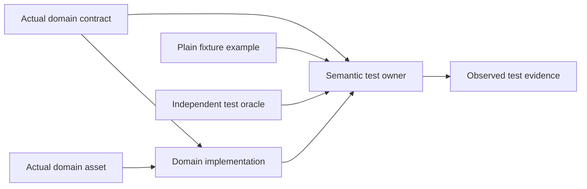

# Canonical Fixture Architecture

Fixture collections contain plain example inputs and expected observations used by tests. They have no executable owner, package, runtime asset mount or independent corpus schema. Runtime payload contracts and real shipped assets belong to actual semantic domain owners. Reusable test adapters, mutation families, guest components and probes have explicit semantic testing owners; they are implementations rather than fixture examples.

Tests may admit an actual payload against its real contract and compare behavior against an independent implementation. They do not admit the entire fixture envelope or freeze its row counts, workload metadata, expected outcomes, source-registration inventory or cancellation trial configuration into another schema. Genuine produced result/progress/diagnostic records remain contracts of their implementation owner. Schema-shaped parser specimens are explicit input data, with separate implementation-code audits checking their use.

The actual current boundary rule is in framework/products/repo/library/discovery. Its60 neutral regression cases cover physical example-owned facets, corpus/expected-case/named embedded authorities, frozen metadata and composed producer/message-copy trial envelopes, with genuine value negative cases. Actual final guard receipt4/0/311 does not imply general validator dataflow soundness. Separate JSON/AST/native cfg/include/computed-reader and filename-schema audits record their own exact bounds and observed gaps; every confirmed gap is closed and receipts preserve prior failures rather than rewrite them.

Representative closures include the user's Hub shipped-fleet and Generation2d/MP4 SQLite example-side schemas; the real i32 host snapshot, Pack literal, actual testing scalar payloads, artifact references and localized controls retained under their semantic owners; and the actual CAD/Infinite assets retained in asset catalogs. Rebuilt Dev output remains an explicit pending end-to-end gate while four stale compiled fixture asset references await canonical publication.

See fixture-canonicalization-completion, objective-completion-audit, current-root-message-copy-and-scalar-reference-closure and independent-final-current-boundary-audit for exact current source and actual test evidence. This architecture record is documentary and changes no runtime or testing policy.
