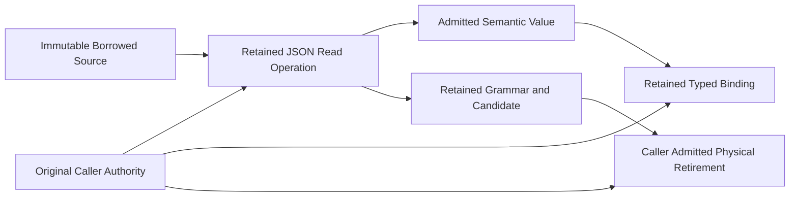

# JSON Read Authority Design

The complete original JSON receiver currently proves the source constructor and exposes the unowned whole-document entrypoint. The latest native baseline has four unchanged convenience-parse failures. The post-effect receipt prerequisite has a genuine exact 74-law native red, a subsequent whole source green and a complete74-law native closure with its new law green (70passed/four unchanged convenience-parse failures). Its receipt scope is accepted; whole JSON remains rejected.

The next coherent API cut will require an original caller read operation. Its constructor binds the immutable source, explicit duplicate-member policy, complete byte/allocation/depth/item limits, original borrowed native control and independently authored total five-axis authority. The operation owns a retained source cursor and cumulative actual receipt. It has no default control, default grant, implicit source limit, demand-funded authority, or synchronous fallback.

Each bounded turn constrains the incoming full turn grant by remaining operation authority. Physical receipt debit occurs on success and on refusal. Work, copied bytes, allocation birth and physical release are cumulative; depth remains a separately enforced bound. Cancellation preserves the exact original source, candidate and grammar. Returning the semantic value does not imply scaffold retirement. The original caller must admit and finish actual grammar/candidate cleanup or retain that continuation. The control and total authority must survive every owner transfer and failed retirement admission without reconstruction.

Typed binding requires the same original control and an explicit retained typed-output owner. The existing `FromValue` synchronous fallback, full-tree projection and decoded guard `Drop` cannot establish that contract. The original input candidate and any partially constructed output must stay under their real owning receiver; a successful semantic result does not excuse hidden allocation or release.

The current read-only census records 218 matching Framework Rust files in 77 receiving domains. It is a per-file current census, not an atomic source snapshot or exact call count. Production and original fixture callers must be hand-ported across that cut; no old overload, compatibility alias, deprecation, migration script, smaller convenience grant, altered semantic oracle, or filtered receiving gate will be introduced. General IO, renderer, Store and Plugin peers continue their independent original ownership cuts concurrently.

This file is an authored design input. It contains no copied tracked source body and makes no implementation or runtime acceptance claim.

The new schema and independent SQLite/Ajv corpus were authored before production. Whole source5 physically closed39230 Nx/Bun1 with8 entered,7 passed/one intended missing-operation defining refusal,93 assertions and19 exact source claims. All six prior source laws and independent UTF8/axis oracle passed. Two original-control native receiving laws were then authored before implementation. The defining operation now binds source and borrowed original control, clamps each turn by cumulative parse authority, records actual success/refusal receipts, and retains grammar and paid physical cleanup under a separate independently authored retirement wallet. These are distinct explicit lifecycles; no parse work credit is recreated on repeated turns or cleanup. API exports are canonical first-party JsonReadOperation/JsonReadPolicy. Whole source/native receiving acceptance is pending. Existing convenience parse/typed/raw grammar frontiers remain open; no legacy overload is introduced or old semantic oracle changed.
