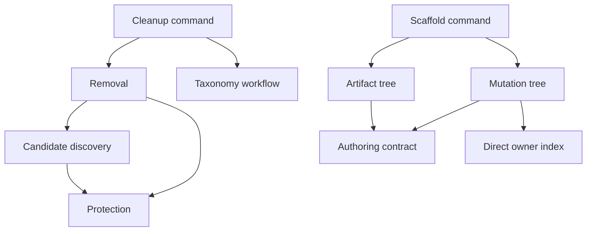

# Root Cleanup and Scaffold Extraction: Independent Acceptance Audit

**Scope.** Read-only audit of the cleanup/scaffold extraction described by `📓️root-clean-scaffold-extraction-packet-2026-09-12.md`. This report covers the eleven extracted owners, their source-as-data and registration consumers, private-fixture containment, and the later zero-touch launch-context repair. It does not authorize or claim a live workspace cleanup, scaffold apply, or Git operation.

## Current owner tree and dependency closure

The fixture and its JSON Schema enumerate exactly eleven anonymous implementation leaves across fifteen role contexts:

| Concern | Owners |
| --- | --- |
| workspace cleanup | `🧼️workspace-cleanup/{🛡️protection,🔍️candidate-discovery,🗑️removal,🎮️command}/🟦️.ts` |
| taxonomy command contract | `🧹️normalization/🎮️command-contract/🔁️workflow/🟦️.ts` |
| artifact authoring | `🏗️authoring/{🧱️contract,🗿️artifact-tree,🧬️mutation-tree,🎮️command}/🟦️.ts` |
| mutation indexing | `🧹️normalization/🧬️mutation/📇️direct-owner-index/🟦️.ts` |
| test output environment | `🏃️process/🌿️environment/🧪️test-output/🟦️.ts` |

The mandatory root command has direct imports for the cleanup command, scaffold command, and direct-owner index; the former extracted declarations are absent. The retained unrelated `authorArtifactScaffold` re-export in `library/🟦️.ts` is outside this extracted-owner set and is not a compatibility facade for it.

My AST import graph found eleven nodes, ten internal edges and no cycle. The test-output owner is intentionally a leaf in this extracted-owner graph:

The source-ownership test verifies the complete role-context map, root declaration removal, eight direct and source-text consumers, immediate owner imports, no root back import, TypeScript resolution, Bun/Nx/package registration, and seed plus generated launch registration. Its fixture names the material consumers: exact-Cargo laws and clean-ticket runs use `CleanScript`; taxonomy cancellation parses the root command and runs the extracted workflow; workspace-contract imports the mutation tree and contains the cleanup source path; artifact authoring dynamically resolves the extracted artifact tree and the test-output owner; package `📜️script.ts` imports the test-output owner directly.

## Private-fixture containment

The filesystem-mutating tests require `SEMIO_TEST_ARTIFACT_DIR`. The authoring test creates only `mkdtemp` children under that root and checks every ancestor with `lstat`, rejecting a missing, non-directory, or symbolic-link ancestor. Its test matrix covers dry and occupied destinations, source changes, cancellation, symlink/dangling-link/changed-parent rejection, and preserves pre-existing content.

The taxonomy cancellation test creates its fixture below `SEMIO_TEST_ARTIFACT_DIR/taxonomy-cli-cancellation`. It hand-materializes deterministic SHA-1 tree and commit objects below that fixture's `.git` directory, then calls only `git rev-parse HEAD` and `git cat-file -t` to verify the handmade baseline. It does not issue a mutating Git command. I did **not** run this route; Sol's result below is confined to that private fixture and is not evidence of a live workspace mutation.

The independent clean-ticket and active-Cargo-lease controls also allocated below my ticket-local audit scratch. The first removed the four intended generated-ticket probes while retaining input material. The second removed no ticket while its exact Cargo lease was active, then removed the disposable generated ticket after the lease ended. Both artificial fixtures reported unavailable cache pruning and caught that condition; neither result establishes cache-prune behavior.

## Launch-context repair and semantic ownership

An earlier ordinary taxonomy-cancellation route failed before test execution when `SEMIO_TEST_ARTIFACT_DIR` was unset. Its VS Code seed entry deliberately provides no environment, and `runTestBudgeted` does not create one. That was an acceptance blocker: an environment-injected Nx run could not establish an ordinary zero-touch launch.

The first repair temporarily put its output-policy body in the mandatory package script. Root correctly rejected that placement: creating a test output path and synthesizing an environment are behavior, not command dispatch. The body now lives in the anonymous semantic owner `🏃️process/🌿️environment/🧪️test-output/🟦️.ts` as `repoTestArtifactEnvironment`; the package script imports it directly and only supplies route names.

With no caller setting, the owner resolves and creates a route-specific directory beneath this ticket's `🗑️generated/sol-root-clean-scaffold-extraction/repo-lib-test-artifacts`; with an explicit setting, it preserves the caller's path and other environment fields. The source-owner control executes the owner through both Bun and TypeScript transpilation. It asserts all five defaults, explicit override and preserved sentinel field, directory creation, the package call sites, and root-free graph closure. I independently reran this current control successfully. The environment owner provides output placement only; the authoring test remains responsible for no-follow ancestor checks.

## Executed evidence

| Route | Invocation and provenance | Result | What it establishes |
| --- | --- | --- | --- |
| root cleanup/scaffold source ownership | Independent direct package command `bun ./📜️script.ts test root-clean-scaffold-source`, with a ticket-local audit artifact root | **7/7, 139 assertions, 4.10 s** | Current ownership contract, two transpiler oracles for the extracted environment owner, type resolution, consumers, graph and registration. |
| root cleanup/scaffold source ownership | Sol's actual registered Nx target `@semio-tech/repo-lib:test-root-clean-scaffold-source` before the helper expansion | **6/6, 111 assertions, 9.5 s** | Earlier registered-target evidence. It predates the current 7/139 semantic-owner control, so it is not claimed as final proof of the environment owner. |
| artifact empty-facet authoring | Independent `bun test` of the isolated fixture under this audit's artifact root | **43/43, 593 assertions, 6.79 s** | Private authoring behavior and containment controls; not a live scaffold operation. |
| clean ticket run | Independent private fixture | **1/1, 5 assertions** | Generated-ticket-only cleanup behavior. |
| active exact-Cargo lease | Independent private fixture, selected control | **1/1, 2 assertions** | Lease protection around a generated ticket; no native Cargo law claim. |
| mutation transaction | Sol focused fixture | **1/1, 45 assertions** | Extracted mutation transaction behavior in its private fixture. |
| taxonomy cancellation | Sol's prior focused fixture with explicitly supplied artifact root | **4/4, 23 assertions** | Historical cancellation evidence before zero-touch closure. |
| taxonomy cancellation, current no-env package route | Sol ordinary package command with `SEMIO_TEST_ARTIFACT_DIR` removed | **4/4, 27 assertions, 3.05 s** | Post-owner-move defaulted output at `…/repo-lib-test-artifacts/taxonomy-cli-cancellation`; handwritten baseline and read-only Git oracles. |
| artifact authoring, current no-env package route | Sol ordinary package command with `SEMIO_TEST_ARTIFACT_DIR` removed | **43/43, 602 assertions, 11.65 s** | Post-owner-move defaulted sibling private output. |
| taxonomy cancellation, current registered Nx route | Sol isolated `bun nx run @semio-tech/repo-lib:test-taxonomy-cli-cancellation --skip-nx-cache` with the environment unset | **4/4, 27 assertions; target 3.9 s, cache skipped** | Actual registered target invokes the semantic owner without a launch-entry environment stanza. |
| exact Cargo, pre-extraction zero-env repair | Sol ordinary package command with `SEMIO_TEST_ARTIFACT_DIR` removed | **26/26, 596 assertions** | Earlier default-output evidence; no final native-Cargo behavior claim. |

The published package scripts call the matching Nx targets. `📋️project.json` declares the root source target inputs over the taxonomy, fixture, schema, owner test, cleanup, authoring, test-output environment, workflow, direct-index and root command sources. The seed and generated launch entries use `bun nx run … --skip-nx-cache` for the individual cancellation and authoring routes, while the source-ownership launch uses its registered target.

## Acceptance outcome

The semantic placement and zero-touch launch condition are now closed: there is no package-script body, the owner sits under process/environment/test-output, and the current direct source control is green. The current ordinary no-env package routes and actual registered Nx route pass from the moved owner; their output remains in the default ticket-local artifact root without a launch-entry environment stanza.

**Accepted within the stated limits.** The extraction has an implementation-neutral eleven-owner taxonomy, no owner cycle or mandatory-root implementation copy, current source/data consumers and launch registration, and bounded private-fixture evidence for containment, cancellation, cleanup and authoring.

## Limits

I did not run the private cancellation fixture, a live cleanup, a live scaffold apply, the broad workspace-contract suite, or a global Nx graph. No result here claims native Cargo behavior, cache pruning, or external filesystem effects. The cleanup controls were deliberately private fixtures with ticket-local output roots.

## Final Current-Target Delta

The executor’s post-format, isolated results complete the preliminary evidence cited above: direct ownership route **7/7, 140 assertions** in 11.54 seconds; actual cache-skipped Nx '@semio-tech/repo-lib:test-root-clean-scaffold-source' **7/7, 140 assertions**, 23.51 seconds overall (target 24.8 seconds); root compiler **6/6, 86 assertions** in 4.46 seconds; and ordinary unset-environment taxonomy cancellation **4/4, 27 assertions** in 7.73 seconds. The executor reports direct root imports green and its scratch removed. This audit did not rerun those commands.
