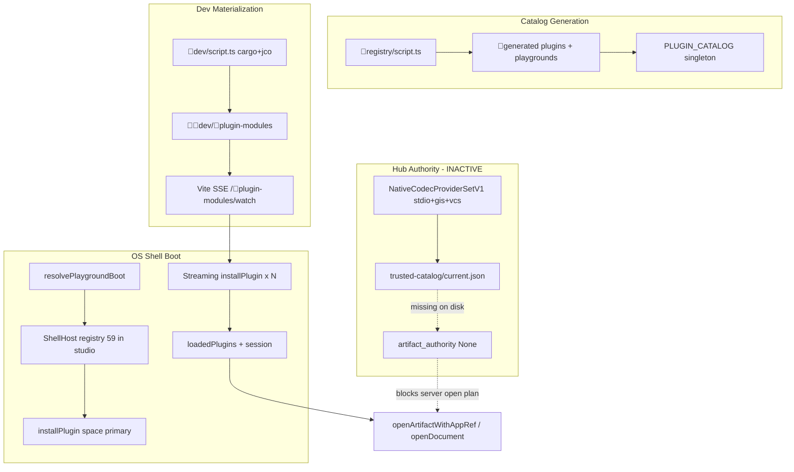

# OS-as-Frontend Plugin and Artifact End-to-End Audit

**Date:** 2026-09-09  
**Scope:** Working tree only (no ticket markdown treated as proof)  
**Question:** Does the OS-as-frontend currently load ALL plugins and artifacts end-to-end as a working product (not isolated tests)?

## Executive Verdict

**No.** The OS shell architecture is designed to host the full 59-entry plugin/extension registry in studio (`space` / variant `s`) host mode, and the dev runner has materialized 58 of 59 wasm modules on disk. However, the product is **not** end-to-end complete today:

| Layer | Status |
|-------|--------|
| Registry enumeration | 59 plugins/extensions declared |
| Descriptor trust (hashes committed) | 40 / 59 |
| Dev wasm materialization (`🔌️plugin-modules`) | 58 / 59 built; 3 load-breaking gaps |
| Studio shell boot intent | All 59 registered; primary boot is `space` only |
| Hub trusted native codec catalog | **Not published** (no `trusted-catalog/current.json` on disk) |
| Artifact definitions in source | 87 `📜️artifact-definition.json` files |
| Openable from OS shell (all kinds) | **Not provable**; blocked at catalog, materialization, and descriptor layers |

The OS frontend is a **partially wired studio** with strong boot/streaming mechanics, not a fully loaded, fully openable product surface.

---

## Methodology

Inspected (read-only):

- `🧰️framework/🛍️products/💻️os` — shell, renderer `ShellHost`, plugin registry, dev runner, vite plugins
- `✏️s/🔌️plugins` — all 29 top-level plugin manifests + extension tree
- Generated registry outputs under `🔨️modules/🔌️plugin/📇️registry/🤖️generated/`
- On-disk dev materialization at `🔨️modules/🧑‍💻dev/🔌️plugin-modules`
- Hub artifact authority at `🌎️hub/🗿️artifact-authority/` and `🌎️hub/📦️packages/🦀️rust/🚀️bin.rs`
- `catalog-complete` test contract in `🔨️modules/🔌️plugin/📇️registry/🧪️tests/✅️catalog-complete/🟦️.ts`

Did **not** run builds, dev servers, or browser sessions (audit is static tree inspection).

---

## Plugin Inventory

### Top-level plugins (`✏️s/🔌️plugins/*/🔣️.json`)

29 directories with root manifests. The **registry** (`🤖️generated/🔌️plugins.json`) lists **59** entries: 32 plugins + 27 extensions (CAD/flow/imperative/process/sourcing/playbook families).

### Host plugin

Only **`space`** declares `[package.metadata.semio].host`:

- `landingAppId: "home"`, `hostAppId: "studio"`
- Playground variant: **`s`** (ports react 6070, wgpu 6066)
- Source: `🔨️modules/🔌️plugin/📇️registry/🤖️generated/🧩️plugins.ts` → `PLUGIN_HOST_CONFIGS`

Studio mode is the intended “load everything” OS-as-frontend entry.

---

## How the Live Catalog Is Generated

### 1. Discovery and generation (`📇️registry/📜️script.ts`)

- Walks `✏️s/🔌️plugins` Cargo manifests, playground metadata, extension `extends` edges
- Emits:
  - `🤖️generated/🔌️plugins.json` — full registry with optional `hashes`
  - `🤖️generated/🧩️plugins.ts` — `PLUGIN_BUILD_TARGETS`, `EXTENSION_TARGETS`, `pluginModuleUrl()`
  - `🤖️generated/🎮️playgrounds.ts` — per-variant ports, apps, assets
  - `📦️deployment/🗺️catalog.json` — 59 module directory names (emoji paths)
  - `.vscode/launch.json` via `🖥️launch.ts`

### 2. Product catalog singleton (`📇️registry/🟦️.ts`)

```ts
export const PLUGIN_CATALOG: PluginCatalog = buildPluginCatalog();
```

Imported by `ShellHost`, dev runner, WGPU frame worker, kernel `resolvePlaygroundBoot`.

### 3. Descriptor trust boundary

`catalog-complete` (`📜️script.ts` + `🧪️tests/✅️catalog-complete/🟦️.ts`) requires per-owner:

- `🔣️.json` + `🛂️.descriptor.semio` pair
- Matching wasm/core/descriptor SHA-256 receipts from an isolated build root
- Dependency-first verification; **withholds all publication on any parent failure**

**Current registry hash coverage: 40 / 59.**

#### 19 entries without committed `hashes` (no trusted descriptor pair in generated registry)

```
block
flow-extension-bim, flow-extension-draw
imperative-extension-control, imperative-extension-effect, imperative-extension-logic,
  imperative-extension-math, imperative-extension-text
playbook, playbook-module-procedural
process-extension-concrete, process-extension-metal, process-extension-robotic, process-extension-wood
sourcing-module-beams, sourcing-module-slabs, sourcing-module-windows
stdio
trinity
```

The `catalog-complete` unit test independently confirms this same 19-entry missing-pair set (`auditPluginCatalogSources`).

Additional gate failures documented in ticket `📋️master-plan.md` (not re-run here): 4 CAD placeholder identities, 8 semantic JSON/pack mismatches — **0 rows published** through `catalog-complete`.

---

## How Plugins Are Installed and Consumed at OS Boot

### Dev runner entry (`🔨️modules/🧑‍💻dev/🟦️.ts`)

1. `resolvePlaygroundBoot(PLUGIN_CATALOG, variant, PLAYGROUND_SESSION)`
2. React path: `bootFrameworkOs({ plugin: variant, plugins: boot.plugins, ... })`
3. WGPU path: separate native entry (not booted from this file when `VITE_SEMIO_RENDERER !== "react"`)

### Playground resolution (`🧰️framework/🔨️modules/🎠️kernel/🟦️.ts`)

- **Studio / host mode** (`space` / `s`): `hostMode = true` → `expandPluginRegistry` returns **all** catalog plugins + extensions (59 entries)
- **Standalone variant** (e.g. `puzzle3d`): only primary plugin + `consumes`/`contributes` closure — **not** full OS

`validatePlaygroundSessions` in `📜️script.ts` asserts studio session plugin count === total registry count.

### ShellHost boot sequence (`🏛️ShellHost/🟦️.tsx`)

1. **Registry expansion** — `expandPluginRegistry(plugins, primaryId, hostMode)` (lines ~2929–2933)
2. **Primary plugin** — `space` in studio; must load before session exists (lines ~2936–2939, 3823–3836)
3. **Plugin source** — `multiplexPluginSources(createDevPluginSource(...), createExtensionSource(...))` (line ~2945)
4. **Streaming install** — SSE `/🔌️plugin-modules/watch` snapshot + per-build `built` events; bounded concurrency queue (lines ~3838–3890)
5. **Per-plugin load** — `installPlugin` → `pluginSource.moduleUrl` → `loadPluginModuleResilient` → shard pool wasm (lines ~3036–3079)

**Design intent:** Boot is **not** blocked on all 59 crates; only the primary (`space`) is fatal. Others stream in asynchronously. This is correct for dev ergonomics but means “all plugins loaded” is a **post-boot race**, not an atomic guarantee at first paint.

### Dev materialization (`🔨️modules/🧑‍💻dev/📦️packages/🟦️typescript/📜️script.ts`)

- Cargo build → jco transpile → write under `🔨️modules/🧑‍💻dev/🔌️plugin-modules/<emoji-dir>/`
- Required load surface: `🌉️bridge.js` (`MODULE_BRIDGE_FILE` in `📦️deployment/🟦️.ts`)
- Vite serves static modules + hot-swap SSE (`🔌️vite-plugins.ts`)

### On-disk materialization audit (2026-09-09 working tree)

| Metric | Value |
|--------|-------|
| Registry entries | 59 |
| Directories under `🧑‍💻dev/🔌️plugin-modules` | 58 plugin dirs + `🧵️shard` + `🪞️vendor` + `♻️hot-swap.json` |
| Missing directory | **`layout`** (`📏️layout`) |
| Missing `🌉️bridge.js` (load-breaking) | **`draw`**, **`energy`** |
| Built with bridge (including no-hash entries) | 56 |

**Draw/energy** have `semio_s_plugin_*_component.js` and `.wasm` but **no** `🌉️bridge.js` — `pluginModuleUrl()` points at the bridge; `installPlugin` will fail module fetch for these two even though partial artifacts exist.

**Layout** has a full owner `🔣️.json` at `✏️s/🔌️plugins/📏️layout/🔣️.json` and committed registry hashes, but **no** materialized module directory at all.

---

## Native Codec Catalog and Package Bindings

### Hub provider set (current code — not empty)

`🌎️hub/🗿️artifact-authority/📇️native-openable-provider/🦀️.rs`:

- `NativeCodecProviderSetV1::linked()` → **stdio + gis + vcs**
- `NATIVE_OPENABLE_PROVIDER_SET_V1_RECEIPTS = 29` (26 stdio + GIS + VCS)

`🌎️hub/📦️packages/🦀️rust/Cargo.toml` default features include `native-artifact-execution` linking those crates.

### Runtime activation (still absent in this workspace)

`🚀️bin.rs` `configured_artifact_authority()`:

- Calls `TrustedCatalogLoader::load_current(data_dir, providers, ...)`
- Returns `Ok(None)` when **no published catalog** exists
- Checked path: `.🧬semio/🌐hub/trusted-catalog/` — **directory absent** in working tree

Therefore at hub startup today:

- `artifact_authority` = `None`
- `open_plan_ready` = `false`
- No `OpenableDocumentCatalog` for server-side document open / creation authority

**The native codec *provider code* is linked; the trusted catalog *publication* is not present on disk.** This is the distinction from older “empty `linked_native_codec_bindings`” ticket notes — providers exist, but **zero installed package bindings are active** without `trusted-catalog/current.json` + bundle publication.

### stdio plugin registry status

- Listed in registry **without** `hashes`
- Wasm materialized under `🗄️stdio/` with bridge
- Hub can preview stdio bindings **if** a trusted bundle is published and descriptor manifest passes `validate_native_codec_artifact_kinds`
- `catalog-complete` and stdio-specific audits document wasm-component size limits and incomplete codec admission — not re-verified by execution here

### GIS / VCS

- **GIS** has committed descriptor hashes and materialized module; native codec receipts exist in crate (`semio_s_plugin_gis::native_codecs`)
- **VCS** has hashes + materialization; 1 provider receipt in hub set
- **gisterrain** and other composed GIS artifacts: source has codecs; hub open path still requires published trusted catalog generation

---

## Artifact Surface vs What the Shell Can Open

### Source artifact definitions

- **87** `📜️artifact-definition.json` files under `✏️s/🔌️plugins` (51 under `🗄️stdio/🗿️artifacts` alone)
- Norm plugin: 16 norm artifact definitions
- Many plugins declare `ArtifactKindSpec` / `NativeCodecs` in Rust but **package-level `manifest.artifactKinds` is often empty** in emitted descriptors (known projection gap; see ticket `📓️terra-plugin-artifact-runtime-census.md` for mechanism)

### Plugin activation and document write

| Category | Count | Implication |
|----------|-------|-------------|
| With `activationEvents` | 28 | Primary document-kind routing |
| Without `activationEvents` | 31 | Extensions, stdio, trinity, demonstrator, block, etc. |
| Without `documents.write` capability | 31 | Cannot own document persistence via standard capability |

Extensions (flow-*, imperative-*, process-*, sourcing-*, cad-extension-*) are **contributors** loaded into host sessions, not standalone document owners.

### Shell artifact opening path (`ShellHost`)

1. **Primary session** — `establishPrimarySession` / `openArtifactWithAppRef` (lines ~2950–3005, 6419–6445)
2. **Requires** target plugin in `loadedPlugins` (install on demand)
3. **Requires** `manifest.apps` entry matching `AppRef`
4. **Document backbone** — `openDocument` via backbone worker; directory bootstrap, artifact bootstrap progress/failure events
5. **Space artifact creation** — `runArtifactCreationReadyOpeningV1` waits for `catalogGenerationId` match (`🌱️artifact-creation/🚪️ready-opening/🟦️.ts`)

Opening is **not** a simple “double-click file” for stdio formats without hub catalog + plugin routing. Browser shell uses wasm manifests; hub path needs trusted catalog publication.

---

## Plugins/Artifacts That Cannot Open from the OS Shell Today

### A. Cannot load wasm module (immediate shell failure)

| Plugin | Blocker | Path |
|--------|---------|------|
| `layout` | No materialized module directory | `🔨️modules/🧑‍💻dev/🔌️plugin-modules/📏️layout` missing |
| `draw` | No `🌉️bridge.js` | `.../🖍️draw/` has wasm/js only |
| `energy` | No `🌉️bridge.js` | `.../🔋️energy/` has wasm/js + descriptor files only |

### B. Loadable wasm but no trusted registry descriptor (catalog gate)

All **19** no-hash entries — shell may load wasm from dev cache, but they are **excluded from trusted catalog publication** and fail `catalog-complete`. Includes **`stdio`**, **`trinity`**, **`block`**, all imperative/flow/process/sourcing extensions listed above.

### C. Cannot open documents via hub authority (server path)

- **All stdio format artifacts** (~51 kinds) — no published trusted catalog
- **GIS map/terrain** — provider linked, no published catalog generation on disk
- **VCS documents** — same
- **Every other plugin-owned artifact kind** not in stdio/gis/vcs native provider set — no hub native binding at all (remaining ~50+ plugin kinds)

### D. Standalone playground variants (not full OS)

Launching e.g. `puzzle3d`, `cad`, `flow` loads **only** the filtered plugin closure, not all 59. Only variant **`s`** (space studio) represents full OS-as-frontend.

### E. Extensions without host parent loaded

Extensions require host plugin (`flow`, `imperative`, `cad`, `process`, `sourcing`, `playbook`). If host fails or is not in registry expansion, extension install succeeds but contributions are inert (`pluginShouldReceiveContributions`).

### F. Known semantic / placeholder descriptor defects (catalog-complete withheld)

From registry audit documentation (not re-executed):

- CAD extensions with placeholder identity (`cad-extension-spatial-shape` version `0.0.0` pattern)
- JSON/pack mismatches: architect, demonstrator, energy, imperative, mathematical, procedural, sourcing, writer

These may load in dev with stale materialization but **fail strict verification**.

---

## Architecture Diagram (Current Boot)



---

## Remaining Concrete Blockers (with paths)

### P0 — Product cannot claim “all plugins load”

1. **Layout not materialized**  
   `✏️s/🔌️plugins/📏️layout/📦️packages/🦀️rust` → missing `🔨️modules/🧑‍💻dev/🔌️plugin-modules/📏️layout/`

2. **Draw and energy missing bridge**  
   `🔨️modules/🧑‍💻dev/🔌️plugin-modules/🖍️draw/`, `.../🔋️energy/` — no `🌉️bridge.js`; materialize step incomplete or stale

3. **19/59 descriptor pairs not catalog-complete**  
   `🔨️modules/🔌️plugin/📇️registry/🤖️generated/🔌️plugins.json` (entries without `hashes`)  
   Gate: `🔨️modules/🔌️plugin/📇️registry/📜️script.ts` → `catalog-complete`

### P0 — Product cannot claim “all artifacts open”

4. **No published hub trusted catalog**  
   Expected: `.🧬semio/🌐hub/trusted-catalog/current.json` + bundle  
   Loader: `🌎️hub/🗿️artifact-authority/🔏️trusted-catalog/🦀️.rs` `load_current`  
   Startup: `🌎️hub/📦️packages/🦀️rust/🚀️bin.rs` `configured_artifact_authority`

5. **Descriptor `artifactKinds` projection gap**  
   Builder: `🔨️modules/🔌️plugin/🏗️builder/🦀️.rs` — plugin-level `artifact_kinds` not always populated from `ArtifactKindSpec`  
   Breaks trusted-catalog manifest ↔ native codec bijection for most plugins

6. **stdio plugin not registry-trusted**  
   `✏️s/🔌️plugins/🗄️stdio/` — no committed hashes; hub stdio admission blocked at catalog-complete layer

### P1 — Studio boot is eventual, not atomic

7. **Streaming plugin install race**  
   `🔨️modules/📺️renderer/.../🏛️ShellHost/🟦️.tsx` lines 3838–3890 — non-primary plugins load after UI is up

8. **No automated “all 59 loaded” gate in ShellHost**  
   Only primary failure sets `ui.common.noPluginsLoaded`; dependency plugins fail silently to console

### P1 — Extension/host dependency graph

9. **31 entries lack `activationEvents`** — rely on host loading order and `contributes`/`consumes` graph  
   Resolver: `🧰️framework/🔨️modules/🎠️kernel/🟦️.ts` `expandPluginRegistry`

---

## Evidence That Would Prove OS Frontend Works with All Plugins/Artifacts

### Plugin load proof (browser studio)

1. Launch **`s`** variant (space studio) via registered `launch.json` dev entry (`🛠️dev...⚛️react` for variant `s`)
2. After stable state, assert `loadedPlugins.length === 59` (or registry length) via Shell debug surface or instrumented `registerLoadedPlugin` events
3. For each `pluginId` in `🤖️generated/🔌️plugins.json`:
   - `pluginStatusById[pluginId] === "loaded"` and supervisor `"running"` or `"loaded"`
   - Successful `fetch(/🔌️plugin-modules/<dir>/🌉️bridge.js)` (200)
4. **Negative check:** `draw`, `energy`, `layout` must be fixed before this proof can pass

### Catalog trust proof

5. `bun nx run @semio-tech/plugin-registry:catalog-complete --build-root <fresh absolute path>` exits 0 with `publication: "committed"` and 59/59 verified
6. `🤖️generated/🔌️plugins.json` — every entry has non-empty `hashes` object

### Hub artifact authority proof

7. Publish trusted catalog bundle to `.🧬semio/🌐hub/trusted-catalog/`
8. Start hub; `hub_readiness` shows `artifactAuthority: true`, `openPlan` with `open_target_count > 0`
9. `TrustedCatalogLoader::load_current` returns `Some(VerifiedTrustedCatalog)`

### Per-artifact open proof (minimum matrix)

10. **One native-backed kind per provider:** stdio JSON viewer, GIS gismap editor, VCS document editor — open from space studio UI through full `openDocument` → bootstrap → snapshot-replaced
11. **One wasm-only plugin kind per family:** cad, puzzle, flow, norm, writer — open example document from playground catalog or space file picker
12. **One extension chain:** flow + flow-extension-text node graph — host and extension both `loaded`
13. **Two-peer journey:** hub + two studio shells, same space, artifact creation → ready opening → both see document (ticket acceptance frontier; not evidenced in tree)

### Regression gates to keep green

14. `validatePlaygroundSessions` — studio plugin count === 59  
15. `🧪️tests/✅️catalog-complete` — independent 19 missing-pair enumeration stays at 0 after fix  
16. Renderer `ShellHost` contract tests for `installPlugin` / artifact creation catalog mount

---

## Highest-Leverage Next Implementation Lane

**Lane: Complete the descriptor/catalog-complete publication chain for stdio + dual-artifact emitter, then publish the first hub trusted catalog generation.**

Rationale:

1. **Unblocks the widest artifact surface** — 51 stdio artifact definitions and all foreign-format open paths depend on trusted native codec catalog, not wasm plugin load alone.
2. **Removes the 19-entry missing-pair cluster** — stdio is zero-dependency; playbook/trinity/block and extension `.sxt`-only owners share the same descriptor-pair / raw-vs-core emitter repair documented in `catalog-complete` and ticket `📓️sol-stdio-catalog-root-completion.md`.
3. **Activates already-linked hub providers** — `NativeCodecProviderSetV1` (stdio+gis+vcs) is compiled; only publication + descriptor `artifactKinds` projection is missing.
4. **Parallel quick win (dev shell):** Re-run materialize for `layout`, `draw`, `energy` via `@semio-tech/framework-os-dev:build-inputs` or per-variant `prepare-*` targets — fixes 3 immediate `installPlugin` failures without waiting for catalog-complete.

**Secondary lane (after P0 catalog):** Studio “all plugins loaded” acceptance test — host variant `s`, wait for plugin SSE snapshot + queue drain, assert 59/59 `loaded` before enabling artifact creation UI.

**Defer:** Per-plugin browser E2E for all 87 artifact kinds until catalog generation and `open_target_count` cover the declared closure.

---

## Summary Table

| Question | Answer |
|----------|--------|
| Does registry list all plugins? | Yes — 59 |
| Does studio mode *intend* to load all? | Yes — `hostMode` + 59 registry rows |
| Are all wasm modules materialized? | No — 58/59; layout missing; draw/energy broken |
| Are all descriptors catalog-trusted? | No — 40/59 with hashes |
| Is hub native catalog active? | No — no `trusted-catalog` on disk |
| Can all artifacts open from shell? | No — blocked at hub catalog, descriptor projection, and 3 load failures |
| Is this isolated-test-only? | Largely yes for full product claim; individual plugins have passing unit/integration tests |

---

## Key File References

| Concern | Path |
|---------|------|
| Registry generator | `🧰️framework/🛍️products/💻️os/🔨️modules/🔌️plugin/📇️registry/📜️script.ts` |
| Generated registry | `.../🤖️generated/🔌️plugins.json`, `🧩️plugins.ts`, `🎮️playgrounds.ts` |
| PLUGIN_CATALOG | `.../📇️registry/🟦️.ts` |
| Shell boot + streaming | `.../📺️renderer/.../🏛️ShellHost/🟦️.tsx` |
| Dev materialization | `.../🧑‍💻dev/📦️packages/🟦️typescript/📜️script.ts` |
| Dev module root | `.../🧑‍💻dev/🔌️plugin-modules/` |
| Playground boot resolver | `🧰️framework/🔨️modules/🎠️kernel/🟦️.ts` |
| catalog-complete gate | `.../📇️registry/🧪️tests/✅️catalog-complete/🟦️.ts` |
| Hub providers | `🌎️hub/🗿️artifact-authority/📇️native-openable-provider/🦀️.rs` |
| Hub startup | `🌎️hub/📦️packages/🦀️rust/🚀️bin.rs` |
| Space host plugin | `✏️s/🔌️plugins/🪐️space/📦️packages/🦀️rust` |
