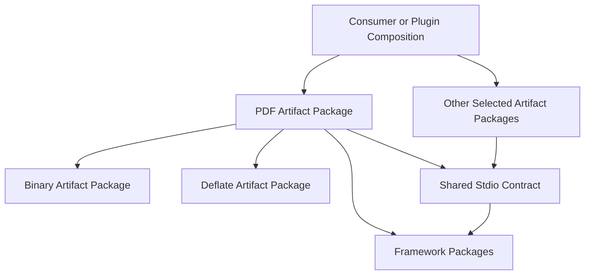

# Artifact Package Composition Guide

## Daily Development

Use the existing launch entry **📦️artifact package target**. Enter `@semio-tech/stdio-pdf-rs` for the Rust PDF package or `@semio-tech/stdio-pdf` for its TypeScript package, then choose build, check, or test. The launch entry calls Nx, whose target calls the package-local `📜️script.ts` router. **📦️artifact package contract** validates repository package ownership and dependency direction.

## Ownership

For PDF, package manifests, Nx declarations, and command routers live under `✏️s/🔌️plugins/🗄️stdio/🗿️artifacts/📖️pdf/📦️packages/`. The Rust library path is `../../🦀️.rs`; schemas, standards, codecs, fixtures, and tests remain beneath the PDF artifact's domain tree. TypeScript publishes the corresponding domain implementation through generated `dist` outputs. Generated build files do not become implementation authority.

## Rust Consumers

A workspace consumer selects `semio-s-artifact-stdio-pdf = { workspace = true }` as a normal dependency. The artifact exposes its snapshot, mutation, diff, definition, format descriptors, native codec factories, and contribution. It does not require the stdio parent plugin as a dependency. The retained consumer fixture in `🧪️native-pdf-consumer` demonstrates public metadata and standalone definition construction.

The stdio parent remains the full plugin composition. Its `full-artifact-catalog` feature selects the complete format catalog; `home-io` selects the smaller home integration set. Consumers that only need a format can depend on that format directly. Semio cross-format conversions have explicit `conversion-*` features.

## Nx Outputs And Cache

Native builds publish an owned dependency closure at the package's `dist/build`; TypeScript outputs include JavaScript, declarations, and referenced JSON or handwritten declaration sidecars. Nx inputs include the domain sources and actual command routers. Changes to shared framework code or workspace Cargo declarations can legitimately invalidate a format build. Sibling artifact isolation and output restoration are acceptance gates recorded in `📓️native-pdf-cache-proof.md`; see that live report for their current status.

This guide describes the verified package declarations and launch routes. It does not claim a before/after cold compile benchmark or a passing aggregate native suite.
